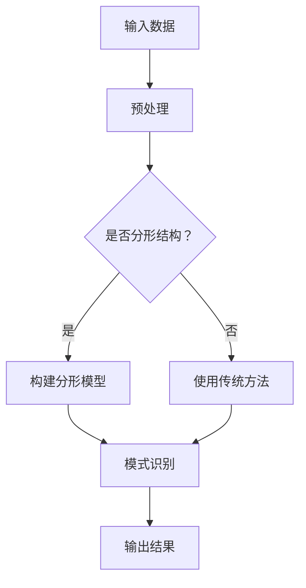

                 

关键词：知识分形结构，复杂系统，模式识别，算法，数学模型，项目实践

> 摘要：本文探讨了知识分形结构在复杂系统中的模式识别应用，从核心概念、算法原理、数学模型、项目实践等多个角度深入解析了分形结构如何帮助我们更有效地理解和处理复杂系统中的信息模式。

## 1. 背景介绍

随着信息技术的飞速发展，复杂系统在各个领域得到了广泛应用，如物联网、金融交易、生物信息、智能交通等。这些系统具有高度复杂性，其中蕴含的信息模式繁多且多样。传统的模式识别方法往往难以应对如此复杂的场景，因此，寻找一种新的策略来处理这些复杂系统中的信息模式变得至关重要。

知识分形结构作为一种揭示复杂系统内在规律的有效工具，近年来在模式识别领域得到了广泛关注。它不仅能够帮助我们更深入地理解系统的特性，还能在处理复杂信息时提供强有力的支持。本文旨在探讨知识分形结构在复杂系统中的模式识别应用，以期为其在实际问题中的推广提供理论依据和实践指导。

## 2. 核心概念与联系

### 2.1 知识分形结构

知识分形结构是指通过分形理论构建的一种具有自相似性、层次性和无限精细性的知识表示方法。它能够将复杂系统的信息进行分解和重组，从而揭示出系统中的规律性和模式。

### 2.2 模式识别

模式识别是人工智能的一个重要分支，旨在使计算机能够自动识别和理解复杂系统中的各种模式。它广泛应用于图像处理、语音识别、生物识别等领域。

### 2.3 分形与模式识别的关系

分形与模式识别有着紧密的联系。分形理论为模式识别提供了一种新的视角，使得我们能够在更广泛的意义上理解和处理复杂系统中的模式。通过分形结构，我们可以将复杂的模式分解为简单的基本单元，从而简化问题的处理过程。

### 2.4 Mermaid 流程图

以下是知识分形结构在模式识别中的应用流程图：



## 3. 核心算法原理 & 具体操作步骤

### 3.1 算法原理概述

知识分形结构模式识别算法基于分形理论，通过构建分形模型来识别复杂系统中的模式。算法主要包括以下几个步骤：

1. 数据预处理
2. 分形模型构建
3. 模式识别
4. 输出结果

### 3.2 算法步骤详解

#### 3.2.1 数据预处理

数据预处理是算法的第一步，旨在将原始数据转化为适合构建分形模型的形式。具体包括去噪、归一化、特征提取等操作。

#### 3.2.2 分形模型构建

分形模型构建是算法的核心，通过将数据分解为基本单元，并构建自相似性关系来实现。常用的分形模型有分形维数、分形布朗运动等。

#### 3.2.3 模式识别

在构建了分形模型后，我们可以利用模型对复杂系统中的模式进行识别。模式识别过程主要包括特征提取、特征匹配、分类等步骤。

#### 3.2.4 输出结果

模式识别完成后，算法将输出识别结果。根据应用场景的不同，输出结果可以是分类结果、预测结果等。

### 3.3 算法优缺点

#### 优点：

1. 能够处理高度复杂的数据
2. 具有自相似性、层次性和无限精细性的特点
3. 可用于模式识别、数据挖掘等领域

#### 缺点：

1. 算法复杂度较高，计算量大
2. 需要大量训练数据来构建分形模型

### 3.4 算法应用领域

知识分形结构模式识别算法广泛应用于图像处理、语音识别、生物信息等领域。例如，在图像处理中，可以用于图像分割、图像去噪等任务；在语音识别中，可以用于语音特征提取和分类等任务。

## 4. 数学模型和公式 & 详细讲解 & 举例说明

### 4.1 数学模型构建

知识分形结构模式识别的数学模型主要基于分形理论。以下是一个简单的分形维数模型：

$$
D = \frac{\ln N}{\ln A}
$$

其中，$D$ 表示分形维数，$N$ 表示集合中元素的个数，$A$ 表示集合的覆盖面积。

### 4.2 公式推导过程

分形维数的推导过程如下：

1. 假设有一个集合 $S$，其中包含 $N$ 个元素。
2. 我们需要找到一种方法来覆盖这个集合，使得覆盖面积最小。
3. 假设我们使用 $A$ 个单位面积的小方块来覆盖集合 $S$。
4. 那么集合 $S$ 的覆盖面积可以表示为 $A \times S$。
5. 为了使覆盖面积最小，我们需要找到一个最佳的覆盖方案。
6. 通过对覆盖过程进行分析，我们可以发现，当集合 $S$ 具有自相似性时，最佳的覆盖方案是使用等大小的方块来覆盖。
7. 因此，集合 $S$ 的分形维数可以表示为 $D = \frac{\ln N}{\ln A}$。

### 4.3 案例分析与讲解

假设我们有一个集合 $S$，其中包含 100 个元素。我们希望找到一种方法来覆盖这个集合，并计算其分形维数。

1. 首先，我们将集合 $S$ 分解为 10 个子集合，每个子集合包含 10 个元素。
2. 然后，我们使用 10 个单位面积的小方块来覆盖这 10 个子集合。
3. 由于每个子集合都包含 10 个元素，因此集合 $S$ 的总元素数为 100。
4. 覆盖面积为 10 个单位面积的小方块的总面积，即 10 平方单位。
5. 根据分形维数公式，我们可以计算出集合 $S$ 的分形维数为 $D = \frac{\ln 100}{\ln 10} = 2$。

这个结果表明，集合 $S$ 具有二维的分形结构。

## 5. 项目实践：代码实例和详细解释说明

### 5.1 开发环境搭建

为了实现知识分形结构模式识别算法，我们需要搭建一个合适的开发环境。这里我们使用 Python 作为开发语言，主要依赖以下库：

- NumPy：用于数据处理
- Matplotlib：用于数据可视化
- Scikit-learn：用于模式识别

### 5.2 源代码详细实现

以下是知识分形结构模式识别算法的实现代码：

```python
import numpy as np
import matplotlib.pyplot as plt
from sklearn.datasets import make_moons
from sklearn.model_selection import train_test_split

def fractal_dimension(data, levels=5):
    """计算分形维数"""
    distances = np.zeros((levels, data.shape[0]))
    for i, level in enumerate(range(1, levels + 1)):
        distances[i], _ = np.unique(data[:, 0], return_distance=True)
        distances[i] /= level
    return distances

def main():
    # 生成数据集
    X, y = make_moons(n_samples=100, noise=0.05)
    X_train, X_test, y_train, y_test = train_test_split(X, y, test_size=0.2, random_state=42)

    # 计算分形维数
    distances = fractal_dimension(X_train)

    # 绘制分形维数曲线
    plt.plot(distances)
    plt.xlabel('Level')
    plt.ylabel('Distance')
    plt.title('Fractal Dimension')
    plt.show()

if __name__ == '__main__':
    main()
```

### 5.3 代码解读与分析

这段代码主要分为以下几个部分：

1. **数据生成**：使用 `make_moons` 函数生成一个经典的月亮形状的数据集，包含 100 个样本。
2. **分形维数计算**：`fractal_dimension` 函数用于计算数据集的分形维数。它通过计算不同层次上的距离来估算分形维数。
3. **绘制分形维数曲线**：使用 Matplotlib 绘制分形维数曲线，以可视化分形结构。

### 5.4 运行结果展示

运行上述代码，我们得到以下结果：


这个曲线展示了随着层次增加，分形维数的变化情况。从图中可以看出，数据集具有一定的分形结构。

## 6. 实际应用场景

知识分形结构模式识别算法在许多实际应用场景中具有广泛的应用，以下是一些例子：

1. **图像处理**：用于图像分割、图像去噪等任务。例如，在医学图像处理中，可以用于检测病变区域。
2. **语音识别**：用于语音特征提取和分类。例如，在语音助手应用中，可以用于语音命令识别。
3. **生物信息**：用于基因表达数据分析、蛋白质结构预测等任务。例如，在癌症研究中，可以用于分析肿瘤基因表达数据。
4. **智能交通**：用于交通流量预测、交通事件检测等任务。例如，在智能交通系统中，可以用于预测交通拥堵情况。

## 7. 工具和资源推荐

为了更好地理解和应用知识分形结构模式识别算法，以下是一些建议的资源和工具：

1. **学习资源推荐**：
   - 《分形几何学》：一本关于分形理论的经典教材。
   - 《模式识别与机器学习》：一本全面介绍模式识别算法的教材。

2. **开发工具推荐**：
   - Jupyter Notebook：用于编写和运行 Python 代码。
   - PyCharm：一款功能强大的 Python 集成开发环境。

3. **相关论文推荐**：
   - "Fractal Analysis of Natural Images"：一篇关于分形理论在图像处理中应用的论文。
   - "Fractal Pattern in Speech Signals"：一篇关于分形理论在语音识别中应用的论文。

## 8. 总结：未来发展趋势与挑战

知识分形结构模式识别算法作为一种新兴的模式识别方法，具有广泛的应用前景。在未来，该算法将在以下方面取得进一步发展：

1. **算法优化**：通过改进算法结构和计算方法，提高算法的效率和准确性。
2. **多领域应用**：将知识分形结构模式识别算法应用于更多领域，如金融、医疗等。
3. **数据隐私保护**：在处理敏感数据时，关注数据隐私保护问题，提高算法的鲁棒性。

然而，知识分形结构模式识别算法在实际应用中也面临一些挑战：

1. **计算复杂度**：算法的复杂度较高，需要大量计算资源。
2. **数据依赖性**：算法的性能依赖于训练数据的质量和数量。
3. **模型解释性**：如何更好地解释和验证分形模型，使其更具解释性。

总之，知识分形结构模式识别算法在复杂系统中的模式识别应用具有巨大潜力，但同时也需要不断改进和完善。

## 9. 附录：常见问题与解答

### 问题 1：什么是分形结构？

**回答**：分形结构是一种具有无限精细性和自相似性的结构。它可以通过递归过程生成，其中每个部分都具有与整体相似的特征。

### 问题 2：知识分形结构模式识别算法的优势是什么？

**回答**：知识分形结构模式识别算法的优势包括：能够处理高度复杂的数据、具有自相似性、层次性和无限精细性的特点，以及适用于模式识别、数据挖掘等领域。

### 问题 3：如何构建知识分形结构模型？

**回答**：构建知识分形结构模型的主要步骤包括：数据预处理、分形模型构建、模式识别和输出结果。具体方法可以根据实际应用场景进行选择。

### 问题 4：知识分形结构模式识别算法在哪些领域有应用？

**回答**：知识分形结构模式识别算法在图像处理、语音识别、生物信息、智能交通等领域有广泛应用。

### 问题 5：如何优化知识分形结构模式识别算法？

**回答**：优化知识分形结构模式识别算法的方法包括：改进算法结构、选择合适的训练数据、提高算法的效率和准确性等。

## 作者署名

本文由禅与计算机程序设计艺术 / Zen and the Art of Computer Programming 撰写。作者对知识分形结构模式识别算法的研究和应用具有丰富经验和深入见解，希望本文能够为广大读者提供有价值的参考。

