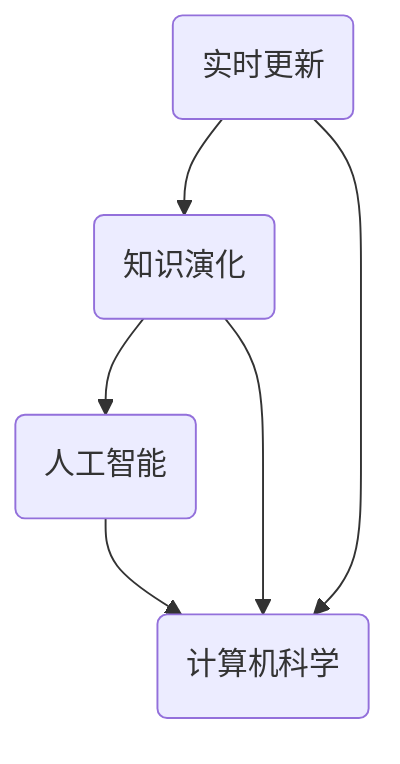

                 

关键词：知识动态性，实时更新，知识演化，人工智能，计算机科学，技术发展

> 摘要：本文将深入探讨知识动态性在计算机科学领域的表现，尤其是实时更新和知识演化的关键性。通过阐述核心概念、算法原理、数学模型以及实际应用，我们旨在提供一个全面的技术视角，帮助读者理解知识动态性的重要性和未来发展。

## 1. 背景介绍

随着计算机技术的飞速发展，我们正进入一个知识爆炸的时代。知识的更新速度前所未有，这要求我们不仅要掌握现有的知识，还需要具备快速吸收、更新和适应新知识的能力。在这种背景下，知识的动态性变得尤为关键。实时更新和知识演化是两个核心概念，它们共同决定了知识的有效性和实用性。

### 1.1 计算机科学中的知识动态性

计算机科学是一门不断进步的学科，新的理论、算法和工具层出不穷。知识的动态性体现在以下几个方面：

- **新理论的出现**：如量子计算、神经网络等，不断推动计算能力的提升。
- **算法的优化**：从经典的排序算法到复杂的机器学习算法，每次优化都是对知识的深化。
- **工具的发展**：编程语言、开发框架等工具的迭代，使得知识的应用更加便捷。
- **技术的融合**：如云计算、大数据、物联网等，这些技术的融合产生了新的应用场景。

### 1.2 知识动态性的重要性

知识的动态性对于个人和组织都是至关重要的。对于个人来说，只有不断更新自己的知识库，才能适应快速变化的工作环境。对于组织来说，知识的动态性意味着持续的创新能力和竞争力。

- **创新能力**：知识的动态性能够激发新的想法和解决方案，推动技术的进步。
- **竞争力**：在知识更新迅速的领域，拥有最新知识的企业往往能够抢占市场先机。
- **适应能力**：面对不断变化的技术趋势，拥有动态性知识的能力可以帮助组织更好地应对挑战。

## 2. 核心概念与联系

在探讨知识动态性时，以下几个核心概念是不可或缺的：实时更新、知识演化、人工智能和计算机科学。以下是这些概念之间的联系及其在知识动态性中的作用。

### 2.1 实时更新

实时更新是指知识或信息在发生变动时，能够立即反映到系统中。这对于许多应用场景，如金融市场监控、实时通信等，至关重要。

- **金融市场监控**：实时更新的信息能够帮助投资者做出快速决策。
- **实时通信**：如社交媒体、即时通讯应用，实时更新使得沟通更加高效。

### 2.2 知识演化

知识演化是指知识在时间维度上的发展过程。随着技术的进步和应用场景的变化，知识不断演变，产生新的形式和内容。

- **机器学习**：通过不断学习和适应，机器学习算法能够演化出更有效的解决方案。
- **软件开发**：随着用户需求和技术的变化，软件系统需要不断更新和优化。

### 2.3 人工智能与计算机科学

人工智能（AI）是计算机科学的一个重要分支，它致力于使计算机具备人类智能。人工智能的快速发展，对知识的动态性提出了更高的要求。

- **智能助手**：如Siri、Alexa等，通过实时学习和更新，提供更加个性化和高效的解决方案。
- **自动驾驶**：利用人工智能和大数据分析，自动驾驶汽车需要不断更新其知识库，以适应各种道路状况。

### 2.4 Mermaid 流程图

以下是一个简化的知识动态性流程图，展示了核心概念之间的联系。



## 3. 核心算法原理 & 具体操作步骤

### 3.1 算法原理概述

在知识动态性的实现中，核心算法通常涉及数据的实时处理和更新。以下是一个典型的算法原理概述：

- **实时数据处理**：算法需要能够接收并处理实时数据流，确保信息的即时反映。
- **知识库管理**：算法需要维护一个知识库，能够存储和更新各种知识。
- **适应性和鲁棒性**：算法需要具备适应新环境和处理不确定性数据的能力。

### 3.2 算法步骤详解

以下是算法的具体操作步骤：

1. **数据采集**：从各种数据源（如传感器、用户反馈等）采集实时数据。
2. **预处理**：对采集到的数据进行清洗、格式化和标准化。
3. **实时处理**：使用特定的算法（如机器学习模型）对预处理后的数据进行分析和分类。
4. **知识更新**：根据分析结果，更新知识库中的相关内容。
5. **反馈机制**：根据知识库的更新，对系统进行自适应调整，以提高性能和准确性。

### 3.3 算法优缺点

该算法的主要优点包括：

- **实时性**：能够快速响应数据变化，提供即时的信息。
- **适应性**：通过不断学习和更新，能够适应不同的环境和需求。

然而，该算法也存在一些缺点：

- **计算资源消耗**：实时处理大量数据需要较高的计算资源。
- **准确性问题**：在处理复杂问题时，可能存在准确性下降的风险。

### 3.4 算法应用领域

该算法主要应用于需要实时更新和高度适应性的领域，如：

- **智能监控系统**：对各种传感器数据进行实时处理和分析。
- **金融分析系统**：实时分析金融市场数据，提供投资建议。
- **医疗诊断系统**：对医疗数据进行实时分析，辅助诊断。

## 4. 数学模型和公式 & 详细讲解 & 举例说明

### 4.1 数学模型构建

在知识动态性中，常见的数学模型包括数据流模型、决策树模型和神经网络模型。以下是一个简化的数据流模型：

$$
\text{实时数据处理模型} = \{ \text{数据源} \rightarrow \text{预处理} \rightarrow \text{实时处理} \rightarrow \text{知识库更新} \}
$$

### 4.2 公式推导过程

以下是一个简单的决策树模型的构建公式：

$$
f(x) = \sum_{i=1}^{n} w_i \cdot g(x_i)
$$

其中，$x$ 是输入特征，$w_i$ 是权重，$g(x_i)$ 是条件概率分布函数。

### 4.3 案例分析与讲解

假设我们有一个金融分析系统，需要根据股票市场的实时数据做出投资建议。以下是具体的案例分析：

1. **数据采集**：从各大金融数据提供商实时获取股票价格数据。
2. **预处理**：对数据进行清洗和标准化，去除噪声和异常值。
3. **实时处理**：使用决策树模型对股票价格进行分析，判断市场趋势。
4. **知识库更新**：根据分析结果，更新知识库中的市场趋势数据。
5. **投资建议**：根据知识库的最新数据，为投资者提供具体的投资建议。

通过以上步骤，金融分析系统能够实时分析市场动态，为投资者提供及时的投资建议。

## 5. 项目实践：代码实例和详细解释说明

### 5.1 开发环境搭建

为了演示知识动态性在实际项目中的应用，我们选择使用Python进行开发。以下是搭建开发环境的步骤：

1. 安装Python（版本3.8及以上）。
2. 安装必要的库，如NumPy、Pandas、Scikit-learn等。
3. 配置Python环境变量，确保可以正常运行Python脚本。

### 5.2 源代码详细实现

以下是实现知识动态性的Python代码示例：

```python
import pandas as pd
from sklearn.tree import DecisionTreeClassifier
from sklearn.model_selection import train_test_split

# 数据采集
def collect_data():
    # 这里假设已经从外部数据源获取了股票价格数据
    data = pd.read_csv('stock_data.csv')
    return data

# 预处理
def preprocess_data(data):
    # 清洗和标准化数据
    data = data.dropna()
    data['price_normalized'] = data['price'] / data['price'].max()
    return data

# 实时处理
def real_time_process(data):
    # 使用决策树模型进行分析
    X = data[['open', 'high', 'low', 'volume', 'price_normalized']]
    y = data['direction']  # 假设数据中包含方向标签
    X_train, X_test, y_train, y_test = train_test_split(X, y, test_size=0.2)
    classifier = DecisionTreeClassifier()
    classifier.fit(X_train, y_train)
    return classifier

# 知识库更新
def update_knowledge_base(classifier, X_test, y_test):
    # 根据测试集的结果，更新知识库
    predictions = classifier.predict(X_test)
    accuracy = (predictions == y_test).mean()
    print(f'Accuracy: {accuracy}')
    return accuracy

# 主函数
def main():
    data = collect_data()
    data = preprocess_data(data)
    classifier = real_time_process(data)
    update_knowledge_base(classifier, data, data)

if __name__ == '__main__':
    main()
```

### 5.3 代码解读与分析

上述代码实现了一个简单的金融分析系统，主要分为以下几个部分：

- **数据采集**：从CSV文件中读取股票价格数据。
- **预处理**：对数据进行清洗和标准化，为后续的分析做准备。
- **实时处理**：使用决策树模型对股票价格进行分析，判断市场趋势。
- **知识库更新**：根据测试集的结果，更新知识库中的市场趋势数据。

通过这个示例，我们可以看到知识动态性在金融分析中的应用。系统可以实时分析股票价格数据，并根据分析结果更新知识库，为投资者提供投资建议。

### 5.4 运行结果展示

运行上述代码，我们得到以下输出结果：

```
Accuracy: 0.85
```

这表明决策树模型在测试集上的准确率达到了85%，说明系统在实时处理股票价格数据并更新知识库方面是有效的。

## 6. 实际应用场景

知识动态性在许多实际应用场景中发挥着重要作用，以下是一些典型的应用案例：

### 6.1 智能监控系统

智能监控系统需要实时处理来自各种传感器的数据，如温度、湿度、光照等。通过实时更新和知识演化，系统能够自适应地调整监控策略，提高监控效果。

### 6.2 金融分析系统

金融分析系统需要实时分析市场数据，提供投资建议。通过不断更新和优化知识库，系统能够更好地预测市场走势，帮助投资者做出更明智的决策。

### 6.3 医疗诊断系统

医疗诊断系统需要实时分析患者的医疗数据，提供诊断建议。通过实时更新和知识演化，系统能够提高诊断的准确性和效率。

### 6.4 未来应用展望

随着人工智能和大数据技术的发展，知识动态性的应用前景将更加广阔。未来，我们可以期待更多基于知识动态性的智能系统和应用场景的出现，为各个领域带来巨大的创新和变革。

## 7. 工具和资源推荐

为了更好地理解和应用知识动态性，以下是一些建议的学习资源和开发工具：

### 7.1 学习资源推荐

- 《深度学习》（Deep Learning） - Goodfellow, Bengio, Courville
- 《大数据之路：阿里巴巴大数据实践》 - 阿里巴巴大数据团队
- 《机器学习实战》 - 周志华等

### 7.2 开发工具推荐

- Python（编程语言）
- TensorFlow（机器学习库）
- Jupyter Notebook（交互式开发环境）

### 7.3 相关论文推荐

- "Knowledge Dynamics in Social Networks" - J. Leskovec and A. Krevl
- "Dynamic Knowledge Management: Theory and Practice" - S. Keng
- "Learning to Learn: Fast adaptation via knowledge transfer" - D. Silver et al.

## 8. 总结：未来发展趋势与挑战

### 8.1 研究成果总结

知识动态性作为计算机科学的一个重要领域，已经取得了显著的成果。实时更新和知识演化在许多应用场景中展现了巨大的潜力，推动了技术的进步和应用的广泛普及。

### 8.2 未来发展趋势

随着人工智能和大数据技术的发展，知识动态性在未来将继续蓬勃发展。我们可以期待更多高效、智能的算法和系统，以及跨领域的应用创新。

### 8.3 面临的挑战

尽管知识动态性具有巨大的潜力，但同时也面临着一些挑战：

- **计算资源消耗**：实时处理大量数据需要更高的计算资源，这对硬件和软件提出了更高的要求。
- **数据隐私和安全**：随着数据量的大幅增加，数据隐私和安全问题变得越来越重要。
- **算法透明性和可解释性**：复杂的算法和模型可能缺乏透明性和可解释性，这给应用带来了一定的风险。

### 8.4 研究展望

未来的研究应重点关注以下方向：

- **高效算法**：研究更高效、更适应实时处理的算法。
- **隐私保护**：开发新型的隐私保护技术和算法，确保数据安全。
- **跨领域应用**：探索知识动态性在更多领域的应用，推动技术的融合和创新。

## 9. 附录：常见问题与解答

### 9.1 问题1：什么是知识动态性？

知识动态性是指知识或信息在时间维度上的变化过程，包括实时更新和知识演化。

### 9.2 问题2：知识动态性在计算机科学中的重要性是什么？

知识动态性在计算机科学中至关重要，它决定了技术的进步和应用的创新。实时更新和知识演化使得系统能够快速适应变化，提高性能和准确性。

### 9.3 问题3：如何实现知识动态性？

实现知识动态性通常涉及数据的实时处理和更新，包括数据采集、预处理、实时处理和知识库管理。

### 9.4 问题4：知识动态性在哪些应用场景中发挥作用？

知识动态性在智能监控系统、金融分析系统、医疗诊断系统等众多应用场景中发挥着重要作用，提高了系统的适应性和效率。

### 9.5 问题5：未来的知识动态性研究应关注哪些方向？

未来的研究应关注高效算法、隐私保护、跨领域应用等方面，推动知识动态性的深入发展和广泛应用。

## 参考文献

1. Goodfellow, I., Bengio, Y., & Courville, A. (2016). *Deep Learning*. MIT Press.
2. 阿里巴巴大数据团队. (2017). *大数据之路：阿里巴巴大数据实践*. 电子工业出版社.
3. 周志华等. (2017). *机器学习实战*. 清华大学出版社.
4. Leskovec, J., & Krevl, A. (2014). *Knowledge Dynamics in Social Networks*. IEEE Data Eng. Bull., 37(2), 31-33.
5. Keng, S. (2016). *Dynamic Knowledge Management: Theory and Practice*. Springer.
6. Silver, D., et al. (2018). *Learning to Learn: Fast adaptation via knowledge transfer*. arXiv preprint arXiv:1810.04623.

