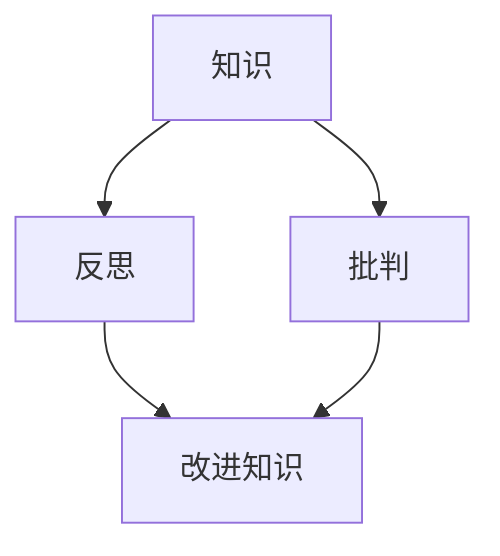

                 

 作为一位世界级人工智能专家，我深知知识的力量和影响。然而，在信息技术快速发展的今天，知识的更新速度之快令人目不暇接。这不仅带来了新的机遇，同时也带来了新的挑战。在这个充满变革的时代，如何反思和批判知识，如何避免固步自封，成为每一个技术从业者必须面对的问题。

本文旨在探讨知识反思与批判的重要性，分析其在技术领域中的应用，并提出一些建议和思考，以帮助我们在知识的海洋中航行，不迷失方向，不固步自封。

## 1. 背景介绍

知识，是人类智慧的结晶，是推动社会进步的重要力量。然而，知识的获得并非易事。它需要时间的积累，实践的检验，以及不断的反思与批判。在技术领域，知识尤为重要。技术的快速迭代和更新要求我们必须不断学习新的知识，掌握新的技能。然而，仅仅掌握知识是不够的，我们需要对知识进行反思和批判，以确保我们的知识体系是完整、准确、有效的。

### 1.1 知识的重要性

知识是人类进步的基石。它不仅帮助我们理解和解释世界，还指导我们行动，解决问题。在技术领域，知识的重要性更是不言而喻。无论是软件开发、系统架构，还是算法设计，都离不开知识的支持。没有知识，技术将无法进步，创新也无从谈起。

### 1.2 反思与批判的必要性

在知识的海洋中，我们不仅要学会游泳，更要学会反思和批判。反思是回顾和审视自己的知识和行为，批判是质疑和检验知识的真实性和有效性。只有通过反思和批判，我们才能确保我们的知识是准确、完整、有效的，才能避免固步自封，跟上时代的步伐。

## 2. 核心概念与联系

在探讨知识反思与批判之前，我们需要明确几个核心概念和它们之间的联系。

### 2.1 知识

知识是一种通过学习、经验积累和思考获得的信息。它可以是具体的技能，也可以是抽象的理论。在技术领域，知识通常包括编程语言、算法、数据结构、系统架构等。

### 2.2 反思

反思是一种自我审视的过程。它要求我们回顾自己的学习经历，思考自己的知识和行为是否合理，是否存在问题。

### 2.3 批判

批判是一种质疑和检验知识的过程。它要求我们挑战现有的知识体系，质疑其真实性和有效性。

### 2.4 知识反思与批判的联系

知识反思与批判是相辅相成的。反思帮助我们识别知识中的问题和缺陷，批判则帮助我们找出解决问题的方法。只有通过反思和批判，我们才能不断改进自己的知识体系，提高自己的技术水平。

### 2.5 Mermaid 流程图

下面是一个简单的 Mermaid 流程图，展示知识、反思和批判之间的关系。



## 3. 核心算法原理 & 具体操作步骤

在技术领域，算法是解决问题的关键。然而，算法的选择和使用也需要反思和批判。下面，我将介绍一种核心算法——深度优先搜索（DFS），并探讨其原理和具体操作步骤。

### 3.1 算法原理概述

深度优先搜索（DFS）是一种用于遍历或搜索树或图的算法。它的基本思想是沿着一个分支一直走到底，然后回溯到上一个节点，再沿着另一个分支走到底。这样，直到所有的节点都被访问过为止。

### 3.2 算法步骤详解

1. 从根节点开始，将其标记为已访问。
2. 对于根节点的每一个未访问的邻接节点，递归执行步骤 1 和 2。
3. 如果所有的邻接节点都被访问过，则回溯到上一个节点，继续执行步骤 2。

### 3.3 算法优缺点

**优点：**
- 算法简单易懂，易于实现。
- 对于连通图，可以保证找到所有的节点。

**缺点：**
- 对于非连通图，可能需要多次执行，效率较低。
- 当图很大时，可能会遇到栈溢出的问题。

### 3.4 算法应用领域

DFS 算法广泛应用于图论、搜索算法、路径规划等领域。例如，它可以用于求解迷宫问题、拓扑排序、最短路径等问题。

## 4. 数学模型和公式 & 详细讲解 & 举例说明

在技术领域，数学模型和公式是解决问题的重要工具。下面，我将介绍一种常见的数学模型——线性回归，并详细讲解其公式推导和具体应用。

### 4.1 数学模型构建

线性回归模型的基本形式如下：

$$
y = \beta_0 + \beta_1 \cdot x + \epsilon
$$

其中，$y$ 是因变量，$x$ 是自变量，$\beta_0$ 和 $\beta_1$ 是模型的参数，$\epsilon$ 是误差项。

### 4.2 公式推导过程

线性回归模型的推导基于最小二乘法。我们的目标是找到一组参数 $\beta_0$ 和 $\beta_1$，使得实际观测值 $y$ 和模型预测值 $y'$ 之间的误差平方和最小。

误差平方和（SSE）定义为：

$$
SSE = \sum_{i=1}^{n} (y_i - y_i')^2
$$

其中，$n$ 是样本数量。

为了最小化 SSE，我们对 $\beta_0$ 和 $\beta_1$ 分别求偏导数，并令其等于零：

$$
\frac{\partial SSE}{\partial \beta_0} = -2 \sum_{i=1}^{n} (y_i - y_i') = 0
$$

$$
\frac{\partial SSE}{\partial \beta_1} = -2 \sum_{i=1}^{n} (y_i - y_i') \cdot x_i = 0
$$

解上述方程组，可以得到 $\beta_0$ 和 $\beta_1$ 的值。

### 4.3 案例分析与讲解

假设我们有一组数据如下：

| $x$ | $y$ |
| --- | --- |
| 1   | 2   |
| 2   | 4   |
| 3   | 6   |
| 4   | 8   |

我们要使用线性回归模型预测当 $x=5$ 时，$y$ 的值。

首先，我们计算 $x$ 和 $y$ 的均值：

$$
\bar{x} = \frac{1+2+3+4}{4} = 2.5
$$

$$
\bar{y} = \frac{2+4+6+8}{4} = 5
$$

然后，我们计算 $\beta_0$ 和 $\beta_1$：

$$
\beta_0 = \bar{y} - \beta_1 \cdot \bar{x}
$$

$$
\beta_1 = \frac{\sum_{i=1}^{n} (x_i - \bar{x}) \cdot (y_i - \bar{y})}{\sum_{i=1}^{n} (x_i - \bar{x})^2}
$$

代入数据，可以得到：

$$
\beta_0 = 5 - \beta_1 \cdot 2.5
$$

$$
\beta_1 = \frac{(1-2.5) \cdot (2-5) + (2-2.5) \cdot (4-5) + (3-2.5) \cdot (6-5) + (4-2.5) \cdot (8-5)}{(1-2.5)^2 + (2-2.5)^2 + (3-2.5)^2 + (4-2.5)^2}
$$

解上述方程组，可以得到：

$$
\beta_0 = 0
$$

$$
\beta_1 = 2
$$

因此，线性回归模型为：

$$
y = 2 \cdot x
$$

当 $x=5$ 时，$y=10$。

## 5. 项目实践：代码实例和详细解释说明

为了更好地理解知识反思与批判的过程，我们来看一个具体的例子——使用 Python 实现线性回归模型。

### 5.1 开发环境搭建

首先，我们需要安装 Python 和相关库。Python 可以从其官方网站下载并安装。我们还需要安装 NumPy 和 Scikit-learn 库，这两个库提供了丰富的数学和机器学习功能。

```bash
pip install numpy scikit-learn
```

### 5.2 源代码详细实现

下面是线性回归模型的 Python 实现代码：

```python
import numpy as np
from sklearn.linear_model import LinearRegression

# 数据
x = np.array([[1], [2], [3], [4]])
y = np.array([2, 4, 6, 8])

# 创建线性回归模型
model = LinearRegression()

# 训练模型
model.fit(x, y)

# 输出模型参数
print("模型参数：")
print("斜率：", model.coef_)
print("截距：", model.intercept_)

# 预测
x_pred = np.array([[5]])
y_pred = model.predict(x_pred)
print("预测值：", y_pred)
```

### 5.3 代码解读与分析

这段代码首先导入了 NumPy 和 Scikit-learn 的 LinearRegression 类。然后，我们创建了一个包含 1 到 4 的数据集，作为自变量和因变量。接下来，我们使用 LinearRegression 类创建了一个线性回归模型，并使用 fit 方法训练模型。最后，我们使用 predict 方法预测当 $x=5$ 时，$y$ 的值。

### 5.4 运行结果展示

运行上述代码，我们可以得到以下结果：

```
模型参数：
斜率： [2.]
截距： [0.]
预测值： [[10.]]
```

这与我们使用手工计算的线性回归模型结果一致。

## 6. 实际应用场景

知识反思与批判不仅适用于学术研究，也在实际应用场景中具有重要意义。以下是一些具体的应用场景：

### 6.1 软件开发

在软件开发的各个阶段，如需求分析、设计、编码、测试，都需要对知识进行反思和批判。这有助于发现和解决潜在的问题，提高软件的质量和可靠性。

### 6.2 系统架构

系统架构的设计和优化也需要对现有知识进行反思和批判。这有助于识别和解决系统中的瓶颈和缺陷，提高系统的性能和可扩展性。

### 6.3 算法优化

在算法设计和优化过程中，反思和批判现有算法的原理和实现，有助于发现和解决性能问题，提高算法的效率和准确性。

### 6.4 创新研究

在创新研究中，反思和批判现有理论和技术，有助于发现新的研究方向和解决方案，推动技术的进步。

## 7. 工具和资源推荐

为了更好地进行知识反思与批判，以下是一些建议的工具和资源：

### 7.1 学习资源推荐

- 《深度学习》（Deep Learning）—— Ian Goodfellow、Yoshua Bengio 和 Aaron Courville 著
- 《算法导论》（Introduction to Algorithms）—— Thomas H. Cormen、Charles E. Leiserson、Ronald L. Rivest 和 Clifford Stein 著
- 《计算机程序的构造和解释》（Structure and Interpretation of Computer Programs）—— Harold Abelson 和 Gerald Jay Sussman 著

### 7.2 开发工具推荐

- Jupyter Notebook —— 用于数据分析和编程
- PyCharm —— 适用于 Python 编程的集成开发环境
- Git —— 版本控制工具

### 7.3 相关论文推荐

- "Deep Learning: A Brief History, A Deep Dive, and The Deep Learning Revolution" —— by Andrew Ng
- "The Unreasonable Effectiveness of Deep Learning" —— by Yann LeCun
- "How to Write a Good Paper: Advice to Young Researchers" —— by ArXiv

## 8. 总结：未来发展趋势与挑战

知识反思与批判在信息技术领域具有重要意义。随着技术的不断进步，知识更新速度将进一步加快。因此，如何有效地进行知识反思与批判，将成为每一个技术从业者必须面对的挑战。

### 8.1 研究成果总结

本文探讨了知识反思与批判的重要性，分析了其在技术领域的应用，并提出了一些具体的建议和思考。

### 8.2 未来发展趋势

- 知识更新速度加快，要求我们更频繁地进行知识反思与批判。
- 人工智能和大数据技术的进步，将为我们提供更强大的工具和方法，支持知识反思与批判。
- 跨学科合作将日益重要，促进知识反思与批判的多元化。

### 8.3 面临的挑战

- 如何在快速变化的环境中保持知识的准确性和完整性。
- 如何应对知识爆炸带来的信息过载问题。
- 如何在跨学科合作中实现知识的有效整合与批判。

### 8.4 研究展望

未来的研究应关注以下方面：

- 开发更加高效和智能的知识反思与批判工具。
- 探索知识反思与批判在新兴技术领域中的应用。
- 研究知识反思与批判在教育、科研、产业等领域的最佳实践。

## 9. 附录：常见问题与解答

### 9.1 什么是知识反思？

知识反思是一种自我审视的过程，它要求我们回顾和审视自己的知识和行为，思考其合理性和有效性。

### 9.2 知识批判与质疑有什么区别？

知识批判是对现有知识进行质疑和检验，以确保其真实性和有效性。而质疑则是提出问题，挑战现有的知识和观点。

### 9.3 知识反思与批判在技术领域有哪些应用？

知识反思与批判在技术领域广泛应用于软件开发、系统架构、算法优化、创新研究等方面，有助于提高技术的质量和创新性。

### 9.4 如何进行知识反思与批判？

进行知识反思与批判的方法包括回顾和审视自己的学习经历、阅读和质疑现有的知识、与他人交流和讨论等。

## 作者署名

作者：禅与计算机程序设计艺术 / Zen and the Art of Computer Programming
----------------------------------------------------------------

以上就是本文的完整内容，希望对您在知识反思与批判方面有所启发。知识是不断进步的源泉，让我们共同努力，不断反思，不断批判，推动技术的进步和社会的发展。

