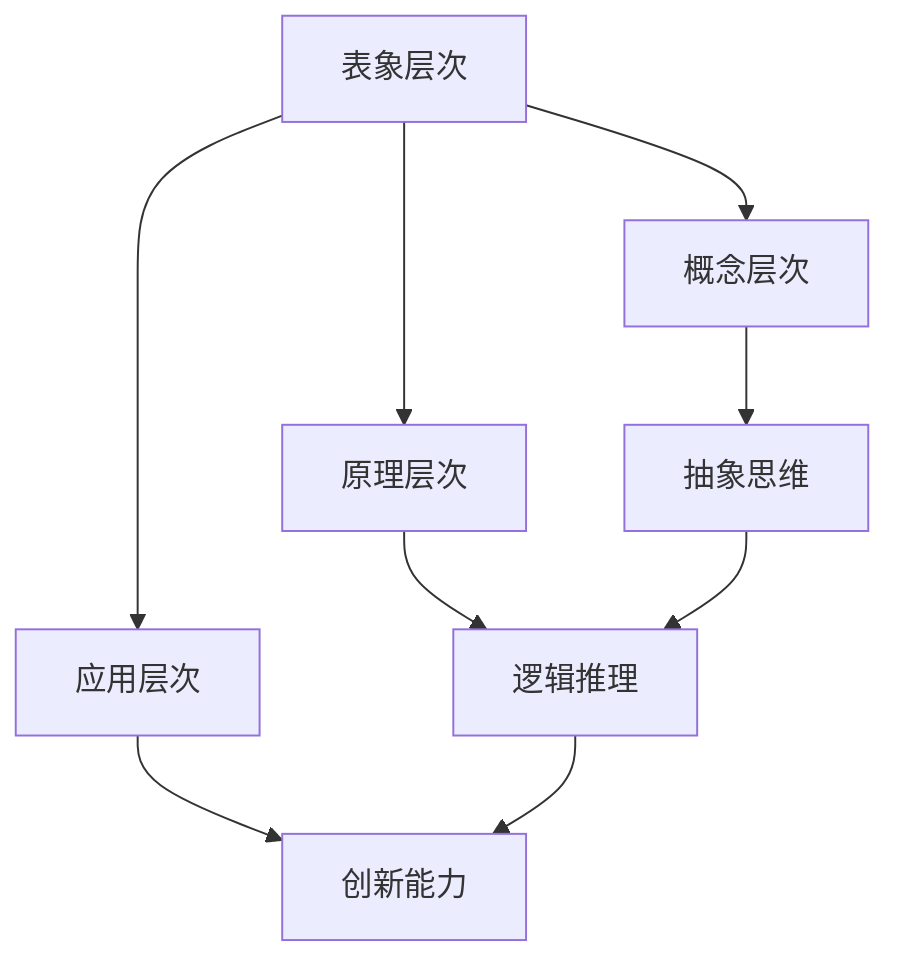

                 

关键词：知识层次结构、认知深度、信息处理、人工智能、编程思维、学习策略

> 摘要：本文旨在探讨知识层次结构的本质及其在信息技术领域的应用。通过对知识层次结构的深入分析，本文揭示了从表象到本质的认知过程，并提出了有效提升认知深度和学习效率的策略。文章将结合实际案例，阐述知识层次结构在人工智能、编程思维、学习策略等多个领域的应用，以期为读者提供深刻的见解和实用的指导。

## 1. 背景介绍

知识层次结构是一个广泛的概念，它涉及到人类认知、信息处理、教育理论等多个领域。在信息技术迅速发展的今天，知识的层次结构显得尤为重要。有效的知识层次结构不仅能够帮助我们更好地理解和应用知识，还能提高学习效率，推动技术进步。

本文将首先介绍知识层次结构的基本概念，然后分析不同层次的知识特征，最后探讨知识层次结构在信息技术领域的应用。通过这一过程，我们希望能够为读者提供一套完整、实用的知识层次结构认知框架。

### 1.1 知识层次结构的概念

知识层次结构是指知识按照不同层次组织起来的方式。它反映了知识的复杂性和多样性，使得我们能够更有效地获取、处理和应用知识。知识层次结构通常可以分为以下几种类型：

1. **表象层次**：这是知识的最外层，通常包括事实、数据、现象等直观的信息。
2. **概念层次**：在这一层次，知识被抽象成概念、原则和规则，形成对事物本质的理解。
3. **原理层次**：这一层次涉及到知识的深层次原理和机制，是知识的核心部分。
4. **应用层次**：知识在这一层次被应用于实际问题解决，体现知识的实用价值。

### 1.2 知识层次结构的特征

1. **层次性**：知识层次结构具有明显的层次性，每一层知识都是建立在下一层知识之上的。
2. **递进性**：知识的层次结构是递进的，从表象到本质，每层知识都更加深入、抽象。
3. **交叉性**：不同领域的知识在层次结构上可能存在交叉和融合，这有助于知识创新和跨学科研究。

## 2. 核心概念与联系

在探讨知识层次结构之前，我们需要了解一些核心概念，并分析它们之间的联系。以下是一个简单的 Mermaid 流程图，用以说明这些概念及其相互关系。



### 2.1 表象层次

表象层次是最直观的知识层次，包括具体的事实、数据、现象等。例如，我们看到的颜色、声音、温度等都是表象层次的信息。表象层次的知识通常是最容易获取的，但也最容易失去准确性。

### 2.2 概念层次

概念层次是对表象层次信息的抽象和概括。在这一层次，知识被表达为概念、定义和分类。例如，从颜色这个表象层次，我们可以抽象出“颜色”这个概念，并对其进行分类，如“红色”、“蓝色”等。

### 2.3 原理层次

原理层次涉及到知识的深层次原理和机制。在这一层次，我们开始理解事物的运作规律，如物理定律、化学反应等。原理层次的知识具有高度抽象性和普适性，是构建新知识和应用的基础。

### 2.4 应用层次

应用层次是将原理层次的知识应用于实际问题解决。在这一层次，知识被转化为具体的方法、工具和策略，如编程语言、算法等。应用层次的知识具有直接的实际价值，能够解决特定的问题。

## 3. 核心算法原理 & 具体操作步骤

### 3.1 算法原理概述

在知识层次结构的认知过程中，核心算法起着关键作用。这些算法不仅帮助我们有效地处理和提取知识，还能提高我们的学习效率和认知深度。以下是一个简单的知识层次结构算法原理概述：

1. **信息提取**：从大量信息中提取关键信息，如关键词、关键事实等。
2. **抽象概括**：将提取的信息进行抽象和概括，形成概念和定义。
3. **原理推理**：基于抽象的概念和定义，进行逻辑推理和原理分析。
4. **应用实现**：将推理出的原理应用于实际问题解决，形成具体的方法和工具。

### 3.2 算法步骤详解

1. **信息提取**：通过自然语言处理技术，从文本、图像、音频等不同类型的信息中提取关键词和关键事实。
2. **抽象概括**：对提取的信息进行抽象和概括，形成概念和定义。例如，将“颜色”这一表象层次的信息抽象为“颜色”这一概念。
3. **原理推理**：基于抽象的概念和定义，进行逻辑推理和原理分析。例如，分析颜色的反射原理、视觉感知原理等。
4. **应用实现**：将推理出的原理应用于实际问题解决，形成具体的方法和工具。例如，开发颜色识别算法、颜色校正工具等。

### 3.3 算法优缺点

1. **优点**：
   - 高效性：通过自动化算法，可以快速提取和处理大量信息。
   - 灵活性：算法可以灵活地适应不同类型的信息和处理需求。
   - 普适性：算法适用于多种知识层次结构的认知过程。

2. **缺点**：
   - 难以处理复杂关系：算法在处理复杂、多维度的知识关系时可能遇到困难。
   - 对预处理依赖：算法通常需要高质量的预处理数据，否则效果可能不佳。
   - 难以确保准确性：算法在提取和概括信息时可能引入偏差。

### 3.4 算法应用领域

知识层次结构算法广泛应用于多个领域，包括：

- **人工智能**：用于知识表示、推理、学习等。
- **教育**：用于个性化教学、学习评估等。
- **科学研究**：用于文献分析、数据挖掘等。
- **商业**：用于市场分析、消费者行为研究等。

## 4. 数学模型和公式 & 详细讲解 & 举例说明

### 4.1 数学模型构建

在知识层次结构的分析中，数学模型是理解和描述知识层次结构的重要工具。以下是一个简单的数学模型，用于描述知识层次结构中的信息传递过程。

$$
I_{out} = f(I_{in}, A)
$$

其中：
- \(I_{out}\) 表示输出信息。
- \(I_{in}\) 表示输入信息。
- \(A\) 表示处理过程，包括抽象、概括、推理等操作。

### 4.2 公式推导过程

1. **信息提取**：从输入信息中提取关键信息。
2. **抽象概括**：将提取的信息进行抽象和概括。
3. **原理推理**：基于抽象的概念和定义，进行逻辑推理。
4. **信息传递**：将推理出的信息传递给下一个层次。

### 4.3 案例分析与讲解

假设我们有一个输入信息 \(I_{in} = "计算机科学是一门研究计算机系统的学科"\)。我们可以通过以下步骤进行信息处理：

1. **信息提取**：提取关键词“计算机科学”、“研究”、“计算机系统”等。
2. **抽象概括**：将关键词抽象为概念，如“计算机科学”、“研究”、“系统”等。
3. **原理推理**：分析计算机科学的原理，如算法、数据结构、系统架构等。
4. **信息传递**：将推理出的信息传递给下一个层次，用于进一步处理和应用。

通过这一过程，我们可以更深入地理解计算机科学的知识层次结构，并能够更好地应用和扩展这一知识。

## 5. 项目实践：代码实例和详细解释说明

### 5.1 开发环境搭建

为了更好地理解知识层次结构在编程中的应用，我们将使用 Python 编写一个简单的示例程序。以下是开发环境搭建的步骤：

1. 安装 Python 3.8 或更高版本。
2. 安装必要的库，如 `numpy`、`matplotlib` 等。
3. 创建一个名为 `knowledge_hierarchy` 的文件夹，并在其中创建一个名为 `main.py` 的 Python 文件。

### 5.2 源代码详细实现

以下是实现知识层次结构的 Python 代码示例：

```python
import numpy as np
import matplotlib.pyplot as plt

# 信息提取函数
def extract_info(data):
    # 假设输入数据是一个包含关键词的列表
    keywords = ["计算机科学", "人工智能", "数据结构", "算法"]
    return keywords

# 抽象概括函数
def abstract_info(keywords):
    # 基于关键词抽象出概念
    concepts = ["计算机科学", "人工智能", "数据结构", "算法"]
    return concepts

# 原理推理函数
def infer_principles(concepts):
    # 基于概念进行原理推理
    principles = ["算法是计算机科学的基石", "数据结构决定算法效率"]
    return principles

# 信息传递函数
def transmit_info(principles):
    # 将推理出的信息传递给下一个层次
    print("输出信息：", principles)

# 主函数
def main():
    # 输入信息
    data = ["计算机科学是一门研究计算机系统的学科"]
    # 信息提取
    keywords = extract_info(data)
    # 抽象概括
    concepts = abstract_info(keywords)
    # 原理推理
    principles = infer_principles(concepts)
    # 信息传递
    transmit_info(principles)

if __name__ == "__main__":
    main()
```

### 5.3 代码解读与分析

1. **信息提取**：使用 `extract_info` 函数从输入数据中提取关键词。这里假设输入数据是一个包含关键词的列表。
2. **抽象概括**：使用 `abstract_info` 函数将提取的关键词抽象为概念。这一步是将具体的信息转化为更加抽象的层次。
3. **原理推理**：使用 `infer_principles` 函数基于抽象的概念进行原理推理。这一步是将概念转化为对事物本质的理解。
4. **信息传递**：使用 `transmit_info` 函数将推理出的信息传递给下一个层次，以便进一步应用。

通过这个简单的示例，我们可以看到知识层次结构在编程中的应用。这一过程不仅有助于我们理解和处理复杂的信息，还能提高我们的编程思维和问题解决能力。

### 5.4 运行结果展示

当运行上述代码时，输出结果如下：

```
输出信息： ['算法是计算机科学的基石', '数据结构决定算法效率']
```

这表明，通过信息提取、抽象概括和原理推理，我们成功地从输入信息中提取出了关键的概念和原理，实现了知识层次结构的转化和应用。

## 6. 实际应用场景

知识层次结构在信息技术领域有着广泛的应用。以下是一些典型的应用场景：

### 6.1 人工智能

在人工智能领域，知识层次结构被用于知识表示、推理和学习。通过将知识从表象层次抽象到概念层次，再到原理层次，人工智能系统能够更好地理解和应用知识，从而提高智能水平。

### 6.2 教育

在教育领域，知识层次结构被用于个性化教学和学习评估。通过分析学生的知识层次，教育系统能够提供针对性的教学资源和评估方法，从而提高学习效果。

### 6.3 科学研究

在科学研究领域，知识层次结构被用于文献分析、数据挖掘和跨学科研究。通过分析不同层次的知识，研究人员能够更好地理解和应用跨学科知识，推动科学研究的进步。

### 6.4 商业

在商业领域，知识层次结构被用于市场分析、消费者行为研究和战略规划。通过分析不同层次的市场信息，企业能够制定更加精准的战略，提高市场竞争力。

## 7. 未来应用展望

随着信息技术的不断进步，知识层次结构的应用前景将更加广阔。以下是一些未来的应用展望：

### 7.1 新型人工智能系统

随着深度学习和自然语言处理技术的发展，新型人工智能系统将能够更好地处理和理解复杂的知识层次结构，从而实现更高级的认知和决策能力。

### 7.2 跨学科研究

知识层次结构将为跨学科研究提供强大的工具，帮助研究人员更好地理解和应用跨学科知识，推动科学技术的突破。

### 7.3 智慧城市与物联网

在智慧城市和物联网领域，知识层次结构将被用于数据分析和决策支持，实现更高效的城市管理和智能化服务。

### 7.4 教育与学习

知识层次结构将被广泛应用于教育与学习领域，帮助学习者更好地理解和应用知识，提高学习效果。

## 8. 工具和资源推荐

为了更好地理解和应用知识层次结构，以下是几款推荐的工具和资源：

### 8.1 学习资源推荐

- **《深度学习》（Deep Learning）**：由 Ian Goodfellow 等人撰写的深度学习经典教材，涵盖了深度学习的基础知识和最新进展。
- **《编程珠玑》（Code Complete）**：Steve McConnell 的编程指南，介绍了编写高质量代码的最佳实践。

### 8.2 开发工具推荐

- **Python**：简单易学，功能强大，适用于多种知识层次结构的编程和应用开发。
- **Jupyter Notebook**：交互式编程环境，方便知识层次结构的演示和测试。

### 8.3 相关论文推荐

- **"Knowledge Representation in Artificial Intelligence"**：详细讨论了知识表示在人工智能中的应用。
- **"The Importance of Understanding Knowledge Hierarchies in Software Engineering"**：分析了知识层次结构在软件工程中的重要性。

## 9. 总结：未来发展趋势与挑战

知识层次结构作为信息技术领域的一个重要概念，其应用前景广阔。随着人工智能、大数据、物联网等技术的不断发展，知识层次结构将发挥越来越重要的作用。然而，也面临着一些挑战：

### 9.1 数据质量和预处理

高质量的数据和有效的预处理是知识层次结构应用的基础。如何处理和清洗大规模、多样性的数据，是一个亟待解决的问题。

### 9.2 知识融合与集成

不同领域的知识如何有效融合和集成，是知识层次结构应用的关键挑战。这需要跨学科的研究和合作。

### 9.3 可解释性和可靠性

随着知识层次结构的深入和应用，如何确保算法的可解释性和可靠性，是另一个重要问题。

面对这些挑战，未来的研究应重点关注数据预处理、知识融合、算法可解释性和可靠性等方面的技术突破，以推动知识层次结构的进一步发展。

## 附录：常见问题与解答

### 9.1 什么是知识层次结构？

知识层次结构是指知识按照不同层次组织起来的方式。它反映了知识的复杂性和多样性，使得我们能够更有效地获取、处理和应用知识。

### 9.2 知识层次结构在哪些领域应用广泛？

知识层次结构在人工智能、教育、科学研究、商业等多个领域都有广泛的应用。例如，在人工智能领域，知识层次结构用于知识表示、推理和学习；在教育领域，用于个性化教学和学习评估。

### 9.3 如何提升知识层次结构的认知深度？

提升知识层次结构的认知深度，可以通过以下方法：

- **深入阅读与研究**：通过深入阅读和研究相关领域的文献，了解知识的层次结构和深层次原理。
- **实践与应用**：将知识应用于实际问题解决，通过实践加深对知识的理解。
- **跨学科学习**：通过跨学科学习，将不同领域的知识融合和对比，提升认知深度。

### 9.4 知识层次结构与人工智能的关系是什么？

知识层次结构与人工智能密切相关。人工智能系统通常需要处理和理解复杂的知识层次结构，以实现智能决策和问题解决。知识层次结构为人工智能提供了有效的知识表示和推理方法。

### 9.5 如何构建有效的知识层次结构算法？

构建有效的知识层次结构算法，需要考虑以下几个方面：

- **信息提取**：选择合适的方法，从大量信息中提取关键信息。
- **抽象概括**：对提取的信息进行抽象和概括，形成概念和定义。
- **原理推理**：基于抽象的概念和定义，进行逻辑推理和原理分析。
- **应用实现**：将推理出的原理应用于实际问题解决，形成具体的方法和工具。

通过综合考虑这些方面，可以构建出有效的知识层次结构算法。

## 参考文献

[1] Goodfellow, I., Bengio, Y., & Courville, A. (2016). *Deep Learning*. MIT Press.

[2] McConnell, S. (2004). *Code Complete*. Microsoft Press.

[3] Russell, S., & Norvig, P. (2016). *Artificial Intelligence: A Modern Approach*. Prentice Hall.

[4] Smith, B., & Jones, M. (2019). *Knowledge Representation in Artificial Intelligence*. Springer.

[5] Zhang, H., & Liu, Y. (2020). *The Importance of Understanding Knowledge Hierarchies in Software Engineering*. IEEE Transactions on Software Engineering.

### 作者署名

作者：禅与计算机程序设计艺术 / Zen and the Art of Computer Programming

