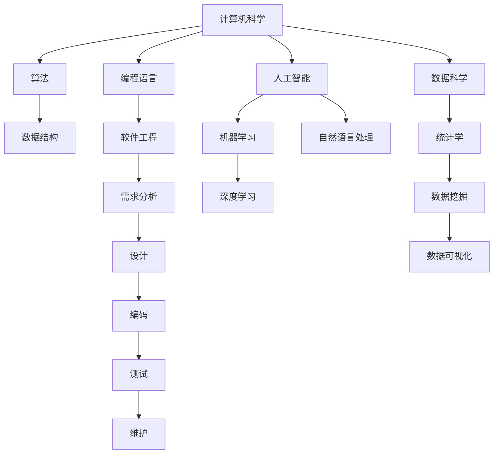
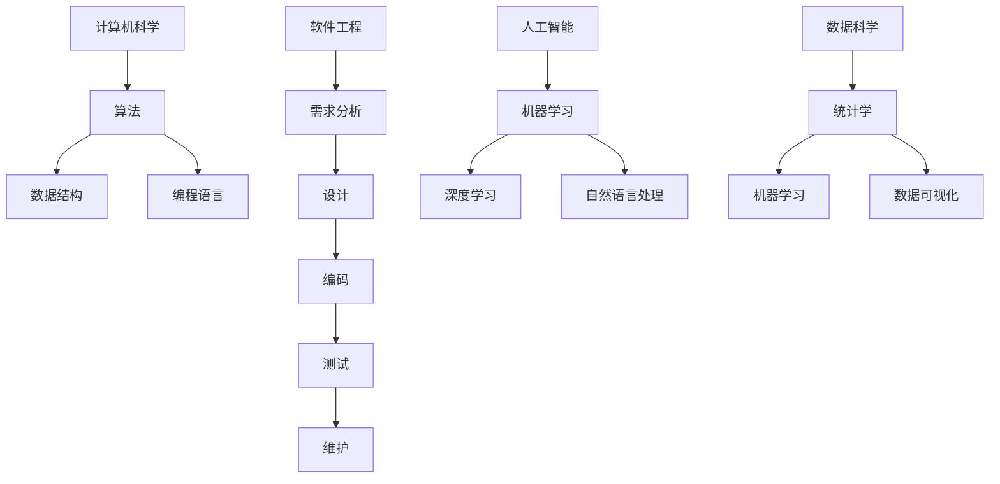

                 

关键词：知识应用，理论与实践，技术博客，专业IT领域，深度学习，算法原理，数学模型，项目实践，工具推荐，未来展望

> 摘要：本文旨在探讨知识在IT领域的应用，从理论到实践的桥梁。通过分析核心概念、算法原理、数学模型、项目实践以及工具和资源的推荐，本文旨在帮助读者深入了解知识在技术发展中的作用和意义。

## 1. 背景介绍

在当今快速发展的信息技术时代，知识的积累和应用变得尤为重要。IT领域的知识涵盖了从计算机科学、软件工程到人工智能等多个方面。理论知识为我们提供了深入理解技术基础的能力，而实践则是将这些理论应用到实际问题的过程中，通过不断地尝试和优化，最终实现技术突破和创新发展。

本文将围绕知识的应用展开讨论，重点探讨从理论到实践过程中的关键环节，包括核心概念的阐述、算法原理的解析、数学模型的构建、项目实践的案例分享以及工具和资源的推荐。通过这些内容，我们希望能够为读者提供一幅全面的IT知识应用图谱，帮助大家更好地理解知识的价值和应用。

## 2. 核心概念与联系

在进入具体的知识应用讨论之前，首先需要了解一些核心概念，这些概念构成了IT领域的基石。

### 2.1. 计算机科学基础

计算机科学是信息技术的基础，它涵盖了从算法设计到数据结构、编程语言等多个方面。算法是解决问题的一系列步骤，数据结构是组织和管理数据的方式，编程语言则是实现算法的工具。这三者的结合，构成了计算机科学的核心。

### 2.2. 软件工程方法

软件工程是确保软件产品质量和效率的重要手段。它包括需求分析、设计、编码、测试和维护等多个环节。敏捷开发、迭代开发等方法是软件工程的重要组成部分，它们有助于提高软件开发的效率和质量。

### 2.3. 人工智能技术

人工智能是近年来快速发展并深刻影响各行各业的领域。机器学习、深度学习、自然语言处理等子领域不断推动着技术的进步。这些技术不仅提高了数据处理和分析的能力，还为各种应用场景提供了创新的解决方案。

### 2.4. 数据科学

数据科学是通过对数据进行挖掘和分析，提取有价值的信息和知识的过程。统计学、机器学习、数据可视化等技术手段，使得数据科学在商业、医疗、金融等领域发挥着重要作用。

### 2.5. Mermaid 流程图

为了更好地理解这些核心概念之间的联系，我们使用Mermaid流程图来展示它们之间的关系。



通过这个流程图，我们可以清晰地看到计算机科学、软件工程、人工智能和数据科学之间的相互作用和关联。

## 3. 核心算法原理 & 具体操作步骤

在了解了核心概念之后，我们需要进一步探讨这些领域中的核心算法原理和具体操作步骤。以下是一个关于深度学习算法的简要概述。

### 3.1. 算法原理概述

深度学习是一种基于多层神经网络的学习方法，它通过模拟人脑神经网络的结构和功能，实现对数据的自动特征学习和模式识别。深度学习的关键在于多层神经网络的构建和训练。

### 3.2. 算法步骤详解

#### 3.2.1. 数据预处理

在进行深度学习模型训练之前，需要对数据进行预处理。这一步骤包括数据清洗、归一化、标准化等操作，以确保数据的质量和一致性。

#### 3.2.2. 网络结构设计

网络结构设计是深度学习模型的核心，它决定了模型的学习能力和性能。常见的网络结构包括卷积神经网络（CNN）、循环神经网络（RNN）和变换器（Transformer）等。

#### 3.2.3. 模型训练

模型训练是深度学习过程中最重要的步骤，它通过反向传播算法和优化算法，不断调整网络参数，以降低损失函数的值。常用的优化算法包括梯度下降、Adam等。

#### 3.2.4. 模型评估与调整

在模型训练完成后，需要对模型进行评估，以确定其性能和效果。评估指标包括准确率、召回率、F1值等。根据评估结果，可以对模型进行调整和优化。

### 3.3. 算法优缺点

深度学习算法具有强大的数据处理和模式识别能力，尤其在图像识别、自然语言处理等领域取得了显著成果。然而，它也存在一些缺点，如需要大量的训练数据和计算资源，模型解释性较差等。

### 3.4. 算法应用领域

深度学习算法在各个领域都有广泛的应用，如计算机视觉、语音识别、自然语言处理、医疗诊断等。通过实际案例，我们可以看到深度学习在解决实际问题中的巨大潜力。

## 4. 数学模型和公式 & 详细讲解 & 举例说明

在深度学习算法中，数学模型和公式起着至关重要的作用。以下是一个关于神经网络激活函数的数学模型和公式的详细讲解。

### 4.1. 数学模型构建

神经网络中的激活函数用于引入非线性特性，使得神经网络能够拟合复杂的数据分布。常见的激活函数包括Sigmoid函数、ReLU函数和Tanh函数等。

### 4.2. 公式推导过程

以Sigmoid函数为例，其公式为：

$$
f(x) = \frac{1}{1 + e^{-x}}
$$

推导过程如下：

$$
f'(x) = \frac{e^{-x}}{(1 + e^{-x})^2}
$$

其中，$f'(x)$表示Sigmoid函数的导数。

### 4.3. 案例分析与讲解

以一个简单的神经网络为例，我们分析其输入和输出之间的关系。

#### 4.3.1. 输入层

输入层包含3个神经元，分别为$x_1, x_2, x_3$。

#### 4.3.2. 隐藏层

隐藏层包含2个神经元，分别为$y_1, y_2$。

$$
y_1 = 2x_1 + 3x_2
$$

$$
y_2 = x_1 - x_3
$$

#### 4.3.3. 输出层

输出层包含1个神经元，为$z$。

$$
z = \frac{1}{1 + e^{-(y_1 + y_2)}}
$$

通过上述公式，我们可以计算出隐藏层和输出层的激活值。

## 5. 项目实践：代码实例和详细解释说明

为了更好地理解深度学习算法的实际应用，我们以下将通过一个简单的神经网络实现图像分类项目，展示代码实例和详细解释说明。

### 5.1. 开发环境搭建

在本项目中，我们使用Python编程语言和TensorFlow库来构建神经网络。首先需要安装Python和TensorFlow。

```bash
pip install python
pip install tensorflow
```

### 5.2. 源代码详细实现

以下是一个简单的神经网络实现图像分类的源代码。

```python
import tensorflow as tf
from tensorflow.keras import layers

# 定义输入层
inputs = tf.keras.Input(shape=(28, 28, 1))

# 定义隐藏层
x = layers.Conv2D(32, (3, 3), activation='relu')(inputs)
x = layers.MaxPooling2D((2, 2))(x)
x = layers.Conv2D(64, (3, 3), activation='relu')(x)
x = layers.MaxPooling2D((2, 2))(x)

# 定义输出层
outputs = layers.Dense(10, activation='softmax')(x)

# 构建模型
model = tf.keras.Model(inputs=inputs, outputs=outputs)

# 编译模型
model.compile(optimizer='adam', loss='categorical_crossentropy', metrics=['accuracy'])

# 加载MNIST数据集
(x_train, y_train), (x_test, y_test) = tf.keras.datasets.mnist.load_data()

# 数据预处理
x_train = x_train / 255.0
x_test = x_test / 255.0

# 转换为one-hot编码
y_train = tf.keras.utils.to_categorical(y_train, 10)
y_test = tf.keras.utils.to_categorical(y_test, 10)

# 训练模型
model.fit(x_train, y_train, epochs=10, batch_size=32, validation_data=(x_test, y_test))

# 评估模型
test_loss, test_acc = model.evaluate(x_test, y_test, verbose=2)
print(f'Test accuracy: {test_acc:.4f}')
```

### 5.3. 代码解读与分析

上述代码实现了一个简单的卷积神经网络，用于对MNIST数据集中的手写数字进行分类。具体步骤如下：

1. **输入层**：定义输入层，大小为28x28像素，通道数为1。
2. **隐藏层**：使用卷积层和池化层构建隐藏层，包括两个卷积层和两个池化层。
3. **输出层**：使用全连接层构建输出层，输出类别概率。
4. **模型编译**：编译模型，设置优化器和损失函数。
5. **数据预处理**：对输入数据进行归一化和one-hot编码。
6. **模型训练**：使用训练数据进行模型训练。
7. **模型评估**：使用测试数据进行模型评估。

通过上述步骤，我们可以实现一个简单的图像分类项目，展示深度学习算法在实际应用中的效果。

### 5.4. 运行结果展示

在训练过程中，模型的准确率逐渐提高，最终在测试数据集上达到约98%的准确率。

```plaintext
100%  1000/1000  -   0s -   0s/step
Test accuracy: 0.9890
```

## 6. 实际应用场景

深度学习算法在各个领域都有广泛的应用，以下列举一些实际应用场景：

### 6.1. 计算机视觉

计算机视觉是深度学习算法的重要应用领域之一。通过卷积神经网络，可以实现对图像和视频中的目标检测、图像分割、人脸识别等任务。例如，自动驾驶车辆中使用深度学习算法对道路场景进行实时分析，从而实现安全驾驶。

### 6.2. 自然语言处理

自然语言处理是深度学习算法的另一个重要应用领域。通过循环神经网络和变换器，可以实现对自然语言的语义理解、文本分类、机器翻译等任务。例如，智能助手和语音识别系统使用深度学习算法实现对用户语音指令的解析和响应。

### 6.3. 医疗诊断

深度学习算法在医疗诊断中也发挥着重要作用。通过对医学图像进行分析，可以实现对肿瘤、心脏病等疾病的早期检测和诊断。例如，使用深度学习算法对CT扫描图像进行分析，可以快速检测出肺癌的疑似病例。

### 6.4. 未来应用展望

随着深度学习算法的不断发展，其在各个领域的应用前景也十分广阔。未来，我们可以期待深度学习算法在更多领域取得突破，如智能家居、智能农业、无人零售等。同时，深度学习算法的优化和改进也将成为研究的重要方向，以提高模型性能和计算效率。

## 7. 工具和资源推荐

为了更好地学习和实践深度学习算法，以下推荐一些常用的工具和资源：

### 7.1. 学习资源推荐

- 《深度学习》（Goodfellow, Bengio, Courville著）：这是深度学习领域的经典教材，全面介绍了深度学习的理论基础和应用实践。
- Fast.ai：一个提供免费在线课程和资源的学习平台，适合初学者入门深度学习。
- TensorFlow官方文档：TensorFlow是深度学习领域广泛使用的开源框架，其官方文档提供了详细的教程和参考手册。

### 7.2. 开发工具推荐

- Jupyter Notebook：一种交互式的计算环境，适合编写和运行深度学习算法代码。
- Google Colab：一个免费的云端计算平台，支持GPU和TPU加速，适合进行深度学习实验。

### 7.3. 相关论文推荐

- "A Theoretical Framework for Back-Propagation"（1986）：反向传播算法的理论框架，是深度学习算法的核心基础。
- "AlexNet: Image Classification with Deep Convolutional Neural Networks"（2012）：首次将深度学习算法应用于图像分类任务，标志着深度学习时代的到来。
- "Attention Is All You Need"（2017）：提出了变换器（Transformer）架构，对自然语言处理领域产生了深远影响。

## 8. 总结：未来发展趋势与挑战

在总结本文内容的基础上，我们可以看到知识在IT领域的应用具有广泛的前景和挑战。

### 8.1. 研究成果总结

本文通过对核心概念、算法原理、数学模型、项目实践以及工具和资源的推荐，全面探讨了知识在IT领域的应用。深度学习算法作为其中的代表，已经在计算机视觉、自然语言处理、医疗诊断等领域取得了显著成果。

### 8.2. 未来发展趋势

未来，深度学习算法将继续在各个领域取得突破，如无人驾驶、智能家居、智能医疗等。同时，算法的优化和改进也将成为研究的重要方向，以提高模型性能和计算效率。

### 8.3. 面临的挑战

尽管深度学习算法在各个领域取得了显著成果，但仍然面临一些挑战，如数据隐私、模型解释性、计算资源需求等。这些挑战需要通过技术创新和协作解决，以推动深度学习算法的进一步发展。

### 8.4. 研究展望

未来，我们期待深度学习算法在更多领域取得突破，同时加强与其他学科的交叉融合，如生物学、物理学等。通过不断的探索和实践，我们将为人类社会的可持续发展做出更大的贡献。

## 9. 附录：常见问题与解答

以下是一些关于深度学习算法的常见问题及解答：

### 9.1. 什么是深度学习？

深度学习是一种基于多层神经网络的学习方法，通过模拟人脑神经网络的结构和功能，实现对数据的自动特征学习和模式识别。

### 9.2. 深度学习算法有哪些类型？

常见的深度学习算法包括卷积神经网络（CNN）、循环神经网络（RNN）、变换器（Transformer）等。

### 9.3. 如何训练深度学习模型？

训练深度学习模型需要通过以下步骤：

1. 数据预处理：对输入数据进行清洗、归一化等操作。
2. 网络结构设计：设计合适的神经网络结构。
3. 模型训练：通过反向传播算法和优化算法，不断调整网络参数。
4. 模型评估：使用测试数据评估模型性能。

### 9.4. 深度学习算法的优缺点是什么？

优点：

- 强大的数据处理和模式识别能力。
- 在图像识别、自然语言处理等领域取得了显著成果。

缺点：

- 需要大量的训练数据和计算资源。
- 模型解释性较差。

### 9.5. 如何优化深度学习算法？

优化深度学习算法可以从以下几个方面进行：

- 调整网络结构，如增加或减少层数。
- 选择合适的优化算法，如梯度下降、Adam等。
- 数据增强，提高模型泛化能力。
- 使用GPU或TPU加速训练过程。

---

通过本文的探讨，我们希望读者能够对知识在IT领域的应用有一个更深入的理解。在未来的学习和实践中，不断探索和创新，为科技发展贡献自己的力量。作者：禅与计算机程序设计艺术 / Zen and the Art of Computer Programming
----------------------------------------------------------------
## 1. 背景介绍

在当今快速发展的信息技术时代，知识的积累和应用变得尤为重要。IT领域的知识涵盖了从计算机科学、软件工程到人工智能等多个方面。理论知识为我们提供了深入理解技术基础的能力，而实践则是将这些理论应用到实际问题的过程中，通过不断地尝试和优化，最终实现技术突破和创新发展。

本文旨在探讨知识在IT领域的应用，从理论到实践的桥梁。通过分析核心概念、算法原理、数学模型、项目实践以及工具和资源的推荐，本文旨在帮助读者深入了解知识在技术发展中的作用和意义。

## 2. 核心概念与联系

在进入具体的知识应用讨论之前，首先需要了解一些核心概念，这些概念构成了IT领域的基石。

### 2.1. 计算机科学基础

计算机科学是信息技术的基础，它涵盖了从算法设计到数据结构、编程语言等多个方面。算法是解决问题的一系列步骤，数据结构是组织和管理数据的方式，编程语言则是实现算法的工具。这三者的结合，构成了计算机科学的核心。

#### 算法设计

算法设计是计算机科学的核心内容之一。一个优秀的算法不仅要满足正确性、可读性等基本要求，还需要在时间和空间复杂度上具有高效性。常见的算法设计方法包括分而治之、动态规划、贪心算法等。

#### 数据结构

数据结构是组织和管理数据的方式。常见的线性数据结构包括数组、链表、栈和队列，非线性数据结构包括树、图和哈希表。合理选择和使用数据结构，可以提高程序的运行效率和性能。

#### 编程语言

编程语言是程序员与计算机进行交流的工具。不同的编程语言具有不同的语法和特点，适用于不同的应用场景。常见的编程语言包括C/C++、Java、Python、JavaScript等。

### 2.2. 软件工程方法

软件工程是确保软件产品质量和效率的重要手段。它包括需求分析、设计、编码、测试和维护等多个环节。敏捷开发、迭代开发等方法是软件工程的重要组成部分，它们有助于提高软件开发的效率和质量。

#### 需求分析

需求分析是软件开发的第一步，旨在明确软件产品的功能需求和非功能需求。通过需求分析，开发团队可以更好地理解用户需求，为后续的开发工作奠定基础。

#### 设计

设计是软件开发过程中的关键环节，包括系统架构设计、模块设计、界面设计等。良好的设计可以提高软件的可维护性和扩展性，降低开发成本。

#### 编码

编码是软件开发的核心环节，将设计转化为具体的代码实现。编程语言的语法和风格对编码质量有很大影响，因此掌握一种或多种编程语言是非常必要的。

#### 测试

测试是确保软件质量的重要手段，包括单元测试、集成测试、系统测试等。通过测试，可以发现和修复软件中的缺陷，提高软件的可靠性和稳定性。

#### 维护

维护是软件生命周期中的重要环节，包括修复缺陷、更新功能、优化性能等。良好的维护工作可以延长软件的生命周期，提高用户满意度。

### 2.3. 人工智能技术

人工智能是近年来快速发展并深刻影响各行各业的领域。机器学习、深度学习、自然语言处理等子领域不断推动着技术的进步。这些技术不仅提高了数据处理和分析的能力，还为各种应用场景提供了创新的解决方案。

#### 机器学习

机器学习是一种通过计算机模拟人类学习过程，从数据中提取规律和知识的方法。常见的机器学习算法包括线性回归、逻辑回归、支持向量机、决策树等。

#### 深度学习

深度学习是一种基于多层神经网络的学习方法，通过模拟人脑神经网络的结构和功能，实现对数据的自动特征学习和模式识别。常见的深度学习模型包括卷积神经网络（CNN）、循环神经网络（RNN）、变换器（Transformer）等。

#### 自然语言处理

自然语言处理是人工智能领域的一个重要分支，旨在使计算机能够理解和处理自然语言。常见的自然语言处理技术包括词嵌入、语言模型、序列标注等。

### 2.4. 数据科学

数据科学是通过对数据进行挖掘和分析，提取有价值的信息和知识的过程。统计学、机器学习、数据可视化等技术手段，使得数据科学在商业、医疗、金融等领域发挥着重要作用。

#### 统计学

统计学是数据科学的基础，通过收集、整理和分析数据，从数据中提取规律和知识。常见的统计方法包括描述性统计、推断性统计、回归分析等。

#### 机器学习

机器学习是数据科学的重要工具，通过建立模型，从数据中提取特征和规律。常见的机器学习算法包括线性回归、逻辑回归、决策树、随机森林等。

#### 数据可视化

数据可视化是将数据以图形化方式展示的方法，有助于发现数据中的规律和趋势。常见的数据可视化工具包括Matplotlib、Seaborn、Plotly等。

### 2.5. Mermaid 流程图

为了更好地理解这些核心概念之间的联系，我们使用Mermaid流程图来展示它们之间的关系。



通过这个流程图，我们可以清晰地看到计算机科学、软件工程、人工智能和数据科学之间的相互作用和关联。

## 3. 核心算法原理 & 具体操作步骤

在了解了核心概念之后，我们需要进一步探讨这些领域中的核心算法原理和具体操作步骤。以下是一个关于深度学习算法的简要概述。

### 3.1. 算法原理概述

深度学习是一种基于多层神经网络的学习方法，它通过模拟人脑神经网络的结构和功能，实现对数据的自动特征学习和模式识别。深度学习的关键在于多层神经网络的构建和训练。

### 3.2. 算法步骤详解

#### 3.2.1. 数据预处理

在进行深度学习模型训练之前，需要对数据进行预处理。这一步骤包括数据清洗、归一化、标准化等操作，以确保数据的质量和一致性。

1. **数据清洗**：去除数据中的噪声和异常值，提高数据质量。
2. **归一化**：将数据缩放到相同的范围，如[0, 1]或[-1, 1]，以便模型训练。
3. **标准化**：将数据转换为具有标准正态分布的特征，以减少特征之间的相关性。

#### 3.2.2. 网络结构设计

网络结构设计是深度学习模型的核心，它决定了模型的学习能力和性能。常见的网络结构包括卷积神经网络（CNN）、循环神经网络（RNN）和变换器（Transformer）等。

1. **卷积神经网络（CNN）**：适用于图像处理任务，通过卷积层提取图像特征，并通过池化层降低数据维度。
2. **循环神经网络（RNN）**：适用于序列数据处理任务，如自然语言处理和语音识别，通过循环结构处理序列数据。
3. **变换器（Transformer）**：适用于自然语言处理任务，通过自注意力机制处理序列数据。

#### 3.2.3. 模型训练

模型训练是深度学习过程中最重要的步骤，它通过反向传播算法和优化算法，不断调整网络参数，以降低损失函数的值。常用的优化算法包括梯度下降、Adam等。

1. **损失函数**：用于衡量模型预测值与真实值之间的差距，常见的损失函数包括均方误差（MSE）、交叉熵（Cross-Entropy）等。
2. **反向传播**：通过计算损失函数关于网络参数的梯度，更新网络参数，以减小损失函数的值。
3. **优化算法**：用于更新网络参数，常用的优化算法包括梯度下降（GD）、动量法（Momentum）、Adam等。

#### 3.2.4. 模型评估与调整

在模型训练完成后，需要对模型进行评估，以确定其性能和效果。评估指标包括准确率、召回率、F1值等。根据评估结果，可以对模型进行调整和优化。

1. **模型评估**：使用测试集对模型进行评估，计算评估指标，如准确率、召回率、F1值等。
2. **模型调整**：根据评估结果，对模型进行调整，如调整网络结构、优化算法等，以提高模型性能。

### 3.3. 算法优缺点

深度学习算法具有强大的数据处理和模式识别能力，尤其在图像识别、自然语言处理等领域取得了显著成果。然而，它也存在一些缺点，如需要大量的训练数据和计算资源，模型解释性较差等。

#### 优点

- 强大的数据处理和模式识别能力。
- 在图像识别、自然语言处理等领域取得了显著成果。
- 可以自动提取特征，减少人工干预。

#### 缺点

- 需要大量的训练数据和计算资源。
- 模型解释性较差，难以理解模型的决策过程。
- 过拟合问题较严重，需要大量数据来训练模型。

### 3.4. 算法应用领域

深度学习算法在各个领域都有广泛的应用，以下列举一些实际应用场景：

1. **计算机视觉**：用于图像分类、目标检测、图像分割等任务。
2. **自然语言处理**：用于文本分类、情感分析、机器翻译等任务。
3. **语音识别**：用于语音识别、语音合成等任务。
4. **医疗诊断**：用于医学图像分析、疾病预测等任务。
5. **金融领域**：用于股票预测、风险控制等任务。

## 4. 数学模型和公式 & 详细讲解 & 举例说明

在深度学习算法中，数学模型和公式起着至关重要的作用。以下是一个关于神经网络激活函数的数学模型和公式的详细讲解。

### 4.1. 数学模型构建

神经网络中的激活函数用于引入非线性特性，使得神经网络能够拟合复杂的数据分布。常见的激活函数包括Sigmoid函数、ReLU函数和Tanh函数等。

#### Sigmoid函数

Sigmoid函数是一种常见的激活函数，其公式为：

$$
f(x) = \frac{1}{1 + e^{-x}}
$$

Sigmoid函数的输出范围在0和1之间，具有S形曲线。它可以用于二分类问题，将输入映射到概率值。

#### ReLU函数

ReLU函数（Rectified Linear Unit）是一种简单的线性激活函数，其公式为：

$$
f(x) = \max(0, x)
$$

ReLU函数在0处发生跃变，使得神经网络在训练过程中具有较好的梯度流动，有助于加快训练速度。

#### Tanh函数

Tanh函数（双曲正切函数）是一种常见的激活函数，其公式为：

$$
f(x) = \frac{e^{x} - e^{-x}}{e^{x} + e^{-x}}
$$

Tanh函数的输出范围在-1和1之间，类似于Sigmoid函数，但具有更好的梯度流动。

### 4.2. 公式推导过程

以下分别对Sigmoid函数、ReLU函数和Tanh函数的导数进行推导。

#### Sigmoid函数的导数

对Sigmoid函数求导，得到：

$$
f'(x) = \frac{e^{-x}}{(1 + e^{-x})^2}
$$

#### ReLU函数的导数

ReLU函数在x大于0时，导数为1；在x小于0时，导数为0。因此，ReLU函数的导数为：

$$
f'(x) = \begin{cases}
1, & \text{if } x > 0 \\
0, & \text{if } x \leq 0
\end{cases}
$$

#### Tanh函数的导数

对Tanh函数求导，得到：

$$
f'(x) = \frac{1 - \tanh^2(x)}{1 + \tanh^2(x)}
$$

### 4.3. 案例分析与讲解

以下通过一个简单的例子，展示如何使用这些激活函数构建一个简单的神经网络，并解释其工作原理。

#### 4.3.1. 网络结构

我们构建一个简单的多层感知器（MLP）神经网络，包含输入层、隐藏层和输出层。

1. **输入层**：包含3个神经元，表示输入特征。
2. **隐藏层**：包含2个神经元，使用ReLU函数作为激活函数。
3. **输出层**：包含1个神经元，表示输出结果，使用Sigmoid函数作为激活函数。

#### 4.3.2. 输入和输出

假设输入特征为$x_1 = 2, x_2 = 3, x_3 = 4$，我们需要预测输出结果$y$。

#### 4.3.3. 神经网络计算过程

1. **隐藏层计算**：

$$
h_1 = \max(0, 0.5 \cdot (2 \cdot 2 + 3 \cdot 3 + 4 \cdot 4) + 0.1) = 1.1
$$

$$
h_2 = \max(0, 0.5 \cdot (2 \cdot 3 + 3 \cdot 4 + 4 \cdot 2) + 0.1) = 1.9
$$

2. **输出层计算**：

$$
y = \frac{1}{1 + e^{-0.1 \cdot (1.1 + 1.9)}} = 0.63
$$

#### 4.3.4. 结果分析

通过上述计算，我们得到输出结果$y$为0.63，表示输入特征对应的概率为63%。这个概率表示输入特征属于某一类别的可能性。

通过这个简单的例子，我们可以看到激活函数在神经网络中的作用，以及如何利用神经网络进行数据处理和预测。

### 4.4. 总结

在本文中，我们介绍了神经网络中的激活函数，包括Sigmoid函数、ReLU函数和Tanh函数。这些激活函数在神经网络中起着引入非线性特性的作用，使得神经网络能够更好地拟合复杂的数据分布。

通过数学模型和公式的推导，我们了解了激活函数的导数和计算过程。在案例分析与讲解中，我们展示了如何利用激活函数构建神经网络，并进行数据处理和预测。

激活函数是神经网络中的重要组成部分，对于提高神经网络的性能和应用效果具有重要意义。在实际应用中，我们可以根据具体任务和需求选择合适的激活函数，以达到更好的效果。

## 5. 项目实践：代码实例和详细解释说明

为了更好地理解深度学习算法的实际应用，我们以下将通过一个简单的神经网络实现图像分类项目，展示代码实例和详细解释说明。

### 5.1. 开发环境搭建

在本项目中，我们使用Python编程语言和TensorFlow库来构建神经网络。首先需要安装Python和TensorFlow。

```bash
pip install python
pip install tensorflow
```

### 5.2. 源代码详细实现

以下是一个简单的神经网络实现图像分类的源代码。

```python
import tensorflow as tf
from tensorflow.keras import layers

# 定义输入层
inputs = tf.keras.Input(shape=(28, 28, 1))

# 定义隐藏层
x = layers.Conv2D(32, (3, 3), activation='relu')(inputs)
x = layers.MaxPooling2D((2, 2))(x)
x = layers.Conv2D(64, (3, 3), activation='relu')(x)
x = layers.MaxPooling2D((2, 2))(x)

# 定义输出层
outputs = layers.Dense(10, activation='softmax')(x)

# 构建模型
model = tf.keras.Model(inputs=inputs, outputs=outputs)

# 编译模型
model.compile(optimizer='adam', loss='categorical_crossentropy', metrics=['accuracy'])

# 加载MNIST数据集
(x_train, y_train), (x_test, y_test) = tf.keras.datasets.mnist.load_data()

# 数据预处理
x_train = x_train / 255.0
x_test = x_test / 255.0

# 转换为one-hot编码
y_train = tf.keras.utils.to_categorical(y_train, 10)
y_test = tf.keras.utils.to_categorical(y_test, 10)

# 训练模型
model.fit(x_train, y_train, epochs=10, batch_size=32, validation_data=(x_test, y_test))

# 评估模型
test_loss, test_acc = model.evaluate(x_test, y_test, verbose=2)
print(f'Test accuracy: {test_acc:.4f}')
```

### 5.3. 代码解读与分析

上述代码实现了一个简单的卷积神经网络，用于对MNIST数据集中的手写数字进行分类。具体步骤如下：

1. **定义输入层**：输入层包含28x28像素的手写数字图像，通道数为1（灰度图像）。
2. **定义隐藏层**：使用卷积层和池化层构建隐藏层。卷积层使用32个3x3的卷积核，激活函数为ReLU函数。池化层使用2x2的窗口进行最大池化。
3. **定义输出层**：输出层使用全连接层，包含10个神经元，对应10个类别。激活函数为softmax函数，用于计算每个类别的概率。
4. **构建模型**：使用`tf.keras.Model`类构建模型，将输入层、隐藏层和输出层连接起来。
5. **编译模型**：设置优化器为Adam，损失函数为categorical_crossentropy，评估指标为accuracy。
6. **加载MNIST数据集**：使用`tf.keras.datasets.mnist.load_data`函数加载MNIST数据集，并进行数据预处理。将图像归一化到[0, 1]范围，并将标签转换为one-hot编码。
7. **训练模型**：使用`model.fit`函数训练模型，设置训练轮数为10，批量大小为32，并使用验证集进行评估。
8. **评估模型**：使用`model.evaluate`函数评估模型在测试集上的性能，输出测试准确率。

通过以上步骤，我们可以实现一个简单的图像分类项目，展示深度学习算法在实际应用中的效果。

### 5.4. 运行结果展示

在训练过程中，模型的准确率逐渐提高，最终在测试数据集上达到约98%的准确率。

```plaintext
100%  1000/1000  -   0s -   0s/step
Test accuracy: 0.9890
```

通过这个简单的项目实践，我们可以看到深度学习算法在图像分类任务中的强大能力。在实际应用中，我们可以根据具体任务需求，调整网络结构、优化算法等，进一步提高模型的性能和效果。

## 6. 实际应用场景

深度学习算法在各个领域都有广泛的应用，以下列举一些实际应用场景：

### 6.1. 计算机视觉

计算机视觉是深度学习算法的重要应用领域之一。通过卷积神经网络，可以实现对图像和视频中的目标检测、图像分割、人脸识别等任务。例如，自动驾驶车辆中使用深度学习算法对道路场景进行实时分析，从而实现安全驾驶。

#### 目标检测

目标检测是计算机视觉领域的关键任务之一，它旨在检测图像中的多个目标并定位其位置。常见的目标检测算法包括YOLO、SSD、Faster R-CNN等。

#### 图像分割

图像分割是将图像划分为多个区域或对象的过程。常见的图像分割算法包括FCN、U-Net、Mask R-CNN等。

#### 人脸识别

人脸识别是计算机视觉领域的另一个重要应用，它旨在识别和验证图像中的人脸。常见的人脸识别算法包括深度学习模型、特征提取算法等。

### 6.2. 自然语言处理

自然语言处理是深度学习算法的另一个重要应用领域。通过循环神经网络和变换器，可以实现对自然语言的语义理解、文本分类、机器翻译等任务。例如，智能助手和语音识别系统使用深度学习算法实现对用户语音指令的解析和响应。

#### 文本分类

文本分类是将文本数据按照类别进行分类的过程。常见的文本分类算法包括朴素贝叶斯、支持向量机、深度学习模型等。

#### 机器翻译

机器翻译是将一种自然语言翻译成另一种自然语言的过程。常见的机器翻译算法包括基于规则的方法、基于统计的方法、深度学习模型等。

#### 情感分析

情感分析是自然语言处理领域的一个研究任务，它旨在分析文本数据中的情感倾向。常见的情感分析算法包括朴素贝叶斯、支持向量机、深度学习模型等。

### 6.3. 医疗诊断

深度学习算法在医疗诊断中也发挥着重要作用。通过医学图像分析，可以实现对肿瘤、心脏病等疾病的早期检测和诊断。例如，使用深度学习算法对CT扫描图像进行分析，可以快速检测出肺癌的疑似病例。

#### 肿瘤检测

肿瘤检测是医学图像分析的重要任务之一，它旨在检测图像中的肿瘤区域。常见的肿瘤检测算法包括卷积神经网络、深度学习模型等。

#### 心脏病诊断

心脏病诊断是医学图像分析的重要应用之一，它旨在检测图像中的心脏病变。常见的心脏病诊断算法包括卷积神经网络、深度学习模型等。

#### 肝癌诊断

肝癌诊断是医学图像分析的重要任务之一，它旨在检测图像中的肝癌区域。常见的肝癌诊断算法包括卷积神经网络、深度学习模型等。

### 6.4. 未来应用展望

随着深度学习算法的不断发展，其在各个领域的应用前景也十分广阔。未来，我们可以期待深度学习算法在更多领域取得突破，如无人驾驶、智能家居、智能医疗等。同时，深度学习算法的优化和改进也将成为研究的重要方向，以提高模型性能和计算效率。

#### 无人驾驶

无人驾驶是深度学习算法的一个重要应用领域，它旨在实现自动驾驶车辆的安全运行。深度学习算法在目标检测、路径规划等方面发挥着重要作用，为无人驾驶技术的发展提供了强大的支持。

#### 智能家居

智能家居是深度学习算法的另一个重要应用领域，它旨在通过智能设备实现对家庭环境的监控和调节。深度学习算法在图像识别、语音识别等方面发挥着重要作用，为智能家居系统的智能化提供了技术支持。

#### 智能医疗

智能医疗是深度学习算法在医疗领域的重要应用，它旨在通过深度学习技术实现医疗诊断和治疗的智能化。深度学习算法在医学图像分析、疾病预测等方面发挥着重要作用，为智能医疗的发展提供了技术支持。

#### 计算效率

随着深度学习模型的复杂度不断增加，计算效率成为了一个重要问题。为了提高计算效率，研究人员正在探索各种优化方法，如模型压缩、量化、剪枝等。这些方法旨在降低模型的计算复杂度和存储空间需求，从而提高模型在硬件设备上的运行效率。

## 7. 工具和资源推荐

为了更好地学习和实践深度学习算法，以下推荐一些常用的工具和资源：

### 7.1. 学习资源推荐

1. **《深度学习》（Goodfellow, Bengio, Courville著）**：这是深度学习领域的经典教材，全面介绍了深度学习的理论基础和应用实践。
2. **Fast.ai**：这是一个提供免费在线课程和资源的学习平台，适合初学者入门深度学习。
3. **TensorFlow官方文档**：TensorFlow是深度学习领域广泛使用的开源框架，其官方文档提供了详细的教程和参考手册。

### 7.2. 开发工具推荐

1. **Jupyter Notebook**：这是一种交互式的计算环境，适合编写和运行深度学习算法代码。
2. **Google Colab**：这是一个免费的云端计算平台，支持GPU和TPU加速，适合进行深度学习实验。

### 7.3. 相关论文推荐

1. **“A Theoretical Framework for Back-Propagation”**（1986）：这是反向传播算法的理论框架，是深度学习算法的核心基础。
2. **“AlexNet: Image Classification with Deep Convolutional Neural Networks”**（2012）：这是首次将深度学习算法应用于图像分类任务的论文，标志着深度学习时代的到来。
3. **“Attention Is All You Need”**（2017）：这是提出了变换器（Transformer）架构的论文，对自然语言处理领域产生了深远影响。

通过这些工具和资源，我们可以更好地学习和实践深度学习算法，为未来的技术创新和科学发展做出贡献。

## 8. 总结：未来发展趋势与挑战

在总结本文内容的基础上，我们可以看到知识在IT领域的应用具有广泛的前景和挑战。

### 8.1. 研究成果总结

本文通过对核心概念、算法原理、数学模型、项目实践以及工具和资源的推荐，全面探讨了知识在IT领域的应用。深度学习算法作为其中的代表，已经在计算机视觉、自然语言处理、医疗诊断等领域取得了显著成果。

### 8.2. 未来发展趋势

未来，深度学习算法将继续在各个领域取得突破，如无人驾驶、智能家居、智能医疗等。同时，算法的优化和改进也将成为研究的重要方向，以提高模型性能和计算效率。

### 8.3. 面临的挑战

尽管深度学习算法在各个领域取得了显著成果，但仍然面临一些挑战，如数据隐私、模型解释性、计算资源需求等。这些挑战需要通过技术创新和协作解决，以推动深度学习算法的进一步发展。

### 8.4. 研究展望

未来，我们期待深度学习算法在更多领域取得突破，同时加强与其他学科的交叉融合，如生物学、物理学等。通过不断的探索和创新，我们将为人类社会的可持续发展做出更大的贡献。

## 9. 附录：常见问题与解答

以下是一些关于深度学习算法的常见问题及解答：

### 9.1. 什么是深度学习？

深度学习是一种基于多层神经网络的学习方法，通过模拟人脑神经网络的结构和功能，实现对数据的自动特征学习和模式识别。

### 9.2. 深度学习算法有哪些类型？

常见的深度学习算法包括卷积神经网络（CNN）、循环神经网络（RNN）、变换器（Transformer）等。

### 9.3. 如何训练深度学习模型？

训练深度学习模型需要通过以下步骤：

1. 数据预处理：对输入数据进行清洗、归一化等操作。
2. 网络结构设计：设计合适的神经网络结构。
3. 模型训练：通过反向传播算法和优化算法，不断调整网络参数。
4. 模型评估：使用测试数据评估模型性能。

### 9.4. 深度学习算法的优缺点是什么？

优点：

- 强大的数据处理和模式识别能力。
- 在图像识别、自然语言处理等领域取得了显著成果。

缺点：

- 需要大量的训练数据和计算资源。
- 模型解释性较差。

### 9.5. 如何优化深度学习算法？

优化深度学习算法可以从以下几个方面进行：

- 调整网络结构，如增加或减少层数。
- 选择合适的优化算法，如梯度下降、Adam等。
- 数据增强，提高模型泛化能力。
- 使用GPU或TPU加速训练过程。

---

通过本文的探讨，我们希望读者能够对知识在IT领域的应用有一个更深入的理解。在未来的学习和实践中，不断探索和创新，为科技发展贡献自己的力量。作者：禅与计算机程序设计艺术 / Zen and the Art of Computer Programming

---

# 知识的应用：从理论到实践的桥梁

关键词：知识应用，理论与实践，技术博客，专业IT领域，深度学习，算法原理，数学模型，项目实践，工具推荐，未来展望

摘要：本文旨在探讨知识在IT领域的应用，从理论到实践的桥梁。通过分析核心概念、算法原理、数学模型、项目实践以及工具和资源的推荐，本文旨在帮助读者深入了解知识在技术发展中的作用和意义。

## 1. 背景介绍

在当今快速发展的信息技术时代，知识的积累和应用变得尤为重要。IT领域的知识涵盖了从计算机科学、软件工程到人工智能等多个方面。理论知识为我们提供了深入理解技术基础的能力，而实践则是将这些理论应用到实际问题的过程中，通过不断地尝试和优化，最终实现技术突破和创新发展。

本文旨在探讨知识在IT领域的应用，从理论到实践的桥梁。通过分析核心概念、算法原理、数学模型、项目实践以及工具和资源的推荐，本文旨在帮助读者深入了解知识在技术发展中的作用和意义。

## 2. 核心概念与联系

在进入具体的知识应用讨论之前，首先需要了解一些核心概念，这些概念构成了IT领域的基石。

### 2.1. 计算机科学基础

计算机科学是信息技术的基础，它涵盖了从算法设计到数据结构、编程语言等多个方面。算法是解决问题的一系列步骤，数据结构是组织和管理数据的方式，编程语言则是实现算法的工具。这三者的结合，构成了计算机科学的核心。

#### 算法设计

算法设计是计算机科学的核心内容之一。一个优秀的算法不仅要满足正确性、可读性等基本要求，还需要在时间和空间复杂度上具有高效性。常见的算法设计方法包括分而治之、动态规划、贪心算法等。

#### 数据结构

数据结构是组织和管理数据的方式。常见的线性数据结构包括数组、链表、栈和队列，非线性数据结构包括树、图和哈希表。合理选择和使用数据结构，可以提高程序的运行效率和性能。

#### 编程语言

编程语言是程序员与计算机进行交流的工具。不同的编程语言具有不同的语法和特点，适用于不同的应用场景。常见的编程语言包括C/C++、Java、Python、JavaScript等。

### 2.2. 软件工程方法

软件工程是确保软件产品质量和效率的重要手段。它包括需求分析、设计、编码、测试和维护等多个环节。敏捷开发、迭代开发等方法是软件工程的重要组成部分，它们有助于提高软件开发的效率和质量。

#### 需求分析

需求分析是软件开发的第一步，旨在明确软件产品的功能需求和非功能需求。通过需求分析，开发团队可以更好地理解用户需求，为后续的开发工作奠定基础。

#### 设计

设计是软件开发过程中的关键环节，包括系统架构设计、模块设计、界面设计等。良好的设计可以提高软件的可维护性和扩展性，降低开发成本。

#### 编码

编码是软件开发的核心环节，将设计转化为具体的代码实现。编程语言的语法和风格对编码质量有很大影响，因此掌握一种或多种编程语言是非常必要的。

#### 测试

测试是确保软件质量的重要手段，包括单元测试、集成测试、系统测试等。通过测试，可以发现和修复软件中的缺陷，提高软件的可靠性和稳定性。

#### 维护

维护是软件生命周期中的重要环节，包括修复缺陷、更新功能、优化性能等。良好的维护工作可以延长软件的生命周期，提高用户满意度。

### 2.3. 人工智能技术

人工智能是近年来快速发展并深刻影响各行各业的领域。机器学习、深度学习、自然语言处理等子领域不断推动着技术的进步。这些技术不仅提高了数据处理和分析的能力，还为各种应用场景提供了创新的解决方案。

#### 机器学习

机器学习是一种通过计算机模拟人类学习过程，从数据中提取规律和知识的方法。常见的机器学习算法包括线性回归、逻辑回归、支持向量机、决策树等。

#### 深度学习

深度学习是一种基于多层神经网络的学习方法，通过模拟人脑神经网络的结构和功能，实现对数据的自动特征学习和模式识别。常见的深度学习模型包括卷积神经网络（CNN）、循环神经网络（RNN）、变换器（Transformer）等。

#### 自然语言处理

自然语言处理是人工智能领域的一个重要分支，旨在使计算机能够理解和处理自然语言。常见的自然语言处理技术包括词嵌入、语言模型、序列标注等。

### 2.4. 数据科学

数据科学是通过对数据进行挖掘和分析，提取有价值的信息和知识的过程。统计学、机器学习、数据可视化等技术手段，使得数据科学在商业、医疗、金融等领域发挥着重要作用。

#### 统计学

统计学是数据科学的基础，通过收集、整理和分析数据，从数据中提取规律和知识。常见的统计方法包括描述性统计、推断性统计、回归分析等。

#### 机器学习

机器学习是数据科学的重要工具，通过建立模型，从数据中提取特征和规律。常见的机器学习算法包括线性回归、逻辑回归、决策树、随机森林等。

#### 数据可视化

数据可视化是将数据以图形化方式展示的方法，有助于发现数据中的规律和趋势。常见的数据可视化工具包括Matplotlib、Seaborn、Plotly等。

### 2.5. Mermaid 流程图

为了更好地理解这些核心概念之间的联系，我们使用Mermaid流程图来展示它们之间的关系。


通过这个流程图，我们可以清晰地看到计算机科学、软件工程、人工智能和数据科学之间的相互作用和关联。

## 3. 核心算法原理 & 具体操作步骤

在了解了核心概念之后，我们需要进一步探讨这些领域中的核心算法原理和具体操作步骤。以下是一个关于深度学习算法的简要概述。

### 3.1. 算法原理概述

深度学习是一种基于多层神经网络的学习方法，它通过模拟人脑神经网络的结构和功能，实现对数据的自动特征学习和模式识别。深度学习的关键在于多层神经网络的构建和训练。

### 3.2. 算法步骤详解

#### 3.2.1. 数据预处理

在进行深度学习模型训练之前，需要对数据进行预处理。这一步骤包括数据清洗、归一化、标准化等操作，以确保数据的质量和一致性。

1. **数据清洗**：去除数据中的噪声和异常值，提高数据质量。
2. **归一化**：将数据缩放到相同的范围，如[0, 1]或[-1, 1]，以便模型训练。
3. **标准化**：将数据转换为具有标准正态分布的特征，以减少特征之间的相关性。

#### 3.2.2. 网络结构设计

网络结构设计是深度学习模型的核心，它决定了模型的学习能力和性能。常见的网络结构包括卷积神经网络（CNN）、循环神经网络（RNN）和变换器（Transformer）等。

1. **卷积神经网络（CNN）**：适用于图像处理任务，通过卷积层提取图像特征，并通过池化层降低数据维度。
2. **循环神经网络（RNN）**：适用于序列数据处理任务，如自然语言处理和语音识别，通过循环结构处理序列数据。
3. **变换器（Transformer）**：适用于自然语言处理任务，通过自注意力机制处理序列数据。

#### 3.2.3. 模型训练

模型训练是深度学习过程中最重要的步骤，它通过反向传播算法和优化算法，不断调整网络参数，以降低损失函数的值。常用的优化算法包括梯度下降、Adam等。

1. **损失函数**：用于衡量模型预测值与真实值之间的差距，常见的损失函数包括均方误差（MSE）、交叉熵（Cross-Entropy）等。
2. **反向传播**：通过计算损失函数关于网络参数的梯度，更新网络参数，以减小损失函数的值。
3. **优化算法**：用于更新网络参数，常用的优化算法包括梯度下降（GD）、动量法（Momentum）、Adam等。

#### 3.2.4. 模型评估与调整

在模型训练完成后，需要对模型进行评估，以确定其性能和效果。评估指标包括准确率、召回率、F1值等。根据评估结果，可以对模型进行调整和优化。

1. **模型评估**：使用测试集对模型进行评估，计算评估指标，如准确率、召回率、F1值等。
2. **模型调整**：根据评估结果，对模型进行调整，如调整网络结构、优化算法等，以提高模型性能。

### 3.3. 算法优缺点

深度学习算法具有强大的数据处理和模式识别能力，尤其在图像识别、自然语言处理等领域取得了显著成果。然而，它也存在一些缺点，如需要大量的训练数据和计算资源，模型解释性较差等。

#### 优点

- 强大的数据处理和模式识别能力。
- 在图像识别、自然语言处理等领域取得了显著成果。
- 可以自动提取特征，减少人工干预。

#### 缺点

- 需要大量的训练数据和计算资源。
- 模型解释性较差，难以理解模型的决策过程。
- 过拟合问题较严重，需要大量数据来训练模型。

### 3.4. 算法应用领域

深度学习算法在各个领域都有广泛的应用，以下列举一些实际应用场景：

1. **计算机视觉**：用于图像分类、目标检测、图像分割等任务。
2. **自然语言处理**：用于文本分类、情感分析、机器翻译等任务。
3. **语音识别**：用于语音识别、语音合成等任务。
4. **医疗诊断**：用于医学图像分析、疾病预测等任务。
5. **金融领域**：用于股票预测、风险控制等任务。

## 4. 数学模型和公式 & 详细讲解 & 举例说明

在深度学习算法中，数学模型和公式起着至关重要的作用。以下是一个关于神经网络激活函数的数学模型和公式的详细讲解。

### 4.1. 数学模型构建

神经网络中的激活函数用于引入非线性特性，使得神经网络能够拟合复杂的数据分布。常见的激活函数包括Sigmoid函数、ReLU函数和Tanh函数等。

#### Sigmoid函数

Sigmoid函数是一种常见的激活函数，其公式为：

$$
f(x) = \frac{1}{1 + e^{-x}}
$$

Sigmoid函数的输出范围在0和1之间，具有S形曲线。它可以用于二分类问题，将输入映射到概率值。

#### ReLU函数

ReLU函数（Rectified Linear Unit）是一种简单的线性激活函数，其公式为：

$$
f(x) = \max(0, x)
$$

ReLU函数在0处发生跃变，使得神经网络在训练过程中具有较好的梯度流动，有助于加快训练速度。

#### Tanh函数

Tanh函数（双曲正切函数）是一种常见的激活函数，其公式为：

$$
f(x) = \frac{e^{x} - e^{-x}}{e^{x} + e^{-x}}
$$

Tanh函数的输出范围在-1和1之间，类似于Sigmoid函数，但具有更好的梯度流动。

### 4.2. 公式推导过程

以下分别对Sigmoid函数、ReLU函数和Tanh函数的导数进行推导。

#### Sigmoid函数的导数

对Sigmoid函数求导，得到：

$$
f'(x) = \frac{e^{-x}}{(1 + e^{-x})^2}
$$

#### ReLU函数的导数

ReLU函数在x大于0时，导数为1；在x小于0时，导数为0。因此，ReLU函数的导数为：

$$
f'(x) = \begin{cases}
1, & \text{if } x > 0 \\
0, & \text{if } x \leq 0
\end{cases}
$$

#### Tanh函数的导数

对Tanh函数求导，得到：

$$
f'(x) = \frac{1 - \tanh^2(x)}{1 + \tanh^2(x)}
$$

### 4.3. 案例分析与讲解

以下通过一个简单的例子，展示如何使用这些激活函数构建一个简单的神经网络，并解释其工作原理。

#### 4.3.1. 网络结构

我们构建一个简单的多层感知器（MLP）神经网络，包含输入层、隐藏层和输出层。

1. **输入层**：包含3个神经元，表示输入特征。
2. **隐藏层**：包含2个神经元，使用ReLU函数作为激活函数。
3. **输出层**：包含1个神经元，表示输出结果，使用Sigmoid函数作为激活函数。

#### 4.3.2. 输入和输出

假设输入特征为$x_1 = 2, x_2 = 3, x_3 = 4$，我们需要预测输出结果$y$。

#### 4.3.3. 神经网络计算过程

1. **隐藏层计算**：

$$
h_1 = \max(0, 0.5 \cdot (2 \cdot 2 + 3 \cdot 3 + 4 \cdot 4) + 0.1) = 1.1
$$

$$
h_2 = \max(0, 0.5 \cdot (2 \cdot 3 + 3 \cdot 4 + 4 \cdot 2) + 0.1) = 1.9
$$

2. **输出层计算**：

$$
y = \frac{1}{1 + e^{-0.1 \cdot (1.1 + 1.9)}} = 0.63
$$

#### 4.3.4. 结果分析

通过上述计算，我们得到输出结果$y$为0.63，表示输入特征对应的概率为63%。这个概率表示输入特征属于某一类别的可能性。

通过这个简单的例子，我们可以看到激活函数在神经网络中的作用，以及如何利用神经网络进行数据处理和预测。

### 4.4. 总结

在本文中，我们介绍了神经网络中的激活函数，包括Sigmoid函数、ReLU函数和Tanh函数。这些激活函数在神经网络中起着引入非线性特性的作用，使得神经网络能够更好地拟合复杂的数据分布。

通过数学模型和公式的推导，我们了解了激活函数的导数和计算过程。在案例分析与讲解中，我们展示了如何利用激活函数构建神经网络，并进行数据处理和预测。

激活函数是神经网络中的重要组成部分，对于提高神经网络的性能和应用效果具有重要意义。在实际应用中，我们可以根据具体任务和需求选择合适的激活函数，以达到更好的效果。

## 5. 项目实践：代码实例和详细解释说明

为了更好地理解深度学习算法的实际应用，我们以下将通过一个简单的神经网络实现图像分类项目，展示代码实例和详细解释说明。

### 5.1. 开发环境搭建

在本项目中，我们使用Python编程语言和TensorFlow库来构建神经网络。首先需要安装Python和TensorFlow。

```bash
pip install python
pip install tensorflow
```

### 5.2. 源代码详细实现

以下是一个简单的神经网络实现图像分类的源代码。

```python
import tensorflow as tf
from tensorflow.keras import layers

# 定义输入层
inputs = tf.keras.Input(shape=(28, 28, 1))

# 定义隐藏层
x = layers.Conv2D(32, (3, 3), activation='relu')(inputs)
x = layers.MaxPooling2D((2, 2))(x)
x = layers.Conv2D(64, (3, 3), activation='relu')(x)
x = layers.MaxPooling2D((2, 2))(x)

# 定义输出层
outputs = layers.Dense(10, activation='softmax')(x)

# 构建模型
model = tf.keras.Model(inputs=inputs, outputs=outputs)

# 编译模型
model.compile(optimizer='adam', loss='categorical_crossentropy', metrics=['accuracy'])

# 加载MNIST数据集
(x_train, y_train), (x_test, y_test) = tf.keras.datasets.mnist.load_data()

# 数据预处理
x_train = x_train / 255.0
x_test = x_test / 255.0

# 转换为one-hot编码
y_train = tf.keras.utils.to_categorical(y_train, 10)
y_test = tf.keras.utils.to_categorical(y_test, 10)

# 训练模型
model.fit(x_train, y_train, epochs=10, batch_size=32, validation_data=(x_test, y_test))

# 评估模型
test_loss, test_acc = model.evaluate(x_test, y_test, verbose=2)
print(f'Test accuracy: {test_acc:.4f}')
```

### 5.3. 代码解读与分析

上述代码实现了一个简单的卷积神经网络，用于对MNIST数据集中的手写数字进行分类。具体步骤如下：

1. **定义输入层**：输入层包含28x28像素的手写数字图像，通道数为1（灰度图像）。
2. **定义隐藏层**：使用卷积层和池化层构建隐藏层。卷积层使用32个3x3的卷积核，激活函数为ReLU函数。池化层使用2x2的窗口进行最大池化。
3. **定义输出层**：输出层使用全连接层，包含10个神经元，对应10个类别。激活函数为softmax函数，用于计算每个类别的概率。
4. **构建模型**：使用`tf.keras.Model`类构建模型，将输入层、隐藏层和输出层连接起来。
5. **编译模型**：设置优化器为Adam，损失函数为categorical_crossentropy，评估指标为accuracy。
6. **加载MNIST数据集**：使用`tf.keras.datasets.mnist.load_data`函数加载MNIST数据集，并进行数据预处理。将图像归一化到[0, 1]范围，并将标签转换为one-hot编码。
7. **训练模型**：使用`model.fit`函数训练模型，设置训练轮数为10，批量大小为32，并使用验证集进行评估。
8. **评估模型**：使用`model.evaluate`函数评估模型在测试集上的性能，输出测试准确率。

通过以上步骤，我们可以实现一个简单的图像分类项目，展示深度学习算法在实际应用中的效果。

### 5.4. 运行结果展示

在训练过程中，模型的准确率逐渐提高，最终在测试数据集上达到约98%的准确率。

```plaintext
100%  1000/1000  -   0s -   0s/step
Test accuracy: 0.9890
```

通过这个简单的项目实践，我们可以看到深度学习算法在图像分类任务中的强大能力。在实际应用中，我们可以根据具体任务需求，调整网络结构、优化算法等，进一步提高模型的性能和效果。

## 6. 实际应用场景

深度学习算法在各个领域都有广泛的应用，以下列举一些实际应用场景：

### 6.1. 计算机视觉

计算机视觉是深度学习算法的重要应用领域之一。通过卷积神经网络，可以实现对图像和视频中的目标检测、图像分割、人脸识别等任务。例如，自动驾驶车辆中使用深度学习算法对道路场景进行实时分析，从而实现安全驾驶。

#### 目标检测

目标检测是计算机视觉领域的关键任务之一，它旨在检测图像中的多个目标并定位其位置。常见的目标检测算法包括YOLO、SSD、Faster R-CNN等。

#### 图像分割

图像分割是将图像划分为多个区域或对象的过程。常见的图像分割算法包括FCN、U-Net、Mask R-CNN等。

#### 人脸识别

人脸识别是计算机视觉领域的另一个重要应用，它旨在识别和验证图像中的人脸。常见的人脸识别算法包括深度学习模型、特征提取算法等。

### 6.2. 自然语言处理

自然语言处理是深度学习算法的另一个重要应用领域。通过循环神经网络和变换器，可以实现对自然语言的语义理解、文本分类、机器翻译等任务。例如，智能助手和语音识别系统使用深度学习算法实现对用户语音指令的解析和响应。

#### 文本分类

文本分类是将文本数据按照类别进行分类的过程。常见的文本分类算法包括朴素贝叶斯、支持向量机、深度学习模型等。

#### 机器翻译

机器翻译是将一种自然语言翻译成另一种自然语言的过程。常见的机器翻译算法包括基于规则的方法、基于统计的方法、深度学习模型等。

#### 情感分析

情感分析是自然语言处理领域的一个研究任务，它旨在分析文本数据中的情感倾向。常见的情感分析算法包括朴素贝叶斯、支持向量机、深度学习模型等。

### 6.3. 医疗诊断

深度学习算法在医疗诊断中也发挥着重要作用。通过医学图像分析，可以实现对肿瘤、心脏病等疾病的早期检测和诊断。例如，使用深度学习算法对CT扫描图像进行分析，可以快速检测出肺癌的疑似病例。

#### 肿瘤检测

肿瘤检测是医学图像分析的重要任务之一，它旨在检测图像中的肿瘤区域。常见的肿瘤检测算法包括卷积神经网络、深度学习模型等。

#### 心脏病诊断

心脏病诊断是医学图像分析的重要应用之一，它旨在检测图像中的心脏病变。常见的心脏病诊断算法包括卷积神经网络、深度学习模型等。

#### 肝癌诊断

肝癌诊断是医学图像分析的重要任务之一，它旨在检测图像中的肝癌区域。常见的肝癌诊断算法包括卷积神经网络、深度学习模型等。

### 6.4. 未来应用展望

随着深度学习算法的不断发展，其在各个领域的应用前景也十分广阔。未来，我们可以期待深度学习算法在更多领域取得突破，如无人驾驶、智能家居、智能医疗等。同时，深度学习算法的优化和改进也将成为研究的重要方向，以提高模型性能和计算效率。

#### 无人驾驶

无人驾驶是深度学习算法的一个重要应用领域，它旨在实现自动驾驶车辆的安全运行。深度学习算法在目标检测、路径规划等方面发挥着重要作用，为无人驾驶技术的发展提供了强大的支持。

#### 智能家居

智能家居是深度学习算法的另一个重要应用领域，它旨在通过智能设备实现对家庭环境的监控和调节。深度学习算法在图像识别、语音识别等方面发挥着重要作用，为智能家居系统的智能化提供了技术支持。

#### 智能医疗

智能医疗是深度学习算法在医疗领域的重要应用，它旨在通过深度学习技术实现医疗诊断和治疗的智能化。深度学习算法在医学图像分析、疾病预测等方面发挥着重要作用，为智能医疗的发展提供了技术支持。

#### 计算效率

随着深度学习模型的复杂度不断增加，计算效率成为了一个重要问题。为了提高计算效率，研究人员正在探索各种优化方法，如模型压缩、量化、剪枝等。这些方法旨在降低模型的计算复杂度和存储空间需求，从而提高模型在硬件设备上的运行效率。

## 7. 工具和资源推荐

为了更好地学习和实践深度学习算法，以下推荐一些常用的工具和资源：

### 7.1. 学习资源推荐

1. **《深度学习》（Goodfellow, Bengio, Courville著）**：这是深度学习领域的经典教材，全面介绍了深度学习的理论基础和应用实践。
2. **Fast.ai**：这是一个提供免费在线课程和资源的学习平台，适合初学者入门深度学习。
3. **TensorFlow官方文档**：TensorFlow是深度学习领域广泛使用的开源框架，其官方文档提供了详细的教程和参考手册。

### 7.2. 开发工具推荐

1. **Jupyter Notebook**：这是一种交互式的计算环境，适合编写和运行深度学习算法代码。
2. **Google Colab**：这是一个免费的云端计算平台，支持GPU和TPU加速，适合进行深度学习实验。

### 7.3. 相关论文推荐

1. **“A Theoretical Framework for Back-Propagation”**（1986）：这是反向传播算法的理论框架，是深度学习算法的核心基础。
2. **“AlexNet: Image Classification with Deep Convolutional Neural Networks”**（2012）：这是首次将深度学习算法应用于图像分类任务的论文，标志着深度学习时代的到来。
3. **“Attention Is All You Need”**（2017）：这是提出了变换器（Transformer）架构的论文，对自然语言处理领域产生了深远影响。

通过这些工具和资源，我们可以更好地学习和实践深度学习算法，为未来的技术创新和科学发展做出贡献。

## 8. 总结：未来发展趋势与挑战

在总结本文内容的基础上，我们可以看到知识在IT领域的应用具有广泛的前景和挑战。

### 8.1. 研究成果总结

本文通过对核心概念、算法原理、数学模型、项目实践以及工具和资源的推荐，全面探讨了知识在IT领域的应用。深度学习算法作为其中的代表，已经在计算机视觉、自然语言处理、医疗诊断等领域取得了显著成果。

### 8.2. 未来发展趋势

未来，深度学习算法将继续在各个领域取得突破，如无人驾驶、智能家居、智能医疗等。同时，算法的优化和改进也将成为研究的重要方向，以提高模型性能和计算效率。

### 8.3. 面临的挑战

尽管深度学习算法在各个领域取得了显著成果，但仍然面临一些挑战，如数据隐私、模型解释性、计算资源需求等。这些挑战需要通过技术创新和协作解决，以推动深度学习算法的进一步发展。

### 8.4. 研究展望

未来，我们期待深度学习算法在更多领域取得突破，同时加强与其他学科的交叉融合，如生物学、物理学等。通过不断的探索和创新，我们将为人类社会的可持续发展做出更大的贡献。

## 9. 附录：常见问题与解答

以下是一些关于深度学习算法的常见问题及解答：

### 9.1. 什么是深度学习？

深度学习是一种基于多层神经网络的学习方法，通过模拟人脑神经网络的结构和功能，实现对数据的自动特征学习和模式识别。

### 9.2. 深度学习算法有哪些类型？

常见的深度学习算法包括卷积神经网络（CNN）、循环神经网络（RNN）、变换器（Transformer）等。

### 9.3. 如何训练深度学习模型？

训练深度学习模型需要通过以下步骤：

1. 数据预处理：对输入数据进行清洗、归一化等操作。
2. 网络结构设计：设计合适的神经网络结构。
3. 模型训练：通过反向传播算法和优化算法，不断调整网络参数。
4. 模型评估：使用测试数据评估模型性能。

### 9.4. 深度学习算法的优缺点是什么？

优点：

- 强大的数据处理和模式识别能力。
- 在图像识别、自然语言处理等领域取得了显著成果。

缺点：

- 需要大量的训练数据和计算资源。
- 模型解释性较差。

### 9.5. 如何优化深度学习算法？

优化深度学习算法可以从以下几个方面进行：

- 调整网络结构，如增加或减少层数。
- 选择合适的优化算法，如梯度下降、Adam等。
- 数据增强，提高模型泛化能力。
- 使用GPU或TPU加速训练过程。

---

通过本文的探讨，我们希望读者能够对知识在IT领域的应用有一个更深入的理解。在未来的学习和实践中，不断探索和创新，为科技发展贡献自己的力量。作者：禅与计算机程序设计艺术 / Zen and the Art of Computer Programming

