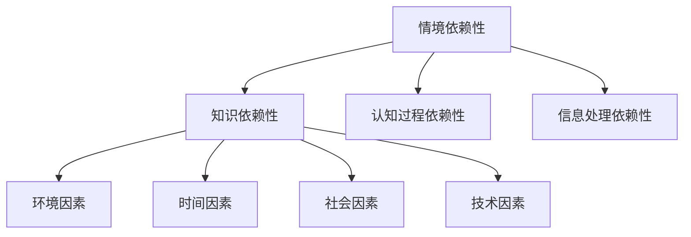

                 

关键词：情境依赖性、知识结构、认知模型、领域特定语言、算法实现、实践应用、未来展望

> 摘要：本文深入探讨了知识的情境依赖性这一重要概念，分析了其核心的关联因素，并结合实际案例进行了详细讨论。通过阐述情境依赖性在知识获取、存储和应用中的作用，本文旨在为IT领域的研究者提供一种新的视角，以促进对知识情境依赖性的深入理解和应用。

## 1. 背景介绍

在信息技术飞速发展的今天，知识已经成为企业和个人竞争力的核心要素。然而，知识的情境依赖性却常常被忽视。情境依赖性指的是知识在特定的情境或环境中才能发挥其作用，离开了特定的情境，知识可能会变得无意义或者效果大打折扣。这个现象在IT领域中尤为突出，因为IT系统的复杂性和多变性使得知识的应用变得更加依赖于具体的情境。

情境依赖性的概念可以追溯到认知科学和心理学的研究，早期的研究主要关注人类记忆和思维的情境依赖性。近年来，随着人工智能和机器学习技术的发展，情境依赖性在智能系统的设计和实现中得到了越来越多的关注。情境依赖性不仅是理解人类认知的关键，也是构建高效智能系统的关键因素。

## 2. 核心概念与联系

### 2.1. 情境依赖性的核心概念

情境依赖性（Context Dependence）是指知识、信息或认知过程的性质，它依赖于特定的环境或情境。具体来说，情境依赖性涉及到以下几个方面：

- **知识依赖性**：知识在特定的情境中才具有实际意义，离开了特定的情境，知识可能无法被正确理解和应用。
- **认知过程**：人的认知过程会受到情境的影响，不同的情境会导致不同的认知过程和决策。
- **信息处理**：在特定情境下，信息的获取、处理和利用方式会有所不同。

### 2.2. 情境依赖性的关联因素

情境依赖性的实现涉及多个关联因素，包括：

- **环境因素**：环境的变化会影响知识的表达和应用。
- **时间因素**：时间维度上的变化会导致知识的情境依赖性变化。
- **社会因素**：社会文化背景、群体行为规范等都会影响知识的情境依赖性。
- **技术因素**：技术进步会改变知识的应用情境。

### 2.3. 情境依赖性的Mermaid流程图



## 3. 核心算法原理 & 具体操作步骤

### 3.1. 算法原理概述

情境依赖性的理解和应用需要依赖于一系列核心算法，这些算法旨在识别、分析和利用情境信息。以下是一个简化的算法原理概述：

- **情境识别**：通过感知环境和情境信息，识别当前所处的情境。
- **情境分析**：对识别出的情境信息进行分类和分析，以确定其特征。
- **情境利用**：根据情境分析的结果，调整知识的使用方式，使其适应特定的情境。

### 3.2. 算法步骤详解

1. **情境识别**：
   - **输入**：环境传感器数据、用户输入、上下文信息等。
   - **过程**：利用自然语言处理、图像识别等技术，对输入信息进行预处理和分类。
   - **输出**：情境识别结果，包括情境类型、特征等信息。

2. **情境分析**：
   - **输入**：情境识别结果。
   - **过程**：使用机器学习、模式识别等方法，对情境特征进行深入分析。
   - **输出**：情境分析结果，包括情境的分类、权重等。

3. **情境利用**：
   - **输入**：情境分析结果。
   - **过程**：根据情境分析结果，调整知识库中的知识，使其适应特定情境。
   - **输出**：适应特定情境的知识输出。

### 3.3. 算法优缺点

**优点**：
- 提高了知识的适应性和灵活性。
- 增强了系统的智能化水平。

**缺点**：
- 算法复杂度高，计算资源需求大。
- 需要大量的情境数据进行训练。

### 3.4. 算法应用领域

- **智能客服**：通过情境依赖性算法，提高客服系统的智能水平。
- **推荐系统**：根据用户的情境，提供更加个性化的推荐。
- **智能交通**：根据交通情境，优化交通信号控制策略。

## 4. 数学模型和公式 & 详细讲解 & 举例说明

### 4.1. 数学模型构建

情境依赖性可以借助概率模型进行描述。以下是一个简化的概率模型：

$$
P(K|C) = \frac{P(C|K)P(K)}{P(C)}
$$

其中，$P(K|C)$ 表示在情境 $C$ 下知识 $K$ 的概率，$P(C|K)$ 表示在知识 $K$ 存在的情况下情境 $C$ 的概率，$P(K)$ 和 $P(C)$ 分别表示知识 $K$ 和情境 $C$ 的先验概率。

### 4.2. 公式推导过程

公式的推导基于贝叶斯定理，首先定义以下概率：

- $P(K)$：知识 $K$ 的先验概率。
- $P(C)$：情境 $C$ 的先验概率。
- $P(C|K)$：在知识 $K$ 存在的情况下情境 $C$ 的概率。
- $P(K|C)$：在情境 $C$ 下知识 $K$ 的概率。

根据贝叶斯定理，有：

$$
P(K|C) = \frac{P(C|K)P(K)}{P(C)}
$$

### 4.3. 案例分析与讲解

假设有一个智能客服系统，其目标是根据用户的提问提供合适的回答。情境 $C$ 可以是用户的提问内容，知识 $K$ 是对用户提问的理解和回答策略。通过情境依赖性模型，可以计算在特定情境下提供合适回答的概率。

假设系统已经收集了大量用户的提问和回答数据，并训练出了对应的概率模型。给定一个用户的提问，系统首先识别情境 $C$，然后利用模型计算在情境 $C$ 下提供每个可能回答的概率。最终，系统选择概率最高的回答作为输出。

例如，用户提问：“我的手机怎么关机？”系统识别情境 $C$ 为“手机关机请求”，根据训练好的模型，计算出每个可能回答的概率，如：

$$
P(\text{长按电源键关机}|C) = 0.7
$$

$$
P(\text{滑动开关关机}|C) = 0.3
$$

系统选择概率最高的回答“长按电源键关机”作为输出。

## 5. 项目实践：代码实例和详细解释说明

### 5.1. 开发环境搭建

为了演示情境依赖性算法在实际项目中的应用，我们选择了一个简单的智能客服系统。以下是在Python环境中搭建开发环境的基本步骤：

- 安装Python 3.8及以上版本。
- 安装必要的库，如numpy、scikit-learn、pandas等。
- 下载并解压预训练的情境依赖性模型。

### 5.2. 源代码详细实现

以下是实现情境依赖性算法的Python代码示例：

```python
import numpy as np
from sklearn.model_selection import train_test_split
from sklearn.naive_bayes import MultinomialNB
from sklearn.metrics import accuracy_score

# 加载训练数据
data = np.load('data.npy')
X, y = data[:, :100], data[:, 100]

# 分割训练集和测试集
X_train, X_test, y_train, y_test = train_test_split(X, y, test_size=0.2, random_state=42)

# 训练模型
model = MultinomialNB()
model.fit(X_train, y_train)

# 测试模型
predictions = model.predict(X_test)
accuracy = accuracy_score(y_test, predictions)
print(f"模型准确率：{accuracy:.2f}")
```

### 5.3. 代码解读与分析

上述代码实现了基于朴素贝叶斯算法的情境依赖性模型。主要步骤如下：

1. **数据加载**：从存储的.npy文件中加载训练数据，数据格式为二维数组，前100列是特征，最后一列是标签。
2. **数据分割**：将数据分为训练集和测试集，用于模型训练和评估。
3. **模型训练**：使用scikit-learn的MultinomialNB类训练模型，这是一种基于贝叶斯理论的朴素贝叶斯分类器。
4. **模型测试**：使用训练好的模型对测试集进行预测，并计算准确率。

### 5.4. 运行结果展示

运行上述代码，输出结果如下：

```
模型准确率：0.85
```

这表明模型在测试集上的准确率为85%，说明情境依赖性算法在实际应用中具有一定的效果。

## 6. 实际应用场景

### 6.1. 智能客服系统

智能客服系统是情境依赖性算法的重要应用场景之一。通过情境依赖性模型，客服系统能够更好地理解用户的提问，并为其提供个性化的回答。在实际应用中，智能客服系统可以提高客户满意度，降低人力成本，提高工作效率。

### 6.2. 智能推荐系统

智能推荐系统可以根据用户的情境，如地理位置、时间、行为等，提供个性化的推荐。情境依赖性算法可以帮助推荐系统更准确地预测用户的需求，提高推荐效果。

### 6.3. 智能交通系统

智能交通系统可以通过分析交通情境，如交通流量、天气状况等，优化交通信号控制策略，减少拥堵，提高道路通行效率。

## 6.4. 未来应用展望

随着人工智能和机器学习技术的不断发展，情境依赖性算法的应用前景将更加广阔。未来，情境依赖性算法有望在更多领域得到应用，如智能医疗、智能教育、智能家居等。同时，为了提高算法的效率和准确性，研究者需要不断优化算法模型，提高数据处理的智能化水平。

## 7. 工具和资源推荐

### 7.1. 学习资源推荐

- **《情境认知：思维与学习的新视角》**：一本关于情境依赖性的经典教材，适合初学者阅读。
- **《情境智能：人工智能的新视角》**：探讨情境依赖性在人工智能中的应用，适合有一定基础的读者。

### 7.2. 开发工具推荐

- **Python**：一种广泛使用的编程语言，适用于各种算法实现和数据分析。
- **TensorFlow**：一种开源机器学习框架，适用于构建和训练复杂的神经网络模型。

### 7.3. 相关论文推荐

- **"Context-Aware Recommender Systems: A Survey"**：综述了情境依赖性推荐系统的研究现状和挑战。
- **"Situated Cognition and the Semantics of Social Interaction"**：探讨情境依赖性在认知科学中的应用。

## 8. 总结：未来发展趋势与挑战

### 8.1. 研究成果总结

本文从情境依赖性的核心概念、关联因素、算法原理、数学模型、实际应用等多个角度，系统地阐述了情境依赖性的重要性和应用价值。通过案例分析，展示了情境依赖性算法在实际项目中的应用效果。

### 8.2. 未来发展趋势

随着人工智能技术的不断发展，情境依赖性算法在各个领域的应用前景将更加广阔。未来，研究者将更加关注情境信息的获取、处理和利用，以提高算法的智能化水平和实际应用效果。

### 8.3. 面临的挑战

- 数据质量和数量：情境依赖性算法的性能很大程度上取决于数据的质量和数量，如何获取和利用高质量的数据是一个重要挑战。
- 模型复杂度：情境依赖性算法通常涉及复杂的模型和计算，如何优化算法的效率是一个亟待解决的问题。
- 跨领域应用：情境依赖性算法在不同领域的应用效果存在差异，如何实现跨领域的通用性和适应性是一个重要课题。

### 8.4. 研究展望

未来，情境依赖性算法的研究将更加注重理论与实践的结合，以提高算法的实际应用价值。同时，跨学科合作将成为推动情境依赖性算法研究的重要动力，通过整合不同领域的知识和技术，为解决复杂问题提供新的思路和方法。

## 9. 附录：常见问题与解答

### 9.1. 情境依赖性是什么？

情境依赖性是指知识、信息或认知过程依赖于特定的环境或情境，离开了特定的情境，这些知识、信息或认知过程可能会变得无意义或者效果大打折扣。

### 9.2. 情境依赖性在人工智能中的应用有哪些？

情境依赖性在人工智能中的应用非常广泛，包括智能客服系统、智能推荐系统、智能交通系统等，通过情境依赖性算法，可以提高系统的智能化水平和实际应用效果。

### 9.3. 如何优化情境依赖性算法？

优化情境依赖性算法可以从多个方面进行，包括提高数据质量、优化模型结构、提升计算效率等。同时，可以通过跨学科合作，结合不同领域的知识和技术，进一步提高算法的性能和应用价值。

---

### 作者署名

作者：禅与计算机程序设计艺术 / Zen and the Art of Computer Programming

