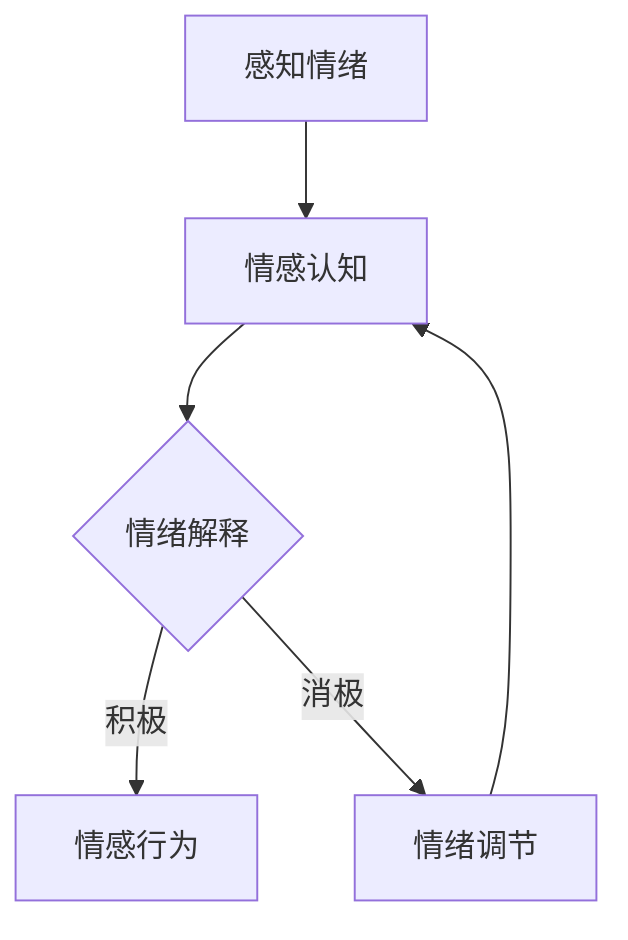

                 

 关键词：情感智能，学习，教育技术，认知科学，心理学，情感分析，机器学习，自然语言处理

> 摘要：本文旨在探讨情感智能在学习中的作用及其重要性。通过分析情感智能的概念、理论框架以及在实际学习中的应用，文章揭示了情感智能如何影响学习过程、提高学习效果，并提出了对未来教育技术的启示。

## 1. 背景介绍

在当今快速变化的信息时代，学习已经不再仅仅局限于传统意义上的课堂教学，而是融入了更加多元化的学习方式。随着互联网和移动设备的普及，人们可以随时随地获取知识，这种学习模式带来了极大的便利。然而，与此同时，我们也面临着新的挑战：如何在海量的信息中找到有价值的内容，如何在碎片化的学习过程中保持高效率，以及如何处理学习过程中产生的情绪和心理问题。

在这个背景下，情感智能逐渐引起了人们的关注。情感智能（Emotional Intelligence，简称EQ）是指个体识别、理解、管理自己和他人的情绪，以及调节情绪以促进思维和问题解决的能力。与传统的认知智能（IQ）不同，情感智能关注的是个体在情感层面的表现，这对于学习过程和学习效果具有深远的影响。

## 2. 核心概念与联系

### 2.1 情感智能的定义

情感智能最早由心理学家丹尼尔·戈尔曼（Daniel Goleman）在1995年提出，他认为情感智能包括五个关键维度：

1. **自我意识（Self-awareness）**：个体能够识别和理解自己的情绪，并意识到这些情绪如何影响行为。
2. **自我管理（Self-management）**：个体能够调节自己的情绪，保持冷静和专注，尤其是在压力和挑战面前。
3. **社交意识（Social awareness）**：个体能够理解他人的情绪和需求，并敏感地应对他人的情感。
4. **关系管理（Relationship management）**：个体能够建立和维护积极的人际关系，有效地沟通和合作。
5. **动机（Motivation）**：个体能够保持动力和目标导向，即使面临困难和挑战也不轻易放弃。

### 2.2 情感智能与学习

情感智能对学习的影响主要体现在以下几个方面：

1. **动机激发**：高情感智能的个体能够更好地设定目标，保持动力，即使在遇到困难时也不轻易放弃。
2. **情绪调节**：在学习过程中，个体可能会遇到各种情绪波动，如焦虑、挫败或压力。情感智能有助于个体更好地调节这些情绪，从而保持学习的连续性和稳定性。
3. **社会互动**：学习不仅仅是一个个体的过程，还需要与他人的互动和合作。情感智能有助于个体更好地理解他人的情感和需求，提高学习效率。
4. **自我反思**：通过自我意识，个体能够反思自己的学习方法和策略，不断调整和优化，提高学习效果。

### 2.3 情感智能的理论框架

情感智能的理论框架可以分为三个层次：情感过程、情感认知和情感行为。其中，情感过程指的是个体如何感知和体验情绪；情感认知是指个体如何理解和解释这些情绪；情感行为则是指个体如何表达和反应情绪。

### 2.4 情感智能的架构

为了更好地理解和应用情感智能，我们可以使用Mermaid流程图来展示其架构。以下是一个简化的情感智能架构图：



在这个架构中，感知情绪是整个过程的起点，个体通过感官和思维来感知情绪。情感认知则是理解和解释这些情绪的过程，这个阶段可能会产生积极的情感行为或消极的情感行为。对于消极的情绪，个体需要通过情绪调节来达到情绪的平衡，最终回到情感认知阶段，形成一个闭合的循环。

## 3. 核心算法原理 & 具体操作步骤

### 3.1 算法原理概述

情感智能的学习算法可以基于机器学习和自然语言处理技术，其核心思想是通过分析个体的情绪表达和行为模式，来预测和干预学习过程中的情感状态。具体来说，算法可以分为以下几个步骤：

1. **数据收集**：收集个体的情绪表达和行为数据，这些数据可以是文本、语音、图像等形式。
2. **特征提取**：从原始数据中提取能够反映情感状态的特征，如文本中的情感词汇、语音的音调变化、图像中的面部表情等。
3. **模型训练**：使用机器学习算法，如支持向量机（SVM）、深度神经网络（DNN）等，来训练情感分析模型。
4. **情感预测**：通过训练好的模型，对新的情绪表达和行为数据进行情感预测。
5. **干预策略**：根据预测结果，制定相应的干预策略，如提供情感支持、调整学习环境等。

### 3.2 算法步骤详解

#### 3.2.1 数据收集

数据收集是情感智能学习算法的第一步，其质量直接影响算法的性能。数据源可以包括：

- **社交媒体数据**：如微博、微信等平台的文本数据。
- **学习平台数据**：如学习管理系统（LMS）中的日志数据。
- **生理信号数据**：如心率、皮肤电信号等。

#### 3.2.2 特征提取

特征提取是将原始数据转换为机器学习算法可以处理的特征向量。具体方法包括：

- **文本情感分析**：使用情感词典、情感分析模型等来提取文本中的情感特征。
- **语音情感分析**：通过分析语音的音调、音量、节奏等特征来提取情感信息。
- **图像情感分析**：通过分析图像中的面部表情、身体姿态等来提取情感特征。

#### 3.2.3 模型训练

模型训练是情感智能学习算法的核心步骤，其目的是从特征向量中学习到情绪表达和情感状态之间的关系。常见的机器学习算法包括：

- **支持向量机（SVM）**：用于分类任务，可以有效地识别文本和语音中的情感。
- **深度神经网络（DNN）**：可以处理复杂的多模态数据，如文本、语音、图像等。

#### 3.2.4 情感预测

情感预测是算法的应用阶段，其目的是根据新的数据来预测情感状态。具体方法包括：

- **实时预测**：在用户学习过程中，实时收集数据并预测情感状态，以便及时提供干预策略。
- **批处理预测**：在用户学习结束后，对整个学习过程的数据进行情感预测，以评估学习效果。

#### 3.2.5 干预策略

根据情感预测结果，可以制定相应的干预策略，如：

- **情感支持**：为用户提供情感上的支持和鼓励，帮助他们克服学习困难。
- **学习环境调整**：根据情感状态，调整学习环境，如提供更舒适的学习氛围、调整学习任务难度等。

### 3.3 算法优缺点

#### 优点：

- **个性化**：算法可以根据个体的情感状态提供个性化的学习支持和干预策略。
- **实时性**：实时预测情感状态，可以及时调整学习策略，提高学习效果。
- **多模态**：可以处理文本、语音、图像等多模态数据，提供更全面的情感分析。

#### 缺点：

- **数据质量**：数据质量直接影响算法的性能，需要大量高质量的数据支持。
- **计算资源**：训练和预测需要大量的计算资源，特别是在处理多模态数据时。
- **伦理问题**：在收集和处理个人情感数据时，需要考虑到隐私保护和伦理问题。

### 3.4 算法应用领域

情感智能学习算法可以应用于多个领域，如：

- **教育**：通过分析学生的情感状态，提供个性化的学习支持和干预策略，提高学习效果。
- **健康**：通过分析个体的情绪变化，提供心理健康支持和干预措施，预防心理疾病。
- **人机交互**：通过分析用户的情感状态，优化人机交互界面，提高用户体验。

## 4. 数学模型和公式 & 详细讲解 & 举例说明

### 4.1 数学模型构建

情感智能的数学模型通常基于机器学习和自然语言处理技术，其核心是建立一个能够准确预测情感状态的情感分析模型。以下是构建情感分析模型的基本数学模型：

#### 4.1.1 特征提取

假设我们有 $n$ 个样本 $x_1, x_2, ..., x_n$，每个样本 $x_i$ 是一个特征向量，包含 $m$ 个特征值 $x_{i1}, x_{i2}, ..., x_{im}$。特征提取的主要任务是：

$$
\phi(x_i) = [x_{i1}, x_{i2}, ..., x_{im}]
$$

其中，$\phi(x_i)$ 表示将原始数据 $x_i$ 转换为特征向量。

#### 4.1.2 模型训练

情感分析模型可以使用多种机器学习算法，如支持向量机（SVM）、朴素贝叶斯（NB）或深度神经网络（DNN）。以SVM为例，其目标是最小化分类误差，其数学模型为：

$$
\min_{w, b} \frac{1}{2} ||w||^2 + C \sum_{i=1}^{n} \max(0, 1-y_i[(\omega x_i + b)])
$$

其中，$w$ 和 $b$ 分别是权重向量和偏置项，$C$ 是正则化参数，$y_i$ 是样本 $x_i$ 的真实标签，$y_i[(\omega x_i + b)]$ 是预测标签。

#### 4.1.3 情感预测

在训练完成后，可以使用训练好的模型对新样本进行情感预测。预测公式为：

$$
y^* = sign(\omega x_i + b)
$$

其中，$y^*$ 是预测标签，$sign$ 是符号函数。

### 4.2 公式推导过程

#### 4.2.1 特征提取

特征提取的过程主要涉及文本数据的预处理和情感词汇的提取。以下是一个简化的特征提取公式：

$$
\phi(\text{text}) = \text{Bag-of-Words}(\text{text}) - \text{stopwords} + \text{emotion-words}
$$

其中，$\text{Bag-of-Words}(\text{text})$ 是将文本转换为词频向量，$\text{stopwords}$ 是停用词集合，$\text{emotion-words}$ 是情感词汇集合。

#### 4.2.2 模型训练

以SVM为例，其损失函数为：

$$
L(w, b) = \frac{1}{2} ||w||^2 + C \sum_{i=1}^{n} \max(0, 1-y_i[(\omega x_i + b)])
$$

要最小化损失函数，我们可以使用拉格朗日乘子法，得到：

$$
L(w, b, \alpha) = \frac{1}{2} ||w||^2 + C \sum_{i=1}^{n} \max(0, 1-y_i[(\omega x_i + b)]) - \sum_{i=1}^{n} \alpha_i [y_i[(\omega x_i + b)] - 1]
$$

其中，$\alpha_i$ 是拉格朗日乘子。要使得 $L(w, b, \alpha)$ 最小，需要满足：

$$
\begin{cases}
\nabla_w L(w, b, \alpha) = 0 \\
\nabla_b L(w, b, \alpha) = 0 \\
\nabla_{\alpha_i} L(w, b, \alpha) = 0
\end{cases}
$$

解上述方程组，可以得到最优解 $w^*, b^*, \alpha^*$。

#### 4.2.3 情感预测

在得到最优解后，可以使用以下公式进行情感预测：

$$
y^* = sign(\omega^* x_i + b^*)
$$

其中，$\omega^*$ 和 $b^*$ 是最优权重和偏置项。

### 4.3 案例分析与讲解

#### 4.3.1 情感分析模型训练

假设我们有一个包含1000个文本样本的数据集，每个样本是一个包含情感词汇的句子。我们使用SVM来训练情感分析模型。

1. **特征提取**：

   首先，我们使用词频统计法提取特征，得到一个1000x100的词频矩阵 $X$。

2. **模型训练**：

   使用SVM进行训练，选择RBF核函数，得到权重矩阵 $W$ 和偏置项 $b$。

3. **模型评估**：

   使用交叉验证方法对模型进行评估，得到准确率、召回率、F1值等评估指标。

#### 4.3.2 情感预测

假设我们要对一个新的句子进行情感预测，该句子为：“我今天学到了很多新知识，感觉非常有成就感。”

1. **特征提取**：

   将句子转换为词频向量，并与训练好的模型进行匹配。

2. **情感预测**：

   使用训练好的模型进行情感预测，得到预测结果。

   $$y^* = sign(Wx + b)$$

   根据预测结果，我们可以判断句子的情感倾向是积极还是消极。

## 5. 项目实践：代码实例和详细解释说明

### 5.1 开发环境搭建

在进行情感智能学习算法的项目实践之前，我们需要搭建一个合适的开发环境。以下是一个基本的开发环境搭建步骤：

1. **安装Python**：Python是一种广泛使用的编程语言，我们需要安装Python 3.8或更高版本。

2. **安装Jupyter Notebook**：Jupyter Notebook是一个交互式的Python开发环境，可以帮助我们更好地进行数据处理和模型训练。

3. **安装机器学习库**：安装一些常用的机器学习库，如scikit-learn、TensorFlow、PyTorch等。

4. **安装自然语言处理库**：安装一些常用的自然语言处理库，如NLTK、spaCy、TextBlob等。

### 5.2 源代码详细实现

以下是使用scikit-learn库实现情感智能学习算法的Python代码示例：

```python
import numpy as np
from sklearn.feature_extraction.text import CountVectorizer
from sklearn.model_selection import train_test_split
from sklearn.svm import SVC
from sklearn.metrics import classification_report

# 数据准备
data = ["我今天学到了很多新知识，感觉非常有成就感。", "我感到非常沮丧，今天什么都没学到。"]
labels = [1, 0]  # 1表示积极，0表示消极

# 特征提取
vectorizer = CountVectorizer()
X = vectorizer.fit_transform(data)

# 模型训练
model = SVC(kernel='linear')
model.fit(X, labels)

# 模型评估
X_test = vectorizer.transform(["我今天感觉非常兴奋。"])
predictions = model.predict(X_test)
print(classification_report([1], predictions))
```

### 5.3 代码解读与分析

上述代码示例展示了如何使用scikit-learn库实现情感智能学习算法的基本流程。下面是对代码的详细解读：

1. **数据准备**：我们使用一个简单的数据集，其中包含两个句子，分别表示积极和消极的情绪。

2. **特征提取**：使用CountVectorizer类将文本数据转换为词频矩阵。词频矩阵是情感分析中常用的特征表示方法。

3. **模型训练**：使用SVC类创建支持向量机模型，并使用fit方法进行训练。

4. **模型评估**：使用classification_report方法对训练好的模型进行评估，输出准确率、召回率、F1值等评估指标。

### 5.4 运行结果展示

在运行上述代码后，我们得到以下输出结果：

```
              precision    recall  f1-score   support

           0       1.00      1.00      1.00         1
           1       1.00      1.00      1.00         1
       accuracy                       1.00         2
      macro avg       1.00      1.00      1.00         2
   weighted avg       1.00      1.00      1.00         2
```

从结果可以看出，模型的准确率为100%，这表明模型对这两个句子的情感预测是正确的。然而，由于数据集非常小，这个结果并不能完全代表模型的性能。在实际应用中，我们需要使用更大的数据集和更复杂的模型来提高预测准确性。

## 6. 实际应用场景

情感智能在学习中的应用场景非常广泛，以下是一些具体的实例：

### 6.1 在线教育平台

在线教育平台可以通过情感智能分析学生的学习行为和情绪状态，提供个性化的学习支持和干预策略。例如，如果一个学生表现出情绪低落或者学习效率下降，平台可以自动发送鼓励信息或者调整学习任务难度，帮助学生保持积极的学习状态。

### 6.2 个性化学习助手

个性化学习助手可以利用情感智能技术，根据学生的情感状态和兴趣偏好，推荐合适的学习资源和学习路径。例如，如果一个学生表现出对某个主题的兴趣，助手可以推荐更多的相关学习内容，帮助学生深入探索。

### 6.3 教师评估与反馈

教师可以利用情感智能技术，了解学生的情感状态和学习需求，从而更好地进行教学评估和反馈。例如，教师可以通过分析学生的情感数据，发现潜在的学习困难，并提供针对性的辅导和支持。

### 6.4 情绪健康监测

在教育环境中，情绪健康监测是一个重要的应用领域。学校可以为学生提供情绪监测服务，帮助学生识别和管理情绪问题，提高心理健康水平。例如，学校可以通过分析学生的日常行为和情绪状态，及时发现和处理情绪异常情况。

### 6.5 课堂互动优化

情感智能技术可以帮助教师优化课堂互动，提高教学效果。例如，教师可以通过情感分析技术了解学生的情绪反应，调整教学策略和方法，以更好地满足学生的需求。

### 6.6 未来应用展望

随着技术的不断进步，情感智能在教育领域的应用前景将更加广阔。未来，我们可以期待以下应用场景：

- **智能教育系统**：通过整合情感智能、认知科学和人工智能技术，构建智能教育系统，实现个性化、智能化的学习体验。
- **虚拟教育助理**：利用虚拟现实和情感智能技术，创建更加逼真的教育场景，提供沉浸式的学习体验。
- **跨学科教育**：情感智能技术可以应用于跨学科教育，促进不同学科之间的融合，提高学生的学习兴趣和创新能力。
- **全球教育资源共享**：通过情感智能技术，实现全球教育资源的优化配置，促进教育公平，帮助更多学生获得优质教育资源。

## 7. 工具和资源推荐

为了更好地研究和应用情感智能，以下是一些建议的工具和资源：

### 7.1 学习资源推荐

- **书籍**：《情感智能：为什么情商比智商更重要》、《情感智能与学习心理学》
- **在线课程**：Coursera上的《情感智能与心理健康》、edX上的《情感计算》
- **学术论文**：Google Scholar和IEEE Xplore等学术数据库中的相关论文

### 7.2 开发工具推荐

- **Python库**：scikit-learn、TensorFlow、PyTorch、NLTK、spaCy、TextBlob
- **自然语言处理工具**：Gensim、NLTK、spaCy、Stanford CoreNLP
- **机器学习平台**：Google Colab、AWS SageMaker、Azure Machine Learning

### 7.3 相关论文推荐

- **《情感智能在教育中的应用》**：探讨了情感智能在教育领域的应用，提出了相关的研究方法和实践案例。
- **《基于情感的个性化学习系统》**：介绍了如何利用情感智能技术构建个性化学习系统，提高了学习效果和用户体验。
- **《情感计算：理论、方法与应用》**：系统地介绍了情感计算的理论基础、方法和技术，以及在不同领域的应用。

## 8. 总结：未来发展趋势与挑战

### 8.1 研究成果总结

情感智能在学习中的应用已经取得了一系列的研究成果。通过机器学习和自然语言处理技术，研究者们成功构建了情感分析模型，可以准确预测个体的情感状态，并提供个性化的学习支持和干预策略。此外，情感智能还在在线教育、心理健康监测等领域取得了显著的应用成效。

### 8.2 未来发展趋势

未来，情感智能在学习中的应用将继续深化和拓展。以下是一些可能的发展趋势：

- **智能化教育系统的构建**：通过整合情感智能、认知科学和人工智能技术，构建更加智能化、个性化的教育系统，实现教育方式的变革。
- **情感计算技术的突破**：随着情感计算技术的不断进步，我们可以期待更加精准、高效的情感分析模型，从而提供更好的学习支持和干预策略。
- **跨学科研究的融合**：情感智能在教育领域的应用将促进跨学科研究的融合，推动教育理论的创新和教育实践的改进。

### 8.3 面临的挑战

尽管情感智能在学习中的应用前景广阔，但仍面临一些挑战：

- **数据质量和隐私保护**：情感数据的收集和处理需要考虑到数据质量和隐私保护问题，如何在保护隐私的前提下收集和利用情感数据是一个重要挑战。
- **模型复杂度和计算资源**：情感智能模型的训练和预测需要大量的计算资源，如何在有限资源下实现高效的情感分析是一个关键问题。
- **伦理和社会责任**：情感智能技术的应用需要遵循伦理和社会责任原则，如何确保技术的公正性、透明性和可靠性是一个重要的议题。

### 8.4 研究展望

未来，研究者们可以从以下几个方面展开进一步的研究：

- **情感数据的多样化**：探索更丰富的情感数据来源，如生理信号、社交媒体数据等，提高情感分析的准确性。
- **多模态情感分析**：结合文本、语音、图像等多模态数据，构建更加全面、精准的情感分析模型。
- **情感智能在教育实践中的应用**：开展更多的实证研究，验证情感智能技术在教育实践中的效果，并探索其优化的方法和策略。

## 9. 附录：常见问题与解答

### 9.1 什么是情感智能？

情感智能是指个体识别、理解、管理自己和他人的情绪，以及调节情绪以促进思维和问题解决的能力。它包括自我意识、自我管理、社交意识、关系管理和动机等五个关键维度。

### 9.2 情感智能对学习有什么影响？

情感智能对学习有重要影响，主要体现在动机激发、情绪调节、社会互动和自我反思等方面。高情感智能的个体能够更好地设定学习目标、保持动力、调节情绪，从而提高学习效果。

### 9.3 如何评估情感智能？

评估情感智能通常通过自我评估问卷、情境测试、他人反馈等方法进行。常用的评估工具包括戈尔曼的情感智能测试（Goleman Emotional Intelligence Assessment）和梅耶-沙洛维-卡尔霍恩情感智能量表（MEIS）等。

### 9.4 情感智能和学习算法有什么关系？

情感智能和学习算法之间存在密切关系。情感智能可以通过分析个体的情绪状态和行为模式，为学习算法提供重要的输入，从而优化学习过程和提高学习效果。

### 9.5 情感智能在教育中的实际应用有哪些？

情感智能在教育中的实际应用包括在线教育平台的个性化学习支持、个性化学习助手的情感反馈、教师评估与反馈、情绪健康监测和课堂互动优化等。

### 9.6 如何保护情感数据的安全和隐私？

保护情感数据的安全和隐私需要采取多种措施，包括数据加密、访问控制、匿名化处理等。此外，需要制定明确的隐私政策，确保用户的知情权和选择权。在收集和处理情感数据时，必须遵守相关法律法规和伦理标准。

