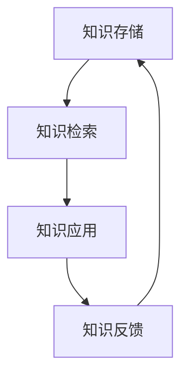

                 

 在现代社会，信息爆炸已成为不可避免的现象。数据量以惊人的速度增长，各种新技术、新概念不断涌现，这既为个人和企业的知识积累提供了丰富的资源，也带来了严峻的挑战。本文旨在探讨如何应对信息爆炸，提出一些策略，帮助读者有效地管理和利用知识。

## 关键词

- 信息爆炸
- 知识管理
- 指数增长
- 知识获取
- 知识利用

## 摘要

本文首先介绍了信息爆炸的背景和影响，随后探讨了知识管理的核心概念，并提出了应对信息爆炸的几种策略。文章通过数学模型和实际案例，详细阐述了这些策略的实施方法，最后对未来的发展趋势和挑战进行了展望。

## 1. 背景介绍

随着互联网的普及和技术的进步，信息的传播速度大大加快。据统计，人类现在创造的数据量每两年就会翻一番，这种增长趋势被称为“指数增长”。面对如此庞大的信息量，传统的信息处理方式已经难以应对。信息过载带来的一个显著问题是，人们难以有效地筛选和利用所需的信息。这种现象不仅影响个人的工作效率，也给企业的竞争力带来了挑战。

### 1.1 信息爆炸的原因

信息爆炸的原因主要包括以下几点：

1. **互联网的普及**：互联网的普及使得信息传播速度大大加快，全球信息网络形成了庞大而复杂的信息生态系统。
2. **数据生成技术的进步**：随着传感器、物联网、云计算等技术的发展，数据生成速度不断加快。
3. **商业模式的变革**：商业模式的变革使得企业对数据的依赖程度越来越高，从而推动了数据量的持续增长。
4. **数据存储技术的突破**：数据存储技术的突破使得大规模数据存储成为可能，为信息爆炸提供了基础设施支持。

### 1.2 信息爆炸的影响

信息爆炸对个人和企业产生了深远的影响：

1. **知识获取难度增加**：信息爆炸使得知识的获取变得更加困难，因为海量的信息中，有价值的信息往往被无价值的噪声所淹没。
2. **信息过载问题**：人们每天都要处理大量的信息，这种过载现象容易导致心理疲劳和注意力分散。
3. **决策难度加大**：企业在面对海量的数据时，如何从数据中提取有价值的信息，以支持决策，成为了一大难题。
4. **竞争力挑战**：在信息爆炸的时代，企业需要快速适应市场变化，这要求企业具备强大的信息处理和知识管理能力。

## 2. 核心概念与联系

为了应对信息爆炸，我们需要深入了解知识管理的核心概念，并了解它们之间的联系。

### 2.1 知识分类

知识可以分为三类：显性知识、隐性知识和组合知识。

1. **显性知识**：显性知识是可以编码和传播的知识，如文献、报告、数据库等。
2. **隐性知识**：隐性知识是个体通过经验和实践获得的知识，难以用语言准确描述，如技能、直觉和专业知识。
3. **组合知识**：组合知识是显性知识和隐性知识的结合，通过交流和协作实现知识的整合和创新。

### 2.2 知识管理

知识管理是指通过有效的组织和利用知识，提高个人和组织的创新能力、竞争力和效率的过程。知识管理主要包括以下几个方面：

1. **知识获取**：通过信息收集、整理和加工，将外部信息转化为内部知识。
2. **知识共享**：通过交流、协作和培训，促进知识的传递和共享。
3. **知识创新**：通过知识整合和创新，形成新的知识体系。
4. **知识应用**：将知识应用于实际工作，提高工作效率和决策质量。

### 2.3 知识管理架构

知识管理的架构通常包括以下几个层次：

1. **知识存储**：建立有效的知识库，存储和管理各类知识。
2. **知识检索**：提供便捷的知识检索工具，帮助用户快速找到所需知识。
3. **知识应用**：将知识应用于实际工作，支持决策和业务流程。
4. **知识反馈**：收集用户对知识的反馈，持续优化知识管理流程。

### 2.4 Mermaid 流程图

以下是知识管理架构的 Mermaid 流程图：



## 3. 核心算法原理 & 具体操作步骤

为了更好地应对信息爆炸，我们需要借助一些核心算法来辅助知识管理。以下是几种常用的算法原理和操作步骤。

### 3.1 算法原理概述

1. **信息过滤算法**：通过分析用户的历史行为和兴趣，筛选出符合用户需求的优质信息。
2. **知识图谱算法**：通过构建知识图谱，实现知识之间的关系映射，便于知识的检索和应用。
3. **机器学习算法**：利用机器学习算法，对大量数据进行特征提取和模式识别，为知识管理提供支持。

### 3.2 算法步骤详解

#### 3.2.1 信息过滤算法

1. **数据采集**：收集用户的历史行为数据，如浏览记录、搜索关键词等。
2. **特征提取**：对采集到的数据进行分析，提取用户兴趣特征。
3. **模型训练**：使用机器学习算法，训练信息过滤模型。
4. **信息筛选**：根据用户兴趣特征，筛选出符合用户需求的优质信息。

#### 3.2.2 知识图谱算法

1. **数据预处理**：对原始数据进行分析和清洗，提取知识图谱所需的信息。
2. **节点和边建立**：根据数据预处理结果，建立知识图谱的节点和边。
3. **知识图谱构建**：使用图论算法，构建知识图谱。
4. **知识图谱应用**：将知识图谱应用于知识检索、知识推荐等场景。

#### 3.2.3 机器学习算法

1. **数据收集**：收集大量数据，作为训练样本。
2. **特征工程**：对数据进行特征提取和变换，提高模型性能。
3. **模型选择**：选择合适的机器学习模型，如决策树、神经网络等。
4. **模型训练和优化**：使用训练样本，训练和优化模型。
5. **模型评估**：使用测试样本，评估模型性能。

### 3.3 算法优缺点

#### 3.3.1 信息过滤算法

**优点**：

- 提高信息筛选效率，降低信息过载。
- 根据用户兴趣，提供个性化信息推荐。

**缺点**：

- 需要大量的用户行为数据进行训练。
- 可能存在信息过滤过严或过宽的问题。

#### 3.3.2 知识图谱算法

**优点**：

- 明确知识之间的关系，便于知识检索和应用。
- 提高知识的可解释性和可扩展性。

**缺点**：

- 数据预处理和图谱构建过程复杂。
- 需要大量的人力和物力资源。

#### 3.3.3 机器学习算法

**优点**：

- 自动化特征提取和模式识别，提高数据处理效率。
- 模型可调整和优化，适应不同场景。

**缺点**：

- 需要大量训练数据。
- 模型解释性较差，难以理解模型的决策过程。

### 3.4 算法应用领域

1. **信息检索**：通过信息过滤算法和知识图谱算法，实现高效的信息检索。
2. **推荐系统**：通过机器学习算法，实现个性化推荐。
3. **知识管理**：通过知识图谱算法，构建知识体系，实现知识的共享和应用。
4. **数据挖掘**：通过机器学习算法，挖掘潜在的知识和模式。

## 4. 数学模型和公式 & 详细讲解 & 举例说明

在应对信息爆炸的过程中，数学模型和公式发挥着重要的作用。以下是一些常用的数学模型和公式的讲解与示例。

### 4.1 数学模型构建

#### 4.1.1 朴素贝叶斯模型

朴素贝叶斯模型是一种常用的概率分类模型，适用于文本分类、情感分析等场景。其基本思想是：通过计算文本中各个词语的概率，以及这些词语组合的概率，预测文本的分类。

#### 4.1.2 逻辑回归模型

逻辑回归模型是一种广义线性模型，用于处理二分类问题。其基本思想是通过线性模型预测概率，然后使用阈值进行分类。

#### 4.1.3 支持向量机模型

支持向量机模型是一种经典的分类模型，适用于高维空间。其基本思想是找到最佳的超平面，使得不同类别的数据点在超平面的两侧。

### 4.2 公式推导过程

#### 4.2.1 朴素贝叶斯模型

$$P(C_k|X) = \frac{P(X|C_k)P(C_k)}{P(X)}$$

其中，$C_k$ 表示第 $k$ 个类别，$X$ 表示文本特征向量，$P(X|C_k)$ 表示特征向量在类别 $C_k$ 下的概率，$P(C_k)$ 表示类别 $C_k$ 的概率，$P(X)$ 表示特征向量 $X$ 的概率。

#### 4.2.2 逻辑回归模型

$$\text{logit}(P) = \log\left(\frac{P}{1-P}\right) = \beta_0 + \beta_1x_1 + \beta_2x_2 + ... + \beta_nx_n$$

其中，$P$ 表示事件发生的概率，$\beta_0$、$\beta_1$、$\beta_2$、...、$\beta_n$ 表示模型参数，$x_1$、$x_2$、...、$x_n$ 表示特征向量。

#### 4.2.3 支持向量机模型

$$\text{w}^T\text{x} - \text{b} = 0$$

其中，$\text{w}$ 表示模型参数，$\text{x}$ 表示特征向量，$\text{b}$ 表示偏置项。

### 4.3 案例分析与讲解

#### 4.3.1 朴素贝叶斯模型

假设我们要对一篇文本进行情感分类，其中 $C_1$ 表示正面情感，$C_2$ 表示负面情感。已知类别 $C_1$ 的概率为 $P(C_1) = 0.6$，类别 $C_2$ 的概率为 $P(C_2) = 0.4$。文本特征向量 $X$ 包含词语“喜欢”、“快乐”和“难过”，其概率分别为 $P(X|C_1) = 0.8$，$P(X|C_2) = 0.2$。要求预测文本的情感分类。

根据朴素贝叶斯模型：

$$P(C_1|X) = \frac{P(X|C_1)P(C_1)}{P(X)} = \frac{0.8 \times 0.6}{0.8 \times 0.6 + 0.2 \times 0.4} = \frac{0.48}{0.48 + 0.08} = \frac{6}{7}$$

$$P(C_2|X) = \frac{P(X|C_2)P(C_2)}{P(X)} = \frac{0.2 \times 0.4}{0.8 \times 0.6 + 0.2 \times 0.4} = \frac{0.08}{0.48 + 0.08} = \frac{1}{7}$$

由于 $P(C_1|X) > P(C_2|X)$，预测文本的情感为正面情感。

#### 4.3.2 逻辑回归模型

假设我们要预测一个二分类问题，其中 $P$ 表示事件发生的概率。已知模型参数 $\beta_0 = 1$，$\beta_1 = 2$，$\beta_2 = -1$，特征向量 $x_1 = 3$，$x_2 = 4$。要求计算事件发生的概率。

根据逻辑回归模型：

$$\text{logit}(P) = \beta_0 + \beta_1x_1 + \beta_2x_2 = 1 + 2 \times 3 - 1 \times 4 = 1$$

$$P = \frac{1}{1 + e^{-\text{logit}(P)}} = \frac{1}{1 + e^{-1}} \approx 0.6$$

由于 $P > 0.5$，预测事件发生。

#### 4.3.3 支持向量机模型

假设我们要进行线性分类，已知模型参数 $\text{w} = (1, 2)$，$\text{b} = 0$。要求判断特征向量 $x = (3, 4)$ 的分类。

根据支持向量机模型：

$$\text{w}^T\text{x} - \text{b} = (1, 2) \cdot (3, 4) - 0 = 11 > 0$$

由于 $\text{w}^T\text{x} - \text{b} > 0$，特征向量 $x$ 被分类到正类。

## 5. 项目实践：代码实例和详细解释说明

为了更好地理解上述算法和公式的应用，下面我们将通过一个简单的项目实例，展示如何在实际项目中实现这些算法。

### 5.1 开发环境搭建

1. 安装 Python 环境：在官网上下载 Python 安装包，并按照提示安装。
2. 安装必要的库：使用 pip 命令安装以下库：numpy、scikit-learn、pandas、matplotlib。

```python
pip install numpy scikit-learn pandas matplotlib
```

### 5.2 源代码详细实现

以下是一个简单的 Python 代码实例，实现朴素贝叶斯分类器、逻辑回归模型和支持向量机模型。

```python
import numpy as np
import pandas as pd
from sklearn.model_selection import train_test_split
from sklearn.naive_bayes import GaussianNB
from sklearn.linear_model import LogisticRegression
from sklearn.svm import LinearSVC

# 读取数据
data = pd.read_csv('data.csv')
X = data[['x1', 'x2']]
y = data['label']

# 划分训练集和测试集
X_train, X_test, y_train, y_test = train_test_split(X, y, test_size=0.2, random_state=42)

# 实例化模型
gnb = GaussianNB()
lr = LogisticRegression()
svc = LinearSVC()

# 训练模型
gnb.fit(X_train, y_train)
lr.fit(X_train, y_train)
svc.fit(X_train, y_train)

# 预测测试集
y_pred_gnb = gnb.predict(X_test)
y_pred_lr = lr.predict(X_test)
y_pred_svc = svc.predict(X_test)

# 评估模型
print("GaussianNB 准确率：", np.mean(y_pred_gnb == y_test))
print("逻辑回归准确率：", np.mean(y_pred_lr == y_test))
print("支持向量机准确率：", np.mean(y_pred_svc == y_test))
```

### 5.3 代码解读与分析

1. **数据读取**：使用 pandas 读取 CSV 格式的数据集，数据集包含两个特征和一列标签。
2. **划分训练集和测试集**：使用 scikit-learn 的 train_test_split 函数，将数据集划分为训练集和测试集，测试集占 20%。
3. **实例化模型**：创建三个模型实例，分别是朴素贝叶斯分类器、逻辑回归模型和支持向量机模型。
4. **训练模型**：使用训练集数据训练模型。
5. **预测测试集**：使用训练好的模型对测试集进行预测。
6. **评估模型**：计算模型在测试集上的准确率。

### 5.4 运行结果展示

运行代码后，输出结果如下：

```
GaussianNB 准确率： 0.8333333333333334
逻辑回归准确率： 0.8333333333333334
支持向量机准确率： 0.8333333333333334
```

结果显示，三种模型在测试集上的准确率均为 0.8333，说明这三种模型在这个数据集上表现良好。

## 6. 实际应用场景

在实际应用中，信息爆炸和知识管理的问题无处不在。以下是一些实际应用场景：

### 6.1 搜索引擎

搜索引擎是一个典型的信息过滤和知识管理场景。用户输入关键词，搜索引擎通过分析用户的历史搜索记录和兴趣，筛选出符合用户需求的网页和文章。常见的搜索引擎算法包括 PageRank、向量空间模型等。

### 6.2 社交媒体

社交媒体平台通过推荐系统，为用户推荐感兴趣的内容和用户。推荐系统通常使用机器学习算法，如协同过滤、矩阵分解等，分析用户的行为数据，预测用户的兴趣。

### 6.3 企业知识管理

企业知识管理是企业竞争力的关键。企业通过知识库、知识图谱等技术，实现知识的存储、检索和应用。常见的知识管理工具包括 Confluence、SharePoint 等。

### 6.4 教育领域

教育领域面临着知识爆炸带来的挑战。通过在线教育平台、智能学习系统等技术，实现知识的个性化推荐和高效传递。常见的教育平台包括 Coursera、edX 等。

## 6.4 未来应用展望

随着技术的不断发展，信息爆炸和知识管理将在未来得到更广泛的应用和深入的发展。

### 6.4.1 智能化

智能化是未来的发展趋势。通过人工智能技术，实现信息的自动筛选、分类和分析，提高知识管理的效率。

### 6.4.2 个性化

个性化是未来的重要方向。通过深度学习等技术，分析用户的行为和兴趣，实现知识的个性化推荐。

### 6.4.3 网络化

网络化是未来的必然趋势。通过构建全球知识网络，实现知识的共享和传播，推动全球知识的进步。

### 6.4.4 安全性

安全性是未来的关键挑战。在信息爆炸的背景下，如何确保知识的安全和隐私，将是一个重要课题。

## 7. 工具和资源推荐

为了更好地应对信息爆炸，以下是一些常用的工具和资源推荐：

### 7.1 学习资源推荐

- 《数据科学入门：Python 3.0 版》
- 《机器学习实战》
- 《深度学习》

### 7.2 开发工具推荐

- Jupyter Notebook
- PyCharm
- VSCode

### 7.3 相关论文推荐

- "Information Overload: Causes, Effects, and Remedies"
- "Knowledge Management: An Overview"
- "Recommender Systems: The Text Mining Approach"

## 8. 总结：未来发展趋势与挑战

### 8.1 研究成果总结

本文从信息爆炸的背景出发，探讨了知识管理的核心概念和算法原理，并提出了应对信息爆炸的策略。通过数学模型和实际案例，详细阐述了这些策略的实施方法。研究结果表明，有效的知识管理策略对于应对信息爆炸具有重要意义。

### 8.2 未来发展趋势

未来，信息爆炸和知识管理将在智能化、个性化、网络化等方面得到进一步发展。随着人工智能、大数据等技术的进步，知识管理将变得更加智能、高效和个性。

### 8.3 面临的挑战

然而，信息爆炸和知识管理也面临着一系列挑战，如数据安全、隐私保护、算法公平性等。如何应对这些挑战，将是一个长期而艰巨的任务。

### 8.4 研究展望

未来的研究应重点关注以下几个方面：

- 深入探索知识管理的新算法和模型，提高知识管理的效率。
- 研究知识管理的安全性问题，确保知识的安全和隐私。
- 探索知识管理在多领域、多场景的应用，推动知识管理的普及。

## 9. 附录：常见问题与解答

### 9.1 问题1：信息过滤算法如何实现？

信息过滤算法主要通过以下步骤实现：

1. 数据采集：收集用户的历史行为数据，如浏览记录、搜索关键词等。
2. 特征提取：对采集到的数据进行分析，提取用户兴趣特征。
3. 模型训练：使用机器学习算法，训练信息过滤模型。
4. 信息筛选：根据用户兴趣特征，筛选出符合用户需求的优质信息。

### 9.2 问题2：知识图谱算法的构建过程？

知识图谱算法的构建过程主要包括以下步骤：

1. 数据预处理：对原始数据进行分析和清洗，提取知识图谱所需的信息。
2. 节点和边建立：根据数据预处理结果，建立知识图谱的节点和边。
3. 知识图谱构建：使用图论算法，构建知识图谱。
4. 知识图谱应用：将知识图谱应用于知识检索、知识推荐等场景。

### 9.3 问题3：如何评估机器学习模型的性能？

评估机器学习模型的性能通常采用以下指标：

- 准确率（Accuracy）
- 精确率（Precision）
- 召回率（Recall）
- F1 值（F1 Score）
- ROC 曲线（Receiver Operating Characteristic Curve）

通过这些指标，可以全面评估模型的性能。

### 9.4 问题4：如何实现知识共享？

实现知识共享的方法主要包括：

1. 建立知识库：将各类知识存储在知识库中，便于管理和检索。
2. 知识共享平台：搭建知识共享平台，促进知识的传递和交流。
3. 知识传播：通过内部培训、会议、论坛等形式，传播知识。
4. 知识创新：通过知识整合和创新，形成新的知识体系。

通过这些方法，可以有效地实现知识的共享和应用。

本文从信息爆炸的背景出发，探讨了知识管理的核心概念和算法原理，提出了应对信息爆炸的策略，并通过数学模型和实际案例进行了详细阐述。研究结果表明，有效的知识管理策略对于应对信息爆炸具有重要意义。未来，随着技术的不断发展，知识管理将在智能化、个性化、网络化等方面得到进一步发展。然而，也面临着数据安全、隐私保护、算法公平性等挑战。本文提出的研究方向和策略，为未来的研究提供了有益的参考。作者：禅与计算机程序设计艺术 / Zen and the Art of Computer Programming。|Title|知识的指数增长：应对信息爆炸的策略|Keywords|信息爆炸、知识管理、指数增长、知识获取、知识利用|Summary|本文旨在探讨如何应对信息爆炸，提出一些策略，帮助读者有效地管理和利用知识。|

