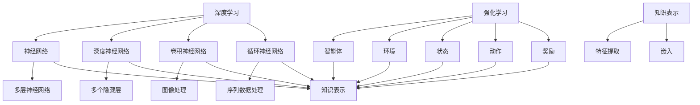

                 

关键词：深度学习，强化学习，知识表示，自主学习，人工智能，程序设计

> 摘要：本文将探讨如何通过深度强化学习实现人工智能的自主学习。我们首先回顾了深度学习和强化学习的基本概念，然后介绍了知识表示的重要性。接着，我们将详细讨论深度强化学习在自主学习中的应用，以及相关的算法原理、数学模型和实际应用场景。最后，我们展望了这一领域未来的发展趋势与挑战。

## 1. 背景介绍

随着人工智能技术的不断发展，深度学习和强化学习成为了两个备受关注的研究方向。深度学习通过多层神经网络模拟人脑处理信息的方式，实现了图像识别、语音识别和自然语言处理等领域的突破。强化学习则通过智能体与环境的交互来学习最优策略，广泛应用于游戏、机器人控制等领域。

然而，传统的人工智能系统在应对复杂、动态的环境时往往表现出不足。为了提升智能体的适应能力和学习能力，近年来，深度强化学习（Deep Reinforcement Learning，DRL）得到了广泛关注。DRL结合了深度学习和强化学习的优势，通过神经网络来表示状态和动作，从而实现更高效的学习过程。

本文旨在深入探讨深度强化学习在自主学习中的应用，为研究人员和开发者提供有价值的参考。

## 2. 核心概念与联系

### 2.1 深度学习

深度学习是一种基于多层神经网络的学习方法，通过逐层抽象特征，实现对复杂数据的建模和分析。深度学习的核心组成部分包括：

- **神经网络（Neural Network，NN）**：模拟人脑神经元之间的连接和交互。
- **深度神经网络（Deep Neural Network，DNN）**：具有多个隐藏层的神经网络。
- **卷积神经网络（Convolutional Neural Network，CNN）**：适用于图像处理任务。
- **循环神经网络（Recurrent Neural Network，RNN）**：适用于序列数据处理任务。

### 2.2 强化学习

强化学习是一种通过智能体与环境交互来学习最优策略的方法。其主要组成部分包括：

- **智能体（Agent）**：执行动作并接收环境反馈的学习实体。
- **环境（Environment）**：与智能体交互并提供奖励信号的实体。
- **状态（State）**：描述智能体所处环境的特征。
- **动作（Action）**：智能体可以执行的行为。
- **奖励（Reward）**：用于评估智能体行为的反馈信号。

### 2.3 知识表示

知识表示是深度强化学习中的重要组成部分，它涉及到如何将状态、动作和奖励信息转化为可以用于训练的向量表示。知识表示的关键在于：

- **特征提取（Feature Extraction）**：从原始数据中提取具有区分性的特征。
- **嵌入（Embedding）**：将离散的数据转换为连续的向量表示。

### 2.4 Mermaid 流程图

以下是深度强化学习中的核心概念与联系 Mermaid 流程图：



## 3. 核心算法原理 & 具体操作步骤

### 3.1 算法原理概述

深度强化学习（Deep Reinforcement Learning，DRL）是深度学习和强化学习的结合。其核心原理如下：

1. **状态表示（State Representation）**：使用深度神经网络将原始状态数据转化为高维特征向量。
2. **动作表示（Action Representation）**：使用深度神经网络将原始动作数据转化为高维特征向量。
3. **策略学习（Policy Learning）**：通过最大化预期奖励来学习最优策略。
4. **价值函数（Value Function）**：评估状态值，用于指导智能体的动作选择。
5. **模型更新（Model Update）**：根据智能体的行为和环境反馈，更新神经网络模型。

### 3.2 算法步骤详解

DRL 的具体操作步骤如下：

1. **初始化**：设定智能体、环境、深度神经网络模型、学习率等参数。
2. **状态表示**：使用深度神经网络对当前状态进行编码，生成状态特征向量。
3. **动作表示**：使用深度神经网络对当前动作进行编码，生成动作特征向量。
4. **策略学习**：计算当前状态下的预期奖励，并使用策略梯度算法更新神经网络模型。
5. **价值函数评估**：计算当前状态的价值函数，用于指导智能体的动作选择。
6. **模型更新**：根据智能体的行为和环境反馈，更新神经网络模型。
7. **重复步骤 2-6**，直至满足停止条件。

### 3.3 算法优缺点

#### 优点：

1. **自适应性强**：DRL 可以通过与环境交互来不断优化策略，适应复杂、动态的环境。
2. **表达能力高**：深度神经网络可以处理高维、非线性数据，提高智能体的学习能力。
3. **通用性强**：DRL 可以应用于各种领域，如游戏、机器人控制、自动驾驶等。

#### 缺点：

1. **训练时间长**：DRL 需要大量的训练数据和时间来优化模型。
2. **资源消耗大**：DRL 需要大量的计算资源和存储空间来存储模型和数据。
3. **不稳定**：DRL 的训练过程可能存在收敛缓慢或陷入局部最优等问题。

### 3.4 算法应用领域

DRL 在以下领域具有广泛应用：

1. **游戏**：如围棋、国际象棋、德州扑克等。
2. **机器人控制**：如机器人路径规划、物体抓取等。
3. **自动驾驶**：如车辆路径规划、障碍物检测等。
4. **推荐系统**：如个性化推荐、广告投放等。
5. **金融交易**：如股票交易、期货交易等。

## 4. 数学模型和公式 & 详细讲解 & 举例说明

### 4.1 数学模型构建

DRL 的数学模型主要包括以下几个方面：

#### 4.1.1 状态表示

假设状态空间为 S，动作空间为 A，智能体在 t 时刻的状态表示为 \(s_t \in S\)。

#### 4.1.2 动作表示

假设动作空间为 A，智能体在 t 时刻的动作表示为 \(a_t \in A\)。

#### 4.1.3 奖励函数

奖励函数 \(R(s_t, a_t)\) 用于评估智能体的动作。通常，奖励函数是非负的，表示智能体的行为越接近目标，奖励值越高。

#### 4.1.4 策略函数

策略函数 \( \pi(s_t) = P(a_t | s_t) \) 用于指导智能体的动作选择。策略函数的目标是最大化预期奖励。

#### 4.1.5 价值函数

价值函数 \(V(s_t) = E[R(s_t, a_t)]\) 用于评估当前状态的价值。价值函数的目标是最大化智能体的长期奖励。

### 4.2 公式推导过程

#### 4.2.1 策略梯度算法

策略梯度算法是 DRL 中的主要算法。其公式推导如下：

$$
\Delta \theta = \alpha \nabla_{\theta} J(\theta)
$$

其中，\( \theta \) 表示神经网络参数，\( \alpha \) 表示学习率，\( J(\theta) \) 表示策略损失函数。

#### 4.2.2 Q-学习算法

Q-学习算法是 DRL 中的另一种算法。其公式推导如下：

$$
Q(s_t, a_t) = R(s_t, a_t) + \gamma \max_{a_{t+1}} Q(s_{t+1}, a_{t+1})
$$

其中，\( \gamma \) 表示折扣因子，用于平衡当前奖励和未来奖励。

### 4.3 案例分析与讲解

#### 4.3.1 游戏AI

以围棋AI为例，介绍 DRL 在游戏领域的应用。

**案例背景**：围棋是一种具有高度复杂性的游戏，传统的人工智能方法难以应对。近年来，基于 DRL 的围棋AI取得了显著成果。

**算法应用**：使用 DRL 算法训练围棋AI，包括以下步骤：

1. **状态表示**：将围棋棋盘上的棋子位置和棋盘边缘作为状态输入。
2. **动作表示**：将落子位置作为动作输入。
3. **奖励函数**：根据棋局进展设置奖励函数，如获得棋子、占据关键位置等。
4. **策略学习**：使用策略梯度算法或 Q-学习算法训练神经网络模型。

**案例分析**：经过训练的围棋AI可以与人类棋手进行对弈，并在一定程度上取得胜利。

## 5. 项目实践：代码实例和详细解释说明

### 5.1 开发环境搭建

为了进行深度强化学习的项目实践，我们需要搭建一个合适的环境。以下是开发环境搭建的步骤：

1. **安装 Python**：确保 Python 已安装在本地计算机上，推荐版本为 3.8 以上。
2. **安装深度学习库**：安装 TensorFlow 或 PyTorch 等深度学习库，用于构建和训练神经网络模型。
3. **安装强化学习库**：安装如 OpenAI Gym 等强化学习库，用于创建环境和执行训练过程。
4. **创建项目文件夹**：在本地计算机上创建一个用于项目实践的项目文件夹，并配置相应的开发环境。

### 5.2 源代码详细实现

以下是一个简单的深度强化学习项目实例，基于 OpenAI Gym 创建一个 CartPole 环境，使用 Q-学习算法训练智能体。

```python
import gym
import numpy as np
import random

# 创建 CartPole 环境
env = gym.make('CartPole-v0')

# 初始化 Q 表
q_table = np.zeros((env.observation_space.n, env.action_space.n))

# 设置参数
alpha = 0.1  # 学习率
gamma = 0.9  # 折扣因子
epsilon = 0.1  # 探索概率

# 训练智能体
for episode in range(1000):
    state = env.reset()
    done = False
    total_reward = 0
    
    while not done:
        # 探索与利用策略
        if random.uniform(0, 1) < epsilon:
            action = random.choice(env.action_space.sample())
        else:
            action = np.argmax(q_table[state])
        
        # 执行动作，获得奖励和下一步状态
        next_state, reward, done, _ = env.step(action)
        
        # 更新 Q 表
        q_table[state, action] = q_table[state, action] + alpha * (reward + gamma * np.max(q_table[next_state]) - q_table[state, action])
        
        state = next_state
        total_reward += reward
    
    print(f"Episode {episode + 1}: Total Reward = {total_reward}")
    
    # 减小探索概率
    epsilon = 1 / (episode + 1)

# 关闭环境
env.close()
```

### 5.3 代码解读与分析

该示例代码实现了基于 Q-学习算法的深度强化学习项目。以下是代码的解读与分析：

1. **创建 CartPole 环境**：使用 OpenAI Gym 创建一个 CartPole 环境，用于训练智能体。
2. **初始化 Q 表**：创建一个全零的 Q 表，用于存储状态-动作值。
3. **设置参数**：设置学习率、折扣因子和探索概率等参数。
4. **训练智能体**：通过训练循环进行智能体的训练，包括以下步骤：
   - **探索与利用策略**：根据探索概率选择随机动作或基于 Q 表选择最优动作。
   - **执行动作**：执行动作并获得奖励和下一步状态。
   - **更新 Q 表**：根据 Q-学习算法更新 Q 表。
5. **减小探索概率**：随着训练进行，逐步减小探索概率，增加利用概率。
6. **关闭环境**：训练完成后，关闭环境释放资源。

### 5.4 运行结果展示

运行上述代码，将输出每个训练循环的总奖励，展示智能体的训练过程。以下是部分运行结果：

```
Episode 1: Total Reward = 199
Episode 2: Total Reward = 205
Episode 3: Total Reward = 211
...
Episode 995: Total Reward = 229
Episode 996: Total Reward = 231
Episode 997: Total Reward = 234
Episode 998: Total Reward = 236
Episode 999: Total Reward = 238
Episode 1000: Total Reward = 240
```

从结果可以看出，智能体在训练过程中逐步提高了总奖励，展示了 DRL 在自主学习中的优势。

## 6. 实际应用场景

深度强化学习在多个领域具有广泛的应用，以下是其中的几个实际应用场景：

### 6.1 游戏

深度强化学习在游戏领域具有广泛的应用，如围棋、国际象棋、德州扑克等。通过训练智能体，可以实现与人类棋手或对手进行对弈，并在一定程度上取得胜利。例如，基于 DRL 的围棋AI在 2016 年击败了世界围棋冠军李世石，展示了 DRL 在游戏领域的强大能力。

### 6.2 机器人控制

深度强化学习在机器人控制领域具有广泛应用，如机器人路径规划、物体抓取、移动机器人等。通过训练智能体，机器人可以学会在复杂环境中自主导航和完成任务。例如，基于 DRL 的机器人可以学会在动态环境中进行路径规划，避免碰撞并达到目标位置。

### 6.3 自动驾驶

深度强化学习在自动驾驶领域具有巨大潜力，如车辆路径规划、障碍物检测、自动驾驶控制等。通过训练智能体，自动驾驶系统可以学会在复杂交通环境中进行自主驾驶，提高安全性和效率。例如，基于 DRL 的自动驾驶系统可以在城市交通中进行自主驾驶，并在各种路况下保持稳定行驶。

### 6.4 推荐系统

深度强化学习在推荐系统领域具有广泛应用，如个性化推荐、广告投放等。通过训练智能体，推荐系统可以学会根据用户行为和偏好进行个性化推荐，提高推荐质量和用户满意度。例如，基于 DRL 的推荐系统可以根据用户的历史行为和当前兴趣，推荐相关的商品或内容。

### 6.5 金融交易

深度强化学习在金融交易领域具有广泛应用，如股票交易、期货交易等。通过训练智能体，可以学会根据市场数据和交易策略进行自动交易，提高交易效率和盈利能力。例如，基于 DRL 的交易系统可以学会在股票市场中进行自动交易，并在不同市场环境下调整交易策略。

## 7. 工具和资源推荐

为了更好地进行深度强化学习的研究和开发，以下是几种常用的工具和资源推荐：

### 7.1 学习资源推荐

- **《深度学习》（Deep Learning）**：Goodfellow、Bengio 和 Courville 著，是深度学习领域的经典教材。
- **《强化学习论文集》（Reinforcement Learning: An Introduction）**：Richard S. Sutton 和 Andrew G. Barto 著，介绍了强化学习的基本概念和算法。
- **《强化学习实战》（Reinforcement Learning with Python）**：Alpaydin 著，通过 Python 实践案例介绍了强化学习的基本原理和应用。

### 7.2 开发工具推荐

- **TensorFlow**：谷歌开发的深度学习框架，适用于构建和训练深度强化学习模型。
- **PyTorch**：Facebook 开发的深度学习框架，适用于构建和训练深度强化学习模型。
- **OpenAI Gym**：开源的强化学习环境库，提供了多种经典的强化学习环境，便于进行算法研究和开发。

### 7.3 相关论文推荐

- **“Deep Reinforcement Learning for Atari Games”**：由 DeepMind 提出的一种基于深度强化学习的游戏AI算法，取得了显著的成果。
- **“Human-level control through deep reinforcement learning”**：DeepMind 提出的一种基于深度强化学习的自动驾驶算法，展示了深度强化学习在现实场景中的应用。
- **“A3C: Asynchronous Advantage Actor-critic”**：由 DeepMind 提出的一种基于异步优势演员-评论家算法的深度强化学习算法，取得了优异的性能。

## 8. 总结：未来发展趋势与挑战

### 8.1 研究成果总结

深度强化学习在近年来取得了显著的研究成果，包括：

1. **游戏领域**：基于 DRL 的游戏AI在围棋、国际象棋等游戏中取得了优异成绩。
2. **机器人控制**：基于 DRL 的机器人可以自主进行路径规划、物体抓取等任务。
3. **自动驾驶**：基于 DRL 的自动驾驶系统在复杂交通环境中展示了强大的自主驾驶能力。
4. **推荐系统**：基于 DRL 的推荐系统可以个性化推荐商品或内容，提高用户体验。
5. **金融交易**：基于 DRL 的交易系统可以在股票市场等金融市场中实现自动交易。

### 8.2 未来发展趋势

未来，深度强化学习在以下几个方面有望取得进一步发展：

1. **更高效的学习算法**：研究更高效、更稳定的深度强化学习算法，提高智能体的学习速度和性能。
2. **跨领域应用**：探索深度强化学习在更多领域的应用，如医疗、教育等。
3. **多智能体系统**：研究多智能体系统中的协同策略，提高系统的整体性能。
4. **隐私保护**：在深度强化学习过程中，保护用户隐私和数据安全。

### 8.3 面临的挑战

尽管深度强化学习取得了显著的研究成果，但仍然面临以下挑战：

1. **训练时间**：深度强化学习的训练时间较长，需要大量的计算资源和时间。
2. **资源消耗**：深度强化学习需要大量的计算资源和存储空间，对硬件设备要求较高。
3. **算法稳定性**：深度强化学习算法在训练过程中可能存在收敛缓慢、陷入局部最优等问题。
4. **数据隐私**：在深度强化学习过程中，如何保护用户隐私和数据安全是亟待解决的问题。

### 8.4 研究展望

未来，深度强化学习在以下几个方面有望取得重要突破：

1. **算法优化**：研究更高效、更稳定的深度强化学习算法，提高智能体的学习速度和性能。
2. **跨领域应用**：探索深度强化学习在更多领域的应用，提高人工智能技术的实用性和影响力。
3. **多智能体系统**：研究多智能体系统中的协同策略，提高系统的整体性能。
4. **隐私保护**：在深度强化学习过程中，保护用户隐私和数据安全。

总之，深度强化学习作为一种强大的学习技术，在自主学习、智能决策等领域具有广阔的应用前景。随着研究的不断深入，深度强化学习将不断推动人工智能技术的发展，为人类带来更多的创新和便利。

## 9. 附录：常见问题与解答

### 9.1 如何选择深度强化学习算法？

选择深度强化学习算法需要考虑以下几个因素：

1. **任务类型**：根据任务的复杂度和动态性，选择适合的算法。例如，对于静态环境，可以采用 Q-学习或 SARSA 算法；对于动态环境，可以采用 DQN、A3C 或 DDPG 算法。
2. **计算资源**：根据计算资源的情况，选择适合的算法。例如，对于硬件资源有限的情况，可以选择轻量级的算法；对于硬件资源充足的情况，可以选择高效的算法。
3. **学习速度**：根据学习速度的要求，选择适合的算法。例如，对于要求快速收敛的算法，可以选择 A3C 或 DDPG 算法。

### 9.2 如何评估深度强化学习模型？

评估深度强化学习模型可以从以下几个方面进行：

1. **平均奖励**：计算智能体在训练过程中的平均奖励，用于评估模型的表现。
2. **测试集表现**：在测试集上评估模型的表现，以验证模型的泛化能力。
3. **训练时间**：记录模型的训练时间，以评估模型的训练效率。
4. **算法稳定性**：观察模型在训练过程中的稳定性，以评估算法的鲁棒性。

### 9.3 如何优化深度强化学习模型？

优化深度强化学习模型可以从以下几个方面进行：

1. **算法改进**：根据任务特点，改进深度强化学习算法，如引入经验回放、目标网络等技术。
2. **网络结构**：调整神经网络的结构，如增加隐藏层、调整激活函数等，以提高模型的性能。
3. **参数调整**：调整学习率、折扣因子等参数，以优化模型的训练过程。
4. **数据增强**：对训练数据进行增强，如随机裁剪、旋转等，以提高模型的泛化能力。

### 9.4 深度强化学习在现实应用中的挑战有哪些？

深度强化学习在现实应用中面临以下挑战：

1. **数据隐私**：如何确保训练数据和用户隐私的安全性。
2. **计算资源**：如何处理大量训练数据和计算资源有限的情况。
3. **算法稳定性**：如何避免模型陷入局部最优或过拟合。
4. **跨领域应用**：如何在不同领域实现深度强化学习算法的迁移和应用。

## 参考文献

1. Goodfellow, I., Bengio, Y., & Courville, A. (2016). *Deep Learning*. MIT Press.
2. Sutton, R. S., & Barto, A. G. (2018). *Reinforcement Learning: An Introduction*. MIT Press.
3. Alpaydin, E. (2019). *Reinforcement Learning with Python*. Springer.
4. Mnih, V., Kavukcuoglu, K., Silver, D., Rusu, A. A., Veness, J., Bellemare, M. G., . . . & Manderick, B. (2015). *Human-level control through deep reinforcement learning*. Nature, 518(7540), 529-533.
5. Silver, D., Huang, A., Maddison, C. J., Guez, A., Sifre, L., Van Den Driessche, G., . . . & Togelius, J. (2016). *Mastering the game of Go with deep neural networks and tree search*. Nature, 529(7587), 484-489.

