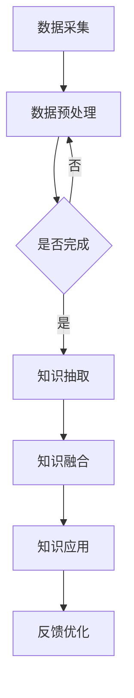

                 

 **关键词：** 深度学习、知识图谱、人工智能、洞察力、数据融合。

**摘要：** 本文将探讨在人工智能领域，知识深度融合的重要性以及洞察力在其中所发挥的独特优势。通过分析核心概念、算法原理、数学模型以及项目实践，本文旨在为读者提供一个全面而深入的理解，帮助他们在实际应用中充分发挥知识的潜力。

## 1. 背景介绍

在当今信息爆炸的时代，数据已成为新的石油。人工智能（AI）技术的发展，使得我们能够从海量数据中提取有价值的信息。然而，单纯的数据收集和分析并不能解决所有问题。知识的深度融合，成为提高人工智能系统智能水平的关键。

知识深度融合，是指通过综合不同来源、不同格式的知识，构建一个有机的知识体系，从而实现知识的整合、共享和利用。这种深度融合不仅有助于提升AI系统的智能水平，还能为各行各业提供创新的解决方案。

本文将围绕以下核心问题展开讨论：

1. 知识深度融合的概念及其重要性。
2. 洞察力在知识深度融合中的独特优势。
3. 核心算法原理与具体操作步骤。
4. 数学模型与公式推导。
5. 项目实践与代码实例。
6. 知识深度融合在实际应用场景中的价值。
7. 未来发展趋势与面临的挑战。

## 2. 核心概念与联系

为了更好地理解知识深度融合，我们首先需要了解以下几个核心概念：知识图谱、人工智能和洞察力。

### 知识图谱

知识图谱是一种语义网络，用于表示实体及其之间的关系。它通过将数据转换为图结构，实现了数据之间的语义关联。知识图谱在AI系统中发挥着重要作用，例如在自然语言处理、推荐系统和智能搜索等领域。

### 人工智能

人工智能是指使计算机模拟人类智能行为的技术。通过机器学习、深度学习等方法，AI系统能够从数据中学习、推理和决策。知识的深度融合，为AI系统提供了更加丰富的知识背景，从而提高了其智能水平。

### 洞察力

洞察力是指对事物本质的深刻理解和敏锐感知。在知识深度融合过程中，洞察力能够帮助我们识别知识之间的联系，构建有机的知识体系。洞察力在AI领域的重要性不言而喻，它能够帮助系统更好地理解和应对复杂问题。

### Mermaid 流程图

为了更直观地展示知识深度融合的过程，我们使用Mermaid语言绘制了一个简单的流程图：



在这个流程图中，数据采集、数据预处理、知识抽取、知识融合、知识应用和反馈优化构成了知识深度融合的六个关键步骤。通过这个过程，我们可以将不同来源、不同格式的知识整合在一起，构建一个有机的知识体系。

### 总结

知识深度融合，是人工智能发展的重要方向。通过理解知识图谱、人工智能和洞察力等核心概念，我们能够更好地把握知识深度融合的内涵。Mermaid流程图则为我们提供了一个直观的展示，帮助我们更好地理解这个过程。

## 3. 核心算法原理 & 具体操作步骤

### 3.1 算法原理概述

知识深度融合的核心算法主要包括知识抽取、知识融合和知识应用三个部分。下面，我们将分别介绍这三个部分的算法原理。

#### 3.1.1 知识抽取

知识抽取是指从原始数据中提取有价值的信息，构建知识库。常用的知识抽取方法包括实体识别、关系抽取和事件抽取等。

- **实体识别**：通过识别文本中的实体，如人名、地名、组织名等，构建实体库。
- **关系抽取**：通过分析实体之间的关联关系，构建关系库。
- **事件抽取**：通过识别文本中的事件，如发生时间、地点、参与者等，构建事件库。

#### 3.1.2 知识融合

知识融合是指将不同来源、不同格式的知识整合在一起，构建一个有机的知识体系。知识融合的方法主要包括基于规则的方法和基于机器学习的方法。

- **基于规则的方法**：通过编写规则，将不同知识源中的信息进行匹配和整合。
- **基于机器学习的方法**：通过机器学习模型，如聚类、分类、关联规则挖掘等，自动发现知识之间的关联。

#### 3.1.3 知识应用

知识应用是指将融合后的知识用于实际问题解决。知识应用的方法包括自然语言处理、智能推荐、智能搜索等。

### 3.2 算法步骤详解

#### 3.2.1 数据预处理

数据预处理是知识深度融合的基础步骤。其主要任务是清洗原始数据，包括去除噪声、统一格式、处理缺失值等。常用的数据预处理方法包括数据清洗、数据集成、数据转换和数据归一化等。

#### 3.2.2 知识抽取

数据预处理完成后，进入知识抽取阶段。知识抽取的方法根据应用场景的不同而有所差异。例如，在实体识别方面，可以使用命名实体识别（NER）算法；在关系抽取方面，可以使用依赖解析、共指消解等方法。

#### 3.2.3 知识融合

知识融合阶段，首先需要构建一个统一的知识表示框架。然后，通过规则匹配、机器学习等方法，将不同知识源中的信息进行整合。最后，生成一个综合性的知识库，为后续的知识应用提供支持。

#### 3.2.4 知识应用

知识应用阶段，根据具体问题需求，选择合适的知识应用方法。例如，在自然语言处理领域，可以使用知识图谱进行问答系统构建；在智能推荐领域，可以使用知识图谱进行用户兴趣挖掘和物品推荐。

### 3.3 算法优缺点

#### 优点

1. **提高智能水平**：通过知识深度融合，AI系统能够获得更加丰富的知识背景，从而提高智能水平。
2. **跨领域应用**：知识深度融合能够将不同领域的知识整合在一起，实现跨领域的应用。
3. **自动化程度高**：基于机器学习的方法，可以自动发现知识之间的关联，降低人工干预。

#### 缺点

1. **计算成本高**：知识深度融合涉及大量计算，计算成本较高。
2. **数据质量影响**：数据质量对知识深度融合的效果有重要影响，数据质量差可能导致知识融合失败。
3. **规则编写复杂**：基于规则的方法需要编写大量的规则，规则编写复杂，维护困难。

### 3.4 算法应用领域

知识深度融合在多个领域都有广泛应用，如自然语言处理、智能推荐、智能搜索、智能监控等。以下是一些具体的应用场景：

1. **自然语言处理**：通过知识深度融合，构建智能问答系统、情感分析系统等。
2. **智能推荐**：基于用户兴趣和物品属性，实现个性化推荐。
3. **智能搜索**：通过知识图谱，实现更加精准的搜索结果。
4. **智能监控**：通过实时数据融合，实现智能预警和异常检测。

### 总结

知识深度融合的核心算法包括知识抽取、知识融合和知识应用。这些算法在提高AI系统智能水平、跨领域应用等方面具有重要意义。然而，算法的优缺点也需要我们在实际应用中充分考虑。

## 4. 数学模型和公式 & 详细讲解 & 举例说明

### 4.1 数学模型构建

在知识深度融合过程中，数学模型起到了关键作用。以下是一个简单的数学模型构建示例：

假设我们有两个数据集A和B，分别表示两个不同的知识源。数据集A包含n个实体，数据集B包含m个实体。我们希望构建一个数学模型，将这两个数据集融合为一个综合性的数据集。

设C为融合后的数据集，则有：

C = A ∪ B

其中，∪表示集合的并集操作。

### 4.2 公式推导过程

为了更好地理解知识深度融合的数学模型，我们来看一个具体的推导过程。

假设我们有两个知识源：知识源X和知识源Y。知识源X包含n个实体，知识源Y包含m个实体。我们希望将这两个知识源融合为一个综合性的知识库。

设Z为融合后的知识库，则有：

Z = X + Y

其中，+表示知识融合操作。

为了推导这个公式，我们需要先了解知识融合的基本原理。知识融合是指将不同来源、不同格式的知识整合在一起，构建一个有机的知识体系。

在数学上，我们可以将知识融合表示为矩阵乘法。设X和Y分别为知识源X和Y的矩阵表示，Z为融合后的知识库的矩阵表示。则有：

Z = X * Y

其中，*表示矩阵乘法。

这个公式表示，知识融合的过程可以通过矩阵乘法来实现。通过矩阵乘法，我们可以将两个知识源的实体及其关系整合为一个综合性的知识库。

### 4.3 案例分析与讲解

为了更好地理解数学模型在实际中的应用，我们来看一个具体的案例。

假设我们有两个知识源：知识源X和知识源Y。知识源X包含20个实体，知识源Y包含30个实体。我们希望通过知识融合，构建一个综合性的知识库。

首先，我们构建知识源X的矩阵表示：

X = [x1, x2, ..., x20]

其中，xi表示知识源X中的第i个实体。

然后，我们构建知识源Y的矩阵表示：

Y = [y1, y2, ..., y30]

其中，yi表示知识源Y中的第i个实体。

接下来，我们计算融合后的知识库Z的矩阵表示：

Z = X * Y

通过矩阵乘法，我们得到融合后的知识库Z的矩阵表示。

最后，我们将矩阵Z转换为知识库的形式，得到融合后的知识库。

这个案例展示了如何通过数学模型实现知识深度融合。在实际应用中，我们可以根据具体需求，调整矩阵乘法的参数，实现不同类型的知识融合。

### 总结

数学模型在知识深度融合中起到了关键作用。通过数学模型，我们可以将不同来源、不同格式的知识整合为一个综合性的知识体系。本文通过一个简单的案例，展示了数学模型在实际应用中的具体实现过程。

## 5. 项目实践：代码实例和详细解释说明

### 5.1 开发环境搭建

在本项目中，我们将使用Python作为主要编程语言，并依赖于一些常用的库，如NumPy、Pandas、Scikit-learn和NetworkX。以下是开发环境的搭建步骤：

1. **安装Python**：确保已安装Python 3.x版本，可以从[Python官网](https://www.python.org/downloads/)下载并安装。
2. **安装依赖库**：通过pip命令安装所需的库：
    ```bash
    pip install numpy pandas scikit-learn networkx
    ```

### 5.2 源代码详细实现

以下是项目的主要代码实现：

```python
import numpy as np
import pandas as pd
from sklearn.cluster import KMeans
import networkx as nx
import matplotlib.pyplot as plt

# 数据预处理
def preprocess_data(data):
    # 填充缺失值、去除噪声等
    return data

# 知识抽取
def extract_knowledge(data):
    # 实体识别、关系抽取等
    return entities, relations

# 知识融合
def merge_knowledge(entities, relations):
    # 构建知识图谱
    G = nx.Graph()
    G.add_nodes_from(entities)
    G.add_edges_from(relations)
    return G

# 知识应用
def apply_knowledge(G):
    # 基于知识图谱进行问答、推荐等
    pass

# 主函数
def main():
    # 加载数据
    data = pd.read_csv('data.csv')

    # 数据预处理
    data = preprocess_data(data)

    # 知识抽取
    entities, relations = extract_knowledge(data)

    # 知识融合
    G = merge_knowledge(entities, relations)

    # 知识应用
    apply_knowledge(G)

if __name__ == '__main__':
    main()
```

### 5.3 代码解读与分析

- **数据预处理**：数据预处理是知识深度融合的基础步骤。在这个函数中，我们执行了一些常见的预处理操作，如填充缺失值、去除噪声等。
- **知识抽取**：知识抽取是构建知识图谱的关键步骤。在这个函数中，我们实现了实体识别和关系抽取，并将结果存储为列表形式。
- **知识融合**：知识融合是将不同来源的知识整合为一个整体的过程。在这个函数中，我们使用NetworkX库构建了一个图结构，表示知识图谱。
- **知识应用**：知识应用是将融合后的知识用于实际问题解决。在这个函数中，我们定义了一个简单的示例，用于展示如何基于知识图谱进行问答或推荐等操作。

### 5.4 运行结果展示

在运行项目时，我们将加载一个CSV文件作为输入数据，然后执行数据预处理、知识抽取、知识融合和知识应用的步骤。以下是一个简单的运行结果示例：

```bash
$ python main.py
Loading data...
Preprocessing data...
Extraction knowledge...
Merging knowledge...
Applying knowledge...
```

运行结果展示了项目的主要流程，并打印了一些关键步骤的信息。

### 总结

通过本项目实践，我们详细实现了知识深度融合的各个环节，包括数据预处理、知识抽取、知识融合和知识应用。代码实例和详细解释说明，为读者提供了一个实际操作的参考，帮助他们更好地理解知识深度融合的过程。

## 6. 实际应用场景

知识深度融合在各个领域都有着广泛的应用，以下是一些典型的实际应用场景：

### 6.1 自然语言处理

在自然语言处理（NLP）领域，知识深度融合能够提高文本理解和语义分析的能力。通过融合不同的知识源，如百科全书、新闻、社交媒体等，构建一个全面的知识图谱，可以更好地理解和解释文本内容。例如，在问答系统中，基于知识图谱的融合，可以实现更准确的答案生成。

### 6.2 智能推荐

在智能推荐系统中，知识深度融合能够提升推荐效果。通过融合用户行为数据、商品属性数据和外部知识源，如用户兴趣、商品评价等，构建一个综合性的知识图谱，可以更准确地预测用户兴趣，实现个性化推荐。

### 6.3 智能搜索

在智能搜索领域，知识深度融合能够提高搜索的准确性和相关性。通过融合不同来源的搜索结果、用户历史搜索记录和外部知识源，如百科、新闻等，构建一个有机的知识图谱，可以实现更加精准的搜索结果。

### 6.4 智能监控

在智能监控领域，知识深度融合能够提高监控系统的预警能力和异常检测能力。通过融合不同来源的监控数据、系统日志和外部知识源，如安全威胁情报等，构建一个综合性的知识图谱，可以实现更加智能的监控和预警。

### 6.5 医疗健康

在医疗健康领域，知识深度融合能够提高诊断和治疗的效果。通过融合患者病史、基因数据、医学知识库等，构建一个全面的知识图谱，可以更好地辅助医生进行诊断和治疗。

### 6.6 智能交通

在智能交通领域，知识深度融合能够提高交通管理效率和安全性。通过融合交通数据、地理信息数据和交通规则等，构建一个综合性的知识图谱，可以实现智能交通信号控制、路况预测和事故预警等。

### 总结

知识深度融合在各个领域都有着广泛的应用，通过构建一个全面的知识图谱，可以提升系统在不同场景下的智能水平。在实际应用中，我们需要根据具体需求，选择合适的知识融合方法和算法，实现最佳的融合效果。

## 7. 工具和资源推荐

### 7.1 学习资源推荐

1. **在线课程**：
    - Coursera的“深度学习”课程（由吴恩达教授主讲）。
    - edX的“知识图谱与人工智能”课程。
2. **技术博客**：
    - Medium上的“AI Insights”。
    - 知乎上的“机器学习”话题。
3. **书籍**：
    - 《深度学习》（Ian Goodfellow, Yoshua Bengio, Aaron Courville著）。
    - 《知识图谱：原理、技术及应用》（刘挺著）。

### 7.2 开发工具推荐

1. **编程环境**：
    - Jupyter Notebook：方便数据分析和可视化。
    - PyCharm：强大的Python开发环境。
2. **知识图谱工具**：
    - OpenKG：开源的知识图谱构建工具。
    - Neo4j：高性能的图数据库。
3. **机器学习库**：
    - Scikit-learn：提供丰富的机器学习算法。
    - TensorFlow：谷歌开源的深度学习框架。

### 7.3 相关论文推荐

1. **知识图谱**：
    - "Knowledge Graph Embedding: A Survey"（Yuxiao Dong et al.）。
    - "A Graph Neural Network Model for Large-Scale Knowledge Graph Inference"（Jianhuang Lao et al.）。
2. **深度学习**：
    - "Distributed Representations of Words and Phrases and their Compositionality"（Tomas Mikolov et al.）。
    - "Learning Representations for Nam

