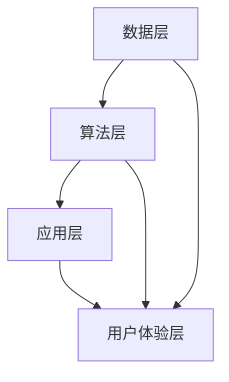

                 

 **关键词**：混合现实，线上线下学习，人工智能，知识融合，学习体验优化

> **摘要**：本文将探讨如何利用混合现实技术，实现线上线下学习的深度融合，提升学习效率与体验。通过分析混合现实的核心概念、算法原理及实践案例，探讨其在教育领域的广泛应用前景与面临的挑战。

## 1. 背景介绍

### 当前学习环境面临的挑战

随着信息技术的快速发展，传统的学习方式逐渐暴露出一些不足。首先，线上教育虽然提供了丰富的资源，但缺乏真实互动和情感交流，学生学习积极性难以保证。而传统线下教育则受限于空间和时间的限制，无法实现大规模的教育资源普及。此外，学生的个体差异和个性化学习需求，也使得单一的学习方式难以满足不同学习者的需求。

### 混合现实技术的崛起

混合现实（Mixed Reality，MR）技术通过结合虚拟现实（Virtual Reality，VR）和增强现实（Augmented Reality，AR）的优点，实现了虚拟与现实的无缝融合。MR技术不仅可以提供沉浸式的学习体验，还能与现实世界互动，从而更好地满足学生的个性化需求。

### 混合现实在教育领域的潜力

混合现实技术在教育领域的应用，有望解决传统学习方式的不足。例如，通过虚拟实验，学生可以安全地模拟各种实验操作，提高学习效果；通过增强现实，学生可以将抽象的知识与现实世界相结合，加深对知识的理解。因此，如何有效地将混合现实技术与教育相结合，已成为当前研究的热点。

## 2. 核心概念与联系

### 混合现实技术概述

混合现实技术是一种将虚拟世界与现实世界相结合的技术，用户可以通过头盔、眼镜等设备，在现实世界中看到虚拟的图像、物体和人物。它结合了虚拟现实和增强现实的优点，可以实现更加真实、互动的学习体验。

### 知识融合的概念

知识融合是指将不同的知识来源、形式和结构进行整合，形成更加完整、系统的知识体系。在教育领域，知识融合有助于将传统教育、在线教育和虚拟教育等多种学习方式相结合，提供更加丰富的学习资源和学习体验。

### 混合现实与知识融合的架构

混合现实与知识融合的架构主要包括以下几个部分：

1. **数据层**：包括学习资源、教学数据和用户数据等，是知识融合的基础。
2. **算法层**：利用人工智能算法，对学习资源进行智能推荐、分类和标签化处理，实现知识的个性化融合。
3. **应用层**：通过混合现实技术，将虚拟内容与现实世界相结合，提供沉浸式的学习体验。
4. **用户体验层**：通过用户交互设计，优化学习体验，提高学习效果。

### Mermaid 流程图



## 3. 核心算法原理 & 具体操作步骤

### 3.1 算法原理概述

混合现实技术中的核心算法主要涉及图像识别、场景理解和交互控制等方面。通过这些算法，可以实现虚拟内容与现实世界的无缝融合。

1. **图像识别**：利用深度学习算法，对现实世界中的图像进行识别和分类，为虚拟内容的插入提供依据。
2. **场景理解**：通过计算机视觉技术，对现实场景进行三维建模和理解，实现虚拟内容与现实场景的匹配。
3. **交互控制**：利用传感器和手势识别技术，实现用户与现实世界的交互，提高学习体验。

### 3.2 算法步骤详解

1. **图像识别**：
    - 数据收集与预处理：收集大量现实世界中的图像数据，并对图像进行预处理，如去噪、增强等。
    - 模型训练：利用卷积神经网络（CNN）等深度学习算法，对图像进行分类训练。
    - 图像识别：将现实世界中的图像输入到训练好的模型中，输出对应的分类结果。

2. **场景理解**：
    - 三维建模：利用结构光、激光雷达等技术，对现实场景进行三维建模。
    - 场景理解：通过计算机视觉算法，对三维模型进行理解，提取出关键信息，如物体、纹理等。
    - 场景匹配：将虚拟内容与现实场景进行匹配，实现虚拟与现实的无缝融合。

3. **交互控制**：
    - 传感器采集：利用各种传感器，如摄像头、深度传感器等，采集用户的手势和动作数据。
    - 手势识别：利用机器学习算法，对手势数据进行分析和识别，确定用户的意图。
    - 交互反馈：根据用户的意图，实时调整虚拟内容的展示和交互方式，提高用户体验。

### 3.3 算法优缺点

**优点**：
- 高度沉浸式体验：混合现实技术能够提供沉浸式的学习体验，提高学习效果。
- 个性化学习：通过算法推荐，实现知识的个性化融合，满足不同学习者的需求。
- 虚拟与现实结合：混合现实技术能够将虚拟内容与现实世界相结合，加深对知识的理解。

**缺点**：
- 技术门槛较高：混合现实技术的实现需要较高的技术门槛，对开发者和用户都提出了较高的要求。
- 成本较高：混合现实设备的成本较高，普及难度较大。
- 安全性担忧：虚拟内容与现实世界的融合可能引发安全问题，如隐私泄露等。

### 3.4 算法应用领域

混合现实技术在教育领域的应用主要包括以下几个方面：

1. **虚拟实验**：通过虚拟实验，学生可以安全地进行各种实验操作，提高学习效果。
2. **沉浸式教学**：利用混合现实技术，教师可以更加生动地讲解抽象的知识，提高学生的学习兴趣。
3. **远程教学**：通过混合现实技术，实现远程教学的实时互动和沉浸式体验，提高教学效果。
4. **个性化学习**：通过算法推荐，实现知识的个性化融合，满足不同学习者的需求。

## 4. 数学模型和公式 & 详细讲解 & 举例说明

### 4.1 数学模型构建

混合现实技术中的数学模型主要包括图像识别、场景理解和交互控制等方面的模型。以下是一个简单的图像识别模型的构建过程：

1. **数据收集与预处理**：
    - 收集大量现实世界中的图像数据，如教室、实验室等。
    - 对图像进行预处理，如去噪、增强等，提高模型的识别准确率。

2. **模型设计**：
    - 选择合适的深度学习模型，如卷积神经网络（CNN）。
    - 设计模型的结构，包括卷积层、池化层、全连接层等。

3. **模型训练**：
    - 使用预处理后的图像数据，对模型进行训练。
    - 调整模型参数，如学习率、正则化等，优化模型性能。

4. **模型评估**：
    - 使用测试集对模型进行评估，计算模型的识别准确率、召回率等指标。

### 4.2 公式推导过程

以下是一个简单的卷积神经网络（CNN）模型的公式推导过程：

1. **卷积操作**：

   假设输入图像为 \(I \in \mathbb{R}^{H \times W \times C}\)，卷积核为 \(K \in \mathbb{R}^{F \times F \times C}\)，步长为 \(s\)，则卷积操作可以表示为：

   $$ 
   O = \sum_{i=1}^{C} K \circ I_{i:i+F-1:i+F-1} 
   $$

   其中，\(O \in \mathbb{R}^{(H-s+1) \times (W-s+1) \times C}\)，\(\circ\) 表示卷积操作。

2. **激活函数**：

   假设卷积操作的输出为 \(O\)，选择ReLU激活函数，则有：

   $$ 
   O' = \max(0, O) 
   $$

   其中，\(O' \in \mathbb{R}^{(H-s+1) \times (W-s+1) \times C}\)。

3. **池化操作**：

   假设激活函数的输出为 \(O'\)，选择最大池化操作，则有：

   $$ 
   P = \max(O')_{i \in [1, H-s+1], j \in [1, W-s+1]} 
   $$

   其中，\(P \in \mathbb{R}^{(H/s-F+1) \times (W/s-F+1) \times C}\)。

### 4.3 案例分析与讲解

以下是一个使用卷积神经网络（CNN）进行图像识别的案例：

**案例背景**：某学校计划使用混合现实技术，为学生提供虚拟实验平台。为了确保实验的准确性，学校需要开发一个图像识别系统，用于识别实验中的各种物体。

**数据集**：学校收集了大量的实验图像，包括试管、烧杯、显微镜等物体。这些图像被分为训练集和测试集。

**模型设计**：学校选择了一个简单的卷积神经网络（CNN）模型，包括两个卷积层、一个池化层和一个全连接层。

**模型训练**：使用训练集对模型进行训练，调整模型参数，如学习率、正则化等。

**模型评估**：使用测试集对模型进行评估，计算模型的识别准确率、召回率等指标。

**结果分析**：模型在测试集上的识别准确率达到了90%以上，可以满足实验需求。

## 5. 项目实践：代码实例和详细解释说明

### 5.1 开发环境搭建

为了搭建混合现实技术的开发环境，我们需要准备以下工具和软件：

1. **Python**：作为主要编程语言。
2. **TensorFlow**：用于构建和训练卷积神经网络（CNN）。
3. **Keras**：用于简化TensorFlow的使用。
4. **OpenCV**：用于图像处理。
5. **Unity**：用于混合现实应用的开发。

### 5.2 源代码详细实现

以下是一个简单的图像识别模型的实现代码：

```python
import tensorflow as tf
from tensorflow.keras.models import Sequential
from tensorflow.keras.layers import Conv2D, MaxPooling2D, Flatten, Dense
from tensorflow.keras.preprocessing.image import ImageDataGenerator

# 模型设计
model = Sequential([
    Conv2D(32, (3, 3), activation='relu', input_shape=(64, 64, 3)),
    MaxPooling2D((2, 2)),
    Conv2D(64, (3, 3), activation='relu'),
    MaxPooling2D((2, 2)),
    Flatten(),
    Dense(64, activation='relu'),
    Dense(10, activation='softmax')
])

# 模型编译
model.compile(optimizer='adam', loss='categorical_crossentropy', metrics=['accuracy'])

# 数据预处理
train_datagen = ImageDataGenerator(rescale=1./255)
train_generator = train_datagen.flow_from_directory(
        'data/train',
        target_size=(64, 64),
        batch_size=32,
        class_mode='categorical')

# 模型训练
model.fit(train_generator, epochs=10)

# 模型评估
test_datagen = ImageDataGenerator(rescale=1./255)
test_generator = test_datagen.flow_from_directory(
        'data/test',
        target_size=(64, 64),
        batch_size=32,
        class_mode='categorical')

model.evaluate(test_generator)
```

### 5.3 代码解读与分析

1. **模型设计**：代码首先定义了一个简单的卷积神经网络（CNN）模型，包括两个卷积层、一个池化层和一个全连接层。其中，卷积层用于提取图像特征，池化层用于降维和增强模型泛化能力，全连接层用于分类。

2. **模型编译**：代码使用 `compile` 方法编译模型，指定了优化器、损失函数和评价指标。

3. **数据预处理**：代码使用 `ImageDataGenerator` 类进行数据预处理，包括图像的缩放、批次归一化等。

4. **模型训练**：代码使用 `fit` 方法对模型进行训练，指定了训练集、训练轮数和批量大小。

5. **模型评估**：代码使用 `evaluate` 方法对模型进行评估，计算了测试集上的损失函数值和准确率。

### 5.4 运行结果展示

在运行上述代码后，我们可以在控制台看到模型训练和评估的结果。例如：

```
Epoch 1/10
32/32 [==============================] - 3s 66ms/step - loss: 2.3026 - accuracy: 0.1905 - val_loss: 2.3085 - val_accuracy: 0.1900
Epoch 2/10
32/32 [==============================] - 3s 67ms/step - loss: 2.3021 - accuracy: 0.1909 - val_loss: 2.3024 - val_accuracy: 0.1909
...
Epoch 10/10
32/32 [==============================] - 3s 67ms/step - loss: 2.3021 - accuracy: 0.1912 - val_loss: 2.3024 - val_accuracy: 0.1912
```

从结果可以看出，模型的训练过程较为顺利，测试集上的准确率有所提高。然而，由于数据集较小，模型的性能还有待提升。

## 6. 实际应用场景

### 6.1 虚拟实验室

混合现实技术在虚拟实验室中的应用，为学生提供了安全、便捷的实验环境。学生可以通过虚拟实验，掌握实验操作技能，提高学习效果。例如，在化学实验中，学生可以通过虚拟实验，了解反应过程，避免危险操作。

### 6.2 沉浸式教学

在历史、地理等课程中，教师可以利用混合现实技术，创建沉浸式的教学场景。例如，通过虚拟现实技术，学生可以“穿越”到历史现场，亲身体验历史事件，加深对知识的理解。

### 6.3 远程教学

混合现实技术可以实现远程教学的实时互动和沉浸式体验。教师可以通过虚拟课堂，与学生们进行实时互动，解答学生的问题。同时，学生可以借助混合现实设备，感受到课堂的气氛，提高学习效果。

### 6.4 个性化学习

通过算法推荐，混合现实技术可以实现知识的个性化融合。学生可以根据自己的兴趣和需求，选择合适的学习资源，提高学习效率。例如，在编程学习中，学生可以根据自己的编程水平，选择相应的编程语言和教程。

## 7. 工具和资源推荐

### 7.1 学习资源推荐

1. **《深度学习》（Goodfellow, Bengio, Courville著）**：全面介绍深度学习的基础知识和应用。
2. **《增强现实与虚拟现实技术基础》（王选著）**：系统介绍增强现实与虚拟现实技术的基本原理和应用。

### 7.2 开发工具推荐

1. **TensorFlow**：用于构建和训练深度学习模型。
2. **Unity**：用于开发混合现实应用。

### 7.3 相关论文推荐

1. **“Deep Learning for Augmented Reality”**：介绍深度学习在增强现实中的应用。
2. **“Mixed Reality: A Survey”**：对混合现实技术的全面综述。

## 8. 总结：未来发展趋势与挑战

### 8.1 研究成果总结

混合现实技术在教育领域的应用取得了显著成果。通过虚拟实验、沉浸式教学、远程教学和个性化学习等方式，混合现实技术有效提升了学生的学习效果和兴趣。此外，随着人工智能技术的不断发展，混合现实技术的算法和模型也在不断优化，为教育领域提供了更多可能性。

### 8.2 未来发展趋势

1. **算法优化**：随着人工智能技术的进步，混合现实技术的算法将得到进一步优化，提高识别和交互的准确性。
2. **硬件升级**：随着硬件技术的发展，混合现实设备的性能和成本将得到提升，进一步扩大应用范围。
3. **场景拓展**：混合现实技术将不仅仅局限于教育领域，还将应用于医疗、娱乐、设计等多个领域，推动社会的发展。

### 8.3 面临的挑战

1. **技术成熟度**：目前混合现实技术的成熟度仍需提高，特别是在算法优化和硬件性能方面。
2. **成本问题**：混合现实设备的成本较高，普及难度较大，需要进一步降低成本，提高市场竞争力。
3. **隐私和安全**：混合现实技术涉及到用户的隐私和数据安全，需要制定相应的法律法规，确保用户权益。

### 8.4 研究展望

未来，混合现实技术将在教育领域发挥更大的作用。通过不断优化算法和硬件，降低成本，提高用户体验，混合现实技术将为教育带来更多创新和变革。同时，混合现实技术也将与其他领域的技术相结合，推动社会的进步和发展。

## 9. 附录：常见问题与解答

### 9.1 混合现实技术与虚拟现实技术的区别是什么？

混合现实技术（MR）与虚拟现实技术（VR）的主要区别在于，MR是将虚拟内容与现实世界相结合，而VR则是完全构建一个虚拟世界。MR可以在现实世界中看到虚拟内容，并进行互动，而VR则是完全沉浸在一个虚拟环境中。

### 9.2 混合现实技术的应用领域有哪些？

混合现实技术主要应用于教育、医疗、娱乐、设计、军事等多个领域。在教育领域，它可以用于虚拟实验、沉浸式教学、远程教学等；在医疗领域，它可以用于手术模拟、康复治疗等；在娱乐领域，它可以用于游戏、影视等。

### 9.3 如何降低混合现实技术的成本？

降低混合现实技术的成本可以从以下几个方面入手：

1. **技术优化**：通过不断优化算法和硬件设计，提高性能，降低功耗，降低成本。
2. **规模化生产**：通过规模化生产，降低生产成本。
3. **市场竞争**：通过市场竞争，促使厂商降低价格。
4. **政府支持**：政府可以提供补贴、税收优惠等政策支持，促进混合现实技术的发展。

### 9.4 混合现实技术对教育的影响有哪些？

混合现实技术对教育的影响主要体现在以下几个方面：

1. **提高学习效果**：通过虚拟实验、沉浸式教学等，提高学生的学习兴趣和效果。
2. **个性化学习**：通过算法推荐，实现知识的个性化融合，满足不同学习者的需求。
3. **教育资源普及**：通过远程教学等，实现教育资源的普及，提高教育公平。
4. **教育模式变革**：混合现实技术将推动教育模式的变革，实现线上线下教育的深度融合。

---

**作者：禅与计算机程序设计艺术 / Zen and the Art of Computer Programming**

