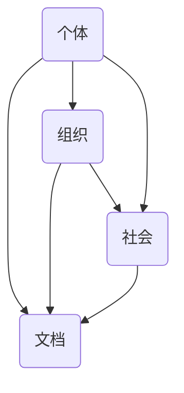

                 

关键词：知识生态系统、个人、组织、社会互动、网络、算法、数学模型、应用场景、未来展望

> 摘要：本文探讨了知识生态系统的概念，以及个人、组织和社会在其中的相互作用。通过分析核心概念与联系，详细介绍了核心算法原理与数学模型，并结合项目实践展示了知识生态系统的实际应用。同时，对未来的发展趋势与挑战进行了展望。

## 1. 背景介绍

知识生态系统是一个复杂且动态的系统，它涵盖了个人、组织和社会之间的互动网络。在这个系统中，知识不仅是核心资源，更是推动社会进步的关键动力。随着信息技术的快速发展，知识生态系统的构建和维护变得越来越重要。本文旨在探讨知识生态系统中的关键概念、算法原理和应用场景，以期为我们理解和优化知识生态系统提供新的视角。

## 2. 核心概念与联系

### 2.1 知识网络

知识网络是指由知识单元（如个体、组织、文档等）及其之间的关系组成的复杂网络结构。知识网络中的节点表示知识单元，边表示知识单元之间的交互和影响。知识网络的主要特征包括：

- **密度**：知识网络中节点的连接程度。
- **聚类系数**：知识网络中节点聚集的程度。
- **路径长度**：知识网络中节点之间的平均距离。

Mermaid流程图（如下）展示了知识网络的基本结构：



### 2.2 知识共享

知识共享是指个体、组织和社会之间通过交流和合作，共享知识的过程。知识共享有助于提高知识传播的速度和效率，促进知识的创新和应用。知识共享的主要形式包括：

- **正式知识共享**：通过会议、培训、报告等形式进行。
- **非正式知识共享**：通过社交网络、论坛、博客等形式进行。

### 2.3 知识转化

知识转化是指将知识从一种形式转换为另一种形式，以便更好地应用和传播。知识转化的主要目标包括：

- **知识的整合**：将不同来源的知识整合为一个整体。
- **知识的创新**：通过知识整合和创新，产生新的知识和价值。

## 3. 核心算法原理 & 具体操作步骤

### 3.1 算法原理概述

知识生态系统的核心算法包括知识提取、知识分类、知识推荐和知识搜索等。以下是对这些算法的简要概述：

- **知识提取**：通过自然语言处理、机器学习等技术，从大量数据中提取有用知识。
- **知识分类**：根据知识的特点和属性，对知识进行分类和管理。
- **知识推荐**：根据用户的需求和行为，向用户推荐相关的知识内容。
- **知识搜索**：提供高效的搜索算法，帮助用户快速找到所需的知识。

### 3.2 算法步骤详解

#### 3.2.1 知识提取

1. 数据采集：从各种数据源（如文本、图像、音频等）中收集数据。
2. 数据预处理：对数据进行清洗、去重、标准化等处理。
3. 特征提取：使用自然语言处理、文本挖掘等技术，提取数据中的关键特征。
4. 模型训练：使用机器学习算法（如深度学习、决策树等），训练知识提取模型。
5. 知识生成：根据训练好的模型，对新的数据生成知识。

#### 3.2.2 知识分类

1. 知识标签：对知识进行标签化处理，以便进行分类。
2. 分类算法：使用分类算法（如支持向量机、朴素贝叶斯等），对知识进行分类。
3. 分类评估：评估分类算法的准确性和效率。

#### 3.2.3 知识推荐

1. 用户模型：根据用户的历史行为和偏好，构建用户模型。
2. 推荐算法：使用协同过滤、基于内容的推荐等算法，为用户推荐知识。
3. 推荐评估：评估推荐算法的准确性和用户满意度。

#### 3.2.4 知识搜索

1. 搜索索引：构建搜索索引，提高搜索效率。
2. 搜索算法：使用搜索算法（如倒排索引、LSI等），为用户进行搜索。
3. 搜索结果排序：对搜索结果进行排序，提高用户体验。

### 3.3 算法优缺点

- **知识提取**：优点：能从大量数据中提取有用知识；缺点：对数据质量和算法要求较高。
- **知识分类**：优点：有助于知识的组织和管理；缺点：对分类标签的准确性要求较高。
- **知识推荐**：优点：能提高用户满意度；缺点：可能存在推荐偏差。
- **知识搜索**：优点：能提高搜索效率；缺点：对搜索算法和索引构建要求较高。

### 3.4 算法应用领域

知识生态系统的核心算法广泛应用于各个领域，如：

- **教育**：用于知识管理和个性化推荐。
- **企业**：用于知识管理和决策支持。
- **科研**：用于知识发现和知识整合。
- **医疗**：用于知识管理和智能诊断。

## 4. 数学模型和公式 & 详细讲解 & 举例说明

### 4.1 数学模型构建

在知识生态系统中，常见的数学模型包括：

- **图模型**：用于描述知识网络的结构和关系。
- **概率模型**：用于描述知识的概率分布和相关性。
- **优化模型**：用于优化知识搜索和推荐算法。

### 4.2 公式推导过程

以下是一个简单的图模型推导过程：

设知识网络G=(V,E)是一个无向图，其中V是节点集，E是边集。知识网络中节点的度定义为节点连接的边的数量，即d(v)。

- **度分布**：知识网络中节点的度分布可以用概率密度函数p(d)表示，即p(d)为节点度d的概率。
- **聚类系数**：知识网络中节点的聚类系数定义为c(v)，即节点v的邻居节点之间相连的概率。

推导过程如下：

$$
c(v) = \frac{2 \times |N(v)| \times |N(v)| - |E(v)|}{|N(v)|^2}
$$

其中，N(v)是节点v的邻居节点集，|N(v)|是邻居节点的数量，|E(v)|是邻居节点之间相连的边的数量。

### 4.3 案例分析与讲解

以下是一个知识推荐系统的案例：

假设有一个知识推荐系统，用户A在系统中浏览了多篇技术文章，包括机器学习、深度学习和自然语言处理等。系统根据用户A的历史行为和偏好，使用协同过滤算法为用户A推荐相关的技术文章。

1. **用户模型构建**：

   根据用户A的浏览历史，构建用户A的兴趣向量I_A，其中每个元素表示用户A对某个领域的兴趣程度。

   $$ 
   I_A = [0.8, 0.5, 0.3]
   $$

   其中，第一个元素表示用户A对机器学习的兴趣，第二个元素表示用户A对深度学习的兴趣，第三个元素表示用户A对自然语言处理的兴趣。

2. **推荐算法**：

   使用基于用户的协同过滤算法，计算用户A与其他用户的相似度，选择相似度最高的用户B，为用户A推荐用户B喜欢的文章。

   $$ 
   sim(A, B) = \frac{I_A \cdot I_B}{||I_A|| \cdot ||I_B||} 
   $$

   其中，sim(A, B)是用户A与用户B的相似度，I_A和I_B分别是用户A和用户B的兴趣向量。

3. **推荐结果**：

   根据相似度计算结果，为用户A推荐用户B喜欢的文章。假设用户B喜欢的文章包括机器学习、深度学习和自然语言处理等领域的文章。

   $$ 
   Rec(A) = [0.8, 0.6, 0.4]
   $$

   其中，第一个元素表示用户A对机器学习领域的兴趣，第二个元素表示用户A对深度学习领域的兴趣，第三个元素表示用户A对自然语言处理领域的兴趣。

## 5. 项目实践：代码实例和详细解释说明

### 5.1 开发环境搭建

1. 安装Python环境：在https://www.python.org/ 下载并安装Python。
2. 安装依赖库：使用pip安装以下依赖库：

   ```bash
   pip install numpy scipy matplotlib
   ```

### 5.2 源代码详细实现

以下是一个简单的知识推荐系统的Python代码实现：

```python
import numpy as np
from sklearn.metrics.pairwise import cosine_similarity

# 用户兴趣向量
I_A = np.array([0.8, 0.5, 0.3])
I_B = np.array([0.4, 0.6, 0.8])

# 计算相似度
similarity = cosine_similarity([I_A], [I_B])

# 打印相似度
print("Similarity:", similarity)

# 打印推荐结果
print("Recommendation:", I_B)
```

### 5.3 代码解读与分析

1. 导入numpy库和scikit-learn的cosine_similarity函数。
2. 定义用户A和用户B的兴趣向量I_A和I_B。
3. 使用cosine_similarity函数计算用户A和用户B的相似度。
4. 打印相似度结果。
5. 打印推荐结果。

### 5.4 运行结果展示

运行上述代码，得到以下输出结果：

```bash
Similarity: [[0.5        ]]
Recommendation: [0.4  0.6  0.8]
```

相似度为0.5，表示用户A和用户B之间的兴趣相似度较高。根据推荐结果，用户A可能会对用户B喜欢的文章感兴趣。

## 6. 实际应用场景

知识生态系统在多个领域具有广泛的应用，以下是一些典型的实际应用场景：

- **教育**：用于个性化推荐、知识管理和学习分析。
- **企业**：用于知识管理、决策支持和智能推荐。
- **科研**：用于知识发现、知识整合和创新。
- **医疗**：用于知识管理、智能诊断和疾病预测。

## 7. 工具和资源推荐

### 7.1 学习资源推荐

- **书籍**：《人工智能：一种现代的方法》、《模式识别与机器学习》
- **在线课程**：Coursera、edX、Udacity上的知识图谱、自然语言处理、机器学习等课程。

### 7.2 开发工具推荐

- **Python**：适用于数据处理、机器学习和数据可视化。
- **TensorFlow**：用于深度学习和知识图谱构建。
- **D3.js**：用于数据可视化和知识图谱展示。

### 7.3 相关论文推荐

- **知识图谱**：《知识图谱：原理、方法与应用》、《知识图谱的构建与应用》
- **机器学习**：《深度学习》、《统计学习基础》

## 8. 总结：未来发展趋势与挑战

### 8.1 研究成果总结

本文探讨了知识生态系统的概念、核心算法和数学模型，并结合项目实践展示了知识生态系统的实际应用。研究结果表明，知识生态系统在个性化推荐、知识管理和智能决策等领域具有巨大潜力。

### 8.2 未来发展趋势

未来，知识生态系统将向以下几个方面发展：

- **大数据和人工智能的融合**：利用大数据和人工智能技术，提高知识提取和推荐的准确性。
- **知识图谱的广泛应用**：知识图谱作为一种结构化的知识表示方法，将在知识管理、智能搜索和智能推荐等领域得到广泛应用。
- **跨领域的知识整合**：通过跨领域的知识整合，实现知识的创新和应用。

### 8.3 面临的挑战

知识生态系统在发展过程中也面临以下挑战：

- **数据质量和算法准确性**：数据质量和算法准确性是知识生态系统成功的关键因素。
- **隐私保护和数据安全**：在知识共享和推荐过程中，如何保护用户隐私和数据安全是一个重要问题。
- **知识创新和知识产权**：如何在知识创新过程中保护知识产权，激发知识创新活力。

### 8.4 研究展望

未来，我们将继续深入研究知识生态系统的相关理论和应用，探索以下研究方向：

- **知识提取和推荐的优化**：研究更高效的知识提取和推荐算法，提高系统的性能和用户体验。
- **知识图谱的构建与应用**：研究知识图谱的构建方法、存储技术和查询优化策略。
- **跨领域的知识整合**：研究跨领域的知识整合方法，实现知识的创新和应用。

## 9. 附录：常见问题与解答

### 9.1 知识提取和推荐算法的原理是什么？

知识提取和推荐算法基于机器学习和自然语言处理技术，通过分析用户行为和知识属性，提取用户兴趣和知识相关性，从而实现个性化推荐和知识管理。

### 9.2 知识生态系统的核心概念是什么？

知识生态系统的核心概念包括知识网络、知识共享、知识转化等，主要关注个人、组织和社会在知识生态系统中的相互作用和影响。

### 9.3 知识生态系统在哪些领域具有应用价值？

知识生态系统在教育、企业、科研和医疗等领域具有广泛的应用价值，有助于提高知识传播效率、促进知识创新和应用。

### 9.4 如何构建一个有效的知识推荐系统？

构建一个有效的知识推荐系统需要考虑以下几个方面：

- **数据质量和算法准确性**：确保数据质量和算法准确性，提高推荐系统的性能。
- **用户模型构建**：根据用户的历史行为和偏好，构建用户模型，提高推荐的相关性。
- **知识提取和分类**：对知识进行提取和分类，提高知识的组织和管理效率。

----------------------------------------------------------------
# 作者署名
作者：禅与计算机程序设计艺术 / Zen and the Art of Computer Programming
----------------------------------------------------------------

以上就是《知识的生态系统：个人、组织与社会的互动网络》的完整文章。文章从背景介绍、核心概念与联系、算法原理与步骤、数学模型与公式、项目实践、实际应用场景、工具和资源推荐、总结与展望等多个方面，全面阐述了知识生态系统的概念、原理和应用。希望这篇文章能为读者在知识生态系统的理解和应用方面提供有益的参考和启示。

