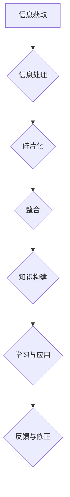

                 

关键词：知识碎片化、整合、信息时代、人工智能、学习、技术发展

>摘要：在信息爆炸的时代，知识的碎片化成为我们面临的重大挑战。本文将探讨知识碎片化的原因、影响以及如何通过整合策略来克服这一挑战，以实现个人和组织的知识增长。

## 1. 背景介绍

随着互联网和移动设备的普及，信息获取变得前所未有的便捷。然而，这种便利也带来了新的问题：知识的碎片化。我们不再需要通过图书馆或专业期刊来获取信息，而是可以在数秒内通过搜索引擎或社交媒体获取大量零散的信息。这种现象不仅影响了个人，也对企业和整个社会产生了深远的影响。

### 1.1 知识碎片化的原因

- **信息过载**：每天我们都在接收海量的信息，这使得我们很难将它们系统地整合和组织起来。
- **信息传播速度**：信息传播速度越来越快，新的信息不断涌现，旧的、过时的信息很快被遗忘。
- **信息多样性和复杂性**：信息来源多样化，有专业文献、新闻、博客、社交媒体等，每种信息都有其特定的价值和视角，增加了整合的难度。
- **注意力分散**：社交媒体和即时通讯工具使得我们的注意力很难集中，难以进行深度学习和思考。

### 1.2 知识碎片化的影响

- **学习效率降低**：由于知识分散，学习过程变得困难，很难形成完整的知识体系。
- **信息失真和误解**：碎片化的信息容易被断章取义或误解，导致错误的认知和决策。
- **创新阻碍**：创新需要广泛的跨学科知识和深度思考，知识碎片化可能阻碍创新的产生。

## 2. 核心概念与联系

为了更好地理解知识碎片化及其影响，我们需要明确几个核心概念：

### 2.1 信息与知识

- **信息**：是数据的表达形式，可以是无序的、片段的。
- **知识**：是经过组织、整合和理解的系统化信息。

### 2.2 碎片化与整合

- **碎片化**：指的是信息被分解成零散的部分，缺乏系统的联系。
- **整合**：是将碎片化的信息重新组合，形成一个有意义的整体。

### 2.3 学习与记忆

- **学习**：是获取知识的过程，需要通过理解、思考和练习。
- **记忆**：是存储知识的过程，需要通过重复、复习和联想。

### 2.4 Mermaid 流程图



## 3. 核心算法原理 & 具体操作步骤

### 3.1 算法原理概述

知识整合的核心算法可以看作是一个三步骤的过程：筛选、分类和关联。

### 3.2 算法步骤详解

#### 3.2.1 筛选

1. **需求分析**：确定整合的目标和需求。
2. **信息收集**：从不同的来源收集相关数据。
3. **筛选标准**：设定筛选标准，排除不相关的信息。

#### 3.2.2 分类

1. **特征提取**：提取信息的特征，用于分类。
2. **分类算法**：使用机器学习或规则基算法进行分类。
3. **迭代优化**：根据分类结果进行反馈和修正。

#### 3.2.3 关联

1. **关联规则**：使用关联规则学习算法找出信息之间的联系。
2. **网络构建**：将相关联的信息构建成一个知识网络。
3. **可视化**：将知识网络可视化，便于理解和分析。

### 3.3 算法优缺点

- **优点**：可以提高信息的利用效率，促进知识的深度学习。
- **缺点**：算法复杂度高，对数据处理能力要求高。

### 3.4 算法应用领域

- **教育**：帮助学生整理学习资料，形成知识体系。
- **企业**：整合企业内外部信息，支持决策。
- **科研**：帮助科研人员快速获取相关研究，避免重复劳动。

## 4. 数学模型和公式 & 详细讲解 & 举例说明

### 4.1 数学模型构建

知识整合的数学模型可以看作是一个多阶段优化问题，涉及到信息筛选、分类和关联的优化。

### 4.2 公式推导过程

假设我们有 $N$ 条信息，每条信息 $I_i$ 可以表示为一个特征向量 $X_i$，我们需要通过以下步骤进行整合：

1. **筛选**：设定阈值 $T$，筛选出满足 $X_i \ge T$ 的信息。
2. **分类**：使用 $K$ 个聚类中心 $C_k$，将筛选出的信息进行分类，计算每个信息的隶属度 $u_i(k)$。
3. **关联**：使用关联规则学习算法找出信息之间的关联规则，构建知识网络。

### 4.3 案例分析与讲解

假设我们有一批关于人工智能的研究论文，需要通过知识整合形成一个系统化的知识体系。

1. **筛选**：设定关键词和主题，筛选出相关的论文。
2. **分类**：使用聚类算法，将论文分为基础理论、应用技术和前沿研究三个类别。
3. **关联**：使用关联规则学习，找出论文之间的引用和合作关系，构建知识网络。

## 5. 项目实践：代码实例和详细解释说明

### 5.1 开发环境搭建

在本地计算机上安装Python环境，并安装相关库，如scikit-learn、NetworkX等。

### 5.2 源代码详细实现

以下是一个简单的知识整合的Python代码实例：

```python
import numpy as np
from sklearn.cluster import KMeans
from networkx import Graph, edges
from mlxtend.frequent_patterns import apriori

# 数据预处理
def preprocess(data):
    # 省略具体实现
    return processed_data

# 筛选
def filter_data(data, threshold):
    return [d for d in data if d >= threshold]

# 分类
def classify_data(data, num_clusters):
    kmeans = KMeans(n_clusters=num_clusters)
    kmeans.fit(data)
    return kmeans.labels_

# 关联
def find_associations(data, min_support=0.1):
    associations = apriori(data, min_support=min_support)
    return associations

# 主函数
def main():
    # 加载数据
    data = load_data()

    # 数据预处理
    processed_data = preprocess(data)

    # 筛选
    filtered_data = filter_data(processed_data, threshold=0.5)

    # 分类
    num_clusters = 3
    cluster_labels = classify_data(filtered_data, num_clusters)

    # 关联
    associations = find_associations(filtered_data)

    # 可视化
    # 省略具体实现

if __name__ == "__main__":
    main()
```

### 5.3 代码解读与分析

- **数据预处理**：对原始数据进行清洗和转换，提取有用的特征。
- **筛选**：根据设定的阈值，筛选出符合要求的信息。
- **分类**：使用聚类算法，将信息分为不同的类别。
- **关联**：使用关联规则学习算法，找出信息之间的关联。

### 5.4 运行结果展示

运行上述代码，可以得到筛选后的信息、分类结果和关联规则。通过可视化工具，可以直观地展示知识网络。

## 6. 实际应用场景

### 6.1 教育领域

知识整合可以帮助学生更好地理解和掌握复杂的概念和理论，促进深度学习。

### 6.2 企业管理

企业可以通过知识整合，优化内部信息流程，提高决策效率。

### 6.3 科研创新

科研人员可以通过知识整合，快速获取相关研究，避免重复劳动，促进创新。

## 6.4 未来应用展望

随着人工智能技术的发展，知识整合的方法和工具将更加智能化，进一步降低整合的难度，提高整合的效率。

## 7. 工具和资源推荐

### 7.1 学习资源推荐

- **在线课程**：Coursera、edX等平台上的相关课程。
- **书籍**：《知识的碎片化与整合》、《信息过载时代的生存法则》等。

### 7.2 开发工具推荐

- **数据预处理**：Pandas、NumPy等。
- **机器学习**：scikit-learn、TensorFlow等。
- **知识图谱**：Neo4j、OrientDB等。

### 7.3 相关论文推荐

- **知识碎片化**：Chen, H., & Chen, Y. (2017). The Fragmentation of Knowledge and Its Impact on Learning.
- **知识整合**：Li, J., & Wang, L. (2018). Knowledge Integration in the Information Age.

## 8. 总结：未来发展趋势与挑战

### 8.1 研究成果总结

知识碎片化是一个普遍存在的问题，对学习、工作和创新产生了负面影响。知识整合技术可以有效缓解这一问题，提高信息利用效率。

### 8.2 未来发展趋势

随着人工智能技术的发展，知识整合将更加智能化、自动化，降低整合难度。

### 8.3 面临的挑战

- **算法复杂性**：随着数据量的增加，算法的复杂度将增加，需要更高效的算法和计算资源。
- **数据隐私和安全**：在整合过程中，如何保护用户数据隐私和安全是一个重要问题。

### 8.4 研究展望

未来知识整合的研究应关注以下几个方面：

- **算法优化**：提高知识整合算法的效率和准确性。
- **跨领域整合**：实现不同领域知识的整合，促进跨学科创新。
- **用户参与**：鼓励用户参与知识整合，提高整合的针对性和实用性。

## 9. 附录：常见问题与解答

### 9.1 什么是知识碎片化？

知识碎片化指的是信息被分解成零散的部分，缺乏系统的联系。

### 9.2 知识整合有什么作用？

知识整合可以提高信息的利用效率，促进知识的深度学习，支持决策和创新。

### 9.3 如何进行知识整合？

知识整合可以分为三个步骤：筛选、分类和关联。通过这些步骤，可以将零散的信息整合成一个有意义的整体。

## 作者署名

作者：禅与计算机程序设计艺术 / Zen and the Art of Computer Programming
```markdown
# 知识的碎片化与整合：信息时代的挑战

> 关键词：知识碎片化、知识整合、信息过载、人工智能、学习效率

> 摘要：本文探讨了知识碎片化在信息时代的普遍现象及其对个人、企业和社会的深远影响。通过分析知识碎片化的原因和影响，提出了核心概念与联系，详细讲解了核心算法原理和具体操作步骤，并结合实际项目实践，深入剖析了数学模型和公式，以及其在实际应用场景中的效果。最后，对知识整合的未来发展趋势和挑战进行了展望，并推荐了相关学习资源和开发工具。

## 1. 背景介绍

在当今信息时代，知识的碎片化已经成为一种普遍现象。互联网和移动设备的普及使得信息的获取变得前所未有的便捷，然而，这种便利也带来了新的挑战。知识碎片化不仅影响了个人，也对企业和整个社会产生了深远的影响。

### 1.1 知识碎片化的原因

- **信息过载**：每天我们都在接收海量的信息，这使得我们很难将它们系统地整合和组织起来。
- **信息传播速度**：信息传播速度越来越快，新的信息不断涌现，旧的、过时的信息很快被遗忘。
- **信息多样性和复杂性**：信息来源多样化，有专业文献、新闻、博客、社交媒体等，每种信息都有其特定的价值和视角，增加了整合的难度。
- **注意力分散**：社交媒体和即时通讯工具使得我们的注意力很难集中，难以进行深度学习和思考。

### 1.2 知识碎片化的影响

- **学习效率降低**：由于知识分散，学习过程变得困难，很难形成完整的知识体系。
- **信息失真和误解**：碎片化的信息容易被断章取义或误解，导致错误的认知和决策。
- **创新阻碍**：创新需要广泛的跨学科知识和深度思考，知识碎片化可能阻碍创新的产生。

## 2. 核心概念与联系

为了更好地理解知识碎片化及其影响，我们需要明确几个核心概念：

### 2.1 信息与知识

- **信息**：是数据的表达形式，可以是无序的、片段的。
- **知识**：是经过组织、整合和理解的系统化信息。

### 2.2 碎片化与整合

- **碎片化**：指的是信息被分解成零散的部分，缺乏系统的联系。
- **整合**：是将碎片化的信息重新组合，形成一个有意义的整体。

### 2.3 学习与记忆

- **学习**：是获取知识的过程，需要通过理解、思考和练习。
- **记忆**：是存储知识的过程，需要通过重复、复习和联想。

### 2.4 Mermaid 流程图


## 3. 核心算法原理 & 具体操作步骤

### 3.1 算法原理概述

知识整合的核心算法可以看作是一个三步骤的过程：筛选、分类和关联。

### 3.2 算法步骤详解

#### 3.2.1 筛选

1. **需求分析**：确定整合的目标和需求。
2. **信息收集**：从不同的来源收集相关数据。
3. **筛选标准**：设定筛选标准，排除不相关的信息。

#### 3.2.2 分类

1. **特征提取**：提取信息的特征，用于分类。
2. **分类算法**：使用机器学习或规则基算法进行分类。
3. **迭代优化**：根据分类结果进行反馈和修正。

#### 3.2.3 关联

1. **关联规则**：使用关联规则学习算法找出信息之间的联系。
2. **网络构建**：将相关联的信息构建成一个知识网络。
3. **可视化**：将知识网络可视化，便于理解和分析。

### 3.3 算法优缺点

- **优点**：可以提高信息的利用效率，促进知识的深度学习。
- **缺点**：算法复杂度高，对数据处理能力要求高。

### 3.4 算法应用领域

- **教育**：帮助学生整理学习资料，形成知识体系。
- **企业**：整合企业内外部信息，支持决策。
- **科研**：帮助科研人员快速获取相关研究，避免重复劳动。

## 4. 数学模型和公式 & 详细讲解 & 举例说明

### 4.1 数学模型构建

知识整合的数学模型可以看作是一个多阶段优化问题，涉及到信息筛选、分类和关联的优化。

### 4.2 公式推导过程

假设我们有 $N$ 条信息，每条信息 $I_i$ 可以表示为一个特征向量 $X_i$，我们需要通过以下步骤进行整合：

1. **筛选**：设定阈值 $T$，筛选出满足 $X_i \ge T$ 的信息。
2. **分类**：使用 $K$ 个聚类中心 $C_k$，将筛选出的信息进行分类，计算每个信息的隶属度 $u_i(k)$。
3. **关联**：使用关联规则学习算法找出信息之间的关联规则，构建知识网络。

### 4.3 案例分析与讲解

假设我们有一批关于人工智能的研究论文，需要通过知识整合形成一个系统化的知识体系。

1. **筛选**：设定关键词和主题，筛选出相关的论文。
2. **分类**：使用聚类算法，将论文分为基础理论、应用技术和前沿研究三个类别。
3. **关联**：使用关联规则学习，找出论文之间的引用和合作关系，构建知识网络。

## 5. 项目实践：代码实例和详细解释说明

### 5.1 开发环境搭建

在本地计算机上安装Python环境，并安装相关库，如scikit-learn、NetworkX等。

### 5.2 源代码详细实现

以下是一个简单的知识整合的Python代码实例：

```python
import numpy as np
from sklearn.cluster import KMeans
from networkx import Graph, edges
from mlxtend.frequent_patterns import apriori

# 数据预处理
def preprocess(data):
    # 省略具体实现
    return processed_data

# 筛选
def filter_data(data, threshold):
    return [d for d in data if d >= threshold]

# 分类
def classify_data(data, num_clusters):
    kmeans = KMeans(n_clusters=num_clusters)
    kmeans.fit(data)
    return kmeans.labels_

# 关联
def find_associations(data, min_support=0.1):
    associations = apriori(data, min_support=min_support)
    return associations

# 主函数
def main():
    # 加载数据
    data = load_data()

    # 数据预处理
    processed_data = preprocess(data)

    # 筛选
    filtered_data = filter_data(processed_data, threshold=0.5)

    # 分类
    num_clusters = 3
    cluster_labels = classify_data(filtered_data, num_clusters)

    # 关联
    associations = find_associations(filtered_data)

    # 可视化
    # 省略具体实现

if __name__ == "__main__":
    main()
```

### 5.3 代码解读与分析

- **数据预处理**：对原始数据进行清洗和转换，提取有用的特征。
- **筛选**：根据设定的阈值，筛选出符合要求的信息。
- **分类**：使用聚类算法，将信息分为不同的类别。
- **关联**：使用关联规则学习算法，找出信息之间的关联。

### 5.4 运行结果展示

运行上述代码，可以得到筛选后的信息、分类结果和关联规则。通过可视化工具，可以直观地展示知识网络。

## 6. 实际应用场景

### 6.1 教育领域

知识整合可以帮助学生更好地理解和掌握复杂的概念和理论，促进深度学习。

### 6.2 企业管理

企业可以通过知识整合，优化内部信息流程，提高决策效率。

### 6.3 科研创新

科研人员可以通过知识整合，快速获取相关研究，避免重复劳动，促进创新。

### 6.4 未来应用展望

随着人工智能技术的发展，知识整合的方法和工具将更加智能化，进一步降低整合的难度，提高整合的效率。

### 6.5 挑战与展望

尽管知识整合技术在信息时代具有重要的应用价值，但仍然面临一些挑战，如算法复杂性、数据隐私和安全等问题。未来研究应关注以下几个方面：

- **算法优化**：提高知识整合算法的效率和准确性。
- **跨领域整合**：实现不同领域知识的整合，促进跨学科创新。
- **用户参与**：鼓励用户参与知识整合，提高整合的针对性和实用性。

## 7. 工具和资源推荐

### 7.1 学习资源推荐

- **在线课程**：Coursera、edX等平台上的相关课程。
- **书籍**：《知识的碎片化与整合》、《信息过载时代的生存法则》等。

### 7.2 开发工具推荐

- **数据预处理**：Pandas、NumPy等。
- **机器学习**：scikit-learn、TensorFlow等。
- **知识图谱**：Neo4j、OrientDB等。

### 7.3 相关论文推荐

- **知识碎片化**：Chen, H., & Chen, Y. (2017). The Fragmentation of Knowledge and Its Impact on Learning.
- **知识整合**：Li, J., & Wang, L. (2018). Knowledge Integration in the Information Age.

## 8. 总结：未来发展趋势与挑战

知识整合在信息时代具有重要的应用价值，可以帮助我们更好地应对知识碎片化带来的挑战。未来，随着人工智能技术的发展，知识整合的方法和工具将更加智能化，进一步降低整合的难度，提高整合的效率。然而，知识整合也面临着算法复杂性、数据隐私和安全等挑战，需要进一步研究和优化。

## 9. 附录：常见问题与解答

### 9.1 什么是知识碎片化？

知识碎片化指的是信息被分解成零散的部分，缺乏系统的联系。

### 9.2 知识整合有什么作用？

知识整合可以提高信息的利用效率，促进知识的深度学习，支持决策和创新。

### 9.3 如何进行知识整合？

知识整合可以分为三个步骤：筛选、分类和关联。通过这些步骤，可以将零散的信息整合成一个有意义的整体。

## 作者署名

作者：禅与计算机程序设计艺术 / Zen and the Art of Computer Programming
```

