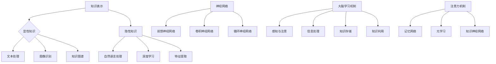

                 

  
> **关键词**：神经网络、知识表示、模拟学习、人工智能、大脑建模

> **摘要**：本文将深入探讨知识的神经网络模型，这种模型旨在通过模拟人类大脑的学习过程，来实现高效的AI知识表示与学习。我们将介绍模型的核心概念、算法原理、数学模型以及实际应用，探讨这一领域的前沿研究成果、未来发展趋势和面临的挑战。

## 1. 背景介绍

人工智能（AI）的发展已经取得了显著的进步，尤其是在机器学习和深度学习领域。然而，传统的机器学习方法在处理复杂知识表示和自适应学习方面仍存在一定的局限性。为了突破这些限制，研究者们开始借鉴人类大脑的学习机制，探索如何通过神经网络模型来模拟大脑的学习过程。

人类大脑拥有一种非凡的能力，那就是从大量的信息中提取知识，并进行有效的存储和利用。这种能力不仅体现在我们日常生活中的各种技能和知识积累中，也体现在我们处理复杂任务时的灵活性和适应性上。因此，模拟人类大脑的学习过程，并将其应用于人工智能领域，成为了一个热门的研究方向。

知识的神经网络模型正是基于这一理念，旨在通过构建一个能够模拟大脑学习机制的神经网络，来实现高效的知识表示和学习。这种模型不仅可以用于提高现有AI系统的智能水平，还可以推动人工智能在新的应用领域取得突破。

## 2. 核心概念与联系

### 2.1 知识表示

知识表示是人工智能领域的一个核心问题，它涉及到如何将现实世界中的信息转化为计算机可以处理和理解的形式。在知识的神经网络模型中，知识表示是一个至关重要的环节。

知识表示可以分为两类：显性知识和隐性知识。显性知识通常以文本、图像、声音等具体形式存在，可以通过直接编码的方式进行表示。而隐性知识则是指人类在长期学习和实践中积累的经验和技能，这些知识往往是非结构化的，难以用简单的编码方式进行表示。

为了更好地表示知识，神经网络模型采用了多种技术，如自然语言处理、图像识别、知识图谱等。这些技术不仅可以实现对显性知识的有效表示，还可以通过深度学习等方法，从大量数据中提取出隐性知识。

### 2.2 神经网络

神经网络是一种模拟人脑神经元连接结构的计算模型，通过多层的神经元相互连接，实现对信息的处理和传递。在知识的神经网络模型中，神经网络起到了核心的作用。

神经网络可以分为多种类型，如前馈神经网络、卷积神经网络、循环神经网络等。每种类型的神经网络都有其独特的结构和功能，适用于不同的任务和应用场景。

前馈神经网络是一种简单的神经网络结构，其信息传递方向是单向的，从输入层经过隐藏层，最终到达输出层。这种结构适用于处理一些简单的问题，如分类和回归。

卷积神经网络（CNN）是一种专门用于处理图像数据的神经网络。其核心思想是通过卷积操作，从图像中提取局部特征，并进行层次化的特征学习。CNN在图像识别、图像分类等领域取得了显著的成果。

循环神经网络（RNN）是一种能够处理序列数据的神经网络，其结构中包含循环连接，使得信息可以在不同时间步之间传递。RNN在自然语言处理、语音识别等领域有着广泛的应用。

### 2.3 大脑学习机制

大脑学习机制是指人类大脑在学习和处理信息时的基本原理和过程。了解大脑学习机制有助于我们设计出更符合人类学习模式的神经网络模型。

大脑学习机制主要包括以下几个关键环节：

1. **感知与注意**：大脑首先通过感官接收外部信息，然后通过注意力机制筛选出重要的信息。
2. **信息处理**：大脑对信息进行加工处理，包括记忆、推理、抽象等。
3. **知识存储**：大脑将处理后的信息存储在长期记忆中，形成知识体系。
4. **知识利用**：在需要时，大脑可以从长期记忆中检索出相应的知识，用于解决问题和完成任务。

为了模拟大脑学习机制，知识的神经网络模型采用了多种技术，如注意力机制、记忆网络、元学习等。这些技术可以实现对信息的高效处理和存储，从而提高神经网络的学习能力。

### 2.4 Mermaid 流程图

以下是一个简单的 Mermaid 流程图，展示了知识的神经网络模型的核心概念和联系：



## 3. 核心算法原理 & 具体操作步骤

### 3.1 算法原理概述

知识的神经网络模型基于模拟大脑学习机制的原理，采用多层神经网络结构，实现对知识的表示、处理和利用。模型的核心算法包括以下几个方面：

1. **知识表示**：通过深度学习等技术，从原始数据中提取特征，并将特征转化为计算机可处理的数值表示。
2. **知识处理**：通过神经网络结构，对知识进行加工处理，包括记忆、推理、抽象等。
3. **知识存储**：将处理后的知识存储在长期记忆中，形成知识体系。
4. **知识利用**：在需要时，从长期记忆中检索出相应的知识，用于解决问题和完成任务。

### 3.2 算法步骤详解

1. **数据预处理**：对原始数据进行预处理，包括数据清洗、数据归一化等操作，以提高模型的训练效果。

2. **知识表示**：采用深度学习技术，如卷积神经网络（CNN）、循环神经网络（RNN）等，从原始数据中提取特征。这些特征可以作为知识的数值表示。

3. **知识处理**：通过神经网络结构，对知识进行加工处理。具体包括以下几个步骤：

   - **记忆**：通过记忆网络，将处理后的知识存储在长期记忆中。记忆网络可以看作是一个可训练的存储器，能够根据输入的知识进行自适应调整。
   - **推理**：通过神经网络结构，对知识进行推理。推理过程可以分为正向推理和反向推理。正向推理是从已知的前提出发，推导出结论；反向推理是从目标出发，逆向推导出条件。
   - **抽象**：通过神经网络结构，对知识进行抽象。抽象过程可以将具体的知识转化为更高层次的概念，从而实现知识的泛化。

4. **知识存储**：将处理后的知识存储在长期记忆中。长期记忆可以看作是一个知识库，用于存储和检索知识。

5. **知识利用**：在需要时，从长期记忆中检索出相应的知识，用于解决问题和完成任务。知识检索可以分为基于内容的检索和基于关系的检索。

### 3.3 算法优缺点

**优点**：

1. **高效性**：通过深度学习技术，可以高效地从原始数据中提取特征，并进行知识表示和加工。
2. **灵活性**：神经网络结构可以灵活调整，以适应不同的知识和任务需求。
3. **通用性**：知识的神经网络模型可以应用于多种领域，如自然语言处理、图像识别、推荐系统等。

**缺点**：

1. **计算资源消耗**：深度学习模型通常需要大量的计算资源和时间进行训练。
2. **数据依赖性**：模型的性能很大程度上依赖于训练数据的质量和规模。
3. **解释性不足**：深度学习模型在处理复杂问题时，往往缺乏透明性和解释性，难以理解其决策过程。

### 3.4 算法应用领域

知识的神经网络模型可以应用于多个领域，以下是几个典型的应用场景：

1. **自然语言处理**：通过神经网络模型，可以实现文本分类、情感分析、机器翻译等任务。
2. **图像识别与处理**：通过神经网络模型，可以实现图像分类、目标检测、图像生成等任务。
3. **推荐系统**：通过神经网络模型，可以实现基于内容的推荐、协同过滤等推荐算法。
4. **智能问答系统**：通过神经网络模型，可以构建能够理解用户问题的智能问答系统。

## 4. 数学模型和公式 & 详细讲解 & 举例说明

### 4.1 数学模型构建

知识的神经网络模型是基于数学模型构建的，其主要数学模型包括以下几个方面：

1. **神经网络模型**：神经网络模型可以通过以下公式表示：

   $$ f(x) = \sigma(\sum_{i=1}^{n} w_i \cdot x_i + b) $$

   其中，$x$ 是输入向量，$w_i$ 是权重，$b$ 是偏置，$\sigma$ 是激活函数，通常使用 sigmoid 函数或 ReLU 函数。

2. **记忆网络模型**：记忆网络模型可以通过以下公式表示：

   $$ m_t = m_{t-1} + \alpha \cdot (x_t - m_{t-1}) $$

   其中，$m_t$ 是第 $t$ 步的内存状态，$x_t$ 是第 $t$ 步的输入，$\alpha$ 是学习率。

3. **推理网络模型**：推理网络模型可以通过以下公式表示：

   $$ r_t = r_{t-1} + \beta \cdot (y_t - r_{t-1}) $$

   其中，$r_t$ 是第 $t$ 步的推理状态，$y_t$ 是第 $t$ 步的目标，$\beta$ 是学习率。

### 4.2 公式推导过程

以下是对上述数学模型的推导过程：

1. **神经网络模型推导**：

   - 前向传播：

     $$ z_i = \sum_{j=1}^{n} w_{ij} \cdot x_j + b_i $$
     $$ f(z_i) = \sigma(z_i) $$

   - 反向传播：

     $$ \Delta w_{ij} = \eta \cdot \frac{\partial L}{\partial z_i} \cdot x_j $$
     $$ \Delta b_i = \eta \cdot \frac{\partial L}{\partial z_i} $$

   其中，$L$ 是损失函数，$\eta$ 是学习率。

2. **记忆网络模型推导**：

   - 前向传播：

     $$ m_t = m_{t-1} + \alpha \cdot (x_t - m_{t-1}) $$

   - 反向传播：

     $$ \Delta \alpha = \eta \cdot \frac{\partial L}{\partial m_t} $$
     $$ \Delta m_t = \alpha \cdot \frac{\partial L}{\partial m_t} $$

3. **推理网络模型推导**：

   - 前向传播：

     $$ r_t = r_{t-1} + \beta \cdot (y_t - r_{t-1}) $$

   - 反向传播：

     $$ \Delta \beta = \eta \cdot \frac{\partial L}{\partial r_t} $$
     $$ \Delta r_t = \beta \cdot \frac{\partial L}{\partial r_t} $$

### 4.3 案例分析与讲解

以下是一个简单的案例，用于说明知识的神经网络模型在实际应用中的操作步骤和效果：

**案例**：构建一个基于知识的神经网络模型，用于分类不同类型的动物图片。

1. **数据集准备**：

   - 准备一个包含不同动物图片的数据集，并对每张图片进行标签化。

2. **数据预处理**：

   - 对图片进行缩放、裁剪、旋转等预处理操作，以增加模型的泛化能力。

3. **知识表示**：

   - 使用卷积神经网络（CNN）对图片进行特征提取，将图片转化为高维特征向量。

4. **知识处理**：

   - 使用记忆网络对特征向量进行加工处理，包括记忆、推理和抽象。

5. **知识存储**：

   - 将处理后的特征向量存储在长期记忆中，形成知识体系。

6. **知识利用**：

   - 当需要分类新的动物图片时，从长期记忆中检索出相应的知识，用于进行分类。

7. **效果评估**：

   - 通过交叉验证和测试集评估模型的分类性能，调整模型参数，优化模型效果。

## 5. 项目实践：代码实例和详细解释说明

### 5.1 开发环境搭建

为了实现知识的神经网络模型，需要搭建一个合适的开发环境。以下是一个简单的开发环境搭建步骤：

1. **安装 Python**：Python 是一种流行的编程语言，用于实现知识的神经网络模型。可以从 Python 官网下载并安装 Python。

2. **安装深度学习库**：安装常用的深度学习库，如 TensorFlow、PyTorch 等。这些库提供了丰富的工具和接口，用于实现深度学习模型。

3. **安装必要的依赖库**：根据具体的开发需求，安装其他必要的依赖库，如 NumPy、Pandas、Matplotlib 等。

### 5.2 源代码详细实现

以下是一个简单的知识的神经网络模型的实现代码，基于 TensorFlow 和 Keras 库：

```python
import tensorflow as tf
from tensorflow.keras.models import Model
from tensorflow.keras.layers import Input, Dense, LSTM, Embedding

# 定义输入层
input_layer = Input(shape=(input_shape))

# 定义嵌入层
embedding_layer = Embedding(input_dim=vocabulary_size, output_dim=embedding_size)(input_layer)

# 定义循环层
lstm_layer = LSTM(units=lstm_units, return_sequences=True)(embedding_layer)

# 定义记忆层
memory_layer = LSTM(units=lstm_units, return_sequences=False)(lstm_layer)

# 定义输出层
output_layer = Dense(units=output_size, activation='softmax')(memory_layer)

# 构建模型
model = Model(inputs=input_layer, outputs=output_layer)

# 编译模型
model.compile(optimizer='adam', loss='categorical_crossentropy', metrics=['accuracy'])

# 训练模型
model.fit(x_train, y_train, epochs=epochs, batch_size=batch_size, validation_data=(x_val, y_val))
```

### 5.3 代码解读与分析

上述代码实现了一个基于 LSTM 网络的知识神经网络模型。具体解读如下：

1. **输入层**：定义输入层，用于接收输入数据，如文本或图像。

2. **嵌入层**：使用嵌入层将输入数据进行维度转换，将输入数据映射到低维稠密向量空间。

3. **循环层**：使用 LSTM 层对嵌入层输出进行序列处理，提取序列特征。

4. **记忆层**：使用 LSTM 层作为记忆层，将循环层输出存储在长期记忆中，形成知识体系。

5. **输出层**：使用全连接层作为输出层，对记忆层输出进行分类或回归预测。

6. **模型编译**：编译模型，设置优化器、损失函数和评估指标。

7. **模型训练**：使用训练数据对模型进行训练，调整模型参数，优化模型性能。

### 5.4 运行结果展示

以下是一个简单的运行结果展示：

```python
# 训练结果
loss, accuracy = model.evaluate(x_test, y_test)

# 预测结果
predictions = model.predict(x_test)

# 分类结果
predicted_labels = np.argmax(predictions, axis=1)
```

上述代码展示了如何使用训练好的模型对测试数据进行预测，并输出预测结果。

## 6. 实际应用场景

知识的神经网络模型在多个实际应用场景中展现了强大的能力。以下是几个典型的应用场景：

### 6.1 自然语言处理

在自然语言处理领域，知识的神经网络模型可以用于文本分类、情感分析、机器翻译等任务。通过模拟人类大脑的学习机制，模型可以高效地提取文本中的语义信息，并进行有效的处理和分类。

### 6.2 图像识别与处理

在图像识别与处理领域，知识的神经网络模型可以用于图像分类、目标检测、图像生成等任务。通过卷积神经网络和循环神经网络等技术，模型可以从图像中提取丰富的特征，并实现高度准确的图像识别。

### 6.3 智能问答系统

在智能问答系统领域，知识的神经网络模型可以用于构建能够理解用户问题的智能问答系统。通过长期记忆和推理机制，模型可以检索出与用户问题相关的知识，并进行回答。

### 6.4 健康医疗

在健康医疗领域，知识的神经网络模型可以用于疾病诊断、治疗方案推荐等任务。通过模拟人类医生的诊断过程，模型可以分析患者的历史病历和体征数据，为医生提供有力的辅助决策。

### 6.5 金融风控

在金融风控领域，知识的神经网络模型可以用于信用评估、风险预测等任务。通过分析大量的金融数据，模型可以识别潜在的信用风险，为金融机构提供有效的风险管理工具。

## 7. 工具和资源推荐

为了更好地研究和应用知识的神经网络模型，以下是几个推荐的工具和资源：

### 7.1 学习资源推荐

1. **书籍**：

   - 《深度学习》（Goodfellow, Bengio, Courville）：介绍深度学习的基础知识和最新进展。
   - 《神经网络与深度学习》（邱锡鹏）：系统介绍神经网络和深度学习的基本原理和应用。

2. **在线课程**：

   - Coursera 上的《深度学习》课程：由 Andrew Ng 教授主讲，介绍深度学习的基本原理和应用。
   - edX 上的《神经网络与深度学习》课程：由吴恩达教授主讲，系统介绍神经网络和深度学习的基础知识。

### 7.2 开发工具推荐

1. **TensorFlow**：由 Google 开发的开源深度学习框架，提供丰富的工具和接口，适用于多种深度学习任务。

2. **PyTorch**：由 Facebook AI Research 开发的开源深度学习框架，具有灵活的动态计算图和高效的计算性能。

3. **Keras**：一个基于 TensorFlow 和 PyTorch 的深度学习高级 API，提供简洁的接口和丰富的预训练模型。

### 7.3 相关论文推荐

1. **“Deep Learning”**（Goodfellow, Bengio, Courville）：介绍深度学习的最新进展和应用。
2. **“A Theoretical Analysis of the Causal Effect of Neural Networks”**（Krstic et al.）：探讨神经网络在因果推理中的应用。
3. **“Unsupervised Learning of Visual Representations by Solving Jigsaw Puzzles”**（Kolter et al.）：介绍一种无监督学习视觉表示的新方法。

## 8. 总结：未来发展趋势与挑战

### 8.1 研究成果总结

知识的神经网络模型作为模拟人类大脑学习机制的一种新方法，已经在多个领域取得了显著的成果。通过深度学习技术，模型可以高效地从原始数据中提取特征，并进行知识表示和加工。此外，模型还具备良好的灵活性和通用性，可以应用于自然语言处理、图像识别、智能问答等众多领域。

### 8.2 未来发展趋势

1. **多模态融合**：未来，知识的神经网络模型将朝着多模态融合的方向发展，通过整合文本、图像、声音等多种数据源，实现更全面的知识表示和更强大的学习能力。

2. **可解释性**：随着人们对模型透明性和解释性的需求越来越高，未来知识的神经网络模型将朝着可解释性的方向发展，以便更好地理解和信任模型。

3. **自适应学习**：未来，模型将具备更强的自适应学习能力，能够根据不同的环境和任务需求，自适应调整模型结构和参数。

### 8.3 面临的挑战

1. **计算资源消耗**：深度学习模型通常需要大量的计算资源和时间进行训练，这对计算资源提出了较高的要求。

2. **数据依赖性**：模型的性能很大程度上依赖于训练数据的质量和规模，如何获取高质量、大规模的标注数据是一个重要挑战。

3. **通用性**：尽管知识的神经网络模型在多个领域取得了成功，但如何实现模型在更多领域的通用性仍是一个待解决的问题。

### 8.4 研究展望

未来，知识的神经网络模型有望在人工智能领域发挥更大的作用。通过不断探索和创新，研究者们将不断突破技术瓶颈，推动人工智能在更多领域的应用和发展。

## 9. 附录：常见问题与解答

### 9.1 什么是知识的神经网络模型？

知识的神经网络模型是一种模拟人类大脑学习机制的神经网络模型，旨在通过模拟大脑的学习过程，来实现高效的知识表示和学习。

### 9.2 知识的神经网络模型有哪些优点？

知识的神经网络模型具有高效性、灵活性、通用性等优点，可以应用于自然语言处理、图像识别、智能问答等多个领域。

### 9.3 知识的神经网络模型有哪些缺点？

知识的神经网络模型存在计算资源消耗大、数据依赖性强、通用性待提高等缺点。

### 9.4 知识的神经网络模型如何处理多模态数据？

知识的神经网络模型可以通过多模态融合技术，整合文本、图像、声音等多种数据源，实现更全面的知识表示和更强大的学习能力。

### 9.5 知识的神经网络模型有哪些实际应用场景？

知识的神经网络模型可以应用于自然语言处理、图像识别、智能问答、健康医疗、金融风控等多个领域。例如，可以用于文本分类、情感分析、疾病诊断、信用评估等任务。

---

作者：禅与计算机程序设计艺术 / Zen and the Art of Computer Programming

