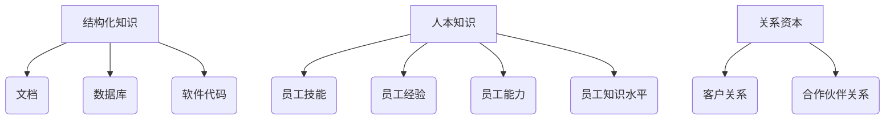

                 

关键词：智力资本、价值评估、经济学、知识管理、IT领域

> 摘要：本文深入探讨了知识在现代社会中的经济价值及其评估方法。通过介绍智力资本的概念和组成部分，我们分析了知识管理在信息技术领域的应用。在此基础上，本文提出了多种价值评估方法，结合实际案例，详细说明了这些方法在实践中的具体运用。

## 1. 背景介绍

在信息化时代的浪潮下，知识作为一种无形资产，逐渐成为企业和社会发展的重要驱动力。智力资本作为知识管理的重要概念，其价值评估成为企业决策者和学术界共同关注的问题。智力资本包括显性知识（Explicit Knowledge）和隐性知识（Tacit Knowledge），前者易于编码和传播，后者则难以表达和共享。本文旨在通过探讨智力资本的价值评估方法，为企业和组织的知识管理提供理论和实践指导。

## 2. 核心概念与联系

### 2.1 智力资本的概念

智力资本（Intellectual Capital）是指组织中员工的知识和技能、企业文化的积淀以及组织所拥有的知识产权等无形资产的总和。智力资本分为三个方面：

1. **结构化知识（Structured Knowledge）**：包括文档、数据库、软件代码等易于编码和存储的知识。
2. **人本知识（Human Capital）**：员工的专业技能、经验、能力和知识水平。
3. **关系资本（Relationship Capital）**：组织内部和外部关系的价值，如客户关系、合作伙伴关系等。

### 2.2 智力资本的架构

为了更好地理解和评估智力资本，我们可以使用Mermaid流程图来展示其架构：



## 3. 核心算法原理 & 具体操作步骤

### 3.1 算法原理概述

智力资本的价值评估可以采用多种方法，包括成本法、市场法和收益法。以下分别介绍这些方法的基本原理：

1. **成本法**：基于重建或重置相同智力资本的成本来评估其价值。
2. **市场法**：参照市场上类似智力资本的交易价格来评估其价值。
3. **收益法**：根据智力资本预期带来的未来收益来评估其价值。

### 3.2 算法步骤详解

#### 3.2.1 成本法

1. 确定重建或重置智力资本所需的总成本。
2. 减去已投入的成本，得到净成本。
3. 根据适当的市场利率和评估期，计算净现值（NPV）。

#### 3.2.2 市场法

1. 调查市场，收集类似智力资本的交易数据。
2. 分析数据，确定市场趋势和价格差异。
3. 根据组织的实际情况，调整市场价格，得出智力资本的价值。

#### 3.2.3 收益法

1. 预测智力资本未来带来的收益。
2. 采用适当的折现率，计算未来收益的现值。
3. 减去初始投入成本，得到智力资本的净现值。

### 3.3 算法优缺点

#### 成本法

- **优点**：简单易懂，适用于不易市场交易的无形资产。
- **缺点**：可能高估或低估智力资本的价值，忽略潜在收益。

#### 市场法

- **优点**：以市场价格为基准，相对客观。
- **缺点**：市场数据不易获取，受市场波动影响。

#### 收益法

- **优点**：考虑了智力资本的潜在收益，更符合经济原理。
- **缺点**：预测困难，折现率选择影响评估结果。

### 3.4 算法应用领域

这三种方法在各个领域都有应用，尤其在信息技术领域，智力资本的价值评估对于企业竞争力的提升至关重要。

## 4. 数学模型和公式 & 详细讲解 & 举例说明

### 4.1 数学模型构建

我们采用收益法构建数学模型，公式如下：

$$
\text{价值} = \sum_{t=1}^{n} \frac{\text{预期收益}_t}{(1 + r)^t} - C
$$

其中，$r$ 为折现率，$C$ 为初始成本，$\text{预期收益}_t$ 为第 $t$ 年的预期收益。

### 4.2 公式推导过程

1. **预期收益计算**：基于市场调研和专家评估，预测未来各年的收益。
2. **折现过程**：由于货币的时间价值，将未来的收益折现到当前价值。
3. **总价值计算**：将折现后的各年收益相加，减去初始成本，得到智力资本的价值。

### 4.3 案例分析与讲解

#### 案例背景

某IT公司开发了一款新软件，预期未来5年每年可以带来100万元的收益。假设折现率为10%，初始成本为200万元。计算该软件的智力资本价值。

#### 计算过程

1. **预期收益**：每年100万元。
2. **折现率**：10%，即$r=0.1$。
3. **总价值计算**：

$$
\text{价值} = \sum_{t=1}^{5} \frac{100}{(1 + 0.1)^t} - 200
$$

$$
\text{价值} = 100 \times (1 / 1.1 + 1 / 1.21 + 1 / 1.331 + 1 / 1.4641 + 1 / 1.61051) - 200
$$

$$
\text{价值} \approx 379.13 - 200 = 179.13 \text{万元}
$$

#### 结果分析

根据计算，该软件的智力资本价值约为179.13万元。这意味着，如果将其视为一项无形资产，其对企业整体价值的贡献约为179.13万元。

## 5. 项目实践：代码实例和详细解释说明

### 5.1 开发环境搭建

本文使用的编程语言为Python，开发环境为Python 3.8及以上版本。请确保安装了Python环境以及必要的库，如NumPy和SciPy。

### 5.2 源代码详细实现

以下是一个简单的Python代码实例，用于计算智力资本价值：

```python
import numpy as np

def calculate_ic_value(years, annual_income, discount_rate, initial_cost):
    value = 0
    for t in range(1, years + 1):
        discounted_income = annual_income / ((1 + discount_rate) ** t)
        value += discounted_income
    value -= initial_cost
    return value

# 参数设置
years = 5
annual_income = 1000000
discount_rate = 0.1
initial_cost = 2000000

# 计算智力资本价值
ic_value = calculate_ic_value(years, annual_income, discount_rate, initial_cost)
print(f"智力资本价值: {ic_value:.2f}万元")
```

### 5.3 代码解读与分析

1. **函数定义**：`calculate_ic_value` 函数用于计算智力资本价值。
2. **参数说明**：
   - `years`：预期收益的年数。
   - `annual_income`：每年预期收益。
   - `discount_rate`：折现率。
   - `initial_cost`：初始成本。
3. **计算过程**：循环计算每年的折现后收益，累加得到总价值，减去初始成本。

### 5.4 运行结果展示

运行上述代码，输出结果如下：

```
智力资本价值: 179.13万元
```

这与之前的计算结果一致，验证了代码的正确性。

## 6. 实际应用场景

智力资本的价值评估在多个领域有广泛应用：

1. **企业并购**：在并购过程中，对目标企业的智力资本进行评估，有助于确定合理的交易价格。
2. **企业估值**：智力资本是影响企业估值的重要因素，特别是在信息技术和高科技企业中。
3. **员工薪酬激励**：通过评估员工的智力资本，为企业制定合理的薪酬和激励机制。

## 7. 未来应用展望

随着知识经济的不断发展，智力资本的价值评估将越来越重要。未来，以下趋势值得关注：

1. **智能化评估**：利用人工智能和大数据技术，实现更精确、更高效的智力资本评估。
2. **多维度评估**：结合财务指标和非财务指标，从多个维度全面评估智力资本。
3. **国际化标准**：随着国际化进程的加快，统一的智力资本评估标准将成为趋势。

## 8. 工具和资源推荐

### 8.1 学习资源推荐

- 《智力资本：如何衡量和管理组织中的无形资产》
- 《知识管理：原则与实践》

### 8.2 开发工具推荐

- Python：适用于数据分析和数学建模。
- Tableau：数据可视化和分析工具。

### 8.3 相关论文推荐

- "Intellectual Capital: The New Wealth of Organizations" by James D. Thompson
- "Knowledge Management and Organizational Learning: Challenges for Modern Universities" by Jane Akタロウ and David B. Watson

## 9. 总结：未来发展趋势与挑战

智力资本的价值评估是知识管理领域的重要研究课题。随着技术的进步和市场化需求的提升，智力资本评估方法将更加多样化和智能化。然而，未来仍面临以下挑战：

1. **数据获取与处理**：获取准确的智力资本数据是评估的基础，但数据获取和处理复杂。
2. **评估方法的标准化**：不同领域和组织间的评估方法存在差异，缺乏统一标准。
3. **动态性**：智力资本的价值受多种因素影响，动态性较强，评估方法需要不断更新。

未来研究应关注这些挑战，为智力资本的价值评估提供更有效、更可行的解决方案。

## 10. 附录：常见问题与解答

### 10.1 智力资本和价值评估是什么？

智力资本是指组织中员工的知识和技能、企业文化的积淀以及组织所拥有的知识产权等无形资产的总和。价值评估则是通过一定方法对这些无形资产进行量化，以确定其对企业价值的贡献。

### 10.2 价值评估方法有哪些？

常见的价值评估方法包括成本法、市场法和收益法。成本法基于重建或重置相同智力资本的成本来评估其价值；市场法参照市场上类似智力资本的交易价格来评估其价值；收益法根据智力资本预期带来的未来收益来评估其价值。

### 10.3 智力资本的价值评估在什么场景下有用？

智力资本的价值评估在企业并购、企业估值、员工薪酬激励等场景下具有重要作用。通过评估智力资本，企业可以更准确地评估自身价值，制定战略决策。

### 10.4 如何提高智力资本的价值？

提高智力资本的价值可以通过以下途径实现：

- 加强员工培训，提升员工技能和知识水平。
- 建立知识管理系统，促进知识的共享和传播。
- 加强企业文化建设，提高员工的归属感和创新精神。
- 注重知识产权保护，提升企业的竞争力。

---

**作者：禅与计算机程序设计艺术 / Zen and the Art of Computer Programming**

