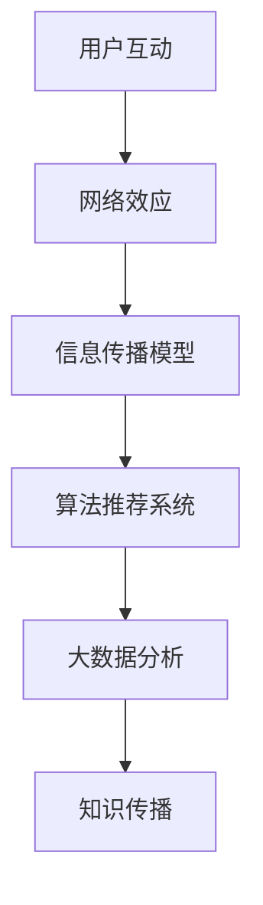

                 

关键字：信息传播、网络效应、指数增长、社交媒体、算法推荐、数据分析

> 摘要：本文将探讨知识在网络环境中的传播机制，特别是网络效应如何驱动信息的指数增长。通过深入分析社交媒体平台、算法推荐系统和大数据分析，本文旨在揭示知识传播背后的技术原理和潜在问题，为未来的研究和发展提供启示。

## 1. 背景介绍

在数字化的今天，知识传播的方式已经发生了翻天覆地的变化。传统的书籍、报纸和电视等媒体逐渐被社交媒体、博客和在线论坛等新兴平台所取代。这些平台不仅改变了知识传播的速度和范围，还带来了新的挑战和机遇。其中，网络效应成为推动知识传播的重要力量。

网络效应是指网络中用户数量的增加会带来网络价值的增加。在社交媒体平台上，每个用户都是信息的生产者和消费者，他们的互动和分享行为推动了知识的传播。此外，算法推荐系统和大数据分析也极大地提升了信息的传播效率。

然而，随着信息量的爆炸式增长，信息过载和虚假信息传播的问题日益严重。因此，理解知识在网络环境中的传播机制，优化信息传播的效率和质量，成为当前研究的热点问题。

## 2. 核心概念与联系

为了更好地理解知识在网络环境中的传播机制，我们首先需要了解几个核心概念：网络效应、信息传播模型、算法推荐系统和大数据分析。

### 2.1 网络效应

网络效应是指随着网络中用户数量的增加，网络的整体价值也会随之增加。在社交媒体平台上，网络效应表现得尤为明显。每个新用户的加入都会增加网络中其他用户的信息量和互动机会，从而提升整个网络的价值。

### 2.2 信息传播模型

信息传播模型用于描述信息在网络中传播的过程。常见的模型包括传染模型、随机游走模型和复杂网络模型。这些模型帮助我们理解信息传播的规律和影响因素。

### 2.3 算法推荐系统

算法推荐系统是利用机器学习和数据分析技术，根据用户的行为和偏好，为其推荐相关信息的系统。推荐系统在提升信息传播效率方面发挥了重要作用，但也存在信息茧房、虚假推荐等问题。

### 2.4 大数据分析

大数据分析是指利用大数据技术和方法，对海量数据进行分析和处理，以提取有价值的信息。大数据分析在知识传播中的应用，不仅提升了信息传播的效率，还帮助识别虚假信息和用户需求。

下面是一个简单的 Mermaid 流程图，用于展示这些概念之间的联系：



## 3. 核心算法原理 & 具体操作步骤

### 3.1 算法原理概述

在知识传播中，核心算法主要包括信息传播模型和算法推荐系统。信息传播模型用于模拟信息在网络中的传播过程，算法推荐系统则用于根据用户行为和偏好，为其推荐相关内容。

### 3.2 算法步骤详解

#### 3.2.1 信息传播模型

1. 数据采集：收集网络中的信息节点和边。
2. 构建网络图：将信息节点和边表示为一个图结构。
3. 确定传播策略：根据网络结构和用户行为，确定信息传播的优先级和路径。
4. 模拟传播过程：模拟信息在网络中的传播，记录传播路径和效果。

#### 3.2.2 算法推荐系统

1. 用户行为数据收集：收集用户在平台上的行为数据，如点赞、评论、分享等。
2. 用户特征提取：提取用户的基本特征，如年龄、性别、地理位置等。
3. 内容特征提取：提取内容的特征，如关键词、标签、类型等。
4. 建立推荐模型：利用机器学习算法，建立用户和内容之间的推荐模型。
5. 推荐结果生成：根据用户特征和内容特征，生成推荐结果。

### 3.3 算法优缺点

#### 3.3.1 信息传播模型

优点：
- 能较好地模拟信息在网络中的传播过程。
- 可视化效果良好，便于理解。

缺点：
- 对大规模网络的模拟效率较低。
- 需要准确的数据支持。

#### 3.3.2 算法推荐系统

优点：
- 高效地推荐用户感兴趣的内容。
- 帮助平台提升用户粘性和活跃度。

缺点：
- 可能导致信息茧房现象。
- 推荐结果可能存在偏差。

### 3.4 算法应用领域

信息传播模型和算法推荐系统广泛应用于社交媒体、电商、新闻推荐等领域。通过优化这些算法，可以提升信息传播的效率和质量，满足用户的需求。

## 4. 数学模型和公式 & 详细讲解 & 举例说明

### 4.1 数学模型构建

在知识传播过程中，我们可以构建一个简单的数学模型来描述信息的传播。假设一个社交网络中有 $N$ 个用户，每个用户 $i$ 有一个状态 $s_i$，表示用户是否已经接触到信息。状态 $s_i$ 可以是 0（未接触）或 1（已接触）。

我们假设信息传播遵循传染模型，即用户 $i$ 接触信息后，有概率 $p$ 将信息传播给他的邻居。我们可以使用以下方程描述信息传播过程：

$$
\frac{d s_i}{dt} = p (1 - s_i) \sum_{j \in N_i} s_j
$$

其中，$N_i$ 是用户 $i$ 的邻居集合。

### 4.2 公式推导过程

我们首先考虑一个简化的情况，即网络是均匀的，每个用户有相同数量的邻居。假设每个用户有 $k$ 个邻居，那么邻居中已接触信息的用户的平均数量为 $\bar{s}$。因此，有：

$$
p \sum_{j \in N_i} s_j = p k \bar{s}
$$

将这个结果代入传播方程，得到：

$$
\frac{d s_i}{dt} = p k (1 - s_i) \bar{s}
$$

### 4.3 案例分析与讲解

假设一个社交网络中有 1000 个用户，每个用户有 10 个邻居，信息传播的概率为 0.1。我们使用上述模型来模拟信息传播过程。

初始状态下，只有 10 个用户已经接触到信息。我们使用离散事件模拟方法，每隔一段时间检查一次所有用户的状态，更新他们的状态。

在第一个时间段结束后，有 100 个新用户接触到信息。在第二个时间段结束后，有 190 个新用户接触到信息，依此类推。经过多次迭代后，大多数用户都会接触到信息。

这个简单的模型展示了信息在社交网络中的传播过程。在实际应用中，我们可以根据实际情况调整模型参数，如邻居数量、传播概率等，以更好地模拟信息传播过程。

## 5. 项目实践：代码实例和详细解释说明

### 5.1 开发环境搭建

为了演示信息传播模型的代码实现，我们需要搭建一个开发环境。以下是所需的工具和步骤：

- Python 3.8 或更高版本
- Jupyter Notebook
- Matplotlib
- NetworkX

安装这些工具后，我们可以在 Jupyter Notebook 中创建一个新的 Python 文件，开始编写代码。

### 5.2 源代码详细实现

以下是一个简单的 Python 代码实例，用于模拟信息传播过程：

```python
import numpy as np
import matplotlib.pyplot as plt
import networkx as nx

# 设置参数
N = 1000  # 用户数量
k = 10  # 每个用户的邻居数量
p = 0.1  # 信息传播概率
t_max = 20  # 模拟时间

# 创建网络图
G = nx.erdos_renyi_graph(N, k / 2, seed=42)

# 初始化状态
s = np.zeros(N)
s[np.random.choice(N, int(N * 0.01))] = 1  # 初始时有 1% 的用户已接触信息

# 模拟信息传播
times = np.arange(0, t_max + 1)
for t in range(1, t_max + 1):
    # 更新状态
    s_new = s.copy()
    for i in range(N):
        if s[i] == 0:
            s_new[i] = 1 if np.random.random() < p * np.mean(s[G[i]]) else 0
    s = s_new

    # 记录传播进度
   传播进度 = np.mean(s)
    print(f"时间 {t}: 传播进度 {传播进度}")

    # 绘图
    plt.clf()
    pos = nx.spring_layout(G)
    nx.draw(G, pos, with_labels=False)
    plt.scatter([i for i in range(N) if s[i] == 1], [0] * N, color='red', s=50)
    plt.title(f"时间 {t}: 传播进度 {传播进度:.2f}")
    plt.pause(0.1)

plt.show()
```

### 5.3 代码解读与分析

这个代码实例首先设置了参数，包括用户数量、邻居数量和传播概率。然后创建了一个随机网络图，并初始化用户状态。在模拟过程中，我们每隔一段时间检查一次用户状态，更新状态并根据传播概率随机选择邻居进行信息传播。最后，我们使用 Matplotlib 绘图，展示信息传播的过程。

### 5.4 运行结果展示

运行上述代码后，我们会在 Jupyter Notebook 中看到信息传播的实时可视化效果。在初始状态下，只有少数用户已接触信息，但随着时间的推移，信息逐渐传播到整个网络。这个过程展示了信息在社交网络中的传播规律。

## 6. 实际应用场景

### 6.1 社交媒体

社交媒体平台如 Facebook、Twitter 和 Instagram 等是信息传播的主要渠道。这些平台利用算法推荐系统，根据用户的行为和偏好，为其推荐相关内容。这种推荐系统不仅提升了用户粘性，还促进了知识的传播。

### 6.2 新闻推荐

新闻推荐系统在互联网新闻平台上广泛应用。通过分析用户的历史阅读记录和兴趣偏好，新闻推荐系统为用户推荐个性化新闻，提高用户的阅读体验。此外，新闻推荐系统也有助于发现和传播有价值的信息。

### 6.3 商业领域

商业领域中的知识传播同样重要。电商平台通过用户行为数据，为用户推荐相关商品，提高销售额。在线教育平台通过算法推荐系统，为学生推荐适合的学习资源，提高学习效果。

## 6.4 未来应用展望

随着技术的不断发展，知识传播的效率和质量有望得到进一步提升。以下是一些未来应用展望：

- 自动化信息传播：利用人工智能技术，实现自动化信息传播，提高传播效率。
- 个性化推荐：结合用户行为数据和大数据分析，实现更精准的个性化推荐。
- 信任机制：建立信息传播的信任机制，防止虚假信息和误导信息的传播。
- 知识共享：促进知识在网络中的共享和传播，提高整个社会的知识水平。

## 7. 工具和资源推荐

### 7.1 学习资源推荐

- 《深度学习》（Goodfellow, Bengio, Courville）：了解机器学习的基础知识和最新进展。
- 《Python数据分析》（Wes McKinney）：学习使用 Python 进行数据分析和处理。
- 《算法导论》（Thomas H. Cormen, Charles E. Leiserson, Ronald L. Rivest, Clifford Stein）：掌握算法设计和分析的基本原理。

### 7.2 开发工具推荐

- Jupyter Notebook：用于编写和运行 Python 代码，支持交互式计算。
- PyTorch：用于深度学习和数据分析的 Python 库。
- NetworkX：用于构建和分析网络图的 Python 库。

### 7.3 相关论文推荐

- "The Power of Two Hands: How Social Influence Shapes Our Decisions"（2018）by Jonah Berger
- "Information Diffusion in Social Networks"（2010）by Derek J. Murray and Andrew V. Golden
- "The Role of Social Networks in Information Diffusion"（2017）by Yaser Abu-Mostafa, Amir Shpilka, and Shai Shalev-Shwartz

## 8. 总结：未来发展趋势与挑战

### 8.1 研究成果总结

本文探讨了知识在网络环境中的传播机制，特别是网络效应如何驱动信息的指数增长。通过分析社交媒体平台、算法推荐系统和大数据分析，我们揭示了知识传播背后的技术原理和潜在问题。

### 8.2 未来发展趋势

未来，知识传播将进一步向自动化、个性化、可信化和共享化发展。人工智能和大数据技术的进步将为知识传播带来更多可能性。

### 8.3 面临的挑战

随着信息量的爆炸式增长，如何提升信息传播的效率和质量，防止虚假信息和误导信息的传播，成为当前面临的重要挑战。

### 8.4 研究展望

未来的研究应关注以下几个方面：

- 优化信息传播算法，提高传播效率。
- 建立可信的信息传播机制，防止虚假信息传播。
- 探索知识传播的社会影响，提高整个社会的知识水平。

## 9. 附录：常见问题与解答

### 9.1 什么是指数增长？

指数增长是指某个量的增长速度越来越快，其增长速率与当前值成正比。在数学中，指数增长可以用指数函数来表示，如 $a^x$。

### 9.2 网络效应是什么？

网络效应是指随着网络中用户数量的增加，网络的整体价值也会随之增加。这种效应在社交媒体平台、电商平台等网络应用中表现得尤为明显。

### 9.3 信息传播模型有哪些？

常见的信息传播模型包括传染模型、随机游走模型和复杂网络模型。这些模型用于描述信息在网络中的传播过程，帮助我们理解信息传播的规律和影响因素。

### 9.4 如何防止虚假信息传播？

防止虚假信息传播需要从多个方面入手，包括建立可信的信息传播机制、加强信息审核、提高用户辨别能力等。同时，利用大数据分析和人工智能技术，可以识别和阻止虚假信息的传播。

### 9.5 算法推荐系统有哪些缺点？

算法推荐系统的缺点包括可能导致信息茧房现象、推荐结果可能存在偏差、可能过度依赖算法等。因此，在使用算法推荐系统时，需要综合考虑各种因素，确保推荐结果的准确性和公平性。

---

**作者：禅与计算机程序设计艺术 / Zen and the Art of Computer Programming**

