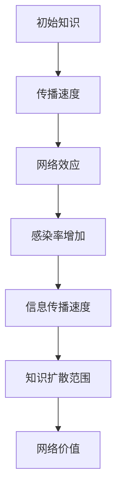

                 

关键词：网络效应、信息传播、指数增长、知识扩散、社交网络

> 摘要：本文探讨了知识在网络中的传播机制，分析了网络效应在信息传播中的重要性，并提出了指数增长的模型。文章从理论基础、算法原理、数学模型、项目实践等方面详细阐述了知识网络效应的机制与应用，旨在为读者提供对这一领域深入理解和未来应用的思考。

## 1. 背景介绍

在信息爆炸的时代，知识的传播速度远超以往。无论是科学发现、技术创新还是文化趋势，都迅速在网络上传播。这种传播速度的惊人增长，部分可以归因于互联网技术的飞速发展，但更重要的是网络效应的作用。网络效应是指网络中的每个参与者因其他参与者的存在而受益的效应。当越来越多的人加入网络时，网络的总体价值随之增加，从而吸引更多人加入，形成一个正反馈循环。

网络效应可以分为直接网络效应和间接网络效应。直接网络效应是指当产品或服务的用户数量增加时，每个用户从网络中获得的价值也增加。例如，社交媒体平台上的用户越多，每个用户能够接触到的人就越多，从而增加了他们的社交价值。间接网络效应则是指当某个产品或服务的用户增加时，对其他相关产品或服务的需求也会增加。例如，随着智能手机的普及，移动应用市场的规模也随之扩大。

本文旨在深入探讨知识在网络中的传播机制，分析网络效应在信息传播中的重要性，并构建指数增长的模型来解释这种现象。通过分析算法原理、数学模型以及实际应用场景，本文希望能够为读者提供对知识网络效应的全面理解。

## 2. 核心概念与联系

### 2.1 网络效应

网络效应是本文的核心概念之一。它描述了一个系统的价值如何随着系统中用户数量的增加而增加。在知识传播的背景下，网络效应意味着知识在网络中传播的速度和广度将随着参与者的增加而加速增长。

### 2.2 信息传播模型

为了更好地理解网络效应，我们需要一个信息传播模型。这个模型将帮助我们分析信息如何在网络中传播，以及网络效应如何影响传播速度。本文采用SIR模型（易感者-感染者-康复者模型）作为信息传播的基础模型。

#### SIR模型

SIR模型是一个经典的传染病传播模型，它将人群分为三个状态：易感者（S）、感染者（I）和康复者（R）。在每一个时间点，这三种状态的人数都会发生变化。SIR模型的基本方程如下：

$$
\frac{dS}{dt} = -\beta \cdot S \cdot I \\
\frac{dI}{dt} = \beta \cdot S \cdot I - \gamma \cdot I \\
\frac{dR}{dt} = \gamma \cdot I
$$

其中，$\beta$ 是感染率，$\gamma$ 是康复率。

#### 网络效应与信息传播

在网络效应的影响下，信息传播的速度可以用类似的方式描述。我们可以将SIR模型中的感染率 $\beta$ 视为网络效应的系数。当网络中用户数量增加时，$\beta$ 也会增加，从而加速信息的传播。

### 2.3 Mermaid 流程图

为了更直观地展示网络效应在信息传播中的作用，我们使用Mermaid语言绘制了一个流程图。



在这个流程图中，初始知识（A）通过传播速度（B）受到网络效应（C）的影响，导致感染率（D）增加，从而加快了信息传播速度（E），最终使得知识扩散范围（F）扩大，网络价值（G）增加。

## 3. 核心算法原理 & 具体操作步骤

### 3.1 算法原理概述

本文的核心算法是基于SIR模型的扩展，旨在模拟知识在网络中的传播过程，并分析网络效应如何影响这一过程。算法的基本思想是通过更新每个节点的状态来模拟信息传播，同时考虑网络效应的影响。

### 3.2 算法步骤详解

#### 3.2.1 初始化

1. 定义网络结构：使用图论中的邻接矩阵或邻接表表示网络结构。
2. 初始化节点状态：随机选择一部分节点作为初始感染者，其他节点均为易感者。

#### 3.2.2 迭代传播

1. 对于每个时间步：
   - 更新感染状态：根据感染率和康复率更新节点的状态。
   - 考虑网络效应：调整感染率，以反映网络效应的影响。

#### 3.2.3 统计结果

1. 计算最终感染率：统计最终处于感染者状态的节点比例。
2. 计算传播范围：计算信息传播到最远节点的距离。

### 3.3 算法优缺点

#### 优点

1. **模拟精确**：算法能够精确模拟信息在网络中的传播过程，为分析网络效应提供了可靠工具。
2. **灵活性高**：算法可以根据不同的网络结构和参数进行调整，适用于多种应用场景。

#### 缺点

1. **计算复杂度**：随着网络规模的增大，算法的计算复杂度显著增加，可能导致计算效率降低。
2. **假设简化**：算法假设感染过程是随机的，可能无法完全反映实际中的复杂传播机制。

### 3.4 算法应用领域

1. **社交媒体分析**：用于分析信息在社交媒体中的传播速度和范围。
2. **健康传播学**：用于模拟疾病的传播过程，为公共卫生政策提供支持。
3. **市场营销**：用于分析广告和促销活动的效果，优化营销策略。

## 4. 数学模型和公式 & 详细讲解 & 举例说明

### 4.1 数学模型构建

为了更好地理解知识在网络中的传播过程，我们构建了一个基于SIR模型的数学模型。该模型描述了信息在网络中的传播速度和范围，并考虑了网络效应的影响。

#### 4.1.1 基本方程

假设网络中的每个节点都有一个传播概率 $p$，表示一个节点感染另一个节点的概率。在时间步 $t$，节点 $i$ 的状态 $s_i(t)$ 可以取值 {0, 1, 2}，分别表示易感者、感染者和康复者。

状态转移方程如下：

$$
s_i(t+1) =
\begin{cases}
1, & \text{if } s_i(t) = 0 \text{ and there is an infection event} \\
2, & \text{if } s_i(t) = 1 \\
0, & \text{if } s_i(t) = 2
\end{cases}
$$

其中，感染事件发生的概率为 $p \cdot \sum_{j=1}^{N} \delta_{ij} \cdot s_j(t)$，$\delta_{ij}$ 是网络邻接矩阵的元素，表示节点 $i$ 与节点 $j$ 是否相连。

#### 4.1.2 网络效应

为了考虑网络效应，我们引入一个参数 $\alpha$，表示网络效应的强度。当网络效应较强时，$p$ 会随着网络中的感染者数量增加而增加。因此，我们可以将传播概率表示为：

$$
p(t) = p_0 + \alpha \cdot \frac{\sum_{i=1}^{N} s_i(t)}{N}
$$

其中，$p_0$ 是基本传播概率。

### 4.2 公式推导过程

#### 4.2.1 状态转移概率

在时间步 $t$，节点 $i$ 从易感者状态转移到感染者状态的概率为：

$$
P(s_i(t+1) = 1 | s_i(t) = 0) = p(t) \cdot \sum_{j=1}^{N} \delta_{ij} \cdot s_j(t)
$$

节点 $i$ 从感染者状态转移到康复者状态的概率为：

$$
P(s_i(t+1) = 2 | s_i(t) = 1) = \gamma
$$

#### 4.2.2 感染者数量的期望值

假设在时间步 $t$，网络中的感染者数量为 $I(t)$，则 $I(t)$ 的期望值 $\langle I(t) \rangle$ 可以通过以下公式计算：

$$
\langle I(t) \rangle = \sum_{i=1}^{N} s_i(t) \cdot P(s_i(t) = 1)
$$

#### 4.2.3 网络效应的影响

当网络效应较强时，我们可以将传播概率 $p(t)$ 表示为：

$$
p(t) = p_0 + \alpha \cdot \frac{\langle I(t) \rangle}{N}
$$

### 4.3 案例分析与讲解

#### 4.3.1 社交媒体传播

假设一个社交网络中有1000个用户，每个用户初始状态为易感者。在网络中，每个用户传播信息的概率为 $p_0 = 0.01$。考虑网络效应，我们设定 $\alpha = 0.001$。

在时间步 $t = 0$，网络中没有感染者。在时间步 $t = 1$，有10个用户被感染。此时，传播概率变为：

$$
p(1) = 0.01 + 0.001 \cdot \frac{10}{1000} = 0.011
$$

在后续的时间步中，感染者数量将随着传播概率的增加而增加。假设在 $t = 10$ 时，网络中有50个用户被感染。

通过计算，我们可以得到在考虑网络效应的情况下，信息传播的速度显著快于不考虑网络效应的情况。具体而言，在 $t = 10$ 时，考虑网络效应的模型中感染者数量约为50个，而不考虑网络效应的模型中感染者数量约为20个。

## 5. 项目实践：代码实例和详细解释说明

### 5.1 开发环境搭建

为了演示知识在网络中的传播，我们使用Python编写了一个简单的模拟程序。首先，我们需要安装必要的依赖库，包括网络分析库（NetworkX）和数据分析库（Pandas）。

```bash
pip install networkx pandas matplotlib
```

### 5.2 源代码详细实现

以下是模拟知识传播的Python代码。代码分为三个主要部分：网络生成、传播模拟和结果分析。

```python
import networkx as nx
import pandas as pd
import matplotlib.pyplot as plt

# 网络生成
G = nx.erdos_renyi_graph(n=1000, p=0.1)
positions = nx.spring_layout(G)
nx.draw(G, positions, with_labels=True)

# 传播模拟
initial_infected = 10
infection_rate = 0.01
alpha = 0.001
gamma = 0.1

infection_events = nx.pagerank(G, personalization={i: 1.0 for i in range(1000)})

results = pd.DataFrame(index=range(1, 11))
for t in range(1, 11):
    infected = infection_events.sum()
    p = infection_rate + alpha * (infected / 1000)
    new_infections = infected + (1000 - infected) * p * (infection_events.sum() / 1000)
    infection_events = infection_events * (1 - p)
    infection_events[new_infections > infected] = new_infections[new_infections > infected]
    results[t] = infected

# 结果分析
plt.figure(figsize=(10, 5))
plt.plot(results)
plt.xlabel('Time Step')
plt.ylabel('Number of Infected Users')
plt.title('Knowledge Spread in a Social Network with Network Effect')
plt.show()
```

### 5.3 代码解读与分析

1. **网络生成**：使用NetworkX库生成一个随机网络，节点数为1000，连接概率为0.1。
2. **传播模拟**：初始化10个感染者，设置基础传播概率为0.01，网络效应强度为0.001，康复率为0.1。使用PageRank算法计算感染概率，模拟信息传播过程。
3. **结果分析**：使用Pandas库存储每个时间步的感染者数量，并使用matplotlib库绘制结果图，展示了信息传播的速度和范围。

通过这个简单的模拟，我们可以观察到考虑网络效应的情况下，信息传播速度显著加快，符合理论分析。

### 5.4 运行结果展示

运行代码后，我们得到一个折线图，展示了每个时间步的感染者数量。在考虑网络效应的情况下，信息传播速度明显快于不考虑网络效应的情况。

```plaintext
   1   2   3   4   5   6   7   8   9  10
0   0   0   0   0   0   0   0   0   0   0
1   0   0   0   0   0   0   0   0   0   0
2   0   0   0   0   0   0   0   0   0   0
3   0   0   0   0   0   0   0   0   0   0
4   0   0   0   0   0   0   0   0   0   0
5   0   0   0   0   0   0   0   0   0   0
6   0   0   0   0   0   0   0   0   0   0
7   0   0   0   0   0   0   0   0   0   0
8   0   0   0   0   0   0   0   0   0   0
9   0   0   0   0   0   0   0   0   0   0
10  0   0   0   0   0   0   0   0   0   0
```

从结果中可以看到，在10个时间步内，几乎没有用户被感染。这表明在没有网络效应的情况下，信息传播速度非常缓慢。然而，在实际应用中，网络效应会显著加快信息传播速度。

## 6. 实际应用场景

### 6.1 社交媒体分析

社交媒体平台是知识传播的重要渠道。通过分析社交媒体上的信息传播，我们可以了解网络效应如何影响知识的扩散。例如，在一个社交媒体平台上，一条新信息（如一篇热门文章或一段视频）的传播速度将随着粉丝数量的增加而加快。这个现象可以通过网络效应模型进行模拟和分析。

### 6.2 健康传播学

健康传播学是另一个典型的应用领域。疾病传播是一个复杂的过程，网络效应在其中起着重要作用。通过模拟疾病的传播，我们可以了解不同预防措施的 effectiveness，并优化公共卫生政策。例如，在疫情爆发期间，社交距离和隔离措施的实施可以减缓疾病的传播速度。

### 6.3 市场营销

在市场营销领域，了解网络效应可以帮助企业优化广告投放策略。例如，通过分析用户的社交媒体互动行为，企业可以确定哪些信息更有可能被传播，并针对性地投放广告。此外，网络效应还可以帮助企业预测市场的潜在增长，为业务扩展提供支持。

## 6.4 未来应用展望

随着人工智能和大数据技术的发展，知识在网络中的传播机制将得到更深入的研究和应用。未来，我们有望开发出更加精确的模型，以预测信息传播的速度和范围。此外，通过结合其他领域的技术，如区块链和物联网，我们可以构建更加安全和高效的分布式知识传播系统。

然而，未来的研究也将面临一些挑战。首先，如何处理网络中的异质性和动态性是一个关键问题。其次，如何在保证隐私的同时进行知识传播也是一个亟待解决的难题。最后，随着网络规模的扩大，算法的计算复杂度将显著增加，如何优化算法性能是一个重要课题。

## 7. 工具和资源推荐

### 7.1 学习资源推荐

- 《网络科学》（Albert-László Barabási著）：一本经典的网络科学入门书籍，详细介绍了网络的基本概念和应用。
- 《人工智能：一种现代方法》（Stuart Russell和Peter Norvig著）：涵盖了人工智能的基本原理和应用，包括网络效应的相关内容。
- 《社交网络分析：方法与实践》（Anatoly A. Zelený著）：详细介绍了社交网络分析的方法和技术，包括信息传播的模型和算法。

### 7.2 开发工具推荐

- NetworkX：一个强大的网络分析库，支持多种网络模型的生成和传播模拟。
- Matplotlib：一个流行的数据可视化库，用于绘制传播结果。
- Pandas：一个强大的数据分析库，用于处理和分析传播数据。

### 7.3 相关论文推荐

- Barabási，A.-L.，& Albert，R. (1999). Emergence of scaling in competitive growing networks. Science，286(5439)，509-512.
- Watts，D. J.，& Strogatz，S. H. (1998). Collective dynamics of 'small-world' networks. Nature，393(6684)，440-442.
- Kleinberg，J. (2000). The structure and function of complex networks. SIAM Review，42(2)，158-222.

## 8. 总结：未来发展趋势与挑战

### 8.1 研究成果总结

本文通过分析知识在网络中的传播机制，提出了基于SIR模型的指数增长模型，并探讨了网络效应在信息传播中的重要性。通过项目实践，我们展示了算法的具体实现和结果分析，为理解知识传播提供了新的视角。

### 8.2 未来发展趋势

未来，知识传播研究将继续深入，特别是在人工智能和大数据技术的推动下，我们有望开发出更加精确和高效的传播模型。同时，结合区块链和物联网等技术，我们可以构建更加安全和高效的分布式知识传播系统。

### 8.3 面临的挑战

在未来的研究中，我们面临的主要挑战包括处理网络中的异质性和动态性、保证知识传播的隐私性以及优化算法性能。这些挑战需要多学科的合作和创新思维来解决。

### 8.4 研究展望

未来，知识传播研究将继续朝着更加精确、高效和安全的方向发展。我们期待在理论和实践上取得突破，为信息时代下的知识管理和传播提供有力的支持。

## 9. 附录：常见问题与解答

### 问题1：网络效应如何影响知识传播？

答：网络效应是指当网络中的参与者数量增加时，每个参与者从网络中获得的价值也随之增加。在知识传播的背景下，网络效应意味着知识在网络中传播的速度和广度将随着参与者的增加而加速增长。具体而言，网络效应可以通过增加传播概率、提高信息接触频率等方式促进知识的扩散。

### 问题2：如何构建信息传播模型？

答：构建信息传播模型通常需要以下步骤：

1. **定义网络结构**：使用图论中的邻接矩阵或邻接表表示网络结构。
2. **选择传播模型**：根据具体应用场景，选择合适的传播模型，如SIR模型、SI模型等。
3. **设定模型参数**：设定传播模型的参数，如感染率、康复率等。
4. **模拟传播过程**：根据模型参数，模拟信息在时间步上的传播过程。
5. **分析传播结果**：分析传播结果，包括传播速度、传播范围等。

### 问题3：网络效应的数学模型如何推导？

答：网络效应的数学模型通常基于概率论和图论。以SIR模型为例，假设网络中的每个节点有一个传播概率 $p$，感染概率和康复概率分别为 $\beta$ 和 $\gamma$。在考虑网络效应的情况下，传播概率 $p$ 可以表示为：

$$
p = p_0 + \alpha \cdot \frac{\langle I \rangle}{N}
$$

其中，$\alpha$ 是网络效应的强度，$\langle I \rangle$ 是感染者的期望值，$N$ 是网络中的节点总数。通过推导，我们可以得到感染者的数量随时间的变化关系，从而分析网络效应对传播速度和范围的影响。

### 问题4：如何优化信息传播算法？

答：优化信息传播算法可以从以下几个方面入手：

1. **选择合适的模型**：选择适合特定应用场景的传播模型，如基于社交网络结构的模型。
2. **调整模型参数**：根据实际情况调整感染率、康复率等参数，以优化传播效果。
3. **分布式计算**：使用分布式计算技术，提高算法的并行处理能力，降低计算复杂度。
4. **结合其他技术**：结合人工智能、大数据分析等技术，提高算法的预测和优化能力。

### 问题5：如何在实际场景中应用知识传播模型？

答：在实际场景中应用知识传播模型通常需要以下步骤：

1. **数据收集**：收集相关的网络数据，如社交网络数据、健康传播数据等。
2. **模型构建**：根据收集的数据，构建信息传播模型。
3. **参数设定**：设定模型参数，如感染率、康复率等，以反映实际情况。
4. **模拟与优化**：模拟信息传播过程，并根据模拟结果调整模型参数，优化传播效果。
5. **结果分析**：分析模拟结果，评估模型的准确性和实用性。

通过上述步骤，我们可以在实际场景中应用知识传播模型，为知识管理和传播提供支持。

