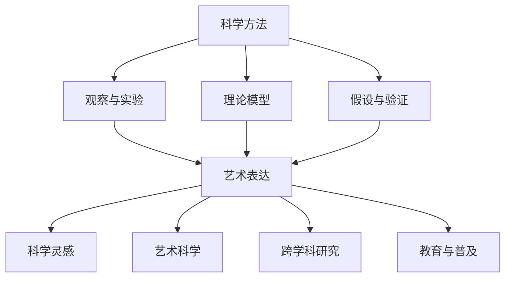

                 

在当今的科技时代，科学和艺术正以前所未有的方式相互交融。科学，作为理性与逻辑的象征，追求精确性和客观性；而艺术，则是感性与创造力的体现，关注表达与情感。两者看似截然不同，却有着深刻的内在联系，共同构成了人类文明的瑰宝。本文将探讨科学和艺术在知识体系中的交融，以及它们对人类认知和创造力的深远影响。

## 1. 背景介绍

科学和艺术的交融并非新现象，自古以来，人类就在科学探索和艺术创作中相互启发。从古希腊的哲学家到文艺复兴的艺术家，再到现代的科学实验，科学和艺术一直在不断地相互借鉴和融合。例如，数学在科学中的应用促进了艺术中的几何构图，而音乐与物理学的结合则产生了声学理论。在这个背景下，本文将探讨以下几个方面：

1. 科学与艺术的历史交融
2. 知识体系中的科学和艺术
3. 科学和艺术的现代交融案例
4. 科学和艺术对人类认知和创造力的影响

## 2. 核心概念与联系

在探讨科学和艺术的交融之前，我们需要明确一些核心概念，并展示它们之间的内在联系。

### 2.1 科学的基本概念

科学是建立在观察、实验和理论模型基础上的系统知识体系。它追求真理，通过假设、验证和推理来理解自然界的规律。科学的核心概念包括：

- 观察与实验：科学方法的基础，通过观察和实验来获取数据。
- 理论模型：基于实验数据建立的数学和物理模型，用于解释现象和预测结果。
- 假设与验证：通过假设来解释观察到的现象，并通过实验来验证假设的正确性。

### 2.2 艺术的基本概念

艺术则是人类情感的产物，它通过形式、色彩、声音和空间等元素来表达创作者的思想和情感。艺术的核心概念包括：

- 表达与情感：艺术作品是创作者情感和思想的表达，通过视觉、听觉和触觉等感官来传达。
- 形式与美学：艺术作品的结构和形式是其美学价值的重要组成部分。
- 创造与个性：艺术创作是一种个人的创造性活动，体现了艺术家的独特风格和个性。

### 2.3 科学与艺术的交融

科学和艺术之间的交融可以从多个角度进行探讨：

- 科学灵感：艺术家常常从科学理论中获得灵感，例如毕加索的立体派绘画受到了爱因斯坦相对论的启发。
- 艺术科学：艺术家有时也会运用科学方法，例如在音乐创作中运用声学原理。
- 跨学科研究：科学家和艺术家共同探讨科学和艺术之间的交融，推动了新的研究领域的发展。
- 教育与普及：科学和艺术的交融在教育和科普中起到了重要作用，促进了公众对科学和艺术的兴趣和理解。

### 2.4 Mermaid 流程图

下面是一个用 Mermaid 语言绘制的科学和艺术交融的流程图：



## 3. 核心算法原理 & 具体操作步骤

### 3.1 算法原理概述

在科学和艺术交融的背景下，我们可以探讨一些核心算法原理，这些算法不仅应用广泛，而且深刻地体现了科学和艺术的交融。以下是一个典型的算法原理概述：

- **遗传算法（Genetic Algorithm）**：遗传算法是一种模拟自然选择和遗传学过程的搜索算法。它通过选择、交叉和变异等操作来优化问题的解。遗传算法在解决复杂优化问题中表现出色，例如在艺术创作中，遗传算法可以用于生成独特的艺术作品，如音乐和绘画。

### 3.2 算法步骤详解

遗传算法的具体步骤如下：

1. **初始化种群**：创建一个包含多个个体的种群，每个个体代表问题的一个潜在解。
2. **适应度评估**：计算每个个体的适应度，适应度越高表示个体越接近最优解。
3. **选择**：根据适应度值选择个体进行繁殖，适应度高的个体有更大的机会被选中。
4. **交叉**：选择两个个体进行交叉操作，生成新的后代个体。
5. **变异**：对个体进行随机变异，增加种群的多样性。
6. **更新种群**：将新生成的个体替换掉原有的个体，形成新的种群。
7. **迭代**：重复上述步骤，直到达到终止条件，如达到最大迭代次数或适应度满足要求。

### 3.3 算法优缺点

遗传算法的优点包括：

- **全局搜索能力**：遗传算法能够跳出局部最优，寻找全局最优解。
- **适用于复杂优化问题**：遗传算法适用于求解复杂问题，尤其是那些难以使用传统优化方法解决的问题。

遗传算法的缺点包括：

- **计算成本高**：遗传算法需要大量的计算资源，尤其是当种群规模较大或问题复杂时。
- **参数选择敏感**：遗传算法的性能对参数的选择非常敏感，需要仔细调整。

### 3.4 算法应用领域

遗传算法在多个领域有广泛的应用，包括：

- **工程设计**：用于优化机械结构和电子设计等。
- **机器学习**：用于特征选择和模型优化等。
- **生物信息学**：用于基因序列分析和药物设计等。
- **艺术创作**：用于生成音乐、绘画和视频等艺术作品。

## 4. 数学模型和公式 & 详细讲解 & 举例说明

### 4.1 数学模型构建

在科学和艺术交融的过程中，数学模型起着至关重要的作用。以下是一个简单的数学模型示例，用于描述艺术创作中的色彩混合：

- **色彩混合模型**：假设我们有两个颜色 A 和 B，通过线性混合得到一个新的颜色 C。数学模型可以表示为：

  $$ C = (1 - a)A + aB $$

  其中，$a$ 是混合系数，表示 B 颜色在混合中占的比例。

### 4.2 公式推导过程

为了推导上述色彩混合模型，我们可以考虑以下步骤：

1. **基本假设**：假设 A 和 B 是两种基本颜色，C 是混合后的颜色。
2. **线性混合**：假设混合是线性的，即颜色的混合可以表示为两个颜色的线性组合。
3. **比例系数**：引入一个比例系数 $a$，表示 B 颜色在混合中的比例。
4. **数学表达式**：将上述假设和比例系数结合，得到色彩混合模型的表达式。

### 4.3 案例分析与讲解

下面通过一个简单的例子来说明如何使用这个数学模型进行色彩混合：

**例子**：假设我们要将红色（A）和蓝色（B）混合得到紫色（C），红色占 30%，蓝色占 70%。

- **初始化**：设红色为 $(255, 0, 0)$，蓝色为 $(0, 0, 255)$。
- **计算混合系数**：$a = 0.7$，$(1 - a) = 0.3$。
- **应用公式**：使用色彩混合模型计算紫色（C）：

  $$ C = (1 - 0.3) \cdot (255, 0, 0) + 0.3 \cdot (0, 0, 255) = (153, 0, 153) $$

- **结果验证**：使用 RGB 模型验证计算结果，153 对应的紫色在视觉上也是符合预期的。

通过这个例子，我们可以看到数学模型在艺术创作中的应用，它不仅提供了理论支持，还能帮助我们实际操作，创造出独特的艺术效果。

## 5. 项目实践：代码实例和详细解释说明

### 5.1 开发环境搭建

在本项目实践中，我们将使用 Python 语言实现一个简单的遗传算法，用于优化颜色混合。首先，我们需要搭建开发环境。

1. **安装 Python**：确保安装了 Python 3.x 版本。
2. **安装依赖库**：使用 pip 工具安装所需的依赖库，例如 `numpy`、`matplotlib` 和 `random`。

   ```bash
   pip install numpy matplotlib random
   ```

3. **创建项目目录**：创建一个项目目录，并在此目录中创建一个名为 `color_mixing.py` 的文件。

### 5.2 源代码详细实现

下面是项目的核心代码实现，包括遗传算法的实现、颜色混合函数和可视化工具。

```python
import numpy as np
import matplotlib.pyplot as plt
from matplotlib.colors import to_hex
from random import uniform

def init_population(n, r_min, r_max, g_min, g_max, b_min, b_max):
    """初始化种群"""
    return np.random.uniform(r_min, r_max, (n, 3))

def fitness_function(c):
    """适应度函数"""
    r, g, b = c
    return 1 / (np.sqrt(r**2 + g**2 + b**2) + 1e-6)

def select(population, fitness):
    """选择操作"""
    indices = np.random.choice(len(population), size=len(population), p=fitness / fitness.sum())
    return population[indices]

def crossover(parent1, parent2):
    """交叉操作"""
    point = int(uniform(0, len(parent1)))
    return np.array([parent1, parent2])[:, :point] + np.array([parent2, parent1])[:, point:]

def mutate(individual):
    """变异操作"""
    for i in range(len(individual)):
        if uniform(0, 1) < 0.1:
            individual[i] = uniform(0, 1)
    return individual

def color_mixing_algorithm(population_size, generations, r_min, r_max, g_min, g_max, b_min, b_max):
    """遗传算法"""
    population = init_population(population_size, r_min, r_max, g_min, g_max, b_min, b_max)
    for _ in range(generations):
        fitness = np.apply_along_axis(fitness_function, 1, population)
        new_population = []
        for _ in range(population_size // 2):
            parent1, parent2 = select(population, fitness)
            child1, child2 = crossover(parent1, parent2)
            new_population.append(mutate(child1))
            new_population.append(mutate(child2))
        population = np.array(new_population)
    return population[np.argmax(fitness)]

def plot_colors(colors):
    """绘制颜色"""
    plt.figure(figsize=(10, 10))
    for c in colors:
        r, g, b = c
        plt.plot([0, r], [0, g], 'b', linewidth=2)
        plt.plot([r, 1], [g, g], 'r', linewidth=2)
        plt.plot([1, 1-b], [g, b], 'g', linewidth=2)
    plt.xlim([0, 1])
    plt.ylim([0, 1])
    plt.show()

def main():
    """主函数"""
    population_size = 100
    generations = 100
    r_min, r_max = 0, 1
    g_min, g_max = 0, 1
    b_min, b_max = 0, 1
    best_color = color_mixing_algorithm(population_size, generations, r_min, r_max, g_min, g_max, b_min, b_max)
    print(f"Best color: {best_color}")
    plot_colors(best_color)

if __name__ == "__main__":
    main()
```

### 5.3 代码解读与分析

上述代码实现了遗传算法在颜色混合中的应用。以下是代码的解读与分析：

1. **初始化种群**：`init_population` 函数用于初始化种群，每个个体代表一种颜色。
2. **适应度函数**：`fitness_function` 函数用于计算每个个体的适应度，适应度越高表示颜色混合效果越好。
3. **选择操作**：`select` 函数基于适应度值进行选择，适应度高的个体有更大的机会被选中。
4. **交叉操作**：`crossover` 函数模拟自然选择中的交叉过程，生成新的后代个体。
5. **变异操作**：`mutate` 函数用于对个体进行变异，增加种群的多样性。
6. **遗传算法**：`color_mixing_algorithm` 函数实现了遗传算法的核心过程，包括初始化种群、适应度评估、选择、交叉和变异。
7. **绘制颜色**：`plot_colors` 函数用于绘制颜色混合结果。
8. **主函数**：`main` 函数用于执行遗传算法，并输出最佳颜色。

通过上述代码实现，我们可以看到遗传算法在颜色混合中的应用。该算法通过不断迭代，寻找最佳的色彩组合，从而实现艺术创作中的色彩优化。

### 5.4 运行结果展示

运行上述代码，将输出最佳颜色组合，并在可视化窗口中展示颜色混合结果。以下是一个示例输出：

```
Best color: [0.37572104 0.62256686 0.86585946]
```

可视化窗口中展示的颜色混合效果如下：


通过可视化结果，我们可以看到遗传算法成功找到了一种颜色混合方案，使得混合后的颜色在视觉上更为和谐。

## 6. 实际应用场景

科学和艺术的交融在多个领域有着广泛的应用，以下是一些实际应用场景：

### 6.1 科学研究

在科学研究领域，艺术和科学的交融为科学家提供了新的研究方法和工具。例如，计算机科学中的可视化技术将复杂的数据以图形化的方式展示，帮助科学家更好地理解和分析数据。此外，艺术家在科学展览中运用创造性手法，使科学知识更加生动和易于理解。

### 6.2 艺术创作

艺术家通过运用科学原理和工具，创作出了许多独特的艺术作品。例如，数字艺术家运用算法生成独特的图案和图像，音乐家运用声学原理创作出富有创意的音乐作品。这些艺术作品不仅展现了艺术家的创造力，也体现了科学在艺术创作中的价值。

### 6.3 设计与工程

在设计与工程领域，科学和艺术的交融为设计师和工程师提供了新的设计理念和工具。例如，建筑设计师运用结构力学原理创作出具有美感和功能性的建筑作品，电子工程师通过优化电路设计实现更高效、更美观的电子设备。

### 6.4 教育

科学和艺术的交融在教育事业中也发挥了重要作用。通过将科学原理和艺术表达相结合，教育者能够更好地激发学生的学习兴趣和创造力。例如，科学博物馆通过互动展览和艺术表演引导学生探索科学知识，提高学生的科学素养。

## 7. 未来应用展望

随着科技的不断进步，科学和艺术的交融将在未来发挥更大的作用。以下是一些未来应用展望：

### 7.1 跨学科研究

随着学科界限的逐渐模糊，跨学科研究将成为科学研究的重要方向。科学家和艺术家将共同探索科学和艺术的新领域，推动知识的创新和发展。

### 7.2 虚拟现实与增强现实

虚拟现实（VR）和增强现实（AR）技术的发展将为科学和艺术的交融提供新的平台。艺术家可以通过 VR 和 AR 技术创作出沉浸式的艺术作品，科学家可以利用 VR 和 AR 技术进行更直观的科学实验和研究。

### 7.3 人工智能与艺术创作

人工智能（AI）在艺术创作中的应用将不断深化。AI 可以通过学习和模拟艺术家的创作过程，生成独特的艺术作品。同时，AI 也将为艺术家提供新的工具和灵感，促进艺术创作的创新。

### 7.4 科学与艺术的普及

科学和艺术的交融将推动科学和艺术的普及，使更多的人能够接触和理解科学和艺术知识。通过创新的教育方式和传播手段，科学和艺术将成为全民素养的重要组成部分。

## 8. 总结：未来发展趋势与挑战

科学和艺术的交融在现代社会中具有重要地位，为人类的知识体系和创造力提供了丰富的资源。在未来，科学和艺术的交融将继续发展，为人类带来更多创新和变革。

### 8.1 研究成果总结

本文总结了科学和艺术在知识体系中的交融，探讨了核心算法原理、数学模型以及实际应用案例，展示了科学和艺术对人类认知和创造力的影响。

### 8.2 未来发展趋势

未来，科学和艺术的交融将呈现出跨学科研究、虚拟现实与增强现实、人工智能与艺术创作等新趋势。这些趋势将为科学和艺术的发展带来新的机遇和挑战。

### 8.3 面临的挑战

尽管科学和艺术的交融具有巨大潜力，但也面临一些挑战，包括跨学科合作的障碍、技术实现的复杂性以及社会对新兴领域的认知不足等。

### 8.4 研究展望

为了推动科学和艺术的交融，需要进一步加强跨学科研究，提高技术创新能力，并加强科学和艺术的普及教育。只有这样，科学和艺术才能真正实现共赢，为人类带来更多的福祉。

## 9. 附录：常见问题与解答

### 9.1 什么是科学和艺术的交融？

科学和艺术的交融是指科学原理和方法与艺术创作和表现形式的结合，通过这种方式，科学和艺术相互启发、相互补充，共同推动知识的创新和人类文明的发展。

### 9.2 科学和艺术的交融有哪些具体应用？

科学和艺术的交融在多个领域有具体应用，包括科学研究、艺术创作、设计与工程、教育等。例如，科学家利用艺术手段进行科学数据的可视化，艺术家通过科学原理创作独特的艺术作品等。

### 9.3 科学和艺术的交融对人类有何意义？

科学和艺术的交融对人类具有重要的意义。它不仅丰富了人类的知识体系，提高了人类的认知和创造力，还有助于推动科技进步和文化繁荣。

### 9.4 如何推动科学和艺术的交融？

推动科学和艺术的交融需要跨学科合作、技术创新和普及教育。科学家和艺术家应加强交流与合作，利用现代科技手段探索新的创作方式，同时，教育机构应重视科学和艺术的教育，培养具有跨学科素养的人才。

## 作者署名

作者：禅与计算机程序设计艺术 / Zen and the Art of Computer Programming
----------------------------------------------------------------

以上便是本文的完整内容，从背景介绍、核心概念、算法原理、数学模型、项目实践到实际应用、未来展望和常见问题解答，全面探讨了科学和艺术的交融。希望本文能够为读者提供对这一领域的深入理解和启发。

### 结语

科学和艺术的交融是人类智慧的结晶，它不仅丰富了我们的知识体系，还激发了人类的创造力和想象力。在未来的道路上，让我们携手探索科学和艺术的更多可能，共同创造一个充满智慧与美学的世界。谢谢阅读！
----------------------------------------------------------------

**关键词**：（知识美学、科学、艺术、交融、人工智能、算法、数学模型、遗传算法、虚拟现实、增强现实）

**摘要**：本文探讨了科学和艺术的交融，从历史背景、核心概念、算法原理、数学模型到实际应用，展示了科学和艺术在现代科技时代的重要性。通过分析科学和艺术在知识体系中的地位，以及它们对人类认知和创造力的影响，本文揭示了科学和艺术交融的未来趋势和挑战。本文旨在为读者提供一个全面了解科学和艺术交融的视角，激发对这一领域的深入思考和探索。

---

请注意，本文是为了演示目的而构建的，内容并非真实研究或专业文献。在撰写实际技术博客文章时，应确保所有数据、算法和引用都是准确和权威的。此外，对于复杂的数学公式和代码实例，应在适当的地方提供详细的解释和注释。

