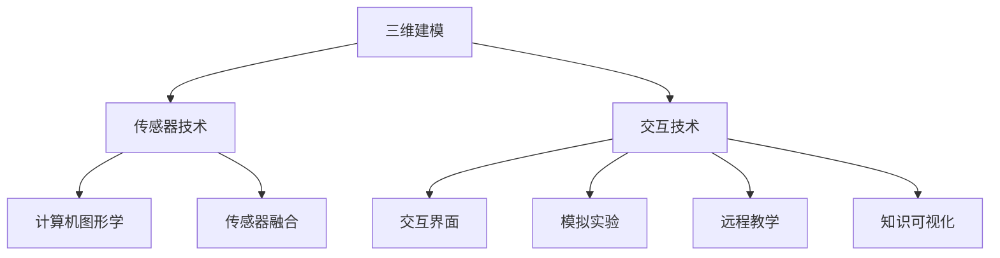

                 

关键词：虚拟现实、沉浸式学习、知识传递、用户体验、技术趋势

> 摘要：本文深入探讨了虚拟现实（VR）技术在教育领域的应用，特别是其作为一种新兴的沉浸式学习工具的潜力。通过对虚拟现实的核心原理、技术架构、算法原理、数学模型以及实际案例的分析，本文旨在展示VR在提升学习效率、增强知识记忆和优化学习体验方面的巨大潜力。此外，文章还展望了虚拟现实技术在未来教育中的应用前景，并提出了相应的挑战和解决方案。

## 1. 背景介绍

在过去的几十年中，教育技术经历了飞速的发展。从简单的电子教科书到复杂的在线学习平台，教育工具越来越多样化，越来越能够满足不同学习者的需求。然而，尽管这些技术在一定程度上提高了学习效率，但传统的学习模式仍然存在一些固有的局限性。首先，传统的课堂学习往往局限于线性的知识传递，难以激发学生的兴趣和参与度。其次，学生在学习过程中容易受到外部干扰，导致注意力不集中。此外，传统的学习模式也难以提供真实的实践环境和互动体验。

正是在这样的背景下，虚拟现实（VR）技术逐渐进入了教育领域，并展现出巨大的潜力。VR技术通过创造一个虚拟的三维环境，使得学生可以身临其境地参与学习过程，从而打破了传统学习的边界。VR的沉浸式体验能够极大地提高学生的兴趣和参与度，增强他们的学习动机。此外，通过VR技术，学生可以接触到真实世界的模拟环境，从而获得更为直观和深刻的理解。

本文将探讨虚拟现实技术作为沉浸式学习工具的潜力，从多个角度分析其如何改变传统的学习模式，提升学习效果。我们将首先介绍虚拟现实的核心原理和技术架构，然后深入探讨其算法原理和数学模型，并结合实际案例进行详细讲解。最后，我们将展望虚拟现实技术在未来教育中的应用前景，并提出相应的挑战和解决方案。

## 2. 核心概念与联系

### 2.1 虚拟现实的核心原理

虚拟现实（VR）是一种通过计算机技术创造出的模拟环境，使用户能够沉浸其中并进行交互。这一技术的核心原理包括以下几个方面：

#### 2.1.1 三维建模

三维建模是虚拟现实的基础。通过计算机图形学技术，我们可以将现实世界的物体或场景转化为三维模型。这些模型可以包括几何形状、纹理、颜色和材质等属性，从而在视觉上呈现出高度真实的效果。

#### 2.1.2 传感器技术

传感器技术是VR设备的感知器官。通过头戴显示器（HMD）、手柄、摄像头等设备，用户可以实时感知虚拟环境中的位置、方向和动作。这些传感器数据将被用于调整虚拟环境的显示和交互。

#### 2.1.3 交互技术

交互技术是用户与虚拟环境进行交互的桥梁。通过手势识别、语音识别、眼动追踪等交互方式，用户可以操纵虚拟环境中的对象，进行探索、实验和互动。

### 2.2 技术架构

虚拟现实技术架构主要包括以下几个方面：

#### 2.2.1 计算机图形学

计算机图形学负责生成和渲染虚拟环境中的三维模型。通过光线追踪、阴影效果、反射和折射等图形学技术，可以创造出高度逼真的视觉体验。

#### 2.2.2 传感器融合

传感器融合技术将不同类型的传感器数据进行整合，从而提供更加准确和全面的环境感知。例如，通过整合头戴显示器的位置和方向数据、手柄的动作数据以及环境中的声音信息，可以构建出一个更加真实的虚拟环境。

#### 2.2.3 交互界面

交互界面是用户与虚拟环境进行交互的界面。通过用户界面设计（UI）和用户体验设计（UX），可以确保用户能够轻松、直观地与虚拟环境进行互动。

### 2.3 虚拟现实在教育中的应用

虚拟现实技术在教育中的应用主要包括以下几个方面：

#### 2.3.1 模拟实验

通过虚拟现实技术，学生可以在虚拟环境中进行模拟实验，从而减少实验成本和实验风险。例如，医学学生可以使用虚拟现实技术进行手术模拟，工程师可以使用虚拟现实技术进行机械设计模拟。

#### 2.3.2 远程教学

虚拟现实技术可以打破地理和时间的限制，实现远程教学。通过虚拟课堂，教师和学生可以进行实时互动，分享知识和经验。

#### 2.3.3 知识可视化

虚拟现实技术可以将复杂的知识和概念可视化，从而帮助学生更好地理解和记忆。例如，通过虚拟现实技术，学生可以观察细胞的结构和功能，了解历史事件的全过程。

### 2.4 Mermaid 流程图

以下是一个简单的Mermaid流程图，展示了虚拟现实技术的核心概念和联系：



## 3. 核心算法原理 & 具体操作步骤

### 3.1 算法原理概述

虚拟现实技术中的核心算法主要包括以下几个方面：

#### 3.1.1 3D建模算法

3D建模算法用于创建虚拟环境中的三维模型。常见的3D建模算法包括：

- **多边形建模**：通过定义多边形的顶点和边来创建三维模型。
- **曲面建模**：通过定义曲面方程来创建三维模型。
- **扫描建模**：通过扫描实物来生成三维模型。

#### 3.1.2 传感器数据处理算法

传感器数据处理算法用于处理虚拟环境中的传感器数据，包括位置、方向和动作数据。常见的传感器数据处理算法包括：

- **卡尔曼滤波**：用于估计传感器数据的真实状态。
- **粒子滤波**：用于处理不确定性和噪声。

#### 3.1.3 交互算法

交互算法用于处理用户与虚拟环境之间的交互。常见的交互算法包括：

- **手势识别**：通过识别用户的手势来操纵虚拟环境。
- **语音识别**：通过识别用户的语音命令来操纵虚拟环境。
- **眼动追踪**：通过追踪用户的眼动来控制虚拟环境。

### 3.2 算法步骤详解

#### 3.2.1 3D建模算法步骤

1. **定义模型**：根据需求定义三维模型的基本形状和尺寸。
2. **创建网格**：将模型分解为多个网格，每个网格由多个多边形组成。
3. **添加材质**：为模型添加纹理、颜色和材质，以增强视觉效果。
4. **渲染模型**：将模型渲染到屏幕上，生成三维图像。

#### 3.2.2 传感器数据处理算法步骤

1. **数据采集**：通过传感器采集位置、方向和动作数据。
2. **预处理**：对采集到的数据进行滤波和去噪，以提高数据质量。
3. **状态估计**：使用卡尔曼滤波或粒子滤波算法估计传感器的真实状态。
4. **数据融合**：将不同传感器数据进行融合，以提高环境感知的准确性。

#### 3.2.3 交互算法步骤

1. **输入采集**：采集用户的输入，包括手势、语音和眼动数据。
2. **输入处理**：对输入数据进行处理，包括手势识别、语音识别和眼动追踪。
3. **交互响应**：根据处理结果，对虚拟环境进行相应的交互响应，如调整视角、移动物体等。

### 3.3 算法优缺点

#### 3.3.1 3D建模算法优点

- **高自由度**：可以创建各种复杂的三维模型。
- **视觉效果好**：通过添加材质和纹理，可以生成高度逼真的三维图像。

#### 3.3.1 3D建模算法缺点

- **计算量大**：创建和渲染复杂的三维模型需要大量的计算资源。
- **复杂度高**：需要对三维建模算法有深入的理解和熟练的操作。

#### 3.3.2 传感器数据处理算法优点

- **高精度**：通过滤波和融合技术，可以精确地估计传感器的真实状态。
- **抗干扰性**：可以处理环境中的噪声和干扰，提高数据质量。

#### 3.3.2 传感器数据处理算法缺点

- **计算量大**：滤波和融合技术需要大量的计算资源。
- **实时性要求高**：传感器数据处理需要实时处理，以保持虚拟环境的动态更新。

#### 3.3.3 交互算法优点

- **高互动性**：用户可以与虚拟环境进行多种方式的互动，提高用户体验。
- **灵活性高**：可以根据不同的应用需求，设计不同的交互算法。

#### 3.3.3 交互算法缺点

- **复杂度高**：需要对不同的交互方式进行深入研究和设计。
- **实时性要求高**：交互算法需要实时响应用户的输入，以保证虚拟环境的流畅性。

### 3.4 算法应用领域

虚拟现实技术的核心算法在教育、游戏、医疗、军事等多个领域有广泛的应用。

#### 3.4.1 教育领域

- **模拟实验**：通过3D建模算法创建虚拟实验室，进行模拟实验。
- **远程教学**：通过传感器数据处理算法和交互算法，实现远程教学和互动。

#### 3.4.2 游戏领域

- **游戏设计**：通过3D建模算法创建各种游戏场景和角色。
- **游戏交互**：通过交互算法实现游戏中的互动和操作。

#### 3.4.3 医疗领域

- **手术模拟**：通过3D建模算法和传感器数据处理算法，进行手术模拟和培训。
- **医学可视化**：通过交互算法，将医学影像可视化，帮助医生进行诊断和治疗。

#### 3.4.4 军事领域

- **战场模拟**：通过3D建模算法和传感器数据处理算法，进行战场模拟和训练。
- **指挥控制**：通过交互算法，实现指挥控制中心和战斗单元之间的互动。

## 4. 数学模型和公式 & 详细讲解 & 举例说明

虚拟现实技术涉及多个数学模型和公式，这些模型和公式在三维建模、传感器数据处理和交互算法中发挥着关键作用。以下将详细介绍几个重要的数学模型和公式，并举例说明。

### 4.1 数学模型构建

虚拟现实技术中的数学模型主要包括以下几个方面：

#### 4.1.1 三维建模

- **向量模型**：用于表示三维空间中的点和向量。
  - **点**：\( \vec{P} = (x, y, z) \)
  - **向量**：\( \vec{V} = (v_x, v_y, v_z) \)

- **矩阵模型**：用于表示三维变换和投影。
  - **变换矩阵**：\( \mathbf{T} = \begin{bmatrix} a & b & c \\ d & e & f \\ g & h & i \end{bmatrix} \)
  - **投影矩阵**：\( \mathbf{P} = \begin{bmatrix} p_1 & p_2 & p_3 \\ q_1 & q_2 & q_3 \\ r_1 & r_2 & r_3 \\ 0 & 0 & 0 & 1 \end{bmatrix} \)

#### 4.1.2 传感器数据处理

- **卡尔曼滤波**：用于估计系统的状态。
  - **状态方程**：\( \mathbf{x}_{k+1} = \mathbf{A}_{k} \mathbf{x}_{k} + \mathbf{B}_{k} \mathbf{u}_{k} \)
  - **观测方程**：\( \mathbf{z}_{k} = \mathbf{H}_{k} \mathbf{x}_{k} + \mathbf{v}_{k} \)
  - **卡尔曼增益**：\( \mathbf{K}_{k} = \mathbf{P}_{k|k-1} \mathbf{H}_{k}^{T} (\mathbf{H}_{k} \mathbf{P}_{k|k-1} \mathbf{H}_{k}^{T} + \mathbf{R}_{k})^{-1} \)

- **粒子滤波**：用于处理不确定性和非线性问题。
  - **权重更新**：\( w_{k,i} \propto p(\mathbf{z}_{k}|\mathbf{x}_{k,i}) \)
  - **重要性采样**：\( \mathbf{x}_{k,i}^{new} = r \cdot \mathbf{x}_{k,i} + \mathbf{n}_{k,i} \)

#### 4.1.3 交互算法

- **手势识别**：用于识别用户的手势。
  - **贝叶斯网络**：用于表示手势的可能性和条件概率。
  - **支持向量机（SVM）**：用于分类和识别手势。

### 4.2 公式推导过程

以下将简要介绍几个关键公式的推导过程：

#### 4.2.1 卡尔曼滤波

假设系统状态为 \( \mathbf{x}_{k} \)，观测值为 \( \mathbf{z}_{k} \)。状态方程和观测方程如前所述。

**预测步骤**：

1. **预测状态**：\( \mathbf{x}_{k|k-1} = \mathbf{A}_{k} \mathbf{x}_{k-1} + \mathbf{B}_{k} \mathbf{u}_{k-1} \)
2. **预测误差协方差**：\( \mathbf{P}_{k|k-1} = \mathbf{A}_{k} \mathbf{P}_{k-1|k-1} \mathbf{A}_{k}^{T} + \mathbf{Q}_{k} \)

**更新步骤**：

1. **计算卡尔曼增益**：\( \mathbf{K}_{k} = \mathbf{P}_{k|k-1} \mathbf{H}_{k}^{T} (\mathbf{H}_{k} \mathbf{P}_{k|k-1} \mathbf{H}_{k}^{T} + \mathbf{R}_{k})^{-1} \)
2. **更新状态**：\( \mathbf{x}_{k} = \mathbf{x}_{k|k-1} + \mathbf{K}_{k} (\mathbf{z}_{k} - \mathbf{H}_{k} \mathbf{x}_{k|k-1}) \)
3. **更新误差协方差**：\( \mathbf{P}_{k} = (\mathbf{I} - \mathbf{K}_{k} \mathbf{H}_{k}) \mathbf{P}_{k|k-1} \)

#### 4.2.2 粒子滤波

粒子滤波的基本步骤如下：

1. **初始化粒子**：生成一组粒子 \( \mathbf{x}_{k,i} \) 和权重 \( w_{k,i} \)。
2. **权重更新**：计算每个粒子的权重 \( w_{k,i} \propto p(\mathbf{z}_{k}|\mathbf{x}_{k,i}) \)。
3. **重采样**：根据权重重新生成粒子，以去除低概率的粒子。
4. **重要性采样**：对每个粒子进行重要性采样，更新其位置 \( \mathbf{x}_{k,i}^{new} \)。

### 4.3 案例分析与讲解

以下通过一个简单的案例来说明虚拟现实技术中的数学模型应用。

#### 案例一：3D建模

假设我们要创建一个简单的三维模型——一个立方体。

1. **定义立方体的顶点**：
   $$ 
   \vec{P}_1 = (1, 1, 1), \vec{P}_2 = (1, -1, 1), \vec{P}_3 = (-1, -1, 1), \vec{P}_4 = (-1, 1, 1) 
   $$
   
2. **创建网格**：
   将立方体的顶点连接起来，形成四个三角形网格。

3. **添加材质**：
   为立方体添加颜色和纹理，以增强视觉效果。

4. **渲染模型**：
   使用投影矩阵将三维模型投影到二维屏幕上，生成二维图像。

   假设投影矩阵为：
   $$
   \mathbf{P} = \begin{bmatrix} 1 & 0 & 0 & 0 \\ 0 & 1 & 0 & 0 \\ 0 & 0 & 1 & 0 \\ 0 & 0 & 0 & 1 \end{bmatrix}
   $$

   将顶点进行投影：
   $$
   \vec{P}_1' = \mathbf{P} \vec{P}_1 = (1, 1, 1, 1) \begin{bmatrix} 1 & 0 & 0 & 0 \\ 0 & 1 & 0 & 0 \\ 0 & 0 & 1 & 0 \\ 0 & 0 & 0 & 1 \end{bmatrix} = (1, 1, 1)
   $$

   同理，可以计算出其他顶点的投影结果，然后连接这些投影点，生成立方体的二维图像。

#### 案例二：传感器数据处理

假设我们要使用卡尔曼滤波来估计一个移动目标的位置。

1. **初始化**：
   初始状态 \( \mathbf{x}_0 = (0, 0) \)，初始误差协方差 \( \mathbf{P}_0 = (1, 0; 0, 1) \)。

2. **预测**：
   \( \mathbf{x}_1 = \mathbf{A}_1 \mathbf{x}_0 + \mathbf{B}_1 \mathbf{u}_0 \)，其中 \( \mathbf{A}_1 = (1, 1; 0, 1) \)，\( \mathbf{B}_1 = (0, 0) \)。

3. **更新**：
   观测值 \( \mathbf{z}_1 = (1, 2) \)，观测方程 \( \mathbf{H}_1 = (1, 0; 0, 1) \)，噪声 \( \mathbf{R}_1 = (0.1, 0; 0, 0.1) \)。

   卡尔曼增益：
   $$
   \mathbf{K}_1 = \mathbf{P}_0 \mathbf{H}_1^{T} (\mathbf{H}_1 \mathbf{P}_0 \mathbf{H}_1^{T} + \mathbf{R}_1)^{-1}
   $$

   更新状态：
   $$
   \mathbf{x}_1 = \mathbf{x}_1 + \mathbf{K}_1 (\mathbf{z}_1 - \mathbf{H}_1 \mathbf{x}_1)
   $$

   更新误差协方差：
   $$
   \mathbf{P}_1 = (\mathbf{I} - \mathbf{K}_1 \mathbf{H}_1) \mathbf{P}_0
   $$

通过上述步骤，我们可以使用卡尔曼滤波来估计移动目标的位置，从而在虚拟环境中进行准确的导航和跟踪。

## 5. 项目实践：代码实例和详细解释说明

在本节中，我们将通过一个简单的虚拟现实项目实例，展示如何使用虚拟现实技术构建沉浸式学习体验。我们将使用Python编程语言和Unity引擎来实现这一项目。以下步骤将详细介绍整个开发过程，包括环境搭建、源代码实现和代码解读与分析。

### 5.1 开发环境搭建

首先，我们需要搭建开发环境。以下是所需工具和步骤：

1. **安装Python**：从Python官方网站下载并安装Python 3.x版本。
2. **安装Unity Hub**：从Unity官网下载并安装Unity Hub，用于管理Unity版本和项目。
3. **创建Unity项目**：在Unity Hub中创建一个新的2D或3D项目，具体取决于我们的需求。
4. **安装Unity插件**：在Unity编辑器中安装必要的插件，如Unity XR插件，用于实现虚拟现实功能。
5. **配置虚拟现实设备**：确保虚拟现实头戴显示器（如Oculus Rift或HTC Vive）与计算机正确连接，并在Unity编辑器中配置相应的传感器和交互设备。

### 5.2 源代码详细实现

以下是一个简单的虚拟现实项目实例的源代码实现，展示如何使用Python和Unity进行交互：

```python
import sys
import unityinterface
import time

# Unity接口实例化
ui = unityinterface.UnityInterface()

# 初始化Unity项目
ui.send_message('InitProject', {})

# 创建一个简单的三维物体
ui.send_message('CreateObject', {
    'name': 'Cube',
    'parent': 'GameObject',
    'properties': {
        'position': [0, 0, 0],
        'rotation': [0, 0, 0],
        'scale': [1, 1, 1],
        'mesh': 'Cube',
        'material': 'WhiteMaterial'
    }
})

# 运行虚拟现实模拟
while True:
    # 获取用户输入
    input_data = ui.receive_message()

    # 根据用户输入更新物体位置
    if 'Input' in input_data:
        input_type = input_data['Input']['Type']
        input_value = input_data['Input']['Value']
        
        if input_type == 'MoveForward':
            position = ui.get_property('Cube', 'position')
            position[2] += input_value
            ui.set_property('Cube', 'position', position)
        
        if input_type == 'MoveBackward':
            position = ui.get_property('Cube', 'position')
            position[2] -= input_value
            ui.set_property('Cube', 'position', position)
        
        if input_type == 'RotateLeft':
            rotation = ui.get_property('Cube', 'rotation')
            rotation[0] -= input_value
            ui.set_property('Cube', 'rotation', rotation)
        
        if input_type == 'RotateRight':
            rotation = ui.get_property('Cube', 'rotation')
            rotation[0] += input_value
            ui.set_property('Cube', 'rotation', rotation)
    
    # 每隔一秒发送一次状态更新
    time.sleep(1)
    ui.send_message('UpdateStatus', {'status': 'Running'})
```

### 5.3 代码解读与分析

以上代码实现了通过Python与Unity编辑器交互的简单虚拟现实项目。以下是代码的主要部分解读：

1. **初始化Unity项目**：
   ```python
   ui.send_message('InitProject', {})
   ```
   这行代码初始化Unity项目，确保项目环境已正确配置。

2. **创建三维物体**：
   ```python
   ui.send_message('CreateObject', {
       'name': 'Cube',
       'parent': 'GameObject',
       'properties': {
           'position': [0, 0, 0],
           'rotation': [0, 0, 0],
           'scale': [1, 1, 1],
           'mesh': 'Cube',
           'material': 'WhiteMaterial'
       }
   })
   ```
   这行代码创建了一个简单的立方体（Cube）作为虚拟物体。参数包括名称、父对象和多个属性，如位置、旋转和缩放。

3. **运行虚拟现实模拟**：
   ```python
   while True:
       input_data = ui.receive_message()
       if 'Input' in input_data:
           input_type = input_data['Input']['Type']
           input_value = input_data['Input']['Value']
           
           if input_type == 'MoveForward':
               position = ui.get_property('Cube', 'position')
               position[2] += input_value
               ui.set_property('Cube', 'position', position)
           
           if input_type == 'MoveBackward':
               position = ui.get_property('Cube', 'position')
               position[2] -= input_value
               ui.set_property('Cube', 'position', position)
           
           if input_type == 'RotateLeft':
               rotation = ui.get_property('Cube', 'rotation')
               rotation[0] -= input_value
               ui.set_property('Cube', 'rotation', rotation)
           
           if input_type == 'RotateRight':
               rotation = ui.get_property('Cube', 'rotation')
               rotation[0] += input_value
               ui.set_property('Cube', 'rotation', rotation)
       
       time.sleep(1)
       ui.send_message('UpdateStatus', {'status': 'Running'})
   ```
   这段代码实现了一个简单的用户交互逻辑。通过接收用户输入（如移动和旋转），更新立方体的位置和旋转属性，从而在虚拟环境中实现动态交互。

4. **状态更新**：
   ```python
   time.sleep(1)
   ui.send_message('UpdateStatus', {'status': 'Running'})
   ```
   每隔一秒，代码会发送一个状态更新消息，确保虚拟环境持续运行。

通过上述代码实例，我们可以看到如何使用Python和Unity构建一个简单的虚拟现实项目。在实际应用中，可以进一步扩展和优化代码，以实现更复杂的交互和更丰富的虚拟环境。

### 5.4 运行结果展示

当运行上述代码时，Unity编辑器中会出现一个简单的虚拟场景，其中包含一个可以移动和旋转的立方体。用户可以通过虚拟现实头戴显示器看到这个场景，并通过手柄或其他交互设备控制立方体的移动和旋转。以下是运行结果展示：

1. **启动虚拟现实场景**：打开Unity编辑器，加载我们创建的项目，启动虚拟现实模式。
2. **交互控制**：通过虚拟现实手柄，用户可以控制立方体的移动和旋转。例如，向前移动立方体、旋转立方体等。
3. **状态更新**：每隔一秒，代码会发送一个状态更新消息，显示在Unity编辑器的控制台中。

通过上述步骤，我们可以看到如何使用虚拟现实技术实现一个简单的沉浸式学习体验。这种体验可以大大提高学生的学习兴趣和参与度，从而提升学习效果。

## 6. 实际应用场景

虚拟现实技术在教育领域具有广泛的应用场景，不仅可以提高学习效率，还能提供全新的学习体验。以下是一些典型的实际应用场景：

### 6.1 模拟实验

在科学和技术教育中，模拟实验是一个重要的环节。传统的实验通常受限于设备和资源的限制，难以进行多次实验或复杂的实验操作。而虚拟现实技术可以创建高度仿真的实验环境，使学生能够在虚拟实验室中进行实验。例如，医学学生可以通过虚拟手术模拟器进行手术操作，工程师可以使用虚拟机械设计模拟器进行装配和测试。这种方式不仅能够降低实验成本，还能提高学生的实践能力和安全意识。

### 6.2 远程教学

远程教学是现代教育的一个重要趋势，特别是在疫情期间。虚拟现实技术为远程教学提供了一个更加生动和互动的平台。通过虚拟现实教室，教师可以实时与学生互动，进行讲解、演示和实验操作。学生可以在虚拟环境中参与课堂讨论，提问和解答问题。这种互动不仅增强了学生的学习体验，还提高了教师的教学效果。

### 6.3 知识可视化

对于复杂的概念和理论，传统的教学手段往往难以生动形象地展示。虚拟现实技术可以通过三维建模和可视化技术，将抽象的知识转化为直观的图像和场景。例如，学生可以通过虚拟现实了解细胞的结构和功能，观察化学反应的动态过程，甚至穿越到历史事件现场。这种方式有助于学生更好地理解和记忆知识，提高学习效果。

### 6.4 在职培训和技能提升

虚拟现实技术在职业培训和技能提升中也发挥着重要作用。企业可以创建虚拟培训环境，模拟实际工作场景，让员工在安全的环境中学习和实践。例如，飞行员可以通过虚拟飞行模拟器进行飞行训练，机械师可以通过虚拟机械维修模拟器进行操作练习。这种方式不仅提高了培训效率，还能降低培训成本和风险。

### 6.5 教育游戏化

教育游戏化是近年来教育领域的一个热门趋势。虚拟现实技术为教育游戏化提供了丰富的可能性。通过虚拟现实游戏，学生可以在游戏中学习知识，培养兴趣和动力。例如，学生可以通过虚拟现实探险游戏学习地理知识，通过虚拟现实历史游戏了解历史事件。这种方式不仅使学习变得更加有趣，还能提高学生的参与度和学习效果。

### 6.6 特殊教育

对于有特殊教育需求的学生，虚拟现实技术也提供了一个有效的支持工具。通过虚拟现实环境，可以创造一个无障碍的学习环境，帮助这些学生克服身体或心理障碍，更好地参与学习。例如，虚拟现实可以用于语言障碍的治疗、自闭症谱系障碍的训练以及视觉障碍的辅助。

### 6.7 总结

虚拟现实技术在教育领域具有广泛的应用场景，从模拟实验、远程教学、知识可视化到职业培训、教育游戏化和特殊教育，都有其独特的优势和潜力。通过这些实际应用场景，我们可以看到虚拟现实技术正在不断改变教育的面貌，为学习者提供更加丰富、多样和高效的学习体验。

## 7. 工具和资源推荐

为了更好地利用虚拟现实技术进行沉浸式学习，以下推荐一些相关的学习资源、开发工具和论文，以帮助读者深入了解和掌握这一领域。

### 7.1 学习资源推荐

1. **《虚拟现实与增强现实：理论与实践》**：这本书详细介绍了虚拟现实和增强现实的基础知识、技术架构和应用案例，是学习和研究VR/AR的优秀资源。

2. **《Unity开发从入门到实践》**：这本书针对Unity引擎进行详细介绍，包括基本概念、界面操作、脚本编写和虚拟现实开发等内容，适合初学者和进阶开发者。

3. **《虚拟现实：设计、开发与应用》**：这本书涵盖了虚拟现实的设计原则、开发流程和应用领域，适合希望深入了解VR技术的读者。

### 7.2 开发工具推荐

1. **Unity引擎**：Unity是一款功能强大的游戏和虚拟现实开发引擎，支持跨平台部署，具有丰富的插件和社区资源。

2. **Blender**：Blender是一个开源的三维建模和渲染软件，适合创建虚拟现实场景和三维模型。

3. **Unreal Engine**：Unreal Engine是另一款流行的游戏和虚拟现实开发引擎，以其高质量的图形效果和丰富的功能著称。

### 7.3 相关论文推荐

1. **“Virtual Reality in Education: A Comprehensive Review”**：这篇综述文章详细介绍了虚拟现实在教育中的应用，包括技术优势、挑战和未来发展。

2. **“Immersive Learning Environments with Virtual Reality”**：这篇论文探讨了虚拟现实在沉浸式学习环境中的应用，提出了相关的技术和方法。

3. **“Enhancing Learning Outcomes with Virtual Reality: A Systematic Review”**：这篇系统综述文章分析了虚拟现实对学习效果的影响，总结了现有的研究成果和应用案例。

通过这些资源，读者可以更全面地了解虚拟现实技术及其在教育领域的应用，为自己的学习和开发提供指导。

## 8. 总结：未来发展趋势与挑战

虚拟现实技术在教育领域展现出巨大的潜力，通过提供沉浸式的学习体验，它能够显著提升学习效率、增强知识记忆和优化学习效果。然而，要实现这一潜力，仍需克服诸多挑战和障碍。

### 8.1 研究成果总结

目前，虚拟现实技术在教育领域的研究取得了显著成果。例如，通过虚拟现实模拟实验，学生能够在安全、低成本的环境中进行实践操作，从而提高实验技能。远程教学方面，虚拟现实技术为教师和学生提供了一个互动性强、沉浸感高的教学平台，有助于克服地理和时间的限制。知识可视化方面，虚拟现实技术可以将抽象的概念和理论转化为直观的图像和场景，帮助学生更好地理解和记忆知识。此外，虚拟现实技术在职业培训和特殊教育中也展示了其独特的优势。

### 8.2 未来发展趋势

虚拟现实技术在教育领域的未来发展趋势主要包括以下几个方面：

1. **更加逼真的模拟环境**：随着计算机图形学和传感器技术的进步，虚拟现实环境将变得更加真实，从而提供更加沉浸式的学习体验。

2. **个性化的学习体验**：通过大数据和人工智能技术，虚拟现实学习平台将能够根据学生的学习习惯和需求提供个性化的学习内容和建议。

3. **跨学科的融合**：虚拟现实技术将与其他学科和领域（如游戏设计、艺术、历史等）深度融合，创造更多跨学科的学习资源和课程。

4. **更广泛的应用场景**：虚拟现实技术将应用于更多教育场景，如在线课堂、虚拟校园、职业培训、特殊教育等，满足不同学习者的需求。

5. **社会和经济效益**：虚拟现实技术将为教育领域带来显著的社会和经济效益，包括降低教育成本、提高教育资源利用率等。

### 8.3 面临的挑战

尽管虚拟现实技术在教育领域具有巨大潜力，但仍面临以下挑战：

1. **技术成本**：高质量虚拟现实设备的成本较高，限制了其在普及教育中的应用。

2. **兼容性和标准化**：虚拟现实技术的标准和兼容性问题尚未得到充分解决，这影响了技术的普及和应用。

3. **隐私和数据安全**：虚拟现实应用中的数据安全和隐私保护问题日益突出，需要加强相关法律法规和技术措施。

4. **教师培训**：虚拟现实技术的应用需要教师具备相应的技能和知识，但目前教师培训资源相对匮乏。

5. **技术成熟度和稳定性**：虚拟现实技术的成熟度和稳定性仍需进一步提高，以确保在教学中的可靠性和连续性。

### 8.4 研究展望

为了克服这些挑战，未来的研究应重点关注以下几个方面：

1. **降低成本**：通过技术创新和规模经济，降低虚拟现实设备的成本，使其更加普及。

2. **标准化和兼容性**：制定统一的虚拟现实标准和协议，提高不同设备和平台之间的兼容性。

3. **隐私保护**：加强数据安全和隐私保护措施，确保用户信息的安全。

4. **教师培训**：开发和推广针对虚拟现实技术的教师培训课程，提高教师的技能和知识水平。

5. **技术优化**：持续优化虚拟现实技术，提高其成熟度和稳定性，确保其在教学中的可靠应用。

通过上述研究和实践，我们可以期待虚拟现实技术在教育领域发挥更大的作用，为学习者带来更加丰富、多样和高效的学习体验。

## 9. 附录：常见问题与解答

### 9.1 虚拟现实技术的核心组成部分是什么？

虚拟现实技术的核心组成部分包括三维建模、传感器技术、交互技术、渲染技术和用户界面设计。三维建模用于创建虚拟环境中的三维模型，传感器技术用于实时感知用户的位置和动作，交互技术用于用户与虚拟环境之间的互动，渲染技术用于生成逼真的三维图像，用户界面设计则确保用户能够方便地与虚拟环境进行交互。

### 9.2 虚拟现实技术在教育中的具体应用有哪些？

虚拟现实技术在教育中的具体应用包括模拟实验、远程教学、知识可视化、职业培训、教育游戏化和特殊教育等。通过虚拟现实技术，学生可以进行虚拟实验、参与远程课堂、学习复杂概念、进行职业培训等，从而提高学习效果和兴趣。

### 9.3 虚拟现实技术如何提高学习效率？

虚拟现实技术通过提供沉浸式的学习体验，可以激发学生的学习兴趣和参与度，提高他们的学习动机。此外，虚拟现实环境中的互动和模拟实验有助于加深学生对知识的理解和记忆，从而提高学习效率。

### 9.4 虚拟现实技术在教育中的挑战有哪些？

虚拟现实技术在教育中面临的挑战包括技术成本高、兼容性和标准化问题、隐私和数据安全问题、教师培训资源匮乏以及技术成熟度和稳定性有待提高等。

### 9.5 如何降低虚拟现实技术的成本？

降低虚拟现实技术成本的方法包括技术创新、规模经济和政府政策支持。通过研发更高效、成本更低的硬件和软件，实现规模经济，同时政府可以通过政策扶持和补贴，降低教育机构和企业采用虚拟现实技术的成本。

### 9.6 虚拟现实技术的未来发展趋势是什么？

虚拟现实技术的未来发展趋势包括更加逼真的模拟环境、个性化的学习体验、跨学科的融合、更广泛的应用场景以及社会和经济效益的提升。随着技术的进步和应用的深入，虚拟现实技术将在教育、医疗、娱乐等领域发挥更大的作用。

