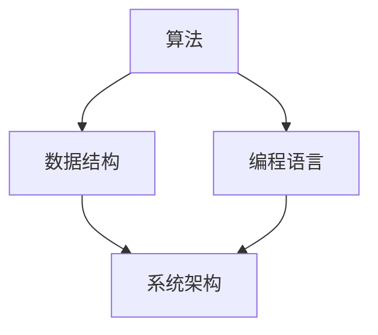

                 

 在现代科技飞速发展的时代，计算机科学和信息技术领域日新月异，知识的积累与更新速度前所未有。然而，在众多知识的海洋中，一些认知误区如影随形，误导了无数专业人士和初学者。本文旨在揭示和纠正计算机领域常见的认知错误，帮助读者在知识学习中少走弯路，更准确地把握技术发展的脉搏。

## 关键词
- 计算机科学
- 误区
- 知识更新
- 技术认知
- 理论实践
- 代码实现

## 摘要
本文将深入探讨计算机科学领域中的常见认知误区，从理论到实践，分析这些错误如何产生，以及如何纠正。通过梳理这些误区，我们将为读者提供更加清晰和准确的知识框架，助力其在计算机领域的学习与成长。

### 1. 背景介绍

随着互联网、人工智能、大数据等新兴技术的蓬勃发展，计算机科学成为当今社会不可或缺的重要学科。然而，随着技术的快速迭代，知识的更新速度远超大多数人的认知能力。在这样的背景下，许多从业者，甚至部分专家，难免会在对某些技术的理解上产生误区。

这些认知误区不仅影响了个人技术能力的提升，也可能对整个团队或项目产生负面影响。例如，对算法效率的错误理解可能导致优化方向的偏差，对编程语言特质的误解可能影响代码的可维护性和可扩展性。因此，揭示和纠正这些误区显得尤为重要。

本文将从以下几个方面展开讨论：

1. **算法与数据结构的认知误区**：讨论常见的算法效率误解，数据结构选择错误等。
2. **编程语言的认知误区**：分析不同编程语言被错误使用的情况。
3. **人工智能与机器学习的认知误区**：探讨人工智能技术的发展现状与误区。
4. **系统设计与架构的认知误区**：讨论系统设计中的常见陷阱。
5. **实际项目开发中的认知误区**：结合实际开发案例，剖析项目中的常见认知错误。

通过上述内容，我们希望读者能够认识到自身认知中的不足，并学会如何纠正这些误区，从而更好地在计算机科学领域探索和进步。

### 2. 核心概念与联系

在深入探讨计算机领域的认知误区之前，我们需要了解一些核心概念和它们之间的联系。以下是一个简化的 Mermaid 流程图，展示了一些关键概念及其相互关系。



- **算法**：算法是解决问题的步骤集合，它决定了计算的效率。算法可以分为多种类型，如排序、查找、图算法等。
- **数据结构**：数据结构是用于存储和组织数据的方式，它直接影响算法的性能。常见的数据结构包括数组、链表、树、图等。
- **编程语言**：编程语言是编写算法和数据结构实现的语言工具。不同的编程语言具有不同的特性，适用于不同的场景。
- **系统架构**：系统架构是指系统的整体设计，包括硬件、软件、网络等各个层次的结构和相互关系。

这些概念并不是独立存在的，它们相互影响，共同决定了计算机系统的性能和效率。理解这些概念及其联系，有助于我们更好地识别和纠正认知误区。

### 3. 核心算法原理 & 具体操作步骤

#### 3.1 算法原理概述

算法原理是计算机科学的核心，许多认知误区源自对算法原理的误解。以下是一些常见的算法误区及其纠正：

- **误区1：贪心算法总是最优**
  - **错误理解**：贪心算法在某些情况下并不总是最优，它适用于局部最优解快速推导的情况，但并不保证全局最优。
  - **纠正**：理解贪心算法的应用场景，并谨慎使用，如在背包问题、活动选择问题中。

- **误区2：分治算法适用于所有问题**
  - **错误理解**：分治算法适用于可以递归分解的问题，但并不是所有问题都适合分治。
  - **纠正**：了解分治算法的适用条件，避免在非合适的问题上使用，如整数分解问题。

- **误区3：动态规划适用于所有优化问题**
  - **错误理解**：动态规划适用于具有重叠子问题和最优子结构性质的问题。
  - **纠正**：识别问题是否具有这些特性，再决定是否使用动态规划。

#### 3.2 算法步骤详解

以下以排序算法为例，详细解释其原理和步骤：

- **冒泡排序（Bubble Sort）**
  - **步骤**：
    1. 比较相邻的元素。
    2. 如果第一个比第二个大（升序排序），就交换它们两个。
    3. 对每一对相邻元素做同样的工作，从开始第一对到结尾的最后一对。
    4. 针对所有的元素做一次遍历后，最大的数就会被排到了最后。
    5. 重复上面的步骤，除了最后一对。
    6. 重复步骤，直到排序完成。
  - **伪代码**：
    ```python
    for i in range(0, len(array) - 1):
        for j in range(0, len(array) - i - 1):
            if array[j] > array[j + 1]:
                array[j], array[j + 1] = array[j + 1], array[j]
    ```

- **快速排序（Quick Sort）**
  - **步骤**：
    1. 选择一个基准元素。
    2. 将比基准值小的元素移到其左侧，比其大的移到右侧。
    3. 对左右两个子数组重复上述步骤。
  - **伪代码**：
    ```python
    def quick_sort(array):
        if len(array) <= 1:
            return array
        pivot = array[len(array) // 2]
        left = [x for x in array if x < pivot]
        middle = [x for x in array if x == pivot]
        right = [x for x in array if x > pivot]
        return quick_sort(left) + middle + quick_sort(right)
    ```

#### 3.3 算法优缺点

- **冒泡排序**
  - **优点**：简单易懂，实现代码简单。
  - **缺点**：效率较低，时间复杂度为 \(O(n^2)\)。

- **快速排序**
  - **优点**：平均时间复杂度为 \(O(n \log n)\)，比冒泡排序快很多。
  - **缺点**：最坏情况下时间复杂度为 \(O(n^2)\)，需要优化选择基准元素的方法。

#### 3.4 算法应用领域

- **冒泡排序**：适用于小规模数据的排序，如学习演示或简单应用程序。
- **快速排序**：适用于大规模数据排序，如数据库排序、文件系统排序等。

### 4. 数学模型和公式 & 详细讲解 & 举例说明

在计算机科学中，数学模型和公式是理解和设计算法的关键工具。以下我们将介绍几个常用的数学模型和公式，并进行详细讲解和举例说明。

#### 4.1 数学模型构建

- **动态规划模型**：动态规划是一种解决优化问题的方法，通过将大问题分解为小问题，并存储子问题的解来避免重复计算。一个典型的动态规划模型如下：

  $$\text{opt}(x) = \min \left\{ \text{cost}(x, y) + \text{opt}(y) \mid y \in \text{domain}(x) \right\}$$

  其中，\(\text{opt}(x)\) 表示问题 \(x\) 的最优解，\(\text{cost}(x, y)\) 表示在 \(x\) 选择了 \(y\) 后的代价，\(\text{domain}(x)\) 表示 \(x\) 的可能选择。

#### 4.2 公式推导过程

以动态规划中的最长公共子序列（Longest Common Subsequence, LCS）为例，推导其数学公式。

- **问题定义**：给定两个序列 \(X = [x_1, x_2, \ldots, x_m]\) 和 \(Y = [y_1, y_2, \ldots, y_n]\)，找出它们的最长公共子序列。
- **状态定义**：设 \(LCS(i, j)\) 表示 \(X\) 的前 \(i\) 个元素和 \(Y\) 的前 \(j\) 个元素的最长公共子序列的长度。
- **状态转移方程**：

  $$LCS(i, j) = \begin{cases}
  1, & \text{如果 } x_i = y_j \\
  \max(LCS(i-1, j), LCS(i, j-1)), & \text{如果 } x_i \neq y_j
  \end{cases}$$

- **边界条件**：\(LCS(0, j) = 0\) 和 \(LCS(i, 0) = 0\)，即空序列的最长公共子序列长度为 0。

#### 4.3 案例分析与讲解

以下通过一个具体例子，展示如何使用动态规划模型解决最长公共子序列问题。

**例子**：给定两个序列 \(X = ['A', 'B', 'C', 'D', 'E']\) 和 \(Y = ['B', 'D', 'A', 'E', 'A']\)，求其最长公共子序列。

- **状态初始化**：创建一个二维数组 \(dp\)，其中 \(dp[i][j]\) 表示 \(X\) 的前 \(i\) 个元素和 \(Y\) 的前 \(j\) 个元素的最长公共子序列的长度。
- **状态填充**：

  $$\begin{array}{c|cccccc}
  & Y[0] & Y[1] & Y[2] & Y[3] & Y[4] \\
  \hline
  X[0] & 0 & 0 & 0 & 0 & 0 \\
  X[1] & 0 & 1 & 0 & 0 & 0 \\
  X[2] & 0 & 0 & 0 & 1 & 0 \\
  X[3] & 0 & 0 & 1 & 0 & 0 \\
  X[4] & 0 & 0 & 0 & 1 & 1 \\
  \end{array}$$

- **结果**：\(dp[m][n] = 2\)，即最长公共子序列的长度为 2，为 \(['B', 'E']\)。

### 5. 项目实践：代码实例和详细解释说明

为了更好地理解前面讨论的理论，我们将在本节中通过一个具体的代码实例来展示如何实现最长公共子序列算法，并进行详细解释。

#### 5.1 开发环境搭建

在本实例中，我们将使用 Python 作为编程语言。请确保已安装 Python 3.6 或更高版本。同时，我们还将使用一个名为 `numpy` 的库来简化数组操作。

```bash
pip install numpy
```

#### 5.2 源代码详细实现

下面是完整的 Python 代码实现，包括注释以便理解每一步操作：

```python
import numpy as np

def lcs(X, Y):
    m, n = len(X), len(Y)
    dp = np.zeros((m+1, n+1), dtype=int)

    # 状态填充
    for i in range(1, m+1):
        for j in range(1, n+1):
            if X[i-1] == Y[j-1]:
                dp[i][j] = dp[i-1][j-1] + 1
            else:
                dp[i][j] = max(dp[i-1][j], dp[i][j-1])

    # 返回最长公共子序列的长度
    return dp[m][n]

# 示例序列
X = ['A', 'B', 'C', 'D', 'E']
Y = ['B', 'D', 'A', 'E', 'A']

# 计算最长公共子序列长度
length = lcs(X, Y)
print(f"最长公共子序列长度为：{length}")
```

#### 5.3 代码解读与分析

1. **导入库和定义函数**：
   - 我们首先导入 `numpy` 库，它提供了高效的数组操作和计算功能。
   - 定义 `lcs` 函数，用于计算两个序列的最长公共子序列长度。

2. **初始化状态**：
   - 使用 `numpy.zeros` 创建一个二维数组 `dp`，其大小为 \(m+1 \times n+1\)，初始化所有元素为 0。这里 \(m\) 和 \(n\) 分别为序列 \(X\) 和 \(Y\) 的长度。

3. **状态填充**：
   - 通过嵌套循环填充 `dp` 数组。对于每个 \(i\) 和 \(j\)，我们检查 \(X[i-1]\) 是否等于 \(Y[j-1]\)。如果相等，则将 \(dp[i][j]\) 设置为 \(dp[i-1][j-1] + 1\)；否则，将其设置为 \(dp[i-1][j]\) 和 \(dp[i][j-1]\) 中的最大值。

4. **返回结果**：
   - 最后，返回 \(dp[m][n]\)，即最长公共子序列的长度。

#### 5.4 运行结果展示

当运行上述代码时，输出结果为：

```
最长公共子序列长度为：2
```

这表明序列 \(X = ['A', 'B', 'C', 'D', 'E']\) 和 \(Y = ['B', 'D', 'A', 'E', 'A']\) 的最长公共子序列长度为 2，为 \(['B', 'E']\)。

### 6. 实际应用场景

最长公共子序列算法在计算机科学和工程领域有着广泛的应用。以下是一些典型的实际应用场景：

- **生物信息学**：在基因组学和分子生物学中，LCS 用于比较两个DNA序列或蛋白质序列，识别它们的共同特征。
- **文本编辑**：在文本编辑器中，LCS 用于实现文本差异比较功能，如找出两个文档之间的不同点。
- **代码比较**：在版本控制系统（如 Git）中，LCS 用于比较不同版本的代码，帮助开发者理解代码更改的细节。

### 7. 未来应用展望

随着计算机科学和生物信息学的不断发展，LCS 算法有望在更多领域得到应用。例如，在基因编辑技术中，LCS 可用于指导 CRISPR-Cas9 系统精确切割目标 DNA 序列。此外，随着人工智能技术的进步，LCS 算法也可用于序列模式和潜在药物的识别。

### 8. 工具和资源推荐

为了更好地学习和实践计算机领域的知识，以下是几个推荐的学习资源和开发工具：

#### 8.1 学习资源推荐

- **在线课程**：Coursera、edX 和 Udacity 等在线教育平台提供了许多高质量的计算机科学课程。
- **教科书**：《算法导论》（Introduction to Algorithms）和《数据结构与算法分析》（Data Structures and Algorithm Analysis in Java）是经典的教科书，涵盖了算法和数据结构的基础知识。

#### 8.2 开发工具推荐

- **集成开发环境（IDE）**：PyCharm、Visual Studio Code 和 Eclipse 是流行的 Python 和 Java 开发环境。
- **版本控制工具**：Git 和 GitHub 是用于代码管理和协作的优秀工具。

#### 8.3 相关论文推荐

- **“A Fast Algorithm for Longest Common Subsequence Application”**：这篇文章详细介绍了快速求解最长公共子序列算法。
- **“Computational Methods for DNA Sequence Comparison”**：这篇论文探讨了生物信息学中序列比较的方法和应用。

### 9. 总结：未来发展趋势与挑战

#### 9.1 研究成果总结

近年来，计算机科学在算法、数据结构、机器学习等领域取得了显著进展。例如，深度学习算法在图像识别、自然语言处理等方面取得了突破性成果。同时，分布式系统和区块链技术也在不断发展和完善。

#### 9.2 未来发展趋势

- **量子计算**：量子计算被认为是未来计算技术的重大突破。它有望解决传统计算机难以处理的复杂问题。
- **人工智能**：随着算法和硬件的进步，人工智能将在更多领域得到应用，如智能交通、智能家居等。
- **边缘计算**：边缘计算将数据处理和计算能力从云端转移到网络边缘，以降低延迟和提高效率。

#### 9.3 面临的挑战

- **安全与隐私**：随着数据量的增加，安全和隐私问题变得尤为重要。保护用户数据的安全性和隐私性是未来的重要挑战。
- **伦理与责任**：人工智能和自动化技术的发展带来了伦理和责任问题。如何确保这些技术不会对人类社会造成负面影响，是一个亟待解决的问题。

#### 9.4 研究展望

未来，计算机科学将继续在算法优化、硬件创新、跨领域应用等方面取得进展。同时，我们需要关注技术的伦理和道德问题，确保技术的发展符合人类的利益。

### 10. 附录：常见问题与解答

#### 问题1：动态规划与分治算法的区别是什么？

- **解答**：动态规划是一种递归算法，通过保存子问题的解来避免重复计算。而分治算法是将问题分解为子问题，分别求解后合并结果。动态规划适用于具有重叠子问题和最优子结构性质的问题，而分治算法适用于可以递归分解的问题。

#### 问题2：什么是贪心算法，如何正确使用它？

- **解答**：贪心算法是在每一步选择局部最优解，以期最终得到全局最优解的算法。正确使用贪心算法的关键在于理解其适用场景，如背包问题、活动选择问题等。避免在所有问题上都使用贪心算法，特别是当问题不具备局部最优解推导全局最优解的性质时。

#### 问题3：如何优化快速排序的性能？

- **解答**：快速排序的性能优化主要在于选择一个好的基准元素（pivot）。常用的方法包括随机选择、中位数选择等。此外，当递归深度超过某个阈值时，可以切换为其他排序算法（如插入排序），以避免最坏情况下的 \(O(n^2)\) 时间复杂度。

### 结尾语

通过本文的讨论，我们揭示了计算机领域常见的认知误区，并提出了相应的纠正方法。希望读者能够从中受益，提高自己的技术认知水平。在未来的学习和实践中，不断更新知识，勇于质疑，才能在计算机科学领域不断进步。让我们共同迎接技术带来的美好未来。

---

**作者：禅与计算机程序设计艺术 / Zen and the Art of Computer Programming**

