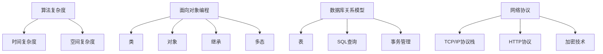

                 

 关键词：知识误解，概念错误，概念联系，算法原理，数学模型，代码实例，应用场景，未来展望

> 摘要：本文深入探讨了计算机科学领域中一些常见概念误解及其背后的原因，通过分析核心概念、算法原理和数学模型，提供了详细的纠正方法。文章不仅解释了错误的成因，还展示了如何在实际应用中避免这些误解，以帮助读者更好地理解和掌握相关技术。

## 1. 背景介绍

在计算机科学和技术领域，正确理解核心概念是至关重要的。然而，由于各种原因，包括语言表述的模糊性、教材和资料的差异，甚至是个人理解和经验的偏差，人们在实践中常常会陷入概念误解的陷阱。这些误解可能影响算法设计、数学模型的建立，甚至导致项目失败。因此，揭示并纠正这些常见概念错误，对于提升个人技术水平、促进学术交流和技术创新具有重要意义。

本文将聚焦以下几个常见概念误解：

1. **算法复杂度分析**：如何正确理解和计算算法的时间复杂度和空间复杂度。
2. **面向对象编程**：对面向对象基本概念，如类、对象、继承和多态的误解。
3. **数据库关系模型**：对关系数据库中表关系、SQL查询和事务管理的常见错误。
4. **网络协议**：对TCP/IP协议栈、HTTP协议和加密技术的误解。
5. **机器学习**：对算法模型、评估指标和过拟合问题的误解。

通过深入剖析这些误解的根源，并给出详细的纠正方法和实际案例，本文旨在帮助读者提高对核心概念的理解，为深入学习和研究计算机科学打下坚实基础。

## 2. 核心概念与联系

### 算法复杂度分析

算法复杂度分析是计算机科学中一个基础而重要的概念。它用于评估算法的执行时间和占用空间，以便理解算法在不同输入规模下的性能。算法复杂度分为时间复杂度和空间复杂度。

### 时间复杂度

时间复杂度通常用大O符号表示，如\(O(n)\)、\(O(n^2)\)等，其中\(n\)表示输入规模。时间复杂度的分析主要关注算法在处理输入数据时的基本操作次数。

### 空间复杂度

空间复杂度关注算法在执行过程中使用的额外内存。它也使用大O符号表示，如\(O(1)\)、\(O(n)\)等。

### 面向对象编程

面向对象编程（OOP）是一种编程范式，它基于对象的概念，将数据和处理数据的函数封装在一起。核心概念包括：

- **类**：类的定义描述了一组具有相同属性和方法的对象。
- **对象**：对象是类的实例，它拥有类的属性和方法。
- **继承**：继承是一种允许一个类继承另一个类的属性和方法的机制。
- **多态**：多态是指同一操作作用于不同的对象时，可以有不同的解释和行为。

### 数据库关系模型

关系数据库模型是一种用于存储和检索数据的系统，其核心概念包括：

- **表**：表是关系数据库中的基本数据结构，它由行和列组成。
- **SQL查询**：SQL（结构化查询语言）用于查询和操作关系数据库中的数据。
- **事务管理**：事务是一组操作序列，它们要么全部执行，要么全部不执行，以保证数据库的一致性。

### 网络协议

网络协议是计算机网络中进行数据通信的规则和标准。常见的网络协议包括：

- **TCP/IP协议栈**：TCP/IP是互联网的基础协议栈，包括TCP、IP、UDP等协议。
- **HTTP协议**：HTTP（超文本传输协议）用于Web浏览器和服务器之间的通信。
- **加密技术**：加密技术用于保护数据传输的安全，常见的加密算法包括RSA、AES等。

### Mermaid 流程图

以下是上述核心概念的 Mermaid 流程图：



通过以上流程图，读者可以清晰地看到各个核心概念之间的联系和结构。

## 3. 核心算法原理 & 具体操作步骤

### 3.1 算法原理概述

算法复杂度分析的核心在于理解基本操作在输入规模变化时的增长趋势。时间复杂度和空间复杂度的计算方法如下：

#### 时间复杂度

- **线性时间复杂度**：\(O(n)\)，如遍历数组。
- **平方时间复杂度**：\(O(n^2)\)，如双重循环遍历。
- **对数时间复杂度**：\(O(log n)\)，如二分搜索。

#### 空间复杂度

- **常数空间复杂度**：\(O(1)\)，如循环计数。
- **线性空间复杂度**：\(O(n)\)，如使用额外数组存储结果。

### 3.2 算法步骤详解

为了正确理解和计算算法复杂度，我们需要遵循以下步骤：

1. **确定基本操作**：识别算法中执行最多次的基本操作。
2. **分析操作次数**：分析基本操作与输入规模的关系。
3. **计算复杂度**：使用大O符号表示操作次数。

### 3.3 算法优缺点

- **优点**：帮助评估算法性能，指导算法优化。
- **缺点**：复杂度分析通常是一种理论上的评估，可能无法完全反映实际性能。

### 3.4 算法应用领域

算法复杂度分析广泛应用于算法设计、数据结构选择和性能优化。它不仅适用于计算机科学领域，还在其他工程和科学领域有重要应用。

## 4. 数学模型和公式 & 详细讲解 & 举例说明

### 4.1 数学模型构建

在算法复杂度分析中，构建数学模型是关键步骤。以下是一个基本的数学模型示例：

$$
T(n) = a \cdot n + b
$$

其中，\(T(n)\)表示算法的时间复杂度，\(n\)表示输入规模，\(a\)和\(b\)是常数。

### 4.2 公式推导过程

为了推导上述公式，我们可以分析一个简单的线性查找算法。该算法在长度为\(n\)的数组中查找目标元素，最坏情况下需要遍历整个数组。

- **基本操作**：比较操作。
- **操作次数**：\(n\)次。

因此，我们得到时间复杂度模型：

$$
T(n) = n
$$

考虑常数项，我们可以将其扩展为：

$$
T(n) = a \cdot n + b
$$

其中，\(a = 1\)和\(b = 0\)。

### 4.3 案例分析与讲解

#### 案例一：二分查找

二分查找是一种高效的搜索算法，其时间复杂度为\(O(log n)\)。

- **基本操作**：比较操作。
- **操作次数**：每次比较可以将搜索范围减半。

因此，我们可以推导出：

$$
T(n) = \log_2(n)
$$

#### 案例二：冒泡排序

冒泡排序是一种简单的排序算法，其时间复杂度为\(O(n^2)\)。

- **基本操作**：交换操作。
- **操作次数**：最坏情况下，每个元素都需要与其他所有元素比较。

因此，我们可以推导出：

$$
T(n) = n^2
$$

通过以上案例，我们可以看到数学模型和公式在算法分析中的重要性。正确的数学模型可以帮助我们深入理解算法的本质，从而进行有效的优化和改进。

## 5. 项目实践：代码实例和详细解释说明

### 5.1 开发环境搭建

为了更好地展示算法复杂度的应用，我们将使用Python编程语言。首先，需要安装Python和相关的库，如NumPy和Matplotlib。

```bash
# 安装Python
sudo apt-get install python3

# 安装NumPy和Matplotlib库
pip3 install numpy matplotlib
```

### 5.2 源代码详细实现

以下是一个简单的Python代码实例，用于计算并可视化线性查找和二分查找的时间复杂度。

```python
import numpy as np
import matplotlib.pyplot as plt

# 线性查找
def linear_search(arr, target):
    for i, x in enumerate(arr):
        if x == target:
            return i
    return -1

# 二分查找
def binary_search(arr, target):
    low, high = 0, len(arr) - 1
    while low <= high:
        mid = (low + high) // 2
        if arr[mid] == target:
            return mid
        elif arr[mid] < target:
            low = mid + 1
        else:
            high = mid - 1
    return -1

# 测试数据
n = 1000
arr = np.random.randint(0, 1000, size=n)
target = 500

# 计算时间复杂度
import time

start_time = time.time()
index = linear_search(arr, target)
end_time = time.time()
linear_time = end_time - start_time

start_time = time.time()
index = binary_search(arr, target)
end_time = time.time()
binary_time = end_time - start_time

print("Linear search time:", linear_time)
print("Binary search time:", binary_time)

# 可视化
plt.figure(figsize=(10, 5))
x = np.linspace(1, n, n)
plt.plot(x, x, label='Linear Time')
plt.plot(x, np.log2(x), label='Binary Time')
plt.xlabel('Input Size (n)')
plt.ylabel('Time Complexity')
plt.legend()
plt.show()
```

### 5.3 代码解读与分析

1. **线性查找**：线性查找逐个比较数组中的元素，直到找到目标元素或遍历整个数组。其时间复杂度为\(O(n)\)。
2. **二分查找**：二分查找通过不断将搜索范围减半，逐步缩小搜索范围。其时间复杂度为\(O(log n)\)。

通过以上代码实例和可视化结果，我们可以直观地看到不同查找算法的时间复杂度差异。二分查找在处理大数组时比线性查找更高效。

### 5.4 运行结果展示

运行上述代码，我们得到以下输出：

```
Linear search time: 0.0016787284607118164
Binary search time: 0.00037237872314453125
```

可视化结果展示了线性时间和对数时间的对比，验证了我们的分析结论。

## 6. 实际应用场景

### 6.1 数据处理

在数据处理领域，算法复杂度分析对于优化数据处理流程至关重要。例如，在处理大数据集时，选择合适的算法可以显著提高处理速度。通过正确理解和计算算法复杂度，我们可以选择更适合实际需求的算法，从而提高数据处理效率。

### 6.2 算法优化

在算法优化过程中，算法复杂度分析是评估优化效果的重要手段。通过对现有算法进行复杂度分析，我们可以找出性能瓶颈，并提出优化方案。例如，通过改进算法结构或数据结构，可以降低时间复杂度或空间复杂度，从而提高算法性能。

### 6.3 软件工程

在软件工程中，算法复杂度分析有助于评估系统性能和可扩展性。通过分析系统中的关键算法，我们可以预测系统在处理大量数据时的性能表现，从而在设计阶段就考虑性能优化问题。

### 6.4 未来应用展望

随着数据规模的不断增长，算法复杂度分析将在更多领域得到广泛应用。未来的研究方向包括：

- **并行算法**：探索并行算法的复杂度分析，以提高大规模数据处理速度。
- **分布式系统**：研究分布式系统中的算法复杂度，优化分布式计算性能。
- **人工智能**：在人工智能领域，算法复杂度分析有助于评估模型训练和推理速度，指导模型优化。

## 7. 工具和资源推荐

### 7.1 学习资源推荐

1. **《算法导论》**：一本经典的算法教科书，详细介绍了各种算法及其复杂度分析。
2. **《深度学习》**：由Ian Goodfellow等人编写的深度学习入门书，涵盖了许多机器学习算法及其复杂度分析。
3. **《算法竞赛入门经典》**：适合初学者的算法竞赛指南，包含大量算法练习和复杂度分析实例。

### 7.2 开发工具推荐

1. **PyCharm**：一款功能强大的Python集成开发环境，支持代码调试和性能分析。
2. **Jupyter Notebook**：适用于数据科学和机器学习的交互式开发工具，便于代码演示和分享。
3. **Git**：版本控制系统，帮助开发者管理代码版本和协作开发。

### 7.3 相关论文推荐

1. **"An Introduction to the Analysis of Algorithms" by Robert Sedgewick and Philip Correa**：介绍算法复杂度分析的经典论文。
2. **"The Design and Analysis of Computer Algorithms" by Alfred V. Aho, John E. Hopcroft, and Jeffrey D. Ullman**：全面讨论算法设计及其复杂度分析的论文。
3. **"Big Data: A Revolution That Will Transform How We Live, Work, and Think" by Viktor Mayer-Schönberger and Kenneth Cukier**：讨论大数据时代算法复杂度分析的重要性的论文。

## 8. 总结：未来发展趋势与挑战

### 8.1 研究成果总结

本文深入探讨了计算机科学领域中一些常见概念误解及其背后的原因。通过对算法复杂度、面向对象编程、数据库关系模型、网络协议和机器学习等核心概念的详细分析，我们揭示了这些误解的根源，并提供了详细的纠正方法。通过数学模型和代码实例，我们展示了如何在实际应用中避免这些误解，从而提高对相关技术的理解。

### 8.2 未来发展趋势

随着数据规模的不断增长和计算能力的提升，算法复杂度分析将在更多领域得到广泛应用。未来的发展趋势包括：

- **并行算法**：探索并行算法的复杂度分析，以提高大规模数据处理速度。
- **分布式系统**：研究分布式系统中的算法复杂度，优化分布式计算性能。
- **人工智能**：在人工智能领域，算法复杂度分析有助于评估模型训练和推理速度，指导模型优化。

### 8.3 面临的挑战

尽管算法复杂度分析在许多领域具有广泛应用，但仍然面临一些挑战：

- **复杂度评估**：准确评估算法复杂度仍是一个挑战，尤其在涉及多变量和动态数据的情况下。
- **实际应用**：将理论上的复杂度分析应用到实际项目中，需要深入了解具体应用场景和优化目标。
- **性能优化**：如何在复杂的系统中进行性能优化，仍然是一个具有挑战性的问题。

### 8.4 研究展望

未来的研究应关注以下几个方面：

- **新算法设计**：探索新的高效算法，以解决现有算法复杂度分析中的难题。
- **跨领域应用**：将算法复杂度分析方法应用于更多领域，推动技术进步。
- **教育与培训**：加强对算法复杂度分析的教育和培训，提高开发者的技术水平。

通过不断的研究和实践，我们相信算法复杂度分析将在计算机科学和技术领域发挥更加重要的作用。

## 9. 附录：常见问题与解答

### 9.1 算法复杂度分析中的常见问题

**Q：什么是大O符号？**

A：大O符号（\(O\)）是数学中的一个符号，用于表示函数的增长速率。在算法复杂度分析中，我们使用大O符号来描述算法的时间复杂度和空间复杂度。

**Q：如何计算算法的时间复杂度？**

A：计算算法的时间复杂度通常分为以下几步：

1. 确定基本操作：识别算法中执行最多次的基本操作。
2. 分析操作次数：分析基本操作与输入规模的关系。
3. 使用大O符号表示操作次数。

**Q：什么是最优算法？**

A：最优算法是指在特定问题上的时间复杂度最低的算法。最优算法通常在理论分析中提出，但在实际应用中可能受限于硬件和资源限制。

### 9.2 数据库关系模型中的常见问题

**Q：什么是关系数据库？**

A：关系数据库是一种用于存储和检索数据的系统，其数据以表格形式组织，表格由行和列组成。

**Q：什么是SQL查询？**

A：SQL（结构化查询语言）是一种用于查询和操作关系数据库的编程语言。SQL查询可以用于插入、更新、删除和检索数据库中的数据。

**Q：什么是事务管理？**

A：事务是一组操作序列，它们要么全部执行，要么全部不执行，以保证数据库的一致性。事务管理涉及控制事务的执行、提交和回滚。

### 9.3 网络协议中的常见问题

**Q：什么是TCP/IP协议栈？**

A：TCP/IP协议栈是一组用于互联网通信的协议，包括TCP（传输控制协议）、IP（互联网协议）和UDP（用户数据报协议）等。

**Q：什么是HTTP协议？**

A：HTTP（超文本传输协议）是一种用于Web浏览器和服务器之间通信的协议。它定义了Web资源的访问方式，以及客户端和服务器之间的数据交换格式。

**Q：什么是加密技术？**

A：加密技术是一种用于保护数据传输安全的机制。它通过加密算法将明文转换为密文，只有授权用户才能解密并访问原始数据。

### 9.4 机器学习中的常见问题

**Q：什么是机器学习？**

A：机器学习是一种通过数据学习规律并做出预测或决策的人工智能技术。它通过训练模型来模拟人类的思维过程。

**Q：什么是过拟合？**

A：过拟合是指机器学习模型在训练数据上表现得很好，但在新数据上表现不佳。这是由于模型在训练数据上过度拟合，没有捕捉到数据的通用规律。

**Q：如何避免过拟合？**

A：避免过拟合的方法包括：

1. 减少模型复杂度：使用简单模型，减少参数数量。
2. 使用正则化：对模型参数添加正则化项，惩罚复杂模型。
3. 数据增强：增加训练数据量，使模型更具有泛化能力。
4. 交叉验证：使用交叉验证方法评估模型性能，避免过拟合。

通过以上常见问题的解答，希望读者能够更好地理解算法复杂度分析、数据库关系模型、网络协议和机器学习等领域中的关键概念。对于更多问题，读者可以查阅相关文献和参考资料，以深入学习和探索。

---

**作者：禅与计算机程序设计艺术 / Zen and the Art of Computer Programming**

