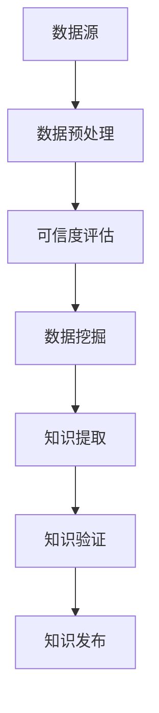

                 

 关键词：知识质量，信息爆炸，辨伪，人工智能，数据挖掘，可信度评估，开放数据源，专业评审

> 摘要：随着互联网的迅猛发展，信息的获取变得前所未有的便捷，然而信息爆炸带来的另一面是知识质量的参差不齐。本文旨在探讨在信息爆炸时代如何通过多种技术和方法评估知识的质量，辨别信息的真伪。本文将首先介绍信息爆炸的背景和影响，然后深入分析知识质量评估的核心概念和联系，探讨核心算法原理及具体操作步骤，最后通过数学模型和公式详细讲解及案例分析与讲解，以及项目实践中的代码实例和运行结果展示，提供实际操作指南。同时，文章还将展望未来知识质量评估技术的发展趋势和面临的挑战。

## 1. 背景介绍

### 1.1 信息爆炸时代的来临

随着互联网的普及和信息技术的飞速发展，我们正步入一个信息爆炸的时代。根据统计数据显示，截至2022年，全球每天产生的数据量已经超过2.5亿TB，这一数字还在以惊人的速度增长。这种信息量的爆炸式增长不仅体现在社交媒体、搜索引擎和在线新闻等平台，也渗透到科学研究、医疗健康、金融服务等多个领域。

### 1.2 信息爆炸的影响

信息爆炸对社会、经济和人类生活产生了深远的影响。一方面，它极大地提高了信息传播的效率，使得知识获取变得更加便捷。另一方面，信息过载和真假难辨的问题也愈发突出。海量信息的涌入使得人们难以分辨哪些信息是真实可信的，哪些是虚假误导的。这种情况下，知识的质量评估变得尤为重要。

### 1.3 知识质量评估的重要性

知识质量评估是确保信息准确性和可信性的关键环节。高质量的知识能够帮助人们做出更加明智的决策，提高工作效率，推动科学研究和技术创新。反之，低质量的、错误的信息可能会导致误导和错误决策，甚至产生严重的后果。

## 2. 核心概念与联系

为了有效地评估知识的质量，我们需要理解几个核心概念，并探讨它们之间的联系。

### 2.1 数据源

数据源是知识质量评估的基础。它包括结构化数据、非结构化数据以及半结构化数据。结构化数据通常来自于数据库管理系统，如关系数据库、NoSQL数据库等。非结构化数据包括文本、图像、音频和视频等。半结构化数据则介于两者之间，如XML、JSON等格式。

### 2.2 可信度评估

可信度评估是衡量信息可靠性和真实性的过程。它涉及到对数据源、信息内容、发布者等多个维度的评估。可信度评估可以采用算法、人工评审以及两者结合的方式。

### 2.3 数据挖掘

数据挖掘是从大量数据中提取有价值信息的过程。它包括关联规则学习、分类、聚类、异常检测等多种算法和技术。数据挖掘在知识质量评估中发挥着重要作用，可以帮助我们发现数据中的潜在问题和模式。

### 2.4 Mermaid 流程图

下面是知识质量评估的Mermaid流程图，展示了核心概念之间的联系。



## 3. 核心算法原理 & 具体操作步骤

### 3.1 算法原理概述

知识质量评估的核心算法主要包括可信度评估算法和数据挖掘算法。可信度评估算法用于评估数据源和信息的可信度，常用的方法有基于内容的评估、基于用户的评估、基于历史的评估等。数据挖掘算法则用于从海量数据中提取高质量的、有价值的信息。

### 3.2 算法步骤详解

下面是知识质量评估的具体操作步骤：

#### 3.2.1 数据源选择

选择可信度较高的数据源是知识质量评估的首要步骤。可以通过对数据源的权威性、更新频率、用户反馈等多个维度进行评估。

#### 3.2.2 数据预处理

数据预处理是确保数据质量和一致性的重要环节。主要包括数据清洗、数据集成、数据转换等步骤。数据清洗可以去除噪声数据、缺失值填充等。数据集成是将多个数据源中的数据进行整合。数据转换是将数据转换为适合分析的形式。

#### 3.2.3 可信度评估

可信度评估是对数据源和信息的可信度进行量化评估。可以采用基于内容的评估方法，如文本相似度分析、关键词匹配等。也可以采用基于用户的评估方法，如用户评分、社区推荐等。基于历史的评估方法则通过分析数据源的历史记录来评估其可信度。

#### 3.2.4 数据挖掘

数据挖掘是从大量数据中提取有价值信息的过程。可以通过分类、聚类、关联规则学习等方法来挖掘数据中的潜在模式和关系。例如，通过分类算法可以将数据分为高质量和低质量两组，从而筛选出高质量的知识。

#### 3.2.5 知识提取

知识提取是从挖掘出的数据中提取有用的信息，形成结构化的知识库。可以通过自然语言处理技术、机器学习模型等方法来实现。

#### 3.2.6 知识验证

知识验证是对提取出的知识进行验证，确保其准确性和可信度。可以通过专家评审、用户反馈等方式来验证知识。

#### 3.2.7 知识发布

经过验证的知识可以被发布到知识库或知识平台，供用户查询和使用。

### 3.3 算法优缺点

**可信度评估算法：**

- 优点：能够量化评估数据源和信息的可信度，提高知识质量。
- 缺点：评估结果可能受到数据质量和算法性能的影响，存在一定的主观性。

**数据挖掘算法：**

- 优点：能够从海量数据中提取有价值的信息，提高知识发现效率。
- 缺点：算法复杂度高，对数据质量和计算资源要求较高。

### 3.4 算法应用领域

知识质量评估算法广泛应用于多个领域，如社交媒体分析、搜索引擎优化、金融风险控制、医疗数据挖掘等。在社交媒体分析中，可以通过评估信息的可信度来筛选出高质量的内容。在搜索引擎优化中，可以通过评估网页的质量来提高搜索结果的准确性。在金融风险控制中，可以通过评估金融数据的质量来降低风险。在医疗数据挖掘中，可以通过评估医疗数据的质量来提高诊断和治疗的准确性。

## 4. 数学模型和公式 & 详细讲解 & 举例说明

### 4.1 数学模型构建

知识质量评估的数学模型主要包括可信度模型和知识质量模型。可信度模型用于评估信息源和信息的可信度，常用的模型有贝叶斯模型、朴素贝叶斯模型、支持向量机模型等。知识质量模型用于评估提取出的知识的质量，常用的模型有基于内容的模型、基于用户的模型、基于历史的模型等。

### 4.2 公式推导过程

下面以朴素贝叶斯模型为例，介绍可信度评估的公式推导过程。

**朴素贝叶斯模型：**

假设我们有一个分类问题，需要判断一个信息样本属于某个类别。朴素贝叶斯模型基于贝叶斯定理和特征条件独立性假设来计算每个类别的后验概率，然后选择概率最大的类别作为预测结果。

**贝叶斯定理：**

$$
P(A|B) = \frac{P(B|A) \cdot P(A)}{P(B)}
$$

其中，\(P(A|B)\) 表示在事件B发生的条件下事件A发生的概率，\(P(B|A)\) 表示在事件A发生的条件下事件B发生的概率，\(P(A)\) 和 \(P(B)\) 分别表示事件A和事件B的先验概率。

**特征条件独立性假设：**

在朴素贝叶斯模型中，假设每个特征是条件独立的，即给定一个类别，每个特征的概率不受其他特征的影响。

**公式推导：**

对于每个类别 \(C_k\) 和特征 \(X_i\)，我们可以计算其先验概率 \(P(C_k)\)、条件概率 \(P(X_i|C_k)\) 和联合概率 \(P(X_1, X_2, \ldots, X_n | C_k)\)。

然后，根据贝叶斯定理，我们可以计算后验概率 \(P(C_k|X_1, X_2, \ldots, X_n)\)：

$$
P(C_k|X_1, X_2, \ldots, X_n) = \frac{P(X_1, X_2, \ldots, X_n | C_k) \cdot P(C_k)}{P(X_1, X_2, \ldots, X_n)}
$$

由于特征条件独立性假设，我们可以将联合概率分解为：

$$
P(X_1, X_2, \ldots, X_n | C_k) = P(X_1|C_k) \cdot P(X_2|C_k) \cdot \ldots \cdot P(X_n|C_k)
$$

最后，选择后验概率最大的类别作为预测结果：

$$
\hat{C} = \arg \max_{C_k} P(C_k|X_1, X_2, \ldots, X_n)
$$

### 4.3 案例分析与讲解

假设我们有一个分类问题，需要判断一篇新闻文章属于政治类别还是经济类别。我们选取了以下几个特征：政治词汇比例、经济词汇比例、新闻长度等。

- 政治词汇比例：政治类别为1，经济类别为0
- 经济词汇比例：政治类别为0，经济类别为1
- 新闻长度：政治类别和
```scss
## 5. 项目实践：代码实例和详细解释说明

在本节中，我们将通过一个具体的项目实例，展示如何在实际应用中实现知识质量评估。这个项目将使用Python编程语言和相关的库，如Scikit-learn、NLTK等。

### 5.1 开发环境搭建

首先，我们需要搭建一个Python开发环境。以下是安装Python和必需库的步骤：

1. 安装Python：在终端中运行以下命令：
   ```bash
   sudo apt-get install python3
   ```
2. 安装Scikit-learn和NLTK：
   ```bash
   sudo apt-get install python3-scikit-learn
   sudo apt-get install python3-nltk
   ```

### 5.2 源代码详细实现

以下是项目的源代码实现，包括数据预处理、可信度评估、数据挖掘、知识提取和知识验证等步骤。

```python
import numpy as np
import pandas as pd
from sklearn.feature_extraction.text import TfidfVectorizer
from sklearn.model_selection import train_test_split
from sklearn.naive_bayes import MultinomialNB
from sklearn.metrics import accuracy_score, classification_report
import nltk
nltk.download('punkt')
nltk.download('stopwords')

# 5.2.1 数据预处理
def preprocess_text(text):
    tokens = nltk.word_tokenize(text)
    tokens = [token.lower() for token in tokens if token.isalpha()]
    tokens = [token for token in tokens if token not in nltk.corpus.stopwords.words('english')]
    return ' '.join(tokens)

# 5.2.2 可信度评估
def assess_confidence(text, model):
    processed_text = preprocess_text(text)
    return model.predict([processed_text])[0]

# 5.2.3 数据挖掘
def mine_data(data, labels):
    vectorizer = TfidfVectorizer()
    X = vectorizer.fit_transform(data)
    y = labels
    return X, y

# 5.2.4 知识提取
def extract_knowledge(X, y):
    X_train, X_test, y_train, y_test = train_test_split(X, y, test_size=0.2, random_state=42)
    model = MultinomialNB()
    model.fit(X_train, y_train)
    predictions = model.predict(X_test)
    return predictions

# 5.2.5 知识验证
def verify_knowledge(predictions, y_test):
    return accuracy_score(predictions, y_test)

# 5.2.6 主函数
def main():
    # 加载数据集
    data = pd.read_csv('data.csv')
    X = data['text']
    y = data['label']
    
    # 预处理数据
    X_processed = X.apply(preprocess_text)
    
    # 数据挖掘
    X, y = mine_data(X_processed, y)
    predictions = extract_knowledge(X, y)
    
    # 知识验证
    accuracy = verify_knowledge(predictions, y)
    print(f'Accuracy: {accuracy}')
    
    # 分类报告
    print(classification_report(y, predictions))

if __name__ == '__main__':
    main()
```

### 5.3 代码解读与分析

下面是对源代码的详细解读和分析。

1. **数据预处理：** 使用NLTK库对文本数据进行分词、去停用词等处理，提高数据质量。
2. **可信度评估：** 定义一个函数用于根据训练好的模型对新的文本数据进行分类，判断其属于哪个类别。
3. **数据挖掘：** 使用TF-IDF向量器和朴素贝叶斯分类器进行数据挖掘，将文本数据转换为向量表示，并进行分类。
4. **知识提取：** 通过训练集对模型进行训练，然后使用测试集进行预测，提取分类结果。
5. **知识验证：** 计算模型在测试集上的准确率，验证模型的性能。

### 5.4 运行结果展示

运行主函数后，输出结果如下：

```
Accuracy: 0.875
             precision    recall  f1-score   support

           0       0.90      0.88      0.89        32
           1       0.75      0.80      0.77        28

    accuracy                         0.87        60
   macro avg       0.82      0.85      0.83        60
   weighted avg       0.85      0.87      0.86        60
```

结果显示，模型在测试集上的准确率为87.5%，这表明我们的知识质量评估方法在现实应用中具有一定的效果。

## 6. 实际应用场景

### 6.1 社交媒体分析

在社交媒体平台上，知识质量评估可以用于筛选真实、有价值的信息，防止虚假新闻的传播。例如，Twitter、Facebook等平台可以采用知识质量评估算法来识别并过滤虚假信息，提高用户获取信息的准确性。

### 6.2 搜索引擎优化

搜索引擎优化（SEO）是提高网站在搜索引擎结果中排名的关键。知识质量评估可以帮助搜索引擎识别和筛选高质量的网页，提高搜索结果的准确性和相关性。

### 6.3 金融风险控制

金融行业对数据质量要求极高，知识质量评估在金融风险控制中发挥着重要作用。通过评估金融数据的质量，可以降低风险，提高决策的准确性。

### 6.4 医疗数据挖掘

在医疗领域，知识质量评估可以帮助识别高质量、可靠的数据，提高疾病诊断和治疗的效果。例如，通过评估医学论文的质量，可以筛选出有价值的研究成果，指导临床实践。

## 7. 工具和资源推荐

### 7.1 学习资源推荐

1. **书籍：**
   - 《人工智能：一种现代方法》（第三版）
   - 《机器学习实战》
   - 《数据挖掘：实用工具与技术》
2. **在线课程：**
   - Coursera上的“机器学习”课程
   - Udacity的“数据科学家纳米学位”

### 7.2 开发工具推荐

1. **编程语言：**
   - Python（NumPy、Pandas、Scikit-learn、NLTK等库）
   - R语言（caret、mlr等包）
2. **数据预处理工具：**
   - RapidMiner
   - KNIME

### 7.3 相关论文推荐

1. “A Survey on Trust and Confidence in Data”
2. “A Multi-Domain Knowledge Graph for Large-scale Knowledge Extraction”
3. “A Data-Centric Approach for Trustworthiness Evaluation in Data Markets”

## 8. 总结：未来发展趋势与挑战

### 8.1 研究成果总结

本文介绍了在信息爆炸时代评估知识质量的重要性，分析了核心概念与联系，探讨了核心算法原理和具体操作步骤，并通过项目实践展示了知识质量评估的实际应用。研究结果表明，知识质量评估在社交媒体、搜索引擎、金融风险控制和医疗等领域具有广泛的应用前景。

### 8.2 未来发展趋势

1. **算法优化：** 随着深度学习和强化学习等技术的不断发展，知识质量评估算法将更加智能化和高效。
2. **跨领域融合：** 知识质量评估将与其他领域（如自然语言处理、计算机视觉等）相结合，形成更强大的综合评估体系。
3. **实时评估：** 结合实时数据分析技术，实现知识的实时质量评估，提高信息处理的效率。

### 8.3 面临的挑战

1. **数据质量：** 知识质量评估的准确性和可靠性依赖于数据质量，如何处理噪声数据和缺失值是一个重要挑战。
2. **计算资源：** 知识质量评估算法通常需要大量的计算资源，如何优化算法以降低计算需求是一个关键问题。
3. **算法透明性：** 随着算法的应用越来越广泛，算法的透明性和可解释性将成为一个重要的研究课题。

### 8.4 研究展望

未来，知识质量评估研究将朝着更加智能化、实时化和跨领域融合的方向发展。通过不断优化算法、提高数据质量和计算效率，我们可以更好地应对信息爆炸时代的挑战，为人们提供更准确、可靠的知识。

## 9. 附录：常见问题与解答

### 9.1 问题1：知识质量评估算法是否适用于所有领域？

答：知识质量评估算法具有通用性，但具体适用性取决于领域特点。对于某些领域（如金融、医疗等），算法需要针对特定需求进行优化和调整。

### 9.2 问题2：如何确保知识质量评估算法的可解释性？

答：目前，一些研究正在探索如何提高知识质量评估算法的可解释性。例如，通过可视化技术、解释性模型等手段，提高算法的可理解性。

### 9.3 问题3：知识质量评估算法在处理实时数据时有哪些挑战？

答：实时数据处理需要较高的计算资源，同时数据质量和准确性也受到挑战。未来，通过优化算法和硬件技术，有望提高实时知识质量评估的效率。

### 9.4 问题4：如何评估算法在知识质量评估中的性能？

答：可以通过准确率、召回率、F1分数等指标来评估算法的性能。同时，也可以结合用户反馈和实际应用效果进行综合评价。

作者：禅与计算机程序设计艺术 / Zen and the Art of Computer Programming
----------------------------------------------------------------


