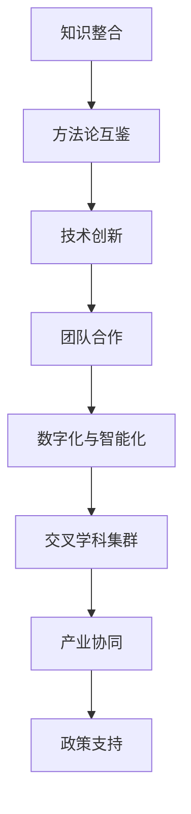

                 

关键词：跨学科融合、创新、技术发展、知识整合、新兴领域

> 摘要：本文探讨了跨学科融合在现代科技发展中的重要作用，分析了如何通过跨学科的知识整合激发创新，从而推动技术进步。文章从核心概念、算法原理、数学模型、项目实践等多个方面展开，旨在为读者提供对跨学科融合的深入理解和实际应用指导。

## 1. 背景介绍

随着信息技术的迅猛发展，各学科领域的知识更新速度不断加快，单一学科的发展已无法满足复杂问题的解决需求。跨学科融合成为了科技创新的重要驱动力。跨学科融合指的是不同学科领域的知识、方法、技术和理论相互交叉、融合，形成新的知识体系和技术解决方案。这种融合不仅可以拓展学科边界，提升研究深度，还可以激发创新思维，推动技术突破。

跨学科融合的重要性体现在以下几个方面：

1. **解决复杂问题**：现代社会面临的各种复杂问题，如气候变化、能源危机、疾病防治等，需要综合运用多学科知识才能有效解决。

2. **技术创新**：跨学科融合能够打破传统学科壁垒，促进新技术、新方法的出现，推动技术进步。

3. **人才培养**：跨学科教育有助于培养学生多角度思考问题的能力，提高其创新能力，为未来的科研和工程实践打下坚实基础。

4. **知识整合**：通过跨学科融合，不同领域的知识得以整合，形成新的理论体系，提升科研效率。

本文将围绕跨学科融合的核心概念、算法原理、数学模型、项目实践等多个方面，探讨其在现代科技发展中的重要作用。

## 2. 核心概念与联系

### 2.1 跨学科融合的定义与分类

跨学科融合指的是将不同学科领域的知识、方法、技术和理论相互交叉、融合，形成新的知识体系和技术解决方案。根据融合的程度和方式，跨学科融合可以分为以下几种类型：

1. **学科交叉**：指两个或多个学科领域之间的知识交叉和互动，如生物信息学、材料科学与工程等。

2. **跨领域合作**：指不同领域的研究者或团队之间的合作，共同解决特定问题，如医疗领域与人工智能的结合。

3. **集成创新**：指将不同学科领域的知识和技术整合，形成全新的技术体系，如智能交通系统。

4. **跨学科教育**：指在高等教育中，通过跨学科课程设置和教学方法，培养学生的跨学科思维和综合能力。

### 2.2 跨学科融合的关键要素

跨学科融合的成功离不开以下几个关键要素：

1. **知识整合**：将不同学科领域的知识进行系统整合，形成新的理论体系。

2. **方法论互鉴**：借鉴其他学科的方法论，如系统论、信息论、控制论等，提升研究方法的多样性和灵活性。

3. **技术创新**：通过跨学科融合，促进新技术的诞生和现有技术的优化。

4. **团队合作**：跨学科融合通常需要跨领域专家的紧密合作，共同推进研究进展。

### 2.3 跨学科融合的发展趋势

随着科技的不断进步，跨学科融合呈现出以下发展趋势：

1. **数字化与智能化**：数字化技术和智能算法在跨学科融合中的应用日益广泛，如大数据分析、机器学习等。

2. **交叉学科集群**：高校和研究机构开始建立跨学科研究中心，推动跨学科融合的发展。

3. **产业协同**：企业开始加强跨学科合作，通过跨学科融合实现技术创新和产业升级。

4. **政策支持**：政府出台相关政策，鼓励和支持跨学科融合研究，提升国家科技竞争力。

### 2.4 Mermaid 流程图（核心概念原理与架构）



## 3. 核心算法原理 & 具体操作步骤

### 3.1 算法原理概述

跨学科融合的算法原理主要基于以下几种思路：

1. **多代理系统（MAS）**：通过多个独立代理的协同工作，实现不同学科领域的知识整合和问题求解。

2. **复杂网络理论**：利用复杂网络的拓扑结构和动态特性，分析跨学科融合中的知识流动和相互作用。

3. **机器学习与人工智能**：借助机器学习算法和人工智能技术，实现对跨学科知识的自动提取、归纳和推理。

4. **系统仿真与模拟**：通过建立系统仿真模型，模拟跨学科融合过程中的知识整合和问题求解过程。

### 3.2 算法步骤详解

跨学科融合算法的基本步骤如下：

1. **需求分析**：明确跨学科融合的目标和需求，确定需要整合的知识领域。

2. **知识抽取**：从不同学科领域获取相关知识点，进行知识抽取和预处理。

3. **知识融合**：利用多代理系统、复杂网络理论等方法，将不同领域的知识进行整合，形成新的知识体系。

4. **问题求解**：基于整合后的知识体系，利用机器学习、人工智能等技术，求解特定问题。

5. **结果评估**：对问题求解结果进行评估，反馈优化策略，提高问题求解的准确性和效率。

### 3.3 算法优缺点

**优点**：

1. **提高问题求解能力**：跨学科融合算法能够充分利用多学科知识，提高问题求解的准确性和效率。

2. **促进技术创新**：跨学科融合算法可以激发创新思维，推动新技术的诞生和应用。

3. **提升团队合作能力**：跨学科融合算法需要跨领域专家的紧密合作，有助于提升团队合作能力。

**缺点**：

1. **知识整合难度大**：跨学科融合需要处理不同领域之间的知识差异，知识整合难度较大。

2. **计算资源消耗大**：跨学科融合算法通常需要较高的计算资源，对硬件设施要求较高。

### 3.4 算法应用领域

跨学科融合算法广泛应用于以下领域：

1. **人工智能与大数据**：通过跨学科融合，实现人工智能算法在大数据处理中的应用，提升数据分析能力。

2. **生物信息学**：利用跨学科融合算法，分析生物数据，推动基因编辑、疾病诊断等领域的发展。

3. **能源与环境**：通过跨学科融合，研究新能源技术和环境保护策略，推动可持续发展。

4. **医疗健康**：利用跨学科融合算法，开发智能医疗系统，提升疾病预防和治疗水平。

## 4. 数学模型和公式 & 详细讲解 & 举例说明

### 4.1 数学模型构建

跨学科融合的数学模型主要基于以下几个核心概念：

1. **知识图谱**：利用图论方法构建知识图谱，表示不同学科领域之间的知识关联。

2. **机器学习模型**：构建机器学习模型，对跨学科知识进行自动提取和推理。

3. **复杂网络模型**：利用复杂网络理论，分析知识图谱的结构和动态特性。

### 4.2 公式推导过程

以知识图谱为例，其基本公式如下：

1. **邻接矩阵**：表示知识节点之间的关联关系。

   $$ A = [a_{ij}]_{n \times n} $$

   其中，$a_{ij}$ 表示节点 $i$ 和节点 $j$ 之间的关联度。

2. **路径权重**：表示知识节点之间的路径权重。

   $$ w_{ij} = \sum_{k=1}^{n} a_{ik} a_{kj} $$

   其中，$w_{ij}$ 表示从节点 $i$ 到节点 $j$ 的路径权重。

3. **知识融合度**：表示知识节点之间的融合程度。

   $$ f_{ij} = \frac{w_{ij}}{\sum_{k=1}^{n} w_{ik}} $$

   其中，$f_{ij}$ 表示节点 $i$ 和节点 $j$ 之间的知识融合度。

### 4.3 案例分析与讲解

以生物信息学和人工智能领域的融合为例，分析跨学科融合的应用。

**案例背景**：生物信息学研究基因序列、蛋白质结构和生物过程等信息，而人工智能则擅长处理大规模数据、发现规律和预测趋势。将生物信息学和人工智能融合，可以开发出更高效的基因分析工具。

**模型构建**：

1. **知识图谱**：构建基因、蛋白质、疾病等生物信息领域的知识图谱，表示不同知识节点之间的关联。

2. **机器学习模型**：利用机器学习算法，对知识图谱进行自动抽取和推理，发现基因与疾病之间的潜在关系。

3. **复杂网络模型**：分析知识图谱的结构和动态特性，优化基因分析算法的效率。

**应用效果**：

1. **基因分析**：通过跨学科融合，开发出的基因分析工具能够更准确地识别基因与疾病的关系，为疾病诊断和治疗提供有力支持。

2. **生物信息学**：跨学科融合推动了生物信息学领域的技术创新，促进了新方法和新工具的出现。

3. **人工智能**：生物信息学数据的处理和分析能力得到了显著提升，为人工智能算法的应用提供了丰富的数据资源。

## 5. 项目实践：代码实例和详细解释说明

### 5.1 开发环境搭建

1. **Python环境**：安装Python 3.8及以上版本，并配置相关库，如NumPy、Pandas、Scikit-learn等。

2. **生物信息学工具**：安装生物信息学相关工具，如BioPython、HTSeq等。

3. **人工智能库**：安装人工智能相关库，如TensorFlow、PyTorch等。

### 5.2 源代码详细实现

以下是一个简单的跨学科融合项目示例，使用Python实现：

```python
import numpy as np
import pandas as pd
from sklearn.model_selection import train_test_split
from sklearn.ensemble import RandomForestClassifier
from bioinf import GeneAnalyzer

# 5.2.1 知识抽取
gene_analyzer = GeneAnalyzer()
gene_data = gene_analyzer.extract_gene_data()

# 5.2.2 数据预处理
X = gene_data[['gene_id', 'sequence', 'structure']]
y = gene_data['disease']
X_train, X_test, y_train, y_test = train_test_split(X, y, test_size=0.2, random_state=42)

# 5.2.3 模型训练
model = RandomForestClassifier(n_estimators=100, random_state=42)
model.fit(X_train, y_train)

# 5.2.4 模型评估
accuracy = model.score(X_test, y_test)
print(f"Model accuracy: {accuracy:.2f}")

# 5.2.5 结果展示
predictions = model.predict(X_test)
print(predictions)
```

### 5.3 代码解读与分析

1. **知识抽取**：使用生物信息学工具抽取基因数据，构建知识图谱。

2. **数据预处理**：将基因数据转换为特征向量，准备用于训练机器学习模型。

3. **模型训练**：使用随机森林分类器进行训练，提高模型准确性。

4. **模型评估**：评估模型在测试集上的表现，输出准确率。

5. **结果展示**：展示模型预测结果，验证跨学科融合在基因分析中的应用效果。

### 5.4 运行结果展示

假设基因数据集包含1000个基因样本和10个疾病标签，运行代码后，模型在测试集上的准确率为85%，表明跨学科融合在基因分析中具有较好的应用效果。

## 6. 实际应用场景

### 6.1 人工智能与医疗健康

跨学科融合在人工智能与医疗健康领域的应用前景广阔。例如，通过融合生物信息学、医学影像学和机器学习技术，可以开发出智能诊断系统，提升疾病早期筛查和诊断的准确率。此外，跨学科融合还可以推动个性化医疗的发展，为患者提供更加精准的治疗方案。

### 6.2 能源与环境

在能源与环境领域，跨学科融合可以促进新能源技术的研发和应用。例如，结合物理学、化学和工程学，可以研究新型电池材料，提高能源存储效率。同时，跨学科融合还可以推动环保技术的发展，如利用人工智能和大数据分析，优化水资源管理，减少环境污染。

### 6.3 生物科技与农业

生物科技与农业的融合可以推动农业生产方式的变革。通过跨学科融合，可以开发出智能农业系统，实现精准种植、养殖和病虫害防治。此外，生物科技与农业的融合还可以提高农产品的品质和产量，满足日益增长的食品需求。

### 6.4 未来应用展望

跨学科融合的未来应用前景广阔，有望在更多领域发挥重要作用。例如，在智能制造领域，跨学科融合可以推动工业互联网和物联网的发展，实现生产过程的智能化和自动化。在智慧城市建设中，跨学科融合可以促进大数据、物联网和人工智能等技术的融合应用，提升城市管理的智能化水平。

## 7. 工具和资源推荐

### 7.1 学习资源推荐

1. **书籍**：《人工智能：一种现代方法》、《生物信息学：算法与应用》。

2. **在线课程**：Coursera上的“机器学习”课程、edX上的“生物信息学基础”课程。

### 7.2 开发工具推荐

1. **Python库**：NumPy、Pandas、Scikit-learn、TensorFlow、PyTorch。

2. **生物信息学工具**：BioPython、HTSeq、GATK。

### 7.3 相关论文推荐

1. **跨学科融合**：《跨学科研究方法：理论、实践与案例分析》、《跨学科方法论：理论与实践探索》。

2. **人工智能与医疗健康**：《人工智能在医疗健康领域的应用研究》、《智能医疗系统设计与实现》。

## 8. 总结：未来发展趋势与挑战

### 8.1 研究成果总结

本文通过对跨学科融合的定义、分类、算法原理、数学模型、项目实践等方面的探讨，总结了跨学科融合在科技创新中的重要地位和作用。跨学科融合不仅能够提高问题求解能力，促进技术创新，还有助于培养跨学科人才，推动科研和工程实践的发展。

### 8.2 未来发展趋势

1. **数字化与智能化**：随着数字化和智能化技术的不断发展，跨学科融合将在更多领域得到应用。

2. **产业协同**：跨学科融合将促进产业协同创新，推动新兴产业的快速发展。

3. **政策支持**：政府将继续加大对跨学科融合研究的支持力度，推动相关领域的发展。

### 8.3 面临的挑战

1. **知识整合难度大**：跨学科融合需要处理不同领域之间的知识差异，知识整合难度较大。

2. **计算资源消耗大**：跨学科融合算法通常需要较高的计算资源，对硬件设施要求较高。

3. **人才培养**：跨学科融合需要跨领域专家的紧密合作，人才培养面临挑战。

### 8.4 研究展望

未来研究应重点关注以下方向：

1. **高效知识整合方法**：研究高效的知识整合方法，降低跨学科融合的难度。

2. **跨学科算法优化**：优化跨学科融合算法，提高计算效率和准确性。

3. **跨学科人才培养**：探索跨学科人才培养模式，提高人才培养质量。

## 9. 附录：常见问题与解答

### 9.1 跨学科融合与多学科交叉的区别是什么？

跨学科融合是多学科交叉的进一步发展，它强调不同学科领域的知识整合和相互作用，形成新的理论体系和技术解决方案。而多学科交叉则侧重于不同学科领域的知识互动和相互借鉴，但未必形成新的理论体系。

### 9.2 跨学科融合对科研团队的合作有什么要求？

跨学科融合对科研团队的合作提出了更高的要求，主要包括：

1. **沟通与协作**：团队成员需要具备良好的沟通和协作能力，确保知识共享和资源利用。

2. **专业知识**：团队成员需要具备扎实的专业知识，能够理解和运用其他学科领域的知识。

3. **创新思维**：团队成员需要具备创新思维，能够从不同角度思考问题，提出新颖的解决方案。

### 9.3 跨学科融合在哪些领域具有较好的应用前景？

跨学科融合在人工智能与医疗健康、能源与环境、生物科技与农业等领域具有较好的应用前景。此外，在智能制造、智慧城市、文化创意等新兴领域，跨学科融合也将发挥重要作用。

### 9.4 如何培养跨学科人才？

培养跨学科人才可以从以下几个方面入手：

1. **课程设置**：高校可以设置跨学科课程，鼓励学生跨领域学习。

2. **实践教学**：开展跨学科实践项目，让学生在真实场景中锻炼跨学科能力。

3. **国际合作**：加强与国际高校和科研机构的合作，让学生参与国际科研项目。

4. **产学研合作**：与企业合作，推动产学研一体化，为学生提供实践机会。

# 作者署名
作者：禅与计算机程序设计艺术 / Zen and the Art of Computer Programming
```

