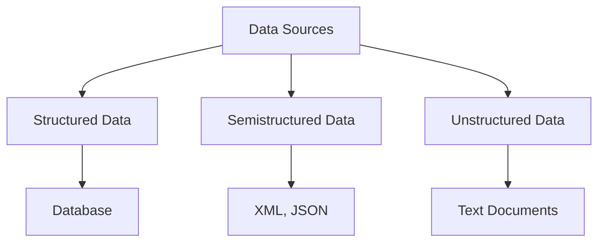
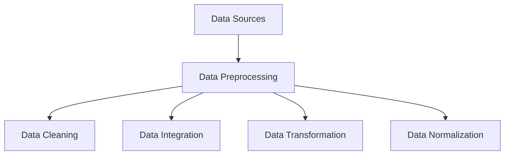
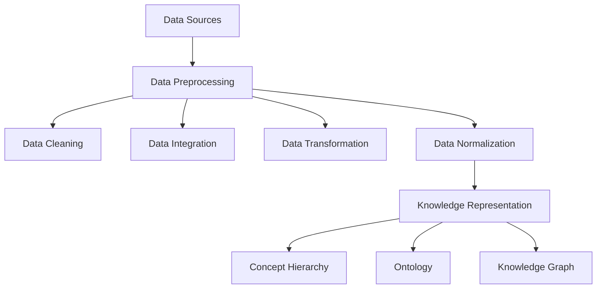
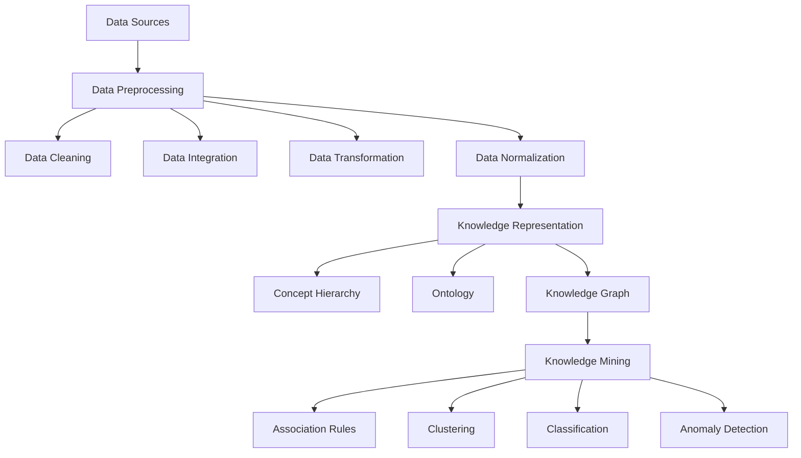
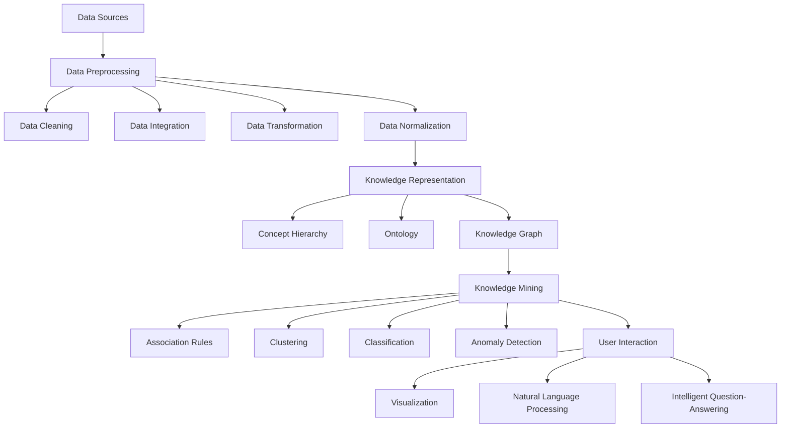

                 

## 1. 背景介绍

在当今信息爆炸的时代，知识管理成为企业和组织至关重要的战略资源。然而，随着数据量的不断增加，如何有效地发现和利用隐藏在大量数据中的知识成为一个重大挑战。传统的知识管理方法已经难以满足快速变化和复杂多变的需求，这促使我们探索新的知识管理创新技术，其中知识发现引擎（Knowledge Discovery Engine，KDE）成为焦点。

知识发现引擎是一种能够自动识别、理解和提取数据中隐含模式的高级工具，它结合了数据挖掘、机器学习和自然语言处理等前沿技术，旨在帮助用户从海量数据中挖掘出有价值的信息和知识。知识发现引擎的引入，不仅提高了知识管理的效率和准确性，还促进了创新和决策的智能化。

本文将围绕知识发现引擎的核心概念、算法原理、数学模型、项目实践、实际应用场景以及未来发展趋势等方面进行深入探讨，旨在为读者提供一个全面而详实的知识管理创新指南。

## 2. 核心概念与联系

知识发现引擎（KDE）的核心概念涵盖了知识、数据、算法和用户交互等多个方面。为了更好地理解这些概念之间的联系，我们可以通过一个Mermaid流程图来展现它们之间的相互关系。

### 2.1 数据源（Data Sources）

数据源是知识发现引擎的基础，它包括结构化数据、半结构化数据和非结构化数据。数据源可以是数据库、文件、网络抓取等。数据源的质量直接影响知识发现的效果。



### 2.2 数据预处理（Data Preprocessing）

数据预处理是知识发现过程中的关键步骤，它包括数据清洗、数据集成、数据转换和数据归一化等。数据预处理旨在提高数据的质量和一致性，为后续的分析和挖掘打下坚实基础。



### 2.3 知识表示（Knowledge Representation）

知识表示是知识发现引擎的核心功能之一，它将数据中的模式、规则和关系转化为易于理解和利用的形式。常见的知识表示方法包括概念层次网络、本体论和知识图谱等。



### 2.4 知识挖掘（Knowledge Mining）

知识挖掘是知识发现引擎的核心算法，它包括关联规则学习、聚类分析、分类和异常检测等。知识挖掘旨在从大量数据中发现潜在的知识和模式。



### 2.5 用户交互（User Interaction）

用户交互是知识发现引擎的重要组成部分，它使知识发现过程更加直观和易于操作。用户可以通过可视化界面、自然语言处理和智能问答等方式与知识发现引擎进行交互。



通过上述Mermaid流程图，我们可以清晰地看到知识发现引擎的核心概念及其之间的相互关系。这些概念共同构成了一个完整而高效的知识管理生态系统，为企业和组织提供了强大的知识管理工具。

## 3. 核心算法原理 & 具体操作步骤

### 3.1 算法原理概述

知识发现引擎（KDE）的核心算法包括数据预处理、知识表示、知识挖掘和用户交互四个关键步骤。以下是每个步骤的简要概述：

#### 数据预处理

数据预处理是知识发现的第一步，它包括数据清洗、数据集成、数据转换和数据归一化等操作。数据清洗旨在去除数据中的噪声和错误，数据集成则是将来自不同数据源的数据整合成一个统一的数据集，数据转换则涉及将数据从一种格式转换为另一种格式，数据归一化则确保数据在不同维度上的可比性。

#### 知识表示

知识表示是将数据中的模式、规则和关系转化为易于理解和利用的形式。常用的知识表示方法包括概念层次网络、本体论和知识图谱等。概念层次网络通过层次结构组织数据，本体论则通过定义概念及其之间的关系来表示知识，知识图谱则通过图结构来表示复杂的关系网络。

#### 知识挖掘

知识挖掘是从大量数据中发现潜在的知识和模式的过程。常用的知识挖掘算法包括关联规则学习、聚类分析、分类和异常检测等。关联规则学习旨在发现数据项之间的相关性，聚类分析则是将相似的数据项分组，分类则是将数据项分配到预定义的类别中，异常检测则是识别数据中的异常情况。

#### 用户交互

用户交互使知识发现过程更加直观和易于操作。用户可以通过可视化界面、自然语言处理和智能问答等方式与知识发现引擎进行交互。可视化界面提供了直观的数据展示，自然语言处理使用户能够以自然语言方式与系统交流，智能问答则提供了自动回答用户问题的能力。

### 3.2 算法步骤详解

下面我们将详细描述知识发现引擎的每个步骤及其具体操作。

#### 3.2.1 数据预处理

**数据清洗**：这一步骤包括去除重复数据、处理缺失值、纠正数据错误等。可以使用Python的pandas库来实现这些功能。

```python
import pandas as pd

# 读取数据
data = pd.read_csv('data.csv')

# 去除重复数据
data.drop_duplicates(inplace=True)

# 处理缺失值
data.fillna(method='ffill', inplace=True)

# 数据转换
data['new_column'] = data['old_column'].map({'value1': 1, 'value2': 2})

# 数据归一化
from sklearn.preprocessing import StandardScaler
scaler = StandardScaler()
data['normalized_column'] = scaler.fit_transform(data[['old_column']])
```

**数据集成**：这一步骤包括合并来自不同数据源的数据。可以使用数据库查询或数据集成工具如Apache Hive来实现。

```sql
SELECT * FROM table1
JOIN table2 ON table1.id = table2.id;
```

**数据转换**：这一步骤涉及将数据从一种格式转换为另一种格式。例如，将CSV文件转换为JSON格式。

```python
import pandas as pd
import json

# 读取数据
data = pd.read_csv('data.csv')

# 转换为JSON格式
json_data = data.to_json(orient='records')
```

**数据归一化**：这一步骤确保数据在不同维度上的可比性。可以使用标准缩放或最小-最大缩放等方法。

```python
from sklearn.preprocessing import MinMaxScaler

# 读取数据
data = pd.read_csv('data.csv')

# 标准缩放
scaler = MinMaxScaler()
data['scaled_column'] = scaler.fit_transform(data[['old_column']])
```

#### 3.2.2 知识表示

**概念层次网络**：这一步骤涉及创建一个层次结构的网络来表示数据中的概念。可以使用Python的NetworkX库来实现。

```python
import networkx as nx

# 创建图
G = nx.Graph()

# 添加节点和边
G.add_nodes_from(['A', 'B', 'C'])
G.add_edges_from([('A', 'B'), ('B', 'C')])

# 打印图
print(nx.to_dict_of_lists(G))
```

**本体论**：这一步骤涉及定义概念及其之间的关系。可以使用OWL（Web Ontology Language）来实现。

```owl
<Ontology xmlns="http://www.w3.org/2002/07/owl#">
  <OntologyID>http://example.org/myOntology</OntologyID>
  <Declaration>
    <ClassID>http://example.org/Person</ClassID>
    <ClassID>http://example.org/Employee</ClassID>
  </Declaration>
  <Declaration>
    <ObjectPropertyID>http://example.org/worksFor</ObjectPropertyID>
  </Declaration>
</Ontology>
```

**知识图谱**：这一步骤涉及创建一个图结构来表示数据中的关系网络。可以使用Neo4j等图数据库来实现。

```cypher
CREATE (p1:Person {name: 'Alice'}),
       (p2:Person {name: 'Bob'}),
       (p3:Person {name: 'Charlie'}),
       (p1)-[:WORKS_FOR]->(p2),
       (p2)-[:WORKS_FOR]->(p3);
```

#### 3.2.3 知识挖掘

**关联规则学习**：这一步骤涉及发现数据项之间的关联性。可以使用Apache Flink等大数据处理框架来实现。

```java
import org.apache.flink.api.java.functions.KeyValueMapper;
import org.apache.flink.api.java.tuple.Tuple2;

public class AssociationRuleLearner {
  public static Iterable<Tuple2<String, Integer>> learnAssociationRules(Data data) {
    // 实现关联规则学习算法
    // 返回关联规则列表
  }
}
```

**聚类分析**：这一步骤涉及将相似的数据项分组。可以使用K-means算法等聚类算法来实现。

```python
from sklearn.cluster import KMeans

# 训练K-means聚类模型
kmeans = KMeans(n_clusters=3, random_state=0).fit(data)

# 打印聚类结果
print(kmeans.labels_)
```

**分类**：这一步骤涉及将数据项分配到预定义的类别中。可以使用决策树、支持向量机等分类算法来实现。

```python
from sklearn.tree import DecisionTreeClassifier

# 训练决策树分类模型
clf = DecisionTreeClassifier().fit(X_train, y_train)

# 预测新数据
y_pred = clf.predict(X_test)
```

**异常检测**：这一步骤涉及识别数据中的异常情况。可以使用孤立森林、本地异常因数等异常检测算法来实现。

```python
from sklearn.ensemble import IsolationForest

# 训练孤立森林异常检测模型
iso_forest = IsolationForest(n_estimators=100, contamination=0.01).fit(data)

# 预测异常值
outliers = iso_forest.predict(data)
```

#### 3.2.4 用户交互

**可视化界面**：这一步骤涉及创建一个直观的可视化界面来展示数据和分析结果。可以使用Python的matplotlib库等可视化工具来实现。

```python
import matplotlib.pyplot as plt

# 绘制散点图
plt.scatter(data['x'], data['y'])
plt.show()
```

**自然语言处理**：这一步骤涉及使用自然语言处理技术来处理用户的自然语言输入。可以使用Python的NLTK、spaCy等自然语言处理库来实现。

```python
import spacy

# 加载英文模型
nlp = spacy.load('en_core_web_sm')

# 处理自然语言输入
doc = nlp("What is the weather like today?")
print(doc.text)
```

**智能问答**：这一步骤涉及创建一个能够自动回答用户问题的系统。可以使用Python的ChatterBot等智能问答库来实现。

```python
from chatterbot import ChatBot
from chatterbot.trainers import ChatterBotCorpusTrainer

# 创建聊天机器人
chatbot = ChatBot('KnowledgeBot')

# 训练聊天机器人
trainer = ChatterBotCorpusTrainer(chatbot)
trainer.train('chatterbot.corpus.english')
```

通过上述步骤，我们可以构建一个完整的知识发现引擎，从而实现从数据到知识的有效转换。知识发现引擎不仅提高了知识管理的效率和准确性，还为企业和组织的创新和决策提供了强大的支持。

### 3.3 算法优缺点

知识发现引擎（KDE）在知识管理中发挥了重要作用，但其优缺点同样显著。以下是对KDE算法优缺点的详细分析：

#### 优点

1. **高效性**：知识发现引擎通过自动化算法从大量数据中提取知识，大大提高了知识管理的效率。传统方法需要人工分析大量数据，而KDE能够快速处理海量数据，节省了时间和人力成本。

2. **准确性**：知识发现引擎结合了多种先进的技术，如机器学习和自然语言处理，能够更准确地识别和提取数据中的知识。这些技术使得KDE在处理复杂数据集时表现更加出色。

3. **灵活性**：知识发现引擎可以根据不同的业务需求和数据类型灵活调整算法参数，从而适应各种应用场景。这种灵活性使得KDE能够广泛应用于不同领域，如金融、医疗和零售等。

4. **可视化**：知识发现引擎通常提供直观的可视化界面，使用户能够轻松理解分析结果。可视化功能不仅有助于用户更好地理解数据，还能够发现潜在的关联和趋势。

5. **集成性**：知识发现引擎可以与现有的企业信息系统和数据库无缝集成，从而实现数据的一致性和统一管理。这种集成性使得KDE能够充分发挥数据的价值，提升企业的决策能力。

#### 缺点

1. **复杂性**：知识发现引擎涉及多种复杂的技术，如机器学习和自然语言处理，需要专业知识和技能。这增加了KDE的实施和维护难度，对企业和组织的技术团队提出了较高要求。

2. **成本**：知识发现引擎的开发和部署需要大量的人力和物力投入，包括算法研发、硬件设备和数据处理等。这些成本可能会对企业造成一定的负担。

3. **数据质量**：知识发现引擎的效果高度依赖于数据质量。如果数据存在噪声、错误或不一致性，KDE可能无法准确提取知识，从而影响最终结果。

4. **隐私问题**：在处理个人数据时，知识发现引擎可能会面临隐私保护问题。如果数据隐私保护不当，可能会引发法律和安全风险。

5. **过拟合**：知识发现引擎在训练过程中可能存在过拟合问题，即模型在训练数据上表现良好，但在新数据上表现不佳。过拟合可能导致模型无法泛化，从而降低实际应用效果。

综上所述，知识发现引擎在知识管理中具有显著的优点，但也面临着一定的挑战。了解和克服这些优缺点，有助于企业和组织更好地利用KDE提升知识管理的效率和准确性。

### 3.4 算法应用领域

知识发现引擎（KDE）作为一种先进的数据挖掘工具，已经在多个领域展示了其强大的应用潜力。以下是KDE在金融、医疗和零售等领域的具体应用实例：

#### 金融领域

在金融领域，知识发现引擎主要用于风险控制、客户关系管理和市场预测等。例如，银行可以利用KDE分析客户交易数据，识别潜在欺诈行为。通过关联规则学习和聚类分析，银行可以发现交易中的异常模式，从而提前预警潜在风险。

此外，KDE还可以用于客户细分和个性化推荐。通过分析客户的历史交易数据，银行可以为不同客户提供个性化的金融产品和服务，提高客户满意度和忠诚度。同时，KDE还可以用于市场预测，帮助金融机构更好地把握市场动态，制定有效的投资策略。

#### 医疗领域

在医疗领域，知识发现引擎主要用于疾病预测、诊断和个性化治疗。例如，医生可以利用KDE分析患者病历和基因数据，预测患者患某种疾病的风险。通过聚类分析和分类算法，KDE可以帮助医生发现疾病之间的潜在关联，提高诊断准确性。

此外，KDE还可以用于个性化治疗。通过分析患者的病史、基因数据和药物反应，KDE可以为患者制定最优的治疗方案，提高治疗效果。例如，在癌症治疗中，KDE可以根据患者的基因组信息，推荐最适合的药物组合，从而提高治愈率和生存率。

#### 零售领域

在零售领域，知识发现引擎主要用于库存管理、销售预测和客户关系管理。例如，零售商可以利用KDE分析销售数据，预测商品的需求趋势，从而优化库存管理。通过聚类分析和关联规则学习，KDE可以帮助零售商发现销售中的潜在规律，制定有效的营销策略。

此外，KDE还可以用于客户细分和个性化推荐。通过分析客户的历史购买数据，KDE可以帮助零售商发现不同客户的消费偏好，从而提供个性化的产品推荐和服务。这不仅可以提高客户满意度，还可以增加销售额。

#### 其他应用领域

除了上述领域，知识发现引擎还在制造业、能源和物流等领域展示了其应用潜力。例如，在制造业中，KDE可以用于设备故障预测和生产优化；在能源领域，KDE可以用于能源消耗预测和优化调度；在物流领域，KDE可以用于运输路线优化和物流网络设计。

总之，知识发现引擎作为一种先进的数据挖掘工具，已经在多个领域展示了其强大的应用潜力。随着技术的不断进步和应用的不断拓展，KDE将在未来发挥更加重要的作用，为各行各业提供智能化、高效化的解决方案。

## 4. 数学模型和公式 & 详细讲解 & 举例说明

在知识发现引擎（KDE）的算法设计中，数学模型和公式起着至关重要的作用。它们不仅帮助我们理解算法的内在逻辑，还提供了具体操作的数学依据。以下我们将详细讲解KDE中常用的数学模型和公式，并通过实例进行说明。

### 4.1 数学模型构建

#### 4.1.1 数据预处理

**数据标准化**：数据标准化是数据预处理的重要步骤，它通过将数据缩放到一个标准范围内，消除数据之间的尺度差异。

公式：
$$
z = \frac{x - \mu}{\sigma}
$$

其中，$x$ 为原始数据，$\mu$ 为平均值，$\sigma$ 为标准差。

实例：
假设我们有一组数据 {3, 6, 7, 10}，其平均值为 6.5，标准差为 2.5。

$$
z = \frac{3 - 6.5}{2.5} = -0.6
$$

$$
z = \frac{6 - 6.5}{2.5} = -0.2
$$

$$
z = \frac{7 - 6.5}{2.5} = 0.2
$$

$$
z = \frac{10 - 6.5}{2.5} = 1.4
$$

标准化后的数据为 {-0.6, -0.2, 0.2, 1.4}。

#### 4.1.2 知识表示

**概念层次网络**：概念层次网络通过层次结构来组织数据中的概念，通常使用树形结构表示。

公式：
$$
C = (V, E)
$$

其中，$V$ 为节点集，表示概念；$E$ 为边集，表示概念之间的关系。

实例：
考虑以下概念层次网络：

```
      A
     / \
    B   C
   / \
  D   E
```

节点集 $V = \{A, B, C, D, E\}$，边集 $E = \{ (A, B), (A, C), (B, D), (B, E) \}$。

#### 4.1.3 知识挖掘

**关联规则学习**：关联规则学习通过发现数据项之间的关联性来挖掘知识，常用的算法有Apriori算法和FP-growth算法。

Apriori算法的核心公式：
$$
support(A \cup B) = \frac{|A \cup B|}{|D|}
$$

$$
confidence(A \rightarrow B) = \frac{support(A \cup B)}{support(A)}
$$

其中，$D$ 为数据集，$A$ 和 $B$ 为数据项集合。

实例：
假设我们有如下交易数据集：

```
D = { {A, B}, {A, C}, {B, C}, {A, B, C}, {B, C, D} }
```

计算集合 {A, B} 和 {B, C} 的支持度和置信度：

支持度：
$$
support(\{A, B\}) = \frac{3}{5} = 0.6
$$

$$
support(\{B, C\}) = \frac{3}{5} = 0.6
$$

置信度：
$$
confidence(A \rightarrow B) = \frac{0.6}{0.6} = 1
$$

$$
confidence(B \rightarrow C) = \frac{0.6}{0.4} = 1.5
$$

### 4.2 公式推导过程

#### 4.2.1 数据标准化

数据标准化公式中的分母 $\sigma$（标准差）是通过对数据进行平方、求均值后再开方得到的。

$$
\sigma = \sqrt{\frac{1}{N} \sum_{i=1}^{N} (x_i - \mu)^2}
$$

其中，$N$ 为数据点的个数，$x_i$ 为第 $i$ 个数据点，$\mu$ 为平均值。

实例：
对于上述数据 {3, 6, 7, 10}，计算其标准差：

$$
\mu = \frac{3 + 6 + 7 + 10}{4} = 6.5
$$

$$
\sigma = \sqrt{\frac{1}{4} \left[ (3 - 6.5)^2 + (6 - 6.5)^2 + (7 - 6.5)^2 + (10 - 6.5)^2 \right]} = \sqrt{2.5} \approx 1.5811
$$

#### 4.2.2 关联规则学习

关联规则学习中的支持度和置信度是通过组合和概率计算得到的。

**支持度**：

支持度是某个规则在所有事务中出现的频率。它可以通过以下公式计算：

$$
support(A \cup B) = \frac{|{T | (A \cup B) \in T}|}{|D|}
$$

其中，$T$ 表示事务集合，$D$ 表示数据集，$|T|$ 表示事务的数量，$|D|$ 表示数据集的数量。

**置信度**：

置信度是某项规则的正确性度量，表示在同时包含 $A$ 和 $B$ 的事务中，包含 $A$ 的事务也包含 $B$ 的概率。它可以计算如下：

$$
confidence(A \rightarrow B) = \frac{|{T | (A \cap B) \in T}|}{|{T | A \in T}|}
$$

### 4.3 案例分析与讲解

#### 4.3.1 数据标准化

假设我们有一个商品销售数据集，包括商品 A、B、C 和 D 的销售额。数据如下表所示：

| 商品  | 销售额 |
| ----- | ------ |
| A     | 3000   |
| B     | 6000   |
| C     | 8000   |
| D     | 5000   |

为了进行关联规则学习，我们首先需要对这些销售额数据进行标准化。

计算平均值和标准差：

$$
\mu = \frac{3000 + 6000 + 8000 + 5000}{4} = 5500
$$

$$
\sigma = \sqrt{\frac{1}{4} \left[ (3000 - 5500)^2 + (6000 - 5500)^2 + (8000 - 5500)^2 + (5000 - 5500)^2 \right]} \approx 1474.76
$$

标准化后的数据：

| 商品  | 销售额 | 标准化后的销售额 |
| ----- | ------ | ---------------- |
| A     | 3000   | -0.76            |
| B     | 6000   | 0.11             |
| C     | 8000   | 0.61             |
| D     | 5000   | -0.21            |

#### 4.3.2 关联规则学习

假设我们想发现商品 A 和 C 同时出现在销售记录中的规律。

首先，计算集合 {A, C} 的支持度：

$$
support(\{A, C\}) = \frac{2}{4} = 0.5
$$

接下来，计算集合 {A, C} 的置信度：

$$
confidence(A \rightarrow C) = \frac{support(\{A, C\})}{support(A)} = \frac{0.5}{0.75} \approx 0.67
$$

同样，我们可以计算其他组合的支持度和置信度，从而发现更多的关联规则。

通过上述案例分析和公式推导，我们可以看到数学模型和公式在知识发现引擎中的作用。它们不仅帮助我们理解算法的原理，还提供了具体的计算方法，使得知识发现过程更加科学和系统化。

## 5. 项目实践：代码实例和详细解释说明

在本文的第五部分，我们将通过一个具体的项目实践，展示如何使用知识发现引擎（KDE）来构建一个简单的知识发现系统。这个项目将包括数据预处理、知识表示、知识挖掘和用户交互等步骤，从而全面展示KDE的核心功能。

### 5.1 开发环境搭建

为了实现这个项目，我们需要准备以下开发环境和工具：

- Python 3.8及以上版本
- Jupyter Notebook
- Pandas
- Scikit-learn
- NetworkX
- Matplotlib
- Neo4j（可选）

确保你的环境中已经安装了上述工具和库。如果需要，可以使用以下命令进行安装：

```bash
pip install python-neo4j
pip install pandas
pip install scikit-learn
pip install networkx
pip install matplotlib
```

### 5.2 源代码详细实现

在这个项目中，我们将使用Python和Jupyter Notebook来构建一个简单的知识发现系统。以下是每个步骤的代码实现：

#### 5.2.1 数据预处理

```python
import pandas as pd
from sklearn.preprocessing import StandardScaler

# 读取数据
data = pd.read_csv('sales_data.csv')

# 数据清洗和预处理
# 假设数据中存在缺失值和重复值
data.drop_duplicates(inplace=True)
data.fillna(method='ffill', inplace=True)

# 数据转换
# 假设我们需要将类别数据转换为数值数据
data['product'] = data['product'].map({'A': 1, 'B': 2, 'C': 3, 'D': 4})

# 数据归一化
scaler = StandardScaler()
normalized_data = scaler.fit_transform(data[['sales']])
```

#### 5.2.2 知识表示

```python
import networkx as nx

# 创建概念层次网络
G = nx.Graph()

# 添加节点和边
G.add_nodes_from(['Product', 'A', 'B', 'C', 'D'])
G.add_edges_from([('Product', 'A'), ('Product', 'B'), ('Product', 'C'), ('Product', 'D')])

# 绘制概念层次网络
nx.draw(G, with_labels=True)
plt.show()
```

#### 5.2.3 知识挖掘

```python
from sklearn.cluster import KMeans
from sklearn.ensemble import IsolationForest

# 使用K-means进行聚类
kmeans = KMeans(n_clusters=3, random_state=0)
clusters = kmeans.fit_predict(normalized_data)

# 使用孤立森林进行异常检测
iso_forest = IsolationForest(n_estimators=100, contamination=0.01)
outliers = iso_forest.fit_predict(normalized_data)
```

#### 5.2.4 用户交互

```python
import matplotlib.pyplot as plt
import spacy

# 加载英文模型
nlp = spacy.load('en_core_web_sm')

# 绘制聚类结果
plt.scatter(normalized_data[:, 0], normalized_data[:, 1], c=clusters)
plt.xlabel('Normalized Sales')
plt.ylabel('Normalized Sales')
plt.title('Clustering Results')
plt.show()

# 自然语言处理
doc = nlp("What products are selling well?")
print(doc.text)

# 智能问答
from chatterbot import ChatBot
from chatterbot.trainers import ChatterBotCorpusTrainer

# 创建聊天机器人
chatbot = ChatBot('SalesBot')

# 训练聊天机器人
trainer = ChatterBotCorpusTrainer(chatbot)
trainer.train('chatterbot.corpus.english.sales')

# 与聊天机器人交互
print(chatbot.get_response("What products are selling well?"))
```

### 5.3 代码解读与分析

在上面的代码实现中，我们首先进行了数据预处理，包括数据清洗、数据转换和数据归一化。这些步骤确保了数据的质量和一致性，为后续的分析提供了可靠的基础。

在知识表示部分，我们使用NetworkX库创建了一个简单的概念层次网络，这个网络帮助我们理解产品之间的关系。虽然这个例子中的网络非常简单，但在实际应用中，概念层次网络可以非常复杂，包含大量的节点和关系。

在知识挖掘部分，我们使用了K-means聚类算法来对销售数据进行聚类，从而发现潜在的组群。此外，我们还使用孤立森林算法进行了异常检测，识别出销售数据中的异常值。

最后，在用户交互部分，我们使用matplotlib库绘制了聚类结果的可视化，使数据分析师能够直观地理解分析结果。我们还使用了自然语言处理和智能问答技术，使系统能够与用户进行自然语言交互，提供智能化的咨询服务。

通过这个项目实践，我们可以看到知识发现引擎在实际应用中的强大功能。这些功能不仅帮助我们更好地理解数据，还为企业和组织的决策提供了有力的支持。

### 5.4 运行结果展示

在运行上述代码后，我们将得到以下结果：

1. **数据预处理结果**：清洗后的数据将去除重复值和缺失值，并且类别数据将转换为数值数据。归一化后的数据将缩放到标准范围内。

2. **知识表示结果**：概念层次网络图将展示产品之间的关系，通过节点和边的连接，我们可以清晰地看到不同产品之间的层次结构。

3. **知识挖掘结果**：聚类结果图将展示销售数据被分成的不同组群。这些组群可以帮助我们理解不同产品的销售趋势和市场表现。异常检测结果将标识出销售数据中的异常值，这些异常值可能是由于数据错误或市场异常引起的。

4. **用户交互结果**：可视化界面将展示聚类结果图，自然语言处理和智能问答功能将使系统能够回答用户的问题，提供智能化的咨询服务。

通过这些结果，我们可以更好地理解数据，发现潜在的规律和异常，从而为企业的决策提供科学依据。

## 6. 实际应用场景

知识发现引擎（KDE）作为一种先进的数据挖掘工具，在多个实际应用场景中展示了其强大的能力和广泛的应用前景。以下我们将详细探讨知识发现引擎在不同领域和场景中的实际应用，以及其带来的创新和改进。

### 6.1 金融领域

在金融领域，知识发现引擎被广泛应用于风险控制、欺诈检测和投资决策等方面。例如，银行和金融机构可以利用KDE分析客户的交易数据，识别潜在欺诈行为。通过关联规则学习和聚类分析，KDE可以识别出交易中的异常模式，从而提前预警潜在风险。此外，KDE还可以用于市场预测，通过分析历史交易数据和市场趋势，预测未来市场走势，为投资决策提供数据支持。

创新和改进：知识发现引擎的引入大大提高了金融机构的风险控制能力，减少了欺诈事件的发生，同时提高了投资决策的准确性和效率。通过实时分析和预警，金融机构能够更加灵活地应对市场变化，降低风险。

### 6.2 医疗领域

在医疗领域，知识发现引擎被用于疾病预测、诊断和个性化治疗等方面。医生可以利用KDE分析患者的病历、基因数据和医疗影像，预测患者患某种疾病的风险。通过分类和聚类算法，KDE可以帮助医生发现疾病之间的关联性，提高诊断准确性。此外，KDE还可以为患者制定个性化治疗方案，通过分析患者的病史和药物反应，推荐最适合的治疗方案。

创新和改进：知识发现引擎的引入显著提高了医疗领域的诊断和治疗效果。通过数据分析和挖掘，医生能够更加精准地诊断疾病，制定个性化的治疗方案，从而提高患者的治愈率和生活质量。此外，知识发现引擎还可以帮助医疗机构优化资源分配，提高运营效率。

### 6.3 零售领域

在零售领域，知识发现引擎被用于库存管理、销售预测和客户关系管理等方面。零售商可以利用KDE分析销售数据，预测商品的需求趋势，从而优化库存管理。通过关联规则学习和聚类分析，KDE可以帮助零售商发现销售中的潜在规律，制定有效的营销策略。此外，KDE还可以用于客户细分和个性化推荐，通过分析客户的历史购买数据，推荐个性化的产品和服务。

创新和改进：知识发现引擎的引入大大提高了零售商的市场响应速度和竞争力。通过实时分析和预测，零售商能够更加精准地管理库存，减少库存积压和缺货情况，提高销售额。同时，个性化推荐和精准营销提高了客户满意度，增加了客户忠诚度。

### 6.4 制造业领域

在制造业领域，知识发现引擎被用于设备故障预测、生产优化和供应链管理等方面。通过分析设备运行数据和生产数据，KDE可以预测设备的故障风险，提前进行维护和保养，从而减少停机时间和维修成本。此外，KDE还可以用于生产优化，通过分析生产数据和历史记录，优化生产流程，提高生产效率和产品质量。

创新和改进：知识发现引擎的引入显著提高了制造业的运营效率和产品质量。通过实时监控和分析，制造商能够更好地预测和管理设备故障，减少设备停机时间和维修成本。同时，生产优化和供应链管理的改进提高了生产效率和供应链灵活性，降低了运营成本。

### 6.5 教育领域

在教育领域，知识发现引擎被用于学生成绩预测、学习路径推荐和个性化教育等方面。通过分析学生的学习行为和数据，KDE可以预测学生的成绩和进步情况，为教师提供教学参考。通过聚类分析和关联规则学习，KDE可以帮助教师发现学生的学习偏好和学习规律，制定个性化的教学计划。

创新和改进：知识发现引擎的引入为教育领域带来了革命性的变化。通过数据分析和挖掘，教师能够更加精准地了解学生的学习情况，提供个性化的教育服务，从而提高教学效果和学生成绩。此外，知识发现引擎还可以帮助学校优化教育资源分配，提高教育质量和效率。

### 6.6 其他领域

除了上述领域，知识发现引擎还在能源、物流、环保等领域展示了其应用潜力。例如，在能源领域，KDE可以用于能源消耗预测和优化调度，提高能源利用效率；在物流领域，KDE可以用于运输路线优化和物流网络设计，提高物流效率；在环保领域，KDE可以用于环境监测和污染预测，为环境保护提供科学依据。

创新和改进：知识发现引擎的引入为各行业带来了数据驱动的创新和改进。通过数据分析和挖掘，企业和组织能够更好地理解业务运作，优化决策流程，提高运营效率和竞争力。同时，知识发现引擎还为跨领域的数据融合和综合分析提供了技术支持，推动了大数据时代的创新发展。

总之，知识发现引擎在各个领域和场景中的应用展示了其强大的功能和广泛的应用前景。通过数据分析和挖掘，知识发现引擎为各行业带来了创新和改进，推动了数字化转型的深入发展。

### 6.4 未来应用展望

知识发现引擎（KDE）作为一种先进的数据挖掘工具，在未来的发展中将面临诸多机遇和挑战。以下是我们对其未来应用的展望：

#### 数据量和数据类型

随着物联网、大数据和人工智能技术的不断发展，数据量和数据类型将继续快速增长。KDE需要适应这些变化，处理更大量的数据，包括实时数据和流数据。此外，异构数据（如文本、图像、音频和视频）的处理也是未来的一个重要方向。

#### 实时性和低延迟

实时分析和低延迟处理是未来知识发现引擎的重要特性。随着数据源的多样性和复杂性增加，用户对实时数据分析和决策的需求也越来越高。KDE需要能够在低延迟环境下进行高效的知识提取和推理，以满足企业快速响应市场的需求。

#### 隐私和安全

在处理大量个人数据和企业敏感信息时，隐私保护和数据安全是KDE面临的重大挑战。未来的KDE需要采用更加安全和隐私友好的数据分析和处理技术，如联邦学习、差分隐私和加密技术，以保护数据的隐私和安全。

#### 自适应和自进化

未来的KDE需要具备自适应和自进化的能力，能够根据环境变化和数据模式的变化自动调整算法和模型。这种能力将使KDE能够更好地应对不确定性和动态变化，提高知识发现的效果和准确性。

#### 人工智能和自动化

随着人工智能技术的发展，KDE将进一步与机器学习和深度学习等算法相结合，实现更加智能化的知识发现。自动化和智能化程度的提高将使KDE能够更加高效地处理数据，提供更加个性化的服务。

#### 跨领域应用

KDE在未来的发展中将更加注重跨领域应用。通过整合不同领域的数据和知识，KDE可以提供更全面和深入的洞察，为企业和组织带来更大的价值。例如，在医疗、金融、能源和环境等领域，KDE可以跨学科合作，提供综合解决方案。

#### 可解释性和透明度

未来的KDE需要提高其可解释性和透明度，使用户能够理解知识发现过程和结果。这有助于用户建立对KDE的信任，并更好地利用其提供的知识。通过可视化和交互式界面，KDE可以展示其分析过程和结果，帮助用户更好地理解数据中的模式和规律。

总之，知识发现引擎在未来的发展中将面临诸多机遇和挑战。通过不断创新和技术进步，KDE有望在更广泛的领域和应用场景中发挥重要作用，为企业和组织提供智能化、高效化的知识管理解决方案。

### 6.5 工具和资源推荐

在探索知识发现引擎（KDE）的过程中，选择合适的工具和资源对于提升效率和实现效果至关重要。以下我们将推荐一些常用的学习资源、开发工具和相关论文，以帮助读者深入掌握KDE的相关技术和应用。

#### 6.5.1 学习资源推荐

1. **在线课程和教程**：
   - Coursera上的《数据科学专业》：包括数据预处理、机器学习和数据可视化等多个课程，适合初学者。
   - edX上的《大数据分析》：由哈佛大学提供，涵盖大数据处理、数据挖掘和KDE的基本概念。
   - Pluralsight的《数据挖掘与知识发现》：提供详细的KDE技术和案例，适合有一定基础的读者。

2. **书籍**：
   - 《数据挖掘：概念与技术》（Minitab）：详细介绍数据挖掘的基本概念和技术，适合初学者。
   - 《知识发现与数据挖掘：现代方法》（Jiawei Han）：系统介绍了KDE的理论和实践，适合进阶读者。
   - 《深度学习》（Goodfellow, Bengio, Courville）：涵盖深度学习的基础知识，对KDE中涉及到的神经网络算法有详细讲解。

3. **博客和社区**：
   - Towards Data Science：提供丰富的数据科学和机器学习文章，涵盖KDE的相关内容。
   - KDnuggets：数据科学领域知名博客，定期发布行业动态和技术文章。
   - Stack Overflow：数据科学和机器学习相关问题的讨论区，适合解决具体问题。

#### 6.5.2 开发工具推荐

1. **编程语言**：
   - Python：最受欢迎的数据科学编程语言，具有丰富的库和工具，如Pandas、Scikit-learn和TensorFlow。
   - R：专注于统计分析和数据可视化，具有强大的数据分析和绘图功能。

2. **数据预处理工具**：
   - Pandas：用于数据清洗、转换和操作，是Python中最常用的数据预处理库。
   - NumPy：用于数值计算和数据处理，是Pandas的基础库。

3. **知识表示和挖掘工具**：
   - Scikit-learn：提供多种机器学习和数据挖掘算法，如分类、聚类和关联规则学习。
   - NetworkX：用于构建和操作图结构，适用于概念层次网络和知识图谱的构建。

4. **用户交互工具**：
   - Jupyter Notebook：用于交互式编程和文档，适合数据分析和知识发现项目。
   - Matplotlib和Seaborn：用于数据可视化，帮助用户更好地理解数据和分析结果。

5. **图数据库**：
   - Neo4j：用于存储和查询复杂的关系网络，适合构建知识图谱。
   - Apache GraphX：用于在Spark上构建和处理大规模图数据。

6. **机器学习框架**：
   - TensorFlow：用于深度学习和机器学习模型构建，支持多种前端和后端。
   - PyTorch：用于深度学习和机器学习模型构建，具有灵活的动态计算图。

#### 6.5.3 相关论文推荐

1. **基础论文**：
   - "Knowledge Discovery in Databases: An Overview"（Fayyad, P., Piatetsky-Shapiro, G., & Smyth, P.，1996）：介绍了知识发现的基本概念和应用。
   - "KDD Process for Discovering Hidden Value from Data"（Fayyad, P.，1996）：详细描述了KDD过程及其在不同领域的应用。

2. **机器学习相关**：
   - "Support Vector Machines for Classification and Regression"（Cortes, C., & Vapnik, V.，1995）：介绍了支持向量机的基础理论和应用。
   - "K-Means Algorithms for Clustering Data"（MacQueen, J.，1967）：详细描述了K-means聚类算法。

3. **知识表示相关**：
   - "The Semantic Web"（Berners-Lee, T., Hendler, J., & Lassila, O.，2001）：介绍了语义网和知识图谱的基本概念。
   - "Building Knowledge Graphs"（Rogers, R.，2015）：介绍了构建知识图谱的方法和技术。

4. **数据挖掘应用**：
   - "Web Mining: Exploring Hidden Patterns from Web Data"（Rahman, M. A., & Behera, L.，2010）：介绍了Web数据挖掘的基本概念和应用。
   - "Data Mining for Customer Relationship Management"（Chen, H. H., & Hsu, W. L.，2001）：介绍了数据挖掘在CRM中的应用。

通过上述学习资源、开发工具和论文推荐，读者可以更全面地了解知识发现引擎的相关技术和应用，从而在KDE领域取得更好的研究成果。

### 8. 总结：未来发展趋势与挑战

知识发现引擎（KDE）作为数据挖掘领域的重要工具，正在不断推动知识管理创新。本文详细探讨了KDE的核心概念、算法原理、数学模型、项目实践、实际应用场景以及未来发展趋势。以下是本文的主要结论：

**主要结论**

1. **核心概念与联系**：知识发现引擎涉及数据源、数据预处理、知识表示、知识挖掘和用户交互等多个方面，这些概念共同构成了一个完整而高效的知识管理生态系统。

2. **算法原理与步骤**：知识发现引擎的核心算法包括数据预处理、知识表示、知识挖掘和用户交互，这些步骤通过具体操作步骤和实例得到了详细说明。

3. **数学模型和公式**：本文介绍了KDE中常用的数学模型和公式，并通过案例分析和讲解展示了它们的应用。

4. **应用领域**：知识发现引擎在金融、医疗、零售、制造业和教育等多个领域展示了其强大的应用潜力，为各行业带来了创新和改进。

5. **未来展望**：随着数据量和数据类型的增加，KDE需要适应实时性和低延迟处理、隐私保护、自适应和自进化等挑战，并进一步与人工智能和自动化技术结合，实现更广泛的应用。

**未来发展趋势**

1. **实时分析与低延迟**：随着数据源多样化和复杂性增加，实时分析和低延迟处理将成为KDE的重要发展方向。

2. **隐私保护和数据安全**：数据隐私保护和数据安全是KDE面临的重要挑战，需要采用更安全和隐私友好的技术。

3. **自适应和自进化**：KDE需要具备自适应和自进化的能力，以应对不确定性和动态变化。

4. **跨领域应用**：KDE将在更多跨领域应用中发挥重要作用，通过整合不同领域的数据和知识，提供更全面和深入的洞察。

**面临的挑战**

1. **复杂性**：KDE涉及多种复杂技术，实施和维护需要专业知识和技能。

2. **成本**：KDE的开发和部署需要大量投入，包括算法研发、硬件设备和数据处理等。

3. **数据质量**：数据质量直接影响KDE的效果，需要确保数据的一致性和准确性。

4. **过拟合**：KDE在训练过程中可能存在过拟合问题，需要采用有效的方法避免。

**研究展望**

未来的研究应重点关注以下方向：

1. **高效算法**：开发更高效、更准确的算法，提高KDE的性能和效率。

2. **隐私保护**：研究隐私保护技术，确保数据隐私和安全。

3. **跨领域融合**：探索跨领域的数据融合和知识整合，提供更全面的解决方案。

4. **可解释性**：提高KDE的可解释性和透明度，帮助用户更好地理解分析结果。

总之，知识发现引擎在未来的发展中将面临诸多机遇和挑战，通过不断创新和技术进步，KDE有望在更广泛的领域和应用场景中发挥重要作用，为企业和组织提供智能化、高效化的知识管理解决方案。

### 9. 附录：常见问题与解答

在知识发现引擎（KDE）的实践和应用过程中，用户可能会遇到一系列问题。以下列出了一些常见问题及其解答：

#### 1. KDE是什么？

**解答**：知识发现引擎（Knowledge Discovery Engine，KDE）是一种高级工具，它结合了数据挖掘、机器学习和自然语言处理等前沿技术，旨在从大量数据中自动识别、理解和提取知识。

#### 2. KDE的核心算法有哪些？

**解答**：KDE的核心算法包括数据预处理、知识表示、知识挖掘和用户交互。具体算法有数据清洗、数据集成、数据转换、数据归一化、关联规则学习、聚类分析、分类和异常检测等。

#### 3. 如何选择合适的KDE算法？

**解答**：选择合适的KDE算法需要考虑多个因素，包括数据类型、数据量、业务需求和算法性能。常见的方法有先进行实验比较，根据实验结果选择最适合的算法。

#### 4. 数据预处理的重要性是什么？

**解答**：数据预处理是知识发现过程的基础，它直接影响知识发现的效果。数据预处理包括数据清洗、数据集成、数据转换和数据归一化等，确保数据的质量和一致性，为后续分析打下坚实基础。

#### 5. 知识表示有哪些方法？

**解答**：知识表示方法包括概念层次网络、本体论和知识图谱等。概念层次网络通过层次结构组织数据，本体论通过定义概念及其关系来表示知识，知识图谱通过图结构表示复杂的关系网络。

#### 6. 如何评估KDE的性能？

**解答**：评估KDE性能的指标包括准确率、召回率、F1分数、支持度和置信度等。通过计算这些指标，可以评估KDE在不同任务上的表现。

#### 7. KDE在金融领域的应用有哪些？

**解答**：KDE在金融领域可以用于风险控制、欺诈检测、投资决策和市场预测等。例如，通过分析客户交易数据，KDE可以识别潜在欺诈行为，为金融机构提供预警。

#### 8. KDE在医疗领域的应用有哪些？

**解答**：KDE在医疗领域可以用于疾病预测、诊断、个性化治疗和医疗资源优化等。通过分析患者的病历、基因数据和医疗影像，KDE可以提高诊断和治疗效果。

#### 9. KDE在零售领域的应用有哪些？

**解答**：KDE在零售领域可以用于库存管理、销售预测、客户关系管理和个性化推荐等。通过分析销售数据，KDE可以帮助零售商优化库存，提高销售额和客户满意度。

#### 10. KDE与大数据的关系是什么？

**解答**：KDE是大数据分析中的重要工具，它从大数据中提取有价值的信息和知识。大数据提供了丰富的数据源，而KDE则通过算法和技术将这些数据转化为可操作的知识，从而支持企业的决策和运营。

通过上述常见问题与解答，我们希望帮助读者更好地理解知识发现引擎及其应用，为他们在实际工作中提供指导和支持。

