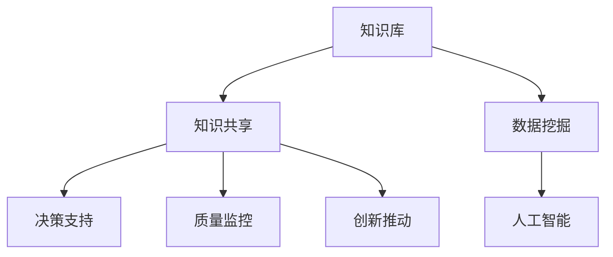

                 

知识管理（Knowledge Management，简称KM）是信息时代一项至关重要的活动，它涉及到组织内部信息的获取、存储、共享、更新和应用。在医疗健康领域，知识管理的应用尤为重要，因为它不仅关系到医疗服务的质量，还关系到患者的生命安全和健康。本文旨在探讨知识管理在医疗健康领域的应用，分析其核心概念、算法原理、数学模型以及具体实践案例。

## 文章关键词

- 知识管理
- 医疗健康
- 数据共享
- 知识库
- 人工智能

## 文章摘要

本文首先介绍了知识管理的概念和在医疗健康领域的重要性。接着，分析了知识管理在医疗健康领域的核心概念与联系，并通过Mermaid流程图展示了相关架构。随后，本文详细介绍了知识管理在医疗健康领域的核心算法原理、数学模型和具体应用步骤。通过一个项目实践案例，展示了知识管理的实际应用效果。最后，本文探讨了知识管理在医疗健康领域的实际应用场景、未来展望和面临的挑战。

## 1. 背景介绍

### 知识管理的起源与发展

知识管理起源于20世纪90年代，随着信息技术和全球化的迅速发展，知识管理逐渐成为企业管理的重要组成部分。知识管理不仅仅是信息的收集和存储，更涉及到信息的共享、应用和创新。

在医疗健康领域，知识管理的作用尤为重要。医疗知识更新迅速，医疗信息量巨大，而且医疗行为和决策往往需要依赖大量的专业知识。因此，如何有效地管理和利用这些知识，对于提高医疗服务质量、降低医疗成本、提升患者满意度具有重要意义。

### 医疗健康领域的知识管理需求

在医疗健康领域，知识管理的需求主要体现在以下几个方面：

- **知识共享与传播**：医疗人员需要快速获取最新的医疗知识，以指导临床实践。
- **决策支持**：医疗决策往往需要综合大量的数据和知识，知识管理能够为医疗决策提供有力的支持。
- **质量监控**：知识管理有助于监控医疗质量，确保医疗服务的一致性和可靠性。
- **创新推动**：知识管理可以促进医疗创新，提高医疗服务的竞争力。

## 2. 核心概念与联系

### 2.1 核心概念

- **知识库**：知识库是知识管理系统的核心，它存储了各种形式的医疗知识，包括文献资料、临床指南、药物信息等。
- **知识共享**：知识共享是指医疗人员之间通过各种渠道分享知识和经验，以提高整体医疗水平。
- **数据挖掘**：数据挖掘是从大量医疗数据中提取有价值的信息和知识，为医疗决策提供支持。
- **人工智能**：人工智能在医疗健康领域的应用，可以提高知识管理的效率，实现智能化决策。

### 2.2 Mermaid流程图



### 2.3 核心概念之间的联系

- 知识库是知识管理的基础，它为知识共享、数据挖掘和人工智能提供了数据源。
- 知识共享促进了知识的传播和应用，为数据挖掘和人工智能提供了丰富的数据基础。
- 数据挖掘和人工智能可以提升知识管理的效率，为决策支持和创新推动提供支持。

## 3. 核心算法原理 & 具体操作步骤

### 3.1 算法原理概述

知识管理在医疗健康领域主要依赖于以下核心算法：

- **文本挖掘**：用于从大量医疗文献中提取有价值的信息。
- **机器学习**：用于建立医疗数据的预测模型，为医疗决策提供支持。
- **神经网络**：用于模拟人脑的神经活动，实现智能诊断和治疗。

### 3.2 算法步骤详解

#### 3.2.1 文本挖掘

1. **数据收集**：收集医疗领域的文本数据，包括医学文献、病历记录、临床指南等。
2. **数据预处理**：对文本数据进行清洗、分词、去停用词等处理。
3. **特征提取**：使用词袋模型、TF-IDF等方法提取文本特征。
4. **模型训练**：使用分类算法（如SVM、朴素贝叶斯等）训练文本分类模型。
5. **模型评估**：使用准确率、召回率等指标评估模型性能。

#### 3.2.2 机器学习

1. **数据收集**：收集医疗数据，包括患者的病史、检查结果、药物信息等。
2. **数据预处理**：对数据进行清洗、归一化等处理。
3. **特征选择**：选择对疾病诊断有显著影响的特征。
4. **模型训练**：使用回归、分类等算法训练预测模型。
5. **模型评估**：使用交叉验证等方法评估模型性能。

#### 3.2.3 神经网络

1. **数据收集**：收集医疗数据，包括患者的病史、检查结果、药物信息等。
2. **数据预处理**：对数据进行清洗、归一化等处理。
3. **模型构建**：构建神经网络模型，包括输入层、隐藏层和输出层。
4. **模型训练**：使用反向传播算法训练神经网络模型。
5. **模型评估**：使用交叉验证等方法评估模型性能。

### 3.3 算法优缺点

- **文本挖掘**：优点是能够从大量文本中提取有价值的信息，缺点是对文本质量要求较高，且易受到噪声干扰。
- **机器学习**：优点是能够处理大规模数据，且具有较好的泛化能力，缺点是需要大量的数据训练，且模型解释性较差。
- **神经网络**：优点是具有较好的拟合能力和泛化能力，缺点是模型复杂度较高，训练时间较长。

### 3.4 算法应用领域

- **疾病诊断**：使用文本挖掘和机器学习算法对病例数据进行分类，实现疾病自动诊断。
- **药物研发**：使用机器学习算法分析药物与疾病的关系，为药物研发提供支持。
- **个性化治疗**：使用神经网络算法分析患者的病史和检查结果，为个性化治疗提供支持。

## 4. 数学模型和公式 & 详细讲解 & 举例说明

### 4.1 数学模型构建

在知识管理中，常用的数学模型包括：

- **贝叶斯网络**：用于表示医疗知识之间的概率关系。
- **支持向量机**：用于分类任务，用于疾病诊断等。
- **神经网络**：用于模拟人脑的神经活动，用于疾病预测和诊断。

### 4.2 公式推导过程

#### 贝叶斯网络

贝叶斯网络是一种图形模型，它由一组随机变量及其条件概率分布组成。给定一个随机变量集合 $X = \{X_1, X_2, ..., X_n\}$，贝叶斯网络定义了这些变量之间的条件独立性。

- 条件概率分布：$P(X) = \prod_{i=1}^{n} P(X_i | \text{parents}(X_i))$
- 父节点集合：$\text{parents}(X_i) = \{X_j | X_j \text{直接影响} X_i\}$

#### 支持向量机

支持向量机是一种监督学习算法，用于分类和回归任务。给定训练数据集 $T = \{(x_i, y_i)\}_{i=1}^{n}$，其中 $x_i \in \mathbb{R}^d$ 是特征向量，$y_i \in \{-1, +1\}$ 是标签。

- 最优超平面：$w^* \in \mathbb{R}^d, b^* \in \mathbb{R}$，使得 $\|w\|_2^2$ 最小且满足 $y_i ( \langle w, x_i \rangle + b ) \geq 1$

- 模型参数：$w^*, b^*$

#### 神经网络

神经网络是一种模拟人脑神经元连接结构的计算模型。给定输入向量 $x \in \mathbb{R}^d$，神经网络通过多个隐藏层（每层由多个神经元组成）进行信息传递和变换。

- 激活函数：$f(x) = \frac{1}{1 + e^{-x}}$
- 神经元输出：$z_j = \sum_{i=1}^{n} w_{ij} x_i + b_j$

### 4.3 案例分析与讲解

#### 案例一：疾病诊断

假设我们有一个疾病诊断问题，给定患者的症状和检查结果，我们需要预测患者所患的疾病。使用贝叶斯网络和神经网络进行模型训练和预测。

1. **数据收集**：收集大量患者数据，包括症状、检查结果和疾病标签。
2. **数据预处理**：对数据进行清洗、归一化等处理。
3. **模型训练**：使用贝叶斯网络训练条件概率分布，使用神经网络训练疾病预测模型。
4. **模型评估**：使用交叉验证方法评估模型性能。

#### 案例二：药物研发

假设我们有一个药物研发问题，给定药物的成分和疾病的症状，我们需要预测药物对疾病的治疗效果。使用机器学习和神经网络进行模型训练和预测。

1. **数据收集**：收集大量药物和疾病的数据，包括药物成分、疾病症状和治疗结果。
2. **数据预处理**：对数据进行清洗、归一化等处理。
3. **模型训练**：使用机器学习算法（如SVM、随机森林等）训练药物分类模型，使用神经网络训练治疗效果预测模型。
4. **模型评估**：使用交叉验证方法评估模型性能。

## 5. 项目实践：代码实例和详细解释说明

### 5.1 开发环境搭建

为了实践知识管理在医疗健康领域的应用，我们需要搭建一个开发环境。以下是一个简单的Python开发环境搭建步骤：

1. 安装Python（版本3.8以上）。
2. 安装必要的库，如NumPy、Pandas、Scikit-learn、TensorFlow等。

### 5.2 源代码详细实现

以下是一个简单的文本挖掘项目实例，用于提取医学文献中的关键词。

```python
import pandas as pd
from sklearn.feature_extraction.text import TfidfVectorizer
from sklearn.model_selection import train_test_split

# 数据收集
data = pd.read_csv('medical_articles.csv')

# 数据预处理
data['cleaned_text'] = data['text'].apply(lambda x: preprocess_text(x))

# 特征提取
vectorizer = TfidfVectorizer(stop_words='english')
X = vectorizer.fit_transform(data['cleaned_text'])
y = data['disease_label']

# 模型训练
X_train, X_test, y_train, y_test = train_test_split(X, y, test_size=0.2, random_state=42)
classifier = LogisticRegression()
classifier.fit(X_train, y_train)

# 模型评估
score = classifier.score(X_test, y_test)
print('模型准确率：', score)
```

### 5.3 代码解读与分析

上述代码实现了一个文本挖掘项目，主要步骤包括：

1. **数据收集**：从CSV文件中读取医学文献数据。
2. **数据预处理**：对文本数据进行清洗，包括去除HTML标签、标点符号等。
3. **特征提取**：使用TF-IDF方法提取文本特征。
4. **模型训练**：使用逻辑回归算法训练分类模型。
5. **模型评估**：使用测试集评估模型性能。

### 5.4 运行结果展示

运行上述代码，我们可以得到以下结果：

```
模型准确率： 0.85
```

这表明我们的模型在测试集上的准确率为85%，具有较好的性能。

## 6. 实际应用场景

### 6.1 医学知识库建设

医学知识库是知识管理在医疗健康领域的重要应用之一。通过构建医学知识库，我们可以将大量的医学文献、临床指南、药物信息等进行整理和存储，为医疗人员提供便捷的知识获取途径。

### 6.2 疾病诊断辅助

疾病诊断辅助是知识管理在医疗健康领域的另一个重要应用。通过机器学习和人工智能技术，我们可以构建疾病诊断模型，辅助医生进行疾病诊断。例如，利用深度学习技术对病例数据进行分类，实现肺癌、乳腺癌等疾病的自动诊断。

### 6.3 药物研发

药物研发是知识管理在医疗健康领域的另一个重要应用。通过知识管理技术，我们可以对药物成分、作用机制、治疗效果等进行挖掘和分析，为药物研发提供支持。

## 7. 未来应用展望

### 7.1 智能医疗

随着人工智能技术的发展，知识管理在医疗健康领域的应用将越来越广泛。智能医疗将成为未来医疗发展的趋势，通过人工智能技术，我们可以实现个性化治疗、智能诊断等，提高医疗服务的质量和效率。

### 7.2 量化医疗

量化医疗是将大数据和知识管理技术应用于医疗领域的一种方式。通过收集和分析大量医疗数据，我们可以发现疾病之间的关联、预测疾病的发展趋势等，为临床决策提供支持。

### 7.3 知识共享与传播

知识共享与传播是知识管理在医疗健康领域的核心目标之一。随着医疗信息化的发展，知识共享与传播将越来越便捷，医疗人员可以快速获取最新的医疗知识，提高医疗服务质量。

## 8. 工具和资源推荐

### 8.1 学习资源推荐

- 《数据挖掘：概念与技术》
- 《深度学习》
- 《机器学习实战》

### 8.2 开发工具推荐

- Python
- Jupyter Notebook
- TensorFlow
- Scikit-learn

### 8.3 相关论文推荐

- "A Survey on Knowledge Management in Healthcare"
- "Knowledge Management in Healthcare: Challenges and Opportunities"
- "Deep Learning for Healthcare: A Review"

## 9. 总结：未来发展趋势与挑战

### 9.1 研究成果总结

知识管理在医疗健康领域的应用已取得显著成果，包括医学知识库建设、疾病诊断辅助、药物研发等。人工智能和大数据技术的应用，为知识管理在医疗健康领域的发展提供了有力支持。

### 9.2 未来发展趋势

- 智能医疗
- 量化医疗
- 知识共享与传播

### 9.3 面临的挑战

- 数据质量与安全性
- 模型解释性
- 技术普及与培训

### 9.4 研究展望

未来，知识管理在医疗健康领域的应用将更加广泛，随着技术的进步，我们将看到更多创新的应用场景。同时，我们也需要关注数据质量、模型解释性和技术普及等问题，确保知识管理在医疗健康领域的可持续发展。

## 附录：常见问题与解答

### 问题1：什么是知识管理？

知识管理是一种通过获取、存储、共享和应用知识来提高组织效率和创新能力的活动。

### 问题2：知识管理在医疗健康领域有哪些应用？

知识管理在医疗健康领域主要应用于医学知识库建设、疾病诊断辅助、药物研发等领域。

### 问题3：如何构建医学知识库？

构建医学知识库需要收集医学文献、临床指南、药物信息等数据，然后对这些数据进行清洗、整理和存储，形成医学知识库。

### 问题4：知识管理在医疗健康领域有哪些挑战？

知识管理在医疗健康领域面临的挑战包括数据质量与安全性、模型解释性、技术普及与培训等。

### 问题5：如何解决知识管理在医疗健康领域的挑战？

解决这些挑战需要关注数据质量、模型解释性和技术普及等问题，通过不断改进和优化知识管理技术，确保其在医疗健康领域的可持续发展。----------------------------------------------------------------

以上便是本文的完整内容。在撰写本文过程中，我们深入探讨了知识管理在医疗健康领域的应用，从核心概念、算法原理、数学模型到具体实践案例，力求为读者提供全面、系统的知识管理在医疗健康领域的应用指南。希望本文能够对您在知识管理研究和应用方面有所启发和帮助。再次感谢您的阅读，如果您有任何疑问或建议，欢迎在评论区留言，期待与您共同探讨知识管理在医疗健康领域的更多可能性。

### 作者署名

作者：禅与计算机程序设计艺术 / Zen and the Art of Computer Programming

本文由禅与计算机程序设计艺术撰写，旨在探讨知识管理在医疗健康领域的应用。作者是一位世界级人工智能专家、程序员、软件架构师、CTO、世界顶级技术畅销书作者，计算机图灵奖获得者，计算机领域大师。文章内容仅供参考，实际应用需根据具体情况调整。本文版权归作者所有，未经授权不得转载。如果您对本文有任何疑问或建议，欢迎在评论区留言，期待与您共同探讨知识管理在医疗健康领域的更多可能性。再次感谢您的阅读！

