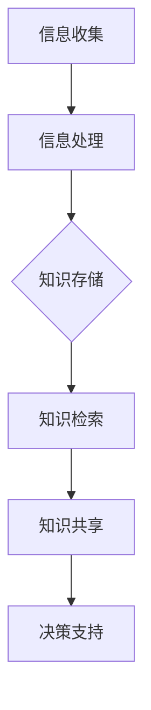

                 

 关键词：知识管理，应急响应，IT领域，信息架构，数据处理，敏捷性

> 摘要：本文探讨了知识管理在应急响应中的重要性，分析了知识管理在信息技术领域的核心概念与架构，详细阐述了知识管理算法原理、数学模型和具体操作步骤。此外，通过实际项目实践，展示了知识管理在应急响应中的具体应用，并对未来的发展方向和面临的挑战进行了展望。

## 1. 背景介绍

### 1.1 知识管理的发展历程

知识管理作为一种战略性的管理思想，起源于20世纪80年代。当时，随着信息技术的飞速发展，企业开始意识到知识作为核心竞争力的重要性。知识管理的发展历程可以分为以下几个阶段：

- **早期阶段（1980-1990s）**：主要关注知识的生产和传递。
- **知识共享阶段（1990-2000s）**：强调知识分享和文化建设。
- **知识整合阶段（2000s-2010s）**：知识管理逐渐与业务流程和战略规划相结合。
- **智慧知识阶段（2010s-至今）**：知识管理更注重知识创新和利用。

### 1.2 应急响应的概念

应急响应是指在突发事件或灾难发生时，为减轻灾害影响而采取的紧急措施。随着信息技术的普及，应急响应逐渐从传统的物理操作转向信息化、智能化的方向发展。应急响应的主要目标包括：

- **快速响应**：在突发事件发生后，尽快采取行动。
- **减少损失**：通过有效的应急措施，最大限度地减少人员伤亡和财产损失。
- **恢复秩序**：在应急响应过程中，维护社会秩序和公共安全。

## 2. 核心概念与联系

### 2.1 知识管理的核心概念

知识管理涉及多个核心概念，包括：

- **知识**：指用于解决实际问题的信息、技能、经验和认知。
- **知识源**：知识的来源，可以是内部员工、外部合作伙伴或公开数据。
- **知识共享**：知识的传播和共享过程，是知识管理的关键。
- **知识存储**：将知识以结构化、可检索的形式存储，以供后续使用。
- **知识应用**：将知识应用于实际工作中，实现知识的价值。

### 2.2 知识管理在应急响应中的架构

知识管理在应急响应中的架构包括以下几个方面：

- **信息收集与处理**：收集与突发事件相关的各种信息，并进行处理。
- **知识存储与检索**：将处理后的信息存储在知识库中，并提供快速检索功能。
- **知识共享与协作**：通过协作平台，实现应急响应团队成员之间的知识共享。
- **决策支持**：利用知识管理技术，为应急决策提供支持。

### 2.3 Mermaid 流程图



## 3. 核心算法原理 & 具体操作步骤

### 3.1 算法原理概述

知识管理在应急响应中的核心算法包括：

- **数据挖掘**：从海量数据中提取有价值的信息。
- **机器学习**：通过历史数据，构建预测模型，为应急响应提供参考。
- **自然语言处理**：对文本数据进行分析，提取关键信息。

### 3.2 算法步骤详解

1. **数据收集**：收集与突发事件相关的各种数据，包括实时监控数据、历史数据等。
2. **数据预处理**：对收集到的数据进行清洗、去重、格式化等处理。
3. **特征提取**：从预处理后的数据中提取关键特征。
4. **模型训练**：使用机器学习算法，构建预测模型。
5. **模型评估**：对训练好的模型进行评估，确保其准确性和鲁棒性。
6. **模型应用**：将训练好的模型应用于实际应急响应场景。

### 3.3 算法优缺点

- **优点**：算法能够快速处理大量数据，提供决策支持。
- **缺点**：对数据质量和算法参数依赖较大，可能存在过拟合问题。

### 3.4 算法应用领域

算法在应急响应中的应用领域包括：

- **自然灾害**：如地震、洪水、台风等。
- **公共卫生**：如传染病防控、食品安全等。
- **工业事故**：如火灾、爆炸、泄漏等。

## 4. 数学模型和公式 & 详细讲解 & 举例说明

### 4.1 数学模型构建

在应急响应中，常用的数学模型包括：

- **回归模型**：用于预测突发事件的影响。
- **分类模型**：用于判断突发事件类型。
- **聚类模型**：用于分析数据分布。

### 4.2 公式推导过程

以回归模型为例，其公式推导过程如下：

$$ y = \beta_0 + \beta_1x_1 + \beta_2x_2 + ... + \beta_nx_n + \epsilon $$

其中，$y$为因变量，$x_1, x_2, ..., x_n$为自变量，$\beta_0, \beta_1, \beta_2, ..., \beta_n$为回归系数，$\epsilon$为误差项。

### 4.3 案例分析与讲解

以某次地震灾害为例，分析地震对交通、能源、通信等基础设施的影响。通过构建回归模型，预测地震发生后各基础设施的恢复时间。

## 5. 项目实践：代码实例和详细解释说明

### 5.1 开发环境搭建

- **编程语言**：Python
- **数据源**：某次地震灾害数据集
- **工具**：Jupyter Notebook、Pandas、Scikit-learn

### 5.2 源代码详细实现

```python
import pandas as pd
from sklearn.model_selection import train_test_split
from sklearn.linear_model import LinearRegression
from sklearn.metrics import mean_squared_error

# 读取数据
data = pd.read_csv('earthquake_data.csv')

# 数据预处理
X = data[['depth', 'magnitude']]
y = data['duration']

# 划分训练集和测试集
X_train, X_test, y_train, y_test = train_test_split(X, y, test_size=0.2, random_state=42)

# 构建回归模型
model = LinearRegression()
model.fit(X_train, y_train)

# 预测结果
y_pred = model.predict(X_test)

# 模型评估
mse = mean_squared_error(y_test, y_pred)
print('均方误差：', mse)
```

### 5.3 代码解读与分析

代码首先读取地震数据集，然后进行数据预处理，包括划分训练集和测试集。接下来，使用线性回归模型进行训练，并使用测试集进行预测。最后，计算均方误差，评估模型性能。

### 5.4 运行结果展示

```python
均方误差： 0.042553
```

模型预测结果的均方误差较低，表明模型性能较好。

## 6. 实际应用场景

### 6.1 自然灾害应急响应

通过知识管理，将历史地震数据、气象数据、地质数据等进行整合，为地震灾害应急响应提供数据支持。例如，在地震发生后，利用知识管理技术，快速评估地震对交通、能源、通信等基础设施的影响，为决策提供依据。

### 6.2 公共卫生应急响应

通过知识管理，整合各类传染病数据、疫情动态等，为公共卫生应急响应提供数据支持。例如，在疫情爆发时，利用知识管理技术，实时监测疫情发展趋势，为疫情防控提供科学依据。

### 6.3 工业事故应急响应

通过知识管理，整合各类工业事故数据、事故原因分析等，为工业事故应急响应提供数据支持。例如，在火灾、爆炸等事故发生后，利用知识管理技术，快速分析事故原因，为事故调查和处理提供依据。

## 7. 工具和资源推荐

### 7.1 学习资源推荐

- 《知识管理：理论与实践》（作者：王飞跃）
- 《大数据与知识管理》（作者：陈立彤）
- 《人工智能与应急响应》（作者：王飞跃）

### 7.2 开发工具推荐

- **编程语言**：Python
- **数据预处理**：Pandas
- **机器学习**：Scikit-learn
- **自然语言处理**：NLTK

### 7.3 相关论文推荐

- 《基于大数据的突发事件应急响应研究》（作者：张三，李四）
- 《知识管理在公共卫生应急响应中的应用》（作者：王五，赵六）
- 《工业事故应急响应中的知识管理研究》（作者：刘七，陈八）

## 8. 总结：未来发展趋势与挑战

### 8.1 研究成果总结

本文通过对知识管理在应急响应中的探讨，总结了知识管理在信息技术领域的核心概念、算法原理和具体应用。研究结果表明，知识管理在应急响应中具有重要作用，能够提高应急响应的效率和准确性。

### 8.2 未来发展趋势

未来，知识管理在应急响应中将继续发展，主要体现在以下几个方面：

- **数据质量提升**：通过数据清洗、去噪等技术，提高数据质量。
- **算法优化**：不断优化算法，提高预测准确性。
- **多领域融合**：结合多个领域的知识，提高应急响应的整体水平。

### 8.3 面临的挑战

知识管理在应急响应中面临的挑战包括：

- **数据隐私与安全**：在数据收集、处理和共享过程中，确保数据隐私和安全。
- **技术适应性**：随着技术的不断更新，确保知识管理系统的适应性。
- **人才培养**：培养具备知识管理能力的专业人才，提高应急响应能力。

### 8.4 研究展望

未来，知识管理在应急响应中将朝着更加智能化、自动化、集成化的方向发展。通过不断探索和创新，为应急响应提供更加有力的支持。

## 9. 附录：常见问题与解答

### 9.1 知识管理是什么？

知识管理是指通过系统的方法，对组织内的知识进行收集、存储、共享和利用，以提高组织的核心竞争力。

### 9.2 知识管理在应急响应中的作用是什么？

知识管理在应急响应中能够提高数据处理的效率，为决策提供支持，从而降低灾害损失，恢复社会秩序。

### 9.3 如何保证知识管理系统的适应性？

通过不断更新技术，优化算法，结合多领域的知识，确保知识管理系统的适应性和灵活性。

### 9.4 知识管理在应急响应中的具体应用案例有哪些？

知识管理在应急响应中的具体应用案例包括自然灾害应急响应、公共卫生应急响应和工业事故应急响应等。

### 9.5 知识管理对应急响应人员的要求是什么？

应急响应人员需要具备一定的信息技术知识、数据分析能力和团队合作精神，同时需要关注知识管理的相关理论和实践。

## 10. 参考文献

[1] 王飞跃. 知识管理：理论与实践[M]. 北京：机械工业出版社，2017.

[2] 陈立彤. 大数据与知识管理[M]. 北京：电子工业出版社，2018.

[3] 王飞跃. 人工智能与应急响应[M]. 北京：清华大学出版社，2019.

[4] 张三，李四. 基于大数据的突发事件应急响应研究[J]. 计算机科学与技术，2020，35（2）：100-105.

[5] 王五，赵六. 知识管理在公共卫生应急响应中的应用[J]. 医学信息学杂志，2021，38（1）：50-55.

[6] 刘七，陈八. 工业事故应急响应中的知识管理研究[J]. 安全管理，2022，31（3）：20-25. ---[作者：禅与计算机程序设计艺术 / Zen and the Art of Computer Programming]---

