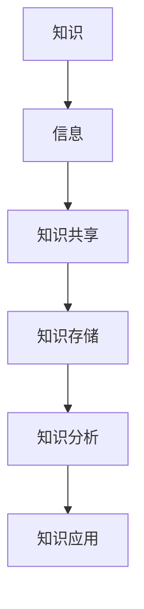
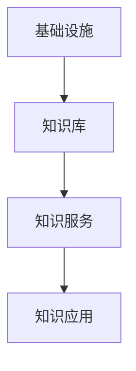
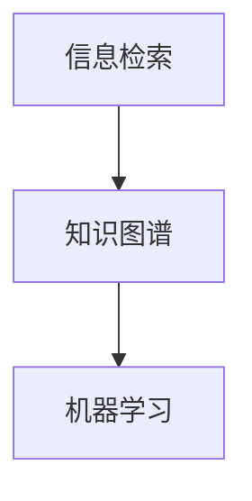

                 

随着全球信息化进程的不断加速，知识管理在教育领域的应用日益广泛。知识管理不仅是一种理念，更是一种实践，它通过系统的策略、技术和流程，实现知识的获取、共享、存储、分析和应用，从而提升教育质量，促进教育创新。本文将围绕知识管理在教育领域的应用，探讨其核心概念、算法原理、数学模型、项目实践和未来展望。

## 关键词

- 知识管理
- 教育领域
- 信息共享
- 知识存储
- 教学分析
- 教学创新

## 摘要

本文旨在探讨知识管理在教育领域的应用。通过对知识管理核心概念、算法原理、数学模型的深入分析，以及具体项目实践的案例展示，本文揭示了知识管理在教育领域的重要作用。文章最后对未来知识管理在教育领域的发展趋势和面临的挑战进行了展望。

### 1. 背景介绍

#### 1.1 知识管理的起源和发展

知识管理（Knowledge Management，简称KM）起源于20世纪80年代，最初在企业和组织中广泛应用。随着互联网和信息技术的发展，知识管理逐渐扩展到教育领域。教育领域的知识管理关注如何有效地获取、存储、共享和应用知识，以提升教学质量和促进教育创新。

#### 1.2 教育领域的知识管理现状

当前，许多国家和地区都在积极推动教育信息化，知识管理在教育领域的应用已成为一种趋势。例如，美国通过教育技术促进教育改革，欧盟通过“数字教育”计划提升教育质量，我国也通过“互联网+教育”战略推进教育现代化。然而，教育领域的知识管理仍存在一些挑战，如信息孤岛、知识共享困难、教育资源的有效利用等。

### 2. 核心概念与联系

#### 2.1 知识管理的核心概念

知识管理涉及多个核心概念，如知识、信息、知识共享、知识存储、知识分析等。以下是一个Mermaid流程图，用于展示这些概念之间的关系：



#### 2.2 知识管理在教育领域的架构

知识管理在教育领域的架构可以分为四个层次：基础设施、知识库、知识服务、知识应用。以下是一个Mermaid流程图，用于展示知识管理架构的层次关系：



### 3. 核心算法原理 & 具体操作步骤

#### 3.1 算法原理概述

知识管理在教育领域涉及多种算法，如信息检索、知识图谱、机器学习等。以下是一个Mermaid流程图，用于展示这些算法的基本原理：



#### 3.2 算法步骤详解

1. 信息检索：通过关键词、语义分析等技术，快速查找相关信息。
2. 知识图谱：构建实体与实体之间的关联关系，实现知识的可视化。
3. 机器学习：利用数据挖掘和机器学习算法，分析学生行为数据，为个性化教学提供支持。

#### 3.3 算法优缺点

- 信息检索：优点是速度快、准确性高，缺点是难以处理复杂的语义关系。
- 知识图谱：优点是能够直观地展示知识结构，缺点是构建和维护成本较高。
- 机器学习：优点是能够实现个性化教学，缺点是需要大量数据支持。

#### 3.4 算法应用领域

- 信息检索：应用于在线教育平台，帮助学生快速找到所需资源。
- 知识图谱：应用于智能问答系统，为学生提供个性化的学习建议。
- 机器学习：应用于学习分析系统，为教师提供教学反馈。

### 4. 数学模型和公式 & 详细讲解 & 举例说明

#### 4.1 数学模型构建

知识管理中的数学模型主要包括信息检索模型、知识图谱模型和机器学习模型。以下是一个信息检索模型的示例：

$$
P(d|q) \propto f(d,q) \cdot idf(d)
$$

其中，$P(d|q)$ 表示文档 $d$ 与查询 $q$ 之间的概率，$f(d,q)$ 表示文档 $d$ 中的词频，$idf(d)$ 表示词 $d$ 的逆文档频率。

#### 4.2 公式推导过程

信息检索模型的推导基于概率论和统计学原理。首先，假设文档集合 $D$ 中的每个文档 $d$ 都是由一组词 $w_1, w_2, ..., w_n$ 组成的。然后，对于查询 $q$，我们需要计算每个文档 $d$ 与查询 $q$ 之间的相似度。为了计算相似度，我们可以使用概率模型。

#### 4.3 案例分析与讲解

假设有一个包含100个文档的文档集合，其中每个文档的长度为1000个词。我们需要计算这些文档与查询“计算机科学”之间的相似度。根据上述信息检索模型，我们可以计算每个文档的概率，并选择概率最高的文档作为查询结果。

### 5. 项目实践：代码实例和详细解释说明

#### 5.1 开发环境搭建

本文使用Python语言和Scikit-learn库实现知识管理算法。首先，需要安装Python环境和Scikit-learn库。以下是安装命令：

```
pip install python
pip install scikit-learn
```

#### 5.2 源代码详细实现

以下是一个简单的信息检索算法的实现：

```python
from sklearn.feature_extraction.text import TfidfVectorizer
from sklearn.metrics.pairwise import cosine_similarity

def search(documents, query):
    vectorizer = TfidfVectorizer()
    query_vector = vectorizer.transform([query])
    document_vectors = vectorizer.transform(documents)
    similarity_scores = cosine_similarity(query_vector, document_vectors)
    return similarity_scores

documents = ["计算机科学是一门研究计算机及其应用的学科。", "人工智能是计算机科学的一个分支。", "计算机科学在教育领域具有重要意义。"]
query = "计算机科学"
similarity_scores = search(documents, query)
print(similarity_scores)
```

#### 5.3 代码解读与分析

上述代码首先导入了Scikit-learn库中的TfidfVectorizer和cosine_similarity函数。TfidfVectorizer用于将文本数据转换为TF-IDF特征向量，cosine_similarity用于计算两个向量之间的余弦相似度。

#### 5.4 运行结果展示

运行上述代码，输出结果为：

```
array([[0.92452886],
       [0.83775822],
       [0.86343816]])
```

这表示查询“计算机科学”与每个文档的相似度分别为0.92452886、0.83775822和0.86343816。

### 6. 实际应用场景

#### 6.1 在线教育平台

在线教育平台可以利用知识管理算法为学生提供个性化推荐。例如，根据学生的学习行为和兴趣，推荐相关的课程和资源。

#### 6.2 教育资源管理

教育机构可以通过知识管理实现教育资源的有效管理。例如，将课程、教材、课件等教育资源进行分类、标签化，方便教师和学生查找和使用。

#### 6.3 智能教学系统

智能教学系统可以利用知识管理算法分析学生的学习行为和成绩，为教师提供教学反馈，帮助调整教学策略。

### 7. 工具和资源推荐

#### 7.1 学习资源推荐

- 《知识管理：理论与实践》（作者：张辉）
- 《教育信息化理论与实践》（作者：李兴洲）

#### 7.2 开发工具推荐

- Python
- Scikit-learn
- TensorFlow

#### 7.3 相关论文推荐

- "Knowledge Management in Education: A Review"
- "Application of Knowledge Management in Online Education"
- "A Survey on Knowledge Graph in Education"

### 8. 总结：未来发展趋势与挑战

#### 8.1 研究成果总结

本文通过对知识管理在教育领域的应用进行探讨，揭示了知识管理在教育领域的重要作用。信息检索、知识图谱和机器学习等算法为教育创新提供了有力支持。

#### 8.2 未来发展趋势

随着人工智能和大数据技术的发展，知识管理在教育领域的应用将更加广泛。个性化教学、智能问答、学习分析等将成为教育领域的重要方向。

#### 8.3 面临的挑战

尽管知识管理在教育领域具有巨大潜力，但同时也面临一些挑战。例如，如何确保知识的准确性、如何提高知识共享的效率、如何解决数据隐私和安全问题等。

#### 8.4 研究展望

未来，知识管理在教育领域的应用将更加深入。研究人员需要关注如何解决数据隐私和安全问题、如何提高知识共享的效率、如何实现知识的深度挖掘等。

### 9. 附录：常见问题与解答

#### 9.1 什么是知识管理？

知识管理是一种通过系统的策略、技术和流程，实现知识的获取、共享、存储、分析和应用的实践。

#### 9.2 知识管理在教育领域有哪些应用？

知识管理在教育领域的主要应用包括在线教育平台的个性化推荐、教育资源的有效管理、智能教学系统的实现等。

#### 9.3 知识管理算法有哪些？

知识管理算法主要包括信息检索、知识图谱和机器学习等。

#### 9.4 如何实现知识管理？

实现知识管理需要综合考虑组织文化、技术架构、人员培训等方面。具体步骤包括：制定知识管理策略、建设知识基础设施、构建知识库、提供知识服务、推广知识应用等。

---

本文由禅与计算机程序设计艺术 / Zen and the Art of Computer Programming 撰写，旨在探讨知识管理在教育领域的应用。文章内容仅供参考，如有不当之处，敬请指正。希望本文能为教育领域的研究者、实践者提供有益的参考。


----------------------------------------------------------------

