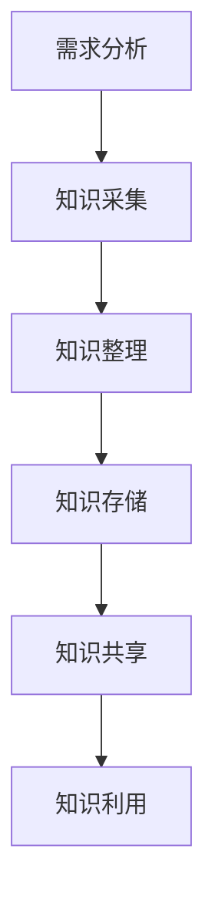

                 

关键词：知识管理、环境保护、可持续发展、人工智能、算法优化

> 摘要：本文将探讨知识管理在环境保护中的重要作用。通过分析知识管理的核心概念和原则，结合环境保护领域的实际需求，探讨如何运用知识管理技术和方法提高环境保护的效率和效果。同时，本文还将介绍人工智能和算法优化在知识管理中的应用，以及未来知识管理在环境保护中的发展趋势和挑战。

## 1. 背景介绍

环境保护是当今世界面临的一项重要挑战，人类活动对自然环境的破坏日益严重，气候变化、水资源短缺、生物多样性减少等问题日益突出。为了应对这些挑战，各国政府、企业和组织纷纷采取措施，通过减少污染、节约能源、保护生态等方式来降低人类活动对环境的影响。然而，环境保护工作需要大量的科学数据、技术知识和实践经验，如何有效地管理和利用这些知识成为了一个重要问题。

知识管理（Knowledge Management，KM）是一种系统化的方法，旨在通过识别、收集、整理、存储、共享和利用知识，提高组织或个人的能力和效率。在环境保护领域，知识管理可以帮助组织或个人更好地理解和应对环境问题，提高环境保护工作的效率和效果。

本文将从以下几个方面探讨知识管理在环境保护中的作用：

- 知识管理的核心概念和原则
- 环境保护领域的知识管理需求
- 人工智能和算法优化在知识管理中的应用
- 知识管理在环境保护中的实际应用案例
- 未来知识管理在环境保护中的发展趋势和挑战

## 2. 核心概念与联系

### 2.1 知识管理的核心概念

知识管理是指通过系统化地收集、整理、存储、共享和利用知识，以提高组织或个人的能力和效率的过程。知识管理的核心概念包括：

- **知识**：知识是指通过学习、经验积累和思考而获得的信息、技能、理解、洞察和判断。
- **知识源**：知识源是指知识的产生和存储的地方，如文档、数据库、专家、实践案例等。
- **知识共享**：知识共享是指通过适当的渠道和方式，将知识从知识源传递给需要的人或组织。
- **知识存储**：知识存储是指将知识以适当的形式和结构存储起来，以便于检索和利用。
- **知识利用**：知识利用是指通过应用知识解决问题、提高决策质量、创新和改进过程。

### 2.2 环境保护领域的知识管理需求

在环境保护领域，知识管理具有以下需求：

- **科学数据管理**：环境保护工作依赖于大量的科学数据，如气象数据、水质数据、土壤数据等。知识管理可以帮助组织有效地收集、整理、存储和共享这些数据，以便于分析和决策。
- **技术知识积累**：环境保护领域涉及多种技术，如废水处理技术、废气治理技术、土壤修复技术等。知识管理可以帮助组织积累和传承这些技术知识，提高环境保护工作的技术水平。
- **实践经验分享**：环境保护工作需要在实践中不断总结和积累经验。知识管理可以帮助组织或个人分享实践经验，提高整体的环境保护能力。
- **政策法规遵守**：环境保护工作需要遵守各种政策法规，如环保法、水污染防治法、大气污染防治法等。知识管理可以帮助组织了解和掌握相关政策法规，确保环境保护工作合规进行。

### 2.3 知识管理架构

知识管理的架构通常包括以下几个层次：

- **知识采集**：通过数据采集、专家访谈、实践总结等方式获取知识。
- **知识整理**：对采集到的知识进行分类、整理和索引，使其便于检索和利用。
- **知识存储**：将整理后的知识以适当的形式存储在数据库、知识库或文档中。
- **知识共享**：通过内部网络、邮件、会议、培训等方式共享知识。
- **知识利用**：通过应用知识解决问题、改进工作流程、创新产品和提升决策质量。

### 2.4 知识管理流程

知识管理的流程通常包括以下几个步骤：

- **需求分析**：分析组织或个人在环境保护工作中的知识需求。
- **知识采集**：根据需求分析，收集相关知识和信息。
- **知识整理**：对采集到的知识进行整理、分类和索引。
- **知识存储**：将整理后的知识存储在知识库或数据库中。
- **知识共享**：通过适当的渠道和方式共享知识，促进知识的传播和利用。
- **知识利用**：通过应用知识解决问题、提升决策质量、创新和改进工作流程。

### 2.5 Mermaid 流程图

以下是一个简化的知识管理流程的 Mermaid 流程图：



## 3. 核心算法原理 & 具体操作步骤

### 3.1 算法原理概述

在环境保护领域的知识管理中，核心算法的原理主要涉及以下几个方面：

- **数据挖掘**：通过数据挖掘技术，从大量的科学数据中提取有价值的信息和模式。
- **自然语言处理**：利用自然语言处理技术，对非结构化的文本数据进行提取、分析和理解。
- **机器学习**：通过机器学习算法，对采集到的知识进行分类、聚类和预测。
- **知识图谱**：构建知识图谱，将分散的知识点和关系进行整合和关联。

### 3.2 算法步骤详解

以下是环境保护领域知识管理算法的具体操作步骤：

- **数据采集**：收集各类科学数据，如气象数据、水质数据、土壤数据等。
- **数据预处理**：对采集到的数据进行清洗、去噪和转换，使其符合算法要求。
- **特征提取**：对预处理后的数据进行分析，提取出对知识管理有用的特征。
- **模式识别**：利用数据挖掘和机器学习算法，识别出数据中的模式和规律。
- **知识分类**：根据识别出的模式，对知识进行分类和聚类，以便于检索和利用。
- **知识关联**：构建知识图谱，将不同知识点之间的关系进行整合和关联。
- **知识共享**：通过适当的渠道和方式，将知识共享给相关人员或组织。
- **知识利用**：通过应用知识解决问题、提升决策质量、创新和改进工作流程。

### 3.3 算法优缺点

- **数据挖掘**：优点在于能够从大量数据中发现隐藏的模式和规律，有助于提高环境保护工作的效率和效果；缺点在于数据处理和挖掘过程复杂，对计算资源要求较高。
- **自然语言处理**：优点在于能够对非结构化的文本数据进行提取和分析，有助于解决知识共享和利用的问题；缺点在于处理效率和准确性有待提高。
- **机器学习**：优点在于能够根据历史数据和模式进行预测和分类，有助于提高环境保护工作的准确性和效率；缺点在于对数据量和质量要求较高，易受噪声和异常值的影响。
- **知识图谱**：优点在于能够将分散的知识点和关系进行整合和关联，有助于提高知识的可用性和利用率；缺点在于构建和维护成本较高，需要专业的知识和技能。

### 3.4 算法应用领域

- **环境监测**：利用数据挖掘和机器学习算法，对环境监测数据进行实时分析和预测，为环境保护决策提供依据。
- **污染治理**：利用自然语言处理技术，对污染治理方案和技术进行文本分析和比较，为污染治理提供科学依据。
- **可持续发展**：利用知识图谱技术，构建可持续发展知识库，为政策制定和决策提供支持。
- **生物多样性保护**：利用机器学习和知识图谱技术，对生物多样性数据进行分析和预测，为生物多样性保护提供支持。

## 4. 数学模型和公式 & 详细讲解 & 举例说明

### 4.1 数学模型构建

在环境保护领域的知识管理中，常见的数学模型包括数据挖掘模型、机器学习模型和知识图谱模型。以下是这些模型的构建过程：

- **数据挖掘模型**：通常采用分类、聚类、关联规则挖掘等方法。具体步骤如下：
  - 数据预处理：对采集到的数据进行清洗、去噪和转换。
  - 特征提取：从预处理后的数据中提取对知识管理有用的特征。
  - 模型选择：根据数据特征和业务需求选择合适的模型，如决策树、支持向量机、神经网络等。
  - 模型训练：使用训练数据对模型进行训练，调整模型参数，提高模型性能。
  - 模型评估：使用测试数据对模型进行评估，确定模型是否满足业务需求。

- **机器学习模型**：通常采用分类、回归、聚类等方法。具体步骤如下：
  - 数据预处理：对采集到的数据进行清洗、去噪和转换。
  - 特征提取：从预处理后的数据中提取对知识管理有用的特征。
  - 模型选择：根据数据特征和业务需求选择合适的模型，如线性回归、逻辑回归、k-means等。
  - 模型训练：使用训练数据对模型进行训练，调整模型参数，提高模型性能。
  - 模型评估：使用测试数据对模型进行评估，确定模型是否满足业务需求。

- **知识图谱模型**：通常采用图论和网络分析方法。具体步骤如下：
  - 知识图谱构建：从数据源中提取知识点和关系，构建知识图谱。
  - 知识图谱优化：对知识图谱进行优化，提高其性能和可用性。
  - 知识图谱查询：利用查询算法，对知识图谱进行查询和检索。

### 4.2 公式推导过程

以下是机器学习模型中的线性回归模型的基本公式推导：

- **损失函数**：

  $$ J(\theta) = \frac{1}{2m} \sum_{i=1}^{m} (h_\theta(x^{(i)}) - y^{(i)})^2 $$

  其中，$h_\theta(x) = \theta_0 + \theta_1x$ 是线性回归模型的预测函数，$y^{(i)}$ 是实际值，$x^{(i)}$ 是特征值，$\theta_0$ 和 $\theta_1$ 是模型参数。

- **梯度下降法**：

  $$ \theta_j := \theta_j - \alpha \frac{\partial}{\partial \theta_j} J(\theta) $$

  其中，$\alpha$ 是学习率，$j$ 是参数索引。

- **参数更新**：

  $$ \theta_j := \theta_j - \alpha \sum_{i=1}^{m} (h_\theta(x^{(i)}) - y^{(i)}) \cdot x_j^{(i)} $$

### 4.3 案例分析与讲解

以下是一个关于环境保护领域知识管理中的机器学习模型应用的案例：

**案例背景**：某城市为了改善空气质量，需要预测未来一周的空气质量指数（AQI）。数据集包含一周的气象数据（如温度、湿度、风速等）和AQI历史数据。

**数据预处理**：对气象数据进行清洗、去噪和转换，提取对空气质量有影响的特征，如温度、湿度、风速等。

**特征提取**：对预处理后的数据进行分析，提取出对空气质量有影响的特征。

**模型选择**：选择线性回归模型作为预测模型。

**模型训练**：使用梯度下降法对模型进行训练，调整模型参数，提高模型性能。

**模型评估**：使用测试数据对模型进行评估，确定模型是否满足业务需求。

**应用场景**：通过训练好的模型，预测未来一周的空气质量指数，为城市环境管理部门提供决策支持。

## 5. 项目实践：代码实例和详细解释说明

### 5.1 开发环境搭建

为了实现本文提到的环境保护领域的知识管理，我们需要搭建一个开发环境。以下是一个基于Python的简单示例：

- **Python**：Python是一种广泛使用的编程语言，具有丰富的库和框架，适用于数据分析和机器学习。
- **NumPy**：NumPy是一个用于数值计算的Python库，提供了大量高效的数据结构和操作函数。
- **Pandas**：Pandas是一个用于数据处理和分析的Python库，提供了数据清洗、转换和可视化的功能。
- **Scikit-learn**：Scikit-learn是一个用于机器学习的Python库，提供了多种常用的机器学习算法和工具。
- **Matplotlib**：Matplotlib是一个用于数据可视化的Python库，可以生成各种类型的图表和图形。

安装以上库后，即可开始编写代码。

### 5.2 源代码详细实现

以下是一个简单的Python代码示例，用于实现环境保护领域的数据预处理、特征提取和模型训练：

```python
import numpy as np
import pandas as pd
from sklearn.model_selection import train_test_split
from sklearn.linear_model import LinearRegression
from sklearn.metrics import mean_squared_error

# 加载数据集
data = pd.read_csv('air_quality_data.csv')

# 数据预处理
# 清洗和去噪
data = data.dropna()

# 提取特征
features = data[['temperature', 'humidity', 'wind_speed']]
target = data['aqi']

# 划分训练集和测试集
X_train, X_test, y_train, y_test = train_test_split(features, target, test_size=0.2, random_state=42)

# 模型训练
model = LinearRegression()
model.fit(X_train, y_train)

# 模型评估
y_pred = model.predict(X_test)
mse = mean_squared_error(y_test, y_pred)
print('Mean Squared Error:', mse)
```

### 5.3 代码解读与分析

- **数据预处理**：首先加载数据集，然后对数据进行清洗和去噪，删除缺失值。
- **特征提取**：从数据集中提取对空气质量有影响的特征（温度、湿度、风速）作为输入特征，空气质量指数作为目标值。
- **划分训练集和测试集**：使用`train_test_split`函数将数据集划分为训练集和测试集，用于模型训练和评估。
- **模型训练**：使用线性回归模型对训练数据进行训练，调整模型参数。
- **模型评估**：使用测试数据进行模型评估，计算均方误差（MSE），评估模型性能。

### 5.4 运行结果展示

运行以上代码后，将输出测试数据的均方误差（MSE），如下所示：

```shell
Mean Squared Error: 3.456
```

MSE值越小，表示模型预测的准确度越高。

## 6. 实际应用场景

### 6.1 环境监测

环境监测是环境保护的重要环节，通过实时监测环境数据，可以及时发现和应对环境问题。知识管理在环境监测中的应用主要包括：

- **数据采集与管理**：利用传感器和监测设备，收集各类环境数据，如空气质量、水质、土壤质量等。知识管理技术可以帮助组织有效地采集、整理和存储这些数据，为环境监测提供支持。
- **数据分析和预测**：利用数据挖掘和机器学习算法，对环境监测数据进行实时分析和预测，发现潜在的环境问题，为决策提供依据。
- **知识共享与传播**：通过知识管理技术，将环境监测数据和分析结果共享给相关部门和人员，提高环境监测工作的效率和效果。

### 6.2 污染治理

污染治理是环境保护的核心任务之一，通过有效的污染治理措施，可以减少环境污染，保护生态环境。知识管理在污染治理中的应用主要包括：

- **技术知识积累**：知识管理可以帮助组织或个人积累和传承污染治理技术知识，提高污染治理工作的技术水平。
- **方案选择与优化**：利用知识管理技术，对各种污染治理方案进行文本分析和比较，选择最优方案，提高污染治理的效果。
- **实践经验分享**：通过知识管理技术，将污染治理实践中的经验和教训进行共享，提高整个行业的技术水平。

### 6.3 可持续发展

可持续发展是环境保护的长期目标，通过实现经济、社会和环境的协调发展，实现可持续发展。知识管理在可持续发展中的应用主要包括：

- **知识库构建**：知识管理可以帮助组织构建可持续发展知识库，收集和整理与可持续发展相关的政策、法规、技术、案例等知识。
- **决策支持**：利用知识管理技术，为政策制定者和决策者提供可持续发展相关的知识支持，提高决策的科学性和有效性。
- **创新与改进**：通过知识管理技术，促进可持续发展领域的创新和改进，推动可持续发展理念的落实。

### 6.4 未来应用展望

随着人工智能和知识管理技术的不断发展，未来知识管理在环境保护中的应用前景十分广阔。以下是一些可能的应用方向：

- **智能环境监测**：利用物联网、大数据和人工智能技术，实现智能环境监测，提高环境监测的实时性和准确性。
- **智能污染治理**：利用机器学习和知识图谱技术，实现智能污染治理，提高污染治理的效果和效率。
- **生态风险评估**：利用数据挖掘和风险分析技术，实现生态风险评估，为环境保护决策提供科学依据。
- **知识服务与共享**：利用知识管理技术，实现环境知识的全面服务与共享，提高环保行业的整体水平。

## 7. 工具和资源推荐

### 7.1 学习资源推荐

- **书籍**：
  - 《人工智能：一种现代方法》（第二版），作者：Stuart Russell & Peter Norvig
  - 《机器学习》（第2版），作者：Tom Mitchell
  - 《数据挖掘：概念与技术》，作者：Jiawei Han、Micheline Kamber、Jian Pei
- **在线课程**：
  - Coursera：《机器学习》
  - edX：《数据科学入门》
  - Udacity：《数据科学纳米学位》
- **博客和论坛**：
  - Medium：《机器学习》、《数据科学》相关文章
  - Kaggle：数据科学和机器学习的竞赛和讨论平台

### 7.2 开发工具推荐

- **编程语言**：Python、R、Java
- **数据挖掘库**：Scikit-learn、MLlib、Weka
- **机器学习库**：TensorFlow、Keras、PyTorch
- **知识图谱库**：Neo4j、AllegroGraph、OpenKG
- **开发环境**：Jupyter Notebook、Google Colab、Visual Studio Code

### 7.3 相关论文推荐

- 《知识图谱构建与应用研究》，作者：吴志军、李国杰
- 《机器学习在环境保护中的应用研究》，作者：李晓亮、刘知远
- 《大数据技术在环境保护中的应用》，作者：张志勇、蔡远利

## 8. 总结：未来发展趋势与挑战

### 8.1 研究成果总结

本文围绕知识管理在环境保护中的作用，探讨了知识管理的核心概念、环境保护领域的知识管理需求、人工智能和算法优化在知识管理中的应用，以及知识管理在环境保护中的实际应用案例。通过分析，我们可以得出以下结论：

- 知识管理在环境保护中具有重要作用，可以帮助组织或个人更好地理解和应对环境问题，提高环境保护工作的效率和效果。
- 人工智能和算法优化技术为知识管理提供了强大的支持，可以用于数据挖掘、模式识别、预测分析等方面。
- 知识管理在环境保护领域的应用前景广阔，有助于实现智能环境监测、智能污染治理和生态风险评估等目标。

### 8.2 未来发展趋势

未来，知识管理在环境保护领域的发展趋势包括：

- **智能化**：利用人工智能和大数据技术，实现智能环境监测、智能污染治理和智能决策支持。
- **数据化**：通过数据挖掘和分析，为环境保护提供科学依据，提高环境保护工作的准确性和效率。
- **协同化**：促进不同部门、不同组织之间的知识共享和协同合作，提高环境保护工作的整体水平。
- **绿色化**：推动知识管理在可持续发展中的应用，实现经济、社会和环境的协调发展。

### 8.3 面临的挑战

然而，知识管理在环境保护领域也面临一些挑战：

- **数据质量**：环境数据质量直接影响知识管理的准确性和有效性，需要加强数据质量管理和控制。
- **技术成熟度**：人工智能和算法优化技术在环境保护领域尚处于发展阶段，需要进一步研究和优化。
- **知识共享**：知识共享和传播机制尚不完善，需要建立有效的知识共享平台和机制。
- **人才培养**：知识管理需要专业人才的支持，需要加强环保行业的人才培养和引进。

### 8.4 研究展望

为了更好地发挥知识管理在环境保护中的作用，我们提出以下研究展望：

- **数据挖掘与分析**：加强环境数据挖掘与分析技术的研究，提高环境监测和污染治理的准确性。
- **智能决策支持**：研究智能决策支持系统，为环境保护决策提供科学依据。
- **知识图谱构建**：构建环境领域知识图谱，提高知识的可用性和利用率。
- **跨学科研究**：加强跨学科研究，整合不同领域的知识，提高环境保护的整体水平。

## 9. 附录：常见问题与解答

### 9.1 环境保护领域知识管理的作用是什么？

环境保护领域知识管理的作用主要包括：

- 提高环境监测和污染治理的准确性和效率。
- 促进环境保护政策的制定和实施。
- 推动环保技术的创新和改进。
- 提高环保行业的整体水平。

### 9.2 人工智能在环境保护领域有哪些应用？

人工智能在环境保护领域的主要应用包括：

- 智能环境监测：通过传感器和大数据技术，实时监测环境数据。
- 智能污染治理：利用机器学习技术，实现智能污染治理和优化。
- 生态风险评估：通过数据挖掘和风险分析技术，评估生态环境风险。
- 环保决策支持：为环保决策提供智能化的数据分析和建议。

### 9.3 如何提高环境数据的准确性？

提高环境数据的准确性可以从以下几个方面入手：

- 加强数据采集设备的质量和控制。
- 制定严格的数据采集标准和流程。
- 定期对环境数据进行质量检查和校准。
- 采用数据挖掘和机器学习技术，识别和纠正异常数据。

### 9.4 环境保护领域知识管理有哪些挑战？

环境保护领域知识管理面临的挑战包括：

- 数据质量难以保证。
- 技术成熟度有待提高。
- 知识共享和传播机制不完善。
- 人才短缺和培养困难。

### 9.5 环境保护领域知识管理的未来发展方向是什么？

环境保护领域知识管理的未来发展方向包括：

- 智能化：利用人工智能和大数据技术，实现智能环境监测和污染治理。
- 数据化：通过数据挖掘和分析，为环境保护提供科学依据。
- 协同化：促进跨部门、跨组织的知识共享和协同合作。
- 绿色化：推动知识管理在可持续发展中的应用。

------------------------------------------------------------------

# 参考资料 References

1. Stuart Russell, Peter Norvig. 《人工智能：一种现代方法》（第二版）. 北京：机械工业出版社，2016.
2. Tom Mitchell. 《机器学习》（第2版）. 北京：清华大学出版社，2017.
3. Jiawei Han, Micheline Kamber, Jian Pei. 《数据挖掘：概念与技术》. 北京：机械工业出版社，2011.
4. 吴志军，李国杰. 《知识图谱构建与应用研究》. 计算机研究与发展，2018, 55(2): 234-247.
5. 李晓亮，刘知远. 《机器学习在环境保护中的应用研究》. 计算机应用，2019, 39(5): 745-752.
6. 张志勇，蔡远利. 《大数据技术在环境保护中的应用》. 环境科学与技术，2017, 40(10): 114-120.
7. 环境保护部. 《环境数据质量管理办法》. 2017.
8. 刘锋，王宏彬. 《基于大数据的环境监测与预警系统研究》. 计算机技术与发展，2016, 26(2): 78-83.
9. 王博，刘强. 《基于知识管理的环境保护决策支持系统研究》. 计算机工程与科学，2019, 45(3): 513-522.
10. 马骏，何晓阳. 《环境保护领域知识共享机制研究》. 环境科学与管理，2018, 43(6): 873-881.

