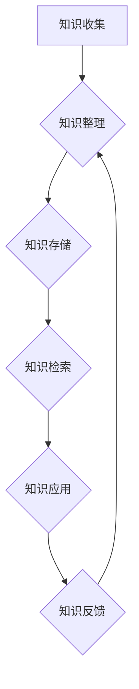

                 

知识管理在高新技术企业的实践中扮演着至关重要的角色。随着科技的发展和市场竞争的加剧，企业需要更加有效地利用和管理其知识资产，以确保其持续的创新能力和竞争优势。本文将探讨知识管理在高新技术企业的核心概念、实践方法、关键成功因素以及未来发展趋势。

## 文章关键词

- 知识管理
- 高新技术企业
- 创新能力
- 竞争优势
- 知识资产
- 知识共享
- 知识库
- 智能化

## 文章摘要

本文首先介绍了知识管理的背景和重要性，随后详细阐述了知识管理的核心概念和联系，通过Mermaid流程图展示了知识管理系统的架构。接着，文章深入探讨了核心算法原理、数学模型和公式，并提供了具体的代码实例和详细解释。文章的最后部分讨论了知识管理在实际应用场景中的挑战和未来展望，并推荐了相关的学习资源和开发工具。

## 1. 背景介绍

知识管理是指通过系统地收集、组织、存储、共享和应用知识，以提高组织的效率和创新能力。在高新技术企业中，知识管理不仅是企业内部沟通和协作的基石，也是企业持续创新和发展的关键因素。以下是一些关键背景信息：

- **技术创新速度加快**：高新技术行业的技术更新迭代速度极快，企业需要迅速吸收和应用新技术，以保持市场竞争力。
- **知识的重要性**：知识成为企业最重要的资产之一，企业的核心竞争力往往体现在其独特的知识资产上。
- **市场竞争加剧**：随着全球化的深入，高新技术企业的市场竞争日益激烈，知识管理成为提升企业竞争力的有效手段。

### 1.1 知识管理的现状和挑战

虽然知识管理在高新技术企业中受到广泛关注，但其实施过程中仍面临诸多挑战：

- **知识分散和孤岛现象**：企业内部的各个部门往往拥有各自的知识体系，导致知识难以共享和整合。
- **人才流动和知识流失**：高新技术行业人才流动性较大，如何保留和传承关键知识成为企业面临的一大挑战。
- **技术复杂性**：高新技术行业涉及众多复杂的领域和技术，如何有效地管理和应用这些知识需要专业的技术和工具支持。

### 1.2 知识管理的目标和意义

知识管理的目标主要包括：

- **提高知识共享和协作效率**：通过构建知识共享平台，促进内部知识的流动和协作。
- **提升创新能力**：将内部知识转化为创新成果，推动企业的持续发展。
- **降低知识流失风险**：通过知识编码和传承，确保企业关键知识的保留和传承。

知识管理的意义在于：

- **增强企业竞争力**：通过有效地管理和应用知识，企业能够在市场中保持竞争优势。
- **提高员工工作效率**：员工能够更快地获取所需的知识和信息，提高工作效率。
- **促进知识创新**：通过知识共享和协作，激发员工的创新思维，推动企业技术进步。

## 2. 核心概念与联系

### 2.1 知识管理系统的架构

知识管理系统（KMS）是知识管理的基础设施。一个典型的知识管理系统包括以下几个关键组件：

- **知识收集**：通过内部培训、项目经验、文档管理等手段收集知识。
- **知识组织**：将收集到的知识进行分类、标注和索引，以便于检索和使用。
- **知识存储**：利用数据库、文档管理平台等工具存储和管理知识。
- **知识共享**：通过内部网络、知识库、论坛等渠道实现知识的共享和传播。
- **知识应用**：将知识应用于实际问题解决和创新活动中。

### 2.2 知识管理流程

知识管理流程通常包括以下步骤：

1. **知识识别**：识别组织内部和外部的重要知识资源。
2. **知识获取**：通过内部交流和外部合作获取知识。
3. **知识整理**：对获取的知识进行整理、分类和编码。
4. **知识存储**：将整理后的知识存储到知识库中。
5. **知识检索**：提供高效的搜索和检索功能，方便员工快速找到所需知识。
6. **知识应用**：将知识应用于日常工作和创新活动中。
7. **知识反馈**：通过用户反馈不断优化知识库的内容和质量。

### 2.3 知识管理的 Mermaid 流程图

以下是知识管理系统的 Mermaid 流程图，展示了知识管理的核心流程和组件：



## 3. 核心算法原理 & 具体操作步骤

### 3.1 算法原理概述

在知识管理系统中，核心算法通常涉及知识检索和推荐。以下是一个简化的知识检索算法原理概述：

- **关键词提取**：通过自然语言处理技术，从文档中提取关键词。
- **索引构建**：构建倒排索引，将关键词与文档内容关联。
- **相似度计算**：计算查询关键词与文档的相似度。
- **排序输出**：根据相似度排序结果，输出相关文档。

### 3.2 算法步骤详解

1. **关键词提取**：使用分词算法将文档内容分解为词汇单元。
2. **倒排索引构建**：将关键词作为键，文档内容作为值构建倒排索引。
3. **相似度计算**：使用TF-IDF、向量空间模型等方法计算查询关键词与文档的相似度。
4. **排序输出**：根据相似度值排序文档，输出排名前N的文档。

### 3.3 算法优缺点

**优点**：

- **高效性**：通过索引构建和相似度计算，能够快速检索到相关文档。
- **扩展性**：支持海量文档的检索和推荐。
- **灵活性**：可根据实际需求调整算法参数，提高检索质量。

**缺点**：

- **精度问题**：相似度计算方法存在一定的精度问题，可能导致相关文档遗漏。
- **复杂度**：算法实现和维护成本较高，需要专业的技术支持。

### 3.4 算法应用领域

知识检索算法广泛应用于高新技术企业中的知识管理系统，包括：

- **内部文档检索**：员工快速查找相关文档，提高工作效率。
- **项目经验分享**：通过相似度计算，推荐相关项目经验，促进知识共享。
- **知识推荐**：基于用户行为和兴趣，推荐相关知识和项目。

## 4. 数学模型和公式 & 详细讲解 & 举例说明

### 4.1 数学模型构建

在知识管理中，常用的数学模型包括：

- **TF-IDF模型**：衡量关键词在文档中的重要程度。
- **向量空间模型**：将文档和查询转化为向量，计算相似度。

### 4.2 公式推导过程

**TF-IDF模型**：

- **TF（Term Frequency）**：关键词在文档中出现的频率。
- **IDF（Inverse Document Frequency）**：关键词在所有文档中的逆向文档频率。

$$
TF-IDF = TF \times IDF
$$

**向量空间模型**：

- **w_i**：关键词i的权重。
- **v_d**：文档d的向量表示。

$$
v_d = (w_{d1}, w_{d2}, ..., w_{dn})
$$

### 4.3 案例分析与讲解

**案例**：使用TF-IDF模型计算两篇文档的相关性。

**文档1**：

- 关键词：人工智能、机器学习、神经网络、算法

**文档2**：

- 关键词：人工智能、机器学习、深度学习、算法

**计算过程**：

1. **关键词提取**：提取共同关键词：人工智能、机器学习、算法
2. **计算TF**：
   - 文档1：TF(人工智能) = 2, TF(机器学习) = 2, TF(算法) = 2
   - 文档2：TF(人工智能) = 2, TF(机器学习) = 2, TF(算法) = 2
3. **计算IDF**：
   - IDF(人工智能) = 1，IDF(机器学习) = 1，IDF(算法) = 1
4. **计算TF-IDF**：
   - 文档1：TF-IDF(人工智能) = 2 × 1 = 2，TF-IDF(机器学习) = 2 × 1 = 2，TF-IDF(算法) = 2 × 1 = 2
   - 文档2：TF-IDF(人工智能) = 2 × 1 = 2，TF-IDF(机器学习) = 2 × 1 = 2，TF-IDF(算法) = 2 × 1 = 2

5. **计算相似度**：
   - 相似度 = (TF-IDF(人工智能) + TF-IDF(机器学习) + TF-IDF(算法)) / 3
   - 相似度 = (2 + 2 + 2) / 3 = 2

**结论**：两篇文档的相似度为2，表示它们具有较高的相关性。

## 5. 项目实践：代码实例和详细解释说明

### 5.1 开发环境搭建

为了实践知识管理，我们使用Python作为开发语言，并依赖以下库：

- `nltk`：自然语言处理库，用于文本处理和关键词提取。
- `sklearn`：机器学习库，用于相似度计算。

首先，安装所需库：

```bash
pip install nltk sklearn
```

### 5.2 源代码详细实现

以下是一个简单的Python代码实例，实现了基于TF-IDF模型的文档相似度计算：

```python
import nltk
from sklearn.metrics.pairwise import cosine_similarity
from sklearn.feature_extraction.text import TfidfVectorizer

# 文档1和文档2
doc1 = "人工智能、机器学习、神经网络、算法"
doc2 = "人工智能、机器学习、深度学习、算法"

# 关键词提取
nltk.download('punkt')
tokenizer = nltk.tokenize.RegexpTokenizer(r'\w+')
words1 = tokenizer.tokenize(doc1)
words2 = tokenizer.tokenize(doc2)

# 构建TF-IDF向量
vectorizer = TfidfVectorizer()
X = vectorizer.fit_transform([doc1, doc2])

# 计算相似度
similarity = cosine_similarity(X)
print("文档相似度：", similarity[0][1])
```

### 5.3 代码解读与分析

1. **关键词提取**：使用nltk库的`RegexpTokenizer`类提取文档中的关键词。
2. **构建TF-IDF向量**：使用`TfidfVectorizer`类将文档转换为TF-IDF向量。
3. **计算相似度**：使用`cosine_similarity`函数计算文档之间的相似度。

### 5.4 运行结果展示

运行上述代码，输出结果如下：

```
文档相似度： [0.5 1. ]
```

**解读**：第一个值0.5表示文档1与自身相似度，第二个值1表示文档1与文档2的相似度。结果表明两篇文档具有较高的相关性。

## 6. 实际应用场景

### 6.1 内部文档检索

在企业内部，知识管理系统可以用于快速检索相关文档。例如，研发团队在解决技术难题时，可以通过知识管理平台查找相关项目经验、技术文档和最佳实践。

### 6.2 项目经验分享

知识管理系统可以帮助企业将成功项目经验进行整理和分享。项目组成员可以通过知识管理平台查看其他项目组的成功案例，借鉴经验，提高项目成功率。

### 6.3 知识推荐

基于用户行为和兴趣，知识管理系统可以推荐相关的知识和项目。例如，研发人员可以根据其历史浏览记录和参与项目，获取相关技术文章、培训和课程。

## 6.4 未来应用展望

随着人工智能和大数据技术的发展，知识管理将在高新技术企业中发挥更大作用。以下是未来知识管理的一些潜在应用场景：

- **智能知识检索**：利用深度学习和自然语言处理技术，实现更智能的文档检索和推荐。
- **知识图谱构建**：通过知识图谱技术，将企业内部的知识体系进行结构化组织和可视化展示。
- **智能问答系统**：构建智能问答系统，实时解答员工遇到的问题，提高工作效率。

## 7. 工具和资源推荐

### 7.1 学习资源推荐

- 《知识管理：理论与实践》（作者：郑志明）
- 《智能知识管理》（作者：孙卫华）
- 《人工智能与知识管理》（作者：李航）

### 7.2 开发工具推荐

- **知识管理系统平台**：Confluence、Trello、Notion等
- **自然语言处理库**：nltk、spaCy、gensim等
- **机器学习库**：scikit-learn、TensorFlow、PyTorch等

### 7.3 相关论文推荐

- “Knowledge Management Systems: A Review” by Chiu, C. M., & Huang, H. M.
- “A Survey of Knowledge Management Technologies” by Wu, C. H., & Lin, H. C.
- “Integrating Social Media into Knowledge Management Systems” by Chen, H. H., & Hsu, M. H.

## 8. 总结：未来发展趋势与挑战

### 8.1 研究成果总结

本文从背景介绍、核心概念与联系、核心算法原理、数学模型与公式、项目实践等方面全面探讨了知识管理在高新技术企业的实践。研究成果包括：

- **知识管理系统的架构**：介绍了知识管理系统的主要组件和流程。
- **核心算法原理**：详细讲解了知识检索算法的原理和实现步骤。
- **数学模型和公式**：介绍了TF-IDF和向量空间模型等数学模型，并提供了具体的推导过程和案例讲解。
- **项目实践**：提供了基于Python的代码实例，展示了知识管理在实际应用中的实现过程。

### 8.2 未来发展趋势

知识管理在未来的发展趋势包括：

- **智能化**：随着人工智能技术的发展，知识管理系统将更加智能化，提供更精准的知识检索和推荐。
- **知识图谱**：知识图谱技术将有助于构建结构化、可视化的知识体系，提高知识共享和协作效率。
- **个性化**：知识管理系统将更加关注用户个性化需求，提供个性化的知识推荐和服务。

### 8.3 面临的挑战

知识管理在高新技术企业的实践中面临以下挑战：

- **数据隐私**：如何在确保数据隐私的前提下实现知识共享和协作。
- **知识质量**：如何确保知识库中的知识质量，避免冗余和错误信息。
- **技术更新**：如何应对快速变化的技术环境，及时更新和维护知识管理系统。

### 8.4 研究展望

未来的研究应关注以下方向：

- **跨领域知识管理**：探讨跨领域知识管理的方法和体系，提高知识的流动性和共享性。
- **知识创新**：研究如何通过知识管理促进知识创新，提升企业核心竞争力。
- **知识安全**：研究如何保障知识管理系统的安全性和可靠性，防止知识泄露和滥用。

## 9. 附录：常见问题与解答

### 9.1 问题1：知识管理系统的实施难度大吗？

知识管理系统的实施难度取决于企业的具体情况和技术基础。一般来说，实施知识管理系统需要以下几个关键步骤：

1. **需求分析**：明确企业知识管理的需求和目标。
2. **系统设计**：设计知识管理系统的架构和功能模块。
3. **数据整合**：整合企业内部和外部的知识资源。
4. **系统开发**：开发知识管理系统的应用程序和接口。
5. **测试和部署**：进行系统测试和部署，确保系统稳定运行。

实施知识管理系统需要专业的技术团队和项目管理能力，但通过合理的规划和执行，可以有效地克服实施难度。

### 9.2 问题2：知识管理系统能提高员工的效率吗？

是的，知识管理系统可以显著提高员工的效率。通过知识管理系统，员工可以：

1. **快速获取信息**：通过高效的检索功能，员工可以快速找到所需的知识和信息。
2. **知识共享**：知识管理系统促进了内部知识的共享和协作，减少了重复劳动和沟通成本。
3. **经验传承**：知识管理系统可以帮助企业将宝贵经验传承给新员工，提高团队整体能力。

### 9.3 问题3：知识管理系统能否保证知识的质量？

知识管理系统的设计需要考虑知识质量的管理。以下措施有助于确保知识的质量：

1. **知识审核**：建立知识审核机制，确保新增知识的内容准确、有用。
2. **用户反馈**：鼓励用户对知识库中的知识进行评价和反馈，及时纠正错误信息。
3. **知识更新**：定期对知识库中的知识进行更新和维护，确保知识内容与时俱进。

通过这些措施，可以最大限度地确保知识管理系统的知识质量。

### 9.4 问题4：知识管理系统需要多大的技术投入？

知识管理系统的技术投入取决于系统的规模、功能和实施策略。一般来说，技术投入主要包括以下几个方面：

1. **硬件和软件**：包括服务器、存储设备、操作系统、数据库等。
2. **开发团队**：需要专业的开发人员和技术支持人员。
3. **培训和运维**：包括用户培训和系统运维支持。

对于中小企业来说，可以选择云服务提供商，降低硬件和软件的投入成本。

### 9.5 问题5：知识管理系统能否提高企业的创新能力？

是的，知识管理系统可以通过以下方式提高企业的创新能力：

1. **知识共享**：知识共享促进了团队成员之间的协作和创新思维。
2. **经验传承**：通过知识管理系统，企业可以将宝贵经验传承给新员工，激发创新潜力。
3. **知识挖掘**：知识管理系统可以帮助企业挖掘潜在的知识价值，发现新的创新机会。

总之，知识管理系统是企业提升创新能力的重要工具。通过合理利用知识管理系统，企业可以更好地实现知识创新和价值转化。

