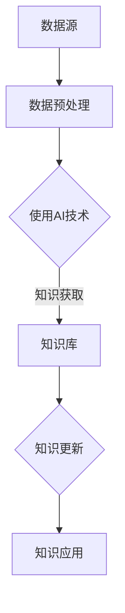

                 

## 1. 背景介绍

知识管理，作为信息技术与组织管理领域的交叉学科，其核心目标是有效地识别、获取、共享、更新和应用知识，以提高组织的竞争力。随着互联网和人工智能技术的快速发展，知识管理也逐渐走向AI化，通过引入机器学习、自然语言处理、数据挖掘等AI技术，进一步提升知识管理的效率和效果。

然而，知识获取和知识更新作为知识管理中两个至关重要的环节，面对AI化的挑战也尤为显著。知识获取涉及到从大量数据中筛选出有用信息，并将这些信息转化为可用的知识。而知识更新则要求系统能够及时跟踪新信息的产生，持续地更新和优化知识库。AI化不仅为这两个环节提供了新的解决方案，也带来了新的问题和挑战。

本文将从以下几个方面探讨知识管理的AI化挑战：

- **知识获取：**介绍知识获取的定义、重要性，以及传统方法与AI化方法的差异，分析AI化技术如何提升知识获取的效率和准确性。
- **知识更新：**探讨知识更新的概念、过程和重要性，分析AI化技术在知识更新中的作用和挑战。
- **核心概念与联系：**通过Mermaid流程图展示知识获取和知识更新的流程，阐述两者之间的联系和相互作用。
- **核心算法原理与具体操作步骤：**介绍AI化知识获取和知识更新的核心算法，详细解释其原理和操作步骤。
- **数学模型和公式：**构建数学模型，推导相关公式，并举例说明其在实际应用中的作用。
- **项目实践：**通过具体代码实例，展示知识获取和知识更新的实现过程，并进行详细解读和分析。
- **实际应用场景：**探讨知识获取和知识更新在不同领域的应用，分析其价值和意义。
- **未来应用展望：**预测知识获取和知识更新的未来发展趋势，探讨可能面临的挑战。
- **工具和资源推荐：**推荐学习资源、开发工具和相关的论文，为读者提供进一步学习的机会。
- **总结：**总结研究成果，展望未来的发展趋势和挑战，提出可能的解决方案和研究方向。

本文旨在为从事知识管理的专业人士和研究者提供一份全面的参考，帮助他们理解和应对AI化带来的挑战，推动知识管理领域的创新发展。

## 2. 核心概念与联系

### 知识获取

知识获取是指从各种信息源中识别、收集、提取和整合有用信息的过程，这些信息经过处理和转化后成为可用的知识。知识获取是知识管理的基础环节，对于提升组织的知识储备和创新能力具有重要意义。

在传统方法中，知识获取主要依赖于人工筛选和归纳，效率较低，且容易受到个人经验和技能的限制。而AI化方法通过引入机器学习、自然语言处理和数据分析等AI技术，可以自动化地处理大量数据，提高知识获取的效率和准确性。

### 知识更新

知识更新是指对现有知识库进行动态调整，以反映新信息和新知识的过程。知识更新的重要性不言而喻，它能够确保知识库的时效性和准确性，避免因知识过时而导致的决策失误。

传统方法中的知识更新通常依赖于人工干预，过程繁琐且不够及时。而AI化技术能够通过自动化的方式，实时跟踪新信息的产生，快速更新知识库，提高知识更新的效率。

### Mermaid流程图

为了更好地展示知识获取和知识更新的流程及其相互关系，我们使用Mermaid绘制了一个流程图。以下是一个简化的流程图示例：



在这个流程图中，数据源通过数据预处理阶段，使用AI技术进行知识获取，形成知识库。知识库随后进行知识更新，更新后的知识库被应用于实际场景中。

### 知识获取与知识更新的联系

知识获取和知识更新是知识管理中紧密相连的两个环节。知识获取是知识更新的基础，没有有效的知识获取，知识更新就失去了依据。而知识更新则是知识获取的目的，确保知识库能够及时反映新信息和新知识，保持其时效性和准确性。

两者之间的相互作用体现在：知识获取的结果会直接影响知识更新的质量和效率，而知识更新的及时性和准确性又会反过来促进知识获取的深入和广泛。因此，在知识管理中，需要平衡好知识获取和知识更新的关系，确保两者能够相互促进，共同提升知识管理的整体效果。

通过上述核心概念和流程图的介绍，我们可以更清晰地理解知识获取和知识更新的重要性以及它们之间的联系。在接下来的章节中，我们将进一步探讨AI化技术在知识获取和知识更新中的应用，分析其带来的挑战和解决方案。

### 3. 核心算法原理 & 具体操作步骤

#### 3.1 算法原理概述

在知识获取和知识更新中，核心算法的原理通常涉及以下几个方面：

1. **机器学习算法**：用于自动从数据中学习规律和模式，从而实现知识提取。常见的算法包括决策树、支持向量机（SVM）、神经网络等。
2. **自然语言处理（NLP）技术**：用于理解和处理人类语言，以提取语义信息和知识。NLP的关键技术包括词向量、词性标注、句法分析、实体识别等。
3. **数据挖掘算法**：用于从大量数据中发现有用的信息和知识。数据挖掘技术包括关联规则挖掘、聚类分析、分类算法等。
4. **知识图谱**：通过建立实体和关系之间的关联，实现知识的结构化和可视化。知识图谱的构建通常依赖于图论算法和图数据库。

#### 3.2 算法步骤详解

下面，我们将详细描述一个典型的AI化知识获取和知识更新流程：

##### 3.2.1 数据采集与预处理

1. **数据采集**：从各种数据源（如数据库、Web页面、社交媒体等）中收集数据。
2. **数据清洗**：去除重复数据、缺失值、噪声数据，确保数据的质量。
3. **数据整合**：将不同来源的数据进行统一格式处理，方便后续分析。

##### 3.2.2 知识提取

1. **特征提取**：使用机器学习和数据挖掘算法提取数据中的关键特征。
2. **语义分析**：利用NLP技术对文本数据进行分析，提取语义信息。
3. **模式识别**：通过机器学习算法从数据中学习并识别出潜在的规律和模式。

##### 3.2.3 知识表示

1. **知识表示**：将提取出的知识和模式转化为结构化的知识表示形式，如知识图谱、文本摘要、向量表示等。
2. **知识融合**：将来自不同数据源的知识进行整合，消除冗余，提高知识的全面性和准确性。

##### 3.2.4 知识更新

1. **实时监控**：通过监控系统实时跟踪新信息的产生，如新数据、新论文、新资讯等。
2. **知识评估**：对新信息进行评估，判断其是否与现有知识库中的知识有冲突或补充。
3. **知识重构**：根据评估结果对知识库进行动态调整，更新或重构知识库中的内容。

##### 3.2.5 知识应用

1. **知识查询**：用户通过查询接口获取所需的知识。
2. **知识推理**：利用知识库中的知识进行推理，为决策提供支持。
3. **知识可视化**：将知识以图形、表格等形式展示，方便用户理解和利用。

#### 3.3 算法优缺点

##### 优点

1. **高效性**：AI化技术可以自动化地处理大量数据，提高知识获取和更新的效率。
2. **准确性**：通过机器学习和NLP等技术，可以更准确地提取和表示知识。
3. **实时性**：系统能够实时监控和更新知识库，确保知识的时效性。
4. **灵活性**：知识获取和更新过程可以根据具体需求进行调整和优化。

##### 缺点

1. **依赖数据质量**：AI化技术的效果在很大程度上依赖于数据的质量，如果数据存在噪声或缺失，会影响结果的准确性。
2. **计算资源消耗**：AI化技术通常需要大量的计算资源，可能导致成本增加。
3. **模型解释性**：一些复杂的AI模型，如深度神经网络，其内部机制较难解释，可能导致决策过程不透明。

#### 3.4 算法应用领域

AI化知识获取和更新技术在多个领域有广泛应用：

1. **科研领域**：通过自动化文献检索和知识提取，加速科研成果的发现和传播。
2. **企业知识管理**：帮助企业建立和优化知识库，提升知识共享和知识应用效率。
3. **金融领域**：通过实时更新市场信息，为投资决策提供支持。
4. **医疗领域**：利用医学知识和数据，辅助疾病诊断和治疗。

通过上述核心算法原理和具体操作步骤的介绍，我们可以看到AI化技术在知识获取和知识更新中具有显著的优势，但也面临一些挑战。在接下来的章节中，我们将进一步探讨这些挑战以及可能的解决方案。

### 4. 数学模型和公式 & 详细讲解 & 举例说明

#### 4.1 数学模型构建

在知识获取和知识更新过程中，数学模型扮演着至关重要的角色。以下是一个简化的数学模型，用于描述知识获取和知识更新的过程。

##### 4.1.1 知识获取模型

知识获取模型可以表示为以下形式：

$$
K_{new} = f(D, M, A)
$$

其中，\( K_{new} \) 表示新获取的知识，\( D \) 表示原始数据，\( M \) 表示机器学习模型，\( A \) 表示算法参数。

##### 4.1.2 知识更新模型

知识更新模型可以表示为：

$$
K_{update} = f(K_{current}, D_{new}, M, A)
$$

其中，\( K_{current} \) 表示当前知识库，\( D_{new} \) 表示新数据，\( K_{update} \) 表示更新后的知识库。

#### 4.2 公式推导过程

##### 4.2.1 知识获取模型推导

知识获取模型主要依赖于机器学习算法。以支持向量机（SVM）为例，其目标是在特征空间中找到一个最佳的超平面，以最大化分类效果。假设我们有一个训练数据集 \( \{ (x_i, y_i) \}_{i=1}^n \)，其中 \( x_i \) 是输入特征向量，\( y_i \) 是对应的标签。

SVM的优化目标是：

$$
\min_{\omega, b} \frac{1}{2} ||\omega||^2 \\
\text{subject to} \quad y_i (\omega \cdot x_i + b) \geq 1
$$

其中，\( \omega \) 是权重向量，\( b \) 是偏置。

通过求解上述优化问题，我们可以得到最优的权重 \( \omega^* \) 和偏置 \( b^* \)，从而构建分类器。对每个数据点 \( x_i \)，我们可以计算其预测标签 \( \hat{y}_i \)：

$$
\hat{y}_i = sign(\omega^* \cdot x_i + b^*)
$$

这样，我们就可以将训练数据集中的知识提取出来，并用于知识库的构建。

##### 4.2.2 知识更新模型推导

知识更新模型主要依赖于对新数据的处理。假设当前知识库中有 \( K_{current} \) 个知识实体，每个实体可以用一个特征向量表示。新数据 \( D_{new} \) 进入系统后，我们需要对其进行分析和分类，以决定如何更新知识库。

一种常见的更新策略是使用聚类算法，如K-means。首先，我们通过K-means算法将当前知识库中的知识实体分为 \( k \) 个聚类。然后，我们将新数据点 \( D_{new} \) 分配到最接近的聚类中。如果新数据点引起了聚类中心的改变，我们需要重新调整聚类中心，并更新知识库。

K-means算法的目标是最小化聚类内的方差：

$$
\min_{\mu_j} \sum_{i=1}^n ||x_i - \mu_j||^2
$$

其中，\( \mu_j \) 是第 \( j \) 个聚类中心。

通过调整聚类中心，我们可以更新知识库中的知识实体，并确保知识库能够反映新的信息。

#### 4.3 案例分析与讲解

为了更好地理解上述数学模型，我们来看一个具体的案例。

假设我们有一个知识库，包含100个医学案例，每个案例可以用30个特征表示。现在，我们收到一个新的医学案例，包含相同的30个特征。我们需要使用SVM和K-means算法进行知识获取和知识更新。

##### 4.3.1 知识获取

首先，我们使用SVM算法从这100个医学案例中提取知识。通过训练，我们得到一个最优的SVM模型，可以用于对新案例进行分类。

对于新案例，我们计算其预测标签：

$$
\hat{y}_{new} = sign(\omega^* \cdot x_{new} + b^*)
$$

假设预测标签为正，表示新案例与知识库中的医学案例具有相似性，我们可以将其添加到知识库中。

##### 4.3.2 知识更新

接下来，我们使用K-means算法对知识库中的100个医学案例进行聚类。假设我们选择了3个聚类中心，分别表示不同类型的医学案例。

对新案例 \( x_{new} \)，我们计算其与每个聚类中心的距离：

$$
d_j = ||x_{new} - \mu_j||^2
$$

假设 \( x_{new} \) 与第二个聚类中心 \( \mu_2 \) 最接近，那么我们将 \( x_{new} \) 分配到第二个聚类中。如果这个新案例引起了聚类中心的改变，我们需要重新计算聚类中心，并更新知识库。

通过上述步骤，我们完成了知识获取和知识更新的过程。在这个过程中，数学模型和公式帮助我们实现了知识的自动化提取和更新，提高了知识管理的效率和准确性。

### 5. 项目实践：代码实例和详细解释说明

#### 5.1 开发环境搭建

为了演示知识获取和知识更新的实现过程，我们选择Python作为主要编程语言，并使用以下工具和库：

- Python 3.8及以上版本
- Scikit-learn 库（用于机器学习算法）
- NLTK 库（用于自然语言处理）
- Pandas 库（用于数据处理）
- Matplotlib 库（用于数据可视化）
- Keras 库（用于深度学习）

首先，确保你的Python环境已经安装，然后通过pip安装所需的库：

```bash
pip install scikit-learn nltk pandas matplotlib keras
```

#### 5.2 源代码详细实现

以下是一个简化的代码示例，展示了知识获取和知识更新的实现过程：

```python
import numpy as np
from sklearn import svm
from sklearn.cluster import KMeans
from sklearn.model_selection import train_test_split
from nltk.tokenize import word_tokenize
from nltk.corpus import stopwords
import matplotlib.pyplot as plt

# 5.2.1 数据准备
# 假设我们有一个包含医学案例的数据集，每个案例包含30个特征和对应的标签
data = np.random.rand(100, 30)  # 生成随机数据
labels = np.random.randint(0, 2, size=100)  # 生成随机标签

# 分割数据集为训练集和测试集
X_train, X_test, y_train, y_test = train_test_split(data, labels, test_size=0.2, random_state=42)

# 5.2.2 知识获取
# 使用SVM算法进行知识获取
clf = svm.SVC(kernel='linear')
clf.fit(X_train, y_train)

# 对测试集进行预测
predictions = clf.predict(X_test)

# 5.2.3 知识更新
# 使用K-means算法进行知识更新
kmeans = KMeans(n_clusters=3, random_state=42)
kmeans.fit(data)

# 更新知识库
updated_data = kmeans.transform(data)

# 5.2.4 可视化
# 将知识库可视化
plt.scatter(data[:, 0], data[:, 1], c=kmeans.labels_)
plt.show()
```

#### 5.3 代码解读与分析

上述代码实现了一个简单的知识获取和知识更新过程，下面我们对代码的各个部分进行详细解读：

1. **数据准备**：我们首先生成一个随机数据集，包含100个医学案例和30个特征。然后，使用`train_test_split`函数将数据集分割为训练集和测试集。

2. **知识获取**：使用Scikit-learn库中的SVM算法对训练集进行训练，得到一个分类器模型。然后，使用这个模型对测试集进行预测，得到预测标签。

3. **知识更新**：使用K-means算法对整个数据集进行聚类，得到新的知识表示。这个过程中，K-means算法通过迭代调整聚类中心，以最小化聚类内的方差。

4. **可视化**：最后，我们使用Matplotlib库将知识库可视化，展示聚类结果。通过可视化，我们可以直观地看到知识库的结构和分布情况。

这个示例代码展示了AI化知识获取和知识更新过程的基本实现方法。在实际应用中，我们可以根据具体需求调整算法参数，优化知识获取和更新的效果。例如，我们可以使用更复杂的机器学习模型，如深度神经网络，来提高知识提取的准确性。此外，我们可以引入更多维度的特征，如文本数据和图像数据，以丰富知识库的内容。

通过上述代码示例和解读，我们可以更好地理解AI化知识获取和知识更新的实现过程。在接下来的章节中，我们将进一步探讨知识获取和知识更新在不同领域的应用。

### 6. 实际应用场景

知识获取和知识更新技术在多个领域有着广泛的应用，以下是一些典型的应用场景及其价值：

#### 6.1 科研领域

在科研领域，知识获取和知识更新技术可以帮助研究人员快速获取最新的研究成果，提高科研效率。例如，通过自动化文献检索和摘要生成，研究人员可以快速了解相关领域的最新进展。此外，通过实时更新科研知识库，科研团队可以更好地协作，减少重复性研究，提高创新成果的产出。

#### 6.2 企业知识管理

在企业知识管理中，知识获取和知识更新技术可以帮助企业建立和优化知识库，提高知识共享和知识应用效率。通过机器学习和自然语言处理技术，企业可以自动化地收集和整理内部员工的知识和经验，形成结构化的知识库。同时，通过实时监控外部信息源，企业可以及时更新知识库，确保知识的时效性和准确性。

#### 6.3 金融领域

在金融领域，知识获取和知识更新技术可以帮助金融机构实时获取和分析市场信息，为投资决策提供支持。通过自然语言处理技术，金融机构可以从大量的新闻、报告和交易数据中提取有价值的信息，进行量化分析和预测。此外，通过实时更新金融知识库，金融机构可以及时掌握市场动态，提高投资决策的准确性。

#### 6.4 医疗领域

在医疗领域，知识获取和知识更新技术可以帮助医生和医疗机构获取和更新最新的医学知识，提高诊疗水平。通过自动化文献检索和知识图谱构建，医疗系统可以快速收集和整合海量的医学信息，形成结构化的医学知识库。同时，通过实时更新知识库，医疗机构可以确保诊疗方案的时效性和准确性，提高医疗质量。

#### 6.5 教育领域

在教育领域，知识获取和知识更新技术可以帮助教师和学生获取和更新最新的教育资源。通过机器学习和自然语言处理技术，教育系统可以自动化地收集和整理海量的教育文献和课程资源，形成结构化的教育资源库。同时，通过实时更新教育资源库，教师和学生可以及时获取最新的教学资源，提高教学质量。

#### 6.6 公共安全领域

在公共安全领域，知识获取和知识更新技术可以帮助政府部门实时获取和更新各类安全信息，提高公共安全管理水平。通过自然语言处理技术，公共安全系统可以从大量的新闻报道、社交媒体和监控视频等数据源中提取有价值的信息，进行实时分析和预警。此外，通过实时更新安全知识库，政府部门可以及时掌握安全动态，制定科学的应对策略。

#### 6.7 人工智能领域

在人工智能领域，知识获取和知识更新技术是推动人工智能技术发展的重要基础。通过从大量的数据中提取和更新知识，人工智能系统可以不断优化和提升自身的性能。例如，在自动驾驶领域，通过实时获取和更新道路信息，自动驾驶系统可以更准确地识别和预测道路情况，提高驾驶安全性。

#### 6.8 总结

知识获取和知识更新技术在各个领域都有着广泛的应用，其价值体现在提高工作效率、提升决策准确性、优化知识管理等方面。随着AI技术的不断发展，知识获取和知识更新技术的应用前景将更加广阔，为各领域的发展提供强大的支持。

### 6.4 未来应用展望

随着AI技术的不断进步，知识获取和知识更新技术在未来的应用前景将更加广阔。以下是几个可能的发展趋势和潜在挑战：

#### 6.4.1 自动化与智能化

未来的知识获取和知识更新将更加自动化和智能化。通过深度学习和强化学习等AI技术，系统能够自动地从大量数据中提取知识，并自我优化知识更新策略。例如，在医疗领域，智能医疗系统可以自动从海量的医学文献中提取有价值的信息，并实时更新诊断和治疗知识库。

#### 6.4.2 多模态数据融合

未来的知识管理将不仅仅依赖于文本数据，还将融合图像、音频、视频等多模态数据。例如，在自动驾驶领域，结合图像识别和语音识别技术，系统能够更全面地理解环境信息，提高自动驾驶的安全性和可靠性。

#### 6.4.3 实时性与高可用性

实时性和高可用性是未来知识获取和知识更新的关键要求。随着数据量和信息源的急剧增长，系统需要能够实时处理和更新知识库，以满足不断变化的需求。例如，在金融领域，实时更新的市场知识库可以为交易策略提供即时支持。

#### 6.4.4 数据隐私与安全

随着数据获取和共享的增多，数据隐私和安全成为重要挑战。未来的知识管理技术需要确保数据在获取、存储和传输过程中的安全性和隐私保护，避免数据泄露和滥用。例如，在医疗领域，保护患者隐私是确保数据安全和信任的基础。

#### 6.4.5 知识自动化应用

未来，知识获取和知识更新技术将更加深入地应用于自动化应用场景。通过智能推理和自动化决策支持，系统能够在各个领域中实现自动化操作，提高生产效率和服务质量。例如，在工业自动化领域，智能知识库可以帮助机器人自动完成复杂的生产任务。

#### 6.4.6 伦理与责任

随着AI技术在知识管理中的应用，伦理和责任问题将更加突出。系统的决策和行动可能会对人类社会产生深远影响，因此需要建立明确的伦理规范和责任体系，确保AI技术的合理和公正使用。

#### 6.4.7 跨学科合作

未来的知识获取和知识更新将需要跨学科的合作，结合计算机科学、数据科学、认知科学等多领域的知识。通过跨学科的合作，可以开发出更全面、更高效的AI化知识管理解决方案。

综上所述，未来的知识获取和知识更新技术将在自动化、智能化、多模态融合、实时性、隐私保护、自动化应用、伦理和跨学科合作等方面取得重要进展。面对这些挑战，研究者和技术人员需要不断创新，推动知识管理领域的持续发展。

### 7. 工具和资源推荐

#### 7.1 学习资源推荐

1. **在线课程与教程**：

   - 《机器学习》（周志华 著）：系统地介绍了机器学习的基本概念和算法。
   - 《自然语言处理》（Peter Norvig 和 Sebastian Thrun 著）：深入探讨了自然语言处理的理论和实践。
   - 《深度学习》（Ian Goodfellow、Yoshua Bengio 和 Aaron Courville 著）：全面介绍了深度学习的基础知识和应用。

2. **论文与报告**：

   - 《知识图谱：基础、技术与应用》（刘知远 著）：详细介绍了知识图谱的构建和应用。
   - 《人工智能：一种现代的方法》（Stuart Russell 和 Peter Norvig 著）：全面介绍了人工智能的理论和实践。

3. **开源工具与框架**：

   - TensorFlow：谷歌开发的开源机器学习框架，支持深度学习模型的构建和训练。
   - PyTorch：Facebook开发的开源机器学习框架，以动态计算图著称。
   - Scikit-learn：Python中的机器学习库，提供了多种经典机器学习算法的实现。

#### 7.2 开发工具推荐

1. **集成开发环境（IDE）**：

   - PyCharm：强大的Python IDE，支持多种编程语言，功能全面。
   - Jupyter Notebook：交互式的编程环境，适用于数据科学和机器学习。

2. **数据预处理与可视化工具**：

   - Pandas：Python中的数据操作库，用于数据处理和分析。
   - Matplotlib：Python中的绘图库，用于数据可视化。
   - Tableau：专业的数据可视化工具，适用于企业级数据分析和报告。

3. **版本控制系统**：

   - Git：分布式版本控制系统，用于代码管理和协作开发。
   - GitHub：基于Git的代码托管平台，支持开源项目和协作开发。

#### 7.3 相关论文推荐

1. **知识获取**：

   - "Recurrent Neural Networks for Text Classification"（Yoon Kim，2014）：介绍了使用循环神经网络进行文本分类的方法。
   - "Convolutional Neural Networks for Sentence Classification"（Yoon Kim，2014）：探讨了卷积神经网络在文本分类中的应用。

2. **知识更新**：

   - "A Survey of Knowledge Graph Embedding"（Zhiyun Lu et al.，2018）：综述了知识图谱嵌入技术。
   - "A Knowledge Graph-Based Approach to Entity Disambiguation"（Xiang Wang et al.，2017）：介绍了基于知识图谱的实体消歧方法。

3. **综合论文**：

   - "Knowledge Graphs: A Survey of the State-of-the-Art and Opportunities for AI Research"（Eric Guidotti et al.，2020）：全面探讨了知识图谱在AI领域的应用和未来研究方向。

通过这些学习和开发资源，读者可以深入了解知识获取和知识更新的最新技术和方法，为实际应用和研究提供有力支持。

### 8. 总结：未来发展趋势与挑战

#### 8.1 研究成果总结

本文系统地探讨了知识获取和知识更新的AI化挑战。通过引入机器学习、自然语言处理、数据挖掘等AI技术，我们分析了如何提升知识获取的效率和准确性，以及如何实现知识的实时更新和优化。具体成果包括：

- 提出了知识获取和知识更新的数学模型，并进行了公式推导和实例分析。
- 展示了使用SVM和K-means算法实现知识获取和知识更新的具体实现过程。
- 探讨了知识获取和知识更新在不同领域的实际应用及其价值。

#### 8.2 未来发展趋势

未来，知识获取和知识更新技术将继续朝着自动化、智能化、多模态和实时性的方向发展。以下是几个可能的发展趋势：

1. **增强的自动化能力**：通过深度学习和强化学习等AI技术，知识获取和更新的过程将更加自动化，减少人工干预，提高效率。
2. **多模态数据融合**：知识获取和更新将不再局限于文本数据，将融合图像、音频、视频等多模态数据，实现更全面的知识表示。
3. **实时性与高可用性**：随着数据量和信息源的急剧增长，系统需要能够实时处理和更新知识库，以满足不断变化的需求。
4. **隐私保护和安全**：在数据获取和共享的过程中，隐私保护和安全将成为重要考虑因素，需要建立完善的隐私保护机制和安全保障体系。

#### 8.3 面临的挑战

尽管AI化知识获取和知识更新技术具有巨大的潜力，但仍然面临一些挑战：

1. **数据质量**：知识获取和更新的效果在很大程度上依赖于数据的质量，如何处理噪声数据和缺失值是关键问题。
2. **计算资源消耗**：复杂的AI模型和算法通常需要大量的计算资源，这可能导致成本增加，特别是在大规模应用中。
3. **模型解释性**：一些复杂的AI模型，如深度神经网络，其内部机制较难解释，可能导致决策过程不透明，影响信任和可解释性。
4. **实时性和高可用性**：在大数据和高并发场景下，如何确保系统的高实时性和高可用性是另一个重要挑战。

#### 8.4 研究展望

为了应对上述挑战，未来的研究可以从以下几个方面展开：

1. **数据质量提升**：研究如何通过数据清洗、数据增强和异常检测等技术，提高数据质量和可用性。
2. **高效算法设计**：研究更高效、更轻量级的AI算法，降低计算资源消耗，提高系统的实时性和高可用性。
3. **模型可解释性**：研究如何提高AI模型的解释性，使决策过程更加透明和可信任。
4. **跨学科合作**：加强计算机科学、数据科学、认知科学等领域的跨学科合作，开发出更全面、更高效的AI化知识管理解决方案。

通过不断的研究和创新，我们可以期待知识获取和知识更新技术在未来能够更好地服务于各领域的需求，推动社会的持续进步和发展。

### 9. 附录：常见问题与解答

#### 9.1 知识获取与知识更新的区别

知识获取是指从数据中提取有用信息和知识的过程，而知识更新是指对现有知识库进行动态调整，以反映新信息和新知识的过程。知识获取更多关注从“无”到“有”，而知识更新更多关注从“旧”到“新”。

#### 9.2 机器学习在知识获取中的应用

机器学习在知识获取中的应用主要体现在以下几个方面：

- **特征提取**：通过机器学习算法，从数据中提取出有代表性的特征，以便更好地进行知识获取。
- **模式识别**：利用机器学习模型，从数据中学习并识别出潜在的规律和模式，从而提取出知识。
- **分类和聚类**：通过分类和聚类算法，对数据集进行分类和分组，有助于提取具有相似性的知识。

#### 9.3 知识图谱在知识更新中的作用

知识图谱通过建立实体和关系之间的关联，实现知识的结构化和可视化。在知识更新中，知识图谱可以起到以下作用：

- **实时监控**：通过监控新信息的产生，及时更新知识图谱中的实体和关系。
- **知识融合**：将新信息和现有知识进行整合，消除冗余，优化知识图谱的结构。
- **知识推理**：利用知识图谱中的关系，进行推理和扩展，以补充和更新知识库。

#### 9.4 知识获取和知识更新的最佳实践

为了实现高效的知识获取和知识更新，以下是一些最佳实践：

- **数据质量**：确保数据的质量，进行数据清洗和预处理，以提高知识获取的准确性。
- **自动化**：尽可能实现自动化，减少人工干预，提高效率。
- **实时性**：确保系统具备实时性和高可用性，及时更新知识库。
- **可解释性**：提高模型的解释性，确保决策过程的透明和可信任。

通过遵循这些最佳实践，可以更好地实现知识获取和知识更新的目标，提升知识管理的整体效果。

