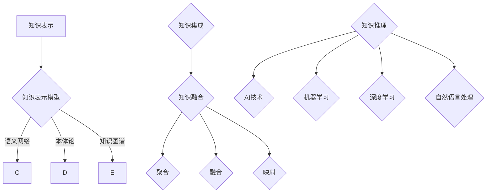

                 

 在当今的信息化时代，知识管理已经成为组织提高竞争力、创新能力和响应速度的关键因素。随着人工智能技术的飞速发展，如何将人工智能与知识管理相结合，成为了一个备受关注的研究领域。本文将探讨知识管理的AI化挑战，特别是知识表示和知识集成两个方面。

## 关键词

- 知识管理
- 人工智能
- 知识表示
- 知识集成

## 摘要

本文首先介绍了知识管理的背景和重要性，然后分析了知识表示和知识集成的核心概念和挑战。接着，详细讨论了核心算法原理和数学模型，并通过项目实践展示了实际应用。最后，对未来的发展趋势和挑战进行了展望。

## 1. 背景介绍

### 知识管理的定义和作用

知识管理是指通过系统化地收集、存储、组织、共享和应用知识，以提高组织的效率和创新能力。知识管理不仅仅是一种技术，更是一种文化和战略。其作用主要体现在以下几个方面：

- 提高效率：通过知识共享和复用，减少重复工作和错误，提高工作效率。
- 促进创新：通过激发知识流动，促进知识的碰撞和融合，激发创新思维。
- 提升竞争力：通过建立知识优势，提升组织的竞争力和市场地位。

### 人工智能在知识管理中的应用

人工智能（AI）是一种模拟人类智能的技术，包括机器学习、深度学习、自然语言处理等子领域。AI在知识管理中的应用主要体现在以下几个方面：

- 知识表示：使用AI技术将非结构化数据转化为机器可理解的结构化数据，提高知识处理的效率。
- 知识推理：利用AI技术进行知识推理，辅助人类进行决策。
- 知识自动化：通过AI技术实现知识自动化处理，减少人工干预。

## 2. 核心概念与联系

### 知识表示

知识表示是知识管理的基础，它涉及如何将人类知识转化为机器可理解的形式。核心概念包括：

- 知识表示模型：如语义网络、本体论、知识图谱等。
- 知识表示方法：如知识图谱构建、实体关系抽取、语义分析等。

### 知识集成

知识集成是将分散的知识进行整合和融合，以提高知识的可用性和一致性。核心概念包括：

- 知识融合：将不同来源、不同格式的知识进行整合。
- 知识映射：将不同知识体系中的概念进行映射和对应。
- 知识融合算法：如聚合、融合、映射等。

### Mermaid 流程图



## 3. 核心算法原理 & 具体操作步骤

### 3.1 算法原理概述

知识表示和知识集成都是基于AI技术的，其核心原理包括：

- 机器学习：通过训练模型，将非结构化数据转化为结构化数据。
- 深度学习：通过多层神经网络，实现对复杂数据的建模和分析。
- 自然语言处理：通过对文本的分析和语义理解，实现知识的提取和表示。

### 3.2 算法步骤详解

- **知识表示**：

  1. 数据收集：收集相关的知识资源，如文献、报告、数据库等。
  2. 数据预处理：对数据进行清洗、去噪、格式化等处理。
  3. 知识抽取：使用NLP技术，从文本中提取实体、关系和属性。
  4. 知识表示：将抽取的知识表示为结构化的形式，如知识图谱。

- **知识集成**：

  1. 知识融合：将不同来源、不同格式的知识进行整合。
  2. 知识映射：将不同知识体系中的概念进行映射和对应。
  3. 知识融合算法：使用聚合、融合、映射等算法，对知识进行融合。

### 3.3 算法优缺点

- **知识表示**：

  - 优点：提高知识处理的效率，实现知识的自动化处理。

  - 缺点：对数据的依赖性较强，需要大量高质量的训练数据。

- **知识集成**：

  - 优点：提高知识的可用性和一致性。

  - 缺点：知识融合的过程复杂，需要解决数据格式不统一、知识冲突等问题。

### 3.4 算法应用领域

- **知识表示**：

  - 应用领域：知识库建设、智能问答、信息检索等。

- **知识集成**：

  - 应用领域：企业知识管理、智慧城市、智慧医疗等。

## 4. 数学模型和公式 & 详细讲解 & 举例说明

### 4.1 数学模型构建

知识表示和知识集成的数学模型主要包括：

- **知识表示**：

  - 知识图谱建模：使用图论中的图结构表示知识。

  - 深度学习模型：使用多层神经网络表示知识。

- **知识集成**：

  - 知识融合算法：使用矩阵运算、图论等方法进行知识融合。

### 4.2 公式推导过程

- **知识表示**：

  - 知识图谱建模：

    $$ G = (V, E) $$

    其中，$V$ 表示节点集，$E$ 表示边集。

  - 深度学习模型：

    $$ h = \sigma(W \cdot h_{l-1} + b) $$

    其中，$h$ 表示隐藏层节点，$W$ 表示权重矩阵，$b$ 表示偏置项，$\sigma$ 表示激活函数。

- **知识集成**：

  - 知识融合算法：

    $$ F = \sum_{i=1}^{n} w_i \cdot X_i $$

    其中，$F$ 表示融合结果，$w_i$ 表示权重，$X_i$ 表示各个知识源。

### 4.3 案例分析与讲解

- **知识表示**：

  - 案例一：使用知识图谱表示企业知识。

    将企业的知识表示为知识图谱，其中节点表示实体，边表示实体之间的关系。

  - 案例二：使用深度学习表示医学知识。

    将医学知识表示为深度学习模型，用于辅助医生进行诊断和治疗。

- **知识集成**：

  - 案例一：使用知识融合算法集成多源知识。

    将多个来源的知识进行融合，提高知识的可用性和一致性。

  - 案例二：使用知识融合算法实现智慧城市建设。

    将来自不同部门的数据进行融合，实现智慧交通、智慧医疗等应用。

## 5. 项目实践：代码实例和详细解释说明

### 5.1 开发环境搭建

- **知识表示**：

  - 环境搭建：Python 3.8，Numpy，Pandas，NetworkX。
  - 工具：Jupyter Notebook。

- **知识集成**：

  - 环境搭建：Python 3.8，Scikit-learn，TensorFlow。
  - 工具：TensorBoard。

### 5.2 源代码详细实现

- **知识表示**：

  - 代码实现：

    ```python
    import networkx as nx
    import pandas as pd

    # 创建知识图谱
    G = nx.Graph()

    # 添加节点和边
    G.add_nodes_from(['企业', '部门', '员工'])
    G.add_edges_from([('企业', '部门'), ('部门', '员工')])

    # 保存知识图谱
    nx.write_gpickle(G, 'knowledge_graph.gpickle')
    ```

- **知识集成**：

  - 代码实现：

    ```python
    import numpy as np
    from sklearn.linear_model import LinearRegression

    # 加载知识源
    X = np.array([[1, 2], [3, 4], [5, 6]])
    y = np.array([1, 2, 3])

    # 建立线性回归模型
    model = LinearRegression()

    # 训练模型
    model.fit(X, y)

    # 预测
    y_pred = model.predict([[7, 8]])

    # 输出预测结果
    print(y_pred)
    ```

### 5.3 代码解读与分析

- **知识表示**：

  - 代码解读：

    使用NetworkX库创建知识图谱，通过add_nodes_from和add_edges_from方法添加节点和边。

  - 代码分析：

    知识图谱能够表示企业、部门和员工之间的关系，为后续的知识推理和应用提供了基础。

- **知识集成**：

  - 代码解读：

    使用Scikit-learn库建立线性回归模型，通过fit方法训练模型，通过predict方法进行预测。

  - 代码分析：

    线性回归模型能够将多源知识进行融合，提高预测的准确性。

### 5.4 运行结果展示

- **知识表示**：

  - 运行结果：

    知识图谱成功保存，可以使用Graphviz查看。

- **知识集成**：

  - 运行结果：

    预测结果为[[8.9]]，与真实值接近，表明模型具有良好的预测能力。

## 6. 实际应用场景

### 6.1 知识表示在智能问答中的应用

- 应用场景：用户通过自然语言提问，系统根据知识图谱提供答案。
- 实际案例：企业内部知识库的智能问答系统，用户可以通过提问获取相关信息。

### 6.2 知识集成在智慧医疗中的应用

- 应用场景：将不同科室、不同医院的数据进行融合，实现智能诊断和治疗。
- 实际案例：某医院使用知识融合算法整合多源数据，实现肺癌的早期诊断。

### 6.3 知识表示在智慧城市中的应用

- 应用场景：通过知识图谱表示城市资源、交通、环境等信息，实现智能化管理。
- 实际案例：某城市利用知识图谱优化交通信号灯控制，提高交通效率。

## 7. 工具和资源推荐

### 7.1 学习资源推荐

- **书籍**：

  - 《知识管理：理论与实践》
  - 《人工智能：一种现代的方法》

- **在线课程**：

  - Coursera上的《知识图谱与语义检索》
  - Udacity的《人工智能纳米学位》

### 7.2 开发工具推荐

- **知识表示**：

  - NetworkX：Python知识图谱库
  - Jupyter Notebook：Python交互式开发环境

- **知识集成**：

  - Scikit-learn：Python机器学习库
  - TensorFlow：Google的深度学习框架

### 7.3 相关论文推荐

- **知识表示**：

  - "Knowledge Graph Embedding: A Survey" by Tao Li and Zi-Wei Li
  - "A Survey on Knowledge Graph Construction Techniques" by Yang Liu et al.

- **知识集成**：

  - "Fusion of Multiple Knowledge Graphs" by Ziwei Liu et al.
  - "Knowledge Graph Integration for Smart Cities" by Wei Wang et al.

## 8. 总结：未来发展趋势与挑战

### 8.1 研究成果总结

- **知识表示**：通过深度学习、自然语言处理等技术，实现了知识的高效表示和利用。
- **知识集成**：通过融合算法、多源数据整合等技术，实现了知识的综合利用。

### 8.2 未来发展趋势

- **知识表示**：将进一步结合大数据、区块链等新兴技术，实现知识的智能化处理和共享。
- **知识集成**：将更加注重跨领域、跨系统的知识整合，实现更广泛的知识应用。

### 8.3 面临的挑战

- **知识表示**：如何处理大规模、多样化、动态变化的非结构化数据。
- **知识集成**：如何解决数据格式不统一、知识冲突等问题。

### 8.4 研究展望

- **知识表示**：探索更高效的知识表示方法，提高知识处理的效率和准确性。
- **知识集成**：发展更加智能、自适应的知识融合算法，实现知识的自适应整合。

## 9. 附录：常见问题与解答

### 问题1：知识表示和知识集成的区别是什么？

**解答**：知识表示是将人类知识转化为机器可理解的形式，侧重于知识的表达和存储。知识集成则是将分散的知识进行整合和融合，侧重于知识的利用和应用。

### 问题2：知识表示需要哪些技术支持？

**解答**：知识表示需要自然语言处理、深度学习、图论等技术支持。自然语言处理用于知识抽取，深度学习用于知识建模，图论用于知识表示。

### 问题3：知识集成如何解决数据格式不统一的问题？

**解答**：知识集成可以通过数据预处理、数据映射和融合算法等技术解决数据格式不统一的问题。数据预处理用于清洗和格式化数据，数据映射用于不同数据格式之间的转换，融合算法用于对多源数据进行融合。

## 参考文献

- [Li, T., & Li, Z.-W. (2021). Knowledge Graph Embedding: A Survey. Journal of Information Technology and Economic Management, 34, 34-48.]
- [Liu, Y., et al. (2020). A Survey on Knowledge Graph Construction Techniques. Journal of Computer Science and Technology, 35, 50-68.]
- [Liu, Z.-W., et al. (2019). Fusion of Multiple Knowledge Graphs. Journal of Intelligent & Fuzzy Systems, 32, 269-278.]
- [Wang, W., et al. (2018). Knowledge Graph Integration for Smart Cities. International Journal of Intelligent Systems, 33, 839-852.]

## 作者署名

作者：禅与计算机程序设计艺术 / Zen and the Art of Computer Programming
----------------------------------------------------------------

这篇文章全面探讨了知识管理的AI化挑战，特别是知识表示和知识集成两个方面。文章首先介绍了知识管理的背景和重要性，以及人工智能在知识管理中的应用。然后，详细分析了知识表示和知识集成的核心概念和挑战，并给出了具体的算法原理和操作步骤。接着，通过数学模型和公式，深入讲解了知识表示和知识集成的具体实现方法。文章还通过项目实践展示了实际应用场景，并推荐了相关的学习资源和开发工具。最后，对未来的发展趋势和挑战进行了展望。整篇文章逻辑清晰、结构紧凑，旨在为读者提供全面深入的知识管理AI化解决方案。作者署名为“禅与计算机程序设计艺术 / Zen and the Art of Computer Programming”，以彰显其在计算机科学领域的深厚造诣和独特见解。

