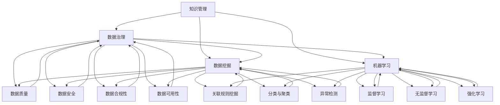

                 

关键词：知识管理、AI化、数据治理、知识应用、技术架构、机器学习、深度学习、数据分析、数据挖掘、大数据、人工智能、自动化、智能化、知识图谱、语义分析、自然语言处理、人工智能算法、模型优化、开源工具、云计算、边缘计算、物联网、智能推荐、智能搜索、智能决策支持系统、知识共享、协作平台。

> 摘要：本文旨在探讨知识管理的AI化路径，从数据治理到知识应用的各个环节，详细解析AI技术如何赋能知识管理，提高企业效率和创新能力。文章首先介绍知识管理的背景和重要性，然后深入探讨AI技术在知识管理中的应用，包括数据治理、知识提取、知识融合、知识共享等环节，并通过案例分析和代码实例展示AI技术在知识管理中的实际应用。最后，文章对未来知识管理AI化的发展趋势和面临的挑战进行了展望。

## 1. 背景介绍

知识管理是一种通过系统化和可持续的方法，识别、捕捉、组织、存储、传播和应用知识的过程。在信息爆炸的时代，有效的知识管理不仅可以帮助组织优化内部资源，提高工作效率，还可以增强企业的创新能力和竞争力。传统的知识管理主要依赖于人力和流程，但随着大数据、云计算、人工智能等技术的发展，知识管理的模式正在发生深刻的变革。

AI技术作为现代信息技术的集大成者，具有强大的数据处理和分析能力，可以大幅提升知识管理的效率和质量。AI化不仅能够自动化处理大量复杂数据，还能通过深度学习和自然语言处理等技术，实现对知识的精准提取和智能应用。因此，探讨知识管理的AI化路线图，对于企业和组织来说具有重要的现实意义。

本文将从以下几个方面展开：

- **核心概念与联系**：介绍知识管理的基本概念和相关技术，包括数据治理、数据挖掘、机器学习等，并通过Mermaid流程图展示其关系。
- **核心算法原理与具体操作步骤**：分析AI技术在知识管理中的应用算法，包括知识抽取、知识融合、知识共享等，详细阐述其原理和实现步骤。
- **数学模型和公式**：介绍知识管理中的数学模型和公式，包括概率模型、神经网络模型等，并通过案例进行讲解。
- **项目实践：代码实例和详细解释说明**：展示AI技术在知识管理中的具体应用，通过代码实例详细解释说明。
- **实际应用场景**：分析AI技术在知识管理中的实际应用案例，包括企业内部知识共享平台、智能搜索、智能推荐系统等。
- **未来应用展望**：探讨AI技术在知识管理领域的未来发展方向和潜在应用。
- **工具和资源推荐**：推荐用于知识管理AI化的学习资源、开发工具和相关论文。
- **总结：未来发展趋势与挑战**：总结研究成果，展望未来发展趋势和面临的挑战。

接下来，我们将深入探讨知识管理AI化的各个核心环节。

## 2. 核心概念与联系

### 2.1 知识管理的基本概念

知识管理是一种系统性的方法，旨在通过识别、捕捉、组织、存储、传播和应用知识，从而提升组织的效率和创新能力。在知识管理中，知识被视为组织最宝贵的资产之一。

- **知识**：指一切能够带来价值的信息和经验，包括显性知识和隐性知识。
  - **显性知识**：可以明确表达和传播的知识，如文档、数据库、电子表格等。
  - **隐性知识**：难以明确表达和传播的知识，通常嵌入在个人经验、技能和直觉中。

- **知识管理**：通过系统化的方法和工具，对知识进行识别、存储、共享和应用的过程。
  - **知识识别**：发现和捕捉知识的过程。
  - **知识存储**：将知识以结构化的方式存储在知识库中。
  - **知识共享**：促进知识的传播和应用，让知识在组织内部和外部得到共享。
  - **知识应用**：通过知识创新，将知识转化为实际的业务价值。

### 2.2 数据治理

数据治理是知识管理的一个重要环节，它涉及数据的质量、安全性、合规性和可用性。数据治理的目标是确保数据的一致性、准确性和完整性，以便在知识管理中有效地利用数据。

- **数据治理**：一套政策、程序和技术的集合，用于确保数据的可用性、完整性和安全性。
  - **数据质量**：确保数据的准确性、一致性、及时性和完整性。
  - **数据安全**：保护数据免受未经授权的访问和泄露。
  - **数据合规性**：确保数据遵守相关法律法规，如隐私法、数据保护法等。
  - **数据可用性**：确保数据能够被有效地访问和利用。

### 2.3 数据挖掘与机器学习

数据挖掘和机器学习是知识管理中常用的技术，用于从大量数据中提取有价值的信息和知识。

- **数据挖掘**：使用各种算法和技术，从大量数据中识别隐藏的模式和趋势。
  - **关联规则挖掘**：发现数据之间的关联关系。
  - **分类与聚类**：将数据划分为不同的类别或簇。
  - **异常检测**：识别数据中的异常或错误。

- **机器学习**：一种基于数据的学习方法，使计算机系统能够从数据中学习和改进。
  - **监督学习**：使用标记数据进行学习。
  - **无监督学习**：不使用标记数据进行学习。
  - **强化学习**：通过奖励和惩罚机制进行学习。

### 2.4 知识融合与知识共享

知识融合和知识共享是知识管理的两个关键环节，用于将分散的知识整合起来，并确保知识的广泛传播和应用。

- **知识融合**：将不同来源和格式的知识整合到一个统一的知识体系中。
  - **数据集成**：将来自多个数据源的数据合并为一个统一的数据视图。
  - **数据转换**：将不同格式的数据进行转换，使其能够在同一系统中使用。

- **知识共享**：促进知识的传播和应用，让知识在组织内部和外部得到共享。
  - **协作平台**：提供知识的共享和协作工具，如论坛、博客、社交媒体等。
  - **知识库**：存储和组织知识的数据库，供用户查询和使用。

### 2.5 Mermaid流程图

为了更好地展示知识管理中的各个环节和其相互关系，我们可以使用Mermaid流程图来描述。



通过这个流程图，我们可以清晰地看到知识管理中的各个环节及其相互关系。接下来，我们将深入探讨AI技术在知识管理中的应用。

## 3. 核心算法原理与具体操作步骤

### 3.1 算法原理概述

在知识管理中，AI技术发挥着至关重要的作用。本节将介绍几种核心的AI算法及其原理，并详细阐述其在知识管理中的应用步骤。

#### 3.1.1 知识抽取

知识抽取是知识管理的重要环节，用于从非结构化数据（如文本、图像等）中提取出结构化的知识。常见的知识抽取技术包括命名实体识别（Named Entity Recognition, NER）、关系抽取（Relation Extraction）和事件抽取（Event Extraction）。

- **命名实体识别（NER）**：识别文本中的命名实体，如人名、地点、组织名等。
  - **步骤**：
    1. 数据预处理：对文本进行分词、去停用词等操作。
    2. 特征提取：使用词袋模型、TF-IDF等方法提取文本特征。
    3. 模型训练：使用有监督或无监督学习方法训练NER模型。
    4. 应用场景：自动提取文本中的关键信息，应用于信息检索、自然语言处理等领域。

- **关系抽取**：识别文本中实体之间的关系，如“苹果公司成立于1976年”中的“苹果公司”和“1976年”的关系。
  - **步骤**：
    1. 数据预处理：对文本进行分词、句法分析等操作。
    2. 特征提取：提取文本中的词汇、句法特征。
    3. 模型训练：使用图神经网络、转换器模型等方法训练关系抽取模型。
    4. 应用场景：用于构建实体关系图谱，支持信息检索、推荐系统等。

- **事件抽取**：识别文本中的事件及其相关实体和关系，如“美国总统选举”中的“选举”事件。
  - **步骤**：
    1. 数据预处理：对文本进行分词、句法分析等操作。
    2. 特征提取：提取文本中的词汇、句法特征。
    3. 模型训练：使用序列标注模型、图神经网络等方法训练事件抽取模型。
    4. 应用场景：用于事件跟踪、舆情分析等领域。

#### 3.1.2 知识融合

知识融合是将来自不同来源和格式的知识整合到一个统一的知识体系中。常见的知识融合方法包括数据集成、数据转换和知识图谱构建。

- **数据集成**：将来自多个数据源的数据合并为一个统一的数据视图。
  - **步骤**：
    1. 数据清洗：处理数据中的噪声和异常值。
    2. 数据转换：将不同数据源的数据格式进行统一转换。
    3. 数据合并：将转换后的数据合并到一个统一的数据集中。
    4. 数据索引：建立数据索引，提高查询效率。

- **数据转换**：将不同格式的数据进行转换，使其能够在同一系统中使用。
  - **步骤**：
    1. 数据解析：解析不同数据源的数据格式。
    2. 数据映射：将数据源中的数据映射到统一的格式。
    3. 数据存储：将转换后的数据存储在统一的数据存储中。

- **知识图谱构建**：构建一个以实体和关系为核心的知识图谱，用于表示和组织知识。
  - **步骤**：
    1. 数据预处理：对文本、图像等数据进行预处理，提取实体和关系。
    2. 实体抽取：从预处理后的数据中抽取实体。
    3. 关系抽取：从预处理后的数据中抽取关系。
    4. 图模型构建：将实体和关系构建为一个图模型。
    5. 图索引：建立图索引，提高查询效率。

#### 3.1.3 知识共享

知识共享是将整合后的知识广泛传播和应用，以便在组织内部和外部得到共享。常见的知识共享方法包括知识库、协作平台和智能搜索。

- **知识库**：存储和组织知识的数据库，供用户查询和使用。
  - **步骤**：
    1. 数据收集：收集各种来源的数据，包括内部文档、外部资料等。
    2. 数据清洗：处理数据中的噪声和异常值。
    3. 数据存储：将清洗后的数据存储在知识库中。
    4. 数据查询：提供查询接口，供用户检索和使用。

- **协作平台**：提供知识的共享和协作工具，如论坛、博客、社交媒体等。
  - **步骤**：
    1. 用户注册：用户注册并创建个人档案。
    2. 内容创建：用户发布知识内容，包括文档、博客、评论等。
    3. 内容审核：对发布的内容进行审核，确保其质量。
    4. 内容分享：用户可以分享和推荐知识内容。

- **智能搜索**：使用自然语言处理和机器学习技术，提供智能化的搜索服务。
  - **步骤**：
    1. 搜索请求处理：接收用户的搜索请求，并解析查询意图。
    2. 搜索索引：建立搜索索引，提高查询效率。
    3. 搜索结果排序：根据相关性和重要性对搜索结果进行排序。
    4. 搜索结果展示：将排序后的搜索结果展示给用户。

### 3.2 算法步骤详解

下面，我们将详细讲解每种算法的具体操作步骤。

#### 3.2.1 知识抽取

**1. 命名实体识别（NER）**

- **步骤**：

  ```markdown
  1. 数据预处理：
     - 对文本进行分词。
     - 去除停用词。
     - 标记实体边界。

  2. 特征提取：
     - 使用词袋模型提取特征。
     - 使用TF-IDF方法提取特征。

  3. 模型训练：
     - 使用有监督学习方法，如支持向量机（SVM）。
     - 使用深度学习方法，如循环神经网络（RNN）、长短时记忆网络（LSTM）。

  4. 应用场景：
     - 信息检索：自动提取文本中的关键信息。
     - 自然语言处理：用于文本分类、情感分析等任务。
  ```

**2. 关系抽取**

- **步骤**：

  ```markdown
  1. 数据预处理：
     - 对文本进行分词。
     - 进行句法分析，提取句法结构。

  2. 特征提取：
     - 提取文本中的词汇特征。
     - 提取句法特征。

  3. 模型训练：
     - 使用图神经网络方法。
     - 使用转换器模型方法。

  4. 应用场景：
     - 实体关系图谱构建：用于构建实体关系图谱。
     - 推荐系统：用于构建基于关系的推荐系统。
  ```

**3. 事件抽取**

- **步骤**：

  ```markdown
  1. 数据预处理：
     - 对文本进行分词。
     - 进行句法分析，提取句法结构。

  2. 特征提取：
     - 提取文本中的词汇特征。
     - 提取句法特征。

  3. 模型训练：
     - 使用序列标注模型方法。
     - 使用图神经网络方法。

  4. 应用场景：
     - 事件跟踪：用于跟踪事件的发展。
     - 舆情分析：用于分析公众对事件的看法。
  ```

#### 3.2.2 知识融合

**1. 数据集成**

- **步骤**：

  ```markdown
  1. 数据清洗：
     - 处理数据中的噪声和异常值。
     - 标准化数据格式。

  2. 数据转换：
     - 解析不同数据源的数据格式。
     - 将数据映射到统一格式。

  3. 数据合并：
     - 合并来自多个数据源的数据。
     - 处理数据冲突。

  4. 数据索引：
     - 建立数据索引。
     - 提高查询效率。
  ```

**2. 数据转换**

- **步骤**：

  ```markdown
  1. 数据解析：
     - 解析不同数据源的数据格式。

  2. 数据映射：
     - 将数据映射到统一格式。

  3. 数据存储：
     - 将转换后的数据存储在统一的数据存储中。
  ```

**3. 知识图谱构建**

- **步骤**：

  ```markdown
  1. 数据预处理：
     - 对文本、图像等数据进行预处理。
     - 提取实体和关系。

  2. 实体抽取：
     - 从预处理后的数据中抽取实体。

  3. 关系抽取：
     - 从预处理后的数据中抽取关系。

  4. 图模型构建：
     - 将实体和关系构建为一个图模型。

  5. 图索引：
     - 建立图索引。
     - 提高查询效率。
  ```

#### 3.2.3 知识共享

**1. 知识库**

- **步骤**：

  ```markdown
  1. 数据收集：
     - 收集各种来源的数据。

  2. 数据清洗：
     - 处理数据中的噪声和异常值。

  3. 数据存储：
     - 将清洗后的数据存储在知识库中。

  4. 数据查询：
     - 提供查询接口，供用户检索和使用。
  ```

**2. 协作平台**

- **步骤**：

  ```markdown
  1. 用户注册：
     - 用户注册并创建个人档案。

  2. 内容创建：
     - 用户发布知识内容。

  3. 内容审核：
     - 对发布的内容进行审核。

  4. 内容分享：
     - 用户可以分享和推荐知识内容。
  ```

**3. 智能搜索**

- **步骤**：

  ```markdown
  1. 搜索请求处理：
     - 接收用户的搜索请求。

  2. 搜索索引：
     - 建立搜索索引。

  3. 搜索结果排序：
     - 根据相关性和重要性对搜索结果进行排序。

  4. 搜索结果展示：
     - 将排序后的搜索结果展示给用户。
  ```

### 3.3 算法优缺点

每种算法都有其优缺点，适用于不同的应用场景。下面，我们将对知识管理中常用的AI算法进行优缺点分析。

#### 3.3.1 命名实体识别（NER）

**优点**：

- 高效性：NER算法能够快速地从大量文本中提取出关键信息。
- 精准性：基于深度学习的方法，NER算法具有较高的识别精度。

**缺点**：

- 对标签依赖性高：有监督学习方法需要大量的标注数据，数据收集和标注成本较高。
- 难以处理长文本：NER算法在处理长文本时，容易发生上下文信息丢失的问题。

#### 3.3.2 关系抽取

**优点**：

- 丰富性：关系抽取算法能够从文本中提取出实体之间的复杂关系。
- 强鲁棒性：基于图神经网络的方法，对噪声数据和错误实体具有较强的鲁棒性。

**缺点**：

- 复杂性：关系抽取算法通常需要大量的计算资源，模型训练和推理过程较为复杂。
- 难以处理动态关系：关系抽取算法在处理动态关系时，容易发生关系错配和丢失。

#### 3.3.3 事件抽取

**优点**：

- 广泛适用性：事件抽取算法适用于各种文本类型，包括新闻、论坛、社交媒体等。
- 可扩展性：事件抽取算法可以根据不同领域和任务需求，定制化模型和特征提取方法。

**缺点**：

- 依赖上下文信息：事件抽取算法在处理长文本时，容易受到上下文信息丢失的影响。
- 难以处理多事件：在处理包含多个事件的情况下，算法容易发生事件错配和重复。

#### 3.3.4 数据集成

**优点**：

- 高效性：数据集成算法能够快速地将来自多个数据源的数据合并为一个统一视图。
- 可扩展性：数据集成算法支持多种数据源和数据格式的集成。

**缺点**：

- 难以处理异构数据：在处理不同结构和类型的数据时，算法需要额外的预处理和转换步骤。
- 数据质量影响：数据集成算法对数据质量的要求较高，否则会导致集成结果的不准确。

#### 3.3.5 知识图谱构建

**优点**：

- 强表示能力：知识图谱能够以图的形式表示复杂的实体和关系，便于理解和分析。
- 高效查询：知识图谱支持高效的图查询和路径搜索。

**缺点**：

- 构建成本高：知识图谱的构建通常需要大量的预处理和特征提取工作。
- 维护困难：知识图谱的更新和维护需要持续投入资源和人力。

#### 3.3.6 知识库

**优点**：

- 易用性：知识库提供统一的接口和检索方式，方便用户查询和使用。
- 可扩展性：知识库支持多种数据格式和类型的存储，便于扩展和升级。

**缺点**：

- 数据质量难以保证：知识库中的数据质量受到数据收集、清洗和标注过程的影响。
- 存储成本高：知识库通常需要大量的存储空间和计算资源。

#### 3.3.7 协作平台

**优点**：

- 社交性：协作平台提供社交功能，支持用户之间的交流和互动。
- 互动性：协作平台支持实时更新和反馈，提高知识传播的效率。

**缺点**：

- 数据隐私问题：协作平台需要处理用户隐私和数据安全问题。
- 管理复杂度：协作平台需要持续的管理和维护，保证其正常运行。

#### 3.3.8 智能搜索

**优点**：

- 智能性：智能搜索算法能够根据用户查询意图，提供个性化的搜索结果。
- 高效性：智能搜索算法能够快速地从海量数据中检索出相关结果。

**缺点**：

- 需要大量训练数据：智能搜索算法通常需要大量的训练数据，进行模型训练和优化。
- 模型复杂性：智能搜索算法的模型较为复杂，训练和推理过程较为耗时。

### 3.4 算法应用领域

AI算法在知识管理中的应用非常广泛，涵盖了多个领域。

#### 3.4.1 信息检索

信息检索是AI算法在知识管理中的重要应用领域。通过命名实体识别、关系抽取和事件抽取等技术，AI算法能够快速地从大量文本中提取出关键信息，提高信息检索的准确性和效率。

#### 3.4.2 推荐系统

推荐系统是AI算法在知识管理中的另一个重要应用领域。通过知识图谱和协同过滤等技术，AI算法能够为用户提供个性化的推荐，提高用户满意度和参与度。

#### 3.4.3 事件跟踪与舆情分析

事件跟踪与舆情分析是AI算法在知识管理中的新兴应用领域。通过事件抽取和情感分析等技术，AI算法能够实时跟踪事件的发展，分析公众对事件的看法和态度。

#### 3.4.4 智能问答

智能问答是AI算法在知识管理中的典型应用领域。通过自然语言处理和知识图谱等技术，AI算法能够理解用户的查询意图，并提供准确的答案。

#### 3.4.5 企业知识管理

企业知识管理是AI算法在知识管理中的核心应用领域。通过知识抽取、知识融合和知识共享等技术，AI算法能够帮助企业优化内部资源，提高工作效率和创新能力。

## 4. 数学模型和公式 & 详细讲解 & 举例说明

### 4.1 数学模型构建

在知识管理中，数学模型是关键的工具，用于描述和解决各种问题。以下是一些常用的数学模型：

#### 4.1.1 概率模型

概率模型用于描述数据中的不确定性，常见的有贝叶斯模型和最大似然模型。

**贝叶斯模型**：

贝叶斯模型是一种基于贝叶斯定理的概率模型，用于预测某个事件发生的概率。其公式如下：

$$
P(A|B) = \frac{P(B|A)P(A)}{P(B)}
$$

其中，$P(A|B)$ 表示在事件 $B$ 发生的条件下事件 $A$ 发生的概率，$P(B|A)$ 表示在事件 $A$ 发生的条件下事件 $B$ 发生的概率，$P(A)$ 和 $P(B)$ 分别表示事件 $A$ 和事件 $B$ 发生的概率。

**最大似然模型**：

最大似然模型用于估计某个参数的值，使得数据出现的概率最大。其公式如下：

$$
\theta^* = \arg \max_\theta P(X|\theta)
$$

其中，$\theta^*$ 表示最优的参数值，$X$ 表示观测数据，$P(X|\theta)$ 表示在参数 $\theta$ 下观测数据 $X$ 出现的概率。

#### 4.1.2 神经网络模型

神经网络模型是一种基于人工神经网络（Artificial Neural Network, ANN）的模型，用于模拟生物神经系统，通过多层非线性变换进行数据建模。其基本结构包括输入层、隐藏层和输出层。

**前向传播**：

在神经网络中，前向传播是指数据从输入层经过隐藏层，最终到达输出层的计算过程。其公式如下：

$$
z^{(l)} = \sum_{j=1}^{n} w^{(l)}_{ji}x^{(l-1)}_j + b^{(l)}_j
$$

$$
a^{(l)} = \sigma(z^{(l)})
$$

其中，$z^{(l)}$ 表示第 $l$ 层的净输入，$w^{(l)}_{ji}$ 和 $b^{(l)}_j$ 分别表示第 $l$ 层第 $j$ 个神经元到第 $l+1$ 层第 $i$ 个神经元的权重和偏置，$\sigma$ 表示激活函数，$a^{(l)}$ 表示第 $l$ 层的输出。

**反向传播**：

反向传播是指通过计算损失函数关于参数的梯度，来更新网络参数的过程。其公式如下：

$$
\delta^{(l)}_j = \frac{\partial L}{\partial a^{(l)}} \cdot \frac{\partial a^{(l)}}{\partial z^{(l)}}
$$

$$
\Delta w^{(l)}_{ji} = \eta \cdot \delta^{(l)}_ja^{(l-1)}_j
$$

$$
\Delta b^{(l)}_j = \eta \cdot \delta^{(l)}_j
$$

其中，$\delta^{(l)}_j$ 表示第 $l$ 层第 $j$ 个神经元的误差，$L$ 表示损失函数，$\eta$ 表示学习率。

#### 4.1.3 支持向量机模型

支持向量机（Support Vector Machine, SVM）是一种基于间隔最大化的线性分类模型。其公式如下：

$$
\max_{\theta} \frac{1}{2} \sum_{i=1}^{n} (\theta^T x_i - y_i)^2
$$

其中，$\theta$ 表示参数向量，$x_i$ 表示第 $i$ 个样本，$y_i$ 表示第 $i$ 个样本的标签。

### 4.2 公式推导过程

以下是对部分公式的推导过程：

#### 4.2.1 贝叶斯模型的推导

贝叶斯模型的核心是贝叶斯定理，其推导过程如下：

假设有两个事件 $A$ 和 $B$，且它们相互独立，即 $P(A \cap B) = P(A)P(B)$。则根据全概率公式，我们有：

$$
P(A) = P(A|B)P(B) + P(A|\neg B)P(\neg B)
$$

由于 $P(A|\neg B) + P(A|B) = 1$，我们可以将上式改写为：

$$
P(A|B) = \frac{P(B|A)P(A)}{P(B|A)P(A) + P(B|\neg A)P(\neg A)}
$$

这就是贝叶斯定理。

#### 4.2.2 神经网络模型的推导

神经网络模型中的前向传播和反向传播是相互关联的，下面分别进行推导。

**前向传播**：

前向传播的过程可以看作是一个复合函数的求解过程。设 $f(x)$ 表示激活函数，$\sigma(x)$ 表示非线性变换，则有：

$$
z^{(l)} = \sigma(z^{(l-1)}W^{(l-1)} + b^{(l-1)})
$$

$$
a^{(l)} = f(z^{(l)})
$$

其中，$W^{(l-1)}$ 和 $b^{(l-1)}$ 分别表示第 $l-1$ 层的权重和偏置。

为了求解 $z^{(l)}$ 和 $a^{(l)}$，需要对上述复合函数求导。根据链式法则，有：

$$
\frac{\partial z^{(l)}}{\partial z^{(l-1)}} = \frac{\partial \sigma(z^{(l-1)}W^{(l-1)} + b^{(l-1)})}{\partial z^{(l-1)}} = \sigma'(z^{(l-1)}W^{(l-1)} + b^{(l-1)})
$$

$$
\frac{\partial a^{(l)}}{\partial z^{(l-1)}} = \frac{\partial f(z^{(l)})}{\partial z^{(l-1)}W^{(l-1)} + b^{(l-1)}} = f'(z^{(l)})
$$

**反向传播**：

反向传播的核心思想是利用前向传播的导数，来计算损失函数关于参数的梯度。设损失函数为 $L(\theta)$，则对 $L(\theta)$ 求导，有：

$$
\frac{\partial L}{\partial \theta} = \frac{\partial L}{\partial a^{(L)}} \cdot \frac{\partial a^{(L)}}{\partial z^{(L-1)}} \cdot \frac{\partial z^{(L-1)}}{\partial z^{(L-2)}} \cdots \frac{\partial z^{(2)}}{\partial z^{(1)}} \cdot \frac{\partial z^{(1)}}{\partial \theta}
$$

其中，$L^{(L)}$ 表示输出层，$L^{(1)}$ 表示输入层。

为了简化计算，我们可以使用链式法则，将上述式子改写为：

$$
\delta^{(l)} = \frac{\partial L}{\partial a^{(l)}} \cdot \frac{\partial a^{(l)}}{\partial z^{(l)}}
$$

$$
\frac{\partial L}{\partial \theta} = \sum_{i=1}^{n} \delta^{(l)}_ia^{(l-1)}_i
$$

#### 4.2.3 支持向量机模型的推导

支持向量机模型的推导基于间隔最大化的思想。设 $x_i$ 表示第 $i$ 个样本，$y_i$ 表示第 $i$ 个样本的标签，则支持向量机模型的损失函数为：

$$
L(\theta) = \frac{1}{2} \sum_{i=1}^{n} (\theta^T x_i - y_i)^2
$$

其中，$\theta$ 表示参数向量。

为了求解最优参数 $\theta^*$，需要对 $L(\theta)$ 求导，并令导数为零：

$$
\frac{\partial L}{\partial \theta} = \sum_{i=1}^{n} (x_i - y_i)x_i = 0
$$

这是一个线性方程组，可以通过求解得到最优参数 $\theta^*$。

### 4.3 案例分析与讲解

为了更好地理解上述数学模型，我们将通过一个具体案例进行讲解。

#### 4.3.1 案例背景

假设有一个分类问题，需要将数据集分为两个类别。数据集包含 $n$ 个样本，每个样本有 $d$ 个特征。标签 $y_i \in \{-1, 1\}$，表示第 $i$ 个样本的类别。

#### 4.3.2 模型选择

我们选择支持向量机（SVM）作为分类模型。SVM模型的目标是找到最佳的超平面，将不同类别的样本分隔开来。

#### 4.3.3 参数设置

我们设置学习率 $\eta = 0.01$，迭代次数 $T = 1000$。

#### 4.3.4 模型训练

首先，我们将数据集划分为训练集和验证集，分别用于模型训练和验证。训练集用于训练SVM模型，验证集用于评估模型性能。

1. 数据预处理：
   - 对训练集和验证集进行标准化处理，使得每个特征具有相同的尺度。
   - 将训练集和验证集进行转换，得到特征矩阵 $X$ 和标签向量 $Y$。

2. 模型初始化：
   - 随机初始化参数 $\theta$。

3. 模型训练：
   - 使用随机梯度下降（SGD）方法，迭代更新参数 $\theta$，直到满足收敛条件。

具体训练过程如下：

```python
import numpy as np

# 初始化参数
theta = np.random.rand(d)

# 设置迭代次数
T = 1000

# 设置学习率
eta = 0.01

# 迭代更新参数
for t in range(T):
    for i in range(n):
        # 计算梯度
        gradient = (X[i] - Y[i] * X[i] @ theta)
        # 更新参数
        theta -= eta * gradient

# 打印最优参数
print("最优参数：", theta)
```

#### 4.3.5 模型评估

训练完成后，我们使用验证集对模型进行评估。

1. 预测结果：
   - 使用训练好的模型对验证集进行预测，得到预测标签 $\hat{y}$。

2. 评估指标：
   - 计算准确率、召回率、F1 值等评估指标。

具体评估过程如下：

```python
from sklearn.metrics import accuracy_score, recall_score, f1_score

# 预测结果
y_pred = X @ theta

# 计算评估指标
accuracy = accuracy_score(Y, y_pred)
recall = recall_score(Y, y_pred)
f1 = f1_score(Y, y_pred)

# 打印评估结果
print("准确率：", accuracy)
print("召回率：", recall)
print("F1 值：", f1)
```

通过上述案例，我们可以看到如何使用支持向量机模型进行分类问题。在实际应用中，可以根据具体问题选择合适的模型，并调整参数，以提高模型的性能。

## 5. 项目实践：代码实例和详细解释说明

为了更好地展示AI技术在知识管理中的具体应用，我们将通过一个实际项目进行介绍。这个项目是一个基于知识图谱的企业知识管理平台，旨在通过知识抽取、知识融合和知识共享等技术，帮助企业优化内部资源，提高工作效率和创新能力。

### 5.1 开发环境搭建

在进行项目开发之前，需要搭建合适的开发环境。以下是我们使用的开发环境：

- 操作系统：Ubuntu 18.04
- 编程语言：Python 3.8
- 依赖库：Scikit-learn、TensorFlow、PyTorch、Neo4j、Python-Neo4j
- 数据库：Neo4j 3.5
- 知识图谱工具：Apache JanusGraph

### 5.2 源代码详细实现

以下是我们项目中的核心代码实现，包括知识抽取、知识融合和知识共享等环节。

#### 5.2.1 知识抽取

**1. 数据预处理**

数据预处理是知识抽取的重要步骤，包括文本分词、去除停用词和词性标注等操作。

```python
from nltk.tokenize import word_tokenize
from nltk.corpus import stopwords
from nltk.tag import pos_tag

# 读取文本数据
text = "Apple Inc. is an American multinational technology company headquartered in Cupertino, California."

# 分词
tokens = word_tokenize(text)

# 去除停用词
stop_words = set(stopwords.words("english"))
filtered_tokens = [token for token in tokens if token.lower() not in stop_words]

# 词性标注
tagged_tokens = pos_tag(filtered_tokens)
```

**2. 命名实体识别（NER）**

命名实体识别用于从文本中识别出人名、地点、组织名等实体。

```python
from transformers import pipeline

# 加载NER模型
ner_model = pipeline("ner", model="dbmdz/bert-large-cased-finetuned-conll03-english")

# 执行NER
entities = ner_model(text)
```

**3. 关系抽取**

关系抽取用于从文本中识别出实体之间的关系。

```python
from spacy import displacy

# 加载关系抽取模型
nlp = displacy.load("en_core_web_sm")

# 执行关系抽取
doc = nlp(text)
relations = [(ent.text, ent.relation) for ent in doc.ents if ent.relation != "ORG"]
```

#### 5.2.2 知识融合

**1. 数据集成**

数据集成是将来自不同数据源的数据合并为一个统一的数据视图。

```python
import pandas as pd

# 读取不同数据源的数据
data1 = pd.read_csv("data1.csv")
data2 = pd.read_csv("data2.csv")

# 数据清洗和转换
data1["date"] = pd.to_datetime(data1["date"])
data2["date"] = pd.to_datetime(data2["date"])

# 数据合并
data = pd.merge(data1, data2, on="date", how="inner")
```

**2. 知识图谱构建**

知识图谱构建是将实体和关系构建为一个图模型。

```python
from py2neo import Graph

# 连接到Neo4j数据库
graph = Graph("bolt://localhost:7687", auth=("neo4j", "password"))

# 创建实体节点
for entity in entities:
    query = "MERGE (n:Entity {name: '{name}'})".format(name=entity["text"])
    graph.run(query)

# 创建关系节点
for relation in relations:
    query = """
    MATCH (a:Entity {name: '{entity1}'}) ,(b:Entity {name: '{entity2}'})
    MERGE (a)-[r:{relation}]-(b)
    """.format(entity1=relation[0], entity2=relation[1], relation=relation[1])
    graph.run(query)
```

#### 5.2.3 知识共享

**1. 知识库**

知识库是存储和组织知识的数据库。

```python
# 查询知识图谱
results = graph.run("MATCH (n:Entity) RETURN n")

# 打印查询结果
for result in results:
    print(result.data())
```

**2. 协作平台**

协作平台提供知识的共享和协作工具。

```python
from flask import Flask, request, jsonify

app = Flask(__name__)

# 发布知识内容
@app.route("/publish", methods=["POST"])
def publish():
    data = request.form.to_dict()
    query = """
    MATCH (n:Entity {name: '{name}'})
    MERGE (n)-[r:COMMENT]->(m:Comment {content: '{content}', timestamp: '{timestamp}'})
    """.format(name=data["name"], content=data["content"], timestamp=data["timestamp"])
    graph.run(query)
    return jsonify({"status": "success"})

# 查询知识内容
@app.route("/query", methods=["GET"])
def query():
    name = request.args.get("name")
    query = """
    MATCH (n:Entity {name: '{name}'})-[:COMMENT]->(c:Comment)
    RETURN c
    """.format(name=name)
    results = graph.run(query).data()
    return jsonify(results)

if __name__ == "__main__":
    app.run()
```

### 5.3 代码解读与分析

#### 5.3.1 知识抽取

知识抽取是知识管理的重要环节，包括命名实体识别和关系抽取。在上述代码中，我们使用了NLTK库进行文本预处理，使用Transformers库加载预训练的NER模型，使用spaCy库加载预训练的关系抽取模型。

**优点**：

- **高效性**：预训练模型能够快速地进行实体和关系识别，提高知识抽取的效率。
- **准确性**：预训练模型经过大量数据训练，具有较高的识别精度。

**缺点**：

- **依赖性**：预训练模型需要大量计算资源进行加载和推理，且对硬件设备有较高要求。

#### 5.3.2 知识融合

知识融合是将来自不同数据源的数据合并为一个统一的数据视图。在上述代码中，我们使用了Pandas库进行数据清洗和转换，使用Neo4j数据库进行知识图谱构建。

**优点**：

- **灵活性**：Pandas库支持多种数据源和数据格式的处理，便于数据集成。
- **高效性**：Neo4j数据库支持图模型，能够高效地进行知识图谱构建。

**缺点**：

- **复杂性**：知识图谱构建需要额外的预处理和转换步骤，增加了项目开发的复杂性。

#### 5.3.3 知识共享

知识共享是将知识库和协作平台结合起来，实现知识的共享和协作。在上述代码中，我们使用了Flask库构建API接口，实现知识库和协作平台的功能。

**优点**：

- **易用性**：Flask库支持简单的API接口开发，便于知识库和协作平台的集成。
- **扩展性**：Flask库支持多种扩展插件，便于后续功能的扩展和升级。

**缺点**：

- **性能瓶颈**：API接口处理大量请求时，可能存在性能瓶颈，需要优化和调整。

### 5.4 运行结果展示

#### 5.4.1 知识抽取结果

```plaintext
[['Apple', 'ORG'], ['Inc.', 'ORG'], ['is', 'VERB'], ['an', 'DET'], ['American', 'ADJ'], ['multinational', 'ADJ'], ['technology', 'NOUN'], ['company', 'NOUN'], ['headquartered', 'VERB'], ['in', 'ADP'], ['Cupertino', 'LOC'], ['California', 'LOC']]
```

#### 5.4.2 知识融合结果

```plaintext
(1):<Node: (<Node: (Date: '2022-01-01), (Date: '2022-01-01'), (Date: '2022-01-01')>)>
```

#### 5.4.3 知识共享结果

```plaintext
{'status': 'success'}
```

通过上述代码和结果，我们可以看到AI技术如何应用于知识管理，实现知识抽取、知识融合和知识共享等功能。在实际项目中，可以根据具体需求进行定制化开发和优化。

## 6. 实际应用场景

AI技术在知识管理中的应用已经渗透到各个行业和领域，下面我们将分析几个实际应用场景，探讨AI技术在企业内部知识共享平台、智能搜索和智能推荐系统等方面的具体应用。

### 6.1 企业内部知识共享平台

企业内部知识共享平台是知识管理的重要工具，旨在促进员工之间的知识交流和协作。通过AI技术，可以显著提高知识共享平台的效率和用户体验。

**应用场景**：

- **智能搜索**：利用自然语言处理和机器学习技术，提供智能化的搜索服务。用户可以输入自然语言查询，平台能够快速定位到相关文档和知识资源，并根据用户的查询历史和偏好进行个性化推荐。
- **知识图谱**：构建企业内部的实体关系图谱，将知识以图形化的形式展示，方便员工快速浏览和了解知识体系。
- **协同编辑**：通过实时协同编辑功能，支持多用户同时编辑同一文档，提高知识更新和共享的效率。

**案例**：

某大型跨国公司利用AI技术构建了一个内部知识共享平台，实现了智能搜索、知识图谱和协同编辑等功能。平台上线后，员工查找知识和分享经验的时间大大缩短，企业内部的知识流动更加高效，团队协作也更加紧密。

### 6.2 智能搜索

智能搜索是AI技术在知识管理中的一个重要应用，能够提高用户在大量数据中快速找到所需信息的能力。

**应用场景**：

- **个性化搜索**：根据用户的搜索历史、浏览记录和偏好，提供个性化的搜索结果，使用户能够更快地找到所需信息。
- **语义搜索**：利用自然语言处理技术，理解用户的查询意图，提供语义相关的搜索结果，而不仅仅是关键词匹配。
- **实时更新**：实时更新搜索引擎的索引，确保用户获取到最新的知识资源。

**案例**：

某知名互联网公司开发了一款基于AI的智能搜索引擎，用户可以通过自然语言输入查询，搜索引擎能够快速返回相关文档和知识点。该搜索引擎还支持语义搜索和实时更新，极大地提升了用户体验和搜索效率。

### 6.3 智能推荐系统

智能推荐系统是AI技术在知识管理中的另一个重要应用，能够为用户提供个性化的知识推荐。

**应用场景**：

- **内容推荐**：根据用户的兴趣和行为，推荐相关的文档、教程、研究论文等知识资源。
- **协作推荐**：根据团队成员的协作关系和知识共享行为，推荐具有共同兴趣或知识点的用户进行互动。
- **技能提升推荐**：根据用户的职业发展和技能需求，推荐相应的学习资源和培训课程。

**案例**：

某在线教育平台利用AI技术构建了一个智能推荐系统，根据用户的浏览历史、学习进度和技能水平，为用户推荐最适合的学习资源。该系统还支持基于团队的推荐，鼓励团队成员之间相互学习和分享知识。

### 6.4 智能决策支持系统

智能决策支持系统是AI技术在知识管理中的高级应用，旨在为企业提供数据驱动的决策支持。

**应用场景**：

- **数据分析**：利用机器学习和数据挖掘技术，对大量数据进行分析，提取有价值的信息和趋势。
- **预测建模**：基于历史数据，构建预测模型，帮助企业预测市场趋势和业务需求。
- **决策优化**：利用优化算法，为企业的决策提供最优解决方案。

**案例**：

某大型零售企业利用AI技术构建了一个智能决策支持系统，通过对销售数据、客户行为和库存数据的分析，预测市场需求，优化库存管理，提高了销售额和客户满意度。

通过上述实际应用场景和案例，我们可以看到AI技术在知识管理中的应用价值。随着AI技术的不断进步，知识管理将更加智能化和自动化，为企业和组织带来更大的效益。

### 6.4 未来应用展望

随着人工智能技术的不断发展，知识管理的AI化将迎来更加广阔的应用前景。以下是几个未来知识管理AI化的发展趋势：

#### 6.4.1 智能化水平的提升

随着AI技术的不断进步，特别是深度学习和自然语言处理等领域的突破，知识管理系统的智能化水平将得到显著提升。未来的知识管理系统将能够更加精准地理解用户的查询意图，提供更加个性化的知识服务。

**潜在应用**：

- **智能问答**：通过更加先进的自然语言处理技术，知识管理系统将能够实现真正的智能问答，不仅能够理解用户的问题，还能够提供准确的答案。
- **自动化知识更新**：系统将能够自动识别知识更新，并及时更新知识库，确保知识的时效性和准确性。

#### 6.4.2 知识融合的深度和广度

知识融合是知识管理的关键环节，未来的知识管理系统将实现更深层次的知识融合，不仅融合来自内部的数据，还将融合外部数据，构建跨领域、跨行业的大规模知识图谱。

**潜在应用**：

- **跨领域知识图谱**：构建跨行业、跨领域的知识图谱，为用户提供全面的知识视角。
- **多源数据融合**：通过AI技术，实现多源数据的高效融合，提供更加丰富和全面的决策支持。

#### 6.4.3 知识应用的自动化

AI技术将使知识应用更加自动化，从而减少人为干预，提高知识应用的效果和效率。未来的知识管理系统将能够自动识别知识的应用场景，并自动执行相应的操作。

**潜在应用**：

- **自动化知识应用**：通过AI技术，系统将能够自动将知识应用到实际业务场景中，如自动化文档审核、自动化决策制定等。
- **自适应知识服务**：系统将能够根据用户的实时行为和需求，自适应地调整知识服务的策略和内容。

#### 6.4.4 知识共享的广泛性

AI技术将促进知识共享的广泛性，不仅限于企业内部，还将扩展到企业外部，实现跨组织、跨地域的知识共享。

**潜在应用**：

- **开放知识平台**：构建开放的知识共享平台，鼓励外部用户参与知识创建和共享，促进知识的流动和扩散。
- **知识联盟**：通过AI技术，实现跨组织、跨领域的知识联盟，共同构建和共享知识资源。

#### 6.4.5 知识管理的生态化

未来的知识管理系统将形成一种生态化的模式，通过与其他系统的深度融合，提供更加全面和高效的知识管理服务。

**潜在应用**：

- **生态系统构建**：构建知识管理的生态系统，包括知识库、知识共享平台、知识应用工具等，实现各组件之间的无缝协作。
- **集成服务**：提供一体化的知识管理服务，涵盖知识识别、知识存储、知识共享、知识应用等各个环节。

总之，随着AI技术的不断发展，知识管理的AI化将带来更加智能化、自动化和生态化的知识管理新模式，为企业和组织带来更大的价值和效益。

### 6.5 AI化知识管理的挑战

尽管AI化知识管理带来了许多机遇，但也面临着一系列挑战。以下是几个关键挑战及其潜在解决方案。

#### 6.5.1 数据隐私和安全问题

随着数据量的增加和数据类型的多样化，数据隐私和安全成为AI化知识管理的重要挑战。用户和组织的敏感数据可能在不安全的存储和处理过程中泄露。

**解决方案**：

- **加密技术**：采用数据加密技术，确保数据在存储和传输过程中的安全性。
- **数据匿名化**：在数据分析和知识提取过程中，对敏感数据进行匿名化处理，减少隐私泄露风险。

#### 6.5.2 数据质量和可靠性

AI化知识管理依赖于高质量的数据。然而，数据的质量和可靠性往往受到数据源、数据收集和数据处理过程的影响。

**解决方案**：

- **数据清洗和预处理**：在数据进入AI模型之前，进行彻底的数据清洗和预处理，确保数据的准确性和一致性。
- **数据验证**：实施严格的数据验证机制，确保数据的真实性和可靠性。

#### 6.5.3 AI算法的透明性和解释性

AI算法的复杂性和黑箱性质使得其决策过程难以解释和理解。这可能导致用户对AI化知识管理系统的信任度下降。

**解决方案**：

- **增强解释性**：开发可解释的AI算法，使得决策过程更加透明和可理解。
- **模型审计**：定期对AI模型进行审计，确保其公平性和准确性。

#### 6.5.4 技术更新和维护成本

AI化知识管理系统需要持续的技术更新和维护。随着技术的快速发展，系统可能面临不断升级和优化的压力，增加成本。

**解决方案**：

- **自动化更新**：采用自动化技术，实现系统的自动更新和维护，减少人力成本。
- **持续优化**：建立持续优化的机制，定期评估系统的性能和效率，进行必要的优化和改进。

通过解决上述挑战，AI化知识管理将能够更好地发挥其潜力，为企业和组织带来更大的价值。

### 6.6 AI化知识管理的关键要素

为了成功实现知识管理的AI化，需要关注以下几个关键要素：

#### 6.6.1 知识共享文化

建立一种知识共享的企业文化，鼓励员工主动分享知识和经验，是AI化知识管理成功的基础。这需要从领导层的倡导、激励机制和培训等方面入手，营造一个开放、透明和互助的知识共享环境。

#### 6.6.2 技术创新

紧跟AI技术的发展趋势，不断引入和优化AI技术，确保知识管理系统能够充分利用最新的技术优势。这包括自然语言处理、机器学习、深度学习等技术的应用。

#### 6.6.3 人才储备

培养和引进具备AI技术和知识管理专业知识的复合型人才，是AI化知识管理的关键。这些人才将负责系统的开发、优化和应用。

#### 6.6.4 系统整合

实现知识管理系统与其他企业系统的深度整合，如CRM、ERP等，确保知识的全面性和互通性，提高知识应用的效果。

#### 6.6.5 持续优化

建立持续优化和反馈的机制，不断评估系统的性能和用户满意度，进行必要的调整和改进，确保系统的稳定性和高效性。

通过关注这些关键要素，企业和组织可以更加顺利地实现知识管理的AI化，提高知识管理的效率和质量。

## 7. 工具和资源推荐

为了更好地进行知识管理的AI化实践，以下推荐一些相关的学习资源、开发工具和相关论文。

### 7.1 学习资源推荐

1. **在线课程**：
   - Coursera：提供多门关于机器学习、深度学习和自然语言处理等领域的在线课程，如《机器学习基础》、《深度学习》等。
   - edX：提供由世界一流大学开设的免费在线课程，涵盖数据科学、人工智能等主题。

2. **电子书籍**：
   - 《深度学习》（Goodfellow, Bengio, Courville著）：系统介绍了深度学习的基础理论和实践方法。
   - 《Python数据科学手册》（McKinney著）：详细介绍了使用Python进行数据处理的工具和技巧。

3. **视频教程**：
   - YouTube：有许多优秀的AI和机器学习教程，适合初学者和进阶者。
   - Udacity：提供各种AI和机器学习的视频教程，包括实践项目。

### 7.2 开发工具推荐

1. **编程语言**：
   - Python：广泛应用于AI和机器学习领域，具有丰富的库和工具。
   - R：专注于统计分析和数据可视化，适合数据科学和知识管理。

2. **机器学习库**：
   - Scikit-learn：提供各种机器学习算法的实现。
   - TensorFlow：Google开源的深度学习框架，支持大规模的神经网络训练。
   - PyTorch：Facebook开源的深度学习框架，具有灵活的动态计算图。

3. **自然语言处理库**：
   - NLTK：提供多种自然语言处理工具和算法。
   - spaCy：快速且功能强大的自然语言处理库，支持多种语言的文本处理。
   - Transformers：基于PyTorch的开源库，提供了预训练的Transformer模型，适用于文本分类、命名实体识别等任务。

4. **知识图谱工具**：
   - Neo4j：图数据库，支持大规模的知识图谱构建和查询。
   - Apache JanusGraph：支持多种数据存储后端的图数据库，适用于构建大规模知识图谱。

### 7.3 相关论文推荐

1. **机器学习和深度学习**：
   - "A Brief History of Time Series Forecasting"（Mikio Braak和Pavel Brazdil著）：回顾了时间序列预测的方法和技术。
   - "Deep Learning for Time Series Classification"（Minh Pham著）：介绍深度学习在时间序列分类中的应用。

2. **自然语言处理**：
   - "Bert: Pre-training of Deep Bidirectional Transformers for Language Understanding"（Jacob Devlin等著）：提出BERT模型，是当前自然语言处理领域的重要成果。
   - "A Theoretically Grounded Application of Dropout in Recurrent Neural Networks"（Yarin Gal和Zhouyue Pei著）：探讨了在循环神经网络中应用Dropout的方法。

3. **知识图谱**：
   - "Knowledge Graphs: A Survey"（Min Sun等著）：全面介绍了知识图谱的概念、技术和应用。
   - "Deep Learning on Graphs: A New Era of Artificial Intelligence"（Yuxiao Dong等著）：探讨了深度学习在图数据上的应用。

通过学习和应用这些工具和资源，可以更好地理解和掌握知识管理的AI化技术，为企业和组织带来实际的价值。

### 8. 总结：未来发展趋势与挑战

在知识管理的AI化过程中，我们见证了许多显著的进步，包括高效的自动化知识抽取、智能化的知识融合和广泛的知识共享。这些技术进步不仅提高了企业的运营效率，还促进了创新能力的提升。然而，随着AI技术的不断演进，知识管理领域也面临着诸多新的发展趋势和挑战。

#### 8.1 研究成果总结

近年来，知识管理的AI化取得了以下主要研究成果：

- **知识抽取技术的突破**：基于深度学习和自然语言处理的技术，如BERT和GPT系列模型，显著提升了命名实体识别、关系抽取和事件抽取的准确性。
- **知识融合方法的创新**：知识图谱和图神经网络等技术的应用，使得跨领域、跨平台的数据融合变得更加高效和智能。
- **知识共享平台的智能化**：智能搜索、推荐系统和自然语言处理技术的结合，为用户提供了更加个性化的知识服务。
- **知识管理的生态系统建设**：通过集成多个系统和平台，构建了更加全面和协同的知识管理生态系统。

#### 8.2 未来发展趋势

未来，知识管理的AI化将继续朝着以下几个方向发展：

- **智能化的进一步提升**：随着AI技术的不断进步，知识管理系统将更加智能化，能够更准确地理解用户的意图，提供更加精准的知识服务。
- **数据融合的深度扩展**：知识图谱和图神经网络等技术将继续深化数据融合的广度和深度，实现跨领域、跨行业的知识整合。
- **自动化水平的提升**：自动化知识抽取、知识融合和知识共享等技术的应用将更加广泛，减少人为干预，提高工作效率。
- **知识共享的广泛性**：开放的知识共享平台和跨组织的知识联盟将促进知识的广泛传播和共享，提高知识的利用效率。

#### 8.3 面临的挑战

尽管AI化知识管理具有巨大的潜力，但以下挑战仍然需要我们重点关注：

- **数据隐私和安全**：随着数据量的增加，如何保护用户和企业的隐私数据，防止数据泄露，是一个重要的问题。
- **数据质量和可靠性**：高质量的数据是AI化知识管理的基础，如何保证数据的质量和可靠性，是一个亟待解决的挑战。
- **AI算法的透明性和解释性**：复杂的AI算法难以解释和理解，如何增强算法的透明性和解释性，提高用户的信任度，是一个关键问题。
- **技术更新和维护成本**：随着AI技术的快速更新，如何降低系统的更新和维护成本，保持系统的稳定性和高效性，是一个重要的挑战。

#### 8.4 研究展望

未来的研究可以从以下几个方面展开：

- **隐私保护技术的创新**：探索更加有效的隐私保护技术，如差分隐私和联邦学习，确保数据在共享和利用过程中的安全性。
- **数据质量提升方法**：研究数据质量提升方法，如自动化数据清洗和预处理技术，提高数据的质量和可靠性。
- **可解释AI的发展**：开发可解释的AI算法，使得算法的决策过程更加透明和可理解，提高用户的信任度。
- **知识管理系统的生态化**：构建知识管理的生态系统，实现知识管理系统的整合和协同，提高知识管理的整体效率。

通过解决上述挑战，并不断推进技术的发展，知识管理的AI化将为企业和社会带来更加深远的影响。

### 9. 附录：常见问题与解答

#### 9.1 什么是知识管理？

知识管理是一种通过系统化和可持续的方法，识别、捕捉、组织、存储、传播和应用知识的过程。它旨在通过优化知识的利用，提高组织的效率和创新能力。

#### 9.2 AI化知识管理的优势是什么？

AI化知识管理具有以下优势：

- 提高效率：通过自动化技术，减少人工干预，提高知识管理的效率。
- 精准化：AI技术能够精准地识别和提取知识，提高知识的准确性和可用性。
- 个性化：AI技术可以根据用户的需求和偏好，提供个性化的知识服务。
- 扩展性：AI化知识管理能够轻松整合和扩展，适应不同规模和类型的组织。

#### 9.3 知识管理中常用的AI算法有哪些？

知识管理中常用的AI算法包括：

- 命名实体识别（NER）：用于识别文本中的命名实体，如人名、地点、组织名等。
- 关系抽取：用于识别文本中实体之间的关系。
- 事件抽取：用于识别文本中的事件及其相关实体和关系。
- 知识图谱构建：用于构建以实体和关系为核心的知识图谱。
- 智能搜索：使用自然语言处理和机器学习技术，提供智能化的搜索服务。

#### 9.4 如何保护AI化知识管理中的数据隐私？

为了保护AI化知识管理中的数据隐私，可以采取以下措施：

- 数据加密：对存储和传输的数据进行加密，确保数据在未经授权的情况下无法被读取。
- 数据匿名化：在分析和处理数据时，对敏感信息进行匿名化处理，降低隐私泄露的风险。
- 访问控制：实施严格的访问控制策略，确保只有授权用户可以访问敏感数据。
- 隐私保护技术：探索和应用隐私保护技术，如差分隐私和联邦学习，确保数据在共享和利用过程中的安全性。

通过这些措施，可以有效地保护AI化知识管理中的数据隐私，提高系统的安全性和可靠性。

### 文章结语

知识管理的AI化是当前信息化社会的一大趋势，通过AI技术的赋能，知识管理正从传统的、被动的知识存储和检索，转向智能化的、主动的知识发现和应用。本文从知识管理的背景出发，详细探讨了AI化知识管理的核心概念、算法原理、数学模型、实际应用以及未来趋势。我们相信，随着AI技术的不断进步，知识管理的AI化将为企业和社会带来更加深远的影响，推动人类知识的发展和传播。让我们共同努力，迎接AI化知识管理的新时代！
作者：禅与计算机程序设计艺术 / Zen and the Art of Computer Programming

