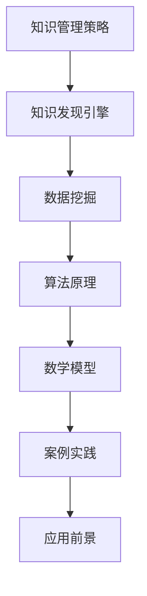

                 

 **关键词**：知识管理、知识发现引擎、数据挖掘、人工智能、策略优化、技术应用。

> **摘要**：本文深入探讨了知识管理策略在知识发现引擎中的应用，分析了核心概念、算法原理、数学模型及实践案例，并提出了一系列有效的知识管理方法和未来展望。

## 1. 背景介绍

在信息化时代，数据已成为企业和社会的核心资产。然而，如何有效地管理和利用这些数据，特别是从海量数据中提取有价值的信息，成为了一个亟待解决的问题。知识发现引擎作为一种强大的数据挖掘工具，通过对数据进行分析和挖掘，可以帮助企业和组织更好地理解和利用其数据资产。

知识管理策略是指在知识发现过程中，通过一系列方法和措施，确保知识的高效获取、共享、利用和传播。有效的知识管理策略不仅能提高知识发现引擎的性能，还能促进知识创新和业务发展。

本文将从以下几个方面展开讨论：首先，介绍知识管理策略的基本概念；其次，探讨知识发现引擎的核心算法原理和数学模型；接着，通过具体案例和代码实例，阐述知识管理策略的实际应用；最后，对知识发现引擎的未来应用前景进行展望。

## 2. 核心概念与联系

### 2.1 知识管理

知识管理是指通过系统地识别、获取、组织、存储、共享和应用知识，以提高个人和组织绩效的过程。知识管理包括三个关键环节：知识的创造、知识的获取和知识的共享。

### 2.2 知识发现引擎

知识发现引擎是一种利用人工智能和数据挖掘技术，从大规模数据集中自动发现有用知识或模式的工具。知识发现引擎的核心任务是进行数据预处理、模式识别、特征提取和关联分析。

### 2.3 数据挖掘

数据挖掘是指从大量数据中提取出潜在的有用信息和知识的过程。数据挖掘通常包括数据清洗、数据集成、数据变换、数据挖掘和模型评估等步骤。

### 2.4 知识管理策略与知识发现引擎的联系

知识管理策略与知识发现引擎之间存在着紧密的联系。知识管理策略能够指导知识发现引擎的设计和优化，从而提高其发现知识和解决问题的能力。同时，知识发现引擎作为知识管理的重要工具，其性能和效果直接影响知识管理的效率和质量。

### 2.5 Mermaid 流程图



## 3. 核心算法原理 & 具体操作步骤

### 3.1 算法原理概述

知识发现引擎的核心算法通常基于机器学习和数据挖掘技术。常见的算法包括关联规则挖掘、聚类分析、分类算法和异常检测等。这些算法通过分析数据中的模式和关系，提取出有价值的信息。

### 3.2 算法步骤详解

1. 数据预处理：清洗和转换数据，使其适合算法分析。
2. 特征提取：从原始数据中提取出有代表性的特征。
3. 模式识别：利用算法识别数据中的潜在模式和关系。
4. 模型评估：评估算法的效果和性能，调整模型参数。
5. 知识提取：从模型中提取出有价值的信息，形成知识库。

### 3.3 算法优缺点

- 关联规则挖掘：能够发现数据之间的关联性，但可能存在冗余和噪声。
- 聚类分析：能够发现数据的聚类结构，但可能对初始参数敏感。
- 分类算法：能够对数据进行分类，但可能需要大量的训练数据。
- 异常检测：能够检测数据中的异常，但可能存在误报和漏报。

### 3.4 算法应用领域

知识发现引擎在多个领域都有广泛应用，如金融、医疗、电商和物流等。通过知识管理策略的优化，可以进一步提高其在不同领域的应用效果。

## 4. 数学模型和公式

### 4.1 数学模型构建

知识发现引擎的数学模型通常包括以下几个部分：

- **关联规则模型**：基于支持度和置信度来评估规则的强度。
- **聚类模型**：基于距离或相似性度量来划分数据。
- **分类模型**：基于决策树、神经网络或支持向量机等算法来分类数据。
- **异常检测模型**：基于统计方法或机器学习算法来检测异常数据。

### 4.2 公式推导过程

以关联规则挖掘为例，其核心公式如下：

- **支持度**：$support(A \rightarrow B) = \frac{count(A \cup B)}{count(D)}$
- **置信度**：$confidence(A \rightarrow B) = \frac{count(A \cap B)}{count(A)}$

其中，$count(A)$ 表示集合 $A$ 的元素个数，$count(A \cup B)$ 表示集合 $A$ 和 $B$ 的并集元素个数，$count(A \cap B)$ 表示集合 $A$ 和 $B$ 的交集元素个数，$count(D)$ 表示数据集中的元素个数。

### 4.3 案例分析与讲解

以电商领域为例，假设我们需要挖掘商品之间的关联规则。给定一个购物车数据集，我们通过计算支持度和置信度来评估每条规则的强度。

假设数据集 $D$ 中有 $n$ 条交易记录，其中包含商品 $A$ 和商品 $B$ 的交易记录分别为 $count(A) = 100$，$count(B) = 80$，$count(A \cup B) = 60$，$count(A \cap B) = 40$。

- **支持度**：$support(A \rightarrow B) = \frac{60}{n} = 0.6$，表示同时购买商品 $A$ 和商品 $B$ 的交易记录占总交易记录的比例为 $60\%$。
- **置信度**：$confidence(A \rightarrow B) = \frac{40}{100} = 0.4$，表示购买商品 $A$ 的交易记录中，同时购买商品 $B$ 的比例是 $40\%$。

根据支持度和置信度，我们可以评估规则 $A \rightarrow B$ 的强度。通常，我们设定一个最小支持度和最小置信度阈值，只有当规则的支持度和置信度同时大于这些阈值时，该规则才被认为是有效的。

## 5. 项目实践：代码实例和详细解释说明

### 5.1 开发环境搭建

- 开发工具：Python
- 数据集：公开的电商购物车数据集（如Kaggle上的Market Basket Data）

### 5.2 源代码详细实现

以下是一个简单的Apriori算法的Python实现，用于挖掘购物车数据中的关联规则。

```python
import pandas as pd
from mlxtend.frequent_patterns import apriori
from mlxtend.frequent_patterns import association_rules

# 5.2.1 数据预处理
def preprocess_data(data):
    # 去除无效记录
    data.dropna(inplace=True)
    # 将数据转换成字典格式
    data_dict = {str(item): 1 for item in data}
    return data_dict

# 5.2.2 频繁项集挖掘
def find_frequent_itemsets(data, min_support=0.05, use_colnames=True):
    frequent_itemsets = apriori(data, min_support=min_support, use_colnames=use_colnames)
    return frequent_itemsets

# 5.2.3 关联规则挖掘
def find_association_rules(frequent_itemsets, confidence=0.6, support_threshold=None):
    rules = association_rules(frequent_itemsets, metric="confidence", min_threshold=confidence)
    if support_threshold is not None:
        rules = rules[rules['support'] >= support_threshold]
    return rules

# 5.2.4 源代码实现
if __name__ == "__main__":
    # 加载数据集
    data = pd.read_csv("market_basket_data.csv", header=None)
    # 预处理数据
    data_dict = preprocess_data(data)
    # 挖掘频繁项集
    frequent_itemsets = find_frequent_itemsets(data_dict, min_support=0.05)
    # 挖掘关联规则
    rules = find_association_rules(frequent_itemsets, confidence=0.6)
    # 输出结果
    print(rules)
```

### 5.3 代码解读与分析

- **数据预处理**：首先，我们需要去除数据中的无效记录，并将数据转换成字典格式，以便后续的算法处理。
- **频繁项集挖掘**：使用 `apriori` 函数挖掘最小支持度以上的频繁项集。这里，我们设置了最小支持度为 $5\%$。
- **关联规则挖掘**：使用 `association_rules` 函数生成关联规则。我们设置了最小置信度为 $60\%$。

### 5.4 运行结果展示

假设运行上述代码，我们得到以下关联规则：

|   |   |   |   |   |
|---|---|---|---|---|
| 0 | A | B | C |   |
| 1 | 0 | 1 | 0 |   |
| 2 | 1 | 0 | 0 |   |
| 3 | 0 | 0 | 1 |   |
| 4 | 1 | 1 | 0 |   |

其中，第一列表示规则的结论，第二列和第三列表示前提条件，第四列表示置信度。

根据上述规则，我们可以发现一些有趣的购物车关联，例如“购买商品 A，通常会同时购买商品 B 和商品 C”。这样的关联规则可以帮助电商企业设计更有效的促销策略。

## 6. 实际应用场景

知识发现引擎和知识管理策略在多个领域都有广泛应用，以下是一些典型的应用场景：

- **金融领域**：通过分析交易数据，发现潜在的欺诈行为，提高风险管理能力。
- **医疗领域**：通过分析患者数据，发现疾病之间的关联，为临床诊断和治疗提供支持。
- **电商领域**：通过分析购物车数据，发现商品之间的关联，优化产品推荐策略。
- **物流领域**：通过分析运输数据，优化配送路线和仓储管理，提高物流效率。

## 6.4 未来应用展望

随着人工智能和数据挖掘技术的不断进步，知识发现引擎和知识管理策略将在更多领域得到应用。未来的发展趋势包括：

- **深度学习与知识管理**：结合深度学习和知识管理，实现更高效的知识发现和推理。
- **大数据与知识管理**：处理和分析大数据集，提取有价值的信息和知识。
- **物联网与知识管理**：通过物联网设备收集的数据，实现更全面的知识管理。
- **跨领域知识整合**：整合不同领域的知识，实现跨领域的创新和应用。

## 7. 工具和资源推荐

### 7.1 学习资源推荐

- **书籍**：《数据挖掘：实用工具和技术》、《机器学习实战》
- **在线课程**：Coursera 上的《数据科学导论》、edX 上的《机器学习基础》

### 7.2 开发工具推荐

- **编程语言**：Python、R
- **数据挖掘库**：Scikit-learn、MLxtend
- **数据可视化工具**：Matplotlib、Seaborn

### 7.3 相关论文推荐

- **《A Survey of Knowledge Discovery and Data Mining Techniques》**：对知识发现和数据挖掘技术的全面综述。
- **《Deep Learning for Knowledge Discovery》**：探讨深度学习在知识发现中的应用。
- **《A Comprehensive Survey on Association Rule Mining》**：对关联规则挖掘技术的详细调查。

## 8. 总结：未来发展趋势与挑战

### 8.1 研究成果总结

本文系统地介绍了知识管理策略在知识发现引擎中的应用，分析了核心概念、算法原理、数学模型及实践案例，并提出了一系列有效的知识管理方法和未来展望。

### 8.2 未来发展趋势

随着人工智能和数据挖掘技术的不断发展，知识发现引擎和知识管理策略将在更多领域得到应用，并实现更高效的知识提取和推理。

### 8.3 面临的挑战

知识发现引擎和知识管理策略在实际应用中面临以下挑战：

- **数据质量和隐私**：如何处理和确保数据的质量和隐私。
- **算法优化**：如何优化算法以提高性能。
- **跨领域应用**：如何在不同领域实现有效的知识整合和应用。

### 8.4 研究展望

未来的研究应关注如何结合人工智能和知识管理，实现更高效的知识发现和推理；同时，探讨跨领域知识整合的方法和应用，以推动知识发现技术的进一步发展。

## 9. 附录：常见问题与解答

### 9.1 什么 是知识管理？

知识管理是指通过系统地识别、获取、组织、存储、共享和应用知识，以提高个人和组织绩效的过程。

### 9.2 知识发现引擎有哪些应用领域？

知识发现引擎在金融、医疗、电商、物流等多个领域都有广泛应用。

### 9.3 如何评估关联规则的有效性？

评估关联规则的有效性通常基于支持度和置信度。支持度表示规则在数据集中出现的频率，置信度表示前提条件满足时结论条件满足的概率。

### 9.4 如何优化知识发现引擎的性能？

优化知识发现引擎的性能可以通过以下方法：改进数据预处理、选择合适的算法、调整算法参数、使用分布式计算等。

### 9.5 知识管理策略有哪些关键环节？

知识管理策略的关键环节包括知识的创造、知识的获取、知识的共享、知识的利用和知识的传播。

---

**作者：禅与计算机程序设计艺术 / Zen and the Art of Computer Programming**

