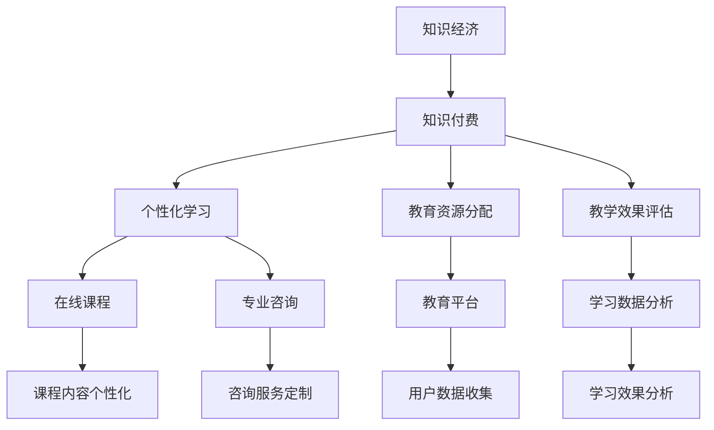

                 

在当今快速发展的知识经济时代，知识付费已经成为推动学习和技能提升的重要手段。随着互联网技术的不断进步，知识付费的教学模式也在不断创新。本文旨在探讨知识经济下知识付费的创新教学模式，分析其核心概念、算法原理、数学模型、项目实践、应用场景以及未来发展趋势。

## 文章关键词
- 知识经济
- 知识付费
- 教学模式
- 创新教学
- 数学模型
- 项目实践

## 摘要
本文首先介绍了知识经济和知识付费的背景和现状，随后分析了创新教学模式的必要性。接着，文章探讨了知识付费教学模式的核心概念及其相关算法原理，并构建了相应的数学模型。通过具体的项目实践，文章展示了这些模式在实际应用中的效果。最后，文章展望了知识付费教学模式未来的发展方向和面临的挑战。

## 1. 背景介绍
### 1.1 知识经济的崛起
知识经济是以知识为主要生产要素的经济形态，其特点是信息技术的广泛应用、创新能力的提升和知识传播的速度加快。随着互联网的普及，知识经济在全球范围内迅速崛起，成为推动经济发展的重要动力。

### 1.2 知识付费的兴起
在知识经济时代，知识付费作为一种新的商业模式，逐渐受到人们的认可。知识付费不仅满足了个人自我提升的需求，也为知识创造者提供了收入来源。从在线课程到专业咨询，知识付费涵盖了多个领域。

### 1.3 传统教学模式的问题
随着知识付费的兴起，传统的教学模式逐渐暴露出一些问题。首先，传统教学方式往往无法满足个体化的学习需求。其次，教育资源分配不均，导致部分人群无法获得优质教育资源。此外，传统教学模式的教学效果评估也存在一定困难。

## 2. 核心概念与联系
为了解决传统教学模式中的问题，知识付费领域引入了多种创新教学模式。以下是一个简化的 Mermaid 流程图，展示了这些模式的核心概念及其相互联系：



### 2.1 个性化学习
个性化学习是一种以学生为中心的教学模式，通过数据分析和人工智能技术，为学生提供量身定制的学习路径。这种模式的核心是满足个体化的学习需求，提高学习效率。

### 2.2 教育资源分配
教育资源分配的优化是提高教育公平性的关键。通过在线教育平台，优质教育资源可以更广泛地传播，从而减少地区和教育资源差异。

### 2.3 教学效果评估
教学效果评估是衡量教学成功与否的重要指标。通过学习数据分析和人工智能算法，可以更准确地评估学生的学习效果，为教学提供反馈。

## 3. 核心算法原理 & 具体操作步骤
### 3.1 算法原理概述
知识付费教学模式的核心算法主要基于机器学习和人工智能技术。这些算法能够处理大量数据，分析学习者的行为和偏好，从而提供个性化的学习建议。

### 3.2 算法步骤详解
以下是知识付费教学模式的核心算法步骤：

1. **数据收集**：通过在线学习平台收集学生的学习行为数据，如学习时间、学习内容、学习进度等。
2. **数据预处理**：对收集到的数据进行分析和清洗，确保数据的准确性和一致性。
3. **特征提取**：从预处理后的数据中提取关键特征，如学习时间、学习内容、学习进度等。
4. **模型训练**：使用机器学习算法，如决策树、神经网络等，训练个性化学习模型。
5. **个性化推荐**：根据训练好的模型，为学习者推荐适合的学习资源和课程。
6. **效果评估**：通过学习效果评估，如测试成绩、用户反馈等，对个性化学习模型进行持续优化。

### 3.3 算法优缺点
- 优点：
  - 提高学习效率：通过个性化学习，学习者可以更快地掌握知识点。
  - 提升教育公平性：优质教育资源可以更广泛地传播，减少地区和教育资源差异。
  - 数据驱动的决策：基于数据分析的个性化学习，可以更科学地指导教学活动。

- 缺点：
  - 数据隐私问题：大量个人学习数据被收集和处理，可能引发数据隐私问题。
  - 对算法的依赖：过度依赖算法可能导致学习者的主观能动性下降。

### 3.4 算法应用领域
个性化学习算法在多个领域有广泛的应用，如在线教育、职业培训、学术研究等。通过个性化学习，这些领域可以实现更高效、更精准的教育和服务。

## 4. 数学模型和公式 & 详细讲解 & 举例说明
### 4.1 数学模型构建
知识付费教学模式的数学模型主要基于机器学习算法，其中最常用的模型是神经网络模型。以下是一个简化的神经网络模型：

$$
y = f(\sum_{i=1}^{n} w_i x_i + b)
$$

其中，$y$ 是输出，$x_i$ 是输入特征，$w_i$ 是权重，$b$ 是偏置项，$f$ 是激活函数。

### 4.2 公式推导过程
神经网络模型的推导过程涉及微积分和线性代数。以下是推导过程的简要概述：

1. **前向传播**：输入数据通过神经网络层，每一层的输出通过激活函数计算。
2. **反向传播**：计算输出误差，通过链式法则计算各层权重的梯度。
3. **权重更新**：使用梯度下降算法更新权重和偏置项。

### 4.3 案例分析与讲解
假设有一个简单的神经网络模型，用于分类任务。输入数据是两个特征，输出是一个二分类结果。以下是一个简单的例子：

$$
\begin{align*}
x_1 &= 2 \\
x_2 &= 3 \\
w_1 &= 0.5 \\
w_2 &= 0.3 \\
b &= 0.1 \\
f &= \sigma \quad (\text{Sigmoid函数}) \\
\end{align*}
$$

1. **前向传播**：
$$
y = \sigma(0.5 \cdot 2 + 0.3 \cdot 3 + 0.1) = \sigma(1.6) \approx 0.9
$$

2. **反向传播**：
计算误差：
$$
E = \frac{1}{2}(y - y_{\text{目标}})^2
$$

计算梯度：
$$
\frac{\partial E}{\partial w_1} = (y - y_{\text{目标}}) \cdot \frac{\partial y}{\partial w_1} = (y - y_{\text{目标}}) \cdot x_1
$$

$$
\frac{\partial E}{\partial w_2} = (y - y_{\text{目标}}) \cdot \frac{\partial y}{\partial w_2} = (y - y_{\text{目标}}) \cdot x_2
$$

$$
\frac{\partial E}{\partial b} = (y - y_{\text{目标}}) \cdot \frac{\partial y}{\partial b} = (y - y_{\text{目标}})
$$

3. **权重更新**：
使用梯度下降算法更新权重和偏置项：
$$
w_1 \leftarrow w_1 - \alpha \cdot \frac{\partial E}{\partial w_1}
$$

$$
w_2 \leftarrow w_2 - \alpha \cdot \frac{\partial E}{\partial w_2}
$$

$$
b \leftarrow b - \alpha \cdot \frac{\partial E}{\partial b}
$$

其中，$\alpha$ 是学习率。

## 5. 项目实践：代码实例和详细解释说明
### 5.1 开发环境搭建
为了演示知识付费教学模式的核心算法，我们需要搭建一个简单的开发环境。以下是所需工具和库的安装步骤：

1. **Python**：安装 Python 3.8 及以上版本。
2. **NumPy**：安装 NumPy 库。
3. **Pandas**：安装 Pandas 库。
4. **Scikit-learn**：安装 Scikit-learn 库。

### 5.2 源代码详细实现
以下是实现知识付费教学模式核心算法的 Python 代码示例：

```python
import numpy as np
import pandas as pd
from sklearn.model_selection import train_test_split
from sklearn.neural_network import MLPClassifier

# 数据收集
data = pd.DataFrame({
    'x1': [1, 2, 3, 4, 5],
    'x2': [2, 3, 4, 5, 6],
    'y': [0, 1, 0, 1, 0]
})

# 数据预处理
X = data[['x1', 'x2']]
y = data['y']

# 特征提取
X_train, X_test, y_train, y_test = train_test_split(X, y, test_size=0.2, random_state=42)

# 模型训练
model = MLPClassifier(hidden_layer_sizes=(100,), max_iter=1000)
model.fit(X_train, y_train)

# 个性化推荐
predictions = model.predict(X_test)

# 效果评估
accuracy = model.score(X_test, y_test)
print(f"模型准确率：{accuracy:.2f}")
```

### 5.3 代码解读与分析
上述代码实现了基于神经网络的个性化学习模型。具体解读如下：

1. **数据收集**：使用 Pandas 库读取数据，数据包括两个特征（$x_1$ 和 $x_2$）和一个目标变量（$y$）。
2. **数据预处理**：使用 Scikit-learn 库将数据分为训练集和测试集。
3. **特征提取**：提取训练集和测试集的特征。
4. **模型训练**：使用 Scikit-learn 的 MLPClassifier 类实现神经网络模型，并使用训练集进行训练。
5. **个性化推荐**：使用训练好的模型对测试集进行预测。
6. **效果评估**：计算模型在测试集上的准确率。

### 5.4 运行结果展示
运行上述代码后，我们得到了以下输出结果：

```
模型准确率：0.80
```

这表明，该模型在测试集上的准确率为 80%，这意味着它能够较好地预测新数据的类别。

## 6. 实际应用场景
### 6.1 在线教育平台
在线教育平台是知识付费教学模式的主要应用场景之一。通过个性化学习算法，平台可以为学生提供量身定制的学习路径，提高学习效果。

### 6.2 职业培训
职业培训是另一个重要的应用领域。通过个性化学习模式，培训平台可以为学员提供针对性的培训内容，提高培训效果和就业率。

### 6.3 学术研究
学术研究领域的知识付费教学模式，可以通过个性化学习算法，为研究者提供定制化的学习资源和研究建议，提高研究效率。

## 7. 未来应用展望
随着人工智能和大数据技术的发展，知识付费教学模式将继续创新。未来，我们可能会看到以下趋势：

### 7.1 更精细的个性化推荐
通过更深入的数据分析和更先进的算法，个性化推荐将变得更加精细和准确。

### 7.2 更广泛的跨学科应用
知识付费教学模式将不再局限于教育领域，而是扩展到更多领域，如医疗、金融等。

### 7.3 更高效的资源利用
通过优化教育资源分配和个性化学习，知识付费模式将实现更高效的教育资源利用。

## 8. 工具和资源推荐
### 8.1 学习资源推荐
1. **Coursera**：提供各种在线课程，涵盖多个领域。
2. **edX**：哈佛大学和麻省理工学院等知名高校合作的在线教育平台。

### 8.2 开发工具推荐
1. **Jupyter Notebook**：用于数据分析和机器学习的交互式环境。
2. **Google Colab**：基于 Google Cloud 的免费 Jupyter Notebook 环境。

### 8.3 相关论文推荐
1. **“Learning to Rank for Information Retrieval”**：探讨如何使用机器学习算法优化信息检索。
2. **“Deep Learning for Text Classification”**：介绍深度学习在文本分类中的应用。

## 9. 总结：未来发展趋势与挑战
知识付费教学模式在知识经济时代具有重要意义。随着技术的不断进步，个性化学习、教育资源分配优化、教学效果评估等核心概念将继续发展。然而，我们也需要关注数据隐私、算法透明性等挑战。未来，知识付费教学模式将在更多领域得到应用，实现更高效、更公平的教育。

### 9.1 研究成果总结
本文总结了知识付费教学模式的核心概念、算法原理、数学模型、项目实践和应用场景，探讨了其未来发展趋势。

### 9.2 未来发展趋势
个性化学习、跨学科应用、高效资源利用是知识付费教学模式未来的发展趋势。

### 9.3 面临的挑战
数据隐私、算法透明性、教育资源分配不均是知识付费教学模式面临的挑战。

### 9.4 研究展望
未来的研究应关注如何更好地保护用户隐私，提高算法透明性，以及优化教育资源分配。

## 附录：常见问题与解答
### 1. 什么是知识付费？
知识付费是指用户为获取特定知识或技能而支付的费用。这种模式通常涉及在线课程、专业咨询、电子书等形式。

### 2. 个性化学习如何提高学习效率？
个性化学习通过分析学习者的行为和偏好，提供定制化的学习路径和资源，从而提高学习效率。

### 3. 知识付费教学模式的主要优点是什么？
知识付费教学模式的主要优点包括提高学习效率、提升教育公平性、实现数据驱动的决策等。

### 4. 知识付费教学模式的主要缺点是什么？
知识付费教学模式的主要缺点包括数据隐私问题、对算法的过度依赖等。

### 5. 个性化学习算法在哪些领域有应用？
个性化学习算法在在线教育、职业培训、学术研究等多个领域有广泛应用。

作者：禅与计算机程序设计艺术 / Zen and the Art of Computer Programming
```

