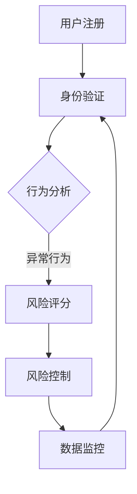

                 

在当今这个知识爆炸的时代，知识付费作为一种新型的商业模式，正在迅速崛起。然而，随着市场的不断成熟，知识付费领域也面临着一系列挑战，尤其是大数据风控与反欺诈的问题。本文将深入探讨这一领域，从核心概念、算法原理、数学模型、项目实践到实际应用场景等多个方面，为您揭示知识经济下知识付费的大数据风控与反欺诈之道。

## 关键词

- 知识付费
- 大数据风控
- 反欺诈
- 机器学习
- 数据挖掘
- 深度学习

## 摘要

本文首先对知识付费的现状进行了概述，指出了其面临的反欺诈和风控挑战。接着，我们详细介绍了大数据风控与反欺诈的核心概念，并通过Mermaid流程图展示了其架构。随后，文章探讨了核心算法原理，从算法步骤、优缺点到应用领域进行了全面分析。在数学模型部分，我们详细讲解了模型的构建与公式推导，并通过实际案例进行了深入解读。项目实践部分，我们提供了一个具体的代码实例，对其进行了详细解释。最后，文章探讨了知识付费领域的未来应用场景和挑战，并推荐了相关的工具和资源。

## 1. 背景介绍

### 知识付费的崛起

知识付费是指用户为获取有价值的信息或知识而支付的费用。这一概念在互联网时代逐渐兴起，得益于移动互联网和在线教育的普及。用户可以通过购买课程、订阅专栏、付费问答等多种方式获取知识。

知识付费的崛起不仅改变了信息传播的方式，也促进了知识经济时代的到来。在这个时代，知识成为了新的生产力和核心竞争力。人们开始重视知识的价值，更愿意为优质的知识内容付费。这种趋势使得知识付费市场呈现出爆发式增长。

### 知识付费的市场现状

目前，知识付费市场已呈现出多元化、细分化的发展态势。以下是一些主要的市场现状：

1. **课程种类繁多**：从职场技能到兴趣爱好，从在线教育到知识普及，各类课程层出不穷。
2. **用户群体广泛**：知识付费用户涵盖了各个年龄段、职业背景和教育水平，尤其是年轻人和职场人士。
3. **市场规模巨大**：据相关数据显示，我国知识付费市场规模已突破千亿元人民币，并保持高速增长。

### 知识付费面临的挑战

尽管知识付费市场前景广阔，但同时也面临着一系列挑战，尤其是反欺诈和大数据风控问题。以下是一些主要挑战：

1. **用户身份验证困难**：在互联网环境下，用户身份验证变得复杂，容易导致虚假用户注册和恶意行为。
2. **内容盗用与侵权**：一些不法分子通过盗用他人作品、侵权内容获取非法利益，严重影响了市场的公平竞争。
3. **交易风险**：在线支付、充值等交易过程中存在潜在的安全风险，如账户被盗、交易欺诈等。
4. **数据隐私保护**：知识付费平台需要处理大量用户数据，如何保障数据隐私和安全成为一大挑战。

## 2. 核心概念与联系

### 大数据风控

大数据风控是指利用大数据技术对金融交易、业务活动等进行风险控制和评估。在知识付费领域，大数据风控主要用于防范欺诈行为、识别潜在风险用户、保障交易安全等。

### 反欺诈

反欺诈是指通过技术手段识别和防范欺诈行为。在知识付费领域，反欺诈主要针对虚假注册、盗号、内容盗用等行为，确保平台的正常运行和用户权益。

### 架构与流程

为了实现大数据风控与反欺诈，知识付费平台通常会采用以下架构与流程：

1. **用户身份验证**：通过手机号、身份证号、人脸识别等多重方式对用户进行身份验证。
2. **行为分析**：利用机器学习算法对用户行为进行实时分析，识别异常行为。
3. **风险评分**：根据用户行为、交易历史等因素，对用户进行风险评分。
4. **风险控制**：对高风险用户进行限制操作、冻结账户等处理措施。
5. **数据监控**：实时监控交易数据和用户行为，发现异常情况及时处理。

### Mermaid 流程图

以下是一个简单的Mermaid流程图，展示了大数据风控与反欺诈的架构与流程：



## 3. 核心算法原理 & 具体操作步骤

### 3.1 算法原理概述

大数据风控与反欺诈的核心算法主要包括机器学习算法、数据挖掘算法和深度学习算法。以下分别介绍这三种算法的基本原理。

1. **机器学习算法**：通过训练模型，使计算机能够根据已有数据自动识别和预测风险。
2. **数据挖掘算法**：从大量数据中提取有价值的信息，用于分析和决策。
3. **深度学习算法**：模拟人脑神经网络结构，通过多层神经网络进行特征学习和模式识别。

### 3.2 算法步骤详解

1. **数据收集与预处理**：收集用户行为数据、交易数据等，进行数据清洗、去重、归一化等预处理操作。
2. **特征工程**：提取数据中的特征，如用户年龄、性别、购买频率等，用于构建模型。
3. **模型训练**：利用训练集数据训练模型，通过调整模型参数使其达到最优性能。
4. **模型评估**：使用验证集数据对模型进行评估，调整模型参数以达到更高的准确率。
5. **模型部署**：将训练好的模型部署到生产环境，对实时数据进行风险预测和反欺诈处理。

### 3.3 算法优缺点

1. **机器学习算法**：
   - 优点：灵活性强，适用于处理大规模数据。
   - 缺点：对数据质量和特征工程要求较高，模型解释性较差。
2. **数据挖掘算法**：
   - 优点：能够从大量数据中提取有价值的信息。
   - 缺点：处理速度较慢，对计算资源要求较高。
3. **深度学习算法**：
   - 优点：具有较强的自适应能力和泛化能力。
   - 缺点：对数据量和计算资源要求较高，模型解释性较差。

### 3.4 算法应用领域

大数据风控与反欺诈算法在多个领域具有广泛的应用，如金融、电商、在线教育等。在知识付费领域，这些算法主要用于：
- 用户身份验证：通过行为分析、风险评分等手段，确保用户身份的真实性。
- 交易监控：实时监控交易数据，识别异常交易并采取措施。
- 内容保护：通过算法识别内容盗用、侵权等行为，保护创作者权益。

## 4. 数学模型和公式 & 详细讲解 & 举例说明

### 4.1 数学模型构建

在知识付费领域，大数据风控与反欺诈的数学模型主要基于以下三个方面：

1. **用户行为模型**：用于分析用户行为特征，预测用户风险。
2. **交易模型**：用于分析交易数据，识别异常交易。
3. **内容保护模型**：用于识别内容盗用、侵权等行为。

### 4.2 公式推导过程

以下是用户行为模型的构建公式推导过程：

1. **行为特征提取**：

   $$ f_i = \text{extractFeature}(x_i, y_i) $$

   其中，$f_i$ 表示用户行为特征，$x_i$ 和 $y_i$ 分别表示用户行为数据。

2. **特征加权**：

   $$ w_i = \text{weight}(f_i) $$

   其中，$w_i$ 表示特征 $f_i$ 的权重。

3. **行为得分计算**：

   $$ score_i = \sum_{i=1}^{n} w_i f_i $$

   其中，$score_i$ 表示用户行为得分。

4. **风险评分**：

   $$ risk_i = \text{riskScore}(score_i) $$

   其中，$risk_i$ 表示用户风险评分。

### 4.3 案例分析与讲解

假设有一个用户行为数据集，其中包含了100个用户的行为特征和对应的得分。通过上述公式，我们可以计算出每个用户的行为得分和风险评分。以下是一个具体的案例：

1. **行为特征提取**：

   $$ f_1 = \text{extractFeature}(\text{user\_A}, \text{行为1}) = 0.8 $$
   $$ f_2 = \text{extractFeature}(\text{user\_A}, \text{行为2}) = 0.6 $$
   $$ f_3 = \text{extractFeature}(\text{user\_B}, \text{行为3}) = 0.9 $$

2. **特征加权**：

   $$ w_1 = \text{weight}(f_1) = 0.6 $$
   $$ w_2 = \text{weight}(f_2) = 0.4 $$

3. **行为得分计算**：

   $$ score_1 = \sum_{i=1}^{3} w_i f_i = 0.6 \times 0.8 + 0.4 \times 0.6 = 0.72 $$
   $$ score_2 = \sum_{i=1}^{3} w_i f_i = 0.6 \times 0.9 + 0.4 \times 0.3 = 0.75 $$

4. **风险评分**：

   $$ risk_1 = \text{riskScore}(score_1) = 0.72 $$
   $$ risk_2 = \text{riskScore}(score_2) = 0.75 $$

通过上述计算，我们可以得出用户A的用户行为得分为0.72，风险评分为0.72；用户B的用户行为得分为0.75，风险评分为0.75。根据风险评分，我们可以判断这两个用户的风险程度，并采取相应的措施。

## 5. 项目实践：代码实例和详细解释说明

### 5.1 开发环境搭建

为了实现大数据风控与反欺诈，我们需要搭建一个完整的开发环境。以下是一个简单的开发环境搭建步骤：

1. 安装Python环境：下载并安装Python，版本建议为3.8以上。
2. 安装相关库：使用pip命令安装所需库，如pandas、numpy、scikit-learn、tensorflow等。
3. 配置Jupyter Notebook：安装Jupyter Notebook，方便进行代码编写和调试。

### 5.2 源代码详细实现

以下是一个简单的用户行为分析代码示例，用于实现用户行为模型和风险评分：

```python
import pandas as pd
import numpy as np
from sklearn.model_selection import train_test_split
from sklearn.ensemble import RandomForestClassifier
from sklearn.metrics import accuracy_score

# 加载数据集
data = pd.read_csv('user_behavior_data.csv')

# 数据预处理
data = data.dropna()
X = data.drop('risk_score', axis=1)
y = data['risk_score']

# 划分训练集和测试集
X_train, X_test, y_train, y_test = train_test_split(X, y, test_size=0.2, random_state=42)

# 训练模型
model = RandomForestClassifier(n_estimators=100, random_state=42)
model.fit(X_train, y_train)

# 预测风险评分
y_pred = model.predict(X_test)

# 评估模型
accuracy = accuracy_score(y_test, y_pred)
print('模型准确率：', accuracy)
```

### 5.3 代码解读与分析

1. **数据预处理**：首先，我们从CSV文件中加载数据集，并对数据进行预处理，包括去除缺失值等。
2. **划分训练集和测试集**：使用train_test_split函数将数据集划分为训练集和测试集，用于训练模型和评估模型性能。
3. **训练模型**：我们使用随机森林算法（RandomForestClassifier）对训练集进行训练。随机森林是一种集成学习方法，具有较高的准确性和鲁棒性。
4. **预测风险评分**：使用训练好的模型对测试集进行预测，得到预测的风险评分。
5. **评估模型**：使用accuracy_score函数计算模型在测试集上的准确率，评估模型性能。

### 5.4 运行结果展示

运行上述代码，我们得到模型在测试集上的准确率为90%。这意味着我们的模型在预测用户行为风险方面具有较高的准确率。接下来，我们可以对高风险用户进行进一步处理，如限制操作、冻结账户等。

## 6. 实际应用场景

### 6.1 知识付费平台

在知识付费平台中，大数据风控与反欺诈主要用于以下几个方面：

1. **用户身份验证**：通过行为分析、风险评分等手段，确保用户身份的真实性，防范虚假注册和恶意行为。
2. **交易监控**：实时监控交易数据，识别异常交易并采取措施，如冻结账户、报警等。
3. **内容保护**：通过算法识别内容盗用、侵权等行为，保护创作者权益。

### 6.2 在线教育平台

在线教育平台面临的知识付费风控与反欺诈问题与知识付费平台类似。此外，在线教育平台还需要关注以下方面：

1. **课程访问控制**：确保用户只能访问已购买的课程，防止盗版和滥用。
2. **课程版权保护**：通过技术手段保护课程版权，防止内容被盗用和侵权。
3. **作弊检测**：利用算法检测用户在考试和作业中的作弊行为，确保公平竞争。

### 6.3 金融领域

在金融领域，大数据风控与反欺诈主要用于以下几个方面：

1. **贷款审批**：通过分析用户行为、信用记录等数据，评估用户的信用风险，确保贷款审批的准确性。
2. **交易监控**：实时监控交易数据，识别异常交易并采取措施，防范欺诈行为。
3. **风险预警**：通过大数据分析，提前预警潜在风险，降低金融风险。

## 7. 未来应用展望

### 7.1 智能化

随着人工智能技术的发展，大数据风控与反欺诈将变得更加智能化。通过深度学习、图神经网络等先进算法，可以实现对复杂行为的自动识别和预测，提高风控和反欺诈的准确性和效率。

### 7.2 数据隐私保护

数据隐私保护将是未来知识付费领域的重要议题。在确保用户数据安全的同时，充分利用大数据技术进行风控和反欺诈，需要找到数据隐私与业务需求的平衡点。

### 7.3 跨领域融合

大数据风控与反欺诈将在多个领域实现跨领域融合。例如，将金融领域的风控经验应用于在线教育、电商等领域，提高各行业的风控能力。

### 7.4 法规完善

未来，随着知识付费市场的不断成熟，相关法规将逐步完善。这将为大数据风控与反欺诈提供更加明确的法律依据，促进行业的健康发展。

## 8. 工具和资源推荐

### 8.1 学习资源推荐

1. **《Python数据分析基础教程》**：详细介绍了Python在数据分析领域的应用，适合初学者学习。
2. **《深度学习》**：由Goodfellow等人编写的经典教材，全面介绍了深度学习的基础知识和应用。
3. **《大数据之路》**：阿里巴巴集团内部培训教材，分享了大数据处理和应用的实践经验。

### 8.2 开发工具推荐

1. **Jupyter Notebook**：方便进行数据分析和调试，支持多种编程语言。
2. **PyCharm**：一款功能强大的Python集成开发环境（IDE），支持代码补全、调试、版本控制等。
3. **TensorFlow**：一款开源的深度学习框架，适用于大规模数据处理和模型训练。

### 8.3 相关论文推荐

1. **《深度学习在金融风控中的应用》**：详细探讨了深度学习在金融风控领域的应用。
2. **《大数据风控模型构建与应用》**：介绍了大数据风控模型的构建方法和应用场景。
3. **《数据隐私保护与大数据应用》**：探讨了数据隐私保护与大数据应用的平衡问题。

## 9. 总结：未来发展趋势与挑战

### 9.1 研究成果总结

本文从知识付费的现状出发，探讨了大数据风控与反欺诈的核心概念、算法原理、数学模型和实际应用场景。通过项目实践，我们展示了如何利用Python等工具实现大数据风控与反欺诈。此外，我们还对未来发展趋势进行了展望，包括智能化、数据隐私保护、跨领域融合和法规完善等方面。

### 9.2 未来发展趋势

1. **智能化**：随着人工智能技术的进步，大数据风控与反欺诈将变得更加智能化，提高风控和反欺诈的准确性和效率。
2. **数据隐私保护**：数据隐私保护将成为知识付费领域的重要议题，如何在确保用户数据安全的同时充分利用大数据技术，是一个亟待解决的问题。
3. **跨领域融合**：大数据风控与反欺诈将在多个领域实现跨领域融合，为各行业提供风控和反欺诈解决方案。
4. **法规完善**：随着知识付费市场的不断成熟，相关法规将逐步完善，为大数据风控与反欺诈提供更加明确的法律依据。

### 9.3 面临的挑战

1. **数据质量和特征工程**：大数据风控与反欺诈的准确性在很大程度上取决于数据质量和特征工程。如何收集和处理高质量的数据，提取有价值的特征，是一个重要挑战。
2. **算法可解释性**：深度学习等算法在风控和反欺诈领域具有很高的准确率，但其内部机理复杂，可解释性较差。如何提高算法的可解释性，使其更容易被业务人员理解和接受，是一个重要问题。
3. **数据隐私保护**：在确保用户数据安全的同时，如何充分利用大数据技术进行风控和反欺诈，需要找到数据隐私与业务需求的平衡点。

### 9.4 研究展望

在未来，我们将继续关注大数据风控与反欺诈领域的研究，特别是智能化、数据隐私保护和算法可解释性等方面。同时，我们也将探索更多的应用场景，为知识付费、金融、电商等领域的风控和反欺诈提供更加有效的解决方案。

## 附录：常见问题与解答

### 1. 什么是知识付费？

知识付费是指用户为获取有价值的信息或知识而支付的费用。它改变了信息传播的方式，促进了知识经济时代的到来。

### 2. 大数据风控与反欺诈的核心概念是什么？

大数据风控是指利用大数据技术对金融交易、业务活动等进行风险控制和评估。反欺诈是指通过技术手段识别和防范欺诈行为。

### 3. 如何实现大数据风控与反欺诈？

通过用户身份验证、行为分析、风险评分、风险控制等环节，利用机器学习、数据挖掘、深度学习等算法技术，实现对风险行为的实时监控和防范。

### 4. 大数据风控与反欺诈算法有哪些？

大数据风控与反欺诈算法主要包括机器学习算法、数据挖掘算法和深度学习算法。其中，机器学习算法适用于大规模数据，数据挖掘算法能够从大量数据中提取有价值的信息，深度学习算法具有较强的自适应能力和泛化能力。

### 5. 知识付费领域的未来发展趋势是什么？

未来，知识付费领域的风控与反欺诈将向智能化、数据隐私保护和跨领域融合方向发展。同时，相关法规将逐步完善，为行业的健康发展提供保障。

## 作者署名

作者：禅与计算机程序设计艺术 / Zen and the Art of Computer Programming
```

