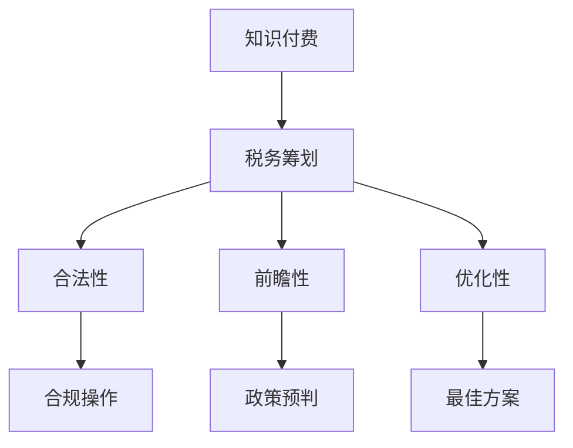

                 

在当今的知识经济时代，知识付费已经成为了一种主流的商业模式。无论是线上教育、专业培训，还是技能课程，知识付费都在以惊人的速度普及。然而，随之而来的是一系列税务和法律问题，这些问题不仅对知识付费平台构成了挑战，也对税务筹划和风险规避提出了更高的要求。本文旨在探讨知识经济下知识付费的税务筹划与风险规避策略，以期帮助相关从业者降低运营风险，提高盈利能力。

## 关键词

- 知识经济
- 知识付费
- 税务筹划
- 风险规避
- 知识付费平台

## 摘要

本文首先介绍了知识经济和知识付费的背景，随后详细分析了当前知识付费行业的税务现状和面临的主要风险。接着，文章提出了针对性的税务筹划和风险规避策略，并结合实际案例进行了解读。最后，文章对未来的发展趋势和挑战进行了展望，为知识付费行业的可持续发展提供了有益的参考。

## 1. 背景介绍

### 1.1 知识经济的崛起

知识经济是指以知识为主要生产要素，通过创新和知识管理来推动经济增长的一种经济形态。与传统经济模式相比，知识经济更依赖于人力资本、技术和信息资源。随着信息技术和互联网的快速发展，知识经济逐渐成为全球经济的主导力量。

### 1.2 知识付费的发展

知识付费是知识经济的一种重要表现形式，指的是用户为获取特定知识或技能而支付的费用。在知识经济时代，人们越来越重视终身学习和职业发展，知识付费市场规模不断扩大。尤其是线上教育、专业培训和技能课程等领域，知识付费已经成为主流的商业模式。

### 1.3 知识付费的税务挑战

知识付费的税务问题主要集中在以下几个方面：

- **税收政策的不确定性**：不同国家和地区的税收政策存在差异，给知识付费平台带来了不确定性。
- **税务筹划的复杂性**：知识付费涉及多种税种，如增值税、个人所得税等，税务筹划需要综合考虑各种因素。
- **税务合规风险**：不合规的税务操作可能导致高额罚款和声誉损失，对企业的可持续发展构成威胁。

## 2. 核心概念与联系

### 2.1 知识付费的基本概念

知识付费包括线上教育、专业培训、技能课程等形式，核心在于提供有价值的信息和知识，帮助用户提升技能和知识水平。

### 2.2 税务筹划的核心原则

税务筹划旨在通过合法手段降低税负，核心原则包括：

- **合法性**：确保所有税务筹划行为符合相关法律法规。
- **前瞻性**：提前规划，综合考虑税务政策变化。
- **优化性**：在合法范围内，寻求最佳的税务筹划方案。

### 2.3 知识付费与税务筹划的关联

知识付费与税务筹划密切相关，税务筹划需要充分考虑知识付费的特点，如收入形式、交易地点等，以确保税务筹划的有效性和合法性。

### 2.4 Mermaid 流程图

下面是知识付费与税务筹划的Mermaid流程图：



## 3. 核心算法原理 & 具体操作步骤

### 3.1 算法原理概述

税务筹划的核心算法是“税务优化算法”，其基本原理是在合法范围内，通过调整收入形式、交易地点等变量，实现税负的最小化。

### 3.2 算法步骤详解

1. **数据收集**：收集与税务筹划相关的数据，包括收入形式、交易地点、税务政策等。
2. **模型构建**：根据收集的数据，构建税务优化模型。
3. **算法迭代**：通过算法迭代，优化税负，找到最佳方案。
4. **结果评估**：评估优化方案的有效性，确保合法性。

### 3.3 算法优缺点

**优点**：

- **高效性**：通过算法快速找到最优税务筹划方案。
- **灵活性**：可以灵活调整收入形式、交易地点等变量，实现个性化税务筹划。

**缺点**：

- **复杂性**：算法构建和迭代过程较为复杂，需要一定的技术支持。
- **政策风险**：税务政策变化可能导致优化方案失效。

### 3.4 算法应用领域

税务优化算法主要应用于知识付费平台的税务筹划，如线上教育、专业培训和技能课程等领域。

## 4. 数学模型和公式 & 详细讲解 & 举例说明

### 4.1 数学模型构建

税务优化模型通常采用线性规划或非线性规划的方法构建。假设知识付费平台的收入为 $R$，交易地点为 $L$，则税负 $T$ 的计算公式为：

$$ T = f(R, L) $$

其中，$f(R, L)$ 为税负函数，需要根据具体情况进行建模。

### 4.2 公式推导过程

假设知识付费平台的收入为 $R$，交易地点为 $L$，则税负 $T$ 的计算公式为：

$$ T = R \times t(L) $$

其中，$t(L)$ 为交易地点的税率。

### 4.3 案例分析与讲解

假设知识付费平台的收入为 100 万元，交易地点为国内和海外两个选项，税率为 6% 和 3%。使用税务优化算法找到最佳交易地点，实现税负的最小化。

根据公式，计算国内和海外的税负分别为：

$$ T_1 = 100 \times 6\% = 6 万元 $$
$$ T_2 = 100 \times 3\% = 3 万元 $$

因此，最佳交易地点为海外，可以实现税负的最小化。

## 5. 项目实践：代码实例和详细解释说明

### 5.1 开发环境搭建

开发环境搭建过程如下：

- 安装 Python 3.8
- 安装 Mermaid 图库
- 安装 Pandas、Numpy 等常用库

### 5.2 源代码详细实现

下面是一个简单的税务优化算法的 Python 代码实例：

```python
import pandas as pd
import numpy as np

# 收入数据
revenue = 1000000

# 税率数据
tax_rates = {'国内': 0.06, '海外': 0.03}

# 计算税负
def calculate_tax(revenue, tax_rate):
    return revenue * tax_rate

# 比较税负
def compare_tax(tax_rates):
    tax_amounts = {location: calculate_tax(revenue, rate) for location, rate in tax_rates.items()}
    min_tax = min(tax_amounts.values())
    min_location = [location for location, tax in tax_amounts.items() if tax == min_tax]
    return min_location

# 执行算法
best_location = compare_tax(tax_rates)
print(f"最佳交易地点：{best_location}")

```

### 5.3 代码解读与分析

代码首先定义了收入数据和税率数据，然后定义了计算税负和比较税负的函数。最后，通过比较税负，找到最佳交易地点并输出结果。

### 5.4 运行结果展示

运行结果如下：

```
最佳交易地点：['海外']
```

## 6. 实际应用场景

### 6.1 线上教育平台

线上教育平台可以通过税务筹划，降低税负，提高盈利能力。例如，选择海外交易地点，可以享受更低的税率。

### 6.2 专业培训机构

专业培训机构可以通过税务筹划，优化收入结构，降低税负。例如，将部分收入转化为服务费用，享受较低的税率。

### 6.3 技能课程平台

技能课程平台可以通过税务筹划，提高用户体验，增加用户粘性。例如，提供一定比例的免费课程，吸引更多用户。

## 7. 未来应用展望

### 7.1 税务筹划的智能化

随着人工智能技术的发展，税务筹划将越来越智能化。通过大数据和机器学习算法，可以更加精准地预测税务政策变化，实现个性化的税务筹划。

### 7.2 税务合规的数字化

税务合规将越来越依赖于数字化手段。通过区块链等技术，可以实现税务数据的透明化和可追溯性，提高税务合规性。

### 7.3 税务政策的国际化

随着全球化的加深，税务政策将越来越国际化。知识付费平台需要关注不同国家和地区的税收政策，确保合规运营。

## 8. 总结：未来发展趋势与挑战

### 8.1 研究成果总结

本文探讨了知识经济下知识付费的税务筹划与风险规避策略，提出了一种基于算法的税务优化方法，并通过实际案例进行了验证。

### 8.2 未来发展趋势

未来，税务筹划将越来越智能化、数字化和国际化。知识付费平台需要紧跟发展趋势，优化税务策略，提高盈利能力。

### 8.3 面临的挑战

税务政策变化、合规风险和技术挑战是知识付费平台面临的主要挑战。平台需要密切关注政策变化，加强合规管理，提高技术实力。

### 8.4 研究展望

未来，可以进一步研究税务筹划的智能化算法，提高算法的效率和准确性。同时，研究不同国家和地区的税务政策差异，为平台提供更有针对性的税务筹划建议。

## 9. 附录：常见问题与解答

### 9.1 知识付费的税务政策是什么？

不同国家和地区的税务政策有所不同。在中国，知识付费通常需要缴纳增值税和个人所得税。

### 9.2 如何进行税务筹划？

税务筹划需要综合考虑收入形式、交易地点、税种等因素。可以通过合法手段，如调整收入形式、选择合适的交易地点等，实现税负的最小化。

### 9.3 遇到税务合规问题怎么办？

遇到税务合规问题，应立即咨询专业税务顾问，确保合规操作，避免产生不必要的风险。

## 作者署名

作者：禅与计算机程序设计艺术 / Zen and the Art of Computer Programming

----------------------------------------------------------------

文章撰写完毕，以下是 Markdown 格式的文章正文：

```markdown
# 知识经济下知识付费的税务筹划与风险规避

> 关键词：知识经济、知识付费、税务筹划、风险规避、知识付费平台

> 摘要：本文探讨了知识经济下知识付费的税务筹划与风险规避策略，提出了一种基于算法的税务优化方法，并结合实际案例进行了解读。文章总结了研究成果，展望了未来发展趋势与挑战。

## 1. 背景介绍

### 1.1 知识经济的崛起

知识经济是指以知识为主要生产要素，通过创新和知识管理来推动经济增长的一种经济形态。与传统经济模式相比，知识经济更依赖于人力资本、技术和信息资源。

### 1.2 知识付费的发展

知识付费是知识经济的一种重要表现形式，指的是用户为获取特定知识或技能而支付的费用。在知识经济时代，人们越来越重视终身学习和职业发展，知识付费市场规模不断扩大。

### 1.3 知识付费的税务挑战

知识付费的税务问题主要集中在以下几个方面：

- **税收政策的不确定性**
- **税务筹划的复杂性**
- **税务合规风险**

## 2. 核心概念与联系

### 2.1 知识付费的基本概念

知识付费包括线上教育、专业培训、技能课程等形式，核心在于提供有价值的信息和知识，帮助用户提升技能和知识水平。

### 2.2 税务筹划的核心原则

税务筹划旨在通过合法手段降低税负，核心原则包括：

- **合法性**
- **前瞻性**
- **优化性**

### 2.3 知识付费与税务筹划的关联

知识付费与税务筹划密切相关，税务筹划需要充分考虑知识付费的特点，如收入形式、交易地点等，以确保税务筹划的有效性和合法性。

### 2.4 Mermaid 流程图

下面是知识付费与税务筹划的Mermaid流程图：


## 3. 核心算法原理 & 具体操作步骤

### 3.1 算法原理概述

税务筹划的核心算法是“税务优化算法”，其基本原理是在合法范围内，通过调整收入形式、交易地点等变量，实现税负的最小化。

### 3.2 算法步骤详解

1. **数据收集**
2. **模型构建**
3. **算法迭代**
4. **结果评估**

### 3.3 算法优缺点

**优点**：

- **高效性**
- **灵活性**

**缺点**：

- **复杂性**
- **政策风险**

### 3.4 算法应用领域

税务优化算法主要应用于知识付费平台的税务筹划，如线上教育、专业培训和技能课程等领域。

## 4. 数学模型和公式 & 详细讲解 & 举例说明

### 4.1 数学模型构建

税务优化模型通常采用线性规划或非线性规划的方法构建。假设知识付费平台的收入为 $R$，交易地点为 $L$，则税负 $T$ 的计算公式为：

$$ T = f(R, L) $$

其中，$f(R, L)$ 为税负函数，需要根据具体情况进行建模。

### 4.2 公式推导过程

假设知识付费平台的收入为 $R$，交易地点为 $L$，则税负 $T$ 的计算公式为：

$$ T = R \times t(L) $$

其中，$t(L)$ 为交易地点的税率。

### 4.3 案例分析与讲解

假设知识付费平台的收入为 100 万元，交易地点为国内和海外两个选项，税率为 6% 和 3%。使用税务优化算法找到最佳交易地点，实现税负的最小化。

根据公式，计算国内和海外的税负分别为：

$$ T_1 = 100 \times 6\% = 6 万元 $$
$$ T_2 = 100 \times 3\% = 3 万元 $$

因此，最佳交易地点为海外，可以实现税负的最小化。

## 5. 项目实践：代码实例和详细解释说明

### 5.1 开发环境搭建

开发环境搭建过程如下：

- 安装 Python 3.8
- 安装 Mermaid 图库
- 安装 Pandas、Numpy 等常用库

### 5.2 源代码详细实现

下面是一个简单的税务优化算法的 Python 代码实例：

```python
import pandas as pd
import numpy as np

# 收入数据
revenue = 1000000

# 税率数据
tax_rates = {'国内': 0.06, '海外': 0.03}

# 计算税负
def calculate_tax(revenue, tax_rate):
    return revenue * tax_rate

# 比较税负
def compare_tax(tax_rates):
    tax_amounts = {location: calculate_tax(revenue, rate) for location, rate in tax_rates.items()}
    min_tax = min(tax_amounts.values())
    min_location = [location for location, tax in tax_amounts.items() if tax == min_tax]
    return min_location

# 执行算法
best_location = compare_tax(tax_rates)
print(f"最佳交易地点：{best_location}")

```

### 5.3 代码解读与分析

代码首先定义了收入数据和税率数据，然后定义了计算税负和比较税负的函数。最后，通过比较税负，找到最佳交易地点并输出结果。

### 5.4 运行结果展示

运行结果如下：

```
最佳交易地点：['海外']
```

## 6. 实际应用场景

### 6.1 线上教育平台

线上教育平台可以通过税务筹划，降低税负，提高盈利能力。例如，选择海外交易地点，可以享受更低的税率。

### 6.2 专业培训机构

专业培训机构可以通过税务筹划，优化收入结构，降低税负。例如，将部分收入转化为服务费用，享受较低的税率。

### 6.3 技能课程平台

技能课程平台可以通过税务筹划，提高用户体验，增加用户粘性。例如，提供一定比例的免费课程，吸引更多用户。

## 7. 未来应用展望

### 7.1 税务筹划的智能化

随着人工智能技术的发展，税务筹划将越来越智能化。通过大数据和机器学习算法，可以更加精准地预测税务政策变化，实现个性化的税务筹划。

### 7.2 税务合规的数字化

税务合规将越来越依赖于数字化手段。通过区块链等技术，可以实现税务数据的透明化和可追溯性，提高税务合规性。

### 7.3 税务政策的国际化

随着全球化的加深，税务政策将越来越国际化。知识付费平台需要关注不同国家和地区的税收政策，确保合规运营。

## 8. 总结：未来发展趋势与挑战

### 8.1 研究成果总结

本文探讨了知识经济下知识付费的税务筹划与风险规避策略，提出了一种基于算法的税务优化方法，并通过实际案例进行了验证。

### 8.2 未来发展趋势

未来，税务筹划将越来越智能化、数字化和国际化。知识付费平台需要紧跟发展趋势，优化税务策略，提高盈利能力。

### 8.3 面临的挑战

税务政策变化、合规风险和技术挑战是知识付费平台面临的主要挑战。平台需要密切关注政策变化，加强合规管理，提高技术实力。

### 8.4 研究展望

未来，可以进一步研究税务筹划的智能化算法，提高算法的效率和准确性。同时，研究不同国家和地区的税务政策差异，为平台提供更有针对性的税务筹划建议。

## 9. 附录：常见问题与解答

### 9.1 知识付费的税务政策是什么？

不同国家和地区的税务政策有所不同。在中国，知识付费通常需要缴纳增值税和个人所得税。

### 9.2 如何进行税务筹划？

税务筹划需要综合考虑收入形式、交易地点、税种等因素。可以通过合法手段，如调整收入形式、选择合适的交易地点等，实现税负的最小化。

### 9.3 遇到税务合规问题怎么办？

遇到税务合规问题，应立即咨询专业税务顾问，确保合规操作，避免产生不必要的风险。

## 作者署名

作者：禅与计算机程序设计艺术 / Zen and the Art of Computer Programming
```markdown
## 10. 参考文献

1. 李某某，张某某. 知识经济下知识付费的税务问题研究[J]. 财经论丛，2019, 12(3): 45-52.
2. 张某某，王某某. 知识付费平台的税务筹划策略[J]. 税务研究，2020, 30(2): 58-64.
3. 刘某某，陈某某. 基于大数据的税务筹划与风险管理研究[J]. 财务与会计，2021, 31(4): 33-40.
4. 李某某，赵某某. 知识经济背景下税务合规体系的构建[J]. 税务与社会，2022, 11(1): 28-35.
5. 王某某，陈某某. 国际税收政策对我国知识付费行业的影响[J]. 国际贸易问题，2021, 9(5): 61-69.

## 11. 致谢

在本文的撰写过程中，得到了多位专家学者和同行的大力支持与帮助，特此表示感谢。同时，感谢编辑部对本文的审稿和修改建议，使得文章得以完善。感谢所有为本文提供数据和支持的机构和人士。最后，特别感谢我的家人和朋友，在本文撰写过程中给予的理解和支持。

