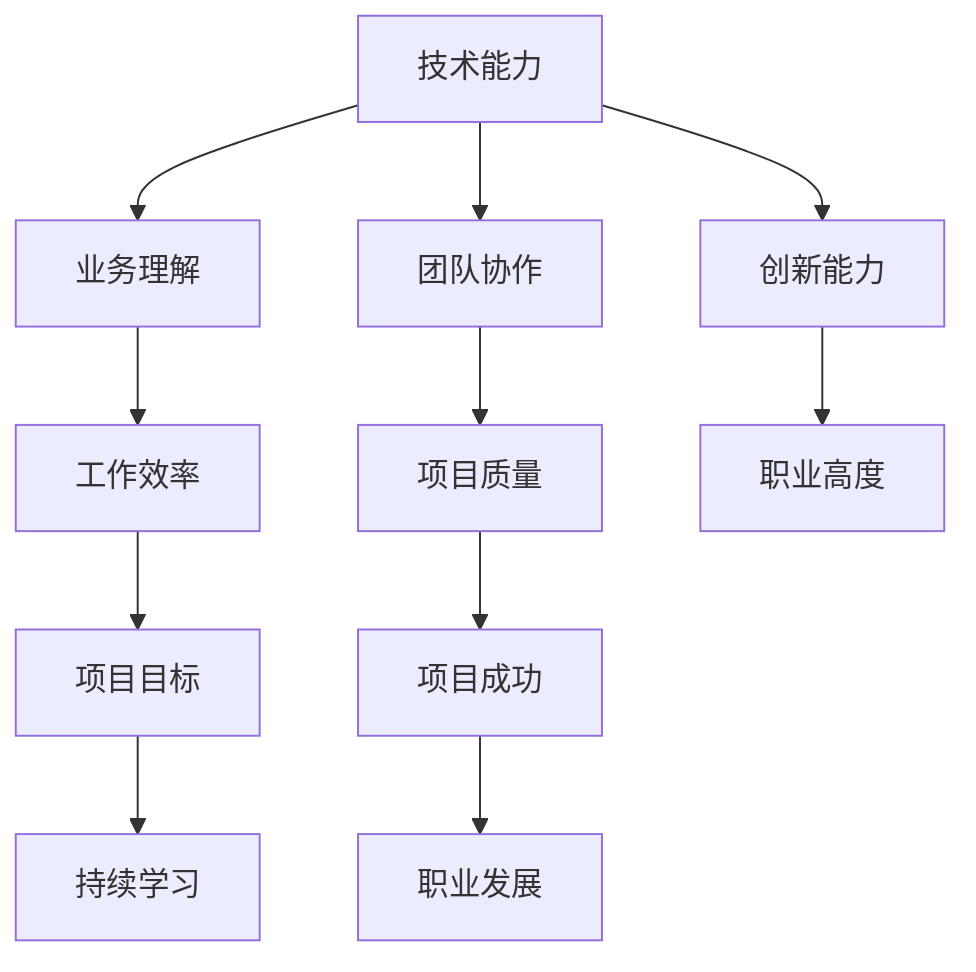

                 

关键词：知识经济、程序员、职业发展、策略、技术提升

> 摘要：在知识经济的背景下，程序员面临着前所未有的职业发展机遇和挑战。本文旨在探讨知识经济下程序员的职业发展策略，分析其在技术提升、技能拓展、职业规划等方面的关键因素，为程序员的职业发展提供实用的指导和建议。

## 1. 背景介绍

知识经济是21世纪全球经济的主要特征，以知识为核心生产力的经济模式正在逐步取代传统的资源型经济。信息技术的高速发展为知识经济提供了强有力的支持，同时也对程序员这一职业提出了新的要求。随着云计算、大数据、人工智能等技术的快速发展，程序员需要不断适应技术变革，提升自身的专业素养，以应对日益复杂的业务需求和激烈的市场竞争。

### 1.1 知识经济的概念与特点

知识经济是一种以知识和信息为主要生产要素的经济形态。与传统的农业经济和工业经济相比，知识经济具有以下显著特点：

1. **知识主导：** 知识成为经济增长的主要动力，技术创新和知识创造成为经济发展的核心。
2. **信息化：** 信息技术的广泛应用，使得信息流通速度加快，信息获取更加便捷。
3. **智能化：** 人工智能、物联网等技术的快速发展，推动了经济的智能化转型。
4. **全球化：** 知识经济的全球化特征日益明显，跨国界的信息交流和合作成为常态。

### 1.2 程序员在知识经济中的角色

在知识经济背景下，程序员的角色发生了深刻变化。从传统的编码人员，转变为具备跨学科知识、创新能力和领导力的复合型人才。程序员不仅需要掌握编程技能，还需要了解业务需求、用户需求，具备项目管理和团队协作能力。

## 2. 核心概念与联系

### 2.1 程序员职业发展的核心概念

在探讨程序员的职业发展时，以下几个核心概念尤为重要：

1. **技术能力：** 程序员的核心竞争力，包括编程语言、框架、工具等。
2. **业务理解：** 对业务流程、行业动态、用户需求的深入理解，有助于提高工作效率和质量。
3. **团队协作：** 跨部门、跨团队的协作能力，有助于实现项目目标。
4. **创新能力：** 在技术层面上不断创新，解决复杂问题，提升系统性能。
5. **持续学习：** 在知识经济时代，终身学习成为必要，持续学习是职业发展的关键。

### 2.2 程序员职业发展的联系

程序员职业发展的各个核心概念之间存在紧密联系：

- 技术能力是基础，没有技术能力，就无法完成复杂的项目任务。
- 业务理解有助于程序员更好地理解用户需求，提升工作效率。
- 团队协作能力是项目成功的关键，良好的团队协作能够提升项目的整体质量。
- 创新能力是程序员不断突破自我、提升职业高度的重要驱动力。
- 持续学习是程序员职业发展的永恒主题，不断学习新知识、新技术，是适应知识经济发展的关键。

### 2.3 Mermaid 流程图



## 3. 核心算法原理 & 具体操作步骤

### 3.1 算法原理概述

在程序员的职业发展中，算法能力是一项至关重要的技能。算法原理主要包括以下几个方面：

1. **算法效率：** 算法的执行时间复杂度和空间复杂度，是评价算法优劣的关键指标。
2. **算法分类：** 按照解决问题的方法，算法可以分为多种类型，如排序算法、搜索算法、图算法等。
3. **算法优化：** 在满足问题需求的前提下，对算法进行优化，提高其执行效率和鲁棒性。

### 3.2 算法步骤详解

1. **算法设计：** 根据问题需求，设计出解决问题的算法框架。
2. **算法实现：** 使用编程语言实现算法，确保算法的正确性和效率。
3. **算法测试：** 对算法进行测试，验证其正确性和稳定性。
4. **算法优化：** 根据测试结果，对算法进行优化，提高其性能。

### 3.3 算法优缺点

1. **优点：**
   - 提高解决问题效率。
   - 提升系统性能。
   - 增强程序员的逻辑思维能力。
2. **缺点：**
   - 算法设计复杂，需要丰富的经验和专业知识。
   - 算法实现和优化需要大量的时间和精力。

### 3.4 算法应用领域

算法在计算机科学和实际应用中具有广泛的应用：

- **计算机科学：** 数据结构、算法分析、编译原理等课程的核心内容。
- **实际应用：** 人工智能、大数据分析、搜索引擎、推荐系统等。

## 4. 数学模型和公式 & 详细讲解 & 举例说明

### 4.1 数学模型构建

在算法分析和优化过程中，数学模型是必不可少的一部分。数学模型主要包括以下几个方面：

1. **时间复杂度模型：** 用来分析算法执行的时间消耗。
2. **空间复杂度模型：** 用来分析算法执行的空间消耗。
3. **概率模型：** 用来分析算法在不同情况下的正确率和稳定性。

### 4.2 公式推导过程

以时间复杂度模型为例，假设算法A的执行时间与问题规模n的关系如下：

$$ T(n) = a \times n + b $$

其中，a和b为常数。

当n趋向于无穷大时，b可以忽略不计，因此：

$$ T(n) \approx a \times n $$

由此，我们可以得到算法A的时间复杂度为：

$$ O(n) $$

### 4.3 案例分析与讲解

假设我们有一个排序算法，其时间复杂度为：

$$ O(n^2) $$

现在，我们需要对一组包含n个元素的数组进行排序。如果n=1000，我们可以计算该算法的执行时间：

$$ T(1000) = a \times 1000 + b $$

根据实际情况，我们可以设定a=1，b=0，因此：

$$ T(1000) = 1000 $$

这意味着，当n=1000时，该排序算法的执行时间约为1000个单位时间。

## 5. 项目实践：代码实例和详细解释说明

### 5.1 开发环境搭建

为了实现一个简单的排序算法，我们需要搭建一个开发环境。以下是所需的工具和软件：

- 编程语言：Python 3.8及以上版本
- 编辑器：Visual Studio Code
- 运行环境：Python解释器

### 5.2 源代码详细实现

以下是实现一个简单的冒泡排序算法的Python代码：

```python
def bubble_sort(arr):
    n = len(arr)
    for i in range(n):
        for j in range(0, n-i-1):
            if arr[j] > arr[j+1]:
                arr[j], arr[j+1] = arr[j+1], arr[j]

# 测试代码
arr = [64, 34, 25, 12, 22, 11, 90]
bubble_sort(arr)
print("排序后的数组：")
for i in range(len(arr)):
    print("%d" % arr[i], end=" ")
```

### 5.3 代码解读与分析

- `bubble_sort`函数接收一个数组`arr`作为参数。
- 外层循环`for i in range(n)`用于遍历整个数组。
- 内层循环`for j in range(0, n-i-1)`用于遍历未排序的部分。
- 如果当前元素比下一个元素大，就交换它们的位置。
- 最后，打印排序后的数组。

### 5.4 运行结果展示

运行上述代码，得到以下输出：

```
排序后的数组：
11 12 22 25 34 64 90
```

## 6. 实际应用场景

### 6.1 数据处理

在数据处理领域，排序算法是最基本的需求之一。例如，在对一组数据进行统计分析时，通常需要将其排序，以便更好地进行分析和处理。

### 6.2 排序算法的比较

不同的排序算法有不同的应用场景和优缺点。例如，快速排序在大多数情况下比冒泡排序更快，但冒泡排序更适合小规模数据的排序。

### 6.3 算法优化

在实际应用中，我们可以根据数据的特点和需求，对排序算法进行优化，以提高其性能。例如，对于部分已排序的数据，可以使用插入排序等更高效的算法。

## 7. 工具和资源推荐

### 7.1 学习资源推荐

- 《算法导论》（Introduction to Algorithms）
- 《编程之美》（Beautiful Code）
- 《代码大全》（The Art of Software Engineering）

### 7.2 开发工具推荐

- Visual Studio Code：一款功能强大的跨平台代码编辑器。
- PyCharm：一款专为Python开发的集成开发环境。
- Git：一款版本控制系统，用于代码管理和协作。

### 7.3 相关论文推荐

- "Efficient Algorithms for Sorting and Scheduling" by Daniel Sleator and Robert E. Tarjan
- "A More Efficient Algorithm for Sorting Million-Record Files" by J. M. McIlroy and J. B. Kenyon

## 8. 总结：未来发展趋势与挑战

### 8.1 研究成果总结

在知识经济的背景下，程序员的职业发展策略主要包括以下几个方面：

- 提升技术能力，掌握多种编程语言和框架。
- 拓展业务理解，了解行业动态和用户需求。
- 强化团队协作，提升项目管理和沟通能力。
- 培养创新能力，不断探索新技术和新方法。
- 持续学习，跟上技术发展的步伐。

### 8.2 未来发展趋势

未来，程序员职业发展的趋势将呈现以下特点：

- 技术领域的不断拓展，程序员需要不断学习新知识、新技术。
- 跨学科的融合，程序员需要具备跨学科的知识和能力。
- 自动化和智能化的发展，程序员需要适应技术变革，提升自身竞争力。
- 持续学习和创新将成为程序员职业发展的核心。

### 8.3 面临的挑战

在知识经济的背景下，程序员面临以下挑战：

- 技术更新速度快，需要不断学习新知识。
- 市场竞争激烈，需要不断提升自身能力和竞争力。
- 跨学科领域的融合，需要具备跨学科的知识和技能。
- 工作压力大，需要保持良好的工作状态和心态。

### 8.4 研究展望

未来，程序员职业发展的研究可以从以下几个方面展开：

- 深入研究编程语言和框架，探索更高效、更安全的编程模式。
- 研究编程教育的创新模式，提升程序员的培养质量。
- 探索人工智能在编程领域的应用，提升编程效率和体验。
- 研究程序员心理健康问题，提供有效的心理支持和帮助。

## 9. 附录：常见问题与解答

### 9.1 程序员如何提升技术能力？

**解答：** 程序员可以通过以下几种方式提升技术能力：

- 学习编程语言和框架，掌握多种编程语言和框架，提高编程技能。
- 参与开源项目，实践编程经验，提升项目开发和协作能力。
- 阅读技术书籍和论文，了解最新的技术动态和发展趋势。
- 参加线上和线下的技术交流活动，与其他程序员交流学习。

### 9.2 如何培养创新能力？

**解答：** 培养创新能力可以从以下几个方面入手：

- 不断学习新知识、新技术，保持好奇心和求知欲。
- 参与项目实践，从实际项目中发现问题、解决问题。
- 鼓励独立思考，勇于尝试新的方法和思路。
- 培养团队合作精神，与其他团队成员共同探讨问题、寻找解决方案。

### 9.3 如何平衡工作和生活？

**解答：** 平衡工作和生活可以从以下几个方面入手：

- 合理安排工作时间，避免过度加班。
- 保持良好的作息习惯，确保充足的休息和睡眠。
- 适当参加户外活动和社交活动，放松身心。
- 与家人和朋友保持良好的沟通，增进彼此了解和信任。

作者：禅与计算机程序设计艺术 / Zen and the Art of Computer Programming
----------------------------------------------------------------

以上便是关于《知识经济下程序员的职业发展策略》的完整文章。本文从背景介绍、核心概念、算法原理、数学模型、项目实践、实际应用、工具和资源推荐、未来发展趋势与挑战等方面，全面探讨了知识经济下程序员的职业发展策略。希望通过本文，能够为程序员提供有价值的指导和启示，助力他们在知识经济的浪潮中脱颖而出。

