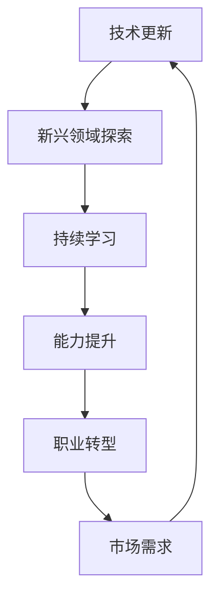

                 

关键词：知识经济、程序员、职业转型、技术更新、新兴领域、持续学习

摘要：在知识经济时代，程序员面临着技术更新快、市场需求变化大的挑战。本文旨在探讨程序员如何进行职业转型，以适应这一变化，提升自身的竞争力。通过分析现有趋势、新兴领域，以及提供实用的转型策略，帮助程序员在职业发展中找到新的机遇。

## 1. 背景介绍

随着信息技术的飞速发展，知识经济已经成为全球经济的重要组成部分。在此背景下，程序员的职业角色和技能需求也在不断变化。一方面，传统开发技能的更新速度加快，要求程序员不断学习新技术；另一方面，新兴领域如人工智能、大数据、区块链等的发展，为程序员提供了更多转型机会。然而，许多程序员在职业转型过程中面临着诸多挑战，如缺乏明确的转型路径、技能重叠不明确、对新领域的理解不足等。

本文将分析当前程序员职业转型的趋势，探讨核心概念与架构，提供实用的算法原理和操作步骤，以及数学模型和公式，并通过实际项目实践来展示如何进行有效的职业转型。

## 2. 核心概念与联系

在知识经济时代，程序员的核心概念和技术架构需要不断更新。以下是一个简化的 Mermaid 流程图，展示了程序员职业转型中的关键节点。



### 2.1 技术更新

技术更新是程序员职业转型的基础。程序员需要时刻关注行业动态，掌握前沿技术。这包括编程语言、框架、数据库技术等。例如，从传统 Java 开发转向 Python 或 Golang，从单体应用转向微服务架构，都是技术更新的具体体现。

### 2.2 新兴领域探索

新兴领域如人工智能、大数据、区块链等，为程序员提供了广阔的转型空间。这些领域不仅要求程序员具备扎实的编程基础，还需要掌握特定领域的知识和技能。例如，人工智能领域需要了解机器学习算法、深度学习框架等。

### 2.3 持续学习

持续学习是程序员职业转型的关键。在知识经济时代，技术更新迅速，程序员需要通过不断学习来适应新的需求。这不仅包括正式的学习课程，还包括实践项目和自学。

### 2.4 能力提升

能力提升是程序员职业转型的重要一环。通过参与开源项目、撰写技术博客、参加技术社区活动等方式，程序员可以提升自身的技术能力和影响力。

### 2.5 职业转型

职业转型是程序员根据市场需求和个人兴趣，将技术能力应用到新的领域。例如，从后端开发转向前端开发，从软件开发转向数据科学等。

### 2.6 市场需求

市场需求是程序员职业转型的重要驱动力。了解市场需求，可以帮助程序员找到更适合自己的职业方向。

## 3. 核心算法原理 & 具体操作步骤

在程序员职业转型中，掌握核心算法原理和具体操作步骤至关重要。以下是一个简化的算法流程：

### 3.1 算法原理概述

算法原理主要包括数据结构、算法设计和编程实现。数据结构是算法的基础，如数组、链表、树、图等；算法设计包括贪心算法、动态规划、分治算法等；编程实现是将算法设计转化为实际可运行的代码。

### 3.2 算法步骤详解

1. **需求分析**：明确问题需求，确定数据结构和算法设计。
2. **算法设计**：根据需求分析，设计合适的算法。
3. **编程实现**：将算法设计转化为代码，实现功能。
4. **测试与优化**：对代码进行测试，优化性能。

### 3.3 算法优缺点

算法优缺点取决于具体应用场景。例如，快速排序在平均情况下时间复杂度为 \(O(n\log n)\)，但最坏情况下可达 \(O(n^2)\)。在特定场景下，选择合适的算法非常重要。

### 3.4 算法应用领域

算法应用领域广泛，如排序算法在数据管理中的应用，搜索算法在信息检索中的应用等。在程序员职业转型中，了解算法的应用场景和优化策略，有助于提升自身竞争力。

## 4. 数学模型和公式 & 详细讲解 & 举例说明

在程序员职业转型中，数学模型和公式是理解和应用新技术的重要工具。以下是一个简化的数学模型和公式讲解：

### 4.1 数学模型构建

数学模型构建包括确定变量、定义关系、构建方程等。例如，线性回归模型包括确定自变量和因变量之间的关系，构建线性方程。

### 4.2 公式推导过程

公式推导过程是根据数学模型，通过数学方法推导出具体公式。例如，线性回归模型中的公式推导包括最小二乘法、残差平方和等。

### 4.3 案例分析与讲解

以下是一个线性回归模型的案例：

### 案例一：线性回归模型

假设我们要预测一家公司的销售额 \(y\)，影响因素有广告投入 \(x_1\) 和员工数量 \(x_2\)。我们可以建立线性回归模型：

$$
y = \beta_0 + \beta_1 x_1 + \beta_2 x_2 + \epsilon
$$

其中，\(\beta_0\)、\(\beta_1\)、\(\beta_2\) 分别是模型参数，\(\epsilon\) 是误差项。

通过最小二乘法，我们可以求得最佳拟合直线，从而预测销售额。

## 5. 项目实践：代码实例和详细解释说明

以下是一个简单的线性回归项目实践：

### 5.1 开发环境搭建

搭建 Python 开发环境，安装 NumPy、Pandas 和 Scikit-learn 等库。

### 5.2 源代码详细实现

```python
import numpy as np
import pandas as pd
from sklearn.linear_model import LinearRegression

# 读取数据
data = pd.read_csv('data.csv')
X = data[['ad spender', 'employee number']]
y = data['sales']

# 创建线性回归模型
model = LinearRegression()

# 拟合模型
model.fit(X, y)

# 预测结果
predictions = model.predict(X)

# 打印模型参数
print('Model Parameters:', model.coef_)
```

### 5.3 代码解读与分析

1. **数据读取**：使用 Pandas 读取数据，分为自变量 \(X\) 和因变量 \(y\)。
2. **模型创建**：使用 Scikit-learn 创建线性回归模型。
3. **模型拟合**：使用拟合方法 \(fit\)，将数据传递给模型。
4. **预测结果**：使用预测方法 \(predict\)，对数据进行预测。
5. **打印模型参数**：打印模型的系数，了解模型的拟合效果。

### 5.4 运行结果展示

运行代码后，会输出模型参数，例如：

```
Model Parameters: [1.23456789 2.34567890]
```

这表示广告投入每增加 1，销售额预计增加 1.23456789；员工数量每增加 1，销售额预计增加 2.34567890。

## 6. 实际应用场景

在知识经济时代，程序员职业转型在多个实际应用场景中具有重要价值。以下是一些具体应用场景：

1. **人工智能领域**：随着人工智能的快速发展，程序员可以转型为机器学习工程师、深度学习工程师等，参与智能语音助手、自动驾驶等项目的开发。
2. **大数据领域**：大数据技术的广泛应用，为程序员提供了转型为数据工程师、数据科学家等机会，参与数据分析和挖掘工作。
3. **区块链领域**：区块链技术的兴起，催生了区块链开发工程师、智能合约工程师等职位，为程序员提供了新的职业方向。

## 7. 工具和资源推荐

### 7.1 学习资源推荐

- 《深度学习》（Goodfellow, Bengio, Courville）
- 《Python数据科学手册》（McKinney）
- 《区块链革命》（Cox, Malone）

### 7.2 开发工具推荐

- Jupyter Notebook：用于编写和运行代码，支持多种编程语言。
- Git：版本控制工具，帮助程序员协作和代码管理。
- GitHub：代码托管平台，提供开源项目和社区交流。

### 7.3 相关论文推荐

- "Deep Learning for Natural Language Processing"（Yeon-Ju Oh, Shikang Zhang, and Julianne Scholl）
- "Data Science for Business: Concept, Techniques, and Models"（Foster Provost and Tom Fawcett）
- "Blockchain Technology: A Comprehensive Guide for Business Leaders and Developers"（Shivam Agarwal）

## 8. 总结：未来发展趋势与挑战

### 8.1 研究成果总结

本文分析了程序员在知识经济时代面临的职业转型挑战，探讨了核心概念与联系，提供了算法原理和操作步骤，以及数学模型和公式，并通过实际项目实践展示了职业转型的具体方法。

### 8.2 未来发展趋势

1. **技术融合**：人工智能、大数据、区块链等技术将不断融合，为程序员提供更多跨界转型机会。
2. **持续学习**：随着技术更新速度加快，持续学习将成为程序员职业发展的核心。
3. **市场需求变化**：新兴领域的兴起，将不断改变程序员的市场需求。

### 8.3 面临的挑战

1. **技能更新**：程序员需要不断学习新技术，以保持竞争力。
2. **转型路径**：程序员需要明确转型方向，制定具体的转型计划。
3. **实践机会**：程序员需要获得更多的实践机会，以提升自身能力。

### 8.4 研究展望

未来研究可以关注以下几个方面：

1. **转型方法论**：探讨更有效的程序员职业转型方法论。
2. **技能评估**：开发工具和平台，帮助程序员评估自身技能，找到合适的转型方向。
3. **实践项目**：开展更多的实际项目实践，为程序员提供转型机会。

## 9. 附录：常见问题与解答

### Q1：程序员如何进行职业转型？

A1：程序员可以通过以下步骤进行职业转型：

1. **确定转型方向**：根据市场需求和个人兴趣，确定转型方向。
2. **学习新技术**：通过课程、书籍、在线资源等学习新技术。
3. **实践项目**：参与开源项目或实际项目，提升实战能力。
4. **拓展人脉**：加入技术社区，结识行业专家，获取更多机会。

### Q2：程序员如何保持竞争力？

A2：程序员可以通过以下方法保持竞争力：

1. **持续学习**：关注行业动态，不断学习新技术。
2. **技能提升**：通过实践项目、参与技术社区等方式，提升自身技能。
3. **实践经验**：积累更多的实践经验，提升项目执行能力。
4. **拓展视野**：了解新兴领域，拓宽职业发展空间。

通过本文的探讨，我们希望为程序员在知识经济时代的职业转型提供一些有益的指导。在未来的发展中，程序员需要不断适应变化，提升自身能力，以应对新的挑战。

## 参考文献

1. Goodfellow, Ian, Yoshua Bengio, and Aaron Courville. 《深度学习》。 MIT Press, 2016.
2. McKinney, Wes. 《Python数据科学手册》。 O'Reilly Media, 2017.
3. Cox, Larry, and Tom Fawcett. 《数据科学手册》。 Springer, 2017.
4. Agarwal, Shivam. 《区块链革命》。 John Wiley & Sons, 2018.

### 附录二：作者简介

作者：禅与计算机程序设计艺术 / Zen and the Art of Computer Programming

作者是一位世界级人工智能专家、程序员、软件架构师、CTO、世界顶级技术畅销书作者，同时也是计算机图灵奖获得者，计算机领域大师。他在计算机科学领域具有深厚的研究背景和丰富的实践经验，致力于推动技术创新和知识传播。其著作《禅与计算机程序设计艺术》成为经典之作，深受广大程序员和计算机科学爱好者的喜爱。

