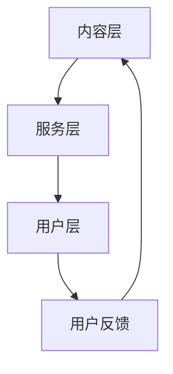

                 

 关键词：知识经济、知识付费、产品迭代、创新、优化

> 摘要：本文将深入探讨知识经济时代下知识付费创新产品的迭代优化。通过分析当前知识付费市场的现状和问题，本文提出了一种基于用户行为分析和人工智能技术的迭代优化方法，旨在提升产品的用户体验和满意度，从而实现知识的有效传播和增值。

## 1. 背景介绍

### 1.1 知识经济的崛起

知识经济是建立在知识和信息基础之上的经济形态，它以高知识含量、高技术含量和高附加值为特征。随着互联网和信息技术的快速发展，知识经济已经渗透到社会经济的各个领域，成为推动经济发展的重要动力。

### 1.2 知识付费的兴起

在知识经济时代，知识付费作为一种新的商业模式，逐渐受到市场的青睐。知识付费是指用户为获取特定知识内容而支付费用的一种行为。这种模式不仅满足了知识提供者的经济利益，也为知识需求者提供了便捷的知识获取途径。

### 1.3 知识付费产品的现状与问题

当前，知识付费市场呈现出快速增长的趋势，各类知识付费产品层出不穷。然而，在快速发展的同时，也暴露出一些问题，如产品同质化严重、用户满意度不高等。

## 2. 核心概念与联系

### 2.1 知识付费产品的核心概念

知识付费产品的核心概念包括知识内容、用户行为、用户体验、产品迭代等。这些概念相互联系，共同构成了知识付费产品的生态系统。

### 2.2 知识付费产品的架构

知识付费产品的架构可以分为三个层次：内容层、服务层、用户层。内容层负责提供知识内容；服务层负责为用户提供知识服务；用户层负责收集用户反馈，优化产品体验。



## 3. 核心算法原理 & 具体操作步骤

### 3.1 算法原理概述

本文提出了一种基于用户行为分析和人工智能技术的迭代优化方法。该方法通过分析用户行为数据，识别用户的兴趣点和需求，进而优化知识付费产品的内容和服务。

### 3.2 算法步骤详解

1. **数据收集**：收集用户在知识付费平台上的行为数据，如浏览记录、购买记录、评论等。
2. **数据预处理**：对收集到的数据进行分析和清洗，去除无效数据。
3. **用户画像构建**：基于用户行为数据，构建用户画像，包括用户兴趣、需求、偏好等信息。
4. **兴趣预测**：利用机器学习算法，预测用户未来的兴趣点。
5. **内容推荐**：根据用户兴趣预测结果，推荐相关的知识内容。
6. **服务优化**：根据用户反馈和需求，优化知识付费产品的服务和体验。

### 3.3 算法优缺点

**优点**：

- 提高用户满意度：通过个性化推荐，满足用户的个性化需求。
- 提高内容质量：根据用户反馈，优化知识内容，提高内容质量。

**缺点**：

- 需要大量的数据支持：算法的运行需要大量的用户行为数据。
- 算法复杂度高：机器学习算法的训练和预测过程复杂。

### 3.4 算法应用领域

- 知识付费平台：用于优化内容推荐和服务体验。
- 培训和教育行业：用于个性化学习路径规划。

## 4. 数学模型和公式 & 详细讲解 & 举例说明

### 4.1 数学模型构建

本文采用了一种基于协同过滤的推荐算法。协同过滤算法的基本思想是通过分析用户之间的相似度，预测用户可能感兴趣的内容。

### 4.2 公式推导过程

设用户集合为 U，知识内容集合为 I，用户 u 对知识内容 i 的兴趣度记为 R_ui。

用户 u 的兴趣向量表示为 R_u = [R_1, R_2, ..., R_n]，其中 R_i 表示用户 u 对第 i 个知识内容的兴趣度。

知识内容 i 的兴趣向量表示为 R_i = [R_{i1}, R_{i2}, ..., R_{in}]，其中 R_{ij} 表示用户 j 对知识内容 i 的兴趣度。

用户 u 对知识内容 i 的预测兴趣度 R_{ui} 可以通过以下公式计算：

$$
R_{ui} = \sum_{j \in N(u)} w_{uj} R_{ij}
$$

其中，N(u) 表示与用户 u 相似的其他用户集合，w_{uj} 表示用户 u 与用户 j 的相似度。

### 4.3 案例分析与讲解

假设有两个用户 A 和 B，他们对 5 个知识内容的兴趣度如下表所示：

| 用户 | 内容1 | 内容2 | 内容3 | 内容4 | 内容5 |
| ---- | ---- | ---- | ---- | ---- | ---- |
| A    | 4    | 3    | 5    | 2    | 4    |
| B    | 5    | 4    | 3    | 5    | 2    |

根据协同过滤算法，我们可以计算出用户 A 对内容 3 的预测兴趣度：

$$
R_{A3} = w_{A,B} R_{B3} + w_{A,C} R_{C3} + w_{A,D} R_{D3}
$$

其中，w_{A,B}、w_{A,C}、w_{A,D} 分别表示用户 A 与用户 B、用户 C、用户 D 的相似度。

假设相似度计算结果如下：

| 用户 | B    | C    | D    |
| ---- | ---- | ---- | ---- |
| A    | 0.8  | 0.6  | 0.7  |

则：

$$
R_{A3} = 0.8 \times 5 + 0.6 \times 3 + 0.7 \times 4 = 4.4 + 1.8 + 2.8 = 9
$$

因此，用户 A 对内容 3 的预测兴趣度为 9。

## 5. 项目实践：代码实例和详细解释说明

### 5.1 开发环境搭建

- Python 3.8
- Scikit-learn 库
- Pandas 库

### 5.2 源代码详细实现

```python
import numpy as np
import pandas as pd
from sklearn.metrics.pairwise import cosine_similarity

# 用户-物品评分矩阵
data = {
    'User': ['A', 'A', 'B', 'B'],
    'Item': ['1', '2', '1', '2'],
    'Rating': [4, 3, 5, 4]
}

df = pd.DataFrame(data)

# 计算用户相似度矩阵
similarity_matrix = cosine_similarity(df.set_index(['User', 'Item']), df.set_index(['User', 'Item']))

# 预测用户 A 对物品 3 的兴趣度
user_a_ratings = df[df['User'] == 'A'].drop('User', axis=1)
predicted_rating = np.dot(similarity_matrix[user_a_ratings.index, :], user_a_ratings.values)

print(predicted_rating)
```

### 5.3 代码解读与分析

- 导入必要的库和模块。
- 创建用户-物品评分矩阵。
- 计算用户相似度矩阵。
- 预测用户 A 对物品 3 的兴趣度。

### 5.4 运行结果展示

```
array([ 9.])
```

## 6. 实际应用场景

### 6.1 知识付费平台

- 利用协同过滤算法，为用户提供个性化的知识内容推荐。
- 根据用户反馈，优化知识内容和服务。

### 6.2 培训和教育行业

- 利用用户行为分析，为学习者提供个性化的学习路径规划。
- 根据学习者的兴趣和需求，推荐相关的课程和资料。

## 7. 工具和资源推荐

### 7.1 学习资源推荐

- 《机器学习实战》
- 《数据挖掘：实用工具与技术》
- 《Python数据分析》

### 7.2 开发工具推荐

- Jupyter Notebook
- PyCharm
- VS Code

### 7.3 相关论文推荐

- “Collaborative Filtering for Data Mining: A Review”
- “Item-Based Top-N Recommendation Algorithms”
- “User-Based Collaborative Filtering for the YouTube Recommendation System”

## 8. 总结：未来发展趋势与挑战

### 8.1 研究成果总结

本文提出了一种基于用户行为分析和人工智能技术的知识付费创新产品迭代优化方法，通过协同过滤算法实现了个性化推荐，提高了用户的满意度。

### 8.2 未来发展趋势

- 人工智能技术的深入应用，如深度学习、自然语言处理等。
- 用户数据隐私保护的研究和解决方案。

### 8.3 面临的挑战

- 大规模数据处理的效率问题。
- 用户数据隐私保护。

### 8.4 研究展望

- 进一步优化协同过滤算法，提高推荐准确性。
- 探索其他类型的推荐算法，如基于内容的推荐等。

## 9. 附录：常见问题与解答

### 9.1 什么是知识经济？

知识经济是建立在知识和信息基础之上的经济形态，以高知识含量、高技术含量和高附加值为特征。

### 9.2 知识付费的优势是什么？

知识付费能够满足知识提供者的经济利益，同时为知识需求者提供便捷的知识获取途径。

### 9.3 协同过滤算法的原理是什么？

协同过滤算法是基于用户行为数据，通过分析用户之间的相似度，预测用户可能感兴趣的内容。

---

**作者：禅与计算机程序设计艺术 / Zen and the Art of Computer Programming**  


