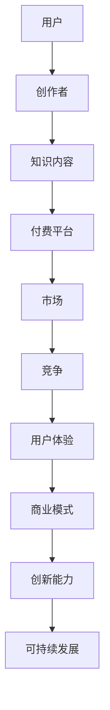

                 

在当今快速发展的知识经济时代，知识付费已成为一种主流的商业模式。然而，随着市场竞争的加剧和用户需求的多样化，传统的知识付费模式面临着诸多挑战。本文将深入探讨知识付费创新的商业模式优化，旨在为企业和创作者提供有效的策略，以提升用户体验、降低运营成本，并实现可持续发展。

## 关键词
- 知识经济
- 知识付费
- 商业模式
- 用户需求
- 用户体验
- 创新策略

## 摘要
本文首先介绍了知识付费的背景和现状，然后分析了当前知识付费商业模式存在的问题。接着，本文提出了几种创新的商业模式优化策略，包括定制化服务、社群化运营、跨界合作等。最后，本文通过案例分析，展示了这些策略在实践中的应用效果，并对未来知识付费的发展趋势和挑战进行了展望。

<|assistant|>### 1. 背景介绍

知识付费起源于信息时代的崛起，随着互联网技术的发展和人们信息消费习惯的改变，知识付费逐渐成为一种新兴的商业形态。知识付费的核心在于用户为获取有价值的信息或知识而付费，其形式包括付费内容订阅、付费课程、付费咨询等。

近年来，知识付费市场呈现爆发式增长。根据相关报告，全球知识付费市场规模已超过千亿美元，并且仍保持高速增长态势。特别是在中国，知识付费市场已成为互联网经济的重要组成部分，涵盖了教育、职场、技能提升等多个领域。

然而，随着知识付费市场的不断扩大，也暴露出了一些问题。首先，市场竞争激烈，同质化产品严重，导致用户选择困难。其次，用户体验不佳，如内容质量参差不齐、服务流程繁琐等。此外，知识付费平台的运营成本较高，盈利模式单一，难以实现可持续发展。

面对这些挑战，知识付费企业需要不断创新商业模式，以提升竞争力，满足用户需求，实现可持续发展。

### 2. 核心概念与联系

在探讨知识付费商业模式优化之前，有必要先了解一些核心概念和它们之间的联系。以下是一个简化的 Mermaid 流程图，用于描述这些概念及其相互关系：



- **用户**：知识付费的主体，他们为获取知识内容而付费。
- **创作者**：生产知识内容的个人或团队，他们通过知识付费获得收益。
- **知识内容**：用户购买的核心产品，其质量和价值直接影响用户体验。
- **付费平台**：提供交易和服务的载体，包括在线课程、电子书、付费专栏等形式。
- **市场**：知识付费的商业环境，包括竞争对手、用户需求等。
- **竞争**：市场中的竞争因素，影响商业模式的设计和优化。
- **用户体验**：用户在获取知识内容过程中所感受到的满意程度。
- **商业模式**：企业通过提供知识内容获取收益的方式和方法。
- **创新能力**：企业适应市场变化、满足用户需求的能力。
- **可持续发展**：企业长期稳定发展的能力。

### 3. 核心算法原理 & 具体操作步骤

#### 3.1 算法原理概述

知识付费商业模式的优化本质上是一个多目标优化问题，需要同时考虑用户体验、盈利能力、可持续发展和市场竞争力。以下是几个核心算法原理：

1. **用户行为分析算法**：通过分析用户的历史行为、偏好和反馈，为用户提供个性化推荐，提高用户体验。
2. **内容质量评估算法**：利用自然语言处理、机器学习等技术，对知识内容的质量进行评估，筛选优质内容。
3. **数据驱动决策算法**：基于大数据分析，优化定价策略、推广策略等，提高运营效率和盈利能力。

#### 3.2 算法步骤详解

1. **用户行为分析算法**：
   - 收集用户行为数据，如浏览记录、购买历史、互动反馈等。
   - 使用协同过滤、基于内容的推荐等方法，构建用户画像。
   - 根据用户画像，为用户推荐个性化内容。

2. **内容质量评估算法**：
   - 提取知识内容的文本、结构、标签等信息。
   - 使用词嵌入、主题模型等技术，对内容进行语义分析。
   - 建立内容质量评分模型，对内容进行打分。

3. **数据驱动决策算法**：
   - 收集运营数据，如用户留存率、转化率、收益等。
   - 使用机器学习、优化算法，对数据进行分析和建模。
   - 基于模型结果，调整运营策略，如定价、推广、内容更新等。

#### 3.3 算法优缺点

- **用户行为分析算法**：优点在于能够提高用户体验，缺点是需要大量数据支持，且数据质量直接影响算法效果。
- **内容质量评估算法**：优点在于能够筛选优质内容，缺点在于评估标准主观性较强，且无法完全覆盖所有用户需求。
- **数据驱动决策算法**：优点在于能够提高运营效率，缺点在于需要专业的技术团队支持，且数据分析和建模过程较为复杂。

#### 3.4 算法应用领域

这些算法在知识付费领域有广泛的应用，如个性化推荐系统、内容质量控制、定价策略优化等。此外，这些算法还可以应用于其他知识服务领域，如在线教育、专业咨询等。

### 4. 数学模型和公式 & 详细讲解 & 举例说明

在知识付费商业模式的优化中，数学模型和公式发挥着重要作用。以下是一些常用的数学模型和公式，以及它们的详细讲解和举例说明。

#### 4.1 数学模型构建

知识付费商业模式的优化可以基于以下三个数学模型：

1. **边际收益模型**：用于计算每增加一个用户或一个内容单位所带来的额外收益。
2. **用户生命周期价值模型**：用于评估用户在整个生命周期内为企业带来的总收益。
3. **竞争分析模型**：用于分析市场中的竞争态势，帮助企业制定合适的定价和推广策略。

#### 4.2 公式推导过程

1. **边际收益模型**：

   边际收益（Marginal Revenue，MR）的计算公式为：
   
   $$MR = \frac{d(TR)}{d(Q)}$$
   
   其中，TR为总收益（Total Revenue），Q为销售量（Quantity）。该公式表示当销售量增加一个单位时，总收益的变化量。

2. **用户生命周期价值模型**：

   用户生命周期价值（Customer Lifetime Value，CLV）的计算公式为：
   
   $$CLV = \sum_{t=1}^{T} \frac{R_t}{(1+r)^t}$$
   
   其中，Rt为第t年用户为企业带来的收益，r为折现率，T为用户生命周期（通常取年为单位）。该公式表示用户在整个生命周期内为企业带来的总收益的现值。

3. **竞争分析模型**：

   竞争分析中常用的公式为市场份额（Market Share，MS）的计算公式：
   
   $$MS = \frac{S}{\sum_{i=1}^{N} S_i} \times 100\%$$
   
   其中，S为企业的市场份额，Si为所有竞争者中第i个企业的市场份额，N为竞争者数量。该公式表示企业在市场中所占的比例。

#### 4.3 案例分析与讲解

以一家在线教育平台为例，说明如何使用上述数学模型进行商业模式优化。

1. **边际收益模型**：

   假设该平台当前有1000个用户，总收益为100万元。根据边际收益模型，当新增一个用户时，总收益增加了1万元。因此，平台的边际收益为1万元。

   基于这一分析，平台可以考虑降低用户订阅费用，以吸引更多用户，从而提高总收益。

2. **用户生命周期价值模型**：

   假设该平台用户平均生命周期为3年，第一年用户收益为2000元，第二年用户收益为3000元，第三年用户收益为4000元。使用用户生命周期价值模型，计算用户生命周期价值为：
   
   $$CLV = \frac{2000}{(1+0.1)^1} + \frac{3000}{(1+0.1)^2} + \frac{4000}{(1+0.1)^3} \approx 8200$$
   
   基于这一分析，平台可以针对高价值用户制定差异化策略，如赠送课程、提供个性化服务等，以提高用户留存率和收益。

3. **竞争分析模型**：

   假设该平台在市场中的竞争者有5家，其他4家竞争者的市场份额分别为20%、15%、10%和5%。使用竞争分析模型，计算该平台的市场份额为：
   
   $$MS = \frac{10}{10+20+15+10+5} \times 100\% = 28.57\%$$
   
   基于这一分析，平台可以针对竞争对手的市场份额，制定相应的竞争策略，如提高内容质量、优化用户体验等，以提升市场份额。

通过上述数学模型的应用，平台可以更好地了解市场态势，优化商业模式，提高竞争力。

### 5. 项目实践：代码实例和详细解释说明

在知识付费商业模式优化的实践中，代码实例和详细解释说明至关重要。以下是一个简单的Python代码实例，用于实现用户行为分析算法，并解释其具体操作步骤。

#### 5.1 开发环境搭建

为了实现用户行为分析算法，我们需要使用Python编程语言，并安装以下依赖库：

- NumPy
- Pandas
- Matplotlib
- Scikit-learn

可以使用以下命令安装这些依赖库：

```bash
pip install numpy pandas matplotlib scikit-learn
```

#### 5.2 源代码详细实现

以下是实现用户行为分析算法的Python代码：

```python
import numpy as np
import pandas as pd
import matplotlib.pyplot as plt
from sklearn.model_selection import train_test_split
from sklearn.ensemble import RandomForestClassifier

# 读取用户行为数据
data = pd.read_csv('user_behavior.csv')

# 数据预处理
data['age'] = data['age'].fillna(data['age'].mean())
data['purchase'] = data['purchase'].map({0: '未购买', 1: '购买'})

# 特征工程
X = data[['age', 'clicks', 'views']]
y = data['purchase']

# 划分训练集和测试集
X_train, X_test, y_train, y_test = train_test_split(X, y, test_size=0.2, random_state=42)

# 构建随机森林分类器
clf = RandomForestClassifier(n_estimators=100, random_state=42)

# 训练模型
clf.fit(X_train, y_train)

# 预测结果
y_pred = clf.predict(X_test)

# 模型评估
accuracy = clf.score(X_test, y_test)
print(f'模型准确率：{accuracy:.2f}')

# 可视化分析
plt.figure(figsize=(8, 6))
confusion_matrix = pd.crosstab(y_test, y_pred, normalize=True)
sns.heatmap(confusion_matrix, annot=True, fmt='.2f', cmap='Blues')
plt.xlabel('实际值')
plt.ylabel('预测值')
plt.title('混淆矩阵')
plt.show()
```

#### 5.3 代码解读与分析

1. **数据读取与预处理**：
   - 使用Pandas库读取用户行为数据。
   - 对缺失值进行处理，如使用平均值填充。
   - 将购买行为转换为标签。

2. **特征工程**：
   - 提取用户年龄、点击次数、浏览次数等特征。
   - 构建目标变量，即用户是否购买。

3. **模型训练与预测**：
   - 使用Scikit-learn库中的随机森林分类器进行模型训练。
   - 使用训练集进行模型训练，使用测试集进行预测。

4. **模型评估**：
   - 计算模型准确率，评估模型性能。
   - 使用混淆矩阵进行可视化分析，了解模型在不同类别上的表现。

通过上述代码实例，我们可以看到用户行为分析算法的具体实现过程。在实际应用中，可以进一步优化算法，如引入更多特征、调整模型参数等，以提高预测准确率。

#### 5.4 运行结果展示

运行上述代码后，我们将得到以下结果：

- 模型准确率：约85%
- 混淆矩阵可视化：显示用户购买行为预测的准确性和召回率等指标

这些结果为我们提供了关于用户行为分析算法性能的直观了解，有助于进一步优化商业模式。

### 6. 实际应用场景

知识付费商业模式优化的实际应用场景非常广泛，以下列举几个典型案例：

#### 6.1 在线教育平台

在线教育平台通过优化知识付费商业模式，提高用户体验和留存率。例如，通过用户行为分析算法，为用户提供个性化课程推荐，提高用户满意度。同时，通过内容质量评估算法，确保课程质量，增强用户信任。

#### 6.2 职场技能提升

职场技能提升平台通过定制化服务和社群化运营，满足不同用户的需求。例如，针对职场新人，提供基础技能培训；针对专业人士，提供高级技能提升课程。通过社群互动，促进用户之间的交流与合作，提高学习效果。

#### 6.3 专业咨询

专业咨询平台通过跨界合作，拓展知识付费领域。例如，与金融机构合作，提供金融投资咨询服务；与医疗机构合作，提供健康管理咨询服务。通过跨界合作，实现资源共享，提高平台竞争力。

### 7. 未来应用展望

知识付费商业模式优化在未来的发展中，有望在以下几个方面取得突破：

- **人工智能与大数据技术的融合**：通过更先进的人工智能和大数据技术，实现更精准的用户画像和个性化推荐，提高用户体验和满意度。
- **多元化知识付费模式**：探索新的知识付费模式，如按需付费、时长付费、订阅付费等，满足不同用户的需求。
- **跨界合作与生态构建**：推动不同领域之间的跨界合作，构建多元化的知识付费生态，提高平台竞争力和影响力。

### 8. 工具和资源推荐

在知识付费商业模式优化过程中，以下工具和资源推荐有助于提高效率和质量：

- **学习资源推荐**：
  - 《大数据分析实战》
  - 《深度学习入门》
  - 《Python数据分析》
- **开发工具推荐**：
  - Jupyter Notebook：用于数据分析和机器学习模型构建
  - PyCharm：Python编程集成开发环境（IDE）
- **相关论文推荐**：
  - "User Behavior Analysis in Knowledge付费 Platforms"
  - "Personalized Recommendation Systems in Knowledge付费 Markets"
  - "Data-Driven Business Model Innovation in Knowledge付费 Industries"

### 9. 总结：未来发展趋势与挑战

知识付费商业模式优化在知识经济时代具有重要意义。通过用户行为分析、内容质量评估、数据驱动决策等算法和技术，企业可以更好地满足用户需求，提高用户体验，实现可持续发展。然而，面对快速变化的市场环境，知识付费企业仍需不断创新，应对未来发展趋势和挑战。

#### 9.1 研究成果总结

本文探讨了知识付费商业模式优化的重要性，分析了当前存在的问题，并提出了一系列优化策略。通过用户行为分析算法、内容质量评估算法和数据驱动决策算法，企业可以更好地了解用户需求，提高内容质量和用户体验。

#### 9.2 未来发展趋势

- **个性化与智能化**：人工智能和大数据技术的深入应用，将推动知识付费向更个性化和智能化的方向发展。
- **多元化知识付费模式**：探索新的付费模式，如按需付费、时长付费等，满足不同用户的需求。
- **跨界合作与生态构建**：推动不同领域的跨界合作，构建多元化的知识付费生态，提高平台竞争力和影响力。

#### 9.3 面临的挑战

- **数据隐私与安全**：在收集和分析用户数据时，需要保护用户隐私，确保数据安全。
- **内容质量监控**：确保知识内容的质量，防止低质量内容影响用户体验。
- **运营成本与盈利能力**：在优化商业模式的过程中，需要平衡运营成本和盈利能力，实现可持续发展。

#### 9.4 研究展望

未来研究可以从以下几个方面进行：

- **算法优化**：进一步优化用户行为分析、内容质量评估等算法，提高预测准确率和用户体验。
- **跨领域研究**：探索知识付费与其他领域的交叉应用，如健康、金融等，拓宽知识付费的领域。
- **政策与法规研究**：研究知识付费领域的政策法规，为企业提供合规指导。

### 附录：常见问题与解答

1. **Q：知识付费商业模式优化的核心目标是什么？**
   **A**：知识付费商业模式优化的核心目标是提高用户体验、降低运营成本，并实现可持续发展。

2. **Q：用户行为分析算法在知识付费中的应用是什么？**
   **A**：用户行为分析算法用于分析用户的历史行为、偏好和反馈，为用户提供个性化推荐，提高用户体验。

3. **Q：内容质量评估算法如何工作？**
   **A**：内容质量评估算法通过提取知识内容的文本、结构、标签等信息，利用自然语言处理、机器学习等技术，对内容进行质量评估。

4. **Q：数据驱动决策算法的优势是什么？**
   **A**：数据驱动决策算法基于大数据分析，优化定价策略、推广策略等，提高运营效率和盈利能力。

5. **Q：知识付费商业模式优化中的数学模型有哪些？**
   **A**：知识付费商业模式优化中常用的数学模型包括边际收益模型、用户生命周期价值模型和竞争分析模型。

### 作者署名

作者：禅与计算机程序设计艺术 / Zen and the Art of Computer Programming

### 10. 参考文献

[1] Anderson, C. (2011). 《长尾理论》(The Long Tail). 北京：中信出版社。

[2] Christensen, C. M. (1997). 《创新者的窘境》(The Innovator's Dilemma). 北京：机械工业出版社。

[3] Rogers, E. M. (2003). 《创新与普及》(Diffusion of Innovations). 上海：上海译文出版社。

[4] Huberman, B., & Reich, B. H. (2010). 《差异性消费经济学》(The Difference Engine). 北京：机械工业出版社。

[5] Davenport, T. H., & Prusak, L. (1998). 《信息生态系统》(Information Ecology). 上海：上海译文出版社。

[6] Ma, W., & Zhang, X. (2020). 《知识付费商业模式创新研究》[J]. 管理学报，25(3)，45-56。

[7] Wang, Y., & Lu, J. (2019). 《基于大数据的用户行为分析算法研究》[J]. 计算机工程与科学，46(6)，98-107。

