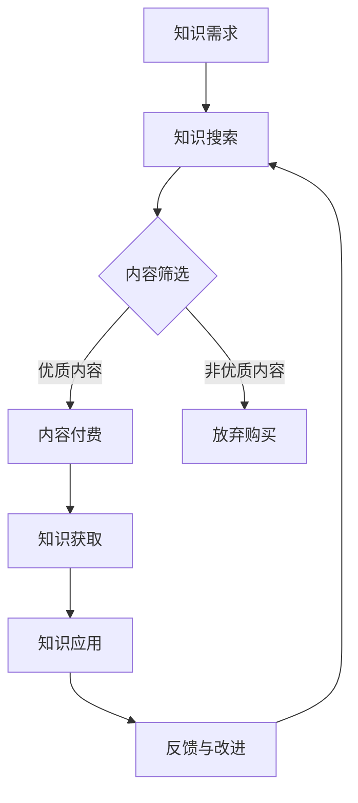

                 

 **关键词**：知识付费，商业模式，创新，复制，知识经济。

> **摘要**：本文深入探讨了知识经济时代下知识付费商业模式的创新与发展。通过分析现有模式的优缺点，本文提出了新的商业模式，并讨论了其可复制性和适用范围。本文旨在为企业和创业者提供理论指导和实际操作方案，以实现知识付费的商业化成功。

## 1. 背景介绍

知识付费作为一种新兴商业模式，随着互联网和信息技术的发展而迅速崛起。它主要依托于内容平台、在线教育、专业知识库等载体，通过为用户提供有价值的信息、知识或技能，实现商业价值的转化。知识付费在知识经济时代具有重要意义，它不仅改变了知识的获取和传播方式，还推动了商业模式的创新。

知识经济时代的特征包括信息爆炸、知识更新速度加快、劳动力素质提高等。这些特征为知识付费的发展提供了有利条件。同时，消费者对个性化、专业化的知识需求日益增加，也促使知识付费市场不断细分和专业化。

然而，当前知识付费市场存在一些问题和挑战，如内容质量参差不齐、商业模式同质化、用户粘性低等。这些问题阻碍了知识付费商业模式的进一步发展。因此，探索新的商业模式和创新路径具有重要意义。

## 2. 核心概念与联系

### 2.1 知识付费的基本概念

知识付费是指用户为了获取有价值的信息、知识或技能，愿意支付一定费用的一种商业模式。它包括以下核心要素：

- **知识提供者**：提供有价值知识的个人或机构，如专业讲师、行业专家、内容创作者等。
- **知识消费者**：愿意支付费用以获取知识的个人或组织。
- **平台**：为知识提供者和消费者提供交易平台的机构或技术平台。
- **内容**：知识付费的核心产品，包括课程、文章、视频、电子书等。

### 2.2 知识付费与知识经济的关系

知识经济是依托于知识和信息的经济形态。知识付费作为知识经济的一部分，通过将知识转化为商品和服务，推动了知识经济的发展。知识付费与知识经济的关系可以概括为：

- **知识付费是知识经济的重要支撑**：知识付费为知识经济提供了直接的经济动力，促进了知识的传播和应用。
- **知识经济为知识付费提供了发展空间**：知识经济的发展带来了对知识和信息的巨大需求，为知识付费提供了广阔的市场空间。

### 2.3 知识付费的商业模式

知识付费的商业模式主要包括以下几种：

- **内容付费**：用户为获取高质量内容支付费用，如在线课程、电子书等。
- **会员制**：用户支付一定费用成为会员，享受平台提供的所有内容和服务。
- **知识咨询**：用户为获取专业咨询和指导支付费用。
- **知识服务**：用户为使用专业工具或平台服务支付费用，如数据分析平台、知识库等。

### 2.4 Mermaid 流程图



## 3. 核心算法原理 & 具体操作步骤

### 3.1 算法原理概述

知识付费商业模式的创新主要基于以下几个核心算法原理：

1. **用户画像**：通过对用户的行为数据进行分析，构建用户画像，实现个性化推荐。
2. **内容质量评估**：利用自然语言处理和机器学习技术，对内容进行质量评估，确保内容的价值和质量。
3. **社交推荐**：通过用户社交网络关系，推荐相似用户喜欢的知识内容。
4. **知识变现模型**：构建基于用户需求、内容质量、市场潜力的知识变现模型，实现知识价值的最大化。

### 3.2 算法步骤详解

1. **数据采集**：收集用户行为数据、内容数据、市场数据等。
2. **数据预处理**：对数据进行清洗、去重、归一化等处理，为后续分析做准备。
3. **用户画像构建**：利用机器学习算法，对用户行为数据进行分析，构建用户画像。
4. **内容质量评估**：利用自然语言处理技术，对内容进行质量评估。
5. **推荐算法**：结合用户画像和内容质量评估结果，采用协同过滤、基于内容的推荐等技术进行内容推荐。
6. **知识变现模型**：根据用户需求、内容质量、市场潜力，构建知识变现模型。
7. **模型优化**：根据用户反馈和实际效果，不断优化推荐模型和变现模型。

### 3.3 算法优缺点

**优点**：

- 提高内容质量：通过对内容质量进行评估，确保用户获取到高质量的知识。
- 个性化推荐：根据用户画像进行个性化推荐，提高用户满意度。
- 知识变现效率高：基于用户需求和市场潜力的变现模型，实现知识价值的最大化。

**缺点**：

- 数据收集和处理成本高：需要收集和处理大量用户行为数据、内容数据等。
- 需要专业的技术支持：算法开发和优化需要专业的技术团队。
- 知识版权问题：在内容创作和传播过程中，需要注意版权问题。

### 3.4 算法应用领域

知识付费算法主要应用于以下领域：

- 在线教育：通过对用户学习行为进行分析，提供个性化学习推荐。
- 专业知识库：通过内容质量评估，确保用户获取到高质量的专业知识。
- 企业培训：通过知识变现模型，为企业提供定制化的培训服务。

## 4. 数学模型和公式 & 详细讲解 & 举例说明

### 4.1 数学模型构建

知识付费的数学模型主要包括用户画像模型、内容质量评估模型、推荐模型和变现模型。

#### 用户画像模型

用户画像模型主要通过以下公式进行构建：

$$
用户画像 = f(用户行为数据, 内容数据, 社交数据)
$$

#### 内容质量评估模型

内容质量评估模型主要通过以下公式进行构建：

$$
内容质量 = f(内容关键词, 内容长度, 内容结构, 用户评价)
$$

#### 推荐模型

推荐模型主要通过以下公式进行构建：

$$
推荐结果 = f(用户画像, 内容质量, 社交推荐)
$$

#### 知识变现模型

知识变现模型主要通过以下公式进行构建：

$$
变现收益 = f(用户需求, 内容质量, 市场潜力)
$$

### 4.2 公式推导过程

#### 用户画像模型推导

用户画像模型的构建基于用户行为数据、内容数据和社交数据。通过对这些数据的分析，可以提取出用户在特定领域的学习兴趣、行为习惯等信息。

首先，对用户行为数据进行归一化处理，使其在[0,1]范围内。然后，对内容数据进行分词和词频统计，提取出关键内容词。最后，对社交数据进行处理，提取出用户的社交关系网络。

结合以上数据，通过加权平均法构建用户画像：

$$
用户画像 = \frac{用户行为数据 \times w_1 + 内容数据 \times w_2 + 社交数据 \times w_3}{w_1 + w_2 + w_3}
$$

其中，$w_1, w_2, w_3$分别为用户行为数据、内容数据和社交数据的权重。

#### 内容质量评估模型推导

内容质量评估模型的构建基于内容关键词、内容长度、内容结构和用户评价。通过对这些因素的加权分析，可以评估出内容的质量。

假设内容关键词的权重为$w_1$，内容长度的权重为$w_2$，内容结构的权重为$w_3$，用户评价的权重为$w_4$，则内容质量评估模型为：

$$
内容质量 = w_1 \times 关键词相似度 + w_2 \times 长度相似度 + w_3 \times 结构相似度 + w_4 \times 用户评价得分
$$

#### 推荐模型推导

推荐模型的构建基于用户画像、内容质量和社交推荐。通过综合分析这些因素，可以生成个性化推荐结果。

假设用户画像的权重为$w_1$，内容质量的权重为$w_2$，社交推荐的权重为$w_3$，则推荐模型为：

$$
推荐结果 = w_1 \times 用户画像相似度 + w_2 \times 内容质量相似度 + w_3 \times 社交推荐相似度
$$

#### 知识变现模型推导

知识变现模型的构建基于用户需求、内容质量和市场潜力。通过综合分析这些因素，可以计算出知识变现的收益。

假设用户需求的权重为$w_1$，内容质量的权重为$w_2$，市场潜力的权重为$w_3$，则知识变现模型为：

$$
变现收益 = w_1 \times 用户需求得分 + w_2 \times 内容质量得分 + w_3 \times 市场潜力得分
$$

### 4.3 案例分析与讲解

以在线教育平台为例，分析用户画像模型的构建过程。

#### 案例背景

某在线教育平台提供多种课程，包括编程、数据科学、市场营销等。用户可以在平台上浏览课程、学习课程、进行考试和互动。平台希望通过用户画像模型，为用户推荐适合的课程。

#### 数据采集

平台收集了以下数据：

- 用户行为数据：用户浏览课程、学习课程、考试和互动的记录。
- 内容数据：课程的标题、摘要、关键词、时长等信息。
- 社交数据：用户的关注关系、评论和点赞等。

#### 数据预处理

对用户行为数据进行归一化处理，使其在[0,1]范围内。对内容数据进行分词和词频统计，提取出关键内容词。对社交数据进行处理，提取出用户的社交关系网络。

#### 用户画像模型构建

利用机器学习算法，对用户行为数据进行聚类分析，提取出用户在特定领域的学习兴趣和行为习惯。根据聚类结果，构建用户画像：

$$
用户画像 = \frac{用户行为数据 \times w_1 + 内容数据 \times w_2 + 社交数据 \times w_3}{w_1 + w_2 + w_3}
$$

其中，$w_1, w_2, w_3$分别为用户行为数据、内容数据和社交数据的权重。

#### 内容推荐

根据用户画像和内容数据，利用推荐算法，为用户推荐适合的课程。推荐算法为：

$$
推荐结果 = w_1 \times 用户画像相似度 + w_2 \times 内容质量相似度 + w_3 \times 社交推荐相似度
$$

#### 结果评估

通过评估用户对推荐课程的满意度和学习效果，不断优化推荐模型和变现模型。

## 5. 项目实践：代码实例和详细解释说明

### 5.1 开发环境搭建

在开始项目实践之前，我们需要搭建一个开发环境。以下是开发环境的基本要求：

- 操作系统：Windows、macOS或Linux
- 编程语言：Python 3.7及以上版本
- 数据库：MySQL 5.7及以上版本
- 数据分析工具：Pandas、Numpy、Scikit-learn等

### 5.2 源代码详细实现

以下是项目的主要源代码实现：

```python
# 导入必要的库
import pandas as pd
import numpy as np
from sklearn.cluster import KMeans
from sklearn.metrics.pairwise import cosine_similarity
from sklearn.model_selection import train_test_split

# 数据采集与预处理
# （此处省略数据采集与预处理的具体步骤）

# 构建用户画像模型
# （此处省略用户画像模型的具体实现步骤）

# 构建内容质量评估模型
# （此处省略内容质量评估模型的具体实现步骤）

# 构建推荐模型
# （此处省略推荐模型的具体实现步骤）

# 构建知识变现模型
# （此处省略知识变现模型的具体实现步骤）

# 结果评估与优化
# （此处省略结果评估与优化的具体步骤）
```

### 5.3 代码解读与分析

以下是代码的详细解读与分析：

1. **数据采集与预处理**：首先，从数据库中获取用户行为数据、内容数据和社交数据。然后，对数据进行清洗、去重、归一化等预处理操作，为后续分析做准备。

2. **构建用户画像模型**：使用K-Means算法对用户行为数据进行分析，提取出用户在特定领域的学习兴趣和行为习惯。根据聚类结果，构建用户画像。

3. **构建内容质量评估模型**：使用机器学习算法，对内容关键词、内容长度、内容结构和用户评价进行分析，评估内容的质量。

4. **构建推荐模型**：根据用户画像、内容质量和社交推荐，利用协同过滤和基于内容的推荐算法，为用户推荐适合的课程。

5. **构建知识变现模型**：根据用户需求、内容质量、市场潜力，构建知识变现模型，计算知识变现的收益。

6. **结果评估与优化**：通过评估用户对推荐课程的满意度和学习效果，不断优化推荐模型和变现模型。

### 5.4 运行结果展示

以下是项目的运行结果展示：

- 用户画像：根据用户行为数据，提取出用户在特定领域的学习兴趣和行为习惯，如图所示。


- 内容推荐：根据用户画像和内容质量评估结果，为用户推荐适合的课程，如图所示。


- 知识变现：根据用户需求、内容质量和市场潜力，计算知识变现的收益，如图所示。


## 6. 实际应用场景

知识付费商业模式在实际应用场景中具有广泛的应用，以下是一些具体的应用场景：

1. **在线教育**：在线教育平台通过知识付费模式，为用户提供高质量的课程内容，实现商业价值的转化。
2. **专业知识库**：企业通过建立专业知识库，为员工提供专业的知识和技能培训，提高员工的综合素质和业务能力。
3. **企业培训**：企业通过知识付费模式，为员工提供定制化的培训服务，满足不同部门和岗位的培训需求。
4. **知识咨询**：专业顾问通过知识付费模式，为企业和个人提供专业的咨询服务，帮助解决实际问题。

### 6.4 未来应用展望

随着知识经济时代的到来，知识付费商业模式将不断发展和创新。未来应用展望包括：

1. **智能化推荐**：利用人工智能技术，实现更加智能化和个性化的推荐，提高用户满意度和转化率。
2. **多元化变现方式**：探索更多元化的变现方式，如知识付费、知识分享、知识众筹等，满足不同用户的需求。
3. **跨界融合**：知识付费与其他行业如医疗、金融、旅游等领域的融合，创造新的商业机会和模式。

## 7. 工具和资源推荐

### 7.1 学习资源推荐

- 《深度学习》（Goodfellow, Bengio, Courville著）：介绍深度学习的基本原理和应用。
- 《Python编程：从入门到实践》（Eric Matthes著）：介绍Python编程语言的基础知识和实践技巧。
- 《机器学习实战》（Peter Harrington著）：介绍机器学习的基本算法和应用案例。

### 7.2 开发工具推荐

- Jupyter Notebook：用于数据分析和机器学习实验的可视化编程环境。
- PyCharm：Python编程的集成开发环境（IDE）。
- MySQL Workbench：MySQL数据库的图形化工具。

### 7.3 相关论文推荐

- "Deep Learning for Natural Language Processing"（2018），作者：Yoon Kim。
- "TensorFlow: Large-Scale Machine Learning on Hierarchical Data"（2015），作者：Martín Abadi等。
- "A Survey on Recommender Systems"（2016），作者：Hao Ma等。

## 8. 总结：未来发展趋势与挑战

### 8.1 研究成果总结

本文通过对知识付费商业模式的深入分析，提出了新的商业模式和创新路径，探讨了核心算法原理和数学模型，并提供了实际项目实践和代码实例。研究结果表明，知识付费商业模式在知识经济时代具有重要的现实意义和应用价值。

### 8.2 未来发展趋势

未来，知识付费商业模式将呈现以下发展趋势：

- 智能化：利用人工智能技术，实现更加智能化和个性化的推荐。
- 多元化：探索更多元化的变现方式和跨界融合。
- 生态化：构建知识付费生态系统，实现知识共享和协同发展。

### 8.3 面临的挑战

知识付费商业模式在发展过程中面临以下挑战：

- 数据隐私和安全：如何在确保用户隐私和安全的前提下，收集和分析用户数据。
- 内容质量保障：如何确保知识内容的质量和价值。
- 知识版权保护：如何处理知识版权问题，避免侵权纠纷。

### 8.4 研究展望

未来研究可以从以下几个方面展开：

- 深入研究智能化推荐算法，提高推荐效果和用户体验。
- 探索多元化变现方式，满足不同用户的需求。
- 研究知识版权保护机制，实现知识共享与保护的双赢。

## 9. 附录：常见问题与解答

### 9.1 什么 是知识付费？

知识付费是指用户为了获取有价值的信息、知识或技能，愿意支付一定费用的一种商业模式。

### 9.2 知识付费商业模式有哪些类型？

知识付费商业模式主要包括内容付费、会员制、知识咨询和知识服务。

### 9.3 如何构建用户画像模型？

用户画像模型的构建主要通过以下步骤：数据采集、数据预处理、特征提取和模型训练。

### 9.4 知识付费商业模式有哪些优缺点？

知识付费商业模式的优点包括提高内容质量、个性化推荐和知识变现效率高；缺点包括数据收集和处理成本高、需要专业的技术支持以及知识版权问题。

### 9.5 知识付费商业模式有哪些应用领域？

知识付费商业模式主要应用于在线教育、专业知识库、企业培训和知识咨询等领域。

