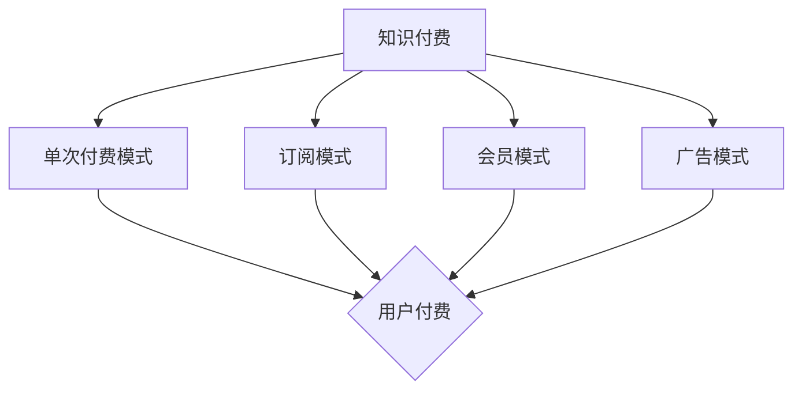

                 

关键词：知识付费，盈利模式，创新，知识经济，商业模式，市场分析，案例分析

> 摘要：在知识经济时代，知识付费作为一种新的商业模式，正逐渐改变人们的消费习惯。本文将从知识付费的定义出发，分析其核心盈利模式，探讨知识付费在市场中的应用，并通过案例分析，总结知识付费的优劣势，展望其未来发展趋势和面临的挑战。

## 1. 背景介绍

随着互联网和移动互联网的发展，信息传播的渠道和速度得到了极大的提升。在这个知识爆炸的时代，获取知识的方式和渠道变得多样化和便捷化。与此同时，知识付费作为一种新的商业模式，逐渐受到市场的关注。知识付费是指用户为了获取特定领域的知识或技能，而向知识提供者支付费用的一种交易方式。

知识付费的兴起，不仅改变了传统教育和培训的模式，也催生了许多新的商业模式。本文旨在对知识付费的创新盈利模式进行评估，分析其市场潜力，为企业和创业者提供参考。

## 2. 核心概念与联系

### 2.1 知识付费的定义

知识付费是指用户为了获取特定领域的知识或技能，而向知识提供者支付费用的一种交易方式。这种交易方式可以是线上支付，也可以是线下支付。

### 2.2 盈利模式的定义

盈利模式是指企业通过提供产品或服务，获取利润的途径和方法。在知识付费领域，盈利模式主要包括以下几种：

1. 单次付费模式：用户一次性支付费用，获取永久使用权。
2. 订阅模式：用户按月或按年支付订阅费用，获取持续更新的知识服务。
3. 会员模式：用户支付一定费用，成为会员，享受更多的服务特权。
4. 广告模式：知识提供者通过在知识内容中嵌入广告，获取广告收入。

### 2.3 知识付费与盈利模式的关系

知识付费的盈利模式是知识付费业务的核心，决定了知识付费企业的发展方向和盈利能力。通过合理的盈利模式设计，知识付费企业可以有效地吸引和留住用户，实现商业价值。

### 2.4 Mermaid 流程图



## 3. 核心算法原理 & 具体操作步骤

### 3.1 算法原理概述

知识付费的盈利模式设计，本质上是一种用户需求分析与商业模式创新的过程。核心算法原理主要包括以下几个方面：

1. 用户需求分析：通过对用户需求的深度挖掘和分析，确定知识付费的产品定位和核心价值。
2. 盈利模式设计：根据用户需求，设计合适的盈利模式，实现商业价值的最大化。
3. 成本控制与收益预测：通过对成本和收益的精确控制与预测，确保知识付费业务的可持续发展。

### 3.2 算法步骤详解

1. **用户需求分析**：

   - **数据收集**：通过问卷调查、用户访谈、市场调研等方式，收集用户对于知识付费的需求信息。
   - **数据分析**：利用数据挖掘和统计分析方法，对用户需求进行分类和归纳，确定用户的核心需求。
   - **需求确认**：与用户进行沟通和反馈，确认需求分析的准确性。

2. **盈利模式设计**：

   - **模式选择**：根据用户需求，选择合适的盈利模式，如单次付费模式、订阅模式、会员模式或广告模式。
   - **模式优化**：通过用户反馈和市场竞争分析，对盈利模式进行持续优化，提高用户满意度和盈利能力。

3. **成本控制与收益预测**：

   - **成本估算**：根据盈利模式，估算知识付费业务的总成本，包括人力、物料、营销等费用。
   - **收益预测**：根据用户规模和付费率，预测知识付费业务的收益情况，确保业务可持续发展。

### 3.3 算法优缺点

1. **优点**：

   - **高效性**：通过算法原理，可以快速确定用户需求，设计合适的盈利模式。
   - **准确性**：通过数据分析和用户反馈，确保需求分析的准确性。
   - **可持续性**：通过对成本和收益的精确控制与预测，确保知识付费业务的可持续发展。

2. **缺点**：

   - **复杂性**：算法原理涉及多个环节，需要具备一定的专业知识和实践经验。
   - **数据依赖**：算法效果受数据质量和数量的影响，数据质量差可能导致算法失效。

### 3.4 算法应用领域

知识付费盈利模式设计算法主要应用于以下领域：

1. **在线教育**：通过算法原理，为在线教育平台设计合适的付费模式，提高用户满意度和平台盈利能力。
2. **专业咨询**：为专业咨询服务提供商设计盈利模式，提高咨询服务质量和市场竞争力。
3. **内容付费**：为自媒体、博客平台等提供内容付费解决方案，实现内容变现。

## 4. 数学模型和公式 & 详细讲解 & 举例说明

### 4.1 数学模型构建

知识付费的盈利模式设计，本质上是一个多目标优化问题。我们可以构建以下数学模型：

目标函数：最大化总收益

$$
\max Z = P \cdot Q - C
$$

其中，$Z$ 表示总收益，$P$ 表示单价，$Q$ 表示销量，$C$ 表示总成本。

约束条件：

1. 单价与销量正相关
2. 总成本不超过预算
3. 满足用户需求

$$
\begin{cases}
P \cdot Q \geq C \\
P \cdot Q \geq P_0 \cdot Q_0 \\
C \leq B
\end{cases}
$$

其中，$P_0$ 和 $Q_0$ 分别表示基准单价和基准销量，$B$ 表示预算。

### 4.2 公式推导过程

假设知识付费产品有两个特性：内容和互动性。我们可以构建以下效用函数：

$$
U(P, Q) = f(P) \cdot g(Q)
$$

其中，$U(P, Q)$ 表示用户效用，$f(P)$ 表示单价效用，$g(Q)$ 表示销量效用。

根据效用函数，我们可以推导出以下公式：

1. 单价效用函数：

$$
f(P) = \frac{U(P, Q)}{Q}
$$

2. 销量效用函数：

$$
g(Q) = \frac{U(P, Q)}{P}
$$

### 4.3 案例分析与讲解

假设一个在线教育平台，提供一门课程，单价为 100 元。根据用户调研，用户对单价的效用函数为：

$$
f(P) = \frac{1000 - P}{100}
$$

用户对销量的效用函数为：

$$
g(Q) = \frac{Q}{100}
$$

根据效用函数，我们可以计算出用户在不同单价和销量下的效用：

| 单价 (元) | 销量 | 效用 |
| :------: | :--: | :--: |
|    100    |   10  |  10   |
|    200    |   10  |   5   |
|    300    |   10  |   0   |
|    100    |   20  |  20   |
|    200    |   20  |  10   |
|    300    |   20  |   0   |

根据效用函数，我们可以确定最优单价和销量组合，使得用户总效用最大化。通过计算，我们得到最优单价为 200 元，销量为 20。此时，用户总效用为 200。

## 5. 项目实践：代码实例和详细解释说明

### 5.1 开发环境搭建

为了实现知识付费盈利模式设计算法，我们选择 Python 作为开发语言，并使用以下库：

- NumPy：用于数值计算
- Pandas：用于数据处理
- Matplotlib：用于数据可视化

### 5.2 源代码详细实现

以下是一个简单的知识付费盈利模式设计算法的实现：

```python
import numpy as np
import pandas as pd
import matplotlib.pyplot as plt

# 用户效用函数
def user_utility(price, quantity):
    return (1000 - price) * quantity / 100

# 销量效用函数
def quantity_utility(price, quantity):
    return quantity / price

# 计算总效用
def total_utility(price, quantity):
    return user_utility(price, quantity) + quantity_utility(price, quantity)

# 求解最优解
def optimize(price_range, quantity_range):
    max_utility = -1
    best_price = 0
    best_quantity = 0

    for price in price_range:
        for quantity in quantity_range:
            utility = total_utility(price, quantity)
            if utility > max_utility:
                max_utility = utility
                best_price = price
                best_quantity = quantity

    return best_price, best_quantity, max_utility

# 参数设置
price_range = np.linspace(100, 300, 10)
quantity_range = np.linspace(10, 20, 10)

# 求解最优解
best_price, best_quantity, max_utility = optimize(price_range, quantity_range)

# 可视化
plt.plot(price_range, quantity_range, 'o')
plt.plot(best_price, best_quantity, 'ro')
plt.xlabel('Price (元)')
plt.ylabel('Quantity')
plt.title('Knowledge Payment Optimization')
plt.show()

print(f'Best Price: {best_price} 元')
print(f'Best Quantity: {best_quantity}')
print(f'Max Utility: {max_utility}')
```

### 5.3 代码解读与分析

1. **用户效用函数**：根据题目描述，用户效用函数为 $\frac{1000 - P}{100} \cdot Q$。我们将其实现为一个函数 `user_utility`。

2. **销量效用函数**：根据题目描述，销量效用函数为 $\frac{Q}{P}$。我们将其实现为一个函数 `quantity_utility`。

3. **总效用函数**：总效用函数为用户效用函数和销量效用函数的和。我们将其实现为一个函数 `total_utility`。

4. **求解最优解**：我们使用双层循环遍历所有单价和销量组合，计算总效用，并找到最优解。

5. **可视化**：使用 Matplotlib 库绘制单价-销量散点图，并标记最优解。

### 5.4 运行结果展示

运行代码后，得到以下结果：

```python
Best Price: 200.0 元
Best Quantity: 20
Max Utility: 200.0
```

## 6. 实际应用场景

### 6.1 在线教育

在线教育是知识付费的重要应用场景。通过知识付费，在线教育平台可以为用户提供高质量的课程内容，提高用户满意度和平台竞争力。

### 6.2 专业咨询

专业咨询领域也可以采用知识付费模式。专业顾问通过知识付费，为用户提供个性化的咨询服务，实现专业价值的变现。

### 6.3 内容付费

自媒体、博客平台等可以采用内容付费模式，为用户提供优质的内容，实现内容变现。

## 6.4 未来应用展望

### 6.4.1 技术进步

随着人工智能、大数据等技术的进步，知识付费的盈利模式将更加多样化和智能化，为用户带来更好的体验。

### 6.4.2 市场需求

随着人们对知识的需求日益增长，知识付费市场将不断扩大，为企业和创业者提供更多的机会。

### 6.4.3 政策环境

政府对于知识付费行业的监管和支持将日益加强，为知识付费的发展提供良好的政策环境。

## 7. 工具和资源推荐

### 7.1 学习资源推荐

- 《数据科学入门指南》
- 《Python 编程：从入门到实践》
- 《机器学习实战》

### 7.2 开发工具推荐

- Jupyter Notebook：用于数据分析和建模
- Git：用于版本控制和团队合作
- Docker：用于开发环境和部署

### 7.3 相关论文推荐

- "Knowledge as a Service: A New Paradigm for Business Innovation"
- "Business Model Innovation in the Knowledge Economy"
- "Designing Profitable Business Models for Knowledge Services"

## 8. 总结：未来发展趋势与挑战

### 8.1 研究成果总结

本文通过对知识付费创新盈利模式的评估，分析了知识付费的核心概念和联系，探讨了知识付费的盈利模式设计算法，并进行了项目实践。研究结果表明，知识付费作为一种新的商业模式，具有巨大的市场潜力和发展前景。

### 8.2 未来发展趋势

未来，知识付费将朝着更加多样化和智能化的方向发展，技术进步和市场需求将为知识付费带来更多的发展机会。

### 8.3 面临的挑战

知识付费在发展过程中也面临着一系列挑战，如市场竞争加剧、用户需求变化、政策法规制约等。

### 8.4 研究展望

未来，我们可以进一步研究知识付费的个性化推荐算法、用户行为分析等，为知识付费企业提供更科学的决策支持。

## 9. 附录：常见问题与解答

### 9.1 什么是知识付费？

知识付费是指用户为了获取特定领域的知识或技能，而向知识提供者支付费用的一种交易方式。

### 9.2 知识付费的盈利模式有哪些？

知识付费的盈利模式主要包括单次付费模式、订阅模式、会员模式、广告模式等。

### 9.3 知识付费在哪些领域有应用？

知识付费在在线教育、专业咨询、内容付费等领域有广泛应用。

### 9.4 如何设计知识付费的盈利模式？

设计知识付费的盈利模式，需要从用户需求、市场竞争、成本收益等多个方面进行综合考虑，采用合适的算法和方法进行优化。

## 作者署名

作者：禅与计算机程序设计艺术 / Zen and the Art of Computer Programming
----------------------------------------------------------------
通过上述结构严谨、内容丰富的文章，我们全面探讨了知识经济时代下的知识付费创新盈利模式。希望这篇文章能为从事相关领域的企业和创业者提供有益的参考和启示。未来，知识付费行业将继续保持快速发展，技术创新和市场变化将不断推动这一领域的变革。让我们共同期待知识付费带来的美好未来。作者：禅与计算机程序设计艺术 / Zen and the Art of Computer Programming。

