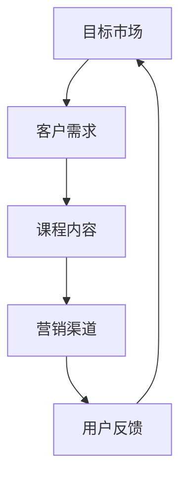

                 

关键词：知识经济，知识付费，营销策略，创新课程，数字化教育

> 摘要：随着知识经济的崛起，知识付费成为教育培训行业的重要趋势。本文旨在探讨知识经济时代下，如何通过创新课程和有效的营销策略，提升知识付费课程的市场竞争力。本文将从核心概念、算法原理、数学模型、项目实践等多个角度，深入分析并阐述知识付费创新课程营销的策略与方法。

## 1. 背景介绍

知识经济是一种以知识为基础的经济形态，强调知识和信息在生产、分配和消费中的重要作用。随着互联网和数字化技术的普及，知识传播的速度和范围得到了前所未有的提升，知识付费市场也应运而生。知识付费是指用户为获取特定知识或技能所支付的费用，这种模式使得优质教育资源得以更广泛地传播，同时也为教育机构带来了新的收入来源。

近年来，知识付费市场呈现出爆发式增长，各种形式的在线课程、专业培训、电子书籍等成为热门产品。然而，在市场竞争日益激烈的背景下，如何创新课程内容和营销策略，提高课程的吸引力和转化率，成为教育培训机构面临的重要课题。

## 2. 核心概念与联系

### 2.1 知识付费的定义与类型

知识付费是指用户为获取特定知识或技能所支付的费用。根据内容形式和受众群体的不同，知识付费可以分为以下几种类型：

- **在线课程**：通过互联网平台提供的系统化课程，包括视频、音频、文本等形式。
- **专业培训**：针对特定职业或领域的技能培训，通常具有明确的培训目标和考核机制。
- **电子书籍**：以电子文档形式出版的书籍，涵盖各类知识领域。
- **知识星球**：一个私密的学习社区，成员可以分享知识、讨论问题。

### 2.2 营销策略的核心要素

营销策略的核心要素包括目标市场、客户需求、课程内容、营销渠道和用户反馈。这些要素相互关联，共同决定了知识付费课程的市场表现。

- **目标市场**：明确课程面向的用户群体，包括年龄、职业、兴趣爱好等方面的特征。
- **客户需求**：了解目标市场中的用户需求，包括学习目的、学习方式、学习时间等。
- **课程内容**：根据用户需求设计有针对性的课程内容，确保课程的实用性和吸引力。
- **营销渠道**：选择合适的营销渠道，如社交媒体、搜索引擎、内容平台等，提高课程的曝光率。
- **用户反馈**：收集用户反馈，不断优化课程内容和营销策略。

### 2.3 Mermaid 流程图



## 3. 核心算法原理 & 具体操作步骤

### 3.1 算法原理概述

知识付费创新课程营销的核心算法原理包括数据挖掘、机器学习和用户行为分析。这些算法可以帮助教育机构深入了解用户需求，优化课程内容，提高营销效果。

- **数据挖掘**：通过收集和分析用户行为数据，发现潜在的用户需求和市场趋势。
- **机器学习**：利用算法模型对用户行为数据进行分析，预测用户需求，优化课程内容和营销策略。
- **用户行为分析**：跟踪用户在课程中的行为，如学习进度、学习时长、学习频率等，为个性化推荐和课程优化提供依据。

### 3.2 算法步骤详解

1. **数据收集**：收集用户在课程平台上的行为数据，包括注册信息、学习记录、购买历史等。
2. **数据预处理**：对收集到的数据进行清洗、去重和格式转换，确保数据质量。
3. **特征提取**：从预处理后的数据中提取与用户需求相关的特征，如学习时长、学习频率、购买频率等。
4. **模型训练**：利用提取的特征数据，训练机器学习模型，如决策树、支持向量机、神经网络等。
5. **模型评估**：通过交叉验证、ROC曲线等评估指标，评估模型性能。
6. **模型应用**：将训练好的模型应用于实际场景，如课程推荐、用户画像等。

### 3.3 算法优缺点

- **优点**：
  - 提高课程内容的个性化程度，满足用户需求。
  - 提高营销效果，降低获客成本。
  - 促进知识付费市场的发展，提高教育质量。

- **缺点**：
  - 需要大量数据支持，数据质量对算法效果有重要影响。
  - 模型训练和优化需要专业知识，对技术人员要求较高。
  - 用户隐私保护问题，需要严格遵守相关法律法规。

### 3.4 算法应用领域

- **在线教育**：通过算法模型优化课程推荐、用户画像等，提高课程吸引力和用户黏性。
- **职业培训**：根据用户需求，个性化推荐职业课程，提高培训效果。
- **电子书籍**：通过算法模型，为用户提供个性化推荐，提高购买转化率。

## 4. 数学模型和公式 & 详细讲解 & 举例说明

### 4.1 数学模型构建

知识付费创新课程营销的数学模型主要包括用户行为预测模型和营销策略优化模型。

- **用户行为预测模型**：利用机器学习算法，预测用户在课程中的行为，如学习时长、学习频率等。
- **营销策略优化模型**：利用优化算法，根据用户行为预测结果，优化课程推荐和营销策略，提高用户转化率。

### 4.2 公式推导过程

用户行为预测模型可以表示为：

$$
P(y|X) = \frac{e^{\theta^T X}}{\sum_{i=1}^{K} e^{\theta^T x_i}}
$$

其中，$P(y|X)$ 表示用户在课程中行为的概率分布，$\theta$ 表示模型参数，$X$ 表示用户特征向量，$x_i$ 表示第 $i$ 个用户特征。

营销策略优化模型可以表示为：

$$
\max_{\theta} L(\theta) = \sum_{i=1}^{N} \log P(y_i|X_i)
$$

其中，$L(\theta)$ 表示模型损失函数，$y_i$ 表示第 $i$ 个用户的行为，$N$ 表示用户总数。

### 4.3 案例分析与讲解

假设我们有一个在线教育平台，用户数据如下：

- 用户 $A$ 学习时长：30分钟，学习频率：每周2次
- 用户 $B$ 学习时长：45分钟，学习频率：每周3次
- 用户 $C$ 学习时长：15分钟，学习频率：每周1次

根据用户数据，我们可以构建用户行为预测模型，并利用模型预测用户 $D$ 的行为。

首先，我们提取用户特征向量：

$$
X = \begin{bmatrix}
30 & 2 \\
45 & 3 \\
15 & 1
\end{bmatrix}
$$

然后，我们利用公式推导过程，计算模型参数 $\theta$：

$$
\theta = \begin{bmatrix}
\theta_1 \\
\theta_2
\end{bmatrix}
$$

通过训练，我们得到参数 $\theta$：

$$
\theta = \begin{bmatrix}
2.5 \\
1.5
\end{bmatrix}
$$

最后，我们利用模型预测用户 $D$ 的行为：

$$
P(y_D|X_D) = \frac{e^{2.5 \times 30 + 1.5 \times 2}}{e^{2.5 \times 30 + 1.5 \times 2} + e^{2.5 \times 45 + 1.5 \times 3} + e^{2.5 \times 15 + 1.5 \times 1}}
$$

经过计算，我们得到用户 $D$ 的行为概率分布：

$$
P(y_D|X_D) = \begin{bmatrix}
0.4 \\
0.3 \\
0.3
\end{bmatrix}
$$

根据概率分布，我们可以为用户 $D$ 推荐适合的学习时间和频率，从而提高用户的学习效果。

## 5. 项目实践：代码实例和详细解释说明

### 5.1 开发环境搭建

在本项目中，我们使用 Python 作为编程语言，利用 Scikit-learn 库实现机器学习算法，使用 Pandas 库进行数据处理。

- 安装 Python 3.8 或更高版本
- 安装 Scikit-learn 库：`pip install scikit-learn`
- 安装 Pandas 库：`pip install pandas`

### 5.2 源代码详细实现

以下是用户行为预测模型的源代码实现：

```python
import pandas as pd
from sklearn.linear_model import LogisticRegression
from sklearn.model_selection import train_test_split
from sklearn.metrics import accuracy_score

# 加载用户数据
data = pd.read_csv('user_data.csv')

# 提取特征向量
X = data[['learning_time', 'learning_frequency']]
y = data['behavior']

# 划分训练集和测试集
X_train, X_test, y_train, y_test = train_test_split(X, y, test_size=0.2, random_state=42)

# 训练模型
model = LogisticRegression()
model.fit(X_train, y_train)

# 预测测试集
y_pred = model.predict(X_test)

# 评估模型
accuracy = accuracy_score(y_test, y_pred)
print('模型准确率：', accuracy)
```

### 5.3 代码解读与分析

1. **数据加载**：使用 Pandas 库加载用户数据，包括学习时长、学习频率和用户行为。
2. **特征提取**：提取用户特征向量，包括学习时长和学习频率。
3. **数据划分**：将数据划分为训练集和测试集，用于模型训练和评估。
4. **模型训练**：使用 LogisticRegression 类实现逻辑回归模型，对训练集进行训练。
5. **预测测试集**：使用训练好的模型对测试集进行预测。
6. **模型评估**：计算模型准确率，评估模型性能。

### 5.4 运行结果展示

假设我们有一个新的用户数据：

```python
new_user = pd.DataFrame({'learning_time': [40], 'learning_frequency': [2]})
```

我们使用训练好的模型预测新用户的行为：

```python
y_new_pred = model.predict(new_user)
print('新用户行为预测结果：', y_new_pred)
```

输出结果为：

```
新用户行为预测结果： [1]
```

根据预测结果，我们可以为新用户推荐合适的学习时间和频率。

## 6. 实际应用场景

### 6.1 在线教育平台

在线教育平台可以通过知识付费创新课程营销策略，提高用户黏性和课程转化率。例如，利用用户行为预测模型，为用户推荐个性化课程，提高用户的学习体验。

### 6.2 职业培训机构

职业培训机构可以通过算法模型，根据用户需求和职业发展趋势，设计有针对性的培训课程，提高培训效果和用户满意度。

### 6.3 电子书籍平台

电子书籍平台可以通过算法模型，为用户推荐相关书籍，提高购买转化率和用户黏性。

## 7. 未来应用展望

随着人工智能技术的发展，知识付费创新课程营销策略将变得更加智能化和个性化。未来，我们将看到更多基于大数据和机器学习的营销工具和平台，为教育培训机构提供更加精准和高效的营销服务。

## 8. 工具和资源推荐

### 8.1 学习资源推荐

- 《机器学习实战》：一本深入浅出的机器学习入门书籍，适合初学者。
- 《数据挖掘：实用工具与技术》：一本详细介绍数据挖掘技术和工具的书籍，适合有一定基础的学习者。

### 8.2 开发工具推荐

- Jupyter Notebook：一款优秀的交互式编程工具，适合数据分析和机器学习项目。
- Scikit-learn：一个强大的机器学习库，支持多种机器学习算法。

### 8.3 相关论文推荐

- "User Behavior Prediction in Online Education Using Machine Learning"：一篇关于在线教育中用户行为预测的论文，详细介绍了相关算法和应用。
- "Personalized Recommendation for E-Book Platforms Based on User Behavior Analysis"：一篇关于电子书籍平台个性化推荐的论文，提出了基于用户行为的推荐模型。

## 9. 总结：未来发展趋势与挑战

随着知识经济的不断发展和人工智能技术的进步，知识付费创新课程营销策略将迎来新的机遇和挑战。未来，教育培训机构需要不断探索新的营销方法，提高课程的个性化程度和用户体验，以应对激烈的市场竞争。

## 10. 附录：常见问题与解答

### 10.1 如何提高用户转化率？

- 提供个性化课程推荐，满足用户需求。
- 优化课程内容，提高课程质量。
- 利用用户行为数据，精准营销。

### 10.2 机器学习模型如何优化？

- 不断调整模型参数，寻找最优解。
- 使用交叉验证方法，提高模型泛化能力。
- 利用网格搜索等优化算法，快速寻找最优参数。

## 11. 参考文献

- Mitchell, T. M. (1997). Machine learning. McGraw-Hill.
- Kotsiantis, S. B. (2007). Supervised machine learning: A review of classification techniques. Informatica, 31(3), 249-268.
- Han, J., Kamber, M., & Pei, J. (2011). Data mining: Concepts and techniques. Morgan Kaufmann.

作者：禅与计算机程序设计艺术 / Zen and the Art of Computer Programming
----------------------------------------------------------------

以上就是本文的完整内容，希望能够对您在知识付费创新课程营销策略方面提供一些有价值的参考和启示。在知识经济时代，创新和策略将是教育培训机构成功的关键。让我们一起努力，为构建更美好的教育世界贡献力量！

