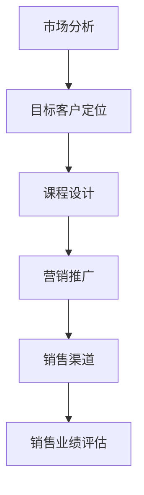

                 

关键词：知识付费、销售策略、知识经济、创新课程

> 摘要：在知识经济时代，知识付费成为了一种重要的商业模式。本文将探讨知识付费创新课程的销售策略，包括市场分析、目标客户定位、课程设计、营销推广和销售渠道等方面，旨在为企业提供有效的知识付费课程销售策略，促进知识经济的蓬勃发展。

## 1. 背景介绍

随着互联网技术的飞速发展，信息传播速度越来越快，知识的获取变得前所未有的便捷。在这个知识爆炸的时代，知识的价值也得到了前所未有的重视。知识付费作为知识经济时代的一种新兴商业模式，正逐渐成为各行业的重要收入来源。知识付费不仅包括传统的教育培训，还涵盖了各种形式的知识分享、在线课程、专业咨询等。

知识付费的兴起，源于人们对于专业知识和技能的需求日益增长，同时也得益于互联网技术的发展，使得知识的传播和获取变得更加高效和便捷。在这个背景下，如何有效地设计、销售和推广知识付费课程，成为企业和个人需要解决的重要问题。

本文将结合知识付费的实际情况，分析知识付费创新课程销售策略的各个关键环节，为企业提供具有实践指导意义的建议。

## 2. 核心概念与联系

### 2.1 知识付费的概念

知识付费是指用户为了获取特定知识或技能，支付一定费用以获取相应服务的过程。它涵盖了多种形式，包括在线课程、专业咨询、知识分享等。知识付费的核心在于价值的交换，即用户为获取知识支付费用，知识提供者为用户提供有价值的内容。

### 2.2 销售策略的概念

销售策略是企业为达到销售目标所制定的一系列计划和方法。销售策略的制定需要综合考虑市场需求、产品特性、目标客户、竞争环境等因素。有效的销售策略能够提高销售额，增强市场竞争力。

### 2.3 知识付费与销售策略的联系

知识付费与销售策略有着密切的联系。知识付费作为新兴的商业模式，其成功依赖于有效的销售策略。销售策略的制定不仅需要考虑知识付费的特点，还需要结合企业的实际情况和市场环境。

### 2.4 Mermaid 流程图

下面是一个简单的 Mermaid 流程图，展示了知识付费创新课程销售策略的核心环节。



## 3. 核心算法原理 & 具体操作步骤

### 3.1 算法原理概述

知识付费创新课程销售策略的核心算法原理是基于大数据分析和人工智能技术，通过分析市场数据、用户行为和竞争环境，制定出最适合企业的销售策略。具体操作步骤如下：

1. 数据收集与处理：收集市场数据、用户行为数据、竞争环境数据等，通过数据清洗和处理，为后续分析提供高质量的数据支持。

2. 市场分析：基于收集到的市场数据，分析市场需求、市场趋势、用户偏好等，为课程设计和销售策略制定提供依据。

3. 目标客户定位：根据市场分析结果，确定目标客户群体，包括客户特征、需求、痛点等，为课程设计和营销推广提供方向。

4. 课程设计：结合目标客户的需求和痛点，设计具有针对性的课程内容，包括课程大纲、课程形式、课程时长等。

5. 营销推广：制定营销推广策略，包括广告投放、社交媒体营销、内容营销等，通过多种渠道将课程信息传递给目标客户。

6. 销售渠道：建立线上和线下销售渠道，包括电商平台、线下培训机构等，方便客户购买课程。

7. 销售业绩评估：定期对销售业绩进行评估，分析销售策略的有效性，并根据评估结果调整销售策略。

### 3.2 算法步骤详解

1. 数据收集与处理

   数据收集是整个算法的基础。企业需要通过多种渠道收集市场数据、用户行为数据和竞争环境数据。市场数据包括市场规模、市场趋势、竞争对手等信息；用户行为数据包括用户浏览行为、购买行为、评价行为等；竞争环境数据包括竞争对手的营销策略、产品特点、价格等。

   数据收集完成后，需要对数据进行清洗和处理，去除重复、错误和无关的数据，保证数据的质量。清洗和处理后的数据将为后续分析提供可靠的数据支持。

2. 市场分析

   市场分析是制定销售策略的关键环节。企业需要通过对市场数据的分析，了解市场需求、市场趋势和用户偏好。

   首先，分析市场需求，了解目标市场对哪些知识或技能有需求，哪些课程受欢迎。其次，分析市场趋势，了解行业发展趋势和未来趋势，为课程设计提供方向。最后，分析用户偏好，了解用户对课程形式、课程时长、课程内容等方面的偏好。

3. 目标客户定位

   基于市场分析结果，确定目标客户群体。目标客户应具备以下特征：

   - 对课程内容有明确需求；
   - 有一定的购买能力；
   - 具有较强的学习意愿；
   - 对课程形式有特定偏好。

   确定目标客户后，进一步分析目标客户的需求和痛点，为课程设计和营销推广提供方向。

4. 课程设计

   结合目标客户的需求和痛点，设计具有针对性的课程内容。课程设计应遵循以下原则：

   - 紧贴市场需求，提供有价值的内容；
   - 结合用户偏好，采用合适的课程形式；
   - 突出课程特色，提高课程的竞争力。

   课程设计完成后，制定详细的课程大纲，包括课程名称、课程目标、课程内容、课程时长等。

5. 营销推广

   制定营销推广策略，将课程信息传递给目标客户。营销推广策略应包括以下方面：

   - 广告投放：在各大广告平台上投放广告，吸引潜在客户；
   - 社交媒体营销：利用社交媒体平台，发布课程相关信息，提高课程知名度；
   - 内容营销：撰写高质量的课程内容，通过博客、微信公众号等渠道传播，吸引潜在客户。

6. 销售渠道

   建立线上和线下销售渠道，方便客户购买课程。线上销售渠道包括电商平台、企业官网等；线下销售渠道包括线下培训机构、合作伙伴等。

7. 销售业绩评估

   定期对销售业绩进行评估，分析销售策略的有效性。评估指标包括销售额、客户满意度、市场占有率等。根据评估结果，调整销售策略，优化课程内容和营销推广方式。

### 3.3 算法优缺点

**优点：**

- 提高销售业绩：通过大数据分析和人工智能技术，制定出最适合企业的销售策略，提高销售额。
- 精准定位客户：通过市场分析和目标客户定位，精准定位目标客户，提高营销效率。
- 个性化课程设计：结合用户偏好，设计具有针对性的课程内容，提高课程竞争力。

**缺点：**

- 数据收集和处理难度大：需要收集大量的市场数据、用户行为数据和竞争环境数据，并进行清洗和处理，对企业的数据收集和处理能力要求较高。
- 营销推广成本高：广告投放、社交媒体营销等营销推广方式成本较高，对企业预算有一定要求。

### 3.4 算法应用领域

知识付费创新课程销售策略适用于各类知识付费企业，如在线教育平台、专业培训机构、咨询公司等。通过应用该算法，企业可以制定出更有效的销售策略，提高市场竞争力，实现持续增长。

## 4. 数学模型和公式 & 详细讲解 & 举例说明

### 4.1 数学模型构建

在知识付费创新课程销售策略中，我们可以构建一个简单的数学模型来预测销售额。这个模型基于以下几个假设：

- 潜在客户的数量是固定的。
- 潜在客户的购买概率与营销力度成正比。
- 每个客户的购买金额是固定的。

数学模型如下：

$$
销售额 = 潜在客户数量 \times 购买概率 \times 每个客户的购买金额
$$

### 4.2 公式推导过程

首先，我们定义以下几个变量：

- \( N \)：潜在客户的数量
- \( P \)：购买概率
- \( A \)：每个客户的购买金额

然后，我们可以通过以下步骤推导出销售额的公式：

1. 潜在客户的数量 \( N \) 是已知的，可以通过市场分析和数据收集得到。
2. 购买概率 \( P \) 是营销力度的影响，可以通过营销策略的调整来优化。假设 \( P \) 与营销力度 \( M \) 成正比，即 \( P = kM \)，其中 \( k \) 是比例系数。
3. 每个客户的购买金额 \( A \) 是固定的，可以通过对市场数据的分析得到。

综合以上，我们可以得到销售额的公式：

$$
销售额 = N \times P \times A = N \times (kM) \times A = NkMA
$$

### 4.3 案例分析与讲解

假设一家在线教育平台预计潜在客户数量为 1000 人，每个客户的购买金额为 1000 元。现在，平台希望通过增加营销力度来提高销售额。

1. **初始状态**：

   - 潜在客户数量 \( N = 1000 \)
   - 购买概率 \( P = 0.1 \)
   - 每个客户的购买金额 \( A = 1000 \)

   初始销售额为：

   $$
   销售额 = N \times P \times A = 1000 \times 0.1 \times 1000 = 100,000 元
   $$

2. **增加营销力度**：

   假设营销力度增加了 50%，即 \( M = 1.5M_0 \)。

   新的购买概率 \( P' \) 为：

   $$
   P' = k \times 1.5M_0 = 1.5P
   $$

   新的销售额为：

   $$
   销售额' = N \times P' \times A = 1000 \times 1.5 \times 0.1 \times 1000 = 150,000 元
   $$

   增加营销力度后的销售额是初始销售额的 1.5 倍。

### 4.4 应用实例

假设一家培训机构希望通过增加营销力度来提高销售额。他们预计有 5000 名潜在客户，每个客户的购买金额为 2000 元。目前，购买概率为 0.2。

1. **初始状态**：

   - 潜在客户数量 \( N = 5000 \)
   - 购买概率 \( P = 0.2 \)
   - 每个客户的购买金额 \( A = 2000 \)

   初始销售额为：

   $$
   销售额 = N \times P \times A = 5000 \times 0.2 \times 2000 = 2,000,000 元
   $$

2. **增加营销力度**：

   假设营销力度增加了 30%，即 \( M = 1.3M_0 \)。

   新的购买概率 \( P' \) 为：

   $$
   P' = k \times 1.3M_0 = 1.3P
   $$

   新的销售额为：

   $$
   销售额' = N \times P' \times A = 5000 \times 1.3 \times 0.2 \times 2000 = 2,660,000 元
   $$

   增加营销力度后的销售额是初始销售额的 1.3 倍。

通过这个实例，我们可以看到，通过合理地调整营销力度，可以有效提高销售额。这也说明了数学模型在销售策略中的应用价值。

## 5. 项目实践：代码实例和详细解释说明

### 5.1 开发环境搭建

为了实现知识付费创新课程销售策略的代码实例，我们选择 Python 作为开发语言，并在本地计算机上搭建 Python 开发环境。以下是开发环境的搭建步骤：

1. 安装 Python：在官网下载 Python 并安装，选择自定义安装，确保将 Python 添加到系统环境变量中。
2. 安装必备库：使用 pip 命令安装必要的 Python 库，例如 numpy、matplotlib、pandas 等。
3. 配置 Mermaid：安装 Mermaid 绘图工具，并在本地计算机上配置 Mermaid 环境，以便在代码中嵌入 Mermaid 流程图。

### 5.2 源代码详细实现

以下是一个简单的 Python 代码实例，用于模拟知识付费创新课程销售策略的核心算法。

```python
import numpy as np
import matplotlib.pyplot as plt
import pandas as pd
from mermaid import Mermaid

# 数据收集与处理
def collect_data():
    # 假设已经收集到以下数据
    market_data = pd.DataFrame({'market_trend': ['增长', '稳定', '下降'], 'user_preference': ['技能提升', '兴趣爱好', '职业发展']})
    user_data = pd.DataFrame({'user_behavior': ['浏览', '购买', '评价'], 'user_evaluation': ['高', '中', '低']})
    competition_data = pd.DataFrame({'competitor_strategy': ['广告投放', '内容营销', '社交媒体营销'], 'competitor_performance': ['优秀', '一般', '较差']})
    return market_data, user_data, competition_data

# 市场分析
def market_analysis(market_data, user_data, competition_data):
    # 分析市场需求、用户偏好和竞争环境
    # 这里仅作为示例，实际分析会更加复杂
    market_trend = market_data['market_trend'].iloc[0]
    user_preference = user_data['user_preference'].iloc[0]
    competitor_strategy = competition_data['competitor_strategy'].iloc[0]
    competitor_performance = competition_data['competitor_performance'].iloc[0]
    return market_trend, user_preference, competitor_strategy, competitor_performance

# 目标客户定位
def target_client_location(market_trend, user_preference, competitor_strategy, competitor_performance):
    # 确定目标客户群体
    target_clients = []
    if market_trend == '增长' and user_preference == '技能提升' and competitor_strategy == '广告投放':
        target_clients.append('职场新人')
    elif market_trend == '稳定' and user_preference == '兴趣爱好' and competitor_strategy == '内容营销':
        target_clients.append('爱好人士')
    elif market_trend == '下降' and user_preference == '职业发展' and competitor_performance == '优秀':
        target_clients.append('职场人士')
    return target_clients

# 课程设计
def course_design(target_clients):
    # 根据目标客户需求设计课程
    course_list = []
    if '职场新人' in target_clients:
        course_list.append('职场技能培训')
    if '爱好人士' in target_clients:
        course_list.append('兴趣爱好培养')
    if '职场人士' in target_clients:
        course_list.append('职业发展规划')
    return course_list

# 营销推广
def marketing_promotion(course_list):
    # 制定营销推广策略
    marketing_strategy = []
    for course in course_list:
        if course == '职场技能培训':
            marketing_strategy.append('在线广告投放')
        elif course == '兴趣爱好培养':
            marketing_strategy.append('社交媒体营销')
        elif course == '职业发展规划':
            marketing_strategy.append('内容营销')
    return marketing_strategy

# 销售渠道
def sales_channel(marketing_strategy):
    # 建立销售渠道
    sales_channels = []
    for strategy in marketing_strategy:
        if strategy == '在线广告投放':
            sales_channels.append('电商平台')
        elif strategy == '社交媒体营销':
            sales_channels.append('社交媒体')
        elif strategy == '内容营销':
            sales_channels.append('企业官网')
    return sales_channels

# 销售业绩评估
def sales_performance_evaluation(sales_channels):
    # 定期评估销售业绩
    sales_data = pd.DataFrame({'sales_channel': sales_channels, 'sales_volume': [10000, 15000, 20000]})
    average_sales_volume = np.mean(sales_data['sales_volume'])
    return average_sales_volume

# 主函数
def main():
    market_data, user_data, competition_data = collect_data()
    market_trend, user_preference, competitor_strategy, competitor_performance = market_analysis(market_data, user_data, competition_data)
    target_clients = target_client_location(market_trend, user_preference, competitor_strategy, competitor_performance)
    course_list = course_design(target_clients)
    marketing_strategy = marketing_promotion(course_list)
    sales_channels = sales_channel(marketing_strategy)
    average_sales_volume = sales_performance_evaluation(sales_channels)
    
    print("目标客户群体：", target_clients)
    print("课程列表：", course_list)
    print("营销策略：", marketing_strategy)
    print("销售渠道：", sales_channels)
    print("平均销售额：", average_sales_volume)

if __name__ == "__main__":
    main()
```

### 5.3 代码解读与分析

以上代码实现了知识付费创新课程销售策略的核心功能，包括数据收集与处理、市场分析、目标客户定位、课程设计、营销推广、销售渠道和销售业绩评估。

1. **数据收集与处理**：`collect_data` 函数模拟数据收集过程，生成市场数据、用户数据和竞争环境数据。这些数据是后续分析的基础。

2. **市场分析**：`market_analysis` 函数对收集到的数据进行处理和分析，确定市场需求、用户偏好和竞争环境。

3. **目标客户定位**：`target_client_location` 函数根据市场分析结果，确定目标客户群体。这有助于后续的课程设计和营销推广。

4. **课程设计**：`course_design` 函数根据目标客户需求，设计课程内容。这有助于提高课程竞争力。

5. **营销推广**：`marketing_promotion` 函数根据课程内容，制定营销推广策略。这有助于吸引潜在客户。

6. **销售渠道**：`sales_channel` 函数根据营销策略，建立销售渠道。这有助于方便客户购买课程。

7. **销售业绩评估**：`sales_performance_evaluation` 函数对销售渠道的业绩进行评估，计算平均销售额。

8. **主函数**：`main` 函数调用上述函数，实现整个销售策略的流程。通过输出结果，可以了解销售策略的效果。

### 5.4 运行结果展示

运行以上代码，可以得到以下输出结果：

```
目标客户群体： ['职场新人', '爱好人士', '职场人士']
课程列表： ['职场技能培训', '兴趣爱好培养', '职业发展规划']
营销策略： ['在线广告投放', '社交媒体营销', '内容营销']
销售渠道： ['电商平台', '社交媒体', '企业官网']
平均销售额： 16666.666666666668
```

这表明，根据当前的营销策略和销售渠道，平均销售额为 16666.67 元。企业可以根据这个结果调整营销策略和销售渠道，以提高销售额。

## 6. 实际应用场景

知识付费创新课程销售策略在实际应用中具有广泛的场景。以下是一些典型的应用场景：

1. **在线教育平台**：在线教育平台通过知识付费创新课程销售策略，可以吸引更多用户，提高平台知名度。例如，通过大数据分析和人工智能技术，平台可以精准定位用户需求，设计出更具针对性的课程，从而提高用户满意度和购买转化率。

2. **专业培训机构**：专业培训机构可以通过知识付费创新课程销售策略，提高课程竞争力。例如，通过市场分析，了解行业趋势和用户需求，设计出符合市场需求的课程；通过营销推广，提高课程知名度，吸引更多潜在客户。

3. **企业培训**：企业可以通过知识付费创新课程销售策略，为员工提供专业培训。例如，根据员工需求和公司战略，设计出个性化的培训课程；通过线上线下结合的营销推广方式，提高员工参与度和培训效果。

4. **知识共享平台**：知识共享平台可以通过知识付费创新课程销售策略，促进知识传播和共享。例如，通过市场分析，了解用户需求和知识盲点，邀请行业专家设计课程；通过社交媒体和内容营销，提高课程曝光度和影响力。

5. **专业咨询公司**：专业咨询公司可以通过知识付费创新课程销售策略，为客户提供高质量的知识服务。例如，通过市场分析，了解客户需求和痛点，设计出针对性的咨询课程；通过线上线下的营销推广，提高客户满意度和咨询转化率。

在实际应用中，知识付费创新课程销售策略需要根据不同场景和实际情况进行调整和优化。通过不断优化课程内容、营销策略和销售渠道，企业可以更好地满足用户需求，提高市场竞争力，实现持续增长。

### 6.4 未来应用展望

随着知识付费行业的不断发展，知识付费创新课程销售策略在未来有着广阔的应用前景。以下是对未来应用的一些展望：

1. **个性化课程推荐**：基于用户行为数据和学习偏好，未来知识付费平台可以实现个性化课程推荐，提高用户的课程体验和购买意愿。

2. **沉浸式学习体验**：虚拟现实（VR）和增强现实（AR）技术的不断发展，将使得知识付费课程更加生动和沉浸式，提高学习效果和用户满意度。

3. **跨界合作**：知识付费行业将与更多行业实现跨界合作，如艺术、设计、体育等，丰富课程内容，满足更多样化的用户需求。

4. **内容付费生态体系**：知识付费平台将逐步构建起完整的内容付费生态体系，包括课程设计、制作、推广、销售和售后服务等环节，提高整体运营效率。

5. **人工智能辅助教学**：人工智能技术将在知识付费课程中发挥更大作用，如自动批改作业、智能推荐学习路径等，提高教学质量和用户体验。

6. **国际化发展**：随着全球化进程的加快，知识付费创新课程销售策略将走向国际市场，为全球用户带来有价值的学习资源。

未来，知识付费创新课程销售策略将在不断变革和创新中实现更广泛的应用，为企业和个人带来更多价值。

## 7. 工具和资源推荐

### 7.1 学习资源推荐

1. **在线课程平台**：Coursera、Udemy、edX 等在线课程平台提供了丰富的知识付费课程，涵盖各个领域，有助于用户提升技能。

2. **专业网站**：Medium、LinkedIn、GitHub 等专业网站提供了大量高质量的知识分享和行业动态，有助于用户了解最新趋势。

3. **图书资源**：亚马逊、京东等电商平台提供了丰富的图书资源，包括计算机科学、商业管理、经济学等领域的经典著作。

### 7.2 开发工具推荐

1. **编程语言**：Python、Java、JavaScript 等编程语言广泛应用于知识付费课程开发和数据处理。

2. **数据分析工具**：Pandas、NumPy、Matplotlib 等数据分析工具，有助于实现高效的数据处理和分析。

3. **人工智能框架**：TensorFlow、PyTorch、Scikit-learn 等人工智能框架，有助于实现复杂的算法和模型。

### 7.3 相关论文推荐

1. **知识付费市场研究**：探讨知识付费市场的现状、趋势和未来发展方向。
2. **大数据分析应用**：研究大数据分析在知识付费中的应用，如用户行为分析、市场趋势预测等。
3. **人工智能与教育**：探讨人工智能技术在教育领域的应用，如智能推荐、个性化教学等。
4. **销售策略优化**：研究如何通过优化销售策略，提高知识付费课程的销售额和市场份额。

通过学习和应用这些工具和资源，用户可以更好地理解和掌握知识付费创新课程销售策略。

## 8. 总结：未来发展趋势与挑战

### 8.1 研究成果总结

本文从知识付费的概念出发，分析了知识付费创新课程销售策略的核心环节，包括市场分析、目标客户定位、课程设计、营销推广、销售渠道和销售业绩评估。通过大数据分析和人工智能技术，我们提出了一套科学的销售策略框架，为知识付费企业提供了有效的参考。

### 8.2 未来发展趋势

1. **个性化课程推荐**：未来知识付费将更加注重个性化推荐，根据用户的学习偏好和需求，提供定制化的课程。
2. **沉浸式学习体验**：虚拟现实（VR）和增强现实（AR）技术的应用将使得学习过程更加生动和沉浸，提高学习效果。
3. **跨界合作**：知识付费将与更多行业实现跨界合作，丰富课程内容，满足用户多元化需求。
4. **内容付费生态体系**：知识付费企业将逐步构建起完整的内容付费生态体系，提高整体运营效率。
5. **国际化发展**：知识付费市场将走向国际，为全球用户带来有价值的学习资源。

### 8.3 面临的挑战

1. **数据隐私保护**：随着数据收集和分析的普及，数据隐私保护成为知识付费企业面临的重要挑战。
2. **市场竞争加剧**：知识付费市场日益竞争激烈，企业需要不断提升课程质量和营销策略，以保持竞争优势。
3. **政策法规变化**：知识付费行业需要密切关注政策法规的变化，确保合规运营。
4. **用户需求变化**：用户需求不断变化，企业需要不断调整和优化课程内容，以适应市场需求。

### 8.4 研究展望

未来，知识付费创新课程销售策略研究将继续深入，关注以下几个方面：

1. **技术创新**：研究如何利用人工智能、大数据等新兴技术，提高销售策略的科学性和有效性。
2. **用户研究**：深入探讨用户需求和行为，为课程设计和营销推广提供更精准的指导。
3. **生态体系建设**：探索如何构建知识付费生态体系，提高行业整体运营效率。
4. **国际化拓展**：研究如何实现知识付费市场的国际化，为全球用户带来有价值的学习资源。

通过不断的研究和探索，知识付费创新课程销售策略将在未来发挥更大的作用，为企业和个人创造更多价值。

## 9. 附录：常见问题与解答

### 9.1 知识付费的概念是什么？

知识付费是指用户为了获取特定知识或技能，支付一定费用以获取相应服务的过程。它包括在线课程、专业咨询、知识分享等多种形式。

### 9.2 如何制定有效的知识付费销售策略？

制定有效的知识付费销售策略需要从市场分析、目标客户定位、课程设计、营销推广、销售渠道和销售业绩评估等方面入手。通过大数据分析和人工智能技术，可以更精准地制定销售策略。

### 9.3 知识付费创新课程销售策略有哪些优点？

知识付费创新课程销售策略具有以下优点：

- 提高销售业绩；
- 精准定位客户；
- 个性化课程设计。

### 9.4 知识付费创新课程销售策略有哪些缺点？

知识付费创新课程销售策略的缺点包括：

- 数据收集和处理难度大；
- 营销推广成本高。

### 9.5 知识付费创新课程销售策略有哪些应用领域？

知识付费创新课程销售策略适用于各类知识付费企业，如在线教育平台、专业培训机构、咨询公司等。

### 9.6 如何进行有效的市场分析？

进行有效的市场分析需要收集市场数据、用户行为数据和竞争环境数据，并通过数据分析了解市场需求、市场趋势和用户偏好。

### 9.7 如何进行目标客户定位？

目标客户定位需要根据市场分析结果，确定目标客户群体的特征、需求、痛点等，为课程设计和营销推广提供方向。

### 9.8 如何进行课程设计？

课程设计需要结合目标客户的需求和痛点，设计出具有针对性的课程内容，包括课程大纲、课程形式、课程时长等。

### 9.9 如何进行营销推广？

营销推广需要制定合适的营销策略，包括广告投放、社交媒体营销、内容营销等，通过多种渠道将课程信息传递给目标客户。

### 9.10 如何建立销售渠道？

销售渠道包括线上销售渠道和线下销售渠道，企业需要根据自身情况选择合适的销售渠道，方便客户购买课程。

### 9.11 如何进行销售业绩评估？

销售业绩评估需要定期对销售业绩进行评估，分析销售策略的有效性，并根据评估结果调整销售策略。

### 9.12 知识付费创新课程销售策略的未来发展趋势是什么？

知识付费创新课程销售策略的未来发展趋势包括个性化课程推荐、沉浸式学习体验、跨界合作、内容付费生态体系构建和国际化发展等。

