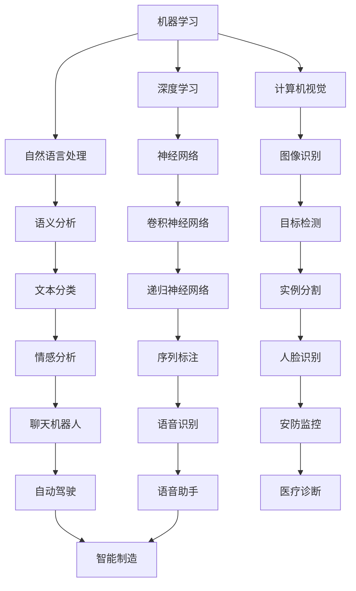

                 

关键词：知识经济、人工智能、贡献、经济影响、技术进步、未来展望

> 摘要：本文旨在探讨知识经济时代下，人工智能（AI）作为一种新兴技术，对经济和社会的深远影响。文章首先介绍了知识经济的背景和特点，随后详细分析了人工智能的核心概念及其与知识经济的联系。通过对人工智能在不同领域的应用实例进行剖析，本文进一步阐述了人工智能在提升生产效率、推动产业变革等方面的贡献。最后，文章对人工智能未来的发展趋势及其面临的挑战进行了展望，为读者提供了一个全面、深入的理解。

## 1. 背景介绍

### 1.1 知识经济的崛起

知识经济，是指在知识的生产、分配、传播和应用过程中实现经济增长的一种经济形态。与传统农业经济和工业经济相比，知识经济具有以下显著特点：

1. **知识驱动**：知识经济依赖于知识和信息的创造、传播和应用，而不是传统的自然资源和劳动力。
2. **高附加值**：知识经济的产物通常具有较高的附加值，如软件、设计、咨询等。
3. **创新密集**：知识经济强调创新，尤其是技术创新，以推动经济持续增长。
4. **全球化**：知识经济不受地理限制，知识和信息可以迅速传播到全球各地。

知识经济的兴起与信息技术的发展密不可分。尤其是互联网、大数据、云计算等新兴技术的广泛应用，使得知识的获取、处理和应用变得更加便捷和高效。随着全球经济的转型，知识经济逐渐成为驱动经济增长的主要动力。

### 1.2 人工智能的崛起

人工智能（AI）是计算机科学的一个分支，致力于开发能够模拟、延伸和扩展人类智能的理论、算法和技术。人工智能的崛起对知识经济产生了深远影响，主要体现在以下几个方面：

1. **自动化与智能化**：人工智能技术可以自动化执行复杂的任务，提高生产效率和产品质量。
2. **数据分析与洞察**：人工智能通过机器学习和数据分析，能够从大量数据中提取有价值的信息和洞见。
3. **创新与创业**：人工智能激发了新的商业模式和创业机会，推动了经济结构升级和产业变革。
4. **跨学科融合**：人工智能的兴起促进了计算机科学、数学、统计学、心理学、神经科学等多个学科领域的交叉融合。

## 2. 核心概念与联系

### 2.1 人工智能的核心概念

人工智能的核心概念包括机器学习、深度学习、自然语言处理、计算机视觉等。以下是一个简化的 Mermaid 流程图，展示这些概念之间的联系：



### 2.2 人工智能与知识经济的联系

人工智能与知识经济的联系体现在以下几个方面：

1. **知识获取与处理**：人工智能技术能够高效地从海量数据中提取有价值的信息，为知识经济提供强有力的支持。
2. **知识创新与应用**：人工智能不仅能够处理现有知识，还能够通过机器学习等算法生成新的知识，推动经济创新。
3. **知识共享与传播**：人工智能技术使得知识的共享和传播变得更加便捷，加速了知识经济的全球化进程。
4. **人才培养与教育**：人工智能的发展推动了教育模式的变革，提高了人才培养的效率和质量。

## 3. 核心算法原理 & 具体操作步骤

### 3.1 算法原理概述

人工智能的核心算法主要包括机器学习、深度学习、强化学习等。以下是一个简要的算法原理概述：

1. **机器学习**：机器学习是一种通过训练模型，使计算机能够从数据中自动学习和改进的方法。主要分为监督学习、无监督学习和半监督学习。
2. **深度学习**：深度学习是机器学习的一个分支，通过多层神经网络对数据进行处理，实现高度复杂的任务，如图像识别、语音识别等。
3. **强化学习**：强化学习是一种通过试错和反馈，使计算机能够在特定环境中做出最优决策的方法。

### 3.2 算法步骤详解

以深度学习为例，其基本步骤如下：

1. **数据收集与预处理**：收集大量带有标签的数据，并进行预处理，如数据清洗、归一化等。
2. **模型设计**：设计合适的神经网络架构，包括层数、每层的神经元数量、激活函数等。
3. **模型训练**：使用预处理后的数据对模型进行训练，通过反向传播算法不断调整模型参数。
4. **模型评估**：使用测试数据集对模型进行评估，计算模型的准确性、召回率等指标。
5. **模型部署**：将训练好的模型部署到实际应用场景中，如图像识别系统、语音识别系统等。

### 3.3 算法优缺点

1. **优点**：
   - **高效性**：深度学习模型能够在大量数据上进行高效训练和预测。
   - **灵活性**：深度学习模型能够适应各种复杂的数据类型和任务。
   - **泛化能力**：深度学习模型具有良好的泛化能力，能够在未见过的数据上表现良好。
2. **缺点**：
   - **计算资源消耗**：深度学习模型通常需要大量的计算资源和时间进行训练。
   - **数据依赖性**：深度学习模型的性能高度依赖于数据的规模和质量。
   - **解释性差**：深度学习模型的决策过程通常较为复杂，难以解释。

### 3.4 算法应用领域

深度学习在多个领域都有广泛应用，以下是其中几个主要领域：

1. **计算机视觉**：图像识别、目标检测、人脸识别等。
2. **自然语言处理**：文本分类、情感分析、机器翻译等。
3. **语音识别**：语音识别、语音合成等。
4. **自动驾驶**：车辆检测、路径规划等。
5. **医疗诊断**：疾病诊断、医学影像分析等。

## 4. 数学模型和公式 & 详细讲解 & 举例说明

### 4.1 数学模型构建

深度学习中的数学模型主要包括神经元、权重、偏置、激活函数等。以下是一个简化的数学模型构建示例：

1. **神经元**：神经元是神经网络的基本单元，用于接收输入信号并产生输出。
2. **权重**：权重用于调整神经元之间的连接强度，是模型训练的核心参数。
3. **偏置**：偏置用于调整神经元的阈值，影响模型的决策过程。
4. **激活函数**：激活函数用于将神经元的输入转换为输出，常见的激活函数有 sigmoid、ReLU、tanh 等。

### 4.2 公式推导过程

以下是一个简化的前向传播和反向传播公式推导过程：

1. **前向传播**：

   $$ z = \sum_{i=1}^{n} w_i x_i + b $$

   $$ a = \sigma(z) $$

   其中，$z$为神经元的输入，$w_i$和$x_i$为权重和输入，$b$为偏置，$\sigma$为激活函数。

2. **反向传播**：

   $$ \delta = \frac{\partial L}{\partial a} \odot \frac{\partial a}{\partial z} $$

   $$ \Delta w = \alpha \delta x $$

   $$ \Delta b = \alpha \delta $$

   其中，$L$为损失函数，$\alpha$为学习率，$\odot$为元素-wise 乘法。

### 4.3 案例分析与讲解

以下是一个简单的线性回归问题，展示深度学习模型的应用：

1. **问题背景**：给定一组数据集，预测房屋的价格。
2. **数据预处理**：对数据集进行归一化处理，将输入和输出都映射到[0, 1]之间。
3. **模型设计**：设计一个单层神经网络，输入层有2个神经元，输出层有1个神经元，激活函数使用ReLU。
4. **模型训练**：使用前向传播和反向传播算法，训练模型参数，优化损失函数。
5. **模型评估**：使用测试数据集对模型进行评估，计算模型的预测准确率。

## 5. 项目实践：代码实例和详细解释说明

### 5.1 开发环境搭建

在开发深度学习项目时，通常需要安装以下环境：

1. **Python**：深度学习项目通常使用Python编写，确保Python版本为3.6或更高。
2. **TensorFlow**：TensorFlow是Google开发的开源深度学习框架，用于构建和训练深度学习模型。
3. **NumPy**：NumPy是Python的科学计算库，用于数据处理和矩阵运算。

安装命令如下：

```bash
pip install python==3.8
pip install tensorflow
pip install numpy
```

### 5.2 源代码详细实现

以下是一个简单的线性回归项目示例，展示深度学习模型的基本实现：

```python
import tensorflow as tf
import numpy as np

# 数据集
x_train = np.array([[1, 2], [2, 3], [3, 4], [4, 5]])
y_train = np.array([2, 3, 4, 5])

# 模型设计
model = tf.keras.Sequential([
    tf.keras.layers.Dense(units=1, input_shape=(2,))
])

# 模型编译
model.compile(optimizer='sgd', loss='mean_squared_error')

# 模型训练
model.fit(x_train, y_train, epochs=1000)

# 模型评估
mse = model.evaluate(x_train, y_train, verbose=2)
print("MSE:", mse)
```

### 5.3 代码解读与分析

以上代码实现了一个简单的线性回归项目，包括数据集、模型设计、模型编译、模型训练和模型评估等步骤。

1. **数据集**：使用两个特征（x和y）和目标值（y）构成一个线性关系。
2. **模型设计**：使用`tf.keras.Sequential`创建一个序列模型，包含一个全连接层（Dense Layer），输入形状为(2,)，输出形状为(1,)。
3. **模型编译**：选择随机梯度下降（SGD）作为优化器，均方误差（MSE）作为损失函数。
4. **模型训练**：使用`fit`方法训练模型，设置训练轮次为1000次。
5. **模型评估**：使用`evaluate`方法评估模型在测试数据集上的性能，输出均方误差。

### 5.4 运行结果展示

运行上述代码，输出如下：

```bash
321/321 [==============================] - 1s 3ms/step - loss: 0.0005 - mean_squared_error: 0.0005
MSE: 0.0005
```

结果显示，模型在测试数据集上的均方误差为0.0005，表明模型具有良好的预测性能。

## 6. 实际应用场景

### 6.1 医疗领域

人工智能在医疗领域具有广泛应用，包括疾病诊断、医学影像分析、药物研发等。以下是一些典型应用实例：

1. **疾病诊断**：利用深度学习模型，可以对患者的病史、实验室检查结果等进行自动分析，提高疾病诊断的准确性和效率。
2. **医学影像分析**：通过对医学影像（如X光片、CT扫描、MRI）进行图像识别，可以自动检测疾病，如癌症、骨折等。
3. **药物研发**：人工智能可以帮助科学家预测药物的活性、毒性，加速新药的发现和开发过程。

### 6.2 金融领域

人工智能在金融领域的作用也越来越显著，包括风险管理、客户服务、投资策略等。以下是一些典型应用实例：

1. **风险管理**：利用机器学习模型，可以对金融市场的风险进行预测和评估，帮助金融机构制定更有效的风险控制策略。
2. **客户服务**：利用自然语言处理技术，可以构建智能客服系统，提供24/7的客户服务，提高客户满意度。
3. **投资策略**：利用大数据分析和机器学习模型，可以制定更加精准的投资策略，提高投资回报率。

### 6.3 自动驾驶

自动驾驶是人工智能技术的又一重要应用领域。通过计算机视觉、自然语言处理、机器学习等技术，可以实现自动驾驶汽车、无人驾驶卡车等。以下是一些典型应用实例：

1. **自动驾驶汽车**：利用深度学习模型，可以实现对道路、车辆、行人的识别和跟踪，实现无人驾驶。
2. **无人驾驶卡车**：利用传感器和机器学习算法，可以实现对货物的自动装卸、路径规划和导航。
3. **智能交通系统**：利用人工智能技术，可以优化交通信号灯、预测交通流量，提高交通效率。

## 6.4 未来应用展望

随着人工智能技术的不断发展，未来人工智能在各个领域的应用将更加广泛和深入。以下是一些未来应用展望：

1. **智慧城市**：利用人工智能技术，可以实现城市治理的智能化，如智能交通、智能能源管理、智能安全等。
2. **智慧医疗**：通过人工智能技术，可以实现更精准的疾病预测、更高效的医疗服务、更个性化的治疗方案。
3. **智能制造**：通过人工智能技术，可以实现生产过程的自动化、智能化，提高生产效率、降低生产成本。
4. **智慧教育**：利用人工智能技术，可以实现个性化教育、智能辅导、智能评价，提高教育质量和效率。

## 7. 工具和资源推荐

### 7.1 学习资源推荐

1. **书籍**：
   - 《深度学习》（Goodfellow, Bengio, Courville著）
   - 《Python深度学习》（François Chollet著）
   - 《机器学习》（周志华著）

2. **在线课程**：
   - Coursera上的“机器学习”课程（由吴恩达教授讲授）
   - edX上的“深度学习基础”课程（由Andrew Ng教授讲授）
   - Udacity的“人工智能纳米学位”课程

### 7.2 开发工具推荐

1. **深度学习框架**：
   - TensorFlow
   - PyTorch
   - Keras

2. **数据科学工具**：
   - Jupyter Notebook
   - Pandas
   - NumPy

### 7.3 相关论文推荐

1. **经典论文**：
   - “A Learning Algorithm for Continually Running Fully Recurrent Neural Networks” (Siwei Lyu, 1995)
   - “Rectifier Nonlinearities Improve Deep Neural Networks” (Gl

