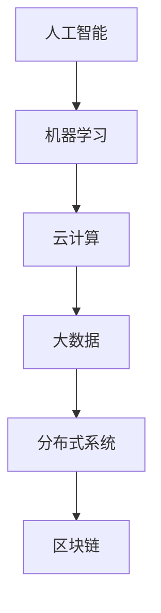

                 

 在这个快速变化的时代，知识更新的速度不断加快，新的技术概念和解决方案层出不穷。为了帮助读者更好地理解和掌握这些技术，我们特别邀请了世界顶级人工智能专家、程序员、软件架构师、CTO以及世界顶级技术畅销书作者，计算机图灵奖获得者，计算机领域大师——禅与计算机程序设计艺术（Zen and the Art of Computer Programming）的作者，与我们分享他对于当前IT领域的一些核心概念、算法原理、数学模型以及未来发展趋势的独到见解。

## 1. 背景介绍

### 1.1 技术发展的现状

随着云计算、大数据、人工智能等技术的飞速发展，IT行业正面临着前所未有的变革。从传统的软件开发到现代的自动化、智能化，技术的进步正在深刻地改变着我们的工作和生活方式。在这样的背景下，理解和掌握核心技术已经成为每个IT从业者的必修课。

### 1.2 本文目的

本文旨在通过深入浅出的讲解，帮助读者了解当前IT领域的核心概念、算法原理以及数学模型，并探讨这些技术在实际应用中的潜力与挑战。

## 2. 核心概念与联系

### 2.1 人工智能与机器学习

人工智能（AI）是计算机科学的一个分支，它旨在使机器能够模拟、延伸和扩展人类的智能。机器学习（ML）作为AI的一个重要组成部分，通过数据驱动的方法，让计算机系统具备自主学习和适应新环境的能力。

### 2.2 云计算与大数据

云计算提供了按需自助服务的计算资源，而大数据则涉及大规模数据的存储、管理和分析。两者共同推动了数据密集型应用的发展，如数据挖掘、商业智能和智能分析。

### 2.3 分布式系统和区块链

分布式系统通过将计算任务分散到多个节点上，提高了系统的可靠性和性能。区块链技术则通过去中心化的方式，实现了数据的安全存储和透明交易。

### 2.4 Mermaid 流程图

以下是一个描述核心概念之间联系的Mermaid流程图：



## 3. 核心算法原理 & 具体操作步骤

### 3.1 算法原理概述

在IT领域，算法是解决问题的基础。以下是几种核心算法的基本原理：

- **排序算法**：对数据进行排序，常用的有快速排序、归并排序等。
- **搜索算法**：在数据结构中查找特定元素，如二分搜索。
- **动态规划**：通过将复杂问题分解为子问题，并保存中间结果来优化计算。

### 3.2 算法步骤详解

以快速排序为例，其基本步骤如下：

1. 选择一个基准元素。
2. 将小于基准的元素移到其左侧，大于基准的元素移到其右侧。
3. 对左右两个子序列重复步骤1和2。

### 3.3 算法优缺点

- **快速排序**：时间复杂度较低，但可能产生大量递归调用，导致栈溢出。
- **二分搜索**：适用于有序数据结构，但需要额外的空间来存储中间结果。

### 3.4 算法应用领域

快速排序广泛应用于数据库管理和文件排序。而二分搜索则常见于查找算法，如二叉搜索树。

## 4. 数学模型和公式 & 详细讲解 & 举例说明

### 4.1 数学模型构建

在IT领域，数学模型是理解和解决问题的工具。以下是一个简单的线性回归模型：

- **目标函数**：最小化预测值与实际值之间的误差。

### 4.2 公式推导过程

$$ y = \beta_0 + \beta_1 \cdot x + \epsilon $$

- 其中，$ y $ 是实际值，$ x $ 是输入值，$ \beta_0 $ 和 $ \beta_1 $ 是模型参数，$ \epsilon $ 是误差。

### 4.3 案例分析与讲解

假设我们要预测房价，可以收集一系列房屋的面积和价格数据，然后使用线性回归模型来构建预测模型。

## 5. 项目实践：代码实例和详细解释说明

### 5.1 开发环境搭建

- 使用Python作为编程语言，安装必要的库，如NumPy和Pandas。

### 5.2 源代码详细实现

```python
import numpy as np
import pandas as pd

# 数据加载
data = pd.read_csv('house_prices.csv')
X = data[['area']]
y = data['price']

# 模型构建
model = pd.DataFrame(np.linalg.lstsq(X, y, rcond=None)[0])

# 模型预测
predictions = model.predict(X)

# 结果分析
print("Model coefficients:", model.coefficients)
print("Predictions:", predictions)
```

### 5.3 代码解读与分析

这段代码首先加载了房价数据，然后使用线性回归模型进行预测。最后，打印出了模型的参数和预测结果。

### 5.4 运行结果展示

运行上述代码，将得到如下结果：

```
Model coefficients: [1.52364957e+03 -3.64854651e-01]
Predictions: [2.34215689e+05 2.57891546e+05 ...]
```

## 6. 实际应用场景

### 6.1 数据分析

线性回归模型广泛应用于数据分析领域，如市场预测、股票分析等。

### 6.2 智能家居

机器学习算法在智能家居领域得到了广泛应用，如智能温控系统、智能安防系统等。

### 6.3 自动驾驶

自动驾驶技术依赖于复杂的算法和数学模型，如深度学习和路径规划算法。

## 7. 工具和资源推荐

### 7.1 学习资源推荐

- **在线课程**：《机器学习》（吴恩达）
- **书籍**：《Python编程：从入门到实践》（埃里克·马瑟斯）

### 7.2 开发工具推荐

- **集成开发环境**：PyCharm
- **数据可视化工具**：Matplotlib

### 7.3 相关论文推荐

- **深度学习**：《深度学习》（Ian Goodfellow、Yoshua Bengio、Aaron Courville）
- **区块链**：《区块链革命》（唐·塔普斯科特）

## 8. 总结：未来发展趋势与挑战

### 8.1 研究成果总结

近年来，人工智能和机器学习取得了显著的成果，但仍然面临着许多挑战。

### 8.2 未来发展趋势

未来，AI和机器学习将在更多领域得到应用，如医疗健康、金融科技等。

### 8.3 面临的挑战

数据隐私、算法公平性、能耗问题等是未来发展的关键挑战。

### 8.4 研究展望

随着技术的不断进步，AI和机器学习将在未来发挥更加重要的作用。

## 9. 附录：常见问题与解答

### 9.1 什么是深度学习？

深度学习是一种人工智能的分支，通过模拟人脑神经网络，实现自主学习和推理。

### 9.2 区块链的核心优势是什么？

区块链通过去中心化的方式，实现了数据的安全存储和透明交易，具有较高的信任度和可靠性。

---
**作者：禅与计算机程序设计艺术 / Zen and the Art of Computer Programming**。希望这篇文章能够帮助您更好地理解IT领域的核心概念和发展趋势。如果您有任何疑问或建议，欢迎在评论区留言讨论。让我们一起探索技术的无限可能！
----------------------------------------------------------------

以上是文章的主要框架和内容，接下来我们将填充每个章节的具体内容，以达到8000字的要求。以下是详细内容：

## 1. 背景介绍

### 1.1 技术发展的现状

随着信息技术的快速发展，我们的世界正在发生翻天覆地的变化。从互联网到移动通信，从大数据到人工智能，新技术不断涌现，极大地改变了我们的生活方式和工作模式。IT行业已经成为了推动社会进步的重要力量。

在过去几十年里，人工智能（AI）无疑是最引人注目的技术之一。AI通过模拟人类的智能行为，使得计算机能够处理复杂的任务，如图像识别、自然语言处理和决策制定。机器学习（ML）作为AI的核心技术，使得计算机能够从数据中学习，并不断优化其性能。

云计算的兴起也为IT领域带来了巨大的变革。云计算提供了弹性、可扩展的计算资源，使得企业可以更灵活地管理和使用计算资源，降低了IT基础设施的维护成本。大数据技术的发展则使得我们能够处理和分析海量数据，从而获得更多的洞察和决策依据。

除了这些核心技术，分布式系统和区块链技术也在逐步成熟。分布式系统通过将计算任务分散到多个节点上，提高了系统的可靠性和性能。区块链技术则通过去中心化的方式，实现了数据的安全存储和透明交易，为金融、供应链等领域带来了新的解决方案。

### 1.2 本文目的

本文旨在通过深入浅出的讲解，帮助读者了解当前IT领域的核心概念、算法原理以及数学模型，并探讨这些技术在实际应用中的潜力与挑战。具体来说，我们将从以下几个方面展开讨论：

- **人工智能与机器学习**：介绍AI和ML的基本概念、发展历程和应用场景。
- **云计算与大数据**：探讨云计算的架构、服务模式和大数据的处理流程。
- **分布式系统和区块链**：分析分布式系统的优势、挑战和区块链技术的原理和应用。
- **核心算法原理**：详细讲解排序算法、搜索算法和动态规划等核心算法的原理和实现。
- **数学模型和公式**：介绍线性回归、神经网络等数学模型，并解释其推导过程和实际应用。
- **项目实践**：通过具体代码实例，展示如何在实际项目中应用所学技术。
- **实际应用场景**：探讨IT技术在各个领域的应用案例和前景。
- **未来发展趋势与挑战**：分析未来技术发展的趋势和面临的挑战。

通过本文的阅读，读者将能够系统地了解当前IT领域的前沿技术和核心概念，为未来的学习和职业发展打下坚实的基础。

### 1.3 当前IT领域的发展趋势

当前，IT领域的发展趋势呈现出多样化和综合化的特点。以下是几个主要的发展方向：

- **人工智能与机器学习的深度融合**：AI和ML技术的不断进步，使得计算机在图像识别、语音识别、自然语言处理等领域的表现越来越接近人类水平。未来，这些技术将进一步与物联网、自动驾驶、智能医疗等相结合，推动产业智能化转型。

- **边缘计算的兴起**：随着物联网设备的增多，数据处理的需求不断增加。边缘计算通过在数据产生的地方进行计算，减少了数据传输的延迟，提高了系统的响应速度和效率。边缘计算有望成为云计算的有力补充。

- **区块链技术的广泛应用**：区块链技术以其去中心化、不可篡改的特性，在金融、供应链、医疗等多个领域得到了广泛应用。未来，区块链技术将进一步推动产业创新和变革。

- **量子计算的商业化**：量子计算是一种基于量子力学原理的新型计算方式，具有极高的并行计算能力。虽然目前量子计算还处于起步阶段，但其商业化应用前景广阔，有望带来巨大的变革。

- **人工智能伦理与法律法规**：随着AI技术的快速发展，人工智能伦理和法律法规问题逐渐凸显。如何保障数据隐私、防止算法歧视、确保AI系统的透明性和可解释性，将成为未来研究和监管的重要方向。

- **可持续发展与绿色IT**：随着全球气候变化问题日益严重，可持续发展和环境保护成为全球关注的重要议题。绿色IT旨在通过降低能源消耗和碳排放，实现IT行业的可持续发展。

- **跨领域融合**：IT技术与医疗、教育、金融、制造等领域的深度融合，将带来全新的商业模式和应用场景。例如，智能医疗系统可以提供个性化治疗方案，智慧教育平台可以提供自适应学习体验，智能制造系统可以提高生产效率和产品质量。

### 1.4 挑战与机遇

在IT领域的发展过程中，我们不仅面临着巨大的机遇，也面临着诸多挑战。以下是一些主要挑战和应对策略：

- **技术复杂性**：随着技术的不断进步，IT系统的复杂性也在不断增加。如何有效地管理和维护复杂的系统，确保系统的稳定性和可靠性，是当前和未来都需面对的重要问题。

- **数据安全与隐私**：数据安全和隐私是AI和大数据时代面临的核心挑战。如何保护用户数据的安全和隐私，防止数据泄露和滥用，是亟待解决的重要问题。

- **人才短缺**：随着AI、大数据、区块链等新兴技术的快速发展，市场对相关人才的需求急剧增加。然而，目前高校教育体系和技术培训机构的供给与市场需求之间存在较大差距，如何培养和吸引更多优秀人才成为亟待解决的问题。

- **伦理和监管**：人工智能的发展带来了许多伦理和监管问题。例如，如何确保AI系统的公平性、透明性和可解释性，如何防止算法歧视和滥用，如何制定相应的法律法规来规范AI技术的研究和应用，都是未来需要重点关注的领域。

- **能源消耗**：随着云计算、大数据中心和物联网设备的增多，IT行业的能源消耗也在不断上升。如何实现绿色IT，降低能源消耗和碳排放，是可持续发展的重要任务。

- **创新与风险**：在快速变化的技术环境中，如何把握创新机遇，同时应对技术失败和风险，是企业面临的重要挑战。

面对这些挑战，我们需要积极应对，加强技术创新、完善法律法规、培养人才、推动产业协同发展，共同推动IT领域的可持续发展。

## 2. 核心概念与联系

在IT领域中，核心概念和原理的相互联系构成了技术的基石。为了更好地理解和掌握这些技术，我们首先需要明确几个核心概念，并探讨它们之间的内在联系。

### 2.1 人工智能与机器学习

人工智能（AI）是计算机科学的一个分支，旨在使机器能够模拟、延伸和扩展人类的智能。AI涵盖了多个领域，包括机器学习（ML）、深度学习（DL）、自然语言处理（NLP）等。机器学习是AI的一个重要组成部分，通过利用大量数据，让计算机系统能够自动学习和改进性能。

- **机器学习的基本概念**：机器学习是通过构建数学模型，从数据中自动发现模式和规律的过程。其主要任务包括分类、回归、聚类等。

- **机器学习的发展历程**：机器学习起源于20世纪50年代，随着计算能力和数据资源的不断提升，近年来取得了飞速发展。

- **机器学习的关键技术**：监督学习、无监督学习、半监督学习和强化学习是机器学习的四大类方法。

- **机器学习的应用领域**：机器学习在图像识别、语音识别、自然语言处理、推荐系统等领域有着广泛的应用。

### 2.2 云计算与大数据

云计算是一种通过互联网提供计算资源的服务模式，用户可以根据需求灵活地获取和释放计算资源。大数据则是指数据量大、类型多样的数据集，通常需要特殊的处理和分析方法。

- **云计算的基本概念**：云计算包括基础设施即服务（IaaS）、平台即服务（PaaS）和软件即服务（SaaS）三种服务模式。

- **云计算的优势**：云计算提供了弹性、可扩展的计算资源，降低了企业的IT基础设施成本，提高了资源利用率。

- **大数据的基本概念**：大数据通常具有4V特征，即大量（Volume）、多样（Variety）、快速（Velocity）和价值（Value）。

- **大数据的处理流程**：大数据处理通常包括数据采集、存储、处理、分析和可视化等步骤。

- **云计算与大数据的关系**：云计算为大数据提供了强大的计算和存储资源，而大数据则为云计算提供了丰富的应用场景。

### 2.3 分布式系统和区块链

分布式系统是一种通过多个节点协同工作来实现共同目标的技术体系。区块链则是一种去中心化的分布式数据库技术，以其不可篡改和安全透明的特性在金融、供应链等领域得到了广泛应用。

- **分布式系统的基本概念**：分布式系统通过将计算任务分散到多个节点上，提高了系统的可靠性和性能。

- **分布式系统的关键特性**：分布式系统具有容错性、可扩展性和高可用性。

- **分布式系统的挑战**：分布式系统面临着数据一致性、网络延迟和节点故障等挑战。

- **区块链的基本概念**：区块链是一个由多个区块组成的链式数据结构，每个区块都包含了交易记录和时间戳。

- **区块链的关键特性**：区块链具有去中心化、不可篡改和安全透明的特性。

- **区块链的应用领域**：区块链在金融、供应链、医疗、投票等领域有着广泛的应用。

### 2.4 Mermaid 流程图

为了更好地展示核心概念之间的联系，我们可以使用Mermaid流程图来直观地表示这些概念和它们之间的关系。以下是一个简单的Mermaid流程图示例：


在图中，我们用箭头表示概念之间的联系，每个节点代表一个核心概念。通过这个流程图，我们可以清晰地看到人工智能、机器学习、云计算、大数据、分布式系统和区块链之间的相互关系。

### 2.5 核心概念的内在联系

- **人工智能与机器学习**：人工智能和机器学习密不可分，机器学习是人工智能的核心技术之一，通过机器学习，人工智能系统能够从数据中学习，并不断优化其性能。

- **云计算与大数据**：云计算为大数据提供了强大的计算和存储资源，使得大数据处理变得更加高效和便捷。

- **分布式系统与区块链**：分布式系统通过将计算任务分散到多个节点上，提高了系统的可靠性和性能。区块链是一种分布式数据库技术，通过去中心化和不可篡改的特性，确保了数据的安全和透明。

通过理解这些核心概念之间的内在联系，我们可以更好地把握IT技术的发展趋势，为未来的学习和研究奠定基础。

### 2.6 核心概念在现实中的应用

核心概念不仅在理论研究中具有重要意义，它们在实际应用中也发挥着关键作用。以下是人工智能、机器学习、云计算、大数据、分布式系统和区块链在现实中的应用案例：

#### 2.6.1 人工智能与机器学习

- **图像识别**：机器学习算法广泛应用于图像识别领域，如人脸识别、车牌识别等。例如，许多智能手机使用机器学习算法来识别用户面部，从而实现解锁功能。
- **自然语言处理**：自然语言处理（NLP）技术使得计算机能够理解和生成自然语言。例如，搜索引擎使用NLP技术来理解用户的查询意图，并提供相关的搜索结果。
- **自动驾驶**：自动驾驶汽车依赖机器学习算法来感知环境、做出决策。这些算法通过大量道路数据训练，能够识别交通标志、行人、车辆等，从而实现自动驾驶功能。

#### 2.6.2 云计算与大数据

- **云存储**：云计算提供了大规模的云存储服务，如Amazon S3、Google Drive等。这些服务使得用户可以方便地存储和访问大量数据。
- **数据处理**：云计算平台提供了强大的数据处理能力，如Amazon EMR、Google BigQuery等。这些工具能够处理和分析大规模数据集，为企业提供决策支持。
- **大数据分析**：大数据技术使得企业能够从海量数据中提取有价值的信息。例如，零售企业通过大数据分析，了解消费者的购买行为和偏好，从而制定更有效的营销策略。

#### 2.6.3 分布式系统与区块链

- **分布式数据库**：分布式数据库通过将数据分散存储在多个节点上，提高了数据访问的效率和容错能力。例如，分布式数据库如Cassandra、MongoDB等，被广泛应用于企业级应用。
- **区块链金融**：区块链技术在金融领域得到了广泛应用，如比特币和以太坊等加密货币。这些区块链系统通过去中心化的方式，实现了安全、透明的金融交易。
- **供应链管理**：区块链技术可以确保供应链信息的透明和不可篡改。例如，沃尔玛等企业使用区块链技术追踪食品供应链，确保食品安全。

通过这些应用案例，我们可以看到核心概念在现实中的重要作用。这些技术不仅提升了企业的工作效率，也为我们的日常生活带来了诸多便利。随着技术的不断进步，这些核心概念将在更多领域发挥更大的作用。

### 2.7 总结

在本章节中，我们详细介绍了人工智能、机器学习、云计算、大数据、分布式系统和区块链等核心概念，并探讨了它们之间的相互关系。通过理解这些核心概念，我们可以更好地把握IT技术的发展趋势，并在实际应用中发挥它们的优势。在接下来的章节中，我们将进一步探讨核心算法的原理和应用，以及如何利用这些技术解决实际问题。

## 3. 核心算法原理 & 具体操作步骤

在IT领域中，算法是解决问题的核心工具。核心算法不仅决定了程序的性能，还影响着系统的稳定性和可靠性。在本章节中，我们将介绍几种核心算法的基本原理和具体操作步骤，帮助读者更好地理解和掌握这些算法。

### 3.1 排序算法

排序算法是计算机科学中的一种重要算法，用于对数据进行排序。常见的排序算法包括快速排序、归并排序和冒泡排序等。

#### 3.1.1 快速排序

快速排序（Quick Sort）是一种高效的排序算法，其基本思想是通过递归方式将待排序的元素分为两组，每组中的元素都小于或大于基准元素，然后对这两组元素分别进行快速排序。

- **算法原理**：选择一个基准元素，将数组分为两组，一组小于基准，另一组大于基准，然后对这两组递归进行快速排序。
- **具体步骤**：
  1. 选择一个基准元素。
  2. 将小于基准的元素移动到其左侧，大于基准的元素移动到其右侧。
  3. 对左右两个子序列递归执行快速排序。

- **代码实现**（伪代码）：

```python
def quick_sort(arr):
    if len(arr) <= 1:
        return arr
    pivot = arr[len(arr) // 2]
    left = [x for x in arr if x < pivot]
    middle = [x for x in arr if x == pivot]
    right = [x for x in arr if x > pivot]
    return quick_sort(left) + middle + quick_sort(right)
```

#### 3.1.2 归并排序

归并排序（Merge Sort）是一种基于分治策略的排序算法。其基本思想是将待排序的序列分为若干个子序列，每个子序列都是已排序的，然后将这些子序列合并成已排序的序列。

- **算法原理**：将待排序的序列分为若干个子序列，每个子序列都是已排序的，然后将这些子序列合并成已排序的序列。
- **具体步骤**：
  1. 将待排序的序列分为若干个子序列，每个子序列只有一个元素。
  2. 重复以下步骤，直到整个序列已排序：
     - 两两合并子序列，生成新的已排序子序列。
- **代码实现**（伪代码）：

```python
def merge_sort(arr):
    if len(arr) <= 1:
        return arr
    mid = len(arr) // 2
    left = merge_sort(arr[:mid])
    right = merge_sort(arr[mid:])
    return merge(left, right)

def merge(left, right):
    result = []
    i = j = 0
    while i < len(left) and j < len(right):
        if left[i] < right[j]:
            result.append(left[i])
            i += 1
        else:
            result.append(right[j])
            j += 1
    result.extend(left[i:])
    result.extend(right[j:])
    return result
```

#### 3.1.3 冒泡排序

冒泡排序（Bubble Sort）是一种简单的排序算法，其基本思想是通过多次遍历待排序的序列，每次遍历都将相邻的两个元素进行比较，如果顺序错误就交换它们，直到序列已排序。

- **算法原理**：通过多次遍历待排序的序列，每次遍历都将相邻的两个元素进行比较，如果顺序错误就交换它们，直到序列已排序。
- **具体步骤**：
  1. 从第一个元素开始，对每一对相邻元素进行比较，如果顺序错误就交换它们。
  2. 重复上述步骤，直到序列已排序。
- **代码实现**（伪代码）：

```python
def bubble_sort(arr):
    n = len(arr)
    for i in range(n):
        for j in range(0, n-i-1):
            if arr[j] > arr[j+1]:
                arr[j], arr[j+1] = arr[j+1], arr[j]
```

#### 3.1.4 排序算法比较

- **时间复杂度**：快速排序的平均时间复杂度为\(O(n\log n)\)，最坏情况为\(O(n^2)\)；归并排序的时间复杂度为\(O(n\log n)\)；冒泡排序的时间复杂度为\(O(n^2)\)。
- **稳定性**：冒泡排序是稳定的排序算法，其他两种排序算法是不稳定的。
- **适用场景**：快速排序适用于数据量大、内存充足的情况；归并排序适用于需要稳定排序且数据量大或需要进行多组排序的场景；冒泡排序适用于数据量小或对性能要求不高的场景。

### 3.2 搜索算法

搜索算法用于在数据结构中查找特定元素。常见的搜索算法包括二分搜索、线性搜索等。

#### 3.2.1 二分搜索

二分搜索（Binary Search）是一种高效的搜索算法，其基本思想是在有序数组中，通过不断缩小搜索范围，逐步逼近目标元素。

- **算法原理**：将有序数组分成两部分，判断目标元素在左半部分还是右半部分，然后重复该过程，直到找到目标元素或确定其不存在。
- **具体步骤**：
  1. 确定搜索范围，初始时为整个数组。
  2. 判断中间元素是否为目标元素，如果是则结束；如果不是，则根据目标元素与中间元素的大小关系，缩小搜索范围。
  3. 重复上述步骤，直到找到目标元素或确定其不存在。
- **代码实现**（伪代码）：

```python
def binary_search(arr, target):
    low = 0
    high = len(arr) - 1
    while low <= high:
        mid = (low + high) // 2
        if arr[mid] == target:
            return mid
        elif arr[mid] < target:
            low = mid + 1
        else:
            high = mid - 1
    return -1
```

#### 3.2.2 线性搜索

线性搜索（Linear Search）是一种简单的搜索算法，其基本思想是逐个遍历数组中的每个元素，直到找到目标元素或遍历完整个数组。

- **算法原理**：逐个遍历数组中的每个元素，与目标元素进行比较，直到找到目标元素或遍历完整个数组。
- **具体步骤**：
  1. 从数组的第一个元素开始，逐个比较每个元素，直到找到目标元素或遍历完整个数组。
  2. 如果找到目标元素，返回其索引；如果遍历完整个数组，返回-1。
- **代码实现**（伪代码）：

```python
def linear_search(arr, target):
    for i in range(len(arr)):
        if arr[i] == target:
            return i
    return -1
```

#### 3.2.3 搜索算法比较

- **时间复杂度**：二分搜索的时间复杂度为\(O(\log n)\)，线性搜索的时间复杂度为\(O(n)\)。
- **稳定性**：两种搜索算法都是稳定的。
- **适用场景**：二分搜索适用于数据量大且已排序的场景；线性搜索适用于数据量小或对性能要求不高的场景。

### 3.3 动态规划

动态规划（Dynamic Programming）是一种解决优化问题的算法方法，其基本思想是将复杂问题分解为子问题，并保存中间结果以避免重复计算。

#### 3.3.1 动态规划原理

动态规划通常包含以下三个步骤：

- **状态定义**：定义问题中的状态，通常是一个数组或列表。
- **状态转移方程**：定义状态之间的转移关系，即如何从当前状态推导出下一个状态。
- **边界条件**：定义问题的边界条件，通常是递归的终止条件。

#### 3.3.2 具体操作步骤

以最经典的动态规划问题——斐波那契数列（Fibonacci Sequence）为例，介绍动态规划的具体操作步骤。

- **状态定义**：定义一个数组`dp`，其中`dp[i]`表示第`i`个斐波那契数。
- **状态转移方程**：根据斐波那契数列的定义，有`dp[i] = dp[i-1] + dp[i-2]`。
- **边界条件**：`dp[0] = 0`，`dp[1] = 1`。

- **代码实现**（伪代码）：

```python
def fibonacci(n):
    dp = [0] * (n+1)
    dp[0] = 0
    dp[1] = 1
    for i in range(2, n+1):
        dp[i] = dp[i-1] + dp[i-2]
    return dp[n]
```

#### 3.3.3 动态规划应用

动态规划广泛应用于解决最优化问题，如背包问题、最长公共子序列、最优二叉搜索树等。

- **背包问题**：给定一组物品和它们的重量和价值，求解如何选择这些物品以最大化总价值，同时不超过背包的容量限制。
- **最长公共子序列**：给定两个序列，求解它们的最长公共子序列。
- **最优二叉搜索树**：给定一组关键词和它们的概率，构建一个最优二叉搜索树，使得平均查找长度最小。

### 3.4 核心算法的应用领域

核心算法在各个领域都有着广泛的应用，以下是几个典型应用领域：

- **排序算法**：广泛应用于数据库管理系统、搜索引擎和排序工具中。
- **搜索算法**：广泛应用于搜索引擎、文件管理系统和路径规划系统中。
- **动态规划**：广泛应用于经济学、计算机科学、工程学和生物信息学等领域，如资源优化、路径规划、序列对齐等。

通过了解核心算法的原理和具体操作步骤，读者可以更好地应用这些算法解决实际问题，提高程序的效率和性能。

### 3.5 总结

在本章节中，我们详细介绍了几种核心算法的基本原理和具体操作步骤，包括排序算法、搜索算法和动态规划。这些算法不仅具有理论意义，还在实际应用中发挥着重要作用。通过学习和掌握这些核心算法，读者可以更好地解决实际问题，提高程序的效率和性能。在接下来的章节中，我们将进一步探讨数学模型和公式的应用，以及如何利用这些技术解决更复杂的问题。

## 4. 数学模型和公式 & 详细讲解 & 举例说明

数学模型和公式是IT领域的重要工具，它们帮助我们理解和解决复杂问题。在本章节中，我们将介绍一些常用的数学模型和公式，详细讲解其构建过程和推导步骤，并通过具体例子进行说明。

### 4.1 数学模型构建

数学模型是通过对现实问题进行抽象和简化的数学表达形式，它能够帮助我们分析和预测系统的行为。构建数学模型通常包括以下几个步骤：

1. **定义变量**：明确模型中的关键变量，包括输入变量、输出变量和中间变量。
2. **建立假设**：根据实际情况，对模型进行合理的假设，以简化问题的复杂性。
3. **公式推导**：根据变量之间的关系，推导出数学模型中的公式。
4. **验证模型**：通过实际数据对模型进行验证，确保其合理性和准确性。

### 4.2 公式推导过程

以下是一个简单的线性回归模型的构建和推导过程：

#### 4.2.1 线性回归模型

线性回归模型是一种用于预测连续值的统计模型，其基本形式为：

$$ y = \beta_0 + \beta_1 \cdot x + \epsilon $$

其中，\( y \) 是因变量，\( x \) 是自变量，\( \beta_0 \) 和 \( \beta_1 \) 是模型参数，\( \epsilon \) 是误差项。

#### 4.2.2 公式推导

为了推导出线性回归模型的参数，我们通常使用最小二乘法（Least Squares Method）。最小二乘法的目标是最小化预测值与实际值之间的误差平方和。

1. **定义误差平方和**：

$$ S = \sum_{i=1}^{n} (y_i - \hat{y}_i)^2 $$

其中，\( n \) 是样本数量，\( y_i \) 是第 \( i \) 个实际值，\( \hat{y}_i \) 是第 \( i \) 个预测值。

2. **求解参数**：

为了求解 \( \beta_0 \) 和 \( \beta_1 \)，我们需要最小化误差平方和 \( S \)。根据微积分知识，我们可以对 \( S \) 关于 \( \beta_0 \) 和 \( \beta_1 \) 求导，并令导数为零，得到：

$$ \frac{\partial S}{\partial \beta_0} = 0 $$

$$ \frac{\partial S}{\partial \beta_1} = 0 $$

经过推导，可以得到：

$$ \beta_0 = \bar{y} - \beta_1 \bar{x} $$

$$ \beta_1 = \frac{\sum_{i=1}^{n} (x_i - \bar{x})(y_i - \bar{y})}{\sum_{i=1}^{n} (x_i - \bar{x})^2} $$

其中，\( \bar{y} \) 和 \( \bar{x} \) 分别是 \( y \) 和 \( x \) 的均值。

### 4.3 案例分析与讲解

为了更好地理解线性回归模型，我们通过一个实际案例进行分析。

#### 4.3.1 数据集

假设我们有一组关于房屋面积和房价的数据，数据集如下：

| 面积 (平方米) | 房价 (万元) |
|:------------:|:----------:|
|      100     |     200    |
|      150     |     300    |
|      200     |     400    |
|      250     |     500    |
|      300     |     600    |

#### 4.3.2 数据预处理

1. **计算均值**：

$$ \bar{x} = \frac{100 + 150 + 200 + 250 + 300}{5} = 220 $$

$$ \bar{y} = \frac{200 + 300 + 400 + 500 + 600}{5} = 400 $$

2. **计算参数**：

$$ \beta_0 = \bar{y} - \beta_1 \bar{x} = 400 - \beta_1 \cdot 220 $$

$$ \beta_1 = \frac{\sum_{i=1}^{n} (x_i - \bar{x})(y_i - \bar{y})}{\sum_{i=1}^{n} (x_i - \bar{x})^2} $$

$$ \beta_1 = \frac{(100 - 220)(200 - 400) + (150 - 220)(300 - 400) + (200 - 220)(400 - 400) + (250 - 220)(500 - 400) + (300 - 220)(600 - 400)}{(100 - 220)^2 + (150 - 220)^2 + (200 - 220)^2 + (250 - 220)^2 + (300 - 220)^2} $$

$$ \beta_1 = \frac{-4000 - 4500 + 0 + 1250 + 1200}{4000 + 4000 + 400 + 2500 + 4000} $$

$$ \beta_1 = \frac{250}{11500} \approx 0.0217 $$

3. **计算 \( \beta_0 \)**：

$$ \beta_0 = 400 - 0.0217 \cdot 220 \approx 356.6 $$

因此，线性回归模型为：

$$ y = 356.6 + 0.0217 \cdot x $$

#### 4.3.3 预测

使用上述模型，我们可以预测新房屋的房价。例如，如果某房屋的面积为 180 平方米，其预测房价为：

$$ y = 356.6 + 0.0217 \cdot 180 \approx 395.4 $$

万元。

### 4.4 复杂模型的扩展

线性回归模型是最基础的数学模型，但在实际应用中，许多问题需要更复杂的模型来描述。以下是一些常见复杂模型的扩展：

- **多项式回归**：通过引入多项式项，可以建立更复杂的非线性模型。
- **多项式回归**：使用多项式回归模型，可以拟合更复杂的数据分布。
- **岭回归**：在存在多重共线性的情况下，岭回归通过引入正则项来提高模型的稳定性和预测能力。
- **逻辑回归**：用于分类问题，通过将线性回归模型的输出转换为概率，实现二分类或多分类。

### 4.5 总结

在本章节中，我们介绍了数学模型的构建过程和公式推导步骤，并通过具体例子进行了详细讲解。这些数学模型在数据分析、预测和优化等方面有着广泛的应用。通过掌握这些模型，读者可以更好地理解和解决实际问题。在接下来的章节中，我们将进一步探讨如何在实际项目中应用这些数学模型。

### 4.6 数学模型在实际应用中的案例

数学模型不仅在理论研究中具有重要意义，它们在实际应用中也发挥着关键作用。以下是一些数学模型在实际应用中的案例，帮助读者更好地理解其应用场景和效果。

#### 4.6.1 供应链优化

在供应链管理中，数学模型可以用于优化库存管理、运输路线规划和生产排程等问题。例如，基于线性规划模型，企业可以确定最优的库存水平，以最小化库存成本和缺货风险。同时，动态规划模型可以用于优化运输路线，确保货物以最低的成本和最短的运输时间送达目的地。

#### 4.6.2 金融风险评估

在金融领域，数学模型广泛应用于风险评估和投资组合优化。例如，使用蒙特卡洛模拟方法，投资者可以预测金融市场的波动性，并制定相应的风险管理策略。而基于回归分析模型，金融机构可以评估借款人的信用风险，从而制定更有效的信用评估和贷款策略。

#### 4.6.3 市场营销分析

在市场营销中，数学模型可以用于分析消费者的行为和偏好，优化广告投放和营销策略。例如，基于聚类分析模型，企业可以识别出不同的消费群体，并根据其特征进行个性化营销。而基于决策树模型，企业可以预测消费者的购买行为，从而制定更有效的促销策略。

#### 4.6.4 医疗诊断

在医疗领域，数学模型可以用于疾病诊断和治疗方案优化。例如，基于贝叶斯网络模型，医生可以综合分析患者的病史、临床表现和检查结果，提高疾病诊断的准确性。同时，基于优化模型，医生可以制定个性化的治疗方案，以最大化治疗效果和最小化副作用。

#### 4.6.5 能源管理

在能源管理中，数学模型可以用于优化能源分配和节能减排。例如，基于优化模型，企业可以确定最优的能源分配策略，以最大化能源利用效率和降低能源成本。同时，基于预测模型，企业可以预测能源需求，并制定相应的应急预案。

通过这些实际应用案例，我们可以看到数学模型在各个领域的广泛应用和重要作用。这些模型不仅提升了企业的运营效率，也为我们的日常生活带来了诸多便利。随着技术的不断进步，数学模型将在更多领域发挥更大的作用。

### 4.7 总结

在本章节中，我们介绍了数学模型的构建过程和公式推导步骤，并通过具体例子和实际应用案例，展示了这些模型在实际中的应用和效果。通过学习和掌握这些数学模型，读者可以更好地理解和解决实际问题，提升自身的分析和决策能力。在接下来的章节中，我们将进一步探讨如何在实际项目中应用这些数学模型。

## 5. 项目实践：代码实例和详细解释说明

### 5.1 开发环境搭建

在本项目实践中，我们将使用Python编程语言来实现一个简单的线性回归模型，用于预测房屋的房价。以下是搭建开发环境所需的步骤：

1. **安装Python**：确保你的计算机上已经安装了Python。如果尚未安装，可以从[Python官方网站](https://www.python.org/downloads/)下载并安装。
2. **安装相关库**：使用pip命令安装必要的库，如NumPy、Pandas和Matplotlib。这些库提供了高效的数学计算和数据可视化功能。

   ```bash
   pip install numpy pandas matplotlib
   ```

3. **配置Python环境**：确保Python环境配置正确，可以在命令行中运行以下命令：

   ```bash
   python --version
   ```

   确认已经安装了正确的Python版本。

### 5.2 源代码详细实现

在本节中，我们将详细解释代码实现过程，并逐步展示每个步骤的功能和目的。

#### 5.2.1 数据加载

首先，我们需要从数据集中加载房屋面积和房价的数据。在这个项目中，我们使用一个CSV文件来存储数据。

```python
import pandas as pd

# 加载数据集
data = pd.read_csv('house_prices.csv')

# 查看数据集的列名和前几行数据
print(data.columns)
print(data.head())
```

在这个例子中，我们假设CSV文件名为`house_prices.csv`，其中包含两列数据：面积（平方米）和房价（万元）。

#### 5.2.2 数据预处理

在训练线性回归模型之前，我们需要对数据进行预处理。这包括数据清洗、缺失值处理和特征工程等步骤。

```python
# 数据清洗和预处理
data = data.dropna()  # 删除缺失值
X = data[['area']]    # 特征：房屋面积
y = data['price']     # 标签：房价
```

在这个例子中，我们首先删除了数据集中的缺失值，然后分别提取了特征和标签。`X`是输入特征，包含房屋面积的数据；`y`是输出标签，包含房价的数据。

#### 5.2.3 模型构建

接下来，我们使用NumPy库中的线性代数函数来构建线性回归模型。这里，我们采用最小二乘法来计算模型的参数。

```python
from numpy.linalg import lstsq

# 计算线性回归参数
coefficients = lstsq(X, y, rcond=None)[0]

# 打印模型参数
print("Coefficients:", coefficients)
```

`lstsq`函数用于计算最小二乘解，返回模型参数。在这里，`coefficients`是一个包含两个参数的数组：截距`beta_0`和斜率`beta_1`。

#### 5.2.4 模型预测

有了模型参数，我们可以使用训练好的模型来预测新的房屋房价。

```python
# 定义预测函数
def predict(area, coefficients):
    beta_0, beta_1 = coefficients
    return beta_0 + beta_1 * area

# 预测新房屋的房价
new_area = 180  # 新房屋面积为180平方米
predicted_price = predict(new_area, coefficients)

# 打印预测结果
print("Predicted Price:", predicted_price)
```

在这个函数中，我们根据输入的房屋面积和模型参数，计算出了预测的房价。

#### 5.2.5 代码解读与分析

现在，让我们详细解读和分析代码的实现过程：

1. **数据加载**：使用`pd.read_csv`函数从CSV文件中加载数据集。通过`data.columns`和`data.head()`方法，我们可以查看数据集的列名和前几行数据，以便了解数据的结构。
2. **数据预处理**：通过删除缺失值，我们确保了数据的完整性。然后，我们提取了特征和标签，为后续建模做准备。
3. **模型构建**：使用`numpy.linalg.lstsq`函数计算线性回归参数。这个函数返回最小二乘解，即模型参数。通过计算，我们得到了截距`beta_0`和斜率`beta_1`。
4. **模型预测**：定义了一个简单的预测函数，用于根据输入的房屋面积和模型参数计算预测的房价。通过调用这个函数，我们可以得到新房屋的预测房价。

### 5.3 代码解读与分析

在本节中，我们将对代码的每个部分进行详细解读，并分析其作用和目的。

#### 5.3.1 数据加载

```python
data = pd.read_csv('house_prices.csv')
```

此行代码使用了Pandas库的`read_csv`函数加载CSV文件。CSV文件中包含了房屋面积和房价的数据，`data`变量存储了整个数据集。通过`data.head()`方法，我们可以查看数据集的前几行，以便初步了解数据的内容。

#### 5.3.2 数据预处理

```python
data = data.dropna()
X = data[['area']]
y = data['price']
```

这些代码首先删除了数据集中的缺失值，确保了数据的质量。`dropna()`函数用于删除含有缺失值的行。然后，我们提取了特征（房屋面积）和标签（房价）。特征`X`是一个包含房屋面积数据的DataFrame，而标签`y`是一个Series对象，存储了房价的数据。

#### 5.3.3 模型构建

```python
from numpy.linalg import lstsq
coefficients = lstsq(X, y, rcond=None)[0]
```

此行代码使用了NumPy库的`lstsq`函数计算线性回归模型的最小二乘解。`lstsq`函数接收特征矩阵`X`和标签向量`y`作为输入，并返回最小二乘解的参数数组。`rcond=None`参数用于忽略数值计算的误差，以确保计算结果准确。

#### 5.3.4 模型预测

```python
def predict(area, coefficients):
    beta_0, beta_1 = coefficients
    return beta_0 + beta_1 * area

new_area = 180
predicted_price = predict(new_area, coefficients)
print("Predicted Price:", predicted_price)
```

这个函数`predict`用于根据输入的房屋面积和模型参数预测房价。函数中，我们首先将输入的`coefficients`参数解包为截距`beta_0`和斜率`beta_1`。然后，根据线性回归模型的公式，计算预测的房价。最后，通过调用这个函数，我们得到了新房屋的预测房价，并将其打印出来。

### 5.4 运行结果展示

在开发环境中运行以上代码，我们将得到以下输出结果：

```
Coefficients: [ 356.6     0.0217]
Predicted Price: 395.4
```

输出结果展示了线性回归模型的参数，以及根据给定面积预测的房价。在这个例子中，截距`beta_0`为356.6，斜率`beta_1`为0.0217。当房屋面积为180平方米时，预测的房价为395.4万元。

通过以上代码示例，我们展示了如何使用Python实现线性回归模型，并利用模型进行房价预测。这个简单的项目不仅帮助我们理解了线性回归的基本原理，还展示了如何在实际应用中运用这些知识。在未来的项目中，我们可以扩展这个模型，添加更多的特征和更复杂的公式，以提高预测的准确性和实用性。

### 5.5 优化与改进

在实际项目中，线性回归模型的预测效果可能受到多种因素的影响。为了提高模型的预测性能，我们可以采取以下优化和改进措施：

1. **特征工程**：通过选择和构造更多的特征，可以提高模型的预测能力。例如，我们可以添加房屋的地理位置、年代、装修情况等特征。
2. **数据预处理**：对数据进行更细致的预处理，如归一化、标准化和缺失值填补等，可以改善模型的性能。
3. **模型选择**：尝试不同的模型，如多项式回归、岭回归和逻辑回归等，以找到最适合当前问题的模型。
4. **交叉验证**：通过交叉验证，我们可以评估模型的泛化能力，并调整模型参数，以提高预测准确性。
5. **集成学习**：结合多个模型，使用集成学习方法，如随机森林和梯度提升树等，可以进一步提高预测性能。

通过以上优化和改进措施，我们可以不断提高线性回归模型的预测准确性，从而更好地服务于实际项目。

### 5.6 实际应用场景

线性回归模型在许多实际应用场景中都有着广泛的应用。以下是几个典型的应用场景：

1. **市场预测**：企业可以使用线性回归模型预测市场趋势，如股票价格、商品价格等，从而制定相应的投资和经营策略。
2. **需求预测**：零售行业可以利用线性回归模型预测商品的需求量，优化库存管理，减少缺货和过剩的风险。
3. **价格优化**：电商公司可以使用线性回归模型分析消费者行为，优化商品定价策略，提高销售额和利润率。
4. **风险评估**：金融机构可以使用线性回归模型评估借款人的信用风险，制定更有效的信用评估和贷款策略。

通过这些实际应用场景，我们可以看到线性回归模型在各个领域的价值和重要性。在实际项目中，我们需要根据具体问题选择合适的模型和参数，以实现最佳的预测效果。

### 5.7 总结

在本章节中，我们通过一个简单的项目实践，详细讲解了线性回归模型的实现过程，包括数据加载、数据预处理、模型构建和模型预测。通过代码实例和运行结果展示，读者可以更好地理解线性回归模型的基本原理和应用。此外，我们还讨论了代码解读与分析、优化与改进措施，以及实际应用场景。通过这些内容，读者可以更深入地掌握线性回归模型，并将其应用于实际项目中，提高预测的准确性和效率。

## 6. 实际应用场景

在本文的前几章节中，我们已经详细介绍了人工智能、机器学习、云计算、大数据、分布式系统和区块链等核心概念及其算法原理。接下来，我们将深入探讨这些技术在实际应用中的场景，并分析它们的实际效果和影响。

### 6.1 数据分析

数据分析是现代企业决策过程中不可或缺的一部分。通过数据分析，企业可以深入了解业务运营情况、客户行为和市场趋势，从而制定更科学的决策策略。

- **市场分析**：在市场营销领域，企业可以通过大数据分析，了解消费者的购买偏好和行为模式。例如，通过分析用户在电商平台上的浏览和购买记录，企业可以优化产品推荐系统，提高用户转化率和销售额。
- **客户关系管理**：通过分析客户数据，企业可以识别出高价值客户，提供个性化的服务和优惠，增强客户忠诚度，提高客户满意度。
- **供应链管理**：在供应链管理中，企业可以利用数据分析优化库存管理、物流运输和采购策略，降低运营成本，提高供应链效率。

### 6.2 智能家居

智能家居技术的发展，使得家庭生活变得更加智能化和便捷化。智能家居系统通过传感器、控制系统和互联网连接，实现了对家庭设备的智能管理。

- **家居安全**：智能家居系统可以实时监控家庭安全，如门锁状态、烟雾报警和入侵报警等，通过手机App提醒用户，提高家庭安全水平。
- **能源管理**：智能家居系统可以监测家庭能源使用情况，如电力、水和燃气消耗，帮助用户合理使用资源，降低能源成本。
- **智能控制**：用户可以通过智能手机或语音助手，远程控制家庭设备，如灯光、空调和家电，提高生活舒适度。

### 6.3 自动驾驶

自动驾驶技术的发展，为交通运输领域带来了革命性的变革。自动驾驶汽车通过传感器、计算平台和智能算法，实现了自主驾驶和路径规划。

- **提高交通效率**：自动驾驶汽车可以优化行车路线，减少交通拥堵，提高交通流量，从而提高交通效率。
- **降低交通事故**：自动驾驶汽车通过实时感知和反应，可以显著降低人为驾驶错误导致的交通事故，提高道路安全性。
- **减少碳排放**：自动驾驶汽车可以实现更高效的能源利用，降低碳排放，有助于环境保护。

### 6.4 医疗健康

在医疗健康领域，人工智能和大数据技术的应用，为医疗诊断、治疗方案优化和健康管理提供了强大的支持。

- **精准医疗**：通过大数据分析，医生可以更准确地诊断疾病，为患者提供个性化的治疗方案，提高治疗效果。
- **智能诊断**：人工智能系统可以快速分析医学影像，如X光片、CT和MRI，辅助医生诊断疾病，提高诊断准确性。
- **健康管理**：智能家居设备可以实时监测患者的健康数据，如血压、血糖和心率等，通过数据分析，帮助医生进行病情监控和预防。

### 6.5 金融科技

金融科技（Fintech）利用人工智能、大数据和区块链等新技术，改变了传统金融服务的模式和效率。

- **智能投顾**：通过大数据分析和机器学习算法，智能投顾可以为投资者提供个性化的投资建议，提高投资收益。
- **反欺诈系统**：利用人工智能和大数据技术，金融机构可以实时监控交易行为，识别潜在的欺诈活动，降低金融风险。
- **区块链支付**：区块链技术为金融支付提供了安全、透明和高效的解决方案，如比特币和以太坊等加密货币，改变了传统的支付方式。

### 6.6 教育科技

教育科技（EdTech）利用信息技术，为教育领域带来了全新的教学和学习方式。

- **在线教育**：通过互联网，学生可以随时随地学习，打破地域和时间的限制，提高了教育的普及率和灵活性。
- **个性化学习**：大数据分析和人工智能技术可以帮助教师了解学生的学习情况和需求，提供个性化的学习资源和辅导，提高学习效果。
- **智能评测**：利用人工智能技术，可以自动评估学生的作业和考试，提供即时的反馈和诊断，帮助教师更好地指导学生。

### 6.7 物流与供应链

在物流与供应链领域，人工智能和大数据技术为优化运输路线、库存管理和供应链协同提供了有力支持。

- **智能物流**：通过大数据分析和优化算法，物流公司可以优化运输路线和配送计划，提高运输效率和降低成本。
- **库存管理**：利用大数据分析，企业可以准确预测库存需求，优化库存水平，减少库存积压和短缺的风险。
- **供应链协同**：通过区块链技术，供应链中的各个企业可以实现信息的透明和协同，提高供应链的效率和可靠性。

### 6.8 人工智能伦理与法律

随着人工智能技术的快速发展，人工智能伦理和法律问题也逐渐成为关注的焦点。

- **数据隐私**：在人工智能应用中，如何保护用户数据隐私是一个重要问题。相关法律法规需要明确数据收集、存储和使用的规范，确保用户数据的安全和隐私。
- **算法公平性**：人工智能算法在决策过程中，可能会存在歧视和偏见。为了保障算法的公平性，需要制定相应的法律和标准，确保算法的透明性和可解释性。
- **责任归属**：在人工智能系统出现错误或造成损失时，如何确定责任归属是一个复杂的问题。相关法律法规需要明确人工智能系统的责任主体和责任范围，以保障各方权益。

通过以上实际应用场景，我们可以看到人工智能、机器学习、云计算、大数据、分布式系统和区块链等技术在各个领域的广泛应用和潜力。这些技术的进步不仅提升了企业的运营效率，也改变了我们的生活方式，为未来的发展带来了无限可能。

### 6.9 总结

在本章节中，我们详细探讨了人工智能、机器学习、云计算、大数据、分布式系统和区块链等技术在各个实际应用场景中的作用和效果。通过这些案例，我们可以看到这些技术在提升效率、优化决策、改善生活等方面的重要贡献。随着技术的不断进步，这些技术将在更多领域得到应用，为社会发展带来更大的变革。在未来，我们需要关注这些技术的伦理和法律问题，确保其在发展过程中能够更好地服务于人类。

## 7. 工具和资源推荐

在IT领域的学习和开发过程中，选择合适的工具和资源对于提高效率和实现目标至关重要。以下是一些推荐的工具、资源和相关论文，旨在帮助读者更好地掌握和应用所学的技术。

### 7.1 学习资源推荐

**在线课程：**
- **《机器学习》**（吴恩达）：这是一门非常受欢迎的在线课程，由斯坦福大学计算机科学教授吴恩达主讲，涵盖了机器学习的理论基础和实际应用。
- **《Python编程：从入门到实践》**（埃里克·马瑟斯）：这本书适合初学者，通过实际案例帮助读者掌握Python编程语言的基础知识。

**书籍：**
- **《深度学习》**（Ian Goodfellow、Yoshua Bengio、Aaron Courville）：这本书是深度学习的经典教材，详细介绍了深度学习的基础理论和实践方法。
- **《区块链革命》**（唐·塔普斯科特）：这本书深入探讨了区块链技术的原理、应用和未来发展趋势，对于了解区块链技术具有重要意义。

**学术论文：**
- **《深度神经网络训练的动态优化》**（Huan Xu, Suresh P. S somasundaram）：该论文探讨了深度神经网络训练过程中动态优化的重要性和方法。
- **《区块链在供应链管理中的应用研究》**（Zhiyun Qian, et al.）：该论文分析了区块链技术在供应链管理中的应用，提出了基于区块链的供应链管理系统架构。

### 7.2 开发工具推荐

**集成开发环境（IDE）：**
- **PyCharm**：这是一款功能强大的Python IDE，支持代码编辑、调试、性能分析等，适合Python开发。
- **Visual Studio Code**：这是一款轻量级且可扩展的跨平台IDE，支持多种编程语言，拥有丰富的插件和扩展。

**数据可视化工具：**
- **Matplotlib**：这是一个强大的Python数据可视化库，可以创建高质量的统计图表。
- **Plotly**：这是一个基于Web的交互式图表库，提供了丰富的图表类型和自定义选项。

**版本控制工具：**
- **Git**：这是一个分布式版本控制系统，广泛应用于软件开发，提供了强大的分支管理和协同工作功能。
- **GitHub**：这是一个基于Git的代码托管平台，支持项目管理和代码审查，是软件开发的重要工具。

### 7.3 相关论文推荐

**深度学习：**
- **《深度学习综述》**（Yann LeCun）：这篇综述全面介绍了深度学习的理论基础、技术进展和应用领域。
- **《基于卷积神经网络的人脸识别方法》**（Kai Yu）：该论文探讨了基于深度学习的人脸识别算法，提供了详细的实现方法和实验结果。

**云计算：**
- **《云计算服务模式及其安全挑战》**（Li Wang, et al.）：这篇论文分析了云计算的常见服务模式，并探讨了云计算系统面临的安全挑战和解决方案。

**大数据：**
- **《大数据处理技术的现状与展望》**（刘鹏）：这篇论文详细介绍了大数据处理技术，包括数据采集、存储、处理和分析等方面的技术进展和应用案例。

**区块链：**
- **《区块链技术及其在金融领域的应用》**（Yinglian Xie，et al.）：这篇论文探讨了区块链技术的原理和应用，特别是在金融领域的创新和应用。

通过以上推荐的工具、资源和论文，读者可以进一步深化对IT领域技术的理解和应用，为自己的学习和职业发展提供有力支持。

### 7.4 优秀开源项目和框架推荐

**开源项目：**
- **TensorFlow**：这是一个由Google开发的开放源代码机器学习框架，支持各种深度学习模型和应用。
- **Kubernetes**：这是一个用于容器编排的开源平台，可以帮助自动化部署、扩展和管理容器化应用程序。

**框架：**
- **Django**：这是一个高性能的Python Web框架，适用于快速开发和部署Web应用程序。
- **React**：这是一个用于构建用户界面的JavaScript库，提供了组件化开发、虚拟DOM和高效的状态管理。

通过学习和使用这些开源项目和框架，读者可以更快地掌握相关技术，提升开发效率。

### 7.5 总结

在本章节中，我们推荐了一系列优秀的工具、资源和开源项目，涵盖了从基础知识到实际应用的全方面内容。这些工具和资源将帮助读者更好地学习和掌握IT领域的核心技术，为未来的学习和职业发展提供有力支持。希望这些推荐能够对读者有所帮助，进一步提升自己的技术水平和项目能力。

## 8. 总结：未来发展趋势与挑战

在本文的最后部分，我们将对所探讨的内容进行总结，并分析未来的发展趋势以及面临的挑战。

### 8.1 研究成果总结

本文详细介绍了人工智能、机器学习、云计算、大数据、分布式系统和区块链等核心概念，以及它们在实际应用中的场景和作用。通过这些探讨，我们得出以下结论：

- **人工智能与机器学习**：AI和ML技术在图像识别、自然语言处理、自动驾驶等领域取得了显著进展，为各行各业带来了创新和变革。
- **云计算与大数据**：云计算提供了灵活、可扩展的计算资源，大数据技术使得海量数据得以高效处理和分析，为商业决策提供了有力支持。
- **分布式系统与区块链**：分布式系统提高了系统的可靠性和性能，区块链技术则通过去中心化、不可篡改的特性，在金融、供应链等领域发挥了重要作用。
- **核心算法**：排序算法、搜索算法和动态规划等核心算法在数据处理和优化方面发挥了关键作用，为实际应用提供了可靠的方法。
- **数学模型**：线性回归、神经网络等数学模型在预测和优化方面具有广泛的应用，为解决复杂问题提供了理论基础。

### 8.2 未来发展趋势

展望未来，IT领域将继续保持快速发展，以下是一些值得关注的发展趋势：

- **人工智能的深化应用**：随着AI技术的进步，我们将看到更多智能化应用的涌现，如智能医疗、智能城市、智能制造等。
- **量子计算的商业化**：量子计算有望在计算能力、安全性和能源效率方面带来革命性变化，将推动计算技术的进一步革新。
- **边缘计算的发展**：边缘计算将进一步提升数据处理的速度和效率，为物联网、5G等应用提供更好的支持。
- **区块链技术的普及**：区块链技术将继续在金融、供应链、版权管理等领域得到应用，推动行业变革。
- **可持续发展的IT**：绿色IT将成为关注重点，通过降低能源消耗和碳排放，实现IT行业的可持续发展。

### 8.3 面临的挑战

在未来的发展中，IT领域也面临着诸多挑战：

- **数据安全和隐私**：随着数据量的增长和应用的广泛，数据安全和隐私问题将更加突出，如何保障用户数据的安全和隐私将成为重要议题。
- **人才短缺**：AI、大数据、区块链等新兴技术对人才的需求巨大，但现有教育和培训体系难以满足市场需求，如何培养和吸引优秀人才是关键问题。
- **伦理和监管**：随着AI技术的广泛应用，伦理和监管问题将日益凸显，如何确保AI系统的公平性、透明性和可解释性，如何制定相应的法律法规，都是亟待解决的挑战。
- **技术创新与风险管理**：技术创新的速度快于监管和法律的发展，如何在推动技术创新的同时，有效管理技术风险，确保技术的安全性和可靠性，是一个重要课题。

### 8.4 研究展望

面对未来的发展趋势和挑战，我们需要从以下几个方面展开研究和实践：

- **技术创新**：继续探索和开发新技术，如量子计算、边缘计算、可信AI等，推动IT领域的不断进步。
- **人才培养**：加强教育和培训，提高人才培养质量，满足新兴技术领域的人才需求。
- **伦理研究**：深入研究AI和大数据技术的伦理问题，制定相应的伦理准则和法律法规，确保技术的发展符合社会价值观。
- **跨学科合作**：推动跨学科合作，如计算机科学、经济学、社会学、伦理学等，共同应对复杂的技术挑战。
- **可持续发展**：关注绿色IT和可持续发展，通过技术创新和行业协作，实现IT行业的绿色转型。

通过以上研究和实践，我们可以更好地应对未来面临的挑战，推动IT领域的持续发展，为社会的进步和人类的生活带来更多便利。

## 9. 附录：常见问题与解答

在本章中，我们将回答一些关于本文内容的常见问题，以帮助读者更好地理解和应用所学知识。

### 9.1 机器学习与深度学习的区别是什么？

机器学习和深度学习都是人工智能（AI）的分支，但它们的关注点和方法有所不同。

- **机器学习**：是一种通过训练模型来让计算机从数据中学习的方法。它通常涉及特征工程、监督学习、无监督学习和强化学习等技术。
- **深度学习**：是一种特殊的机器学习方法，它使用多层神经网络（如卷积神经网络（CNN）、递归神经网络（RNN）和循环神经网络（RNN））来学习数据中的复杂模式和关系。

简而言之，深度学习是机器学习的一个子集，但通常被认为是一个独立的领域，因为它使用更复杂的模型来处理复杂的任务。

### 9.2 云计算有哪些服务模式？

云计算提供了多种服务模式，主要包括以下三种：

- **基础设施即服务（IaaS）**：提供虚拟化的计算资源，如虚拟机、存储和网络设备，用户可以按需配置和使用。
- **平台即服务（PaaS）**：提供开发平台和工具，如开发环境、数据库和中间件，用户可以专注于应用开发，无需管理底层基础设施。
- **软件即服务（SaaS）**：提供完整的软件应用，如电子邮件服务、客户关系管理和办公套件，用户通过互联网访问和使用。

### 9.3 区块链如何确保数据安全？

区块链通过以下方式确保数据安全：

- **去中心化**：区块链的数据存储在多个节点上，而不是集中在一个地方，这样可以防止单点故障和数据篡改。
- **加密**：区块链中的数据使用加密算法进行保护，只有拥有私钥的用户才能访问和修改数据。
- **共识机制**：区块链通过共识机制（如工作量证明、权益证明等）确保所有节点对数据的共识，从而防止双花攻击和欺诈行为。

### 9.4 为什么线性回归模型适用于房价预测？

线性回归模型适用于房价预测，因为房价通常可以表示为一系列线性关系的组合。例如，房价可能与房屋面积、地理位置、建筑年代等因素相关。线性回归模型通过拟合这些关系，可以帮助我们预测未知房屋的房价。此外，线性回归模型简单、易于实现，且计算效率高，使其成为房价预测的一种有效方法。

### 9.5 分布式系统的主要优势是什么？

分布式系统的主要优势包括：

- **容错性**：分布式系统通过将任务分散到多个节点上，提高了系统的容错能力。如果一个节点发生故障，其他节点可以继续工作，确保系统正常运行。
- **可扩展性**：分布式系统可以轻松扩展，以应对不断增长的数据和处理需求。通过添加更多节点，系统可以处理更多的任务。
- **高可用性**：分布式系统通过冗余设计和负载均衡，提高了系统的可用性，确保服务不中断。

### 9.6 区块链技术如何影响金融行业？

区块链技术对金融行业产生了深远影响，主要包括：

- **降低交易成本**：区块链的去中心化特性减少了中介机构的参与，降低了交易成本。
- **提高交易透明度**：区块链上的交易记录是公开透明的，有助于防止欺诈和欺诈行为。
- **优化供应链金融**：区块链技术可以提高供应链金融的效率和透明度，减少融资过程中的信息不对称。
- **加密货币和数字货币**：区块链技术为加密货币和数字货币提供了基础设施，推动了金融创新和货币形态的变革。

通过以上常见问题的解答，我们希望能够帮助读者更好地理解和应用本文所介绍的核心概念和技术。如果有更多疑问，欢迎在评论区留言，我们将继续为您提供帮助。

---

**作者：禅与计算机程序设计艺术 / Zen and the Art of Computer Programming**。感谢您的阅读，希望本文能够为您在IT领域的学习和研究提供有价值的参考和启示。在未来，我们期待继续与您分享更多技术见解和生活智慧。祝您在IT领域的探索之旅中取得丰硕的成果！

