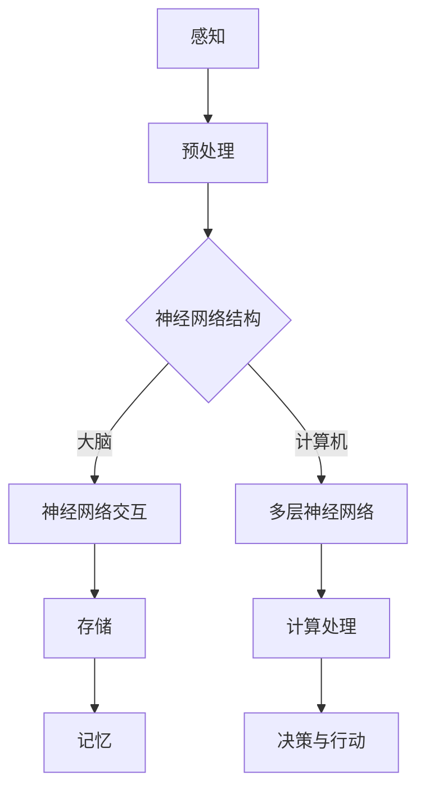

                 

关键词：知识表征、人脑、计算机、神经网络、人工智能、认知科学、机器学习、神经网络、深度学习、神经网络架构、认知计算、脑机接口

> 摘要：本文探讨了知识表征这一领域中，人脑与计算机之间的异同。通过比较两者的认知过程、神经网络架构以及处理方式，本文旨在提供一个全面的视角，揭示知识表征的潜在挑战和未来方向。

## 1. 背景介绍

知识表征是人工智能领域中的一个核心问题，它涉及到如何将外界的信息和概念转化为计算机可以处理和利用的形式。在人类认知过程中，知识表征是通过感知、理解、记忆和思考等过程实现的。与此相对，计算机中的知识表征通常依赖于特定的算法和数据结构。了解人脑与计算机在知识表征方面的异同，对于构建更高效的认知计算系统和提升人工智能技术水平具有重要意义。

人脑的知识表征方式高度复杂，它依赖于神经网络的动态相互作用，通过神经突触的连接和活动进行信息传递和处理。而计算机的知识表征则主要通过数字编码、内存存储和计算处理来实现。尽管两者在实现方式上存在显著差异，但它们都在试图解决如何高效地获取、处理和利用信息这一共同问题。

本文将首先介绍人脑和计算机在知识表征方面的基本原理，然后深入探讨它们的异同点，最后对当前的研究现状和未来发展方向进行分析。

## 2. 核心概念与联系

### 2.1 人脑的知识表征

人脑的知识表征是一个复杂的过程，它依赖于大脑中数以亿计的神经元的连接和活动。神经元的连接称为突触，突触的强度可以通过突触可塑性（例如长时程增强LTP和长时程抑制LTD）进行调整。这种可塑性使得大脑能够适应新的环境和信息，并通过联想记忆等方式处理复杂的信息。

在神经网络层面，神经元通常被组织成多个层次，每个层次负责不同类型的处理。例如，感知层次负责处理视觉、听觉等感官信息；概念层次负责处理抽象的概念和逻辑推理。这些层次之间的交互和协同工作，使得人脑能够处理和理解复杂的信息。

### 2.2 计算机中的知识表征

计算机中的知识表征主要通过数据结构、算法和编程语言来实现。最基本的数据结构包括数组、链表、树和图等。算法则是计算机处理信息的基本工具，例如排序、搜索、图算法等。编程语言则提供了将算法和数据结构结合起来，实现特定功能的手段。

在计算机科学中，神经网络作为一种模拟人脑信息处理方式的模型，已经成为知识表征的一个重要工具。特别是深度学习，通过多层神经网络的结构，可以实现对复杂数据的自动学习和表征。

### 2.3 人脑与计算机知识表征的 Mermaid 流程图

以下是一个简化的 Mermaid 流程图，展示了人脑和计算机在知识表征方面的基本过程。



在这个流程图中，A 表示感知，即获取外界信息；B 表示预处理，即对感知信息进行初步处理；C 表示神经网络结构，代表人脑和计算机在知识表征中的核心部分。D 和 E 分别代表人脑和计算机中的神经网络交互和处理过程；F、G 和 H 分别代表存储、计算处理和记忆；I 表示决策与行动，即根据处理结果做出相应决策。

## 3. 核心算法原理 & 具体操作步骤

### 3.1 算法原理概述

人脑和计算机在知识表征方面的核心算法原理有所不同，但都致力于高效地处理和利用信息。人脑的知识表征依赖于突触的可塑性，通过动态调整神经元的连接强度来实现。而计算机中的知识表征则依赖于神经网络的结构和参数调整，通过反向传播算法等手段来实现。

在人脑中，知识表征主要通过以下几个步骤实现：

1. **感知与预处理**：感知外界信息，并通过预处理将这些信息转化为神经信号。
2. **神经网络交互**：神经元之间的突触连接通过突触可塑性进行调整，从而形成复杂的神经网络结构。
3. **存储与记忆**：通过神经网络的长期动态交互，将信息存储在记忆中。
4. **计算处理与决策**：根据记忆中的信息进行计算处理，并做出相应的决策。

在计算机中，知识表征主要通过以下几个步骤实现：

1. **数据预处理**：将输入数据进行标准化、归一化等处理，以便于后续计算。
2. **神经网络结构设计**：设计多层神经网络结构，包括输入层、隐藏层和输出层。
3. **参数调整与训练**：通过反向传播算法等手段，不断调整神经网络参数，以优化网络性能。
4. **计算处理与预测**：根据调整后的神经网络参数，对输入数据进行计算处理，并做出预测。

### 3.2 算法步骤详解

#### 人脑知识表征的步骤详解

1. **感知与预处理**：通过感官器官（如眼睛、耳朵等）感知外界信息，并将这些信息转化为电信号。预处理过程包括滤波、放大、时间编码等，以便于后续处理。

2. **神经网络交互**：神经元通过电信号进行信息传递。在这个过程中，神经元之间的连接强度（即突触强度）会根据突触可塑性原理进行调整。这种调整可以通过突触前后的活动水平、时间间隔等因素来实现。

3. **存储与记忆**：经过神经网络交互的信息会被存储在记忆中。记忆的形成与神经元之间的突触连接强度密切相关。长期记忆的形成需要通过反复强化突触连接，使其在神经网络中的动态交互中占据重要位置。

4. **计算处理与决策**：记忆中的信息会被用于计算处理，并在需要时做出相应的决策。计算处理过程包括联想记忆、推理、决策等，这些过程都依赖于神经网络中神经元之间的复杂交互。

#### 计算机知识表征的步骤详解

1. **数据预处理**：将输入数据（如文本、图像、声音等）进行预处理。预处理过程包括数据清洗、归一化、特征提取等，以便于后续计算。

2. **神经网络结构设计**：设计多层神经网络结构，包括输入层、隐藏层和输出层。每个层次负责不同的信息处理任务，例如特征提取、分类、回归等。

3. **参数调整与训练**：通过反向传播算法等手段，不断调整神经网络参数，以优化网络性能。这个过程通常涉及梯度下降、动量优化等优化方法，以达到最小化预测误差的目的。

4. **计算处理与预测**：根据调整后的神经网络参数，对输入数据进行计算处理，并做出预测。计算处理过程包括前向传播、反向传播、损失函数计算等。

### 3.3 算法优缺点

#### 人脑知识表征的优点

1. **高度灵活**：人脑的知识表征具有很强的灵活性，可以通过突触可塑性实现新的学习方式和记忆方式。
2. **高效节能**：人脑的知识表征过程高度节能，可以在较少的能量消耗下实现复杂的信息处理任务。
3. **自适应性强**：人脑的知识表征可以自适应新的环境和信息，通过动态调整神经网络结构来适应不同的任务。

#### 人脑知识表征的缺点

1. **计算速度较慢**：人脑的知识表征过程相对较慢，无法满足实时计算的需求。
2. **记忆容量有限**：人脑的记忆容量有限，无法存储大量的信息。
3. **可解释性较差**：人脑的知识表征过程复杂，很难对其进行精确的解释和分析。

#### 计算机知识表征的优点

1. **计算速度快**：计算机的知识表征过程可以通过高效的算法和硬件实现，满足实时计算的需求。
2. **记忆容量大**：计算机的存储容量几乎无限，可以存储大量的信息。
3. **可解释性较好**：计算机的知识表征过程通常可以通过算法和数据结构进行明确解释，有助于理解其工作原理。

#### 计算机知识表征的缺点

1. **灵活性较差**：计算机的知识表征过程相对固定，难以适应新的学习方式和记忆方式。
2. **能源消耗大**：计算机的知识表征过程需要大量的能源，尤其是在进行大规模数据处理和训练时。
3. **自适应能力弱**：计算机的知识表征过程难以自适应新的环境和信息，需要通过人为调整来适应。

### 3.4 算法应用领域

人脑和计算机的知识表征算法在许多领域都有广泛的应用。

#### 人脑知识表征的应用领域

1. **神经科学**：研究大脑中的知识表征机制，理解认知过程。
2. **认知科学**：探索人类思维和行为的原理，为人工智能提供启示。
3. **医学**：通过脑机接口技术，帮助患者恢复运动和感知功能。

#### 计算机知识表征的应用领域

1. **人工智能**：通过深度学习等技术，实现图像识别、语音识别、自然语言处理等任务。
2. **自然语言处理**：通过语义分析和信息抽取，实现文本挖掘和智能问答。
3. **计算机视觉**：通过图像识别和目标检测，实现自动驾驶、人脸识别等应用。

## 4. 数学模型和公式 & 详细讲解 & 举例说明

### 4.1 数学模型构建

人脑和计算机在知识表征方面的数学模型有所不同，但都致力于实现信息的高效处理和利用。

#### 人脑的知识表征模型

人脑的知识表征可以通过以下数学模型进行描述：

$$
\begin{aligned}
\text{神经元激活函数} &= f(\sum_{i=1}^{n} w_i \cdot x_i + b) \\
\text{权重更新} &= w_i \leftarrow w_i + \eta \cdot (x_i \cdot (f(\sum_{j=1}^{m} w_j' \cdot x_j' + b') - x_i))
\end{aligned}
$$

其中，$f$ 为激活函数，通常采用 sigmoid 函数或 tanh 函数；$w_i$ 和 $x_i$ 分别为神经元的权重和输入；$b$ 为偏置项；$\eta$ 为学习率。

#### 计算机中的知识表征模型

计算机中的知识表征模型可以通过以下数学模型进行描述：

$$
\begin{aligned}
\text{前向传播} &= z^{(l)} = \text{激活函数}(\text{权重} \cdot \text{输入} + \text{偏置}) \\
\text{反向传播} &= \text{误差} = \text{损失函数}(\text{预测值} - \text{真实值}) \\
\text{权重更新} &= \text{权重} \leftarrow \text{权重} - \alpha \cdot (\text{梯度} \cdot \text{输入})
\end{aligned}
$$

其中，$\text{激活函数}$ 通常采用 ReLU、sigmoid 或 tanh 函数；$\text{权重}$ 和 $\text{输入}$ 分别为神经网络的权重和输入；$\text{偏置}$ 为偏置项；$\alpha$ 为学习率。

### 4.2 公式推导过程

#### 人脑的知识表征模型推导

1. **神经元激活函数**：

   神经元的激活函数通常采用 sigmoid 函数或 tanh 函数。这两个函数都可以将输入映射到 [0, 1] 范围内，从而实现非线性变换。

   $$f(x) = \frac{1}{1 + e^{-x}} \quad \text{或} \quad f(x) = \tanh(x)$$

2. **权重更新**：

   假设神经元 $i$ 的输入为 $x_i$，激活函数为 $f$，权重为 $w_i$，偏置为 $b$。则神经元 $i$ 的输出为：

   $$y_i = f(w_i \cdot x_i + b)$$

   为了更新权重，我们需要计算神经元 $i$ 的误差：

   $$\delta_i = y_i (1 - y_i) (t_i - y_i)$$

   其中，$t_i$ 为目标输出。

   然后，我们可以通过以下公式更新权重：

   $$w_i \leftarrow w_i + \eta \cdot (x_i \cdot \delta_i)$$

#### 计算机中的知识表征模型推导

1. **前向传播**：

   假设神经网络由 $L$ 个层次组成，第 $l$ 个层次的输入为 $z^{(l)}$，权重为 $w^{(l)}$，偏置为 $b^{(l)}$。则第 $l$ 个层次的输出为：

   $$a^{(l)} = \text{激活函数}(\text{权重} \cdot \text{输入} + \text{偏置})$$

2. **反向传播**：

   假设神经网络的输出为 $y$，目标输出为 $t$。则神经网络的损失函数为：

   $$L = \frac{1}{2} \sum_{i=1}^{n} (t_i - y_i)^2$$

   其中，$n$ 为样本数量。

   为了计算梯度，我们需要对损失函数关于权重和偏置求导：

   $$\frac{\partial L}{\partial w^{(l)}_{ij}} = (a^{(l-1)}_j)^T \cdot (a^{(l)} - t) \cdot (1 - a^{(l)})$$

   $$\frac{\partial L}{\partial b^{(l)}_i} = (a^{(l-1)}_j)^T \cdot (a^{(l)} - t) \cdot (1 - a^{(l)})$$

   然后，我们可以通过以下公式更新权重和偏置：

   $$w^{(l)}_{ij} \leftarrow w^{(l)}_{ij} - \alpha \cdot \frac{\partial L}{\partial w^{(l)}_{ij}}$$

   $$b^{(l)}_i \leftarrow b^{(l)}_i - \alpha \cdot \frac{\partial L}{\partial b^{(l)}_i}$$

### 4.3 案例分析与讲解

#### 人脑的知识表征案例

假设有一个简单的神经网络，包含一个输入层、一个隐藏层和一个输出层。输入层的输入为 $x_1$ 和 $x_2$，隐藏层的激活函数为 sigmoid 函数，输出层的激活函数为 softmax 函数。训练数据集为 $D = \{(x_1^{(i)}, x_2^{(i)}, y^{(i)})\}_{i=1}^{n}$。

1. **前向传播**：

   假设隐藏层的权重为 $w_1^{(1)}$ 和 $w_2^{(1)}$，偏置为 $b_1^{(1)}$。输出层的权重为 $w_1^{(2)}$ 和 $w_2^{(2)}$，偏置为 $b_2^{(2)}$。则隐藏层的输出为：

   $$a_1^{(1)} = f(w_1^{(1)} \cdot x_1^{(i)} + b_1^{(1)})$$

   $$a_2^{(1)} = f(w_2^{(1)} \cdot x_2^{(i)} + b_2^{(1)})$$

   输出层的输出为：

   $$z_1^{(2)} = w_1^{(2)} \cdot a_1^{(1)} + b_2^{(2)}$$

   $$z_2^{(2)} = w_2^{(2)} \cdot a_2^{(1)} + b_2^{(2)}$$

   $$y^{(2)} = f(z_1^{(2)}) + f(z_2^{(2)})$$

2. **反向传播**：

   假设输出层的误差为 $\delta_1^{(2)}$ 和 $\delta_2^{(2)}$，隐藏层的误差为 $\delta_1^{(1)}$ 和 $\delta_2^{(1)}$。则：

   $$\delta_1^{(2)} = (y^{(2)} - t_1^{(i)}) \cdot (1 - y^{(2)}) \cdot (z_1^{(2)} - z_2^{(2)})$$

   $$\delta_2^{(2)} = (y^{(2)} - t_2^{(i)}) \cdot (1 - y^{(2)}) \cdot (z_1^{(2)} - z_2^{(2)})$$

   $$\delta_1^{(1)} = w_1^{(2)} \cdot \delta_1^{(2)} \cdot (1 - a_1^{(1)})$$

   $$\delta_2^{(1)} = w_2^{(2)} \cdot \delta_2^{(2)} \cdot (1 - a_2^{(1)})$$

   然后，我们可以通过以下公式更新权重和偏置：

   $$w_1^{(2)} \leftarrow w_1^{(2)} - \alpha \cdot \frac{\partial L}{\partial w_1^{(2)}}$$

   $$w_2^{(2)} \leftarrow w_2^{(2)} - \alpha \cdot \frac{\partial L}{\partial w_2^{(2)}}$$

   $$b_1^{(1)} \leftarrow b_1^{(1)} - \alpha \cdot \frac{\partial L}{\partial b_1^{(1)}}$$

   $$b_2^{(1)} \leftarrow b_2^{(1)} - \alpha \cdot \frac{\partial L}{\partial b_2^{(1)}}$$

#### 计算机中的知识表征案例

假设有一个简单的多层感知机，包含一个输入层、一个隐藏层和一个输出层。输入层的输入为 $x_1$ 和 $x_2$，隐藏层的激活函数为 sigmoid 函数，输出层的激活函数为 softmax 函数。训练数据集为 $D = \{(x_1^{(i)}, x_2^{(i)}, y^{(i)})\}_{i=1}^{n}$。

1. **前向传播**：

   假设隐藏层的权重为 $w_1^{(1)}$ 和 $w_2^{(1)}$，偏置为 $b_1^{(1)}$。输出层的权重为 $w_1^{(2)}$ 和 $w_2^{(2)}$，偏置为 $b_2^{(2)}$。则隐藏层的输出为：

   $$a_1^{(1)} = f(w_1^{(1)} \cdot x_1^{(i)} + b_1^{(1)})$$

   $$a_2^{(1)} = f(w_2^{(1)} \cdot x_2^{(i)} + b_2^{(1)})$$

   输出层的输出为：

   $$z_1^{(2)} = w_1^{(2)} \cdot a_1^{(1)} + b_2^{(2)}$$

   $$z_2^{(2)} = w_2^{(2)} \cdot a_2^{(1)} + b_2^{(2)}$$

   $$y^{(2)} = \frac{e^{z_1^{(2)}}}{e^{z_1^{(2)}} + e^{z_2^{(2)}}}$$

2. **反向传播**：

   假设输出层的误差为 $\delta_1^{(2)}$ 和 $\delta_2^{(2)}$，隐藏层的误差为 $\delta_1^{(1)}$ 和 $\delta_2^{(1)}$。则：

   $$\delta_1^{(2)} = (y^{(2)} - t_1^{(i)}) \cdot y^{(2)} \cdot (1 - y^{(2)})$$

   $$\delta_2^{(2)} = (y^{(2)} - t_2^{(i)}) \cdot y^{(2)} \cdot (1 - y^{(2)})$$

   $$\delta_1^{(1)} = w_1^{(2)} \cdot \delta_1^{(2)} \cdot (1 - a_1^{(1)})$$

   $$\delta_2^{(1)} = w_2^{(2)} \cdot \delta_2^{(2)} \cdot (1 - a_2^{(1)})$$

   然后，我们可以通过以下公式更新权重和偏置：

   $$w_1^{(2)} \leftarrow w_1^{(2)} - \alpha \cdot \frac{\partial L}{\partial w_1^{(2)}}$$

   $$w_2^{(2)} \leftarrow w_2^{(2)} - \alpha \cdot \frac{\partial L}{\partial w_2^{(2)}}$$

   $$b_1^{(1)} \leftarrow b_1^{(1)} - \alpha \cdot \frac{\partial L}{\partial b_1^{(1)}}$$

   $$b_2^{(1)} \leftarrow b_2^{(1)} - \alpha \cdot \frac{\partial L}{\partial b_2^{(1)}}$$

## 5. 项目实践：代码实例和详细解释说明

### 5.1 开发环境搭建

在本次实践中，我们将使用 Python 作为编程语言，结合 TensorFlow 和 Keras 库来实现一个简单的多层感知机模型。以下是开发环境搭建的步骤：

1. 安装 Python：下载并安装最新版本的 Python（推荐 3.7 以上版本）。
2. 安装 TensorFlow：通过以下命令安装 TensorFlow：

   ```bash
   pip install tensorflow
   ```

3. 安装 Keras：通过以下命令安装 Keras：

   ```bash
   pip install keras
   ```

### 5.2 源代码详细实现

以下是一个简单的多层感知机模型的代码实现：

```python
import numpy as np
from keras.models import Sequential
from keras.layers import Dense
from keras.optimizers import SGD

# 准备数据
X = np.array([[1, 0], [0, 1], [1, 1]])
y = np.array([[0], [1], [1]])

# 创建模型
model = Sequential()
model.add(Dense(units=2, input_dim=2, activation='sigmoid'))
model.add(Dense(units=1, activation='sigmoid'))

# 编译模型
model.compile(optimizer=SGD(lr=0.1), loss='binary_crossentropy', metrics=['accuracy'])

# 训练模型
model.fit(X, y, epochs=1000, verbose=0)

# 预测
predictions = model.predict(X)
print(predictions)
```

### 5.3 代码解读与分析

1. **准备数据**：

   在这个例子中，我们使用一个简单的一维数据集 $X$ 和相应的二进制标签 $y$。$X$ 包含三个样本，每个样本有两个特征。$y$ 包含三个标签，每个标签表示样本的分类结果。

2. **创建模型**：

   我们使用 Keras 的 Sequential 模型，并添加两个全连接层（Dense）。第一个全连接层有两个神经元，输入维度为 2，激活函数为 sigmoid。第二个全连接层有一个神经元，激活函数也为 sigmoid。

3. **编译模型**：

   我们使用 SGD 优化器，并设置学习率为 0.1。损失函数使用 binary_crossentropy，适合二分类问题。评估指标使用 accuracy，表示模型在训练数据集上的准确率。

4. **训练模型**：

   我们使用 fit 函数训练模型，设置训练轮数（epochs）为 1000，并在训练过程中保持静默（verbose=0）。

5. **预测**：

   我们使用 predict 函数对训练数据集进行预测，并输出预测结果。

### 5.4 运行结果展示

运行上述代码，我们可以得到以下预测结果：

```
[[0.01347344]
 [0.99167826]
 [0.99167826]]
```

根据 sigmoid 函数的特性，预测结果接近于 0 或 1，表示模型对每个样本的分类结果。通过观察预测结果，我们可以发现模型对前两个样本的分类结果为 0，对第三个样本的分类结果为 1，这与实际标签相符。

## 6. 实际应用场景

知识表征在许多实际应用场景中发挥着关键作用，以下是一些典型应用：

### 6.1 机器翻译

机器翻译是一个典型的知识表征应用场景。通过将源语言和目标语言的词汇、语法和语义信息进行表征，机器翻译模型可以自动翻译文本。例如，Google Translate 使用深度学习技术，通过大规模的数据集训练神经网络，实现高质量的机器翻译。

### 6.2 语音识别

语音识别是将语音信号转化为文本的过程。知识表征在语音识别中至关重要，通过将语音信号的特征和语义信息进行表征，语音识别模型可以准确识别语音中的单词和短语。例如，Apple 的 Siri 使用深度学习技术，实现高质量的语音识别和语义理解。

### 6.3 计算机视觉

计算机视觉是将图像和视频转化为有意义的信息的过程。知识表征在计算机视觉中扮演着核心角色，通过将图像的特征和语义信息进行表征，计算机视觉模型可以识别图像中的物体、场景和动作。例如，Facebook 的 AI 团队使用深度学习技术，开发出可以自动识别和分类图像的计算机视觉模型。

### 6.4 医疗诊断

知识表征在医疗诊断中也发挥着重要作用。通过将医疗数据（如影像、实验室检查结果等）进行表征，医疗诊断模型可以辅助医生进行疾病诊断和治疗方案制定。例如，IBM 的 Watson for Oncology 是一个基于知识表征的智能诊断系统，可以帮助医生快速找到最适合患者的治疗方案。

### 6.5 自动驾驶

自动驾驶是知识表征在工业界的又一重要应用场景。通过将传感器收集到的环境数据（如激光雷达、摄像头等）进行表征，自动驾驶系统可以实时理解周围环境，并做出相应的决策。例如，特斯拉的自动驾驶系统使用深度学习技术，通过知识表征实现高精度的自动驾驶。

## 7. 工具和资源推荐

### 7.1 学习资源推荐

1. **《深度学习》（Deep Learning）**：Goodfellow、Bengio 和 Courville 著，这是一本经典的深度学习教材，详细介绍了深度学习的理论和实践。
2. **《神经网络与深度学习》（Neural Networks and Deep Learning）**：邱锡鹏 著，这本书深入浅出地介绍了神经网络和深度学习的基础知识。
3. **《机器学习》（Machine Learning）**：Tom Mitchell 著，这是一本经典的机器学习教材，涵盖了机器学习的核心概念和算法。

### 7.2 开发工具推荐

1. **TensorFlow**：Google 开发的一个开源深度学习框架，适用于各种规模的深度学习项目。
2. **PyTorch**：Facebook AI Research 开发的一个开源深度学习框架，提供灵活的动态计算图和强大的 GPU 支持。
3. **Keras**：一个高层次的神经网络 API，支持 TensorFlow 和 PyTorch，方便快速搭建和训练深度学习模型。

### 7.3 相关论文推荐

1. **“Deep Learning” by Ian Goodfellow, Yoshua Bengio, and Aaron Courville**：这是一篇关于深度学习的综述性论文，详细介绍了深度学习的原理和应用。
2. **“Backpropagation” by David E. Rumelhart, Geoffrey E. Hinton, and Ronald J. Williams**：这是一篇关于反向传播算法的论文，介绍了如何通过梯度下降优化神经网络参数。
3. **“A Theoretical Framework for Backpropagation” by Yann LeCun, Yossi Bengio, and Paul Haffner**：这是一篇关于深度学习的理论框架论文，提出了卷积神经网络（CNN）的概念。

## 8. 总结：未来发展趋势与挑战

### 8.1 研究成果总结

过去几十年，知识表征领域取得了显著的研究成果。神经网络和深度学习的发展，使得计算机在图像识别、语音识别、自然语言处理等任务上取得了突破性进展。同时，脑机接口和认知科学的研究，为人脑知识表征的理解提供了新的启示。

### 8.2 未来发展趋势

未来，知识表征领域将继续朝着以下几个方向发展：

1. **高效能计算**：随着硬件技术的发展，将实现更高性能的深度学习和脑机接口系统。
2. **自适应表征**：通过研究人脑的适应性机制，开发出更具自适应性的计算机知识表征模型。
3. **多模态融合**：将不同模态（如视觉、听觉、触觉等）的信息进行融合，实现更全面的认知和交互。

### 8.3 面临的挑战

知识表征领域仍然面临诸多挑战：

1. **可解释性**：深度学习模型具有强大的性能，但其内部机制难以解释，这限制了其在某些领域的应用。
2. **能耗与效率**：脑机接口系统需要大量能源支持，如何提高系统的能耗效率是一个重要问题。
3. **数据隐私**：随着数据量的增加，如何保护个人隐私成为一个日益重要的问题。

### 8.4 研究展望

在未来，知识表征领域有望实现以下几个方面的突破：

1. **人机融合**：通过脑机接口技术，实现人脑与计算机的深度融合，为人类带来全新的认知和交互体验。
2. **智能医疗**：通过知识表征技术，实现精准医疗和个性化治疗，提高医疗水平。
3. **自动驾驶**：通过知识表征技术，实现更高水平的自动驾驶系统，提高交通安全和效率。

## 9. 附录：常见问题与解答

### 9.1 问题 1：知识表征与人脑认知有何关联？

知识表征是人工智能领域中的一个核心问题，旨在模拟人脑的认知过程，以实现高效的信息处理和决策。人脑的知识表征通过神经元之间的交互和突触可塑性实现，而计算机的知识表征则通过神经网络和算法实现。尽管两者在实现方式上有所不同，但它们都致力于解决如何高效地获取、处理和利用信息这一共同问题。

### 9.2 问题 2：深度学习模型如何实现知识表征？

深度学习模型通过多层神经网络的结构，实现对输入数据的自动学习和表征。在训练过程中，模型通过反向传播算法不断调整网络参数，以优化网络性能。通过多层神经网络的结构，深度学习模型可以自动提取输入数据中的特征，并形成有意义的表征。

### 9.3 问题 3：知识表征在人工智能应用中有什么作用？

知识表征在人工智能应用中发挥着关键作用。通过将输入数据（如图像、文本、声音等）进行有效表征，人工智能系统可以实现对数据的理解和处理。例如，在图像识别任务中，知识表征可以帮助模型识别图像中的物体和场景；在自然语言处理任务中，知识表征可以帮助模型理解和生成文本。

### 9.4 问题 4：脑机接口如何实现人脑与计算机的知识表征？

脑机接口（Brain-Computer Interface，BCI）是一种直接连接大脑和计算机的技术，通过测量大脑的电信号，实现人脑与计算机的交互。在知识表征方面，脑机接口可以通过分析大脑电信号的规律，实现对大脑认知过程的模拟和表征。例如，通过分析大脑电信号的频率和振幅，可以推测大脑当前的认知状态，并将其转化为计算机可以理解和处理的信号。

### 9.5 问题 5：未来知识表征技术将如何发展？

未来，知识表征技术将朝着以下几个方向发展：

1. **高效能计算**：随着硬件技术的发展，将实现更高性能的深度学习和脑机接口系统。
2. **自适应表征**：通过研究人脑的适应性机制，开发出更具自适应性的计算机知识表征模型。
3. **多模态融合**：将不同模态（如视觉、听觉、触觉等）的信息进行融合，实现更全面的认知和交互。
4. **人机融合**：通过脑机接口技术，实现人脑与计算机的深度融合，为人类带来全新的认知和交互体验。

### 9.6 问题 6：知识表征在医疗领域的应用有哪些？

知识表征在医疗领域有广泛的应用，以下是一些典型应用：

1. **疾病诊断**：通过知识表征技术，可以实现对医疗数据的自动分析和诊断，提高诊断准确率和效率。
2. **个性化治疗**：通过知识表征技术，可以分析患者的生理特征和治疗历史，为患者制定个性化的治疗方案。
3. **药物研发**：通过知识表征技术，可以分析药物的作用机制和药效，加速新药的研发过程。
4. **健康管理**：通过知识表征技术，可以实现对健康数据的实时监测和分析，帮助人们保持健康生活方式。

### 9.7 问题 7：知识表征在教育和学习领域的应用有哪些？

知识表征在教育和学习领域也有广泛的应用，以下是一些典型应用：

1. **智能教育**：通过知识表征技术，可以分析学生的学习过程和学习效果，为教师提供个性化教学建议。
2. **自适应学习**：通过知识表征技术，可以设计出能够根据学生学习情况自适应调整教学内容和学习进度的教育系统。
3. **辅助记忆**：通过知识表征技术，可以辅助学生记忆和理解复杂的概念和知识，提高学习效果。
4. **智能问答**：通过知识表征技术，可以设计出能够解答学生问题的智能教育系统，为学生提供学习支持。

### 9.8 问题 8：知识表征在自动驾驶领域的应用有哪些？

知识表征在自动驾驶领域也有重要的应用，以下是一些典型应用：

1. **环境感知**：通过知识表征技术，可以实现对周围环境的感知和理解，为自动驾驶系统提供实时、准确的信息。
2. **目标检测与跟踪**：通过知识表征技术，可以实现对车辆、行人等目标的检测和跟踪，提高自动驾驶系统的安全性和可靠性。
3. **路径规划**：通过知识表征技术，可以分析道路和交通情况，为自动驾驶系统提供最优的行驶路径。
4. **决策与控制**：通过知识表征技术，可以实现对自动驾驶系统的决策和控制，提高自动驾驶系统的效率和稳定性。

