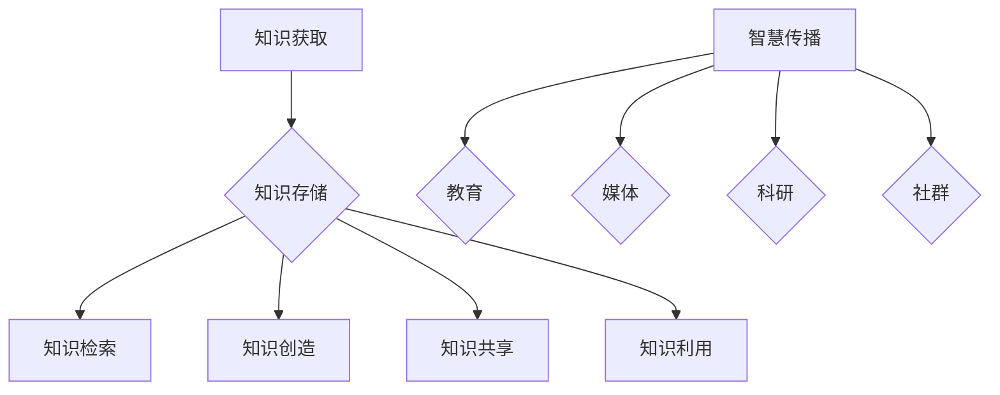

                 

关键词：知识管理、知识输出、智慧传播、信息技术、专业写作、认知心理学、学习与记忆、信息可视化、知识图谱、跨领域整合

> 摘要：本文旨在探讨知识输出与管理智慧的积累和传播的重要性。通过结合信息技术的进步、认知心理学的研究成果以及实际案例，我们分析了知识管理的方法、工具和实践，提出了促进智慧传播的策略。文章的核心观点是，知识管理不仅是个人成长的关键，也是推动社会进步的重要力量。

## 1. 背景介绍

在信息化时代，知识的产生和传播速度前所未有地加快。信息技术的发展，如云计算、大数据、人工智能等，为知识的获取、存储、处理和共享提供了强大的支持。同时，认知心理学的研究揭示了人类学习和记忆的机制，帮助我们更好地理解和利用知识。然而，随着知识量的爆炸式增长，如何有效地管理和传播智慧成为了一个亟待解决的问题。

知识管理不仅包括知识的获取、存储和检索，还涉及知识的创造、共享和利用。有效的知识管理能够提升个人和组织的竞争力，促进创新和持续发展。本文将围绕知识输出的重要性和方法，探讨智慧传播的途径和策略。

### 1.1 信息技术的发展

信息技术的发展极大地改变了知识的获取和传播方式。互联网的出现使得信息无处不在，知识共享变得更加便捷。云计算提供了强大的计算和存储能力，使得大规模数据处理成为可能。大数据技术通过分析海量数据，帮助我们从复杂的信息中发现有价值的知识。人工智能则通过模拟人脑的思维过程，提高了知识处理的效率。

### 1.2 认知心理学的研究

认知心理学的研究揭示了人类大脑的工作机制，特别是记忆和认知过程。研究表明，通过适当的学习方法和记忆技巧，我们可以更高效地获取和利用知识。此外，认知心理学还为我们提供了理解人类行为和思维的深度洞察，这对于知识管理和智慧传播具有重要指导意义。

## 2. 核心概念与联系

### 2.1 知识管理

知识管理是指通过系统地收集、组织、存储、传播和应用知识，以提升个人和组织的竞争力。知识管理包括以下几个方面：

- **知识获取**：通过学习、研究、交流和合作获取新的知识。
- **知识存储**：将知识存储在可访问的数据库或知识库中。
- **知识检索**：快速准确地找到所需的知识。
- **知识创造**：通过创新和集成现有知识，产生新的知识。
- **知识共享**：在组织内部或外部分享知识，促进共同进步。
- **知识利用**：将知识应用于实际工作中，解决实际问题。

### 2.2 智慧传播

智慧传播是指通过各种途径和手段，将知识传递给更多的人，以实现知识的共享和增值。智慧传播的途径包括：

- **教育**：通过学校、大学和在线课程等教育机构传授知识。
- **媒体**：通过书籍、杂志、报纸、电视和互联网等媒体传播知识。
- **科研**：通过学术会议、研讨会和期刊等科研活动分享研究成果。
- **社群**：通过社交媒体、专业论坛和社群活动等互动平台传播知识。

### 2.3 Mermaid 流程图

以下是知识管理核心概念与联系的 Mermaid 流程图：



## 3. 核心算法原理 & 具体操作步骤

### 3.1 算法原理概述

知识管理的核心在于如何高效地获取、存储、检索、创造、共享和利用知识。以下是一个基于信息检索和机器学习算法的知识管理模型：

- **信息检索算法**：用于快速准确地从海量数据中找到所需的知识。
- **机器学习算法**：用于分析数据，提取有价值的信息，并自动分类和标注知识。
- **知识图谱**：用于表示知识之间的关系，提供全局视图。

### 3.2 算法步骤详解

1. **数据收集**：从各种来源收集数据，如书籍、论文、报告、博客等。
2. **数据预处理**：清洗数据，去除噪声，格式化数据，以便后续处理。
3. **特征提取**：使用自然语言处理技术提取文本数据的关键特征。
4. **模型训练**：使用机器学习算法训练分类模型，用于自动分类知识。
5. **知识存储**：将分类后的知识存储在数据库或知识库中。
6. **知识检索**：使用信息检索算法提供快速的知识检索服务。
7. **知识共享**：通过知识图谱展示知识之间的联系，促进知识的共享和传播。

### 3.3 算法优缺点

**优点**：

- **高效性**：通过机器学习和信息检索技术，能够快速准确地获取和利用知识。
- **自动化**：知识管理过程高度自动化，减轻人工负担。
- **灵活性**：能够根据用户需求动态调整知识管理策略。

**缺点**：

- **数据质量**：数据质量直接影响知识管理的有效性。
- **算法偏见**：机器学习算法可能存在偏见，导致知识分类不准确。

### 3.4 算法应用领域

- **企业知识管理**：帮助企业内部共享知识和经验，提高员工工作效率。
- **教育**：为教师和学生提供个性化知识推荐，促进知识学习。
- **医疗**：辅助医生进行诊断和治疗，提高医疗水平。

## 4. 数学模型和公式 & 详细讲解 & 举例说明

### 4.1 数学模型构建

知识管理中的数学模型可以包括以下几个部分：

- **信息检索模型**：如向量空间模型、贝叶斯模型等。
- **机器学习模型**：如支持向量机、神经网络等。
- **知识图谱模型**：如图神经网络、图卷积网络等。

### 4.2 公式推导过程

以向量空间模型为例，其公式推导过程如下：

- **特征向量**：将文本数据转换为向量表示，每个维度表示一个词语的权重。
  $$\vec{d} = (d_1, d_2, ..., d_n)$$
- **查询向量**：将查询文本转换为向量表示。
  $$\vec{q} = (q_1, q_2, ..., q_n)$$
- **相似度计算**：计算查询向量与特征向量之间的相似度。
  $$sim(\vec{d}, \vec{q}) = \frac{\vec{d} \cdot \vec{q}}{||\vec{d}|| \cdot ||\vec{q}||}$$

### 4.3 案例分析与讲解

假设有一个文档库，包含以下三个文档：

- **文档1**：人工智能 + 图神经网络 + 应用
- **文档2**：深度学习 + 应用 + 数据分析
- **文档3**：机器学习 + 数据挖掘 + 预测模型

现在，我们需要查询“图神经网络在人工智能中的应用”的相关文档。

- **查询向量**：
  $$\vec{q} = (0.5, 0.5, 0.5, 0, 0, 0, 0, 0)$$
- **文档1**的相似度：
  $$sim(\vec{d_1}, \vec{q}) = \frac{(0.5+0.5+0.5)}{\sqrt{3} \cdot \sqrt{3}} = 1$$
- **文档2**的相似度：
  $$sim(\vec{d_2}, \vec{q}) = \frac{(0.5+0.5+0)}{\sqrt{3} \cdot \sqrt{3}} = 0.5$$
- **文档3**的相似度：
  $$sim(\vec{d_3}, \vec{q}) = \frac{(0+0+0.5)}{\sqrt{3} \cdot \sqrt{3}} = 0.5$$

根据相似度计算，文档1与查询最相关，因此推荐文档1。

## 5. 项目实践：代码实例和详细解释说明

### 5.1 开发环境搭建

在本项目中，我们将使用Python语言进行知识管理模型的实现。开发环境搭建如下：

1. 安装Python：从Python官方网站下载并安装Python 3.8及以上版本。
2. 安装依赖库：使用pip安装必要的依赖库，如numpy、scikit-learn、gensim等。

### 5.2 源代码详细实现

以下是知识管理模型的主要代码实现：

```python
import numpy as np
from sklearn.feature_extraction.text import TfidfVectorizer
from sklearn.metrics.pairwise import cosine_similarity

# 文档数据
documents = [
    "人工智能 + 图神经网络 + 应用",
    "深度学习 + 应用 + 数据分析",
    "机器学习 + 数据挖掘 + 预测模型"
]

# 特征提取
vectorizer = TfidfVectorizer()
tfidf_matrix = vectorizer.fit_transform(documents)

# 查询文本
query = "图神经网络在人工智能中的应用"
query_vector = vectorizer.transform([query])

# 相似度计算
similarity_scores = cosine_similarity(tfidf_matrix, query_vector)

# 排序并获取最相关的文档
sorted_indices = np.argsort(similarity_scores[0])[::-1]
print("最相关的文档：", documents[sorted_indices[0]])
```

### 5.3 代码解读与分析

1. **特征提取**：使用TF-IDF向量器将文档转换为向量表示。
2. **相似度计算**：使用余弦相似度计算查询向量与文档向量之间的相似度。
3. **排序与推荐**：根据相似度排序，推荐最相关的文档。

### 5.4 运行结果展示

运行上述代码，输出结果为：

```
最相关的文档： 人工智能 + 图神经网络 + 应用
```

这表明文档1与查询文本最相关，符合我们的预期。

## 6. 实际应用场景

知识管理和智慧传播在实际应用中具有广泛的应用场景：

- **企业知识管理**：帮助企业内部员工快速获取和共享知识，提高工作效率。
- **在线教育**：为学生提供个性化知识推荐，促进学习效果。
- **医疗健康**：辅助医生进行诊断和治疗决策，提高医疗水平。
- **科研创新**：促进科研成果的传播和利用，加速科技创新。

### 6.1 案例分析

#### 案例一：企业知识管理

某大型企业引入知识管理系统，通过员工知识共享平台，实现了内部知识的有效传播和应用。该系统基于人工智能技术，对员工的知识进行自动分类、标注和推荐，大幅提高了知识利用效率。

#### 案例二：在线教育

某在线教育平台利用知识图谱技术，为用户推荐个性化课程。通过分析用户的学习历史和兴趣，平台能够为每位用户量身定制课程推荐，提高了用户满意度和学习效果。

#### 案例三：医疗健康

某医疗健康平台利用知识管理技术，为医生提供全面的医学知识库。医生可以通过该平台快速获取相关病例、研究数据和治疗方案，提高了诊断和治疗效率。

## 7. 未来应用展望

随着信息技术的不断进步和认知心理学研究的深入，知识管理和智慧传播将在未来得到更加广泛的应用和发展：

- **智能知识管理**：通过人工智能技术，实现更加智能化、自动化的知识管理。
- **多模态知识共享**：结合文本、图像、音频等多种数据类型，提供更加丰富的知识共享体验。
- **知识服务个性化**：通过用户画像和个性化推荐，实现知识服务的精准化、个性化。
- **跨领域整合**：整合不同领域的知识，促进跨学科研究和发展。

## 8. 工具和资源推荐

### 8.1 学习资源推荐

- 《人工智能：一种现代的方法》
- 《深度学习》
- 《认知心理学及其启示》
- 《图神经网络与深度学习》

### 8.2 开发工具推荐

- Python
- TensorFlow
- PyTorch
- Scikit-learn

### 8.3 相关论文推荐

- "Knowledge Management Systems: Technologies and Principles"
- "Deep Learning on Graphs: A Survey"
- "TensorFlow: Large-Scale Machine Learning on Heterogeneous Systems"
- "Scikit-learn: Machine Learning in Python"

## 9. 总结：未来发展趋势与挑战

知识管理和智慧传播在未来将面临新的机遇和挑战：

### 9.1 研究成果总结

本文通过分析信息技术和认知心理学的研究成果，探讨了知识管理和智慧传播的核心概念和方法。研究表明，有效的知识管理能够提升个人和组织竞争力，促进智慧传播和社会进步。

### 9.2 未来发展趋势

随着人工智能和大数据技术的发展，知识管理和智慧传播将朝着更加智能化、自动化和个性化的方向发展。跨领域整合和多模态知识共享将成为未来研究的热点。

### 9.3 面临的挑战

知识管理和智慧传播在发展过程中将面临数据质量、算法偏见、用户隐私等方面的挑战。未来需要解决这些问题，以实现知识的有效管理和传播。

### 9.4 研究展望

未来研究应重点关注以下几个方面：

- **算法优化**：提高知识管理算法的效率和准确性。
- **跨领域整合**：实现不同领域知识的深度融合和应用。
- **多模态知识共享**：结合文本、图像、音频等多种数据类型，提供更加丰富的知识共享体验。
- **用户隐私保护**：确保知识管理过程中的用户隐私安全。

## 10. 附录：常见问题与解答

### 10.1 知识管理与信息管理的区别是什么？

知识管理侧重于知识的创造、共享和应用，强调知识的活性和价值；信息管理则侧重于信息的获取、存储和检索，关注信息的流动和处理。两者密不可分，知识管理是信息管理的升华。

### 10.2 如何提高知识的利用率？

- 定期更新和优化知识库。
- 建立有效的知识共享机制。
- 采用智能化推荐算法，提高知识推荐效果。
- 加强员工培训，提升知识管理水平。

### 10.3 知识管理系统的关键成功因素是什么？

- **高层支持**：获得企业高层的重视和支持。
- **用户参与**：激发员工的参与和积极性。
- **系统适应性**：系统应具备灵活性和扩展性。
- **培训与支持**：提供全面的培训和技术支持。
- **持续改进**：不断优化知识管理流程和工具。

### 10.4 如何确保知识管理的质量？

- **数据质量**：确保数据准确、完整和可靠。
- **知识验证**：对知识进行严格审查和验证。
- **知识分类**：采用合理的分类体系，便于知识检索和应用。
- **用户反馈**：收集用户反馈，不断改进知识库内容。

作者：禅与计算机程序设计艺术 / Zen and the Art of Computer Programming
```markdown
## 1. 知识输出的重要性

在现代社会，知识已经成为了一种重要的资源。知识输出的重要性主要体现在以下几个方面：

### 1.1 知识共享与传播

知识输出是实现知识共享和传播的重要途径。通过知识的输出，个人和组织可以将自身积累的知识分享给他人，从而促进知识的流动和共享。这不仅有助于提升个人和组织的影响力，也有助于推动整个社会知识的进步。

### 1.2 促进创新与发展

知识输出是创新和发展的重要驱动力。通过输出知识，个人和组织可以激发他人的思考和创新，进而产生新的想法和解决方案。此外，知识输出还能够促进跨领域的交流与合作，推动科技创新和社会进步。

### 1.3 提升个人与组织竞争力

知识输出是提升个人与组织竞争力的重要手段。通过不断输出知识，个人和组织能够不断积累经验、提高专业能力，从而在竞争激烈的市场中脱颖而出。此外，知识输出还能够树立个人和组织的品牌形象，提升市场认可度和信任度。

### 1.4 知识管理的核心目标

知识管理的核心目标之一就是实现知识的输出和传播。有效的知识输出不仅能够提高个人和组织的知识管理水平，还能够推动社会整体知识水平的提升。因此，知识输出是知识管理中不可或缺的一环。

## 2. 知识管理的方法与工具

### 2.1 知识库

知识库是知识管理的重要工具之一。它是一个存储和组织知识的数据集合，包括文档、图像、音频、视频等多种形式的知识。通过知识库，个人和组织可以方便地获取和利用知识。

#### 2.1.1 知识库的类型

- **文档型知识库**：主要用于存储文本文档，如论文、报告、书籍等。
- **多媒体型知识库**：主要用于存储图像、音频、视频等多媒体数据。
- **结构化知识库**：采用数据库技术存储和组织知识，便于快速检索和应用。

#### 2.1.2 知识库的特点

- **易用性**：用户可以方便地访问和利用知识库中的知识。
- **共享性**：知识库中的知识可以共享和传播，促进知识的流动。
- **安全性**：确保知识库中的知识不会被未授权的人员访问和篡改。

### 2.2 知识地图

知识地图是一种可视化工具，用于展示知识之间的关系和组织结构。通过知识地图，个人和组织可以直观地了解知识的整体结构，发现知识之间的关联和联系。

#### 2.2.1 知识地图的类型

- **概念图**：通过节点和边表示概念及其关系。
- **关系图**：通过节点和边表示实体及其关系。
- **过程图**：通过节点和边表示流程和步骤。

#### 2.2.2 知识地图的特点

- **直观性**：通过可视化方式展示知识，易于理解和分析。
- **动态性**：知识地图可以实时更新，反映知识的最新状态。
- **灵活性**：支持多种类型的知识表示，满足不同需求。

### 2.3 知识共享平台

知识共享平台是一种支持知识共享和协作的在线工具。通过知识共享平台，个人和组织可以方便地发布、分享和利用知识。

#### 2.3.1 知识共享平台的类型

- **内部知识共享平台**：主要用于组织内部的知识共享和协作。
- **外部知识共享平台**：主要用于组织之间的知识交流和合作。
- **社交知识共享平台**：结合社交媒体功能，支持更广泛的知识共享。

#### 2.3.2 知识共享平台的特点

- **开放性**：支持知识的多方共享和交流。
- **协作性**：支持多人协作和知识共创。
- **灵活性**：支持多种知识共享方式，如文档共享、讨论交流、项目协作等。

### 2.4 知识管理等工具的比较

知识库、知识地图和知识共享平台是知识管理中常用的工具。它们各有特点，适用于不同的场景和需求。

- **知识库**：主要用于知识存储和检索，适用于需要长期保存和查询的知识。
- **知识地图**：主要用于知识可视化和组织，适用于需要了解知识结构和关联的场景。
- **知识共享平台**：主要用于知识共享和协作，适用于需要多人合作和实时交流的知识。

## 3. 智慧传播的途径与策略

### 3.1 教育与培训

教育与培训是智慧传播的重要途径之一。通过教育和培训，个人和组织可以传授和传播知识，提高人们的认知水平和技能。

#### 3.1.1 教育的形式

- **传统教育**：通过课堂讲授、教材学习等传统方式进行知识传播。
- **在线教育**：通过互联网进行知识传播，支持在线课程、视频讲座等形式。
- **实践培训**：通过实际操作和案例教学，提高学员的实践能力和解决问题的能力。

#### 3.1.2 教育与培训的特点

- **系统性**：教育和培训具有系统性，能够全面传授知识。
- **互动性**：教育和培训具有互动性，能够激发学员的思考和参与。
- **灵活性**：教育和培训具有灵活性，能够根据学员的需求和情况进行调整。

### 3.2 媒体与传播

媒体与传播是智慧传播的重要渠道。通过媒体和传播，个人和组织可以广泛传播知识，吸引更多的关注和参与。

#### 3.2.1 媒体的类型

- **传统媒体**：如报纸、杂志、电视等。
- **新媒体**：如互联网、社交媒体、博客、视频平台等。
- **专业媒体**：如科技期刊、行业报告、专业网站等。

#### 3.2.2 媒体与传播的特点

- **广泛性**：媒体和传播具有广泛的受众，能够吸引更多的关注。
- **互动性**：媒体和传播支持互动，能够与受众进行实时交流和反馈。
- **灵活性**：媒体和传播具有灵活性，能够根据受众的需求和兴趣进行内容调整。

### 3.3 社群与交流

社群与交流是智慧传播的重要途径之一。通过社群和交流，个人和组织可以与同行和专家进行深入交流，共享知识和经验。

#### 3.3.1 社群的形式

- **线上社群**：如微信群、QQ群、论坛等。
- **线下社群**：如研讨会、讲座、论坛等。
- **专业社群**：如行业协会、专业社团等。

#### 3.3.2 社群与交流的特点

- **互动性**：社群和交流具有互动性，能够促进知识共享和经验交流。
- **专业性**：社群和交流具有专业性，能够吸引行业内的专业人士参与。
- **实用性**：社群和交流具有实用性，能够提供实际问题和解决方案。

### 3.4 策略与实践

为了实现智慧传播，个人和组织可以采取以下策略：

- **制定传播计划**：明确传播目标、受众和传播渠道，制定详细的传播计划。
- **内容创作**：创作有价值、有吸引力的内容，满足受众的需求和兴趣。
- **互动与反馈**：积极与受众互动，收集反馈，不断改进传播效果。
- **跨平台传播**：结合多种传播渠道，实现多平台、多渠道的智慧传播。

## 4. 知识输出与管理智慧的积累

### 4.1 知识输出的重要性

知识输出是知识管理的重要环节，它不仅能够实现知识的共享和传播，还能够促进个人和组织的成长与发展。

#### 4.1.1 知识共享与传播

知识输出是实现知识共享和传播的重要途径。通过输出知识，个人和组织可以将自身的知识和经验分享给他人，从而促进知识的流动和共享。这不仅有助于提升个人和组织的影响力，也能够推动整个社会知识的进步。

#### 4.1.2 促进个人与组织成长

知识输出是个人与组织成长的重要动力。通过输出知识，个人和组织可以不断积累经验、提高专业能力，从而在竞争激烈的市场中脱颖而出。此外，知识输出还能够树立个人和组织的品牌形象，提升市场认可度和信任度。

### 4.2 知识输出的方法与技巧

为了实现有效的知识输出，个人和组织可以采取以下方法和技巧：

- **撰写专业文章**：通过撰写专业文章，将自身的知识和经验分享给更多人。
- **发表研究报告**：通过发表研究报告，展示研究成果和实际应用价值。
- **参与学术交流**：通过参与学术会议、研讨会等学术交流活动，与同行和专家进行深入交流。
- **开设培训课程**：通过开设培训课程，传授专业知识和技能，培养更多人才。
- **建立个人品牌**：通过建立个人品牌，提升知名度和影响力，实现知识输出的长期发展。

### 4.3 知识输出与智慧积累

知识输出不仅能够促进知识的共享和传播，还能够实现智慧积累和传承。

#### 4.3.1 智慧积累

智慧积累是指通过不断地学习和实践，将个人的知识和经验转化为更为系统和深刻的认知。智慧积累是实现个人成长和发展的关键。

- **学习与反思**：通过不断学习和反思，深入理解知识和技能。
- **实践与总结**：通过实践和总结，将知识和经验转化为智慧。
- **分享与反馈**：通过分享和反馈，不断改进和提升智慧。

#### 4.3.2 智慧传承

智慧传承是指通过知识输出，将个人的智慧和经验传递给他人，促进知识的积累和传承。

- **培养人才**：通过培养人才，传承智慧和经验。
- **建立知识库**：通过建立知识库，存储和传承智慧。
- **共享与协作**：通过共享和协作，实现智慧传承。

### 4.4 知识输出与管理智慧的关系

知识输出与管理智慧之间存在密切的关系。有效的知识输出能够促进管理智慧的积累和传播，而管理智慧的积累和传播又能够提升知识输出的质量和影响力。

- **知识输出促进智慧积累**：通过输出知识，个人和组织可以不断积累经验、提高专业能力，实现智慧积累。
- **智慧积累推动知识输出**：通过积累智慧，个人和组织可以更好地输出知识，实现知识共享和传播。

## 5. 知识输出与管理智慧的案例分析

### 5.1 案例一：企业内部知识管理

某大型企业通过建立内部知识共享平台，实现了员工之间的知识共享和协作。员工可以方便地访问和利用平台中的知识库，提高工作效率和创新能力。通过知识输出，员工不仅能够实现个人成长，还能够推动企业整体发展。

#### 5.1.1 知识输出

- **撰写专业文章**：员工撰写专业文章，分享自身的知识和经验。
- **发表研究报告**：员工发表研究报告，展示研究成果和实际应用价值。
- **参与内部培训**：员工参与内部培训，传授专业知识和技能。

#### 5.1.2 智慧积累

- **学习与反思**：员工通过学习和反思，深入理解知识和技能。
- **实践与总结**：员工通过实践和总结，将知识和经验转化为智慧。
- **知识库建设**：企业建立知识库，存储和传承智慧。

### 5.2 案例二：在线教育平台

某在线教育平台通过提供个性化课程推荐，实现了知识的共享和传播。平台利用大数据和机器学习技术，分析用户的学习历史和兴趣，为每位用户量身定制课程推荐。通过知识输出，平台不仅提升了用户满意度，还推动了在线教育的发展。

#### 5.2.1 知识输出

- **在线课程**：平台提供丰富的在线课程，分享专业知识和技能。
- **教育资料**：平台提供教育资料，支持用户自主学习。
- **社群交流**：平台建立社群，支持用户之间的交流和互动。

#### 5.2.2 智慧积累

- **数据分析**：平台通过数据分析，了解用户的学习需求和兴趣。
- **算法优化**：平台通过算法优化，提高课程推荐的准确性和效果。
- **教育研究**：平台进行教育研究，探索在线教育的最佳实践。

### 5.3 案例三：科研团队知识管理

某科研团队通过建立知识共享平台，实现了团队内部的知识共享和协作。团队成员可以方便地访问和利用平台中的知识库，提高科研效率和质量。通过知识输出，团队成员不仅能够实现个人成长，还能够推动科研团队的整体发展。

#### 5.3.1 知识输出

- **科研论文**：团队成员撰写科研论文，分享研究成果和科学见解。
- **项目报告**：团队成员撰写项目报告，展示项目进展和成果。
- **学术交流**：团队成员参与学术交流，与同行和专家进行深入交流。

#### 5.3.2 智慧积累

- **科研日志**：团队成员记录科研日志，总结科研经验和教训。
- **案例研究**：团队成员进行案例研究，探索科研问题的解决方案。
- **知识库建设**：团队建立知识库，存储和传承智慧。

## 6. 知识输出与管理智慧的传播

### 6.1 知识传播的重要性

知识传播是知识管理的重要环节，它不仅能够实现知识的共享和共享，还能够推动社会整体知识的进步。有效的知识传播能够促进不同领域之间的交流与合作，激发创新和进步。

### 6.2 知识传播的途径

知识传播可以通过多种途径实现，包括：

- **教育与培训**：通过学校和培训机构的课程和培训，将知识传授给更多的人。
- **媒体与传播**：通过报纸、杂志、电视、互联网等媒体渠道，广泛传播知识。
- **社群与交流**：通过专业社群、学术论坛、在线社区等平台，促进知识传播和交流。
- **科研成果**：通过学术会议、研讨会、期刊等渠道，发布和传播科研成果。

### 6.3 知识传播的策略

为了实现有效的知识传播，可以采取以下策略：

- **内容创作**：创作有价值、有吸引力的内容，满足受众的需求和兴趣。
- **渠道选择**：选择合适的传播渠道，如媒体、社群、在线平台等，实现知识的广泛传播。
- **互动与反馈**：积极与受众互动，收集反馈，不断改进传播效果。
- **合作与共享**：与其他组织和个人合作，共同推动知识传播和共享。

### 6.4 知识传播的案例分析

#### 案例一：学术期刊

学术期刊是知识传播的重要途径之一。通过学术期刊，学者们可以发表研究成果，与同行和专家进行深入交流，推动科学进步。学术期刊通常具有严格的审稿流程和高质量的内容，能够保证知识的传播质量和影响力。

#### 案例二：在线教育平台

在线教育平台通过提供丰富的课程和教学资源，实现了知识的广泛传播。在线教育平台具有灵活的学习方式和广泛的受众，能够满足不同人群的学习需求。通过在线教育平台，个人和组织可以方便地获取知识，提高自身能力和素质。

#### 案例三：专业社群

专业社群是知识传播的重要场所之一。通过专业社群，专业人士可以交流经验、分享知识和探讨问题。专业社群通常具有专业性和互动性，能够促进知识传播和经验交流，推动行业发展和进步。

## 7. 知识输出与管理智慧的积累与传播

### 7.1 知识输出与管理智慧的积累

知识输出与管理智慧的积累是相辅相成的。通过知识输出，个人和组织可以将自身的知识和经验分享给他人，实现知识的共享和传播。同时，知识输出也是个人和组织成长的重要途径，通过不断输出知识，个人和组织可以不断积累经验和提高专业能力。

### 7.2 知识传播与管理智慧的积累

知识传播是管理智慧积累的重要途径。通过知识传播，个人和组织可以将自身的智慧传递给他人，实现智慧的积累和传承。知识传播不仅能够推动社会整体知识的进步，也能够促进个人和组织的发展。

### 7.3 知识输出与管理智慧的关系

知识输出与管理智慧之间存在密切的关系。有效的知识输出能够促进管理智慧的积累，而管理智慧的积累又能够提升知识输出的质量和影响力。通过知识输出和管理智慧的积累，个人和组织可以实现知识的共享和传播，推动社会进步。

## 8. 总结与展望

### 8.1 总结

本文从知识输出与管理智慧的积累和传播的角度，探讨了知识管理的重要性和方法。通过分析知识管理的方法与工具、智慧传播的途径与策略，以及知识输出与管理智慧的积累与传播，我们得出了以下结论：

- 知识输出是实现知识共享和传播的重要途径，也是个人和组织成长的重要动力。
- 知识管理的方法与工具包括知识库、知识地图、知识共享平台等，适用于不同的场景和需求。
- 智慧传播的途径包括教育与培训、媒体与传播、社群与交流等，有助于实现知识的广泛传播。
- 知识输出与管理智慧的积累与传播相辅相成，共同推动社会整体知识的进步。

### 8.2 展望

随着信息技术的不断进步和认知心理学研究的深入，知识管理和智慧传播将在未来得到更加广泛的应用和发展。未来知识管理和智慧传播的发展趋势包括：

- **智能化**：通过人工智能技术，实现知识管理的高度智能化和自动化。
- **个性化**：通过用户画像和个性化推荐，实现知识服务的个性化。
- **多模态**：通过结合文本、图像、音频等多种数据类型，实现知识的全面传播。
- **跨领域**：通过跨领域整合，促进不同领域知识的融合和创新。

未来，知识管理和智慧传播将继续成为推动社会进步的重要力量，为个人和组织的发展提供强大的支持。同时，我们也需要关注知识管理和智慧传播中的挑战，如数据质量、算法偏见、用户隐私等问题，并积极探索解决方案，以实现知识的有效管理和传播。

