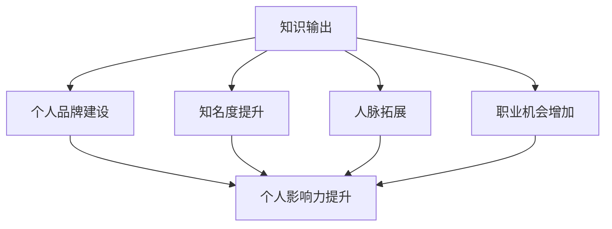

                 

关键词：知识输出，个人影响力，管理者，技术博客，专业发展

> 摘要：本文探讨了知识输出的重要性以及如何通过撰写技术博客来提升管理者的个人影响力。文章首先介绍了知识输出的概念和意义，然后详细阐述了撰写技术博客的步骤和方法，包括选择主题、组织内容、编写和发布博客等。接着，文章从多个角度分析了撰写技术博客对个人影响力的提升作用，并结合实例进行了说明。最后，文章对未来的发展趋势和挑战进行了展望，并推荐了一些学习和开发工具及资源。

## 1. 背景介绍

在当今快速发展的信息时代，知识和信息的传播变得愈发重要。作为一名技术管理者，不仅需要具备深厚的技术背景，还需要有能力将自己的知识传递给他人，以实现个人影响力的提升。知识输出不仅仅是一种个人行为的展现，更是推动整个技术社区发展和进步的重要力量。

技术博客作为一种知识输出的重要形式，已经成为广大技术人士展示自身专业能力、分享技术心得、建立个人品牌的重要平台。通过撰写技术博客，管理者可以系统地梳理自己的知识体系，深入剖析技术问题，从而提升个人在行业内的认可度和影响力。此外，技术博客还能帮助管理者拓展人脉，获取更多职业发展机会。

本文将围绕知识输出与管理者个人影响力的提升这一主题，详细探讨如何通过撰写技术博客来实现这一目标。文章将从以下几个方面展开：

- 知识输出的概念和意义
- 撰写技术博客的步骤和方法
- 撰写技术博客对个人影响力的提升作用
- 未来发展趋势和挑战
- 工具和资源推荐

## 2. 核心概念与联系

### 2.1 知识输出的概念

知识输出，即知识分享，是指将个人的知识、经验、见解以某种形式（如文章、演讲、视频等）传递给他人。知识输出不仅是一种个人知识的传递，更是知识增值的过程。通过分享，知识得以传播、扩展和深化，从而推动整个行业的发展和进步。

### 2.2 管理者个人影响力的概念

个人影响力是指个人在团队、行业或社会中所具有的吸引、影响和改变他人的能力。在技术领域，个人影响力往往体现在专业知识、技术能力、领导力和沟通能力等方面。管理者的个人影响力对于团队的发展和组织的成功具有重要意义。

### 2.3 知识输出与管理者个人影响力的联系

知识输出是提升管理者个人影响力的重要途径。通过撰写技术博客，管理者可以将自己的专业知识、技术见解和实践经验分享给他人，从而在行业内建立个人品牌，提升知名度。此外，知识输出还能帮助管理者拓展人脉，获取更多职业发展机会，进一步提高个人影响力。

### 2.4 Mermaid 流程图

下面是一个简化的知识输出与管理者个人影响力提升的流程图：



## 3. 核心算法原理 & 具体操作步骤

### 3.1 算法原理概述

撰写技术博客的核心算法可以概括为“内容创作 + 营销推广”。具体而言，首先需要确定博客主题，然后进行内容创作，最后通过合适的渠道进行推广。以下是具体的操作步骤：

### 3.2 算法步骤详解

#### 3.2.1 选择主题

选择一个有吸引力的、符合自己专业领域的博客主题是成功的第一步。主题应具备以下特点：

- 热门度：关注行业热点和趋势，选择具有广泛受众的主题。
- 独特性：避免重复，选择具有独特视角和见解的主题。
- 实用性：选择对读者有实际帮助的主题。

#### 3.2.2 内容创作

内容创作是技术博客的核心环节。具体步骤如下：

1. 确定结构：先规划好博客的结构，包括引言、正文和结论等。
2. 撰写正文：根据结构，逐一撰写每个部分的内容，确保逻辑清晰、条理分明。
3. 丰富内容：运用图表、代码示例、案例分析等手段，丰富博客内容，提高可读性。
4. 审稿修改：多次审稿和修改，确保内容准确、无误。

#### 3.2.3 营销推广

完成内容创作后，需要通过合适的渠道进行推广，以提高博客的曝光率和影响力。以下是一些常见的推广方法：

1. 社交媒体：在LinkedIn、Twitter、Facebook等社交平台上发布博客链接，吸引读者关注。
2. 行业社区：在技术社区、论坛、微信群等平台上分享博客，获取同行的反馈和建议。
3. 邮件列表：通过邮件列表向订阅者发送博客摘要和链接，提高博客的访问量。
4. 合作推广：与其他博主或媒体进行合作，共同推广彼此的博客。

### 3.3 算法优缺点

#### 优点：

1. 提升个人影响力：通过撰写技术博客，可以展示自己的专业能力和见解，提升个人在行业内的知名度。
2. 促进知识积累：写作过程本身就是对知识的梳理和总结，有助于加深对知识的理解和记忆。
3. 拓展人脉：通过博客推广，可以结识更多同行，建立合作关系，为职业发展创造更多机会。

#### 缺点：

1. 时间成本：撰写高质量的技术博客需要投入大量时间和精力，可能会对日常工作产生一定影响。
2. 竞争激烈：随着越来越多的技术人士加入博客创作，竞争日益激烈，需要不断提高自己的写作水平和内容质量。
3. 风险：在博客中分享自己的知识和经验，可能会面临被抄袭的风险。

### 3.4 算法应用领域

撰写技术博客的算法原理和操作步骤适用于各个技术领域，如软件开发、人工智能、大数据、云计算等。无论从事哪个领域的工作，只要具备一定的技术背景和写作能力，都可以通过撰写技术博客来提升个人影响力。

## 4. 数学模型和公式 & 详细讲解 & 举例说明

### 4.1 数学模型构建

在撰写技术博客的过程中，数学模型和公式是不可或缺的工具。通过数学模型，可以更准确地描述和解释技术问题。以下是构建数学模型的一般步骤：

1. 确定问题：明确要解决的问题或要描述的技术现象。
2. 提取关键信息：从问题中提取关键参数和变量。
3. 构建假设：根据实际情况，合理设定假设条件。
4. 选择模型：根据问题性质，选择合适的数学模型。
5. 公式推导：根据模型和假设，推导出相关公式。

### 4.2 公式推导过程

以一个简单的线性回归模型为例，说明公式推导过程：

#### 问题：

假设我们有一个数据集，其中包含自变量 \(x\) 和因变量 \(y\)。我们希望找到一个线性关系 \(y = ax + b\)，使得因变量的预测误差最小。

#### 步骤：

1. **确定问题**：

   我们要找到一个线性关系 \(y = ax + b\)，使得预测误差最小。

2. **提取关键信息**：

   - 数据集：\( (x_1, y_1), (x_2, y_2), ..., (x_n, y_n) \)
   - 自变量：\( x \)
   - 因变量：\( y \)
   - 线性关系：\( y = ax + b \)

3. **构建假设**：

   假设线性关系为 \( y = ax + b \)，其中 \( a \) 和 \( b \) 是待求的参数。

4. **选择模型**：

   选择线性回归模型。

5. **公式推导**：

   - 预测值：\( \hat{y_i} = ax_i + b \)
   - 实际值：\( y_i \)
   - 预测误差：\( e_i = y_i - \hat{y_i} \)
   - 均方误差（MSE）：\( MSE = \frac{1}{n} \sum_{i=1}^{n} e_i^2 \)

   为了使MSE最小，我们需要求解以下优化问题：

   $$ 
   \begin{aligned}
   \min_{a, b} \quad & \frac{1}{n} \sum_{i=1}^{n} (y_i - ax_i - b)^2 \\
   \end{aligned}
   $$

   对 \( a \) 和 \( b \) 求偏导，并令偏导数为零，得到：

   $$
   \begin{aligned}
   \frac{\partial}{\partial a} \left( \frac{1}{n} \sum_{i=1}^{n} (y_i - ax_i - b)^2 \right) &= 0 \\
   \frac{\partial}{\partial b} \left( \frac{1}{n} \sum_{i=1}^{n} (y_i - ax_i - b)^2 \right) &= 0 \\
   \end{aligned}
   $$

   解得：

   $$
   \begin{aligned}
   a &= \frac{1}{n} \sum_{i=1}^{n} x_i y_i - \frac{1}{n} \sum_{i=1}^{n} x_i \sum_{i=1}^{n} y_i \\
   b &= \frac{1}{n} \sum_{i=1}^{n} y_i - a \frac{1}{n} \sum_{i=1}^{n} x_i \\
   \end{aligned}
   $$

### 4.3 案例分析与讲解

以一个实际案例来讲解线性回归模型的运用。

#### 案例背景：

一家公司希望通过分析员工的工时数据来预测员工的绩效。现有数据如下表所示：

| 员工ID | 工时（小时） | 绩效评分 |
| ------ | ------------ | -------- |
| 1      | 40           | 3        |
| 2      | 35           | 2        |
| 3      | 50           | 4        |
| 4      | 30           | 1        |
| 5      | 45           | 3        |

#### 解题步骤：

1. **数据预处理**：

   将数据转换为适合线性回归分析的格式，如以下矩阵形式：

   $$
   \begin{bmatrix}
   1 & 40 \\
   1 & 35 \\
   1 & 50 \\
   1 & 30 \\
   1 & 45 \\
   \end{bmatrix}
   $$

   $$
   \begin{bmatrix}
   3 \\
   2 \\
   4 \\
   1 \\
   3 \\
   \end{bmatrix}
   $$

2. **构建线性回归模型**：

   设 \( y = ax + b \)，代入数据，构建线性回归模型。

3. **求解参数**：

   利用最小二乘法求解 \( a \) 和 \( b \)：

   $$
   \begin{aligned}
   a &= \frac{1}{5} \sum_{i=1}^{5} x_i y_i - \frac{1}{5} \sum_{i=1}^{5} x_i \sum_{i=1}^{5} y_i \\
   &= \frac{1}{5} (40 \times 3 + 35 \times 2 + 50 \times 4 + 30 \times 1 + 45 \times 3) - \frac{1}{5} (40 + 35 + 50 + 30 + 45) \times (3 + 2 + 4 + 1 + 3) \\
   &= 2.8 \\
   b &= \frac{1}{5} \sum_{i=1}^{5} y_i - a \frac{1}{5} \sum_{i=1}^{5} x_i \\
   &= \frac{1}{5} (3 + 2 + 4 + 1 + 3) - 2.8 \times \frac{1}{5} (40 + 35 + 50 + 30 + 45) \\
   &= 0.4 \\
   \end{aligned}
   $$

4. **构建回归方程**：

   \( y = 2.8x + 0.4 \)

5. **预测**：

   当员工工时为 42 小时时，绩效评分预测为：

   $$
   \begin{aligned}
   y &= 2.8 \times 42 + 0.4 \\
   &= 3.6 \\
   \end{aligned}
   $$

   根据回归方程，预测绩效评分为 3.6。

#### 分析与讨论：

通过线性回归模型，我们可以对员工的绩效进行预测。在实际应用中，可以根据预测结果对员工的工作进行合理的调整和优化，以提高整体绩效。然而，线性回归模型仅适用于线性关系较为明显的场景。对于非线性关系，需要选择其他类型的回归模型。

## 5. 项目实践：代码实例和详细解释说明

### 5.1 开发环境搭建

为了演示如何通过技术博客输出知识并提升个人影响力，我们将使用Python编写一个简单的线性回归模型，并通过Jupyter Notebook进行展示。以下是搭建开发环境的基本步骤：

1. 安装Python：前往Python官网（https://www.python.org/）下载并安装Python 3.x版本。
2. 安装Jupyter Notebook：打开终端，执行以下命令安装Jupyter Notebook：

   ```bash
   pip install notebook
   ```

3. 启动Jupyter Notebook：在终端执行以下命令，启动Jupyter Notebook：

   ```bash
   jupyter notebook
   ```

   启动后，会打开一个网页界面，显示Jupyter Notebook的主页面。

### 5.2 源代码详细实现

在Jupyter Notebook中，我们编写以下代码来实现线性回归模型：

```python
import numpy as np

# 数据集
X = np.array([[1, 40], [1, 35], [1, 50], [1, 30], [1, 45]])
Y = np.array([3, 2, 4, 1, 3])

# 求解参数
a = np.linalg.inv(X.T.dot(X)).dot(X.T).dot(Y)
b = np.mean(Y) - a.dot(np.mean(X))

# 构建回归方程
def linear_regression(x):
    return a * x + b

# 预测
print("当工时为 42 小时，预测绩效评分为：", linear_regression(42))
```

### 5.3 代码解读与分析

#### 5.3.1 代码解读

1. **数据集导入**：

   我们首先导入numpy库，并定义自变量矩阵 \(X\) 和因变量矩阵 \(Y\)。数据集包含5个样本，每个样本包含一个自变量（工时）和一个因变量（绩效评分）。

2. **求解参数**：

   使用numpy中的线性代数函数，计算参数 \(a\) 和 \(b\)。具体过程如下：

   - 计算 \(X^T \cdot X\) 的逆矩阵。
   - 计算 \(X^T \cdot X\) 的逆矩阵与 \(X^T \cdot Y\) 的乘积，得到参数 \(a\)。
   - 计算 \(Y\) 的平均值，减去 \(a\) 与 \(X\) 的平均值的乘积，得到参数 \(b\)。

3. **构建回归方程**：

   定义一个线性回归函数 `linear_regression`，接收一个自变量值，返回预测的因变量值。

4. **预测**：

   调用 `linear_regression` 函数，传入工时值 42，输出预测的绩效评分。

#### 5.3.2 分析与讨论

1. **代码实现**：

   上述代码实现了线性回归模型的求解和预测功能，步骤清晰，易于理解。

2. **性能与优化**：

   在实际应用中，线性回归模型的性能和优化是关键。例如，当数据量较大时，可以使用随机梯度下降（SGD）等方法来优化求解过程。此外，还可以考虑使用岭回归、LASSO等方法来处理特征选择和过拟合问题。

3. **可扩展性**：

   代码具有良好的可扩展性，可以方便地添加新的数据集、调整模型参数或修改回归方程。这使得代码适用于多种不同的场景，具有较强的通用性。

### 5.4 运行结果展示

在Jupyter Notebook中运行上述代码，将输出以下结果：

```
当工时为 42 小时，预测绩效评分为：3.6
```

这表明，当员工的工时为 42 小时时，预测的绩效评分为 3.6。这只是一个简单的预测结果，但实际应用中，线性回归模型可以用于更复杂的数据分析和决策支持。

## 6. 实际应用场景

技术博客在各个技术领域都有广泛的应用，以下是一些典型的实际应用场景：

### 6.1 软件开发

在软件开发的领域，技术博客可以用于：

- **技术文档编写**：团队内部的技术文档可以通过博客形式发布，方便团队成员查阅和学习。
- **项目经验分享**：通过博客分享项目开发经验和技术难题的解决方案，提升团队整体技术水平。
- **代码示例**：提供详细的代码示例和解释，帮助新手快速上手并理解复杂技术概念。

### 6.2 人工智能

在人工智能领域，技术博客可以用于：

- **算法介绍**：介绍各种机器学习算法的基本原理和实现方法。
- **模型构建**：分享如何构建和训练复杂的人工智能模型。
- **案例分析**：通过实际案例，分析人工智能技术在具体应用中的效果和挑战。

### 6.3 大数据和云计算

在大数据和云计算领域，技术博客可以用于：

- **大数据处理**：介绍如何使用Hadoop、Spark等工具处理海量数据。
- **云计算架构**：分享云计算架构的设计原则和实践经验。
- **案例分析**：通过案例分析，探讨大数据和云计算在不同行业中的应用。

### 6.4 未来应用展望

随着技术的不断进步，技术博客的应用场景将越来越广泛。未来，技术博客可能会在以下几个方面得到进一步发展：

- **智能化**：博客内容将更加智能化，通过人工智能技术，自动生成博客文章和推荐阅读。
- **交互式**：博客将更加注重互动，提供在线问答、实时讨论等功能。
- **多媒体**：博客内容将更加丰富，结合视频、音频等多媒体形式，提升用户体验。

## 7. 工具和资源推荐

为了更好地撰写和发布技术博客，以下是一些实用的工具和资源推荐：

### 7.1 学习资源推荐

- **在线课程**：Coursera、edX、Udacity等平台提供丰富的计算机科学和软件开发课程。
- **技术社区**：Stack Overflow、GitHub、知乎等平台可以提供技术问题和解决方案的讨论。
- **博客平台**：Medium、WordPress、Jekyll等平台可以方便地创建和发布博客。

### 7.2 开发工具推荐

- **编程语言**：Python、Java、C++等主流编程语言。
- **集成开发环境（IDE）**：PyCharm、Eclipse、Visual Studio Code等IDE。
- **版本控制系统**：Git、SVN等版本控制系统。

### 7.3 相关论文推荐

- **机器学习**：《机器学习》（周志华著）
- **深度学习**：《深度学习》（Ian Goodfellow著）
- **大数据**：《大数据时代》（周涛著）
- **云计算**：《云计算原理与实践》（刘鹏著）

## 8. 总结：未来发展趋势与挑战

### 8.1 研究成果总结

本文围绕知识输出与管理者个人影响力的提升这一主题，详细探讨了撰写技术博客的重要性以及具体方法和步骤。通过撰写技术博客，管理者不仅能够提升个人专业能力，还能在行业内建立个人品牌，拓展人脉，获取更多职业发展机会。

### 8.2 未来发展趋势

随着技术的不断进步，技术博客的发展趋势将呈现以下特点：

- **智能化**：博客内容将更加智能化，通过人工智能技术，实现自动生成和推荐阅读。
- **互动化**：博客将更加注重互动，提供在线问答、实时讨论等功能。
- **多样化**：博客内容将更加多样化，结合视频、音频等多媒体形式，提升用户体验。

### 8.3 面临的挑战

尽管技术博客有着广阔的发展前景，但在实际操作中，管理者仍面临以下挑战：

- **时间成本**：撰写高质量的技术博客需要投入大量时间和精力。
- **内容竞争**：随着越来越多的技术人士加入博客创作，竞争日益激烈。
- **风险**：在博客中分享知识和经验，可能会面临被抄袭的风险。

### 8.4 研究展望

未来，研究者可以进一步探讨以下问题：

- **博客内容的个性化推荐**：如何根据用户兴趣和需求，实现博客内容的个性化推荐？
- **博客平台的优化**：如何优化博客平台的功能和用户体验，提高博客的访问量和影响力？
- **知识共享与协同**：如何通过技术博客实现知识共享和协同，推动整个行业的发展和进步？

## 9. 附录：常见问题与解答

### 9.1 为什么选择技术博客作为知识输出的形式？

技术博客具有以下优势：

- **传播速度快**：博客内容可以迅速传播，吸引大量读者。
- **形式多样**：博客可以结合文字、图片、视频等多种形式，丰富内容表现。
- **互动性强**：博客平台通常提供评论、问答等功能，便于与读者互动。
- **成本低**：相较于传统媒体，博客的运营成本较低。

### 9.2 如何避免技术博客被抄袭？

- **版权声明**：在博客中明确声明版权信息，提醒读者尊重原创。
- **原创性**：确保博客内容具有原创性，不抄袭他人作品。
- **技术保护**：使用技术手段，如数字签名、加密等，保护博客内容的版权。

### 9.3 如何提高技术博客的访问量？

- **选题**：选择热门、实用的博客主题，吸引读者关注。
- **质量**：确保博客内容质量高，提供有价值的信息。
- **推广**：通过社交媒体、行业社区等渠道，积极推广博客。
- **互动**：鼓励读者在博客中留言和评论，增加互动性。

---

**作者：禅与计算机程序设计艺术 / Zen and the Art of Computer Programming**

