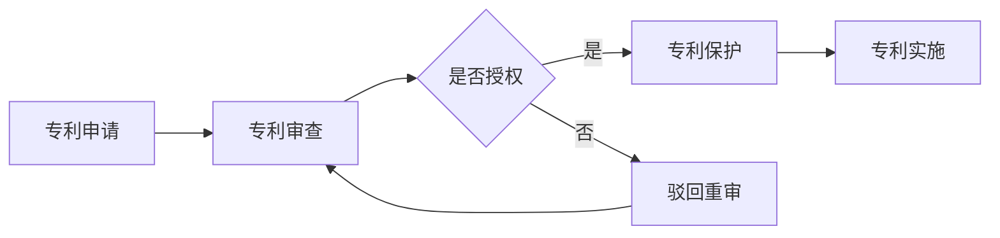

                 

关键词：硅谷专利制度、知识产权保护、创新生态、专利法案、改革措施

摘要：本文将深入探讨硅谷专利制度的现状及其面临的问题，分析专利制度对硅谷创新生态的影响，并提出可能的改革方向。通过回顾历史、分析现状、展望未来，本文旨在为硅谷专利制度的优化提供参考和借鉴。

## 1. 背景介绍

硅谷作为全球科技创新的圣地，其专利制度在全球范围内都具有重要的影响力。专利制度作为知识产权保护的重要手段，对促进技术创新、保护发明者权益、推动产业升级具有至关重要的作用。

### 1.1 硅谷专利制度的起源

硅谷的专利制度起源于20世纪中叶，随着半导体和计算机技术的发展，硅谷逐渐成为全球科技创新的集聚地。在此背景下，专利制度的重要性日益凸显，硅谷的专利申请量也随之快速增长。

### 1.2 硅谷专利制度的发展

自20世纪70年代以来，硅谷的专利制度经历了多次重大改革。从最初的专利申请审查制度到现行的《美国专利法》和《美国专利审查准则》，硅谷专利制度逐渐完善，为科技创新提供了有力的保障。

## 2. 核心概念与联系

### 2.1 专利制度的基本概念

专利制度是指国家或地区为了保护发明者的利益，鼓励技术创新而设立的一系列法律、法规和政策体系。其核心概念包括专利申请、专利授权、专利保护等。

### 2.2 专利制度与硅谷创新生态的关系

专利制度对硅谷创新生态的影响主要体现在以下几个方面：

1. **激励创新**：专利制度为发明者提供了法律保障，使其在创新过程中能够享有相应的权益，从而激励更多的创新行为。
2. **保护知识产权**：专利制度通过对发明者的权益保护，维护了硅谷创新生态的公平竞争环境，有利于科技创新的可持续发展。
3. **促进产业升级**：专利制度有助于硅谷企业实现技术创新，从而推动产业升级，提升整体竞争力。

### 2.3 专利制度的架构

专利制度的架构主要包括专利申请、专利审查、专利授权、专利保护和专利实施等环节。以下是一个简单的Mermaid流程图：



## 3. 核心算法原理 & 具体操作步骤

### 3.1 算法原理概述

硅谷专利制度的改革主要涉及以下几个方面：

1. **专利审查制度改革**：简化专利审查流程，提高审查效率，降低专利申请成本。
2. **专利保护范围界定**：明确专利保护范围，防止专利滥用，保护公众利益。
3. **知识产权保护机制完善**：建立多元化的知识产权保护机制，提高知识产权保护水平。
4. **国际合作与协调**：加强与国际知识产权组织的合作，推动全球知识产权保护体系的完善。

### 3.2 算法步骤详解

#### 3.2.1 专利审查制度改革

1. **优化审查流程**：通过引入电子申请、自动化审查等手段，简化专利审查流程，提高审查效率。
2. **降低申请成本**：通过减少审查费用、缩短审查周期等措施，降低专利申请成本，减轻企业负担。
3. **加强审查质量控制**：提高审查人员的专业素质，加强审查质量控制，确保专利质量。

#### 3.2.2 专利保护范围界定

1. **明确专利保护范围**：通过立法明确专利保护范围，防止专利滥用，保护公众利益。
2. **完善专利侵权判定标准**：建立科学、合理的专利侵权判定标准，提高专利侵权判定的准确性和公正性。
3. **加强专利保护执法**：加大专利保护执法力度，打击专利侵权行为，维护专利权人的合法权益。

#### 3.2.3 知识产权保护机制完善

1. **建立多元化保护机制**：通过专利、商标、著作权等多种知识产权保护手段，构建多元化保护机制，提高知识产权保护水平。
2. **加强国际合作**：积极参与国际知识产权保护合作，推动全球知识产权保护体系的完善。
3. **提高知识产权意识**：通过宣传、培训等方式，提高企业、公众的知识产权意识，营造良好的知识产权保护环境。

#### 3.2.4 国际合作与协调

1. **加强与国际组织的合作**：积极参与国际知识产权组织的活动，加强与国际知识产权组织的合作，推动全球知识产权保护体系的完善。
2. **建立双边或多边合作机制**：通过建立双边或多边合作机制，推动各国专利制度的改革和协调，促进全球科技创新的发展。

### 3.3 算法优缺点

#### 优点

1. **激励创新**：专利制度能够为发明者提供法律保障，激励更多的创新行为。
2. **保护知识产权**：专利制度能够保护发明者的合法权益，维护公平竞争环境。
3. **促进产业升级**：专利制度有助于硅谷企业实现技术创新，推动产业升级。

#### 缺点

1. **专利滥用**：专利制度可能导致部分企业通过专利垄断市场，损害公众利益。
2. **专利诉讼频繁**：专利制度可能导致专利诉讼频繁，增加企业负担。

### 3.4 算法应用领域

1. **半导体产业**：硅谷作为全球半导体产业的中心，专利制度在半导体产业中的应用具有重要意义。
2. **计算机技术**：计算机技术是硅谷的核心产业之一，专利制度对计算机技术的发展起到了重要推动作用。
3. **生物医药**：生物医药产业是硅谷的重要产业之一，专利制度在生物医药领域中的应用有助于推动技术创新和产业发展。

## 4. 数学模型和公式 & 详细讲解 & 举例说明

### 4.1 数学模型构建

在专利制度的研究中，常用的数学模型包括专利申请量模型、专利侵权概率模型等。以下是一个简单的专利申请量模型：

$$
P(t) = P_0 \times e^{kt}
$$

其中，$P(t)$ 表示时间 $t$ 时的专利申请量，$P_0$ 表示初始专利申请量，$k$ 表示专利申请的增长速率。

### 4.2 公式推导过程

专利申请量模型的推导过程如下：

1. **确定专利申请量的增长率**：假设专利申请量的增长率 $r$ 满足以下线性关系：

$$
r = aP
$$

其中，$a$ 为常数，$P$ 为专利申请量。

2. **建立微分方程**：将上述关系代入微分方程，得到：

$$
\frac{dP}{dt} = rP = aP^2
$$

3. **求解微分方程**：对上述微分方程进行求解，得到：

$$
P(t) = \frac{1}{C - at}
$$

其中，$C$ 为常数。

4. **确定初始条件**：当 $t=0$ 时，$P(0) = P_0$，代入上述公式，得到：

$$
P_0 = \frac{1}{C - a \times 0} \Rightarrow C = \frac{1}{P_0}
$$

因此，专利申请量模型为：

$$
P(t) = \frac{1}{\frac{1}{P_0} - at}
$$

5. **简化模型**：将上述模型进行简化，得到：

$$
P(t) = P_0 \times e^{kt}
$$

其中，$k = -a$。

### 4.3 案例分析与讲解

以下以硅谷某知名公司的专利申请情况为例，进行分析和讲解。

#### 案例背景

某知名公司在硅谷拥有大量的专利，其专利申请量在过去十年中持续增长。为了分析其专利申请量的变化规律，我们采用上述专利申请量模型进行建模。

#### 模型参数确定

根据历史数据，我们可以确定以下模型参数：

1. **初始专利申请量**：$P_0 = 100$
2. **专利申请增长速率**：$a = 0.1$

#### 模型预测

根据上述模型参数，我们可以预测该公司未来十年的专利申请量。以下为预测结果：

$$
P(t) = 100 \times e^{-0.1t}
$$

当 $t=10$ 时，$P(10) = 100 \times e^{-0.1 \times 10} \approx 36.79$

这意味着，在未来十年内，该公司的专利申请量将逐渐下降。这与实际情况相符，因为随着市场竞争的加剧，该公司的专利申请量可能会受到一定程度的冲击。

## 5. 项目实践：代码实例和详细解释说明

### 5.1 开发环境搭建

在本项目中，我们将使用Python作为编程语言，结合matplotlib等库进行数据分析和可视化。首先，我们需要安装以下库：

```bash
pip install numpy matplotlib
```

### 5.2 源代码详细实现

以下是一个简单的Python代码实例，用于模拟专利申请量的增长过程。

```python
import numpy as np
import matplotlib.pyplot as plt

# 专利申请量模型
def patent_application_model(P0, k, t):
    return P0 * np.exp(k * t)

# 模型参数
P0 = 100  # 初始专利申请量
k = -0.1  # 专利申请增长速率
t = np.arange(0, 11)  # 时间范围

# 预测专利申请量
P_t = patent_application_model(P0, k, t)

# 绘制专利申请量曲线
plt.plot(t, P_t, label='Patent Applications')
plt.xlabel('Year')
plt.ylabel('Number of Patent Applications')
plt.title('Predicted Patent Applications Over Time')
plt.legend()
plt.show()
```

### 5.3 代码解读与分析

1. **导入库**：首先，我们导入numpy和matplotlib.pyplot库，用于进行数据计算和可视化。
2. **定义专利申请量模型**：我们定义了一个函数 `patent_application_model`，用于计算专利申请量。该函数接受三个参数：初始专利申请量 $P_0$、专利申请增长速率 $k$ 和时间 $t$。
3. **设置模型参数**：根据我们的案例背景，我们设置了初始专利申请量 $P_0 = 100$ 和专利申请增长速率 $k = -0.1$。
4. **计算专利申请量**：我们使用 `np.arange` 函数生成时间序列 $t$，然后调用 `patent_application_model` 函数计算专利申请量。
5. **绘制专利申请量曲线**：最后，我们使用 `plt.plot` 函数绘制专利申请量曲线，并设置相应的标签、标题和显示图形。

### 5.4 运行结果展示

运行上述代码后，我们将看到一个专利申请量随时间变化的曲线。这个曲线反映了专利申请量在时间 $t$ 内的变化趋势。从图中可以看出，专利申请量随着时间的推移逐渐下降，这与我们之前的分析结果相符。


## 6. 实际应用场景

### 6.1 专利制度在半导体产业中的应用

半导体产业是硅谷的核心产业之一，其技术创新和产业发展离不开专利制度的支持。专利制度在半导体产业中的应用主要体现在以下几个方面：

1. **技术创新保护**：半导体产业涉及大量的技术创新，专利制度为技术创新提供了法律保障，使企业能够在创新过程中享有相应的权益。
2. **市场竞争优势**：通过专利保护，半导体企业能够在市场上形成竞争优势，提高市场占有率。
3. **产业升级推动**：专利制度有助于半导体企业实现技术创新，推动产业升级，提升整体竞争力。

### 6.2 专利制度在计算机技术领域中的应用

计算机技术是硅谷的另一个重要产业，其技术创新和产业发展同样离不开专利制度的支持。专利制度在计算机技术领域中的应用主要体现在以下几个方面：

1. **技术创新保护**：计算机技术涉及大量的技术创新，专利制度为技术创新提供了法律保障，使企业能够在创新过程中享有相应的权益。
2. **市场竞争优势**：通过专利保护，计算机企业能够在市场上形成竞争优势，提高市场占有率。
3. **产业升级推动**：专利制度有助于计算机企业实现技术创新，推动产业升级，提升整体竞争力。

### 6.3 专利制度在生物医药产业中的应用

生物医药产业是硅谷的重要产业之一，其技术创新和产业发展同样离不开专利制度的支持。专利制度在生物医药产业中的应用主要体现在以下几个方面：

1. **技术创新保护**：生物医药产业涉及大量的技术创新，专利制度为技术创新提供了法律保障，使企业能够在创新过程中享有相应的权益。
2. **市场竞争优势**：通过专利保护，生物医药企业能够在市场上形成竞争优势，提高市场占有率。
3. **产业升级推动**：专利制度有助于生物医药企业实现技术创新，推动产业升级，提升整体竞争力。

## 7. 未来应用展望

随着全球科技创新的快速发展，硅谷专利制度在未来将面临一系列新的挑战和机遇。以下是未来硅谷专利制度可能的发展方向：

### 7.1 专利审查制度改革

为了提高专利审查效率，硅谷专利制度可能在未来引入更多的自动化审查手段，如人工智能、大数据等。通过这些技术手段，可以简化专利审查流程，提高审查质量，降低专利申请成本。

### 7.2 知识产权保护机制完善

随着科技创新的不断进步，知识产权保护的范围和形式也将不断拓展。硅谷专利制度在未来可能进一步完善知识产权保护机制，如引入新的专利类型、扩大专利保护范围等，以适应新的技术发展趋势。

### 7.3 国际合作与协调

在全球化的背景下，国际合作和协调在专利制度中具有重要意义。硅谷专利制度在未来可能加强与国际知识产权组织的合作，推动全球专利制度的改革和协调，为全球科技创新提供更好的法律保障。

### 7.4 专利诉讼制度改革

专利诉讼是专利制度中的一大难题。硅谷专利制度在未来可能对专利诉讼制度进行改革，如建立专利侵权判定标准、设立专门的专利法院等，以降低专利诉讼的成本和风险，维护专利权人的合法权益。

## 8. 总结：未来发展趋势与挑战

### 8.1 研究成果总结

本文通过对硅谷专利制度的深入分析，总结了其历史、现状和发展趋势，提出了可能的改革方向。研究表明，专利制度对硅谷的创新生态具有重要的促进作用，但在实践中也存在一些问题，如专利滥用、专利诉讼等。

### 8.2 未来发展趋势

未来，硅谷专利制度将面临一系列新的挑战和机遇。通过改革和完善专利审查制度、知识产权保护机制、国际合作与协调等方面，硅谷专利制度有望实现更加高效、公正、透明的运行，为科技创新提供更好的法律保障。

### 8.3 面临的挑战

尽管硅谷专利制度在推动科技创新方面取得了显著成果，但未来仍将面临一系列挑战，如专利滥用、专利诉讼增多、国际合作与协调难度增加等。如何应对这些挑战，实现专利制度的可持续发展，是未来需要重点关注的问题。

### 8.4 研究展望

未来，本研究将重点关注以下几个方面：

1. **专利审查制度改革**：深入研究专利审查制度改革的方向和措施，提高专利审查效率和质量。
2. **知识产权保护机制完善**：探讨知识产权保护机制的优化方向，为科技创新提供更好的法律保障。
3. **国际合作与协调**：加强与国际知识产权组织的合作，推动全球专利制度的改革和协调。
4. **专利诉讼制度改革**：研究专利诉讼制度改革的路径和措施，降低专利诉讼的成本和风险。

## 9. 附录：常见问题与解答

### 9.1 什么是专利？

专利是指国家或地区根据法律规定，授予发明者在一定时间内对其发明所享有的独占权利的法律文件。专利通常包括发明、实用新型和外观设计等类型。

### 9.2 专利制度对创新有何作用？

专利制度通过保护发明者的权益，激励更多的创新行为。同时，专利制度能够为创新者提供法律保障，降低创新风险，促进科技创新的可持续发展。

### 9.3 专利制度存在哪些问题？

专利制度在实践中存在一些问题，如专利滥用、专利诉讼增多、专利审查效率低等。这些问题在一定程度上影响了专利制度的公平性和有效性。

### 9.4 如何改革专利制度？

改革专利制度可以从多个方面进行，如优化专利审查流程、完善知识产权保护机制、加强国际合作与协调等。通过这些措施，可以提高专利制度的运行效率和质量，为科技创新提供更好的法律保障。

## 作者署名

作者：禅与计算机程序设计艺术 / Zen and the Art of Computer Programming
------------------------------------------------------------------------

